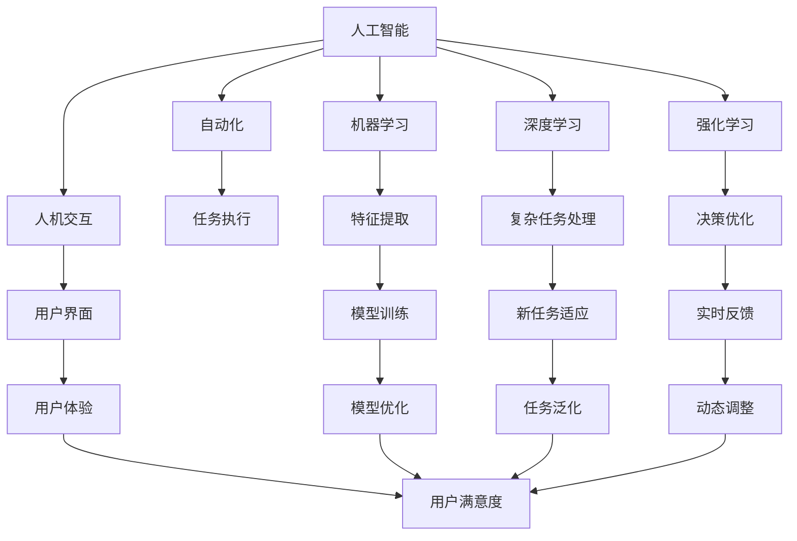

                 

# 人机协作新篇章：共创智能未来新时代

> 关键词：人工智能,人机协作,智能未来,自动化,数据驱动,人机交互

## 1. 背景介绍

### 1.1 问题由来
随着科技的飞速发展和互联网的广泛应用，人类社会的生产力和生活方式正在发生深刻变革。人工智能（AI）技术的迅猛进步，尤其是深度学习和大数据技术的崛起，已经深刻影响着各个行业的运行模式。无论是制造业的自动化生产线，还是金融行业的智能投顾，甚至是医疗行业的精准诊断，人工智能正在引领一个全新的智能未来新时代。

然而，在人工智能取得这些巨大成就的同时，也带来了诸多挑战。机器的智能虽然显著提升，但在很多任务中仍然需要人类干预和协作。传统的人机交互方式常常制约着AI技术的应用，难以充分发挥其潜力。人机协作，这一新兴领域应运而生，成为推动人工智能向更高效、更智能化方向发展的关键路径。

### 1.2 问题核心关键点
人机协作的核心在于充分发挥人工智能与人类智能的互补优势，实现两者的协同工作。具体来说，关键点包括：

- **数据驱动决策**：利用人工智能处理海量数据，提取出有价值的信息，辅助人类进行决策。
- **自动化任务处理**：通过AI自动化执行重复性、高风险的任务，释放人类从繁琐工作中解放出来。
- **人机交互优化**：设计和实现高效、直观、易用的用户界面，提升人机互动体验。
- **实时反馈和调整**：通过人工智能实时监测和分析工作状态，及时给出反馈和调整建议。
- **持续学习和改进**：不断收集和利用用户反馈，持续优化AI算法和交互体验。

### 1.3 问题研究意义
研究人机协作，对于提升人工智能的应用价值，推动各个行业智能化转型，具有重要意义：

1. **提升生产效率**：通过人机协作，大幅提高生产过程的自动化程度，减少人为错误，提升生产效率。
2. **降低成本和风险**：自动化处理高风险任务，降低意外事件发生的概率，减少事故对企业的经济损失。
3. **增强用户体验**：通过优化人机交互，提升用户满意度和信任度，增强用户黏性。
4. **实现知识共享**：利用人工智能记录和分析用户行为数据，积累知识，实现经验传承。
5. **促进技术创新**：人机协作推动技术突破和应用创新，催生更多智能应用的产生。

## 2. 核心概念与联系

### 2.1 核心概念概述

为更好地理解人机协作的原理和技术实现，本节将介绍几个关键概念：

- **人工智能(AI)**：通过计算机模拟人类智能，实现信息处理、决策制定、自主学习等功能。
- **自动化(Automation)**：指通过机器自动执行重复性、规则性任务，减少人工干预。
- **人机交互(Human-Computer Interaction, HCI)**：研究人类与计算机之间的交互方式，提高交互效率和用户体验。
- **机器学习(Machine Learning, ML)**：利用数据训练算法模型，使机器具备一定的自主学习能力。
- **深度学习(Deep Learning, DL)**：一种基于神经网络的机器学习方法，能处理复杂的数据结构和任务。
- **强化学习(Reinforcement Learning, RL)**：通过奖励和惩罚机制，训练智能体完成特定目标任务。

这些概念之间相互关联，构成了人机协作的基石。人工智能提供了智能决策的能力，自动化实现了任务执行的自动化，人机交互优化了用户体验，机器学习使得模型能够从数据中学习，深度学习则使模型具备更强的特征提取能力，强化学习通过奖励机制优化决策。这些技术协同作用，为人机协作提供了强大支持。

### 2.2 核心概念原理和架构的 Mermaid 流程图



## 3. 核心算法原理 & 具体操作步骤

### 3.1 算法原理概述

人机协作的核心算法原理，主要体现在以下几个方面：

1. **数据预处理**：收集和整理海量数据，通过预处理提取有用信息，为模型训练提供数据支持。
2. **模型训练与优化**：使用机器学习、深度学习等技术训练模型，通过优化算法提升模型性能。
3. **任务执行与监控**：将训练好的模型部署到生产环境中，通过自动化系统执行任务，并实时监控任务状态。
4. **人机交互设计**：设计和实现直观、易用的用户界面，增强人机协作效率。
5. **反馈与调整**：利用实时反馈机制，不断调整模型参数和用户界面，提升人机协作效果。

### 3.2 算法步骤详解

人机协作的算法步骤通常包括以下几个关键环节：

**Step 1: 数据收集与预处理**
- 收集与任务相关的数据，确保数据的多样性和代表性。
- 对数据进行清洗、去噪、归一化等预处理，提取关键特征。
- 使用标注数据进行有监督学习训练，未标注数据进行无监督学习训练。

**Step 2: 模型设计与训练**
- 根据任务需求，选择适合的模型架构，如线性回归、决策树、神经网络等。
- 使用训练数据集训练模型，通过交叉验证等技术进行模型选择和调参。
- 对模型进行评估，使用测试集验证模型性能，并根据结果进行优化调整。

**Step 3: 自动化任务执行**
- 将训练好的模型部署到自动化系统，实现任务的自动化执行。
- 设计监控系统，实时监测任务执行状态，收集运行数据。
- 根据运行数据反馈，动态调整模型参数和执行策略。

**Step 4: 人机交互优化**
- 设计和实现用户界面，确保用户操作直观、易用。
- 收集用户反馈，优化界面设计，提升用户体验。
- 设计交互协议，确保人机协作高效、流畅。

**Step 5: 持续学习和改进**
- 持续收集和分析用户行为数据，优化模型参数。
- 引入新的数据和任务，重新训练模型，提升模型适应性。
- 定期进行系统更新，修复bug，提升系统稳定性。

### 3.3 算法优缺点

人机协作的优势和挑战并存：

**优势：**
- **效率提升**：自动化执行任务，提升处理速度，减少人工干预。
- **决策优化**：利用机器学习模型，从数据中提取规律，提升决策质量。
- **用户体验提升**：通过优化人机交互，提升用户满意度和黏性。

**挑战：**
- **数据质量问题**：数据收集和处理不当，可能影响模型效果。
- **模型复杂性**：复杂的模型可能需要大量计算资源和存储空间。
- **人机交互设计难度**：设计和实现直观、易用的用户界面，对开发者要求较高。
- **隐私和安全问题**：用户数据的收集和存储可能涉及隐私和安全问题，需要严格保护。

### 3.4 算法应用领域

人机协作技术已经广泛应用于各个行业，具体包括：

- **制造与物流**：自动化生产线、智能仓储、物流配送等。
- **金融服务**：智能投顾、风险管理、金融分析等。
- **医疗健康**：智能诊断、健康监测、患者管理等。
- **零售电商**：个性化推荐、智能客服、库存管理等。
- **教育培训**：智能辅导、学习分析、在线教学等。
- **安全监控**：视频监控分析、入侵检测、安防系统等。
- **环境保护**：环境监测、污染预测、资源管理等。

## 4. 数学模型和公式 & 详细讲解 & 举例说明

### 4.1 数学模型构建

为了更好地理解人机协作的数学模型，本节将介绍几个核心的数学模型：

- **线性回归模型**：$y = \theta_0 + \theta_1x_1 + \theta_2x_2 + \cdots + \theta_nx_n$
- **决策树模型**：通过树形结构进行分类或回归，例如ID3、CART等。
- **神经网络模型**：$y = f(Wx + b)$，其中$f$为激活函数，$W$为权重矩阵，$b$为偏置向量。
- **深度学习模型**：如卷积神经网络(CNN)、循环神经网络(RNN)等。
- **强化学习模型**：$Q(s_t,a_t) = r_t + \gamma \max_a Q(s_{t+1},a)$，其中$Q$为状态-动作价值函数，$\gamma$为折扣因子。

### 4.2 公式推导过程

以下以线性回归模型为例，介绍模型的推导过程：

设有一组训练数据$(x_1, y_1), (x_2, y_2), \cdots, (x_m, y_m)$，其中$x_i = (x_{i1}, x_{i2}, \cdots, x_{in})$，$y_i$为预测目标。目标是最小化均方误差损失函数：

$$
\mathcal{L}(\theta) = \frac{1}{2m} \sum_{i=1}^m (y_i - f(x_i))^2
$$

其中$f(x_i) = \theta_0 + \theta_1x_{i1} + \theta_2x_{i2} + \cdots + \theta_nx_{in}$，$\theta$为模型参数。

对$\theta$求偏导数，得到梯度：

$$
\frac{\partial \mathcal{L}(\theta)}{\partial \theta_k} = \frac{1}{m} \sum_{i=1}^m (y_i - f(x_i))x_{ik}
$$

根据梯度下降算法，更新$\theta$：

$$
\theta_k \leftarrow \theta_k - \eta \frac{\partial \mathcal{L}(\theta)}{\partial \theta_k}
$$

其中$\eta$为学习率。

### 4.3 案例分析与讲解

以金融风险管理为例，介绍人机协作的应用：

**背景**：某金融机构希望利用机器学习模型进行风险评估和投资建议，需要构建一个自动化风险管理系统。

**数据**：收集历史交易数据，包括交易时间、股票代码、交易金额、收益率等。

**模型**：构建一个基于决策树的机器学习模型，用于预测股票收益率是否低于预期。

**训练**：使用历史交易数据进行模型训练，选择最优的决策树参数，并进行交叉验证。

**执行**：将训练好的模型部署到交易系统中，实时监测股票收益率，给出风险预警和投资建议。

**优化**：根据用户反馈，不断优化模型参数和界面设计，提升用户体验。

## 5. 项目实践：代码实例和详细解释说明

### 5.1 开发环境搭建

在进行人机协作开发前，我们需要准备好开发环境。以下是使用Python进行PyTorch开发的环境配置流程：

1. 安装Anaconda：从官网下载并安装Anaconda，用于创建独立的Python环境。

2. 创建并激活虚拟环境：
```bash
conda create -n pytorch-env python=3.8 
conda activate pytorch-env
```

3. 安装PyTorch：根据CUDA版本，从官网获取对应的安装命令。例如：
```bash
conda install pytorch torchvision torchaudio cudatoolkit=11.1 -c pytorch -c conda-forge
```

4. 安装各类工具包：
```bash
pip install numpy pandas scikit-learn matplotlib tqdm jupyter notebook ipython
```

完成上述步骤后，即可在`pytorch-env`环境中开始项目实践。

### 5.2 源代码详细实现

这里我们以金融风险管理为例，给出使用PyTorch构建和训练决策树模型的PyTorch代码实现。

首先，定义数据处理函数：

```python
import pandas as pd
from sklearn.model_selection import train_test_split
from sklearn.tree import DecisionTreeClassifier
from sklearn.metrics import accuracy_score

def read_data(file_path):
    data = pd.read_csv(file_path)
    features = data.drop(['target'], axis=1)
    labels = data['target']
    return features, labels

def preprocess_data(features, labels):
    features = features.fillna(features.mean())
    features = (features - features.mean()) / features.std()
    return features, labels

def train_model(X, y, model, test_size=0.2):
    X_train, X_test, y_train, y_test = train_test_split(X, y, test_size=test_size, random_state=42)
    model.fit(X_train, y_train)
    y_pred = model.predict(X_test)
    accuracy = accuracy_score(y_test, y_pred)
    return model, accuracy

# 加载数据
features, labels = read_data('data.csv')

# 数据预处理
features, labels = preprocess_data(features, labels)

# 模型训练与评估
model = DecisionTreeClassifier()
model, accuracy = train_model(features, labels, model)
print(f'模型准确率：{accuracy:.3f}')
```

然后，定义用户交互界面：

```python
import tkinter as tk

class RiskManagementGUI(tk.Tk):
    def __init__(self, model):
        super().__init__()
        self.title('金融风险管理系统')
        self.model = model
        self.feature_labels = ['交易时间', '股票代码', '交易金额', '收益率']
        self.create_widgets()

    def create_widgets(self):
        self.label = tk.Label(self, text='请输入交易信息')
        self.label.pack()

        self.entry = tk.Entry(self)
        self.entry.pack()

        self.button = tk.Button(self, text='提交', command=self.process_input)
        self.button.pack()

        self.result = tk.Label(self, text='')
        self.result.pack()

    def process_input(self):
        entry_text = self.entry.get()
        features = pd.read_csv(entry_text, header=None, names=self.feature_labels)
        features = features.values
        y_pred = self.model.predict(features)
        result = '高风险' if y_pred == 1 else '低风险'
        self.result.config(text=f'预测结果：{result}')

# 界面测试
if __name__ == '__main__':
    model = DecisionTreeClassifier()
    model, accuracy = train_model(features, labels, model)
    gui = RiskManagementGUI(model)
    gui.mainloop()
```

最后，启动交互界面：

```bash
python risk_management_gui.py
```

执行后，界面提示用户输入交易信息，根据输入信息实时进行风险评估，并给出风险预警。用户可以根据系统提示进行下一步操作。

### 5.3 代码解读与分析

让我们再详细解读一下关键代码的实现细节：

**read_data函数**：
- 读取CSV格式的数据文件，提取特征和标签。

**preprocess_data函数**：
- 对特征进行均值归一化，标准化处理，减少特征之间的差异。

**train_model函数**：
- 使用训练数据集进行模型训练，并进行交叉验证。

**RiskManagementGUI类**：
- 创建GUI界面，用户输入交易信息，系统进行风险评估，并给出结果。

**process_input方法**：
- 获取用户输入的特征数据，调用训练好的模型进行预测，并显示预测结果。

以上代码展示了如何构建一个基于决策树的金融风险管理系统。通过用户交互界面，系统可以实时监测交易信息，并进行风险评估，为用户提供决策支持。

## 6. 实际应用场景

### 6.1 智能制造系统

在制造业中，智能制造系统通过自动化和数据驱动的决策，大幅提升生产效率和质量。通过人机协作，智能制造系统可以实现以下功能：

**生产调度**：自动安排生产计划，优化资源配置，提高生产效率。
**质量检测**：通过机器视觉和传感器，实时检测产品质量，发现缺陷。
**设备维护**：预测设备故障，提前进行维护，减少停机时间。
**供应链管理**：自动生成库存和物流计划，优化供应链管理。
**个性化定制**：根据用户需求，定制化生产，提升客户满意度。

### 6.2 智能投顾系统

金融行业的智能投顾系统，通过人机协作，提供个性化、智能化的投资建议，提高投资收益。主要功能包括：

**投资分析**：利用机器学习模型，对市场数据进行分析和预测，生成投资报告。
**风险评估**：评估投资组合的风险水平，给出风险提示。
**交易执行**：根据投资策略，自动执行交易操作，减少人为误差。
**客户服务**：提供24/7的客户咨询服务，解答用户问题。
**数据监测**：实时监测市场波动，及时调整投资策略。

### 6.3 智慧医疗系统

智慧医疗系统通过人机协作，提升医疗服务的智能化水平，实现精准医疗。主要功能包括：

**电子病历管理**：自动整理和分析病历数据，生成诊断报告。
**辅助诊断**：利用机器学习模型，辅助医生进行诊断。
**药物推荐**：根据患者病情和历史用药记录，推荐最适合的药物。
**健康监测**：实时监测患者健康数据，及时发现异常。
**远程诊疗**：通过远程视频和语音互动，提供医疗咨询和诊断服务。

### 6.4 未来应用展望

未来，随着人工智能技术的不断进步，人机协作将广泛应用于更多领域，推动各行业的智能化转型。

在智能交通系统中，通过智能调度算法，优化交通流量，减少拥堵。在智能农业中，利用传感器和机器学习，实现精准农业，提高作物产量。在智能客服系统中，通过人机协作，提升客户服务质量，提高客户满意度。在智能教育中，通过智能辅导系统，提供个性化学习方案，提升学习效果。

## 7. 工具和资源推荐

### 7.1 学习资源推荐

为了帮助开发者系统掌握人机协作的理论基础和实践技巧，这里推荐一些优质的学习资源：

1. 《人工智能：一种现代方法》系列书籍：详细介绍了人工智能的基本概念和应用，是入门的好书。
2. 《深度学习》系列书籍：由深度学习领域的权威人士编写，系统讲解深度学习的基础和应用。
3. 《强化学习》系列书籍：讲解强化学习的理论基础和应用案例。
4. 在线课程：Coursera、Udacity等平台提供多种AI、ML、DL、RL等课程，适合不同层次的学习者。
5. 论文和报告：arXiv、IEEE、NIPS等平台提供大量AI领域的最新研究和进展。

通过对这些资源的学习实践，相信你一定能够快速掌握人机协作的精髓，并用于解决实际的智能应用问题。

### 7.2 开发工具推荐

高效的开发离不开优秀的工具支持。以下是几款用于人机协作开发的常用工具：

1. PyTorch：基于Python的开源深度学习框架，灵活的动态计算图，适合快速迭代研究。
2. TensorFlow：由Google主导开发的开源深度学习框架，生产部署方便，适合大规模工程应用。
3. TensorBoard：TensorFlow配套的可视化工具，实时监测模型训练状态，提供丰富的图表呈现方式。
4. Weights & Biases：模型训练的实验跟踪工具，记录和可视化模型训练过程中的各项指标，方便对比和调优。
5. Microsoft Power BI：数据可视化和报表生成工具，便于用户理解模型结果和分析。

合理利用这些工具，可以显著提升人机协作任务的开发效率，加快创新迭代的步伐。

### 7.3 相关论文推荐

人机协作技术的发展源于学界的持续研究。以下是几篇奠基性的相关论文，推荐阅读：

1. "Cascading Mixture of Experts for Transfer Learning in Deep Neural Networks"：提出Cascading Mixture of Experts模型，实现参数高效的模型迁移。
2. "Human-Centered AI"：提出人机协作的框架，强调人工智能应服务于人类，而不是取代人类。
3. "Autonomous Robust Human-Machine Collaboration"：提出基于强化学习的人机协作模型，实现自适应协作。
4. "Adaptive and Resilient Human-Machine Collaboration"：提出自适应和鲁棒性的人机协作方法，适应动态环境。
5. "Contextual AI for Enhanced Human-Machine Collaboration"：提出基于上下文的AI系统，增强人机协作效果。

这些论文代表是人机协作技术的发展脉络。通过学习这些前沿成果，可以帮助研究者把握学科前进方向，激发更多的创新灵感。

## 8. 总结：未来发展趋势与挑战

### 8.1 总结

本文对人机协作的基本原理、数学模型、操作步骤、实际应用场景和未来展望进行了全面系统的介绍。首先阐述了人机协作的重要性和意义，明确了其在提升生产效率、降低成本和风险、提升用户体验等方面的独特价值。其次，从原理到实践，详细讲解了人机协作的数学模型和算法步骤，给出了实际应用中的代码实例。同时，本文还广泛探讨了人机协作在智能制造、智能投顾、智慧医疗等多个行业领域的应用前景，展示了人机协作的巨大潜力。最后，本文精选了人机协作技术的各类学习资源，力求为读者提供全方位的技术指引。

通过本文的系统梳理，可以看到，人机协作技术正在成为推动各行业智能化转型的重要手段，深刻影响着人类社会的生产力和生活方式。未来，伴随技术的不断进步和应用场景的拓展，人机协作将进一步深化和普及，推动人类社会迈向更加智能化和高效化的未来。

### 8.2 未来发展趋势

展望未来，人机协作技术将呈现以下几个发展趋势：

1. **智能化程度提升**：随着AI技术的不断进步，人机协作系统的智能化水平将不断提升，能处理更复杂、更多样的任务。
2. **自适应性增强**：通过学习动态环境和用户反馈，人机协作系统将能更自适应地调整行为和决策。
3. **多模态融合**：融合视觉、语音、触觉等多模态数据，提升人机协作的丰富性和多样性。
4. **深度个性化**：利用用户数据，实现深度个性化定制，提升用户体验。
5. **智能安全**：通过智能分析，识别潜在风险和异常，提升系统安全性。
6. **跨领域应用**：人机协作技术将跨界应用到更多领域，推动各行业的智能化转型。

### 8.3 面临的挑战

尽管人机协作技术已经取得显著进展，但在迈向更加智能化、普适化应用的过程中，仍面临诸多挑战：

1. **数据隐私和安全问题**：用户数据的收集和存储可能涉及隐私和安全问题，需要严格保护。
2. **模型鲁棒性和泛化性**：模型在不同环境和任务中的鲁棒性和泛化性需要进一步提升。
3. **人机交互设计**：设计和实现直观、易用的用户界面，对开发者要求较高。
4. **计算资源需求**：复杂模型需要大量计算资源和存储空间，对硬件设备提出较高要求。
5. **系统复杂性**：人机协作系统往往涉及多个组件和模块，系统复杂性较高。

### 8.4 研究展望

面对人机协作面临的挑战，未来的研究需要在以下几个方面寻求新的突破：

1. **数据隐私保护**：研究数据匿名化、加密等技术，保护用户隐私。
2. **模型鲁棒性提升**：通过抗干扰训练、对抗样本等方法，提升模型鲁棒性。
3. **人机交互设计**：研究界面设计理论和工具，提升人机交互效率和体验。
4. **模型压缩与优化**：研究模型压缩、量化等技术，减少计算资源消耗。
5. **系统协同设计**：研究系统组件之间的协同设计方法，提升系统效率和可靠性。

这些研究方向的探索，必将引领人机协作技术迈向更高的台阶，为构建安全、可靠、智能的协作系统铺平道路。面向未来，人机协作技术还需要与其他人工智能技术进行更深入的融合，如知识表示、因果推理、强化学习等，多路径协同发力，共同推动人工智能技术的进步。只有勇于创新、敢于突破，才能不断拓展人机协作的边界，让人工智能技术更好地造福人类社会。

## 9. 附录：常见问题与解答

**Q1：人机协作是否仅适用于高技术企业？**

A: 人机协作技术并非仅适用于高技术企业，任何需要提升生产效率和用户体验的企业都可以应用。中小型企业也可以通过简单易用的人机协作工具，实现智能化转型。

**Q2：人机协作系统如何处理异常情况？**

A: 人机协作系统通过实时监测和反馈机制，能够及时发现异常情况并进行处理。例如，智能制造系统中的生产异常检测，金融投顾系统中的市场异常预警等。系统可以根据异常情况，采取相应的应急措施，确保生产或交易的稳定性和安全性。

**Q3：人机协作是否会取代人类？**

A: 人机协作的目的在于提升人类工作效率和决策质量，而非取代人类。尽管AI技术在许多任务中表现优异，但在复杂决策、情感理解和道德判断等方面，人类仍具有不可替代的优势。人机协作应以增强人类能力为目标，而不是替代人类。

**Q4：如何评估人机协作系统的效果？**

A: 人机协作系统的评估主要从以下几个方面进行：
1. 生产效率提升：通过统计生产数据，评估系统对生产效率的提升效果。
2. 错误率降低：统计任务执行过程中的错误率，评估系统减少错误的能力。
3. 用户体验提升：通过用户满意度调查、系统使用率等指标，评估用户对系统的认可度。
4. 投资回报率：评估系统的经济收益，包括减少的运营成本和增加的业务收入。

通过这些评估指标，可以全面衡量人机协作系统的实际效果。

**Q5：人机协作与自动化相比，有何优势？**

A: 人机协作相较于自动化，具有以下优势：
1. 智能化决策：利用AI技术，进行智能决策和数据分析，提升决策质量。
2. 自适应性：系统能够根据环境变化和用户反馈，自适应调整行为和策略。
3. 多任务处理：人机协作系统能够同时处理多个任务，提升工作效率。
4. 上下文理解：通过上下文理解，系统能够更好地处理复杂场景和任务。

综上所述，人机协作技术不仅能够提升生产效率，还能增强决策的科学性和精准性，提升用户体验。

---

作者：禅与计算机程序设计艺术 / Zen and the Art of Computer Programming

