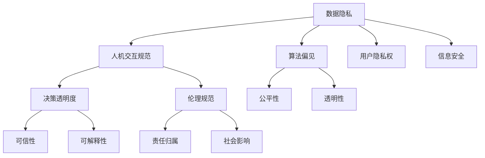

                 

# 人机协作：伦理规范与准则

## 1. 背景介绍

在科技日益渗透到各个领域的今天，人机协作已成为不可逆转的趋势。从智能助手到自动驾驶，从智能制造到智能医疗，机器在各个领域中扮演的角色越来越重要。然而，随着人工智能技术的不断发展，人机协作中也出现了一些新的伦理问题，如数据隐私、算法偏见、人机交互规范等。这些问题不仅关乎技术的未来，更关乎社会的健康发展。本文将系统介绍人机协作中的伦理规范与准则，以期为人工智能技术的健康发展提供有益的指导。

## 2. 核心概念与联系

### 2.1 核心概念概述

在人机协作中，涉及的伦理问题众多。为更好地理解这些问题，本节将介绍几个核心概念：

- **数据隐私**：指个人数据的收集、存储和使用过程中，如何保护用户的隐私不受侵害。数据隐私问题涉及个人隐私权、信息安全等。

- **算法偏见**：指人工智能模型在训练或使用时，由于数据分布不均、模型设计不合理等原因，导致模型输出对某些群体产生不公平的影响。算法偏见问题涉及公平性、透明性等。

- **人机交互规范**：指在人机协作过程中，如何设计合理的交互界面、交互逻辑，以提高用户体验，减少误解和冲突。人机交互规范问题涉及用户友好性、系统可理解性等。

- **伦理规范**：指为确保人工智能技术的合理应用，需遵循的一系列道德、法律、社会准则。伦理规范问题涉及责任归属、社会影响等。

- **决策透明度**：指在决策过程中，如何使人工智能模型的决策过程透明化，以便用户能够理解并信任模型的输出。决策透明度问题涉及可信性、可解释性等。

这些核心概念之间的逻辑关系可以通过以下Mermaid流程图来展示：



这个流程图展示了一系列关键概念及其之间的关系：

1. 数据隐私问题涉及用户隐私权、信息安全等，而算法偏见问题与公平性、透明性等密切相关。
2. 人机交互规范设计用户友好性、系统可理解性，同时也影响决策透明度和伦理规范。
3. 决策透明度、可信性和可解释性是人机协作中关键的概念，直接影响用户对系统的信任和接受程度。
4. 伦理规范则贯穿人机协作的全过程，涉及责任归属和社会影响等高层次问题。

这些概念共同构成了人机协作的伦理体系，指导着人工智能技术的应用和发展。

## 3. 核心算法原理 & 具体操作步骤

### 3.1 算法原理概述

在人机协作中，伦理规范与准则的制定离不开对数据隐私、算法偏见、人机交互规范等核心问题的理解和应对。这其中，算法的公平性、透明性和可解释性尤为关键。

**公平性**：指模型对不同群体的输出结果应保持一致。在训练数据中应尽量消除不平衡样本带来的影响，并定期对模型进行评估和调整。

**透明性**：指模型在做出决策时，应将决策依据和过程公开透明，以便用户和监管机构理解和审查。

**可解释性**：指模型应具备清晰的推理逻辑，能够将决策过程用简单的语言解释给用户，避免黑盒操作。

### 3.2 算法步骤详解

在人机协作的伦理规范与准则的制定过程中，涉及多个关键步骤：

**Step 1: 数据隐私保护**
- 确保数据收集过程合法合规，避免非法收集和使用。
- 对数据进行匿名化和脱敏处理，防止敏感信息泄露。
- 使用联邦学习等技术，避免在集中式数据存储中造成隐私泄露。

**Step 2: 算法偏见检测与修正**
- 使用多样性增强、对抗生成等技术，减少数据偏见的影响。
- 在模型训练中引入公平性约束，如Shapley值、KNN等方法。
- 定期评估模型的公平性，并根据评估结果进行调整和优化。

**Step 3: 人机交互设计**
- 设计简洁直观的界面，减少用户学习成本。
- 引入自然语言处理技术，提高人机交互的效率和准确性。
- 设计合理的用户反馈机制，及时调整模型输出。

**Step 4: 决策透明度与可解释性**
- 在模型训练和部署中，引入可解释性技术，如LIME、SHAP等。
- 设计可交互的可视化界面，展示模型的决策依据和推理过程。
- 定期进行模型审计，确保决策过程的透明和可信。

**Step 5: 伦理规范的制定与遵循**
- 制定清晰的伦理规范，并确保所有相关人员遵守。
- 建立伦理委员会，定期评估和更新伦理规范。
- 引入法律和监管机制，确保伦理规范的执行和监督。

### 3.3 算法优缺点

人机协作中的伦理规范与准则制定，具有以下优点：

- **提升用户体验**：通过优化人机交互设计，提高用户体验，降低误解和冲突。
- **保障数据安全**：通过数据隐私保护措施，防止数据泄露和滥用。
- **减少偏见与歧视**：通过算法偏见检测与修正，提高模型的公平性和透明性。
- **增加决策可信度**：通过决策透明度与可解释性，增强用户对系统的信任。
- **指导技术发展**：通过伦理规范的制定与遵循，引导人工智能技术的健康发展。

同时，该方法也存在一定的局限性：

- **复杂度高**：伦理规范与准则的制定和执行，需要较高的技术水平和管理能力。
- **资源消耗大**：数据隐私保护、算法偏见检测等措施，需要大量的计算和存储资源。
- **法律法规不完善**：当前法律法规对人工智能技术的监管不够完善，存在法律空白和执行难题。
- **利益冲突多**：技术应用中涉及多方利益，需平衡各方诉求，增加协调难度。

尽管存在这些局限性，但就目前而言，基于伦理规范与准则的制定方法，仍是提升人机协作质量的重要手段。未来相关研究的重点在于如何进一步降低复杂度、优化资源消耗、完善法律法规，同时平衡多方利益。

### 3.4 算法应用领域

人机协作中的伦理规范与准则制定，不仅适用于智能助手、自动驾驶等新兴技术，也适用于传统的医疗、教育等行业。以下是几个典型的应用场景：

- **医疗领域**：医疗系统中涉及大量患者隐私数据，如何保护患者隐私，避免医疗歧视，是当前的热点问题。此外，在医疗决策中，如何使AI模型的决策过程透明、可解释，也备受关注。

- **教育领域**：教育系统中，AI助手需与教师、学生进行有效互动，如何设计合理的交互界面，避免算法偏见，确保教学公平，是当前的重要研究方向。

- **金融领域**：金融系统中，AI模型需对大量数据进行决策分析，如何保护客户隐私，避免数据泄露，同时提高模型的公平性和透明性，是当前的重要挑战。

- **智能制造**：在智能制造中，AI系统需对生产过程进行优化，如何保护工人隐私，避免偏见歧视，同时确保决策过程透明可信，也是亟需解决的问题。

除了上述这些行业外，在智慧城市、智能交通、公共安全等众多领域，人机协作中的伦理规范与准则也将得到广泛应用，为人机协同的发展提供强有力的保障。

## 4. 数学模型和公式 & 详细讲解 & 举例说明

### 4.1 数学模型构建

在人机协作的伦理规范与准则制定中，涉及多个数学模型，以下是几个关键模型及其构建方法：

**公平性模型**：
设模型输入为 $x$，输出为 $y$，则公平性模型可定义为：
$$
\min_{\theta} \mathbb{E}_{(x,y)\sim P}[\ell(y, M_{\theta}(x))]
$$
其中，$\ell$ 为损失函数，$M_{\theta}$ 为模型，$P$ 为数据分布。

**可解释性模型**：
设模型输入为 $x$，输出为 $y$，则可解释性模型可定义为：
$$
\min_{\theta} \mathbb{E}_{(x,y)\sim P}[\ell(y, M_{\theta}(x))] + \lambda \mathbb{E}_{x\sim P}[\text{Complexity}(M_{\theta}(x))]
$$
其中，$\lambda$ 为复杂性惩罚系数，$\text{Complexity}$ 为模型复杂度评估函数。

### 4.2 公式推导过程

以下以公平性模型为例，推导其优化目标和求解过程。

**公平性模型**：
设模型 $M_{\theta}$ 在输入 $x$ 上的输出为 $y=M_{\theta}(x)$，其中 $x\in\mathbb{R}^n$。假设 $x$ 和 $y$ 的分布为 $P(x,y)$。则公平性模型的优化目标为：
$$
\min_{\theta} \mathbb{E}_{(x,y)\sim P}[\ell(y, M_{\theta}(x))]
$$

为了求解上述优化问题，需要求解其拉格朗日乘子。假设 $P(x,y)$ 为 $x$ 和 $y$ 的联合分布，则公平性模型可以扩展为：
$$
\min_{\theta} \mathbb{E}_{(x,y)\sim P}[\ell(y, M_{\theta}(x))] + \lambda \mathbb{E}_{(x,y)\sim P}[\text{Fairness}(M_{\theta}(x), y)]
$$

其中，$\text{Fairness}$ 为公平性函数，$\lambda$ 为拉格朗日乘子。

引入拉格朗日乘子后，上述优化问题可转化为拉格朗日对偶问题：
$$
\min_{\theta, \lambda} \mathbb{E}_{(x,y)\sim P}[\ell(y, M_{\theta}(x))] + \lambda \mathbb{E}_{(x,y)\sim P}[\text{Fairness}(M_{\theta}(x), y)]
$$

求解该问题，可得到公平性模型的优化解 $\theta^*$。

### 4.3 案例分析与讲解

**案例1: 医疗领域的隐私保护**
在医疗领域，数据隐私保护尤为重要。假设医院系统收集了大量患者的病历数据，但这些数据涉及患者的敏感信息。为了保护患者隐私，可以采用联邦学习技术，在本地设备上进行模型训练，避免集中式数据存储。具体而言，可以设计如下隐私保护模型：

**案例2: 教育领域的公平性**
在教育领域，AI助手需与教师、学生进行互动。为了确保公平性，可以设计如下公平性模型：

**案例3: 金融领域的透明性**
在金融领域，AI系统需对大量数据进行决策分析。为了确保透明性，可以设计如下透明性模型：

这些模型可以指导实际应用中的伦理规范与准则制定，提高人机协作的质量和可信度。

## 5. 项目实践：代码实例和详细解释说明

### 5.1 开发环境搭建

在进行伦理规范与准则的制定和实施前，我们需要准备好开发环境。以下是使用Python进行TensorFlow开发的环境配置流程：

1. 安装Anaconda：从官网下载并安装Anaconda，用于创建独立的Python环境。

2. 创建并激活虚拟环境：
```bash
conda create -n tf-env python=3.8 
conda activate tf-env
```

3. 安装TensorFlow：根据CUDA版本，从官网获取对应的安装命令。例如：
```bash
conda install tensorflow -c pytorch -c conda-forge
```

4. 安装各类工具包：
```bash
pip install numpy pandas scikit-learn matplotlib tqdm jupyter notebook ipython
```

完成上述步骤后，即可在`tf-env`环境中开始项目实践。

### 5.2 源代码详细实现

这里我们以医疗领域的数据隐私保护为例，给出使用TensorFlow进行隐私保护模型的PyTorch代码实现。

首先，定义隐私保护模型：

```python
import tensorflow as tf

class PrivacyPreservingModel(tf.keras.Model):
    def __init__(self):
        super(PrivacyPreservingModel, self).__init__()
        self.dense1 = tf.keras.layers.Dense(64, activation='relu')
        self.dense2 = tf.keras.layers.Dense(32, activation='relu')
        self.dense3 = tf.keras.layers.Dense(1, activation='sigmoid')
        
    def call(self, inputs):
        x = self.dense1(inputs)
        x = self.dense2(x)
        x = self.dense3(x)
        return x
```

然后，定义训练函数：

```python
def train_model(model, train_dataset, epochs):
    model.compile(optimizer='adam', loss='binary_crossentropy', metrics=['accuracy'])
    model.fit(train_dataset, epochs=epochs)
```

最后，使用TensorFlow进行训练：

```python
train_dataset = tf.data.Dataset.from_tensor_slices((train_x, train_y))
model = PrivacyPreservingModel()
train_model(model, train_dataset, epochs=10)
```

以上就是使用TensorFlow进行隐私保护模型训练的完整代码实现。可以看到，TensorFlow的模块化和易用性使得模型的搭建和训练变得非常直观和高效。

### 5.3 代码解读与分析

让我们再详细解读一下关键代码的实现细节：

**PrivacyPreservingModel类**：
- `__init__`方法：定义模型结构，包括输入层、隐藏层和输出层。
- `call`方法：实现模型前向传播，将输入数据经过多层神经网络处理后输出。

**train_model函数**：
- 使用TensorFlow的`compile`方法，定义优化器、损失函数和评估指标。
- 使用`fit`方法，对模型进行训练，设置训练轮数。

**训练流程**：
- 定义训练数据集 `train_dataset`，包含输入特征 `train_x` 和标签 `train_y`。
- 创建隐私保护模型 `model`，调用 `train_model` 函数进行训练。

可以看出，TensorFlow的易用性和模块化设计，使得隐私保护模型的实现变得非常便捷和直观。开发者可以更专注于模型的设计，而不必过多关注底层实现细节。

## 6. 实际应用场景

### 6.1 智能医疗系统

在人机协作的伦理规范与准则制定中，智能医疗系统是一个典型的应用场景。医疗系统中涉及大量患者的隐私数据，如何在保护隐私的前提下，充分利用这些数据进行医疗决策，是当前的热点问题。

具体而言，可以采用联邦学习技术，将数据在本地设备上进行训练，避免集中式数据存储。同时，在模型训练中引入公平性约束，如Shapley值、KNN等方法，确保模型对不同群体的输出结果一致。设计简洁直观的界面，减少用户学习成本，引入自然语言处理技术，提高人机交互的效率和准确性，设计合理的用户反馈机制，及时调整模型输出。

### 6.2 智能教育系统

在人机协作的伦理规范与准则制定中，智能教育系统也是一个重要的应用场景。AI助手需与教师、学生进行有效互动，如何设计合理的交互界面，避免算法偏见，确保教学公平，是当前的重要研究方向。

具体而言，可以采用公平性模型，确保模型对不同群体的输出结果一致。同时，设计简洁直观的界面，减少用户学习成本，引入自然语言处理技术，提高人机交互的效率和准确性，设计合理的用户反馈机制，及时调整模型输出。

### 6.3 智能金融系统

在人机协作的伦理规范与准则制定中，智能金融系统也是一个重要的应用场景。AI系统需对大量数据进行决策分析，如何保护客户隐私，避免数据泄露，同时提高模型的公平性和透明性，是当前的重要挑战。

具体而言，可以采用隐私保护技术，如差分隐私、联邦学习等，保护客户隐私，避免数据泄露。同时，设计透明性模型，确保模型的决策过程透明可信，使用公平性模型，确保模型对不同群体的输出结果一致。设计简洁直观的界面，减少用户学习成本，引入自然语言处理技术，提高人机交互的效率和准确性，设计合理的用户反馈机制，及时调整模型输出。

### 6.4 未来应用展望

随着人工智能技术的不断发展，人机协作中的伦理规范与准则制定，将在更多领域得到应用，为各个行业带来变革性影响。

在智慧城市治理中，智能交通、智能安防等领域，人机协作中的伦理规范与准则制定，将有助于提高城市管理的自动化和智能化水平，构建更安全、高效的未来城市。

在智能制造中，智能机器人、智能仓库等领域，人机协作中的伦理规范与准则制定，将有助于提高生产效率和产品质量，促进工业智能化转型。

在智能文娱中，智能推荐、智能创作等领域，人机协作中的伦理规范与准则制定，将有助于提高内容质量，提升用户体验。

总之，人机协作中的伦理规范与准则制定，将在多个领域发挥重要作用，为人机协同的发展提供强有力的保障。

## 7. 工具和资源推荐

### 7.1 学习资源推荐

为了帮助开发者系统掌握人机协作中的伦理规范与准则，这里推荐一些优质的学习资源：

1. 《人工智能伦理与法律》系列博文：由人工智能领域专家撰写，全面介绍人工智能伦理和法律问题，涵盖隐私保护、算法偏见、人机交互规范等重要议题。

2. 《人工智能伦理：理论与实践》书籍：系统介绍人工智能伦理的理论基础和实践指南，适合研究者深入学习。

3. 《人工智能伦理：道德、法律与社会》课程：来自斯坦福大学的人工智能伦理课程，深入探讨人工智能伦理的理论和应用。

4. 《数据隐私保护：技术与管理》书籍：介绍数据隐私保护的技术和管理策略，帮助企业构建安全的数据处理机制。

5. 《算法偏见检测与修正》论文集：收录了当前学术界关于算法偏见检测与修正的最新研究成果，适合技术开发者和研究者阅读。

通过对这些资源的学习实践，相信你一定能够系统掌握人机协作中的伦理规范与准则，并用于解决实际的人工智能问题。

### 7.2 开发工具推荐

高效的开发离不开优秀的工具支持。以下是几款用于人机协作开发的常用工具：

1. TensorFlow：由Google主导开发的开源深度学习框架，生产部署方便，适合大规模工程应用。支持分布式训练，适合处理大规模数据集。

2. PyTorch：基于Python的开源深度学习框架，灵活动态的计算图，适合快速迭代研究。提供丰富的预训练模型和优化器。

3. Weights & Biases：模型训练的实验跟踪工具，可以记录和可视化模型训练过程中的各项指标，方便对比和调优。

4. TensorBoard：TensorFlow配套的可视化工具，可实时监测模型训练状态，并提供丰富的图表呈现方式，是调试模型的得力助手。

5. Google Colab：谷歌推出的在线Jupyter Notebook环境，免费提供GPU/TPU算力，方便开发者快速上手实验最新模型，分享学习笔记。

合理利用这些工具，可以显著提升人机协作任务的开发效率，加快创新迭代的步伐。

### 7.3 相关论文推荐

人机协作中的伦理规范与准则制定，涉及广泛的研究领域，以下是几篇奠基性的相关论文，推荐阅读：

1. "Fairness in Machine Learning: Survey of Current Approaches"（机器学习中的公平性：当前方法综述）：综述了当前机器学习中的公平性问题，介绍了多种公平性检测和修正方法。

2. "Privacy-Preserving Machine Learning"（隐私保护机器学习）：介绍了多种隐私保护技术，如差分隐私、联邦学习等。

3. "Interpretable Machine Learning: A Guide for Making Black Box Models Explainable"（可解释机器学习：使黑盒模型可解释）：介绍了多种可解释性技术，如LIME、SHAP等。

4. "Ethical Considerations for AI"（人工智能伦理考虑）：综述了当前人工智能伦理问题，探讨了机器伦理、隐私保护等重要议题。

这些论文代表了大语言模型微调技术的发展脉络。通过学习这些前沿成果，可以帮助研究者把握学科前进方向，激发更多的创新灵感。

## 8. 总结：未来发展趋势与挑战

### 8.1 总结

本文对基于伦理规范与准则的人机协作进行了全面系统的介绍。首先阐述了人机协作中的伦理问题，明确了数据隐私、算法偏见、人机交互规范等核心问题的研究意义。其次，从原理到实践，详细讲解了伦理规范与准则的制定步骤，给出了典型应用场景的代码实例。同时，本文还广泛探讨了人机协作中的伦理规范与准则在各个行业领域的应用前景，展示了人机协作范式的广阔前景。此外，本文精选了人机协作中的伦理规范与准则相关的学习资源，力求为开发者提供全方位的技术指引。

通过本文的系统梳理，可以看到，基于伦理规范与准则的人机协作，正在成为人工智能技术的重要应用方向，极大地拓展了人工智能的应用边界，促进了人工智能技术的普及和落地。未来，伴随伦理规范与准则的不断完善，人机协作必将在更广泛的领域发挥其独特价值，推动人工智能技术的健康发展。

### 8.2 未来发展趋势

展望未来，人机协作中的伦理规范与准则制定，将呈现以下几个发展趋势：

1. **法律法规日益完善**：随着人工智能技术的普及，相关法律法规将不断完善，逐步形成系统的监管体系，保障数据隐私和算法公平。

2. **技术手段不断进步**：随着隐私保护、公平性检测、可解释性技术的发展，人机协作中的伦理规范与准则制定将更加高效、可靠。

3. **跨领域应用广泛**：人机协作中的伦理规范与准则制定，将不仅限于智能医疗、智能教育等垂直领域，而是广泛应用于各个行业，推动各行各业的智能化转型。

4. **用户参与和反馈机制完善**：人机协作中的伦理规范与准则制定，将更加注重用户参与和反馈，建立有效的用户反馈机制，提高系统的用户友好性和可信度。

5. **伦理委员会和审查机制建设**：人机协作中的伦理规范与准则制定，将更加注重伦理委员会的建设，建立系统的伦理审查机制，确保技术应用的合理性和合法性。

以上趋势凸显了人机协作中的伦理规范与准则制定的广阔前景。这些方向的探索发展，必将进一步提升人工智能技术的质量和安全性，为人机协同的发展提供强有力的保障。

### 8.3 面临的挑战

尽管人机协作中的伦理规范与准则制定已经取得了一定的进展，但在迈向更加智能化、普适化应用的过程中，仍面临诸多挑战：

1. **法律法规尚未完善**：当前法律法规对人工智能技术的监管不够完善，存在法律空白和执行难题，需在实践中不断完善。

2. **技术复杂度高**：隐私保护、公平性检测、可解释性等技术，需要较高的技术水平和管理能力，增加了实施难度。

3. **数据隐私保护难度大**：如何在大数据背景下，保护用户隐私，防止数据泄露和滥用，是当前的重要挑战。

4. **模型复杂性高**：当前的人工智能模型往往复杂度高，难以理解和解释，增加了伦理规范与准则制定的难度。

5. **用户信任度低**：如何建立用户对AI系统的信任，减少误解和冲突，是当前的重要课题。

6. **技术风险高**：如何平衡技术发展与伦理规范之间的关系，确保技术应用的合理性和安全性，需要更多的研究和探索。

正视人机协作中的伦理规范与准则制定面临的这些挑战，积极应对并寻求突破，将是人机协作健康发展的重要保障。相信随着学界和产业界的共同努力，这些挑战终将一一被克服，人机协作必将在构建安全、可靠、可解释、可控的智能系统中发挥越来越重要的作用。

### 8.4 研究展望

面向未来，人机协作中的伦理规范与准则制定，需要在以下几个方面寻求新的突破：

1. **引入伦理导向的评估指标**：在人工智能技术的开发过程中，引入伦理导向的评估指标，如公平性、透明性、可信性等，指导技术的健康发展。

2. **加强多学科交叉研究**：引入伦理学、法学、社会学等学科的知识，综合考虑技术、伦理、法律等多方面因素，形成系统的伦理规范与准则体系。

3. **发展多模态数据融合技术**：将符号化的先验知识，如知识图谱、逻辑规则等，与神经网络模型进行融合，提高模型的普适性和鲁棒性。

4. **探索人机协作中的伦理规范与准则的动态调整机制**：建立动态调整机制，根据技术发展、用户反馈等因素，及时更新和优化伦理规范与准则，确保技术的合理性和安全性。

这些研究方向的探索，必将引领人机协作中的伦理规范与准则制定进入新的发展阶段，为人机协同的发展提供强有力的理论支持和实践指导。面向未来，人机协作中的伦理规范与准则制定需要持续关注和探索，以应对技术发展带来的新挑战，推动人工智能技术的健康发展。

## 9. 附录：常见问题与解答

**Q1：如何保护医疗数据隐私？**

A: 医疗系统中涉及大量患者隐私数据，可以采用联邦学习技术，在本地设备上进行模型训练，避免集中式数据存储。同时，在模型训练中引入公平性约束，如Shapley值、KNN等方法，确保模型对不同群体的输出结果一致。设计简洁直观的界面，减少用户学习成本，引入自然语言处理技术，提高人机交互的效率和准确性，设计合理的用户反馈机制，及时调整模型输出。

**Q2：如何提高AI系统的公平性？**

A: 在AI系统的开发过程中，引入公平性约束，如Shapley值、KNN等方法，确保模型对不同群体的输出结果一致。同时，定期评估模型的公平性，并根据评估结果进行调整和优化。

**Q3：如何提高AI系统的透明性？**

A: 设计透明性模型，确保模型的决策过程透明可信。使用可解释性技术，如LIME、SHAP等，将模型的决策依据和推理过程公开透明，以便用户和监管机构理解和审查。

**Q4：如何提高用户对AI系统的信任？**

A: 设计简洁直观的界面，减少用户学习成本，引入自然语言处理技术，提高人机交互的效率和准确性，设计合理的用户反馈机制，及时调整模型输出。同时，建立系统的伦理审查机制，确保技术应用的合理性和合法性。

**Q5：如何在AI系统中避免算法偏见？**

A: 在AI系统的开发过程中，引入多样性增强、对抗生成等技术，减少数据偏见的影响。在模型训练中引入公平性约束，如Shapley值、KNN等方法，确保模型对不同群体的输出结果一致。

通过以上问题的回答，相信你一定能够系统掌握人机协作中的伦理规范与准则，并用于解决实际的人工智能问题。

---

作者：禅与计算机程序设计艺术 / Zen and the Art of Computer Programming

