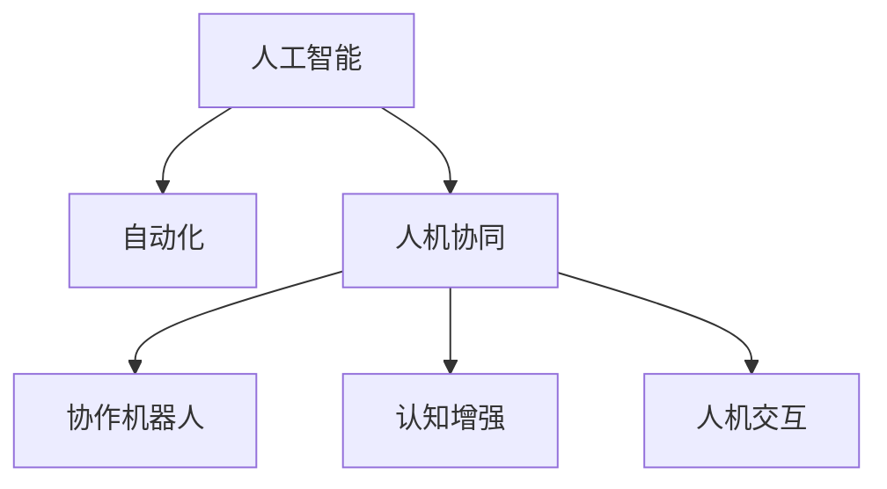

                 

# 人机协同：未来工作的核心竞争力

在数字化转型浪潮的推动下，人工智能(AI)和自动化技术正在快速重塑各行各业的运营模式和工作流程。然而，尽管技术不断进步，但真正实现全面自动化仍需数年甚至数十年时间。在此过程中，人机协同(AI-Human Collaboration)将成为未来工作的重要组成部分，为各行各业提供竞争优势和新的增长点。本文将深入探讨人机协同的核心概念、算法原理、操作步骤及实际应用，并结合当前的技术发展趋势，揭示其在未来工作中的核心竞争力。

## 1. 背景介绍

### 1.1 问题由来

随着人工智能技术的不断成熟，各行各业逐渐将AI应用于业务流程中，提升效率和准确性。例如，制造业中的机器人自动化生产、医疗领域中的智能诊断系统、金融行业的量化交易模型等，都是AI应用的典型案例。然而，这些应用多数仍以“辅助”或“辅助决策”的方式存在，而非完全替代人类的工作。人机协同应运而生，将AI作为辅助工具，与人类共同完成复杂任务。

### 1.2 问题核心关键点

人机协同的核心在于如何充分利用AI和人类的各自优势，将AI的计算能力与人类的创造力、决策力相结合。具体来说，人机协同的关键点包括：

- **任务分解**：将复杂任务分解为可管理的小任务，使得AI能更高效地处理部分任务，同时人类也能专注于更具创造性和策略性的工作。
- **智能增强**：AI提供数据处理、模式识别、预测分析等功能，为人类提供智能增强，提升决策准确性和效率。
- **反馈机制**：建立有效的反馈机制，让人类能够对AI的输出进行校验和修正，确保最终输出结果的可靠性。
- **人机交互**：设计友好的人机交互界面，使得人机协同更加自然、高效。

### 1.3 问题研究意义

人机协同的研究对于推动人工智能技术的商业化和落地具有重要意义：

1. **降低成本**：通过合理分配工作，减少重复性劳动，降低企业运营成本。
2. **提高效率**：利用AI的高效计算能力，大幅提升任务完成速度和质量。
3. **增强决策能力**：AI提供数据驱动的洞察和预测，辅助人类做出更准确的决策。
4. **促进创新**：人机协同能够激发人类创造力和灵感，推动创新成果的诞生。
5. **推动技术普及**：通过人机协同，AI技术更加易于接受和应用，加速技术普及。

## 2. 核心概念与联系

### 2.1 核心概念概述

为了更好地理解人机协同的核心竞争力，我们将介绍几个关键概念：

- **人工智能**：使用算法和计算模型进行智能决策和推理的计算机系统。
- **自动化**：通过编程实现的任务自动化处理，无需人工干预。
- **人机协同**：将AI与人类结合，共同完成复杂任务的合作模式。
- **人机交互**：设计人和计算机之间自然、高效的信息交换方式。
- **认知增强**：利用AI技术提升人类认知能力，如决策支持、知识管理等。
- **协作机器人**：将AI嵌入到机器人中，实现人机协同的物理交互。

### 2.2 核心概念联系

人机协同的实现涉及到多个核心概念，其联系可通过以下Mermaid流程图展示：



该流程图展示了各个概念之间的逻辑关系：

1. **人工智能**是自动化和协同的基础，提供了智能决策和推理的能力。
2. **自动化**将人工智能应用于具体任务中，实现了任务的处理自动化。
3. **人机协同**则将自动化与人类结合，形成高效的合作模式。
4. **协作机器人**是物理层面的人机协同应用。
5. **认知增强**和**人机交互**是人机协同的重要支撑，分别提升了人类认知能力和信息交换效率。

## 3. 核心算法原理 & 具体操作步骤

### 3.1 算法原理概述

人机协同的核心算法原理涉及多个领域，包括机器学习、自然语言处理、计算机视觉等。本节将重点介绍在任务分解和智能增强中常用的算法。

### 3.2 算法步骤详解

人机协同的一般操作步骤如下：

**Step 1: 任务分解**

1. **任务分析**：确定任务的复杂度和关键步骤，将其分解为多个小任务。
2. **任务分配**：根据任务特点，决定哪些部分适合AI处理，哪些部分适合人类处理。
3. **任务流程设计**：设计任务流程，明确各部分之间的交互和数据传递机制。

**Step 2: 智能增强**

1. **数据预处理**：收集、清洗和预处理任务所需的数据，确保数据质量。
2. **模型训练**：选择合适的AI模型，利用标注数据进行训练，优化模型参数。
3. **模型部署**：将训练好的模型部署到实际应用中，提供智能增强功能。

**Step 3: 反馈机制**

1. **结果校验**：人类对AI的输出结果进行校验，确保准确性。
2. **错误修正**：根据校验结果，修正AI的输出，反馈给AI进行改进。
3. **持续优化**：利用反馈结果，持续优化AI模型和任务流程。

**Step 4: 人机交互**

1. **界面设计**：设计用户友好的交互界面，确保人机协同的自然和高效。
2. **交互训练**：通过用户反馈，优化交互界面和流程，提升用户体验。
3. **交互测试**：在实际使用中测试人机交互效果，持续改进。

### 3.3 算法优缺点

人机协同具有以下优点：

1. **提高效率**：AI高效处理重复性、计算密集的任务，人类专注于创造性工作。
2. **降低成本**：减少人工成本，提高任务处理速度。
3. **增强决策能力**：AI提供数据驱动的洞察，辅助人类做出更准确决策。
4. **促进创新**：结合人类创造力和AI技术，推动创新成果的诞生。

同时，人机协同也存在一些缺点：

1. **依赖数据**：AI的输出依赖于数据质量，低质量数据可能导致误判。
2. **模型复杂性**：AI模型复杂，可能需要大量计算资源和数据。
3. **人机交互复杂**：设计友好、高效的人机交互界面可能存在难度。
4. **系统可靠性**：系统可靠性受AI和人类交互的影响，存在一定的风险。

### 3.4 算法应用领域

人机协同的应用领域广泛，包括但不限于：

1. **制造业**：通过协作机器人实现自动化生产，提高生产效率和质量。
2. **医疗行业**：利用AI辅助诊断和预测，提升诊疗准确性。
3. **金融领域**：使用AI进行量化交易和风险评估，提高投资回报率。
4. **客户服务**：通过智能客服系统，提高客户服务质量和响应速度。
5. **创意工作**：设计、创意、研发等领域，利用AI提供数据支持和灵感。
6. **物流运输**：利用AI优化路线规划和配送，提高物流效率。

## 4. 数学模型和公式 & 详细讲解 & 举例说明

### 4.1 数学模型构建

在人机协同的算法中，常使用的数学模型包括回归模型、分类模型、聚类模型等。以回归模型为例，其构建步骤如下：

1. **数据准备**：收集、清洗数据，将数据划分为训练集和测试集。
2. **模型选择**：选择合适的回归模型，如线性回归、多项式回归等。
3. **参数训练**：利用训练集数据，通过梯度下降等算法优化模型参数。
4. **模型评估**：利用测试集数据，评估模型性能，选择最佳模型。

### 4.2 公式推导过程

以线性回归为例，其公式推导如下：

设输入向量为 $\mathbf{x} \in \mathbb{R}^n$，输出向量为 $\mathbf{y} \in \mathbb{R}$，线性回归模型的目标是最小化损失函数：

$$
\min_{\theta} \sum_{i=1}^N (\mathbf{y}_i - \theta_0 - \theta_1 x_{i1} - \ldots - \theta_n x_{in})^2
$$

其中 $\theta_0, \theta_1, \ldots, \theta_n$ 为模型参数，$N$ 为样本数量。

通过最小化损失函数，可以求得最优参数：

$$
\theta = \mathop{\arg\min}_{\theta} \sum_{i=1}^N (\mathbf{y}_i - \theta_0 - \theta_1 x_{i1} - \ldots - \theta_n x_{in})^2
$$

### 4.3 案例分析与讲解

以制造业中的协作机器人为例，其数学模型和推导过程如下：

1. **数据准备**：收集机器人操作的数据，包括速度、位置、工具状态等。
2. **模型选择**：选择线性回归模型，预测机器人所需的操作时间和路径。
3. **参数训练**：利用训练数据，优化回归模型参数，预测最优操作路径和时间。
4. **模型评估**：在测试数据上评估模型性能，选择最佳模型。

## 5. 项目实践：代码实例和详细解释说明

### 5.1 开发环境搭建

在进行人机协同的实践前，需要先准备好开发环境。以下是使用Python进行TensorFlow开发的环境配置流程：

1. 安装Anaconda：从官网下载并安装Anaconda，用于创建独立的Python环境。
2. 创建并激活虚拟环境：
```bash
conda create -n tf-env python=3.8 
conda activate tf-env
```
3. 安装TensorFlow：根据CUDA版本，从官网获取对应的安装命令。例如：
```bash
conda install tensorflow==2.7
```
4. 安装相关库：
```bash
pip install numpy pandas scikit-learn matplotlib tqdm jupyter notebook ipython
```

完成上述步骤后，即可在`tf-env`环境中开始项目实践。

### 5.2 源代码详细实现

我们以一个简单的协作机器人系统为例，展示人机协同的实现过程。

首先，定义数据集和标签：

```python
import numpy as np

# 定义数据集和标签
X = np.array([[1, 2, 3], [4, 5, 6], [7, 8, 9]])
y = np.array([10, 20, 30])
```

然后，定义回归模型：

```python
from tensorflow.keras.models import Sequential
from tensorflow.keras.layers import Dense

# 定义模型
model = Sequential()
model.add(Dense(10, input_dim=3, activation='relu'))
model.add(Dense(1, activation='linear'))
model.compile(optimizer='adam', loss='mse')
```

接着，训练模型：

```python
# 训练模型
model.fit(X, y, epochs=100, verbose=0)
```

最后，评估模型：

```python
# 评估模型
X_test = np.array([[11, 12, 13], [14, 15, 16]])
y_pred = model.predict(X_test)
print(y_pred)
```

### 5.3 代码解读与分析

让我们再详细解读一下关键代码的实现细节：

**X和y的定义**：
- 使用NumPy库定义了输入数据X和标签y，分别代表机器人操作的速度、位置和工具状态，以及相应的输出时间。

**模型的定义**：
- 使用Keras框架定义了线性回归模型，包含两个全连接层，第一个层有10个神经元，使用ReLU激活函数，第二个层输出一个神经元，使用线性激活函数。
- 使用Adam优化器和均方误差损失函数进行模型训练。

**模型的训练**：
- 使用`fit`方法训练模型，设置训练次数为100次，不输出训练过程的详细信息。

**模型的评估**：
- 使用测试数据X_test进行模型预测，输出预测结果。

可以看到，使用TensorFlow和Keras进行协作机器人系统的回归模型开发，代码实现简洁高效。

## 6. 实际应用场景

### 6.1 智能客服系统

基于人机协同的智能客服系统，可以显著提升客户服务质量和效率。传统客服依赖大量人工，高峰期响应慢且质量难以保障。而智能客服系统，利用AI进行对话理解和生成，通过协作机器人完成客户交互，实现24小时不间断服务，快速响应客户咨询，提高客户满意度。

### 6.2 医疗诊断

在医疗诊断领域，人机协同技术可以提供高效、准确的辅助诊断。通过AI对大量医学影像和病历数据进行分析和预测，协作机器人辅助医生进行诊断，提供数据支持和治疗方案，显著提升诊疗效率和准确性。

### 6.3 金融风控

金融领域需要实时监控市场动态和风险变化，及时应对潜在的金融风险。基于人机协同的智能风控系统，利用AI对交易数据进行实时分析和预测，协作机器人进行风险评估和预警，帮助金融机构快速响应市场变化，降低风险。

### 6.4 物流管理

物流行业面临大量包裹的运输和分配任务，需要高效、准确地规划和管理。基于人机协同的物流管理系统，利用AI进行路径规划和优化，协作机器人完成配送任务，显著提升物流效率和准确性。

### 6.5 生产制造

制造业中的生产任务往往复杂且重复性高，传统人工操作容易出现失误。基于人机协同的协作机器人系统，利用AI进行生产流程优化和异常检测，协作机器人完成自动化生产任务，提高生产效率和质量。

## 7. 工具和资源推荐

### 7.1 学习资源推荐

为了帮助开发者系统掌握人机协同的理论基础和实践技巧，以下是一些优质的学习资源：

1. **《机器学习基础》系列博文**：由机器学习专家撰写，深入浅出地介绍了机器学习的基本概念和算法。
2. **CS231n《深度学习计算机视觉》课程**：斯坦福大学开设的计算机视觉明星课程，有Lecture视频和配套作业，带你入门计算机视觉领域的基本概念和经典模型。
3. **《深度学习与人工智能》书籍**：全面介绍了深度学习与人工智能的理论与实践，包括人机协同在内的多个前沿话题。
4. **Coursera上的《人工智能基础》课程**：由斯坦福大学教授讲授，全面介绍了AI的基础知识和应用。
5. **HuggingFace官方文档**：提供了海量预训练模型和完整的微调样例代码，是上手实践的必备资料。

通过对这些资源的学习实践，相信你一定能够快速掌握人机协同的精髓，并用于解决实际的NLP问题。

### 7.2 开发工具推荐

高效的开发离不开优秀的工具支持。以下是几款用于人机协同开发的常用工具：

1. **TensorFlow**：基于Python的开源深度学习框架，灵活动态的计算图，适合快速迭代研究。
2. **PyTorch**：由Facebook开发的深度学习框架，具有动态图和静态图两种模式，适合学术研究。
3. **Keras**：高层神经网络API，支持TensorFlow、Theano、CNTK等多种后端，方便快速搭建模型。
4. **Jupyter Notebook**：交互式的编程环境，支持多种编程语言和库，适合数据处理和模型开发。
5. **Weights & Biases**：模型训练的实验跟踪工具，可以记录和可视化模型训练过程中的各项指标，方便对比和调优。
6. **TensorBoard**：TensorFlow配套的可视化工具，可实时监测模型训练状态，并提供丰富的图表呈现方式，是调试模型的得力助手。

合理利用这些工具，可以显著提升人机协同任务的开发效率，加快创新迭代的步伐。

### 7.3 相关论文推荐

人机协同的研究源于学界的持续研究。以下是几篇奠基性的相关论文，推荐阅读：

1. **《协同机器人：人机协作的未来》**：讨论了协同机器人在生产制造中的应用，展示了人机协同的强大潜力。
2. **《人机协作：提升医疗服务质量》**：研究了人机协同在医疗诊断中的应用，探讨了AI辅助医疗的可能性。
3. **《人机协同：推动金融创新》**：介绍了人机协同在金融风控中的实践，展示了金融科技的发展方向。
4. **《智能客服：人机协同的新范式》**：分析了智能客服系统的实现原理，讨论了人机协同在客户服务中的应用。
5. **《人机协同：推动智能制造》**：研究了人机协同在智能制造中的应用，展示了AI在生产制造中的前景。

这些论文代表了大语言模型微调技术的发展脉络。通过学习这些前沿成果，可以帮助研究者把握学科前进方向，激发更多的创新灵感。

## 8. 总结：未来发展趋势与挑战

### 8.1 总结

本文对基于人机协同的智能系统的研究进行了全面系统的介绍。首先阐述了人机协同的核心概念和应用背景，明确了人机协同在提升效率、降低成本、增强决策能力等方面的重要价值。其次，从原理到实践，详细讲解了人机协同的数学模型和操作步骤，给出了人机协同任务开发的完整代码实例。同时，本文还广泛探讨了人机协同方法在各行各业的应用前景，展示了其在未来工作中的核心竞争力。

通过本文的系统梳理，可以看到，人机协同技术在各行各业的应用潜力巨大，其结合AI与人类优势，实现高效协作的思路，将深刻影响未来工作的模式和方式。未来，伴随技术的发展和应用的深入，人机协同必将成为推动各行各业智能化转型的重要手段。

### 8.2 未来发展趋势

展望未来，人机协同技术将呈现以下几个发展趋势：

1. **更广泛的应用**：随着技术的成熟，人机协同将在更多领域得到应用，从制造、医疗到金融、教育，从物理到虚拟，人机协同的应用场景将更加丰富。
2. **更高的智能化水平**：通过持续训练和优化，人机协同系统将具备更高的智能化水平，实现更复杂的任务处理和决策支持。
3. **更强的协作能力**：未来的人机协同系统将更加智能，能够进行更自然的交互和协作，提升工作效率和用户体验。
4. **更强的适应性**：人机协同系统将具备更强的适应性，能够快速适应不同的工作环境和任务需求。
5. **更广泛的数据来源**：人机协同系统将利用更多的数据来源，包括传感器、用户反馈、社交媒体等，提升决策的全面性和准确性。

以上趋势凸显了人机协同技术的广阔前景。这些方向的探索发展，必将进一步提升人机协同系统的性能和应用范围，为各行各业带来新的增长点。

### 8.3 面临的挑战

尽管人机协同技术已经取得了瞩目成就，但在迈向更加智能化、普适化应用的过程中，仍面临诸多挑战：

1. **数据隐私和安全**：人机协同系统需要处理大量敏感数据，数据隐私和安全问题亟需解决。
2. **技术复杂性**：人机协同系统的开发和维护复杂，需要高水平的技术支持。
3. **人机交互的自然性**：设计友好、高效的人机交互界面可能存在难度，需要不断优化。
4. **系统的稳定性和可靠性**：人机协同系统的稳定性和可靠性受AI和人类交互的影响，存在一定的风险。
5. **成本和资源消耗**：大规模部署人机协同系统需要大量的计算资源和人力，成本较高。

正视人机协同面临的这些挑战，积极应对并寻求突破，将是人机协同技术走向成熟的必由之路。相信随着学界和产业界的共同努力，这些挑战终将一一被克服，人机协同必将在构建人机协同的智能时代中扮演越来越重要的角色。

### 8.4 研究展望

面对人机协同所面临的种种挑战，未来的研究需要在以下几个方面寻求新的突破：

1. **更高效的数据处理方法**：开发高效的数据预处理和清洗技术，提升数据处理效率和质量。
2. **更智能的任务分解策略**：研究更智能的任务分解方法，提高任务处理的自动化和智能化。
3. **更友好的交互界面设计**：设计更自然、高效的人机交互界面，提升用户体验。
4. **更鲁棒的协同算法**：开发更鲁棒的协同算法，提高系统的稳定性和可靠性。
5. **更广泛的应用场景**：探索人机协同在更多领域的应用场景，推动技术普及和创新。

这些研究方向的探索，必将引领人机协同技术迈向更高的台阶，为各行各业带来新的增长点和发展机遇。总之，人机协同技术还需要与其他人工智能技术进行更深入的融合，如知识表示、因果推理、强化学习等，多路径协同发力，共同推动人机协同系统的进步。只有勇于创新、敢于突破，才能不断拓展人机协同的边界，让人工智能更好地造福人类社会。

## 9. 附录：常见问题与解答

**Q1：人机协同是否适用于所有业务场景？**

A: 人机协同技术适用于大多数业务场景，特别是对于重复性高、计算密集的任务。但对于一些需要高度创造性、情感投入的任务，如艺术创作、心理咨询等，人机协同可能效果有限。

**Q2：如何设计友好的人机交互界面？**

A: 设计友好的人机交互界面，需要考虑以下几个方面：
1. **简洁直观**：界面应简洁明了，避免复杂操作，便于用户理解和使用。
2. **响应迅速**：界面应响应迅速，避免延迟和卡顿。
3. **反馈友好**：界面应提供友好的反馈，及时告知用户操作结果和系统状态。
4. **用户培训**：通过用户培训，提高用户对系统的熟悉度和使用效率。
5. **用户反馈**：收集用户反馈，不断优化界面设计，提升用户体验。

**Q3：人机协同系统如何保证数据隐私和安全？**

A: 人机协同系统在处理数据时，应采用以下措施保证数据隐私和安全：
1. **数据加密**：对敏感数据进行加密存储和传输，防止数据泄露。
2. **访问控制**：设置严格的访问控制，确保只有授权人员可以访问数据。
3. **数据匿名化**：对数据进行匿名化处理，保护用户隐私。
4. **安全审计**：定期进行安全审计，及时发现和修复安全漏洞。
5. **合规性检查**：确保系统符合相关法律法规，如GDPR等。

**Q4：人机协同系统的开发和维护需要哪些技术支持？**

A: 人机协同系统的开发和维护需要以下技术支持：
1. **数据处理**：开发高效的数据预处理和清洗技术，提升数据处理效率和质量。
2. **模型训练**：选择合适的AI模型，利用大量数据进行训练和优化。
3. **人机交互**：设计友好、高效的人机交互界面，提升用户体验。
4. **系统集成**：将AI模型、数据处理、人机交互等模块集成，实现协同工作。
5. **持续优化**：通过用户反馈和数据分析，不断优化系统性能和用户体验。

**Q5：人机协同系统的成本和资源消耗主要来自哪些方面？**

A: 人机协同系统的成本和资源消耗主要来自以下几个方面：
1. **硬件设备**：部署高性能服务器和计算设备，如GPU、TPU等。
2. **软件开发**：开发和维护人机协同系统，需要大量人力和技术支持。
3. **数据处理**：处理大量数据，需要高性能的存储和计算资源。
4. **系统集成**：将各模块集成，需要合理的架构设计和系统优化。
5. **用户体验**：提升用户体验，需要持续的反馈和优化。

正视人机协同面临的这些挑战，积极应对并寻求突破，将是人机协同技术走向成熟的必由之路。相信随着学界和产业界的共同努力，这些挑战终将一一被克服，人机协同必将在构建人机协同的智能时代中扮演越来越重要的角色。

---

作者：禅与计算机程序设计艺术 / Zen and the Art of Computer Programming

