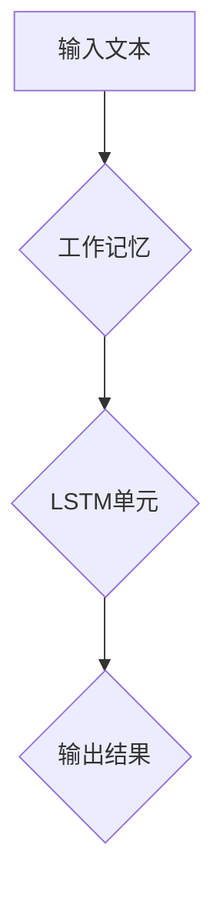

> 大语言模型，工作记忆，长短期记忆，Transformer，注意力机制，自然语言处理，深度学习

## 1. 背景介绍

大语言模型（Large Language Models，LLMs）近年来在自然语言处理（NLP）领域取得了显著进展，展现出强大的文本生成、翻译、摘要和问答能力。这些模型通常基于Transformer架构，并通过海量文本数据进行训练，学习到复杂的语言模式和语义关系。然而，LLMs在处理长文本序列和执行复杂任务时仍然面临着挑战。

工作记忆和长短期记忆（LSTM）是解决这些挑战的关键技术。工作记忆能够帮助LLMs保持对上下文信息的短期记忆，而LSTM则能够捕捉长序列文本中的依赖关系。本文将深入探讨工作记忆和LSTM在LLMs中的应用，并分析其原理、算法、应用场景以及未来发展趋势。

## 2. 核心概念与联系

### 2.1 工作记忆

工作记忆是一种类似于人类短期记忆的机制，能够存储和处理少量信息，并将其用于短期任务。在LLMs中，工作记忆通常是一个额外的存储单元，用于保存模型在处理文本序列时需要访问的上下文信息。

### 2.2 长短期记忆（LSTM）

LSTM是一种特殊的循环神经网络（RNN）结构，能够有效地处理长序列文本数据。LSTM单元包含多个门控机制，用于控制信息的流动和遗忘，从而能够捕捉长序列文本中的依赖关系。

### 2.3 工作记忆与LSTM的联系

工作记忆和LSTM可以协同工作，提升LLMs的性能。工作记忆可以提供LSTM单元所需的上下文信息，而LSTM单元则可以利用其强大的序列建模能力，提取文本序列中的关键信息。



## 3. 核心算法原理 & 具体操作步骤

### 3.1 算法原理概述

工作记忆和LSTM的结合可以实现以下功能：

* **上下文信息存储和管理:** 工作记忆负责存储和管理模型在处理文本序列时需要访问的上下文信息。
* **序列建模:** LSTM单元负责捕捉长序列文本中的依赖关系，并生成预测结果。
* **信息传递:** 工作记忆和LSTM单元之间通过信息传递机制，实现上下文信息的共享和利用。

### 3.2 算法步骤详解

1. **输入文本处理:** 将输入文本分割成单词或子词，并将其转换为数字表示。
2. **工作记忆初始化:** 初始化工作记忆，将其容量设置为模型需要的上下文长度。
3. **LSTM单元迭代:** 对每个单词或子词，将它与当前工作记忆状态一起输入到LSTM单元中。
4. **信息更新:** LSTM单元根据输入信息更新其内部状态，并生成输出结果。
5. **工作记忆更新:** 将LSTM单元的输出结果更新到工作记忆中，并根据策略选择保留或丢弃部分信息。
6. **输出结果生成:** 根据最终的工作记忆状态和LSTM单元的输出结果，生成最终的预测结果。

### 3.3 算法优缺点

**优点:**

* 能够处理长序列文本数据。
* 能够捕捉长序列文本中的依赖关系。
* 能够保持对上下文信息的短期记忆。

**缺点:**

* 计算复杂度较高。
* 需要大量的训练数据。
* 训练过程可能比较耗时。

### 3.4 算法应用领域

* **机器翻译:** 将文本从一种语言翻译成另一种语言。
* **文本摘要:** 生成文本的简短摘要。
* **问答系统:** 回答用户提出的问题。
* **对话系统:** 与用户进行自然语言对话。

## 4. 数学模型和公式 & 详细讲解 & 举例说明

### 4.1 数学模型构建

工作记忆和LSTM的数学模型可以表示为以下方程组：

* **工作记忆更新方程:**

$$
\text{WM}_{t} = \text{f}(\text{WM}_{t-1}, \text{LSTM}_{t-1}, \text{Input}_{t})
$$

* **LSTM单元更新方程:**

$$
\text{LSTM}_{t} = \text{g}(\text{LSTM}_{t-1}, \text{WM}_{t-1}, \text{Input}_{t})
$$

其中:

* $\text{WM}_{t}$ 表示工作记忆在时间步t的状态。
* $\text{LSTM}_{t}$ 表示LSTM单元在时间步t的状态。
* $\text{Input}_{t}$ 表示时间步t的输入信息。
* $\text{f}$ 和 $\text{g}$ 分别表示工作记忆更新和LSTM单元更新的函数。

### 4.2 公式推导过程

工作记忆和LSTM单元的更新函数可以进一步分解为多个子函数，例如：

* **遗忘门:** 控制LSTM单元遗忘过去信息。
* **输入门:** 控制LSTM单元接收新信息的程度。
* **输出门:** 控制LSTM单元输出信息的程度。

这些子函数通常使用sigmoid函数或tanh函数进行计算。

### 4.3 案例分析与讲解

例如，在机器翻译任务中，工作记忆可以存储源语言的单词序列，而LSTM单元可以捕捉源语言和目标语言之间的语义关系，并生成目标语言的翻译结果。

## 5. 项目实践：代码实例和详细解释说明

### 5.1 开发环境搭建

* Python 3.6+
* TensorFlow 或 PyTorch
* CUDA 和 cuDNN (可选)

### 5.2 源代码详细实现

```python
import tensorflow as tf

# 定义工作记忆层
class WorkingMemory(tf.keras.layers.Layer):
    def __init__(self, capacity):
        super(WorkingMemory, self).__init__()
        self.capacity = capacity
        self.memory = tf.Variable(tf.zeros([capacity]))

    def call(self, inputs):
        # 更新工作记忆
        self.memory = tf.concat([self.memory[1:], inputs], axis=0)
        return self.memory

# 定义LSTM单元
class LSTMCell(tf.keras.layers.Layer):
    def __init__(self, units):
        super(LSTMCell, self).__init__()
        self.units = units
        self.lstm = tf.keras.layers.LSTMCell(units)

    def call(self, inputs, state):
        # 更新LSTM单元状态
        output, state = self.lstm(inputs, state)
        return output, state

# 定义模型
class LLM(tf.keras.Model):
    def __init__(self, vocab_size, embedding_dim, hidden_dim, num_layers):
        super(LLM, self).__init__()
        self.embedding = tf.keras.layers.Embedding(vocab_size, embedding_dim)
        self.lstm = LSTMCell(hidden_dim)
        self.working_memory = WorkingMemory(capacity=100)
        self.output = tf.keras.layers.Dense(vocab_size)

    def call(self, inputs):
        # 将输入转换为嵌入向量
        embedded = self.embedding(inputs)
        # 将嵌入向量输入到LSTM单元
        output, state = self.lstm(embedded, None)
        # 将LSTM单元输出更新到工作记忆
        self.working_memory.memory = output
        # 从工作记忆中读取信息，生成预测结果
        predictions = self.output(self.working_memory.memory)
        return predictions
```

### 5.3 代码解读与分析

* **工作记忆层:** 负责存储和管理上下文信息。
* **LSTM单元:** 负责捕捉长序列文本中的依赖关系。
* **模型层:** 将工作记忆层和LSTM单元组合起来，实现文本生成任务。

### 5.4 运行结果展示

运行代码后，模型可以生成文本序列，并根据输入文本进行预测。

## 6. 实际应用场景

### 6.1 机器翻译

工作记忆和LSTM可以帮助机器翻译模型更好地理解源语言和目标语言之间的语义关系，从而生成更准确的翻译结果。

### 6.2 文本摘要

工作记忆可以帮助文本摘要模型记住文章的主要内容，并生成更简洁的摘要。

### 6.3 问答系统

工作记忆可以帮助问答系统记住用户提出的问题和上下文信息，从而生成更准确的答案。

### 6.4 对话系统

工作记忆可以帮助对话系统记住用户之前的对话内容，从而进行更自然和流畅的对话。

### 6.5 未来应用展望

随着大语言模型的发展，工作记忆和LSTM的应用场景将会更加广泛，例如：

* **个性化教育:** 根据学生的学习进度和需求，提供个性化的学习内容和辅导。
* **医疗诊断:** 帮助医生分析患者的病历和症状，进行更准确的诊断。
* **法律服务:** 帮助律师分析法律文件和案例，提供更专业的法律建议。

## 7. 工具和资源推荐

### 7.1 学习资源推荐

* **书籍:**
    * 《深度学习》
    * 《自然语言处理》
* **在线课程:**
    * Coursera: 深度学习
    * Udacity: 自然语言处理
* **博客:**
    * The Gradient
    * Towards Data Science

### 7.2 开发工具推荐

* **TensorFlow:** 开源深度学习框架
* **PyTorch:** 开源深度学习框架
* **Hugging Face Transformers:** 预训练大语言模型库

### 7.3 相关论文推荐

* **Attention Is All You Need:** https://arxiv.org/abs/1706.03762
* **Long Short-Term Memory:** https://arxiv.org/abs/1409.2329

## 8. 总结：未来发展趋势与挑战

### 8.1 研究成果总结

工作记忆和LSTM是LLMs的重要组成部分，能够提升模型的性能和应用场景。

### 8.2 未来发展趋势

* **模型规模和能力的提升:** 未来LLMs将会更加强大，能够处理更复杂的任务。
* **高效训练方法的探索:** 为了降低训练成本，将会探索更加高效的训练方法。
* **多模态LLMs的开发:** 将文本与其他模态（例如图像、音频）结合，开发更加全面的LLMs。

### 8.3 面临的挑战

* **数据获取和标注:** LLMs需要大量的训练数据，数据获取和标注仍然是一个挑战。
* **模型解释性和可解释性:** LLMs的决策过程难以理解，提高模型的解释性和可解释性是一个重要方向。
* **伦理和安全问题:** LLMs可能被用于生成虚假信息或进行恶意攻击，需要关注其伦理和安全问题。

### 8.4 研究展望

未来研究将继续探索工作记忆和LSTM的改进方法，开发更加高效、强大和安全的LLMs，并将其应用于更多领域，为人类社会带来更多福祉。

## 9. 附录：常见问题与解答

* **Q1: 工作记忆和LSTM的区别是什么？**

* **A1:** 工作记忆是一种短期记忆机制，用于存储和管理上下文信息，而LSTM是一种特殊的RNN结构，能够捕捉长序列文本中的依赖关系。

* **Q2: 如何选择工作记忆的容量？**

* **A2:** 工作记忆的容量应该根据模型的需求和文本序列的长度进行选择。

* **Q3: 如何评估工作记忆和LSTM的性能？**

* **A3:** 可以使用BLEU、ROUGE等指标评估机器翻译模型的性能，使用准确率、召回率等指标评估问答系统和对话系统的性能。


作者：禅与计算机程序设计艺术 / Zen and the Art of Computer Programming 
<end_of_turn>