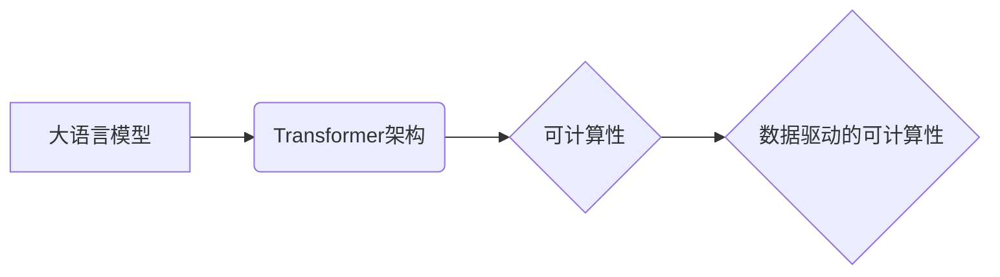

> 大语言模型、Transformer、自然语言处理、可计算性、人工智能、深度学习

## 1. 背景介绍

近年来，人工智能（AI）领域取得了令人瞩目的进展，其中大语言模型（LLM）作为一种强大的工具，在自然语言处理（NLP）领域展现出非凡的潜力。LLM能够理解和生成人类语言，并完成各种复杂的任务，例如文本生成、翻译、问答、代码生成等。

传统的计算模型主要依赖于明确的指令和规则，而LLM则通过学习海量文本数据，掌握语言的复杂模式和规律，从而实现智能化的可计算性。这种基于学习的计算方式，为人工智能的发展带来了新的机遇和挑战。

## 2. 核心概念与联系

**2.1  大语言模型 (LLM)**

大语言模型是指拥有大量参数（通常数百万或数十亿）的深度学习模型，通过训练大量的文本数据，学习语言的语法、语义和上下文关系。

**2.2  Transformer 架构**

Transformer是一种专门用于处理序列数据的深度学习架构，其核心是“注意力机制”，能够有效地捕捉文本中的长距离依赖关系。

**2.3  可计算性**

可计算性是指一个问题是否可以通过有限的步骤和资源得到解决。传统计算模型依赖于明确的算法和规则，而LLM通过学习数据，实现了一种新的可计算性形式，即“数据驱动的可计算性”。

**2.4  关系图**

## 3. 核心算法原理 & 具体操作步骤

**3.1  算法原理概述**

LLM的核心算法是基于Transformer架构的深度学习模型，其训练过程主要包括以下步骤：

1. **数据预处理:** 将文本数据进行清洗、分词、标记等预处理操作。
2. **模型训练:** 使用训练数据训练Transformer模型，通过反向传播算法优化模型参数。
3. **模型评估:** 使用测试数据评估模型的性能，例如准确率、困惑度等。
4. **模型部署:** 将训练好的模型部署到实际应用场景中。

**3.2  算法步骤详解**

1. **输入编码:** 将输入文本序列转换为数字向量，每个单词对应一个词嵌入向量。
2. **注意力机制:** 利用注意力机制计算每个词与其他词之间的相关性，捕捉文本中的长距离依赖关系。
3. **多头注意力:** 使用多个注意力头并行计算，增强模型对不同语义信息的捕捉能力。
4. **前馈网络:** 对注意力输出进行非线性变换，提取更深层的语义特征。
5. **解码:** 将编码后的文本序列解码成输出文本序列。

**3.3  算法优缺点**

**优点:**

* 能够处理长文本序列，捕捉长距离依赖关系。
* 表现出强大的文本生成、翻译、问答等能力。
* 可通过微调实现特定任务的优化。

**缺点:**

* 训练成本高，需要大量计算资源和数据。
* 容易受到训练数据偏差的影响。
* 对输入文本长度存在限制。

**3.4  算法应用领域**

* 自然语言处理：文本生成、翻译、问答、摘要、情感分析等。
* 代码生成：自动生成代码、代码补全、代码翻译等。
* 人机交互：聊天机器人、语音助手等。
* 其他领域：科学研究、医疗诊断、金融分析等。

## 4. 数学模型和公式 & 详细讲解 & 举例说明

**4.1  数学模型构建**

LLM的数学模型主要基于神经网络，其核心是Transformer架构。Transformer模型由编码器和解码器两部分组成，每个部分由多个注意力层和前馈网络组成。

**4.2  公式推导过程**

注意力机制的核心公式是：

$$
Attention(Q, K, V) = softmax(\frac{QK^T}{\sqrt{d_k}})V
$$

其中：

* $Q$：查询矩阵
* $K$：键矩阵
* $V$：值矩阵
* $d_k$：键向量的维度
* $softmax$：softmax函数

**4.3  案例分析与讲解**

假设我们有一个句子“我爱学习编程”，将其输入到Transformer模型中，注意力机制会计算每个词与其他词之间的相关性。例如，“学习”与“编程”之间的相关性较高，因为它们共同表达了同一个主题。

## 5. 项目实践：代码实例和详细解释说明

**5.1  开发环境搭建**

使用Python语言和深度学习框架TensorFlow或PyTorch搭建开发环境。

**5.2  源代码详细实现**

使用预训练的LLM模型，例如BERT或GPT-3，进行微调，实现特定任务。

**5.3  代码解读与分析**

解释代码中使用的函数、类和参数，以及模型训练和预测过程。

**5.4  运行结果展示**

展示模型在特定任务上的性能，例如文本生成、翻译、问答等。

## 6. 实际应用场景

**6.1  文本生成**

LLM可以用于生成各种类型的文本，例如小说、诗歌、新闻报道、广告文案等。

**6.2  机器翻译**

LLM可以用于将文本从一种语言翻译成另一种语言，例如英语翻译成中文。

**6.3  问答系统**

LLM可以用于构建问答系统，能够回答用户提出的问题。

**6.4  未来应用展望**

LLM在未来将应用于更广泛的领域，例如教育、医疗、法律等，为人类社会带来更多便利和价值。

## 7. 工具和资源推荐

**7.1  学习资源推荐**

* **书籍:**《深度学习》、《自然语言处理》
* **在线课程:** Coursera、edX、Udacity
* **博客:** OpenAI Blog、Hugging Face Blog

**7.2  开发工具推荐**

* **深度学习框架:** TensorFlow、PyTorch
* **文本处理工具:** NLTK、spaCy
* **云计算平台:** AWS、Google Cloud、Azure

**7.3  相关论文推荐**

* 《Attention Is All You Need》
* 《BERT: Pre-training of Deep Bidirectional Transformers for Language Understanding》
* 《GPT-3: Language Models are Few-Shot Learners》

## 8. 总结：未来发展趋势与挑战

**8.1  研究成果总结**

LLM在自然语言处理领域取得了显著的进展，展现出强大的能力和潜力。

**8.2  未来发展趋势**

* 模型规模和能力的进一步提升
* 跨模态理解和生成
* 更加安全、可靠和可解释的LLM

**8.3  面临的挑战**

* 数据偏见和公平性问题
* 计算资源消耗
* 伦理和社会影响

**8.4  研究展望**

未来研究将重点关注解决LLM面临的挑战，使其更加安全、可靠、可解释和普惠。

## 9. 附录：常见问题与解答

**9.1  LLM的训练数据来源？**

LLM的训练数据通常来自公开的文本数据集，例如维基百科、书籍、新闻报道等。

**9.2  LLM的训练成本高吗？**

是的，LLM的训练成本很高，需要大量的计算资源和时间。

**9.3  LLM是否可以理解人类语言？**

LLM能够模拟人类语言的生成和理解，但其是否真正理解语言仍然是一个开放性问题。

**9.4  LLM的应用场景有哪些？**

LLM的应用场景非常广泛，例如文本生成、机器翻译、问答系统、代码生成等。

**9.5  如何使用LLM？**

可以使用预训练的LLM模型，或者自己训练模型，然后将其部署到实际应用场景中。

作者：禅与计算机程序设计艺术 / Zen and the Art of Computer Programming 
<end_of_turn>