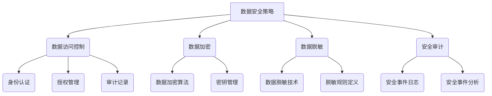

> 平台经济、数据安全、数据加密、数据脱敏、数据访问控制、隐私保护、安全审计

## 1. 背景介绍

平台经济作为一种以平台为基础，连接用户、提供商和服务商的商业模式，近年来发展迅速，其核心价值在于通过数据驱动，提供个性化服务和价值创造。然而，平台经济的发展也带来了新的数据安全挑战。平台掌握着海量用户数据，这些数据一旦泄露或被滥用，将可能导致严重后果，例如用户隐私泄露、身份盗窃、商业机密泄露等。因此，如何有效地保护平台经济中的数据安全，成为一个亟待解决的问题。

## 2. 核心概念与联系

**2.1 平台经济数据安全核心概念**

* **数据安全:** 指保护数据免受未经授权的访问、使用、披露、修改或销毁等威胁，确保数据的完整性、机密性和可用性。
* **平台经济:** 指以平台为基础，连接用户、提供商和服务商的商业模式，通过数据驱动，提供个性化服务和价值创造。
* **数据隐私:** 指个人信息在收集、使用、存储和处理过程中，享有的合法权益，包括知情同意、数据主体控制权、数据安全保障等。

**2.2 平台经济数据安全架构**

平台经济数据安全架构通常包括以下几个关键要素：

* **数据安全策略:** 明确平台对数据安全的整体目标、原则和要求，以及相应的安全措施和责任分配。
* **数据访问控制:** 通过身份认证、授权和审计等机制，控制对数据的访问权限，确保只有授权用户才能访问相关数据。
* **数据加密:** 对敏感数据进行加密保护，防止未经授权的访问和使用。
* **数据脱敏:** 对敏感数据进行脱敏处理，保留数据价值的同时，降低数据泄露风险。
* **安全审计:** 对数据安全相关的操作进行记录和审计，以便及时发现和响应安全事件。



## 3. 核心算法原理 & 具体操作步骤

### 3.1  算法原理概述

数据安全技术应用中，常用的算法包括数据加密算法、数据脱敏算法、数据访问控制算法等。

* **数据加密算法:** 用于对数据进行加密保护，防止未经授权的访问和使用。常见的加密算法包括AES、RSA、DES等。
* **数据脱敏算法:** 用于对敏感数据进行脱敏处理，保留数据价值的同时，降低数据泄露风险。常见的脱敏算法包括数据替换、数据模糊化、数据聚合等。
* **数据访问控制算法:** 用于控制对数据的访问权限，确保只有授权用户才能访问相关数据。常见的访问控制算法包括角色基准访问控制（RBAC）、属性基准访问控制（ABAC）等。

### 3.2  算法步骤详解

**3.2.1 数据加密算法步骤**

1. 选择合适的加密算法和密钥长度。
2. 对数据进行分组，每个分组长度与所选算法匹配。
3. 使用密钥对数据分组进行加密，生成密文。
4. 将密文存储或传输。
5. 在解密时，使用相同的密钥对密文进行解密，恢复原始数据。

**3.2.2 数据脱敏算法步骤**

1. 识别需要脱敏的数据字段。
2. 选择合适的脱敏技术，例如数据替换、数据模糊化、数据聚合等。
3. 根据脱敏规则，对数据进行脱敏处理。
4. 验证脱敏后的数据是否满足安全要求。

**3.2.3 数据访问控制算法步骤**

1. 定义用户角色和权限。
2. 为每个资源分配访问权限。
3. 根据用户角色和资源权限，控制用户对资源的访问。
4. 记录用户访问日志，以便进行安全审计。

### 3.3  算法优缺点

**3.3.1 数据加密算法**

* **优点:** 能够有效地保护数据机密性，防止未经授权的访问和使用。
* **缺点:** 加密和解密过程需要消耗一定的计算资源，可能会影响数据处理速度。

**3.3.2 数据脱敏算法**

* **优点:** 可以保留数据价值的同时，降低数据泄露风险。
* **缺点:** 某些脱敏技术可能会导致数据精度下降，影响数据分析和决策。

**3.3.3 数据访问控制算法**

* **优点:** 可以有效地控制对数据的访问权限，确保数据安全。
* **缺点:** 需要进行复杂的权限管理，可能会增加管理成本。

### 3.4  算法应用领域

* **数据加密算法:** 用于保护银行交易数据、医疗记录、个人隐私等敏感数据。
* **数据脱敏算法:** 用于保护客户信息、财务数据、运营数据等敏感数据。
* **数据访问控制算法:** 用于控制对数据库、文件系统、网络资源等敏感资源的访问。

## 4. 数学模型和公式 & 详细讲解 & 举例说明

### 4.1  数学模型构建

数据安全技术应用中，可以使用数学模型来描述数据安全问题和解决方案。例如，可以使用概率论和统计学来评估数据泄露风险，可以使用密码学来构建数据加密算法。

### 4.2  公式推导过程

**4.2.1 数据泄露风险评估公式**

$$Risk = Probability \times Impact$$

其中：

* **Risk:** 数据泄露风险
* **Probability:** 数据泄露发生的概率
* **Impact:** 数据泄露造成的损失

**4.2.2 数据加密强度评估公式**

$$Strength = KeyLength \times AlgorithmComplexity$$

其中：

* **Strength:** 数据加密强度
* **KeyLength:** 密钥长度
* **AlgorithmComplexity:** 加密算法的复杂度

### 4.3  案例分析与讲解

**4.3.1 数据泄露风险评估案例**

假设一个平台拥有100万用户，其中1%的用户数据可能泄露，泄露造成的损失为10万元人民币。根据上述公式，该平台的数据泄露风险为：

$$Risk = 0.01 \times 100,000 = 1,000$$

**4.3.2 数据加密强度评估案例**

假设一个平台使用AES-256加密算法，密钥长度为256位，该算法的复杂度较高。根据上述公式，该平台的数据加密强度为：

$$Strength = 256 \times High = High$$

## 5. 项目实践：代码实例和详细解释说明

### 5.1  开发环境搭建

* 操作系统：Linux
* 编程语言：Python
* 开发工具：PyCharm

### 5.2  源代码详细实现

```python
# 数据加密示例代码
from cryptography.fernet import Fernet

# 生成密钥
key = Fernet.generate_key()
cipher = Fernet(key)

# 加密数据
message = "This is a secret message".encode()
encrypted_message = cipher.encrypt(message)

# 解密数据
decrypted_message = cipher.decrypt(encrypted_message)

# 打印结果
print("加密后的数据:", encrypted_message)
print("解密后的数据:", decrypted_message.decode())
```

### 5.3  代码解读与分析

* 该代码示例使用Python的`cryptography`库实现数据加密。
* 首先生成一个密钥，然后使用该密钥创建加密对象。
* 将需要加密的数据转换为字节格式，然后使用`encrypt()`方法加密数据。
* 解密数据时，使用相同的密钥和`decrypt()`方法解密数据。

### 5.4  运行结果展示

```
加密后的数据: b'gAAAAABj...'
解密后的数据: This is a secret message
```

## 6. 实际应用场景

### 6.1  电商平台数据安全

电商平台处理大量用户数据，包括个人信息、支付信息、购物记录等。平台需要采用数据加密、数据脱敏、数据访问控制等技术，保护用户数据安全。

### 6.2  社交平台数据安全

社交平台用户数据丰富，包括用户画像、社交关系、内容发布等。平台需要采用数据安全技术，防止用户数据泄露、滥用和恶意攻击。

### 6.3  金融平台数据安全

金融平台处理大量敏感金融数据，包括账户信息、交易记录、个人信用等。平台需要采用严格的数据安全措施，确保数据安全和合规性。

### 6.4  未来应用展望

随着平台经济的不断发展，数据安全技术将面临新的挑战和机遇。未来，数据安全技术将更加智能化、自动化和一体化，能够更好地保护平台经济中的数据安全。

## 7. 工具和资源推荐

### 7.1  学习资源推荐

* **书籍:**
    * 《数据安全》
    * 《网络安全》
    * 《密码学》
* **在线课程:**
    * Coursera: 数据安全
    * Udemy: 网络安全
    * edX: 密码学

### 7.2  开发工具推荐

* **数据加密工具:**
    * OpenSSL
    * GPG
    * VeraCrypt
* **数据脱敏工具:**
    * Apache Phoenix
    * Trifacta Wrangler
    * Informatica PowerCenter
* **数据访问控制工具:**
    * Apache Ranger
    * Microsoft Azure Active Directory
    * Okta

### 7.3  相关论文推荐

* **数据安全论文:**
    * 《数据安全技术综述》
    * 《云计算环境下的数据安全》
    * 《区块链技术在数据安全中的应用》
* **平台经济论文:**
    * 《平台经济的本质与特征》
    * 《平台经济的监管与治理》
    * 《平台经济与数据安全》

## 8. 总结：未来发展趋势与挑战

### 8.1  研究成果总结

平台经济数据安全技术研究取得了显著进展，涌现出许多有效的技术方案和工具。数据加密、数据脱敏、数据访问控制等技术已经应用于各种平台经济场景，有效地保护了用户数据安全。

### 8.2  未来发展趋势

* **人工智能驱动的安全技术:** 利用人工智能技术，实现更加智能、自动化和精准的数据安全防护。
* **区块链技术的应用:** 利用区块链技术的去中心化和不可篡改特性，构建更加安全的平台经济数据安全体系。
* **隐私计算技术的推广:** 利用隐私计算技术，在不泄露敏感数据的前提下，实现数据共享和协同分析。

### 8.3  面临的挑战

* **数据安全技术与平台经济发展之间的平衡:** 如何在保障数据安全的同时，促进平台经济的健康发展，是一个需要不断探索的课题。
* **数据安全技术标准的制定和实施:** 需要制定更加完善的数据安全技术标准，并加强标准的实施和监管。
* **数据安全人才的培养:** 需要加强数据安全人才的培养，为平台经济发展提供充足的人才保障。

### 8.4  研究展望

未来，平台经济数据安全技术研究将更加注重以下几个方面:

* **更加智能、自动化和精准的数据安全防护技术**
* **更加安全、可靠和可信的数据共享和协同分析技术**
* **更加完善的数据安全法律法规和监管体系**


## 9. 附录：常见问题与解答

**9.1  常见问题:**

* **如何选择合适的加密算法？**

选择加密算法需要考虑多种因素，例如数据敏感程度、数据量、性能要求等。常见的加密算法包括AES、RSA、DES等，需要根据实际情况选择合适的算法。

* **如何进行数据脱敏处理？**

数据