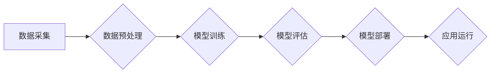

> AI 2.0, 开发工具, 效率提升, 机器学习, 深度学习, 自然语言处理, 计算机视觉, 自动化, 代码生成

## 1. 背景介绍

人工智能（AI）技术近年来发展迅速，从最初的局限性应用，逐渐发展到广泛应用于各个领域，如医疗、金融、教育、娱乐等。随着 AI 技术的不断进步，AI 2.0 时代已经到来，其核心特征是更智能、更强大、更普惠。

AI 2.0 的应用开发面临着新的挑战和机遇。一方面，AI 2.0 应用的复杂性不断增加，需要更强大的开发工具和技术支持；另一方面，AI 2.0 应用的开发周期长，成本高，需要更高效的开发流程和方法。

为了应对这些挑战，开发高效的 AI 2.0 应用开发工具至关重要。这些工具可以帮助开发者更快速、更便捷地构建、训练和部署 AI 2.0 应用，从而加速 AI 技术的普及和应用。

## 2. 核心概念与联系

AI 2.0 应用开发工具的核心概念包括：

* **自动化**: 自动化是 AI 2.0 应用开发的核心要素之一。通过自动化流程，可以减少人工干预，提高开发效率。
* **可视化**: 可视化工具可以帮助开发者更直观地理解和操作 AI 模型，降低开发门槛。
* **云计算**: 云计算平台为 AI 2.0 应用开发提供了强大的计算资源和存储空间，可以满足大规模模型训练和部署的需求。
* **机器学习**: 机器学习算法是 AI 2.0 应用的核心技术之一，可以帮助模型自动学习和优化。
* **深度学习**: 深度学习是机器学习的一种高级形式，可以处理更复杂的数据，构建更强大的 AI 模型。

**Mermaid 流程图**



## 3. 核心算法原理 & 具体操作步骤

### 3.1  算法原理概述

AI 2.0 应用开发工具通常基于机器学习和深度学习算法。这些算法可以帮助模型自动学习和优化，从而实现各种 AI 功能，如图像识别、自然语言处理、语音识别等。

### 3.2  算法步骤详解

1. **数据采集**: 收集用于训练模型的数据。
2. **数据预处理**: 对数据进行清洗、转换和特征工程，使其适合模型训练。
3. **模型选择**: 选择合适的机器学习或深度学习模型。
4. **模型训练**: 使用训练数据训练模型，调整模型参数，使其能够准确预测或分类数据。
5. **模型评估**: 使用测试数据评估模型的性能，并进行调整和优化。
6. **模型部署**: 将训练好的模型部署到实际应用环境中。

### 3.3  算法优缺点

**优点**:

* 自动化学习能力，无需人工编程。
* 能够处理海量数据，发现隐藏模式。
* 性能不断提升，应用范围不断扩大。

**缺点**:

* 需要大量数据进行训练。
* 训练过程耗时和耗能。
* 模型解释性较差，难以理解模型决策过程。

### 3.4  算法应用领域

* **计算机视觉**: 图像识别、物体检测、图像分类、人脸识别等。
* **自然语言处理**: 文本分类、情感分析、机器翻译、对话系统等。
* **语音识别**: 语音转文本、语音助手等。
* **推荐系统**: 商品推荐、内容推荐等。
* **医疗诊断**: 疾病诊断、影像分析等。

## 4. 数学模型和公式 & 详细讲解 & 举例说明

### 4.1  数学模型构建

AI 2.0 应用开发工具通常基于数学模型进行构建。这些模型可以描述数据之间的关系，并用于预测或分类数据。

例如，线性回归模型可以描述数据之间的线性关系，其数学公式如下：

$$y = mx + c$$

其中，y 是预测值，x 是输入特征，m 是斜率，c 是截距。

### 4.2  公式推导过程

AI 2.0 应用开发工具的算法通常需要推导复杂的数学公式，以实现模型训练和优化。

例如，深度学习模型的训练过程需要使用梯度下降算法，其核心公式如下：

$$\theta = \theta - \alpha \nabla J(\theta)$$

其中，θ 是模型参数，α 是学习率，∇J(θ) 是损失函数 J(θ) 的梯度。

### 4.3  案例分析与讲解

假设我们想要构建一个预测房价的 AI 2.0 应用。我们可以使用线性回归模型，其输入特征包括房屋面积、房间数量、地理位置等，输出特征是房价。

通过训练数据，我们可以学习到模型参数 m 和 c，从而预测新房子的房价。

## 5. 项目实践：代码实例和详细解释说明

### 5.1  开发环境搭建

AI 2.0 应用开发通常需要使用 Python 语言和相关的库，如 TensorFlow、PyTorch、Scikit-learn 等。

开发环境搭建包括安装 Python 语言、相关库和 IDE 工具。

### 5.2  源代码详细实现

以下是一个使用 Python 和 Scikit-learn 库构建线性回归模型的代码示例：

```python
from sklearn.linear_model import LinearRegression
from sklearn.model_selection import train_test_split
from sklearn.metrics import mean_squared_error

# 加载数据
data = ...

# 分割数据
X_train, X_test, y_train, y_test = train_test_split(data[:, :-1], data[:, -1], test_size=0.2)

# 创建线性回归模型
model = LinearRegression()

# 训练模型
model.fit(X_train, y_train)

# 预测测试数据
y_pred = model.predict(X_test)

# 计算模型性能
mse = mean_squared_error(y_test, y_pred)
print(f"Mean Squared Error: {mse}")
```

### 5.3  代码解读与分析

这段代码首先加载数据，然后使用 train_test_split 函数将数据分割成训练集和测试集。

接着，创建 LinearRegression 模型对象，并使用 fit 函数训练模型。

最后，使用 predict 函数预测测试数据，并使用 mean_squared_error 函数计算模型性能。

### 5.4  运行结果展示

运行代码后，会输出模型的 Mean Squared Error 值，该值越小，模型性能越好。

## 6. 实际应用场景

AI 2.0 应用开发工具在各个领域都有广泛的应用场景，例如：

### 6.1  医疗保健

* **疾病诊断**: 利用 AI 2.0 技术分析患者的病历、影像数据等，辅助医生进行疾病诊断。
* **药物研发**: 利用 AI 2.0 技术加速药物研发过程，例如预测药物的有效性、安全性等。

### 6.2  金融服务

* **欺诈检测**: 利用 AI 2.0 技术分析交易数据，识别和预防金融欺诈行为。
* **风险管理**: 利用 AI 2.0 技术评估投资风险，帮助投资者做出更明智的决策。

### 6.3  教育

* **个性化学习**: 利用 AI 2.0 技术根据学生的学习情况，提供个性化的学习内容和辅导。
* **智能批改**: 利用 AI 2.0 技术自动批改学生的作业，提高效率。

### 6.4  未来应用展望

AI 2.0 应用开发工具的未来发展趋势包括：

* **更强大的 AI 模型**: 随着算法和计算能力的提升，AI 模型将更加强大，能够处理更复杂的任务。
* **更易于使用的开发工具**: 开发工具将更加易于使用，降低开发门槛，让更多人能够参与到 AI 应用开发中。
* **更广泛的应用场景**: AI 2.0 应用将应用于更多领域，例如自动驾驶、机器人、虚拟现实等。

## 7. 工具和资源推荐

### 7.1  学习资源推荐

* **在线课程**: Coursera、edX、Udacity 等平台提供丰富的 AI 相关课程。
* **书籍**: 《深度学习》、《机器学习实战》等书籍是学习 AI 的经典教材。
* **博客**: 许多 AI 领域的专家和学者在博客上分享他们的研究成果和经验。

### 7.2  开发工具推荐

* **TensorFlow**: Google 开发的开源深度学习框架。
* **PyTorch**: Facebook 开发的开源深度学习框架。
* **Scikit-learn**: Python 的机器学习库。
* **Keras**: TensorFlow 和 Theano 的高层 API，简化深度学习模型的构建。

### 7.3  相关论文推荐

* **《ImageNet Classification with Deep Convolutional Neural Networks》**: AlexNet 模型的论文。
* **《Attention Is All You Need》**: Transformer 模型的论文。
* **《BERT: Pre-training of Deep Bidirectional Transformers for Language Understanding》**: BERT 模型的论文。

## 8. 总结：未来发展趋势与挑战

### 8.1  研究成果总结

AI 2.0 应用开发工具的发展取得了显著成果，为 AI 技术的普及和应用提供了强大的支持。

### 8.2  未来发展趋势

AI 2.0 应用开发工具将朝着更智能、更自动化、更易于使用的方向发展。

### 8.3  面临的挑战

AI 2.0 应用开发工具还面临着一些挑战，例如：

* **数据安全**: AI 模型的训练需要大量数据，如何保证数据的安全和隐私是一个重要问题。
* **算法解释性**: 许多 AI 模型的决策过程难以解释，这可能会导致模型的不可信赖性。
* **伦理问题**: AI 技术的应用可能会带来一些伦理问题，例如算法偏见、工作岗位替代等。

### 8.4  研究展望

未来，需要进一步研究 AI 2.0 应用开发工具的安全性、可解释性和伦理问题，以确保 AI 技术的健康发展。

## 9. 附录：常见问题与解答

**常见问题**:

* 如何选择合适的 AI 2.0 应用开发工具？
* 如何训练和部署 AI 2.0 应用？
* 如何解决 AI 2.0 应用开发中的常见问题？

**解答**:

* 选择合适的 AI 2.0 应用开发工具需要根据具体的应用场景和需求进行选择。
* 训练和部署 AI 2.0 应用需要掌握相关的技术和工具。
* 常见问题可以通过查阅相关文档、寻求专家帮助等方式解决。


作者：禅与计算机程序设计艺术 / Zen and the Art of Computer Programming 
<end_of_turn>