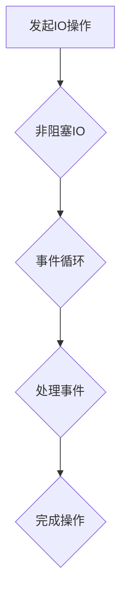

> 异步处理、非阻塞IO、事件循环、协程、线程池、高性能、并发、效率

## 1. 背景介绍

在现代软件开发中，处理大量并发请求和任务是至关重要的。传统的同步处理模式，即程序一次执行一个操作，直到完成再执行下一个操作，在面对大量并发请求时会面临性能瓶颈。异步处理技术应运而生，它允许程序在执行一个操作时，可以同时处理其他操作，从而提高程序的效率和响应速度。

异步处理技术广泛应用于各种领域，例如：

* **Web 服务器:** 处理大量用户请求，提供快速响应。
* **游戏服务器:** 处理玩家操作和游戏逻辑，保证游戏流畅运行。
* **数据处理系统:** 处理大规模数据，提高数据处理速度。
* **实时通信系统:** 处理实时消息，保证消息及时传递。

## 2. 核心概念与联系

异步处理的核心概念是**非阻塞IO**和**事件循环**。

* **非阻塞IO:**  程序在发起IO操作后，不会阻塞等待IO操作完成，而是继续执行其他操作。当IO操作完成时，程序会收到通知，并处理相应的事件。
* **事件循环:**  程序维护一个事件队列，用于存储所有待处理的事件。程序不断从事件队列中取出事件，并执行相应的处理逻辑。

**异步处理技术架构**



## 3. 核心算法原理 & 具体操作步骤

### 3.1  算法原理概述

异步处理的核心算法是**事件驱动模型**。该模型将程序的执行流程分解成一系列事件，每个事件都对应一个特定的处理逻辑。程序通过监听事件，并根据事件类型执行相应的处理逻辑，从而实现异步处理。

### 3.2  算法步骤详解

1. **发起IO操作:** 程序发起一个IO操作，例如读取文件、发送网络请求等。
2. **非阻塞等待:** 程序在发起IO操作后，不会阻塞等待IO操作完成，而是继续执行其他操作。
3. **事件通知:** 当IO操作完成时，系统会向程序发送一个事件通知。
4. **事件处理:** 程序收到事件通知后，会从事件队列中取出事件，并执行相应的处理逻辑。
5. **完成操作:** 处理逻辑完成后，IO操作完成。

### 3.3  算法优缺点

**优点:**

* **提高效率:** 异步处理可以避免程序阻塞在IO操作上，从而提高程序的效率和响应速度。
* **并发处理:** 异步处理可以同时处理多个IO操作，提高程序的并发能力。
* **资源利用率高:** 异步处理可以更好地利用系统资源，例如CPU和内存。

**缺点:**

* **开发复杂度高:** 异步处理的开发复杂度较高，需要对事件驱动模型和非阻塞IO有深入的理解。
* **错误处理复杂:** 异步处理的错误处理较为复杂，需要考虑多个事件的处理逻辑。
* **调试难度大:** 异步处理的调试难度较大，需要使用专门的调试工具。

### 3.4  算法应用领域

异步处理技术广泛应用于以下领域：

* **Web 服务器:** 处理大量用户请求，提供快速响应。
* **游戏服务器:** 处理玩家操作和游戏逻辑，保证游戏流畅运行。
* **数据处理系统:** 处理大规模数据，提高数据处理速度。
* **实时通信系统:** 处理实时消息，保证消息及时传递。

## 4. 数学模型和公式 & 详细讲解 & 举例说明

### 4.1  数学模型构建

异步处理的性能可以利用**吞吐量**和**延迟**两个指标来衡量。

* **吞吐量:** 指的是单位时间内处理的请求数量。
* **延迟:** 指的是从收到请求到完成请求所花费的时间。

我们可以用以下公式来表示异步处理的吞吐量和延迟：

$$
吞吐量 = \frac{请求数量}{时间}
$$

$$
延迟 = \frac{完成时间 - 请求时间}{1}
$$

### 4.2  公式推导过程

吞吐量和延迟的公式推导过程比较简单，主要基于时间和数量的计算关系。

### 4.3  案例分析与讲解

假设一个异步处理系统每秒可以处理1000个请求，平均每个请求的处理时间为10毫秒。那么，该系统的吞吐量为1000个请求/秒，延迟为10毫秒。

## 5. 项目实践：代码实例和详细解释说明

### 5.1  开发环境搭建

本示例使用Python语言和asyncio库进行实现。

* 安装Python：https://www.python.org/downloads/
* 安装asyncio库：pip install asyncio

### 5.2  源代码详细实现

```python
import asyncio
import time

async def fetch_data(url):
    print(f"Fetching data from {url}...")
    await asyncio.sleep(1)  # 模拟网络请求延迟
    print(f"Data fetched from {url}")
    return f"Data from {url}"

async def main():
    tasks = [fetch_data(f"https://example.com/{i}") for i in range(5)]
    results = await asyncio.gather(*tasks)
    for result in results:
        print(result)

if __name__ == "__main__":
    asyncio.run(main())
```

### 5.3  代码解读与分析

* `fetch_data`函数模拟从网络获取数据的操作，使用`asyncio.sleep`模拟网络延迟。
* `main`函数创建多个`fetch_data`任务，并使用`asyncio.gather`并发执行这些任务。
* `asyncio.run`启动事件循环，并执行`main`函数。

### 5.4  运行结果展示

```
Fetching data from https://example.com/0...
Fetching data from https://example.com/1...
Fetching data from https://example.com/2...
Fetching data from https://example.com/3...
Fetching data from https://example.com/4...
Data fetched from https://example.com/0
Data fetched from https://example.com/1
Data fetched from https://example.com/2
Data fetched from https://example.com/3
Data fetched from https://example.com/4
```

## 6. 实际应用场景

### 6.1  Web 服务器

在Web服务器中，异步处理可以提高服务器的响应速度和处理能力。例如，当用户访问一个网页时，服务器可以异步处理HTML、CSS和JavaScript文件的请求，从而更快地返回网页内容。

### 6.2  游戏服务器

在游戏服务器中，异步处理可以提高游戏的流畅度和响应速度。例如，当玩家执行一个操作时，服务器可以异步处理玩家操作的逻辑，并更新游戏状态，从而保证游戏运行流畅。

### 6.3  数据处理系统

在数据处理系统中，异步处理可以提高数据处理速度和效率。例如，当系统需要处理大规模数据时，可以异步处理数据，并并行执行数据处理任务，从而缩短数据处理时间。

### 6.4  未来应用展望

随着云计算、物联网等技术的快速发展，异步处理技术将有更广泛的应用场景。例如，在云计算环境中，异步处理可以提高资源利用率和系统性能；在物联网环境中，异步处理可以处理海量设备数据，并提供实时数据分析和决策支持。

## 7. 工具和资源推荐

### 7.1  学习资源推荐

* **书籍:**
    * 《Python Concurrency with Asyncio》
    * 《Async Programming with Python》
* **在线课程:**
    * Udemy: Asyncio for Beginners
    * Coursera: Python for Everybody Specialization

### 7.2  开发工具推荐

* **Python:** https://www.python.org/
* **asyncio库:** https://docs.python.org/3/library/asyncio.html
* **Visual Studio Code:** https://code.visualstudio.com/

### 7.3  相关论文推荐

* **"Asynchronous Programming with Coroutines"**
* **"The Art of Asynchronous Programming"**

## 8. 总结：未来发展趋势与挑战

### 8.1  研究成果总结

异步处理技术已经取得了显著的成果，在提高程序性能、并发能力和资源利用率方面发挥了重要作用。

### 8.2  未来发展趋势

* **更强大的异步编程模型:** 未来可能会出现更强大的异步编程模型，例如基于协程的异步编程模型，以及更灵活的事件驱动模型。
* **更智能的异步调度:** 未来可能会出现更智能的异步调度算法，能够根据任务的特性和系统状态，更有效地调度异步任务。
* **更广泛的应用场景:** 随着云计算、物联网等技术的快速发展，异步处理技术将有更广泛的应用场景。

### 8.3  面临的挑战

* **开发复杂度:** 异步处理的开发复杂度较高，需要对事件驱动模型和非阻塞IO有深入的理解。
* **错误处理复杂:** 异步处理的错误处理较为复杂，需要考虑多个事件的处理逻辑。
* **调试难度大:** 异步处理的调试难度较大，需要使用专门的调试工具。

### 8.4  研究展望

未来，异步处理技术的研究方向将集中在以下几个方面:

* **开发更易于使用的异步编程模型和工具:** 降低异步处理的开发门槛，使其更易于被广泛应用。
* **提高异步处理的性能和效率:** 研究更有效的异步调度算法和数据结构，提高异步处理的性能和效率。
* **解决异步处理的安全性问题:** 确保异步处理程序的安全性，防止数据泄露和安全漏洞。


## 9. 附录：常见问题与解答

**1. 异步处理和同步处理的区别是什么？**

* **同步处理:** 程序一次执行一个操作，直到完成再执行下一个操作。
* **异步处理:** 程序可以同时处理多个操作，即使一个操作还没有完成，程序也可以继续执行其他操作。

**2. 异步处理的优点是什么？**

* 提高效率
* 并发处理
* 资源利用率高

**3. 异步处理的缺点是什么？**

* 开发复杂度高
* 错误处理复杂
* 调试难度大

**4. 如何选择异步处理还是同步处理？**

* 如果程序需要处理大量并发请求，或者需要提高程序的响应速度，可以选择异步处理。
* 如果程序的逻辑简单，并且不需要处理大量并发请求，可以选择同步处理。

**5. 如何调试异步处理程序？**

* 使用专门的调试工具，例如pdb、py-spy等。
* 添加日志记录，跟踪程序的执行流程。
* 使用断点调试，暂停程序的执行，检查程序的状态。


作者：禅与计算机程序设计艺术 / Zen and the Art of Computer Programming 
<end_of_turn>