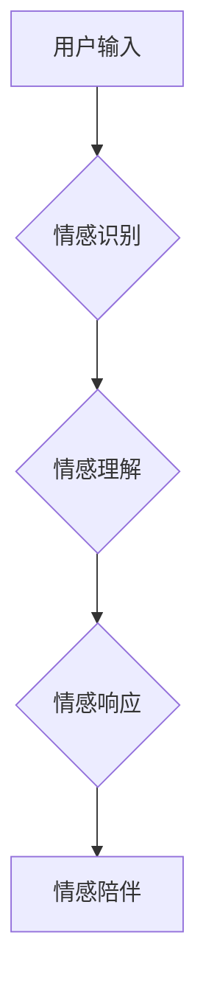

> AI Agent, 情感陪伴, 自然语言处理, 深度学习, 认知科学, 人机交互, 伦理问题

## 1. 背景介绍

随着人工智能技术的飞速发展，AI Agent已经不再局限于简单的任务执行，而是朝着更智能、更人性化的方向发展。其中，情感陪伴作为AI Agent的新领域，引起了广泛的关注和讨论。

人们对情感陪伴的需求日益增长，尤其是在社会节奏加快、人际交往日益疏离的时代背景下。情感陪伴可以提供精神慰藉、情感支持和社交互动，帮助人们缓解压力、提升幸福感。

## 2. 核心概念与联系

**2.1 情感陪伴的定义**

情感陪伴是指AI Agent能够理解和回应人类的情感，并提供情感支持和陪伴，从而建立起一种虚拟的人际关系。

**2.2 AI Agent的演进**

传统的AI Agent主要侧重于任务执行，例如智能助手、游戏角色等。而情感陪伴型AI Agent则需要具备更高级的认知能力，例如情感识别、情感理解、情感表达等。

**2.3 核心概念与联系**

* **自然语言处理 (NLP):**  情感陪伴型AI Agent需要理解和生成人类语言，NLP技术是实现这一目标的关键。
* **深度学习 (DL):**  深度学习算法可以帮助AI Agent学习和识别人类的情感表达，例如文本、语音、表情等。
* **认知科学:**  认知科学研究人类的思维、情感和行为，为AI Agent设计更人性化的交互方式提供理论基础。
* **人机交互 (HCI):**  人机交互研究如何让用户与计算机系统进行自然、有效的交互，情感陪伴型AI Agent需要设计人性化的交互界面和体验。

**2.4  Mermaid 流程图**



## 3. 核心算法原理 & 具体操作步骤

**3.1 算法原理概述**

情感陪伴型AI Agent的核心算法通常包括情感识别、情感理解和情感响应三个部分。

* **情感识别:**  利用自然语言处理和深度学习技术，从用户的文本、语音、表情等信息中识别出用户的当前情感状态。
* **情感理解:**  对识别出的情感进行分析和解释，理解用户的真实情感需求和意图。
* **情感响应:**  根据情感理解的结果，生成相应的文本、语音或其他形式的回应，提供情感支持和陪伴。

**3.2 算法步骤详解**

1. **数据收集:**  收集大量文本、语音、表情等数据，并进行标注，构建情感识别和理解的训练数据集。
2. **模型训练:**  利用深度学习算法，训练情感识别和理解模型。
3. **情感识别:**  将用户的输入数据输入到情感识别模型中，识别出用户的当前情感状态。
4. **情感理解:**  将识别出的情感状态输入到情感理解模型中，分析和解释用户的真实情感需求和意图。
5. **情感响应:**  根据情感理解的结果，生成相应的文本、语音或其他形式的回应，提供情感支持和陪伴。

**3.3 算法优缺点**

* **优点:**  可以提供24/7的情感支持，不受时间和空间限制；可以根据用户的个性化需求提供定制化的陪伴服务。
* **缺点:**  目前情感识别和理解技术还存在一定的局限性，无法完全准确地理解用户的真实情感；情感陪伴型AI Agent缺乏真实的实体体验，可能无法完全满足用户的陪伴需求。

**3.4 算法应用领域**

* **心理健康:**  提供情感支持和陪伴，帮助用户缓解压力、焦虑和抑郁情绪。
* **教育:**  提供个性化的学习陪伴，帮助学生提高学习效率和兴趣。
* **娱乐:**  提供情感互动游戏和虚拟角色扮演，增强用户的娱乐体验。
* **养老:**  陪伴老年人，缓解孤独感和寂寞感。

## 4. 数学模型和公式 & 详细讲解 & 举例说明

**4.1 数学模型构建**

情感识别和理解可以建模为分类问题，利用机器学习算法训练情感分类模型。

**4.2 公式推导过程**

假设我们有一个情感分类模型，输入为用户的文本数据，输出为情感类别。模型的输出可以表示为一个概率分布，例如：

$$
P(情感类别|文本数据) = \begin{bmatrix}
P(快乐|文本数据) \\
P(悲伤|文本数据) \\
P(愤怒|文本数据) \\
\end{bmatrix}
$$

其中，$P(情感类别|文本数据)$表示给定文本数据下，不同情感类别的概率。

**4.3 案例分析与讲解**

例如，如果用户的文本数据是“我今天过得很开心”，模型可能会输出以下概率分布：

$$
P(情感类别|文本数据) = \begin{bmatrix}
0.9 \\
0.05 \\
0.05 \\
\end{bmatrix}
$$

这表明模型预测用户当前的情感状态为快乐，概率为0.9。

## 5. 项目实践：代码实例和详细解释说明

**5.1 开发环境搭建**

* Python 3.x
* TensorFlow 或 PyTorch
* NLTK 或 spaCy

**5.2 源代码详细实现**

```python
import tensorflow as tf

# 定义情感分类模型
model = tf.keras.models.Sequential([
    tf.keras.layers.Embedding(input_dim=vocab_size, output_dim=embedding_dim),
    tf.keras.layers.LSTM(units=128),
    tf.keras.layers.Dense(units=num_classes, activation='softmax')
])

# 编译模型
model.compile(optimizer='adam',
              loss='sparse_categorical_crossentropy',
              metrics=['accuracy'])

# 训练模型
model.fit(x_train, y_train, epochs=10)

# 预测情感
predictions = model.predict(x_test)
```

**5.3 代码解读与分析**

* 代码首先定义了一个情感分类模型，使用嵌入层、LSTM层和全连接层组成。
* 嵌入层将单词转换为向量表示。
* LSTM层用于捕捉文本序列中的上下文信息。
* 全连接层输出情感类别概率分布。
* 模型使用Adam优化器、交叉熵损失函数和准确率作为评估指标。
* 训练模型后，可以使用模型预测新的文本数据的情感类别。

**5.4 运行结果展示**

训练完成后，可以评估模型的性能，例如准确率、召回率、F1-score等。

## 6. 实际应用场景

**6.1 情感支持聊天机器人**

情感支持聊天机器人可以提供24/7的情感支持和陪伴，帮助用户缓解压力、焦虑和抑郁情绪。

**6.2 个性化教育陪伴**

个性化教育陪伴可以根据学生的学习进度和情感状态，提供定制化的学习内容和支持，提高学生的学习效率和兴趣。

**6.3 虚拟陪伴宠物**

虚拟陪伴宠物可以模拟真实的宠物行为，提供情感陪伴和互动，帮助用户缓解孤独感和寂寞感。

**6.4 未来应用展望**

情感陪伴型AI Agent的应用场景将会更加广泛，例如：

* **医疗保健:**  帮助患者管理慢性疾病、缓解疼痛和焦虑。
* **社会服务:**  为老年人、残疾人提供情感支持和陪伴。
* **商业服务:**  提供个性化的客户服务和情感营销。

## 7. 工具和资源推荐

**7.1 学习资源推荐**

* **书籍:**  《深度学习》、《自然语言处理》
* **在线课程:**  Coursera、edX、Udacity
* **开源项目:**  Hugging Face、TensorFlow Hub

**7.2 开发工具推荐**

* **Python:**  Python是一种流行的编程语言，广泛用于人工智能开发。
* **TensorFlow:**  TensorFlow是一个开源的机器学习框架，支持深度学习模型的训练和部署。
* **PyTorch:**  PyTorch是一个开源的深度学习框架，以其灵活性和易用性而闻名。

**7.3 相关论文推荐**

* **BERT:**  Bidirectional Encoder Representations from Transformers
* **GPT-3:**  Generative Pre-trained Transformer 3
* **XLNet:**  Generalized Autoregressive Pretraining for Language Understanding

## 8. 总结：未来发展趋势与挑战

**8.1 研究成果总结**

情感陪伴型AI Agent已经取得了显著的进展，例如情感识别和理解技术的不断提高，以及越来越多的应用场景。

**8.2 未来发展趋势**

* **更准确的情感识别和理解:**  利用更先进的深度学习算法和数据分析技术，提高情感识别和理解的准确率。
* **更个性化的情感陪伴:**  根据用户的个性化需求，提供定制化的情感支持和陪伴服务。
* **更自然的交互方式:**  利用语音合成、图像识别等技术，实现更自然的交互方式，增强用户的沉浸感。

**8.3 面临的挑战**

* **伦理问题:**  情感陪伴型AI Agent可能会引发伦理问题，例如隐私保护、情感依赖等。
* **技术挑战:**  情感识别和理解仍然是一个复杂的技术难题，需要进一步的研究和突破。
* **社会接受度:**  人们对情感陪伴型AI Agent的接受度还需要提高，需要进行更多的宣传和教育。

**8.4 研究展望**

未来，情感陪伴型AI Agent将朝着更智能、更人性化、更安全的方向发展，为人类社会带来更多福祉。

## 9. 附录：常见问题与解答

**9.1 情感陪伴型AI Agent是否会取代人类陪伴？**

情感陪伴型AI Agent可以提供情感支持和陪伴，但它无法完全取代人类陪伴。人类陪伴具有独特的价值，例如情感共鸣、理解和支持。

**9.2 情感陪伴型AI Agent是否会引发情感依赖？**

情感陪伴型AI Agent可能会引发情感依赖，但可以通过合理的设置和引导来避免。用户需要保持理性，认识到AI Agent只是辅助工具，不能完全依赖。

**9.3 情感陪伴型AI Agent的隐私安全如何保障？**

情感陪伴型AI Agent需要收集用户的个人信息，因此隐私安全是一个重要的问题。开发者需要采取措施保护用户的隐私，例如数据加密、匿名化等。


作者：禅与计算机程序设计艺术 / Zen and the Art of Computer Programming 
<end_of_turn>