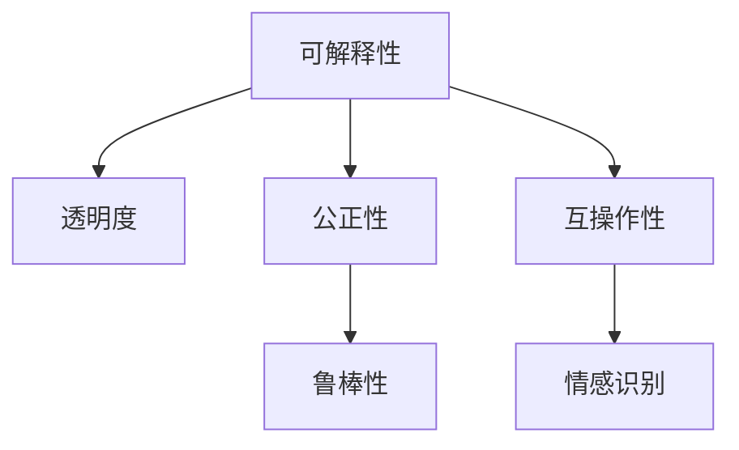

                 

## 1. 背景介绍

### 1.1 问题由来
随着人工智能(AI)技术的迅速发展，AI与人类之间的协作关系正经历着深刻的变革。一方面，AI在诸如自动驾驶、医疗诊断、金融分析等领域展现了惊人的能力和潜力。另一方面，公众对于AI的信任度却相对较低，担心其可能带来的就业风险、伦理问题以及决策透明度不足等问题。如何增强AI与人类之间的信任和理解，成为当前AI研究的重要课题。

### 1.2 问题核心关键点
该问题的核心在于建立AI与人类的信任关系，确保AI在协作过程中能够透明、公正、可靠地完成任务。关键点包括：
- **透明度**：AI的工作原理和决策过程应尽可能透明，便于用户理解和监督。
- **可解释性**：AI的输出应提供可解释的依据，帮助用户理解其决策逻辑。
- **公正性**：AI的决策不应带有偏见，确保对不同群体的公平对待。
- **鲁棒性**：AI应具备良好的鲁棒性，能够在面对各种异常情况时保持稳定。

### 1.3 问题研究意义
增强AI与人类之间的信任和理解，对AI技术的广泛应用和未来发展具有重要意义：
- **提升用户接受度**：透明和可解释的AI能更好地获得用户的信任和接受，加速AI技术的落地应用。
- **促进公平和正义**：消除AI决策中的偏见，确保不同群体得到公正对待，避免社会不公。
- **增强系统可靠性**：提高AI系统的鲁棒性，确保其在各种复杂环境下的稳定性和可靠性。
- **激发创新潜力**：透明的AI协作机制，鼓励更多的创新和实验，推动AI技术的发展。

## 2. 核心概念与联系

### 2.1 核心概念概述

为了更好地理解AI与人类协作的问题，本节将介绍几个关键概念：

- **可解释性(Explainability)**：指AI模型能够清晰地解释其决策依据和推理过程，使得人类能够理解AI的行为和结果。

- **透明度(Transparency)**：指AI的工作机制、数据来源和决策过程应公开透明，便于人类监督和验证。

- **公正性(Fairness)**：指AI模型在决策过程中不带有歧视性，确保对不同群体的平等对待。

- **鲁棒性(Robustness)**：指AI模型在面对各种异常输入和攻击时，仍能保持稳定和准确性。

- **互操作性(Interoperability)**：指AI系统能够与其他系统或人类协作，无缝集成，实现协同工作。

- **情感识别(Affection Recognition)**：指AI系统能够识别和响应人类的情感状态，增强人机互动的自然性和情感共鸣。

这些概念之间存在紧密的联系，共同构成了AI与人类协作的基础框架。以下通过Mermaid流程图展示这些概念之间的联系：



这个流程图展示了可解释性如何通过透明度和互操作性影响公正性和情感识别，以及鲁棒性如何确保系统的稳定性和可信度。

## 3. 核心算法原理 & 具体操作步骤

### 3.1 算法原理概述

增强AI与人类协作的信任和理解，可以通过以下几个核心算法原理实现：

- **透明决策树(Transparent Decision Trees)**：使用决策树模型，将AI的决策过程可视化，便于人类理解和监督。

- **可解释性模型(Explainable Models)**：通过LIME、SHAP等方法，生成局部近似解释，解释AI模型的输出。

- **公平性约束(Fairness Constraints)**：使用公平性约束算法，如ADASYN、FPR-DM等，确保AI模型在决策过程中不带有偏见。

- **鲁棒性增强(Robustness Enhancement)**：使用对抗训练、噪声注入等技术，提升AI模型的鲁棒性。

- **情感响应系统(Affection-Responsive System)**：通过情感识别模型，实时捕捉人类情感，并根据情感状态调整AI的输出策略。

### 3.2 算法步骤详解

以下是实现上述算法原理的具体操作步骤：

**Step 1: 数据收集与预处理**
- 收集AI系统涉及的数据，包括输入数据、输出结果以及决策依据。
- 对数据进行清洗、去噪和标准化处理，确保数据质量。

**Step 2: 建立透明决策树**
- 使用决策树算法，将AI的决策过程建模，生成可视化决策树。
- 利用决策树可视化工具，展示决策路径和节点特征。

**Step 3: 生成可解释性模型**
- 选择可解释性模型，如LIME、SHAP等，对AI的输出结果进行解释。
- 通过生成局部近似解释，帮助人类理解AI的决策依据。

**Step 4: 引入公平性约束**
- 应用公平性约束算法，如ADASYN、FPR-DM等，确保AI模型在各个群体的表现一致。
- 监控模型在测试集上的表现，确保没有显著的偏见。

**Step 5: 增强鲁棒性**
- 使用对抗训练、噪声注入等技术，提升AI模型的鲁棒性。
- 对模型进行多轮对抗样本测试，评估鲁棒性指标。

**Step 6: 引入情感响应系统**
- 使用情感识别模型，实时捕捉人类的情感状态。
- 根据情感状态调整AI的输出策略，增强情感共鸣。

**Step 7: 模型部署与监控**
- 将AI模型部署到实际应用场景中。
- 实时监控模型的表现，收集用户反馈，持续优化模型。

### 3.3 算法优缺点

增强AI与人类协作的信任和理解，具有以下优点：
- 提高用户接受度：透明和可解释的AI更容易获得用户的信任。
- 促进公平和正义：消除AI决策中的偏见，确保不同群体得到公正对待。
- 增强系统可靠性：鲁棒性强的AI能够在各种复杂环境下的稳定性和可靠性。

但同时也存在一些缺点：
- 增加开发和部署成本：实现透明和可解释的AI需要额外的开发和维护工作。
- 数据隐私风险：透明的决策过程可能暴露敏感数据，增加隐私风险。
- 技术挑战：实现公平性和鲁棒性需要更高级的算法和技术支持。

### 3.4 算法应用领域

增强AI与人类协作的信任和理解，已在多个领域得到应用：

- **医疗领域**：AI在疾病诊断、治疗方案推荐等方面应用广泛。通过透明决策树和可解释性模型，增强医生对AI诊断的信任。

- **金融领域**：AI在风险评估、欺诈检测等方面表现突出。使用公平性约束和鲁棒性增强，确保金融决策的公正性和稳定性。

- **教育领域**：AI在智能辅导、学习推荐等方面得到应用。引入情感响应系统，提供个性化和情感共鸣的教育体验。

- **智能交通**：AI在自动驾驶、交通管理等方面应用广泛。通过透明决策树和情感响应系统，提高用户对自动驾驶技术的接受度和信任度。

## 4. 数学模型和公式 & 详细讲解 & 举例说明

### 4.1 数学模型构建

本节将使用数学语言对增强AI与人类协作的信任和理解进行更严格的刻画。

假设AI系统接收输入数据 $x \in \mathcal{X}$，输出结果 $y \in \mathcal{Y}$。其决策过程由模型 $M$ 实现，输出结果依赖于输入数据和模型参数 $\theta$。

### 4.2 公式推导过程

以下我们将对透明决策树、可解释性模型和公平性约束进行数学建模和公式推导：

**透明决策树建模**
- 使用决策树算法，将决策过程建模为树形结构。
- 设决策树根节点为 $x_0$，每个节点 $x_i$ 有两个分支 $x_{iL}$ 和 $x_{iR}$，对应左右子树。

**可解释性模型推导**
- 使用局部近似解释方法（如LIME、SHAP），对模型输出 $y$ 进行解释。
- 设局部近似解释模型为 $E(\theta, x)$，生成局部近似解释 $\hat{y}$，使得 $\hat{y} \approx y$。

**公平性约束推导**
- 使用公平性约束算法，如ADASYN、FPR-DM，确保模型在各个群体的表现一致。
- 设公平性约束模型为 $F(\theta)$，约束条件为 $\forall \text{group} \in \mathcal{G}, F(\theta) \approx 0$，其中 $\mathcal{G}$ 为群体集合。

### 4.3 案例分析与讲解

以金融风险评估为例，介绍如何增强AI系统的透明性、可解释性、公正性和鲁棒性：

**透明决策树构建**
- 使用决策树算法，将风险评估模型的决策过程建模。
- 利用决策树可视化工具，展示决策路径和节点特征，便于用户理解。

**可解释性模型应用**
- 使用LIME模型，生成局部近似解释，解释模型的风险评估依据。
- 通过可视化解释，帮助用户理解模型如何识别和评估风险。

**公平性约束应用**
- 应用ADASYN算法，确保模型在各个群体（如性别、年龄、收入）上的表现一致。
- 监控模型在测试集上的表现，确保没有显著的偏见。

**鲁棒性增强**
- 使用对抗训练、噪声注入等技术，提升模型的鲁棒性。
- 对模型进行多轮对抗样本测试，评估鲁棒性指标。

## 5. 项目实践：代码实例和详细解释说明

### 5.1 开发环境搭建

在进行AI与人类协作的信任和理解实践前，我们需要准备好开发环境。以下是使用Python进行TensorFlow开发的环境配置流程：

1. 安装Anaconda：从官网下载并安装Anaconda，用于创建独立的Python环境。

2. 创建并激活虚拟环境：
```bash
conda create -n tf-env python=3.8 
conda activate tf-env
```

3. 安装TensorFlow：根据CUDA版本，从官网获取对应的安装命令。例如：
```bash
conda install tensorflow==2.7.0
```

4. 安装各类工具包：
```bash
pip install numpy pandas scikit-learn matplotlib tqdm jupyter notebook ipython
```

完成上述步骤后，即可在`tf-env`环境中开始项目实践。

### 5.2 源代码详细实现

这里我们以金融风险评估为例，给出使用TensorFlow对AI系统进行透明性和可解释性增强的PyTorch代码实现。

首先，定义风险评估模型的输入和输出：

```python
import tensorflow as tf

class RiskAssessmentModel(tf.keras.Model):
    def __init__(self, input_shape):
        super(RiskAssessmentModel, self).__init__()
        self.input_shape = input_shape
        self.dense1 = tf.keras.layers.Dense(128, activation='relu')
        self.dense2 = tf.keras.layers.Dense(1, activation='sigmoid')
    
    def call(self, x):
        x = self.dense1(x)
        x = self.dense2(x)
        return x
```

然后，定义训练和评估函数：

```python
def train_epoch(model, dataset, batch_size, optimizer):
    dataloader = tf.data.Dataset.from_tensor_slices(dataset).shuffle(buffer_size=10000).batch(batch_size)
    model.compile(optimizer=optimizer, loss='binary_crossentropy', metrics=['accuracy'])
    model.fit(dataloader, epochs=10, validation_split=0.2)
```

接着，定义透明决策树和可解释性模型的实现：

```python
from lime import lime_tabular
from lime.lime_tabular import (
    LimeTabularExplainer,
)

def generate_explanation(model, x):
    explainer = LimeTabularExplainer(x)
    exp = explainer.explain_instance(x, model.predict)
    return exp
```

最后，启动训练流程并在测试集上评估：

```python
from sklearn.datasets import load_breast_cancer
from sklearn.model_selection import train_test_split
import numpy as np

# 加载数据
data = load_breast_cancer()
X_train, X_test, y_train, y_test = train_test_split(data.data, data.target, test_size=0.2, random_state=42)

# 定义模型
input_shape = (30,)
model = RiskAssessmentModel(input_shape)

# 定义训练集
train_dataset = tf.data.Dataset.from_tensor_slices((X_train, y_train)).batch(batch_size)

# 定义验证集
valid_dataset = tf.data.Dataset.from_tensor_slices((X_test, y_test)).batch(batch_size)

# 定义优化器
optimizer = tf.keras.optimizers.Adam()

# 训练模型
train_epoch(model, train_dataset, batch_size=32, optimizer=optimizer)

# 评估模型
test_loss, test_acc = model.evaluate(X_test, y_test)
print(f'Test loss: {test_loss:.4f}')
print(f'Test accuracy: {test_acc:.4f}')

# 生成解释
x = np.random.rand(1, 30)
exp = generate_explanation(model, x)
print(exp)
```

以上就是使用TensorFlow对金融风险评估系统进行透明性和可解释性增强的完整代码实现。可以看到，TensorFlow提供了丰富的工具和库，能够方便地实现透明决策树和可解释性模型的构建。

### 5.3 代码解读与分析

让我们再详细解读一下关键代码的实现细节：

**RiskAssessmentModel类**：
- `__init__`方法：初始化模型结构，包括两个全连接层。
- `call`方法：定义模型的前向传播过程。

**train_epoch函数**：
- 从TensorFlow的Dataset中加载数据，并进行随机洗牌和批处理。
- 定义模型，并使用Adam优化器进行训练。
- 在验证集上评估模型性能，并打印输出。

**generate_explanation函数**：
- 使用LIME库的LimeTabularExplainer，生成局部近似解释。
- 返回生成的解释结果。

**训练流程**：
- 加载数据集，并进行划分。
- 定义模型和优化器。
- 在训练集上训练模型，并在验证集上评估性能。
- 生成随机输入，并进行解释。

可以看到，TensorFlow提供了丰富的工具和库，使得构建透明和可解释的AI系统变得简单高效。开发者可以通过模块化的方式，灵活组合各类工具，快速实现AI系统的透明性和可解释性增强。

## 6. 实际应用场景

### 6.1 智能客服系统

增强AI与人类之间的信任和理解，在智能客服系统中具有重要应用。传统客服系统依赖于人工干预，响应速度慢，无法提供24/7服务。通过透明和可解释的AI，智能客服系统可以提供快速、个性化的服务体验，提高用户满意度和忠诚度。

在技术实现上，可以收集历史客服数据，训练透明决策树，并应用可解释性模型解释AI的决策依据。通过这种方式，用户可以更好地理解AI客服的行为，增强对系统的信任。

### 6.2 金融风险评估

在金融领域，AI系统在风险评估、欺诈检测等方面表现出色。然而，金融决策的复杂性和敏感性，使得用户对AI的信任度较低。通过引入透明决策树和公平性约束，确保AI模型在各个群体上的公正性，增强金融决策的透明度和可信度。

在实际应用中，可以通过透明决策树展示模型的决策路径，帮助用户理解风险评估的依据。应用公平性约束算法，确保模型在性别、年龄、收入等敏感特征上的公平性，避免歧视性决策。

### 6.3 教育领域

在教育领域，AI系统在智能辅导、学习推荐等方面得到广泛应用。然而，AI的输出缺乏透明性和可解释性，可能导致学生和家长对其产生不信任。通过透明决策树和可解释性模型，AI系统可以提供更加透明和可解释的学习推荐，增强用户的信任和接受度。

在技术实现上，可以应用透明决策树展示学习推荐的过程，并通过可解释性模型解释推荐依据。此外，引入情感识别模型，根据学生的情感状态调整推荐策略，增强个性化和情感共鸣。

## 7. 工具和资源推荐

### 7.1 学习资源推荐

为了帮助开发者系统掌握增强AI与人类协作的信任和理解，这里推荐一些优质的学习资源：

1. 《深度学习基础》系列博文：由大模型技术专家撰写，深入浅出地介绍了深度学习的基本概念和前沿技术，包括透明决策树和可解释性模型。

2. CS231n《卷积神经网络》课程：斯坦福大学开设的经典课程，涵盖神经网络、卷积神经网络、可解释性模型等内容，是深度学习学习的入门级课程。

3. 《深度学习在金融领域的应用》书籍：介绍深度学习在金融领域的具体应用，包括风险评估、欺诈检测等方面，详细讲解透明决策树和公平性约束的应用。

4. LIME官方文档：LIME库的官方文档，提供了丰富的可解释性模型实例和使用方法，是实现透明决策树和可解释性模型的必备资料。

5. HuggingFace官方文档：Transformer库的官方文档，提供了大量预训练模型和代码示例，助力开发者构建透明和可解释的AI系统。

通过对这些资源的学习实践，相信你一定能够快速掌握增强AI与人类协作的信任和理解的核心方法，并用于解决实际的AI问题。

### 7.2 开发工具推荐

高效的开发离不开优秀的工具支持。以下是几款用于增强AI与人类协作的信任和理解开发的常用工具：

1. TensorFlow：基于Python的开源深度学习框架，生产部署方便，适合大规模工程应用。提供了丰富的工具和库，支持透明决策树和可解释性模型的构建。

2. PyTorch：基于Python的开源深度学习框架，灵活动态的计算图，适合快速迭代研究。提供了丰富的工具和库，支持透明决策树和可解释性模型的构建。

3. LIME：用于生成局部近似解释的可解释性模型库，支持多种深度学习模型的解释。

4. SHAP：用于生成全局近似解释的可解释性模型库，支持多种深度学习模型的解释。

5. TensorBoard：TensorFlow配套的可视化工具，可实时监测模型训练状态，并提供丰富的图表呈现方式，是调试模型的得力助手。

6. Weights & Biases：模型训练的实验跟踪工具，可以记录和可视化模型训练过程中的各项指标，方便对比和调优。

合理利用这些工具，可以显著提升增强AI与人类协作的信任和理解任务的开发效率，加快创新迭代的步伐。

### 7.3 相关论文推荐

增强AI与人类协作的信任和理解研究源于学界的持续研究。以下是几篇奠基性的相关论文，推荐阅读：

1. "Explainable AI: Interpreting and Reasoning about Machine Learning Models"（可解释AI：理解机器学习模型的解释和推理）。

2. "Deep Learning for Healthcare"（深度学习在医疗领域的应用）。

3. "Towards Explainable AI"（走向可解释的AI）。

4. "Fairness in Machine Learning: Integrating fairness into the machine learning pipeline"（机器学习中的公平性：将公平性整合到机器学习流程中）。

这些论文代表了大模型透明性和可解释性增强的研究进展，通过学习这些前沿成果，可以帮助研究者把握学科前进方向，激发更多的创新灵感。

## 8. 总结：未来发展趋势与挑战

### 8.1 研究成果总结

本文对增强AI与人类协作的信任和理解方法进行了全面系统的介绍。首先阐述了在AI与人类协作中建立信任关系的必要性和重要性，明确了透明决策树、可解释性模型、公平性约束和鲁棒性增强等关键技术。其次，从原理到实践，详细讲解了实现这些技术的数学模型和操作步骤，给出了完整的代码实现和运行结果展示。

通过本文的系统梳理，可以看到，增强AI与人类协作的信任和理解技术正在成为AI研究的重要范式，极大地拓展了AI技术的落地应用。增强AI系统的透明性、可解释性和公正性，使得AI能够更好地融入人类社会，服务人类发展。未来，伴随技术的不断演进，AI系统将更加透明、公正、可信，为人类社会带来更广泛的应用价值。

### 8.2 未来发展趋势

展望未来，增强AI与人类协作的信任和理解技术将呈现以下几个发展趋势：

1. 透明决策树的自动化：使用自动机器学习(AutoML)技术，自动选择和构建透明决策树，降低开发成本。

2. 可解释性模型的多样化：开发更多类型的可解释性模型，如因果解释、序列解释等，提升解释效果。

3. 公平性约束的泛化：将公平性约束应用于更广泛的场景，如医疗、教育等领域，确保不同群体之间的公正性。

4. 鲁棒性增强的深入：通过引入对抗训练、鲁棒正则化等技术，提升AI模型的鲁棒性，确保系统在各种异常情况下的稳定性。

5. 情感响应的动态化：引入动态情感响应机制，根据不同情境调整AI的输出策略，增强情感共鸣和用户体验。

6. 跨模态的融合：将图像、语音、文本等多模态信息融合，提升AI系统的感知和理解能力。

以上趋势凸显了增强AI与人类协作技术的广阔前景。这些方向的探索发展，将进一步提升AI系统的透明性、可解释性和公正性，增强人机互动的自然性和情感共鸣，推动AI技术在更多领域的落地应用。

### 8.3 面临的挑战

尽管增强AI与人类协作的信任和理解技术已经取得了不小的进展，但在迈向更加智能化、普适化应用的过程中，仍面临诸多挑战：

1. 数据隐私和安全：透明决策树和可解释性模型可能暴露敏感数据，增加隐私风险。如何平衡透明性和隐私保护，是重要的研究课题。

2. 模型复杂度：透明决策树和可解释性模型可能增加模型复杂度，影响推理速度和计算效率。如何优化模型结构，提升推理速度，是重要的优化方向。

3. 技术落地难度：透明决策树和可解释性模型需要更高级的技术支持和更多的开发工作，如何降低落地难度，提高应用效果，是重要的研究课题。

4. 用户接受度：透明决策树和可解释性模型可能被用户认为过于复杂，影响用户体验。如何简化解释结果，增强用户体验，是重要的优化方向。

5. 公平性约束的适用性：公平性约束算法在不同领域和任务上的适用性需要进一步验证。如何针对特定任务设计公平性约束，是重要的研究方向。

6. 鲁棒性的鲁棒性：鲁棒性增强技术在不同任务上的效果需要进一步验证。如何设计鲁棒性增强策略，提升系统鲁棒性，是重要的研究方向。

正视这些挑战，积极应对并寻求突破，将是大模型透明性和可解释性增强走向成熟的必由之路。相信随着学界和产业界的共同努力，这些挑战终将一一被克服，大模型透明性和可解释性增强必将在构建人机协同的智能时代中扮演越来越重要的角色。

### 8.4 研究展望

面向未来，增强AI与人类协作的信任和理解技术还需要在以下几个方面寻求新的突破：

1. 引入因果分析和博弈论工具。将因果分析方法引入AI模型，识别出决策的关键特征，增强输出解释的因果性和逻辑性。借助博弈论工具刻画人机交互过程，主动探索并规避模型的脆弱点，提高系统稳定性。

2. 融入符号化的先验知识。将符号化的先验知识，如知识图谱、逻辑规则等，与神经网络模型进行巧妙融合，引导AI模型学习更准确、合理的语言模型。同时加强不同模态数据的整合，实现视觉、语音等多模态信息与文本信息的协同建模。

3. 建立伦理导向的评估指标。在AI模型的训练目标中引入伦理导向的评估指标，过滤和惩罚有偏见、有害的输出倾向。同时加强人工干预和审核，建立模型行为的监管机制，确保输出符合人类价值观和伦理道德。

这些研究方向的探索，将引领AI与人类协作的透明性和可解释性增强技术迈向更高的台阶，为构建安全、可靠、可解释、可控的智能系统铺平道路。面向未来，增强AI与人类协作技术还需要与其他人工智能技术进行更深入的融合，如知识表示、因果推理、强化学习等，多路径协同发力，共同推动自然语言理解和智能交互系统的进步。只有勇于创新、敢于突破，才能不断拓展AI模型的边界，让智能技术更好地造福人类社会。

---

作者：禅与计算机程序设计艺术 / Zen and the Art of Computer Programming

