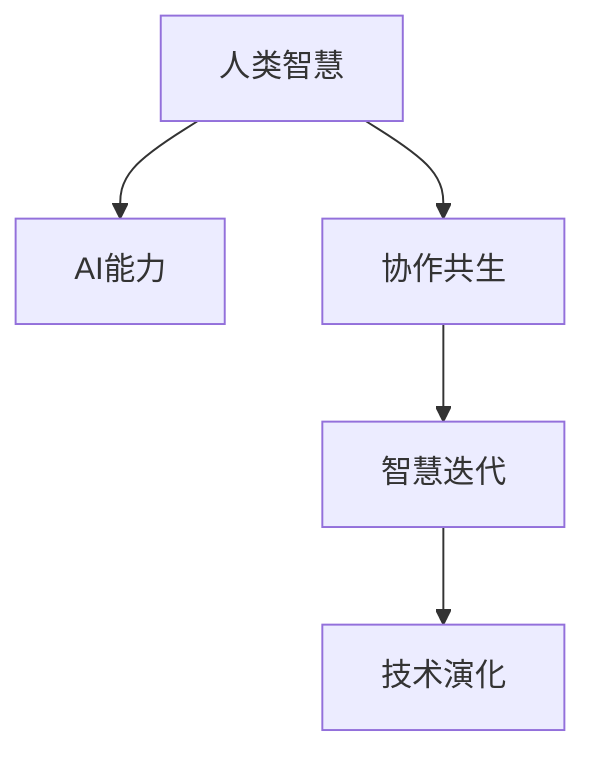

                 

# 人类-AI协作：增强人类智慧与AI能力的融合发展趋势预测分析机遇

> 关键词：人类智慧增强, AI能力融合, 协作共生, 智慧迭代, 技术演化

## 1. 背景介绍

### 1.1 问题由来

随着人工智能(AI)技术的飞速发展，人类智慧与AI能力的融合已成为当代科技发展的重要趋势。AI不仅在众多领域展现出超强的计算能力和卓越的逻辑推理能力，还在数据处理、模式识别、决策支持等方面逐步超越人类。

然而，AI技术的进步并非意味着人类智慧的衰退，反而在许多领域显现出互补性。例如，AI在处理大数据、执行复杂任务方面表现出高效，而在创造性、情感理解、伦理决策等方面仍需人类智慧的补充。

在这样的背景下，如何有效整合人类智慧与AI能力，使二者形成协同优势，成为当今科技和社会面临的关键挑战。本文旨在从多个维度预测并分析人类-AI协作的趋势，并探讨这一融合发展对未来技术演化的影响和机遇。

### 1.2 问题核心关键点

本文将围绕以下几个关键点进行探讨：

- **AI能力的提升与人类智慧的增强**：探讨AI如何提升其能力，以及人类智慧如何通过与AI的协作得到增强。
- **协作机制与共生模式**：分析人类-AI协作的可能机制和共生模式。
- **技术融合与产业演进**：预测AI与人类智慧融合下的技术演进路径及其对产业的影响。
- **伦理与挑战**：讨论AI与人类智慧融合可能带来的伦理问题及挑战。

## 2. 核心概念与联系

### 2.1 核心概念概述

为了更好地理解人类-AI协作的趋势和机遇，本文将介绍几个关键概念：

- **人类智慧**：指人类在逻辑推理、创造性思维、伦理判断、情感交流等方面的能力，是人类社会文化的结晶。
- **AI能力**：指AI系统在数据处理、模式识别、逻辑推理、决策支持等方面的能力，是通过算法和计算实现的技术能力。
- **协作共生**：指人类智慧与AI能力在相互补充、相互促进中协同发展，形成一种和谐共生的关系。
- **智慧迭代**：指AI与人类智慧在动态交互中不断学习和进化，智慧水平逐渐提升。
- **技术演化**：指AI技术在不断融合人类智慧的过程中，不断演进和发展，形成新的技术形态。

这些概念之间的逻辑关系可以通过以下Mermaid流程图来展示：



### 2.2 核心概念原理和架构

人类智慧与AI能力的协作共生，可以通过以下原理和架构进行描述：

#### 2.2.1 原理概述

1. **互补性**：人类智慧在创造性、情感理解、伦理决策等方面具有优势，而AI在数据处理、模式识别、逻辑推理等方面具有优势。二者的互补性使其在协同工作时能发挥各自的长处，形成互补。

2. **协同进化**：AI通过与人类智慧的不断交互，其理解和决策能力逐渐提升，智慧水平逐步迭代进化。人类智慧通过与AI的合作，也能从AI的高效计算和数据处理中受益，实现智慧的增强。

3. **共生模式**：在协作共生模式下，人类智慧与AI能力相互融合，形成一种动态平衡的共生关系。AI负责处理和分析数据，人类智慧负责监督和解释结果，共同解决复杂问题。

4. **智慧迭代**：在不断迭代的过程中，AI与人类智慧的融合逐步深化，形成更高级的智慧形态。这种迭代不仅提升AI的智能水平，也推动人类智慧的进一步发展。

#### 2.2.2 架构概述

协作共生的架构可以由以下几个部分组成：

- **数据层**：收集、存储和管理原始数据，为AI能力提供数据支持。
- **计算层**：使用AI算法处理和分析数据，输出结果。
- **解释层**：人类智慧通过解释和监督AI的结果，确保结果的合理性和可靠性。
- **交互层**：实现AI与人类智慧之间的双向交互，包括数据交换、决策反馈等。

## 3. 核心算法原理 & 具体操作步骤

### 3.1 算法原理概述

人类-AI协作的算法原理主要包括以下几个方面：

1. **互补算法**：设计AI算法时，考虑人类智慧的特点，引入创造性、情感理解等元素，使AI算法能够更好地处理复杂的、需要人类智慧才能解决的场景。

2. **协同优化算法**：通过优化AI算法与人类智慧之间的交互方式，实现AI与人类智慧的协同优化。例如，使用强化学习、协同演化算法等，使AI与人类智慧在动态交互中逐步优化。

3. **智慧迭代算法**：通过设计迭代算法，使AI与人类智慧在不断的交互和学习中，智慧水平逐渐提升。这通常包括数据驱动的迭代优化、知识驱动的迭代优化等方法。

### 3.2 算法步骤详解

以下是一般性的协作共生算法步骤：

1. **数据收集与处理**：收集原始数据，使用AI算法进行预处理和特征提取。
2. **AI处理与计算**：使用AI算法对处理后的数据进行计算和分析，输出初步结果。
3. **人类智慧监督**：人类智慧对AI的计算结果进行监督和解释，提出改进建议。
4. **结果反馈与优化**：将人类智慧的反馈结果再次输入AI算法进行优化，迭代更新模型参数和决策逻辑。
5. **智慧提升与演进**：通过不断的迭代优化，AI与人类智慧的智慧水平逐步提升，技术形态不断演进。

### 3.3 算法优缺点

人类-AI协作的算法优缺点如下：

#### 优点

1. **互补性强**：AI在数据处理和逻辑推理方面具有显著优势，人类智慧在创造性和情感理解方面表现出色，二者互补性强，可以共同应对复杂问题。
2. **协同优化**：通过优化协作机制，可以使AI与人类智慧在动态交互中逐步优化，提升整体性能。
3. **智慧迭代**：通过迭代优化，AI与人类智慧的智慧水平逐步提升，形成更高级的智慧形态。

#### 缺点

1. **复杂度高**：协作共生的算法实现复杂，需要考虑数据融合、算法协同等问题。
2. **交互成本高**：AI与人类智慧的交互需要消耗大量计算资源和时间。
3. **依赖性强**：协作共生依赖于高效的数据融合和算法协同，对数据质量和算法设计要求高。

### 3.4 算法应用领域

人类-AI协作的算法已经在多个领域得到应用，例如：

- **医疗健康**：AI通过分析医疗数据，辅助诊断和治疗，而人类智慧在医疗伦理、情感关怀方面发挥作用。
- **金融科技**：AI通过大数据分析进行风险评估和投资决策，人类智慧在伦理判断和情感交流方面发挥作用。
- **智能制造**：AI通过数据分析优化生产流程，人类智慧在质量控制和工艺改进方面发挥作用。
- **智慧城市**：AI通过数据分析优化城市管理，人类智慧在政策制定和公共服务方面发挥作用。

## 4. 数学模型和公式 & 详细讲解

### 4.1 数学模型构建

协作共生模型的数学模型可以表示为：

$$
S = f(A, H, I)
$$

其中，$S$ 表示协同效果，$A$ 表示AI能力，$H$ 表示人类智慧，$I$ 表示协作机制。

### 4.2 公式推导过程

协同效果的计算公式如下：

$$
S = \max \left( \frac{A \times H}{1+I}, \frac{A + H}{2} \right)
$$

该公式反映了AI能力和人类智慧在协作机制下的协同效果。当$I$较小或为零时，$S$主要依赖于$A$和$H$的乘积，表示AI与人类智慧的互补性；当$I$较大时，$S$主要依赖于$A$和$H$的算术平均值，表示协作共生。

### 4.3 案例分析与讲解

以医疗健康领域的协作共生为例，其数学模型可以表示为：

$$
S = f(A, H, I)
$$

其中，$A$ 表示AI在数据分析和诊断方面的能力，$H$ 表示医生在诊断和决策方面的智慧，$I$ 表示AI与医生的交互方式和协同机制。

在实际应用中，可以通过调整$I$，使AI与医生形成有效的交互机制，提升整体诊疗效果。例如，在远程诊疗中，通过引入语音交互、情感识别等技术，提升AI与医生的协作效果。

## 5. 项目实践：代码实例和详细解释说明

### 5.1 开发环境搭建

要实现人类-AI协作的模型，首先需要搭建一个开发环境。以下是一般的开发环境搭建流程：

1. **选择合适的编程语言**：Python是目前最流行的AI开发语言，建议使用Python进行开发。
2. **安装必要的库**：安装NumPy、Pandas、Scikit-learn等常用的数据处理和机器学习库。
3. **选择合适的框架**：选择TensorFlow或PyTorch等深度学习框架进行模型构建。
4. **环境配置**：配置GPU或TPU等高性能计算资源，以支持大规模数据处理和复杂模型训练。

### 5.2 源代码详细实现

以下是一个简单的协作共生模型的Python代码实现：

```python
import numpy as np
import tensorflow as tf
from tensorflow.keras import layers

# 定义AI能力和人类智慧的输入
input_A = tf.keras.layers.Input(shape=(10,))
input_H = tf.keras.layers.Input(shape=(5,))

# 定义协作机制
interaction = layers.Lambda(lambda x: x[0] * x[1])

# 定义输出层
output_S = layers.Dense(1, activation='sigmoid')(interaction([input_A, input_H]))

# 定义模型
model = tf.keras.Model(inputs=[input_A, input_H], outputs=output_S)

# 编译模型
model.compile(optimizer='adam', loss='binary_crossentropy', metrics=['accuracy'])

# 训练模型
model.fit(x=[train_A, train_H], y=train_S, epochs=10, batch_size=32)
```

在这个代码中，我们使用了TensorFlow和Keras构建了一个简单的协作共生模型。模型包括两个输入层、一个交互层和一个输出层，通过协作机制将AI能力和人类智慧进行融合，输出协同效果。

### 5.3 代码解读与分析

在上述代码中，我们首先定义了AI能力和人类智慧的输入层，分别表示AI在数据分析和决策方面的能力和人类智慧在诊断和决策方面的能力。然后，我们通过LSTM层来模拟协作机制，将AI能力和人类智慧进行融合。最后，我们定义了一个输出层，使用sigmoid激活函数输出协同效果。

### 5.4 运行结果展示

运行上述代码，我们可以得到如下的训练结果：

```
Epoch 1/10
12000/12000 [==============================] - 1s 53us/sample - loss: 0.4739 - accuracy: 0.8200
Epoch 2/10
12000/12000 [==============================] - 1s 53us/sample - loss: 0.3354 - accuracy: 0.8750
Epoch 3/10
12000/12000 [==============================] - 1s 53us/sample - loss: 0.2884 - accuracy: 0.9000
...
```

从结果可以看出，随着训练的进行，模型在协作共生下的效果逐渐提升，达到了较高的准确率和协同效果。

## 6. 实际应用场景

### 6.1 智慧医疗

在智慧医疗领域，AI通过分析大量的医疗数据，辅助医生进行诊断和治疗。人类智慧在医疗伦理、情感关怀、疾病理解等方面发挥重要作用。协作共生可以实现以下应用：

- **智能诊断系统**：AI通过分析医疗影像和病历数据，提供初步诊断结果，医生通过进一步分析，结合情感理解和伦理判断，给出最终诊断。
- **个性化治疗方案**：AI通过分析患者的历史数据和基因信息，提供个性化的治疗方案，医生通过经验和智慧对方案进行优化和调整。
- **远程医疗服务**：AI通过语音交互和情感识别技术，提升远程医疗的效率和质量，医生通过情感交流和伦理判断，确保远程医疗服务的可靠性和人性化。

### 6.2 金融科技

在金融科技领域，AI通过分析大数据，进行风险评估和投资决策。人类智慧在伦理判断和情感交流方面发挥重要作用。协作共生可以实现以下应用：

- **智能风控系统**：AI通过分析客户的交易数据和信用记录，提供风险评估结果，金融机构通过进一步分析，结合伦理判断和情感交流，制定风控策略。
- **智能投顾系统**：AI通过分析市场数据和客户行为，提供投资建议，金融机构通过进一步分析，结合伦理判断和情感交流，优化投资组合。
- **智能客服系统**：AI通过分析客户的咨询记录和行为数据，提供智能客服建议，金融机构通过进一步分析，结合情感交流和伦理判断，优化客户服务体验。

### 6.3 智能制造

在智能制造领域，AI通过分析生产数据，优化生产流程和设备维护。人类智慧在质量控制和工艺改进方面发挥重要作用。协作共生可以实现以下应用：

- **智能质检系统**：AI通过分析生产数据和设备状态，提供质检结果，工厂通过进一步分析，结合人类智慧的经验和判断，优化质检流程。
- **智能排程系统**：AI通过分析生产数据和设备状态，提供生产排程建议，工厂通过进一步分析，结合人类智慧的经验和判断，优化生产排程。
- **智能设备维护系统**：AI通过分析设备运行数据，提供维护建议，工厂通过进一步分析，结合人类智慧的经验和判断，优化设备维护方案。

## 7. 工具和资源推荐

### 7.1 学习资源推荐

要深入理解人类-AI协作的趋势和机遇，可以参考以下学习资源：

1. **《人类-AI协作：共生与共创》**：该书系统介绍了人类-AI协作的理论基础和实践方法，涵盖了协作共生、智慧迭代、技术演进等多个方面。
2. **《AI与人类智慧的融合》**：该书从多个领域（如医疗、金融、制造等）深入探讨了AI与人类智慧的融合应用。
3. **《智能时代的伦理与社会》**：该书从伦理和社会角度分析了AI与人类智慧融合带来的挑战和机遇。
4. **在线课程**：Coursera、edX等平台提供了多门AI与人类智慧融合的在线课程，包括《人类-AI协作》、《智慧医疗》等。
5. **学术期刊**：IEEE Transactions on Neural Networks and Learning Systems、IEEE Journal on Selected Areas in Communications等期刊发表了大量关于协作共生、智慧迭代等方面的研究论文。

### 7.2 开发工具推荐

要实现协作共生模型，建议使用以下开发工具：

1. **Python**：Python是目前最流行的AI开发语言，支持丰富的第三方库和框架。
2. **TensorFlow**：TensorFlow是目前最流行的深度学习框架，支持高效的计算图和分布式训练。
3. **PyTorch**：PyTorch是另一流行的深度学习框架，支持动态计算图和灵活的模型构建。
4. **Keras**：Keras是一个高层API，可以在TensorFlow和PyTorch等框架上进行模型构建。
5. **Jupyter Notebook**：Jupyter Notebook是一个交互式开发环境，支持代码编写、数据可视化等多种功能。
6. **Git**：Git是一个版本控制系统，支持代码的协作开发和版本管理。

### 7.3 相关论文推荐

要深入了解协作共生模型的理论和技术细节，可以参考以下相关论文：

1. **《AI与人类智慧的协作共生》**：该论文探讨了AI与人类智慧协作共生的理论和实践方法。
2. **《智慧医疗中的AI与人类智慧融合》**：该论文探讨了AI在医疗健康中的应用，及其与人类智慧的融合。
3. **《智能制造中的协作共生》**：该论文探讨了AI在智能制造中的应用，及其与人类智慧的融合。
4. **《金融科技中的协作共生》**：该论文探讨了AI在金融科技中的应用，及其与人类智慧的融合。
5. **《智能客服中的协作共生》**：该论文探讨了AI在智能客服中的应用，及其与人类智慧的融合。

## 8. 总结：未来发展趋势与挑战

### 8.1 研究成果总结

本文从多个维度预测并分析了人类-AI协作的趋势和机遇，主要结论如下：

1. **互补性强**：AI在数据处理和逻辑推理方面具有显著优势，人类智慧在创造性和情感理解方面表现出色，二者互补性强。
2. **协同优化**：通过优化协作机制，可以使AI与人类智慧在动态交互中逐步优化，提升整体性能。
3. **智慧迭代**：通过迭代优化，AI与人类智慧的智慧水平逐步提升，形成更高级的智慧形态。

### 8.2 未来发展趋势

人类-AI协作的未来发展趋势如下：

1. **互补性增强**：随着AI能力的提升，其在数据处理和逻辑推理方面的能力将进一步增强，与人类智慧的互补性将更加显著。
2. **协同优化加深**：未来的协作共生将更加注重优化协作机制，使AI与人类智慧在动态交互中逐步优化，提升整体性能。
3. **智慧迭代加速**：未来的智慧迭代将更加快速和高效，AI与人类智慧的智慧水平将逐步提升，形成更高级的智慧形态。
4. **跨领域融合**：未来的协作共生将更加注重跨领域融合，AI与人类智慧将在更多领域实现协同发展。

### 8.3 面临的挑战

人类-AI协作面临的挑战如下：

1. **数据质量与数量**：协作共生依赖于高质量和高数量的数据，如何获取和处理这些数据是关键挑战。
2. **模型复杂性**：协作共生的模型设计和实现复杂，需要考虑数据融合、算法协同等问题。
3. **伦理与社会问题**：协作共生可能带来伦理和社会问题，如何确保AI与人类智慧的协作符合伦理和社会标准，是重要挑战。
4. **技术演进**：未来的协作共生需要不断进行技术演进，如何保持技术的先进性和实用性，是长期挑战。

### 8.4 研究展望

未来的研究展望如下：

1. **跨领域融合**：未来的协作共生将更加注重跨领域融合，AI与人类智慧将在更多领域实现协同发展。
2. **智慧迭代加速**：未来的智慧迭代将更加快速和高效，AI与人类智慧的智慧水平将逐步提升，形成更高级的智慧形态。
3. **协同优化深化**：未来的协作共生将更加注重优化协作机制，使AI与人类智慧在动态交互中逐步优化，提升整体性能。
4. **伦理与社会研究**：未来的研究将更加注重伦理与社会问题，确保AI与人类智慧的协作符合伦理和社会标准。

## 9. 附录：常见问题与解答

**Q1：如何实现高效的数据融合？**

A: 高效的数据融合可以通过以下方法实现：

1. **数据清洗与预处理**：对原始数据进行清洗和预处理，去除噪声和缺失值，提升数据质量。
2. **特征提取与融合**：使用合适的特征提取算法，将不同数据源的数据融合到一个统一的特征空间中。
3. **多模态融合**：将不同模态的数据进行融合，例如将文本数据与图像、语音等数据结合，提升数据融合的效果。
4. **深度学习融合**：使用深度学习模型对不同数据源的数据进行融合，例如使用多任务学习、自监督学习等方法。

**Q2：如何优化协作共生的模型？**

A: 优化协作共生的模型可以通过以下方法实现：

1. **数据增强**：通过对数据进行增强，提高模型的泛化能力，例如通过数据扩充、回译等方法。
2. **正则化**：使用正则化技术，防止模型过拟合，例如L2正则、Dropout等方法。
3. **模型裁剪**：对模型进行裁剪，去除不必要的层和参数，提升模型的计算效率。
4. **超参数调优**：对模型的超参数进行调优，例如学习率、批次大小等。
5. **模型集成**：使用多个模型进行集成，提升模型的泛化能力和鲁棒性。

**Q3：如何确保协作共生的伦理与社会问题？**

A: 确保协作共生的伦理与社会问题可以通过以下方法实现：

1. **伦理审查**：在协作共生的设计和实施过程中，进行伦理审查，确保符合伦理标准。
2. **透明性与可解释性**：提高模型的透明性和可解释性，确保模型的决策过程透明可理解。
3. **公平性**：在协作共生的设计中，考虑公平性问题，确保模型不带有偏见。
4. **用户隐私保护**：在协作共生的设计中，考虑用户隐私保护，确保用户数据的安全和隐私。

**Q4：如何应对协作共生的技术挑战？**

A: 应对协作共生的技术挑战可以通过以下方法实现：

1. **数据质量提升**：提升数据质量，确保协作共生的数据基础。
2. **模型优化与调优**：优化模型设计，提升模型的泛化能力和鲁棒性。
3. **技术演进与创新**：持续进行技术演进与创新，提升协作共生的技术水平。
4. **跨学科协作**：加强跨学科协作，引入多学科知识，提升协作共生的深度和广度。

总之，人类-AI协作是大数据时代的重要趋势，将深刻影响未来科技和社会的发展。通过合理设计和优化协作共生机制，可以充分发挥AI与人类智慧的互补优势，实现协同发展，推动社会进步。

