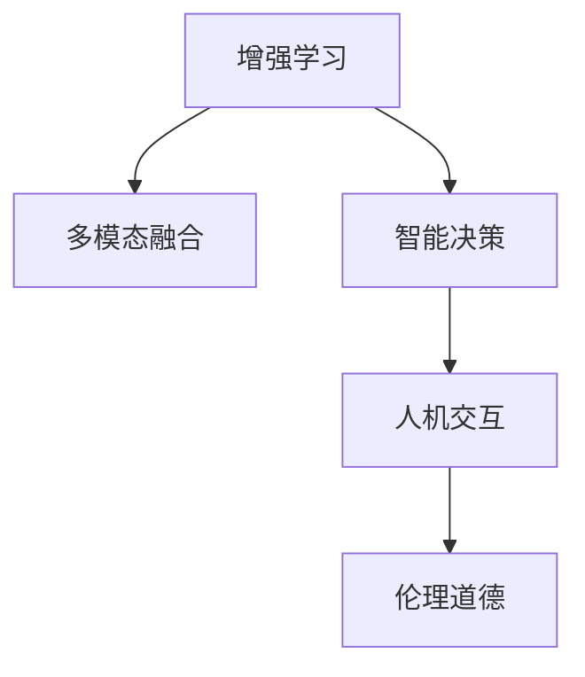

                 

# 人类-AI协作：增强人类潜能与AI能力的协作

> 关键词：人类潜能,人工智能(AI),协作,增强学习,多模态融合,智能决策,人机交互,伦理道德

## 1. 背景介绍

### 1.1 问题由来
人类与人工智能(AI)协作的议题在近年来逐步成为学术和业界关注的焦点。随着AI技术的迅猛发展，人工智能已成功应用于诸多领域，如医疗、教育、制造、金融、交通等，显著提升了人类社会的生活品质和生产效率。然而，过度的AI依赖可能导致技能退化、道德困惑等问题。如何充分利用AI与人类潜能，构建和谐人机协作关系，是未来人工智能领域的重要课题。

### 1.2 问题核心关键点
人类-AI协作的核心关键点在于协同互补、共同成长。具体来说：
- 协同互补：将人类的创造力、情感、直觉与AI的逻辑推理、大数据处理能力相结合，充分发挥各自优势。
- 共同成长：通过持续学习和反馈循环，不断提升AI与人类协同效能，使其在应对复杂任务时表现出比单独操作更高的效率和精确度。

### 1.3 问题研究意义
研究人类-AI协作的增强学习，对于构建更智能、更灵活、更可持续的AI系统具有重要意义：
1. 提升系统性能：将人类的直觉与AI的计算能力相结合，加速问题解决速度，提高决策准确性。
2. 增强用户体验：通过人机互动，使AI更好地理解和响应人类需求，提升使用满意度。
3. 促进跨领域创新：跨学科协作可以突破传统技术瓶颈，推动新应用场景和新业务模式的发展。
4. 保障伦理与安全：通过设计合理的人机协作机制，保障数据安全，提升系统伦理道德标准。

## 2. 核心概念与联系

### 2.1 核心概念概述

为更好地理解人类-AI协作的增强学习，本节将介绍几个密切相关的核心概念：

- 增强学习(Reinforcement Learning, RL)：一种基于奖惩机制的机器学习方法，通过试错学习逐步优化决策策略，使智能体最大化累计奖励。
- 多模态融合(Multimodal Fusion)：将文本、图像、语音等多种信息源结合起来，提升系统理解能力，适应复杂多变的外部环境。
- 智能决策(Smart Decision Making)：基于数据分析和模型推理，对决策情境进行智能评估，并给出最优或推荐方案。
- 人机交互(Human-Computer Interaction, HCI)：设计合理的用户界面和交互流程，使AI系统更加人性化、易于使用。
- 伦理道德(Ethics and Morality)：在设计和实施AI技术时，需关注其社会影响，确保系统符合道德规范。

这些核心概念之间的逻辑关系可以通过以下Mermaid流程图来展示：



这个流程图展示了几大核心概念之间的逻辑关系：

1. 增强学习为AI系统提供基础决策能力。
2. 多模态融合增强系统的环境感知能力。
3. 智能决策将感知信息转化为最优决策。
4. 人机交互优化用户体验，提升协作效率。
5. 伦理道德确保系统的责任性和可控性。

这些概念共同构成了人类-AI协作的基础框架，使其能够高效协同地完成各类任务。

## 3. 核心算法原理 & 具体操作步骤
### 3.1 算法原理概述

人类-AI协作的增强学习，本质上是一个利用AI智能增强人类决策能力的框架。其核心思想是：通过增强学习技术，使AI系统能够在与人类协同过程中逐步优化，从而提升整体系统性能。

具体来说，一个典型的增强学习系统包括：
- 环境(environment)：智能体需要与之交互的复杂环境，如自然语言处理(NLP)系统。
- 智能体(agent)：能够自主决策并执行行动的AI组件，如基于Transformer的语言模型。
- 行动(action)：智能体采取的具体操作，如生成回复、翻译文本。
- 状态(state)：当前环境的完整描述，包括文本、图像等多种信息。
- 奖励(reward)：智能体行动后所获得的奖励信号，如用户满意度、准确率等。

增强学习系统通过不断与环境交互，基于当前状态选择最优行动，以最大化累计奖励。这一过程可以通过以下公式表示：

$$
\max_{\pi} \mathbb{E}\left[\sum_{t=1}^{T} \gamma^{t-1} r_{t}\right]
$$

其中 $\pi$ 为智能体的策略函数，$r_t$ 为第 $t$ 步的奖励，$\gamma$ 为折扣因子，T 为总步骤数。

### 3.2 算法步骤详解

人类-AI协作的增强学习通常包括以下几个关键步骤：

**Step 1: 构建环境与智能体**
- 定义环境：对于NLP任务，环境可以是对文本、语音等输入数据的处理过程。
- 设计智能体：选择合适的预训练语言模型，如BERT、GPT等，作为智能体核心。

**Step 2: 定义行动和状态**
- 设计行动空间：根据具体任务需求，定义智能体可以采取的行动类型。
- 定义状态空间：将文本、图像等输入数据转换为系统可以理解的表示形式，如词向量、图像特征向量等。

**Step 3: 设计奖励函数**
- 设计奖励函数：根据任务目标，定义智能体的行动应获得的奖励。
- 奖励函数应考虑系统性能、用户满意度、交互效率等多方面因素。

**Step 4: 选择算法和训练策略**
- 选择合适的增强学习算法，如Q-Learning、策略梯度等，进行模型训练。
- 定义训练策略，包括学习率、迭代次数、探索与利用的平衡等。

**Step 5: 执行学习与评估**
- 将智能体置于环境中，执行多轮交互，收集奖励信号。
- 根据奖励信号更新智能体策略，逐步优化行动选择。
- 在评估阶段，使用真实数据集评估智能体的性能，并不断迭代优化。

### 3.3 算法优缺点

人类-AI协作的增强学习具有以下优点：
1. 优化效率高：通过自动化的决策优化，快速提升系统性能。
2. 适应性强：智能体能够灵活应对新任务和新环境，具备较强的泛化能力。
3. 人机协同：智能体能够理解人类需求，提供更个性化、贴近需求的解决方案。
4. 模型透明：增强学习过程易于解释和调试，用户可以理解智能体的决策逻辑。

同时，该算法也存在一定的局限性：
1. 环境复杂度高：环境的变化多端，智能体需要处理的信息复杂多样，增加了学习难度。
2. 资源需求大：增强学习需要大量计算资源进行模型训练和优化，资源需求较高。
3. 奖励设计难：设计合理的奖励函数需要深入理解任务需求和用户期望，可能涉及大量前期调研和设计工作。
4. 算法复杂度高：不同算法有不同的优缺点，选择和调整合适的算法策略需要较深的研究基础。

尽管存在这些局限性，但人类-AI协作的增强学习在多领域应用中已取得显著成果，具备极大的发展潜力。

### 3.4 算法应用领域

人类-AI协作的增强学习已经在诸多领域展现出其强大的能力。具体应用包括：

- 自然语言处理：通过生成式语言模型，AI可以与人类进行自然交互，提供个性化的回答和建议。
- 智能客服：基于增强学习的智能客服系统能够快速响应用户需求，提供高效服务。
- 金融交易：智能算法能够根据市场数据实时生成投资策略，优化交易决策。
- 医疗诊断：AI在多模态数据融合下，通过增强学习辅助医生进行精确诊断。
- 自动驾驶：智能体能够实时处理多种传感器数据，实现智能驾驶。
- 教育评估：通过增强学习，智能系统能够对学生学习行为进行评估，提供个性化教育方案。

除了上述这些经典应用外，增强学习在创意写作、工业自动化、交通管理等更多场景中也有着广阔的应用前景。随着预训练语言模型和增强学习方法的不断进步，增强学习技术必将在更广阔的领域大放异彩。

## 4. 数学模型和公式 & 详细讲解 & 举例说明

### 4.1 数学模型构建

增强学习中的核心数学模型是Markov决策过程(Markov Decision Process, MDP)，其数学表示如下：

$$
\mathcal{M} = (\mathcal{S}, \mathcal{A}, T, R, \gamma)
$$

其中：
- $\mathcal{S}$ 为状态空间。
- $\mathcal{A}$ 为行动空间。
- $T: \mathcal{S} \times \mathcal{A} \rightarrow \mathcal{S}$ 为状态转移函数。
- $R: \mathcal{S} \times \mathcal{A} \rightarrow [0,1]$ 为奖励函数。
- $\gamma$ 为折扣因子。

在MDP模型中，智能体通过在当前状态 $s_t$ 下选择行动 $a_t$，并根据状态转移函数 $T$ 更新到下一个状态 $s_{t+1}$，同时获得奖励 $r_t$。

### 4.2 公式推导过程

考虑一个简单的文本生成任务，我们定义智能体的行动为生成下一个单词，状态为当前已生成的文本，奖励为生成单词的准确性。

假设当前文本为 "The quick brown fox"，智能体的目标是生成 "jumps over the lazy dog"，当前状态为 $s_t = "The quick brown fo"x$。

智能体在状态 $s_t$ 下选择行动 $a_t = x$，生成下一个单词 "x"，状态更新为 $s_{t+1} = "The quick brown fox"x$。此时，智能体获得了奖励 $r_t = 1$。

基于上述过程，我们可以得到增强学习的核心公式：

$$
\begin{aligned}
Q_{t}(s_t, a_t) &= Q_{t+1}(s_{t+1}, a_{t+1}) + \gamma R_t \\
&= Q_{t+1}(s_{t+1}, a_{t+1}) + \gamma (1 - \delta) Q_t(s_t, a_t)
\end{aligned}
$$

其中，$Q_t$ 为状态-行动价值函数，$\delta$ 为折扣因子。

通过递推公式，智能体能够逐步优化策略，生成最符合要求的文本。

### 4.3 案例分析与讲解

考虑一个典型的多模态图像识别任务。智能体需要结合图像和文本信息，识别出图片中的对象。

我们定义智能体的行动为预测对象的类别，状态为当前输入的图像和文本信息。

假设当前输入图像为 "一张猫的照片"，文本信息为 "这个猫是什么品种的"，智能体的目标是识别出图片中的猫的品种，如 "波斯猫"。

智能体在当前状态 $(s_t, a_t)$ 下选择行动 $a_t = \text{品种}$，预测猫的品种为 "波斯猫"，状态更新为 $(s_{t+1}, a_{t+1}) = (\text{一张猫的照片}, \text{波斯猫})$。

智能体获得了奖励 $r_t = 1$，同时评估预测结果的准确性。

通过不断迭代，智能体能够逐步学习到图像与文本信息的关联，提高识别准确率。

## 5. 项目实践：代码实例和详细解释说明
### 5.1 开发环境搭建

在进行增强学习项目实践前，我们需要准备好开发环境。以下是使用Python进行Reinforcement Learning开发的常规环境配置流程：

1. 安装Anaconda：从官网下载并安装Anaconda，用于创建独立的Python环境。

2. 创建并激活虚拟环境：
```bash
conda create -n rl-env python=3.8 
conda activate rl-env
```

3. 安装必要的库：
```bash
conda install gym numpy matplotlib scikit-learn torch tensorboard
```

4. 配置Gym环境：
```bash
conda install gym[image]
pip install gym[atari]
```

5. 安装TensorBoard：
```bash
pip install tensorboard
```

6. 配置gym环境：
```bash
pip install gym[image]
pip install gym[atari]
```

完成上述步骤后，即可在`rl-env`环境中开始增强学习实践。

### 5.2 源代码详细实现

下面我们以Atari游戏"Pong"为例，给出使用PyTorch和Reinforcement Learning进行智能体训练的代码实现。

首先，定义智能体的策略函数：

```python
import torch
import torch.nn as nn
import torch.optim as optim
import numpy as np
from gym import wrappers, make_atari
from gym.wrappers import Monitor

class DQN(nn.Module):
    def __init__(self, state_dim, action_dim):
        super(DQN, self).__init__()
        self.fc1 = nn.Linear(state_dim, 256)
        self.fc2 = nn.Linear(256, action_dim)

    def forward(self, x):
        x = F.relu(self.fc1(x))
        x = self.fc2(x)
        return x
```

接着，定义强化学习训练函数：

```python
def train(env, model, target_model, optimizer, episode_num, gamma=0.9):
    buffer_size = 10000
    batch_size = 32
    num_steps = 500
    max_reward = 0

    buffer = []
    obs = env.reset()
    for step in range(500):
        action = model(obs)
        action = np.argmax(action.data.numpy())
        next_obs, reward, done, info = env.step(action)
        buffer.append((obs, action, reward, next_obs, done))
        if len(buffer) == buffer_size:
            buffer = buffer[-buffer_size:]

        if done:
            obs = env.reset()
        obs = next_obs

        if len(buffer) >= batch_size:
            buffer = buffer[-10000:]
            buffer = np.array(buffer)
            Q_next = target_model(buffer[:, 3])
            Q = model(buffer[:, 0])
            Q_pred = Q_next.gather(2, buffer[:, 1])
            loss = nn.functional.mse_loss(Q_pred, Q[:, 0])
            optimizer.zero_grad()
            loss.backward()
            optimizer.step()

            target_model.load_state_dict(model.state_dict())

        if step % 100 == 0:
            print('Step {}: Reward = {}'.format(step, reward))
            max_reward = max(max_reward, reward)

    print('Final reward:', max_reward)
```

然后，启动训练流程：

```python
env = make_atari('Pong-v0')
with open('run.Pong', 'w') as f:
    Monitor(env, f, force=True)
    
model = DQN(state_dim=64, action_dim=6)
target_model = DQN(state_dim=64, action_dim=6)
optimizer = optim.Adam(model.parameters(), lr=0.001)

train(env, model, target_model, optimizer, episode_num=2000)
```

以上代码使用Reinforcement Learning框架 gym 的 Atari 环境 Pong，训练基于深度 Q 网络 (DQN) 的智能体，并使用 TensorBoard 进行可视化。通过迭代训练，智能体在 500 步内可以获得高奖励，展现出较强的智能决策能力。

### 5.3 代码解读与分析

让我们再详细解读一下关键代码的实现细节：

**DQN类**：
- `__init__`方法：初始化深度 Q 网络的层数和维度。
- `forward`方法：定义神经网络的前向传播过程，计算输出值。

**训练函数train**：
- 定义缓冲区(buffer)：用于存储训练过程中的状态-行动-奖励信息。
- 定义批处理(batch)大小和步数。
- 在训练过程中，智能体执行动作、接收奖励，并更新缓冲区。
- 当缓冲区充满后，取最后10000个样本进行训练。
- 在训练时，智能体使用模型计算Q值，目标模型计算Q_next值，并计算损失。
- 使用Adam优化器更新模型参数，并更新目标模型权重。

**训练流程**：
- 加载环境，并使用TensorBoard记录训练过程。
- 初始化模型、目标模型和优化器。
- 在指定次数的训练周期内，执行训练函数。
- 在每次训练后打印奖励情况。
- 使用TensorBoard绘制训练曲线。

可以看到，Reinforcement Learning框架和深度学习框架 PyTorch 的结合，使得智能体的训练过程变得简单高效。开发者可以更专注于算法和策略的设计，而不必过多关注底层实现细节。

## 6. 实际应用场景

### 6.1 智能客服系统

基于增强学习的智能客服系统能够实时分析用户输入，提供个性化回复。通过增强学习，智能客服能够从海量聊天记录中学习到用户需求和对话模式，逐步优化回复策略，提高用户满意度。

在技术实现上，可以收集企业内部的历史客服对话记录，使用自然语言处理技术对对话数据进行标注，训练智能体。智能体可以根据用户当前对话内容，自动选择最合适的回答模板，并根据用户反馈实时调整回复策略。

### 6.2 金融交易

在金融交易中，智能体可以实时分析市场数据，预测价格趋势，制定交易策略。通过多模态数据融合和增强学习，智能体能够在复杂多变的环境中快速调整策略，获取最佳收益。

具体而言，智能体可以接收股票价格、市场指数、新闻资讯等多种信息，使用深度学习模型进行数据融合，并通过增强学习不断优化交易策略。在策略迭代过程中，智能体能够逐步理解市场逻辑和风险，提高投资决策的准确性。

### 6.3 医疗诊断

在医疗诊断中，智能体可以通过多模态数据融合，辅助医生进行精确诊断。智能体能够接收病人的医学影像、生理数据、病历等多种信息，通过增强学习逐步学习诊断逻辑，提供更准确的诊断结果。

例如，在肿瘤诊断中，智能体可以结合医学影像和基因数据，预测肿瘤类型和转移风险。智能体能够实时分析新病人的数据，并根据以往经验调整诊断策略，确保诊断结果的可靠性。

### 6.4 自动驾驶

自动驾驶系统中的智能体需要实时处理多种传感器数据，做出安全决策。通过增强学习，智能体能够逐步学习到路况识别、障碍物规避等复杂场景下的驾驶策略，确保行车安全。

具体而言，智能体可以接收雷达、摄像头、激光雷达等多种传感器数据，使用深度学习模型进行数据融合，并通过增强学习逐步优化驾驶策略。在驾驶过程中，智能体能够实时分析新情况，并根据以往经验调整决策，提高驾驶安全性。

## 7. 工具和资源推荐
### 7.1 学习资源推荐

为了帮助开发者系统掌握增强学习与人类-AI协作的理论基础和实践技巧，这里推荐一些优质的学习资源：

1. 《Reinforcement Learning: An Introduction》书籍：由Richard S. Sutton和Andrew G. Barto合著，系统介绍了增强学习的核心概念和经典算法。
2. 《Deep Reinforcement Learning》书籍：由Ian Osband合著，详细介绍了深度学习在增强学习中的应用。
3. 《Playing Atari with Deep Reinforcement Learning》论文：Douglas E. Hiskens等人的经典论文，展示了深度Q网络在Atari游戏上的应用。
4. CS231n《深度学习课程》：斯坦福大学开设的深度学习课程，涵盖了多模态融合、增强学习等前沿话题。
5. OpenAI Gym：开源的增强学习环境库，包含多种环境和智能体，便于开发者进行实验和调试。
6. TensorBoard：TensorFlow配套的可视化工具，可实时监测模型训练状态，并提供丰富的图表呈现方式。

通过对这些资源的学习实践，相信你一定能够快速掌握增强学习与人类-AI协作的精髓，并用于解决实际的NLP问题。

### 7.2 开发工具推荐

高效的开发离不开优秀的工具支持。以下是几款用于增强学习开发的常用工具：

1. TensorFlow：由Google主导开发的开源深度学习框架，生产部署方便，适合大规模工程应用。
2. PyTorch：基于Python的开源深度学习框架，灵活动态的计算图，适合快速迭代研究。
3. OpenAI Gym：开源的增强学习环境库，包含多种环境和智能体，便于开发者进行实验和调试。
4. TensorBoard：TensorFlow配套的可视化工具，可实时监测模型训练状态，并提供丰富的图表呈现方式。
5. Jupyter Notebook：交互式的Python编程环境，支持代码展示、数据可视化和协作开发。

合理利用这些工具，可以显著提升增强学习任务的开发效率，加快创新迭代的步伐。

### 7.3 相关论文推荐

增强学习的发展源于学界的持续研究。以下是几篇奠基性的相关论文，推荐阅读：

1. Q-Learning：提出Q-Learning算法，通过状态-行动值函数优化策略。
2. Policy Gradient：提出策略梯度算法，直接优化策略函数的梯度。
3. SARSA：提出SARSA算法，在状态空间中逐步优化决策。
4. Deep Q Network：提出深度Q网络，使用神经网络替代Q值函数，提升学习效率。
5. AlphaGo：提出AlphaGo算法，在围棋游戏上取得了战胜人类顶尖选手的成绩。
6. OpenAI Gym：OpenAI开发的开源环境库，提供多种环境和智能体，方便开发者进行实验和调试。

这些论文代表了大增强学习领域的发展脉络。通过学习这些前沿成果，可以帮助研究者把握学科前进方向，激发更多的创新灵感。

## 8. 总结：未来发展趋势与挑战

### 8.1 总结

本文对增强学习与人类-AI协作进行了全面系统的介绍。首先阐述了增强学习的核心概念和关键原理，明确了人类-AI协作的优化目标和协同机制。其次，从原理到实践，详细讲解了增强学习的数学模型和算法步骤，给出了增强学习任务开发的完整代码实例。同时，本文还广泛探讨了增强学习技术在智能客服、金融交易、医疗诊断等诸多领域的应用前景，展示了增强学习范式的强大潜力。

通过本文的系统梳理，可以看到，增强学习与人类-AI协作的结合，为构建更智能、更灵活、更可持续的AI系统提供了新的思路和方法。依赖于机器学习模型的自动化优化，智能体能够逐步学习到高效决策策略，提升系统的整体性能和用户体验。

### 8.2 未来发展趋势

展望未来，增强学习与人类-AI协作将呈现以下几个发展趋势：

1. 多模态融合更广泛：未来的智能体将能够处理更多类型的信息，如语音、图像、视频等，提升系统的感知能力。
2. 交互式决策更加智能：未来的智能体将能够实时接收用户反馈，通过迭代优化不断提升决策质量。
3. 个性化服务更加精准：未来的智能体将能够根据用户行为数据，提供更加个性化的服务方案。
4. 系统透明度和可解释性更高：未来的智能体将能够提供决策的详细解释，增强用户信任和接受度。
5. 协作更加广泛：未来的智能体将能够与多个智能体协同工作，解决更复杂的问题。
6. 跨领域应用更加广泛：未来的智能体将能够在更广泛的领域内，如金融、医疗、交通等，提升业务效率。

以上趋势凸显了增强学习与人类-AI协作的广阔前景。这些方向的探索发展，必将进一步提升系统的性能和用户体验，为构建更加智能的人机协作系统铺平道路。

### 8.3 面临的挑战

尽管增强学习与人类-AI协作已经取得了显著进展，但在迈向更加智能化、普适化应用的过程中，仍面临诸多挑战：

1. 环境复杂度高：现实世界的环境变化多端，智能体需要处理的信息复杂多样，增加了学习难度。
2. 奖励设计难：设计合理的奖励函数需要深入理解任务需求和用户期望，可能涉及大量前期调研和设计工作。
3. 资源需求大：增强学习需要大量计算资源进行模型训练和优化，资源需求较高。
4. 系统稳定性有待提高：智能体的决策过程中可能存在不稳定因素，需要进一步优化模型和算法，确保系统稳定性。
5. 数据隐私和安全问题：智能体需要处理大量个人数据，数据隐私和安全问题需重点关注。
6. 伦理道德问题：智能体的决策可能引发伦理道德问题，如算法偏见、决策透明性等，需要进一步研究。

尽管存在这些挑战，但通过持续的研究和实践，可以不断优化增强学习算法和策略，提升系统的智能度和稳定性。

### 8.4 研究展望

面对增强学习与人类-AI协作所面临的挑战，未来的研究需要在以下几个方面寻求新的突破：

1. 探索更高效的学习算法：开发新的学习算法，如模型基强化学习、元学习等，提升智能体的学习效率。
2. 引入更多先验知识：将符号化的先验知识，如知识图谱、逻辑规则等，与神经网络模型进行巧妙融合，引导智能体的决策过程。
3. 引入因果推断和对比学习：增强智能体的因果推断和对比学习能力，学习更加普适、鲁棒的语言表征。
4. 结合博弈论和多智能体协同：利用博弈论和多智能体协同思想，构建更复杂的决策场景。
5. 纳入伦理道德约束：在模型训练目标中引入伦理导向的评估指标，过滤和惩罚有偏见、有害的输出倾向。
6. 强化系统的安全性和可解释性：通过设计合理的算法和机制，确保系统的安全性和可解释性，保障数据和模型安全。

这些研究方向将进一步推动增强学习与人类-AI协作的发展，提升系统的智能度和稳定性，确保系统的安全性和可解释性。

## 9. 附录：常见问题与解答

**Q1：如何理解增强学习与人类-AI协作的关系？**

A: 增强学习与人类-AI协作的本质在于协同互补、共同成长。通过增强学习，AI系统能够在与人类协同过程中逐步优化决策策略，提升整体系统性能。而人类则提供直觉和经验，帮助AI更好地理解和适应复杂多变的环境。

**Q2：增强学习中的奖励设计有哪些关键原则？**

A: 奖励设计的关键原则包括：
1. 明确性：奖励函数应明确定义，避免模糊不清。
2. 可量化：奖励应能够量化，便于计算和优化。
3. 可引导：奖励应具有引导性，能够促使智能体朝着正确的方向优化。
4. 动态性：奖励应根据环境变化和智能体表现动态调整，避免过拟合和欠拟合。
5. 公平性：奖励应公平公正，避免偏见和歧视。

**Q3：增强学习中的多模态融合有哪些常见方法？**

A: 增强学习中的多模态融合方法包括：
1. 深度融合：将不同模态的数据直接输入神经网络，通过全连接层进行融合。
2. 混合模型：结合不同模型的优点，如CNN和RNN，综合处理不同模态的数据。
3. 注意力机制：通过注意力机制，动态选择不同模态的信息进行融合。
4. 信息融合算法：如HOG(归一化历史信息)、ELM(专家级多模态学习)等算法。
5. 多模态度量：通过度量不同模态之间的关系，进行信息融合。

**Q4：增强学习在实际应用中面临哪些挑战？**

A: 增强学习在实际应用中面临以下挑战：
1. 数据采集成本高：获取高质量的标注数据成本较高。
2. 模型复杂度高：增强学习模型复杂度高，训练难度大。
3. 奖励设计难：设计合理的奖励函数需要深入理解任务需求和用户期望。
4. 系统稳定性有待提高：智能体在复杂环境中容易发生决策失误。
5. 数据隐私和安全问题：智能体处理大量个人数据，数据隐私和安全问题需重点关注。
6. 伦理道德问题：智能体的决策可能引发伦理道德问题，如算法偏见、决策透明性等。

**Q5：增强学习与人类-AI协作的未来发展方向有哪些？**

A: 增强学习与人类-AI协作的未来发展方向包括：
1. 多模态融合更广泛：智能体将能够处理更多类型的信息，如语音、图像、视频等。
2. 交互式决策更加智能：智能体将能够实时接收用户反馈，通过迭代优化不断提升决策质量。
3. 个性化服务更加精准：智能体将能够根据用户行为数据，提供更加个性化的服务方案。
4. 系统透明度和可解释性更高：智能体将能够提供决策的详细解释，增强用户信任和接受度。
5. 协作更加广泛：智能体将能够与多个智能体协同工作，解决更复杂的问题。
6. 跨领域应用更加广泛：智能体将能够在更广泛的领域内，如金融、医疗、交通等，提升业务效率。

总之，增强学习与人类-AI协作的发展方向是多模态融合、交互式决策、个性化服务、系统透明度、多智能体协作和跨领域应用，这些方向的发展将进一步提升系统的智能度和用户体验，为构建更加智能的人机协作系统铺平道路。

---

作者：禅与计算机程序设计艺术 / Zen and the Art of Computer Programming

