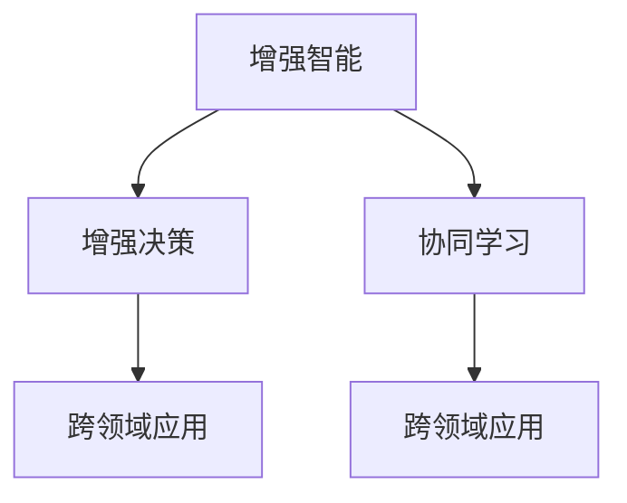

                 

# 人类-AI协作：增强人类潜能与AI能力的协同效应

> 关键词：人类-AI协作,增强潜能,协同效应,技术融合,应用场景,未来趋势,协同创新

## 1. 背景介绍

### 1.1 问题由来
在数字化和智能化快速发展的今天，人工智能（AI）和人类之间的协作已成为了科技和产业发展的新趋势。随着技术的进步，AI不仅能够完成许多复杂和重复的任务，而且能够帮助人类更好地发挥其潜能。例如，AI在医疗、金融、教育、制造等领域的应用，已经展现出了巨大的潜力。然而，如何有效整合AI与人类潜能，最大化其协同效应，仍然是一个重要的研究课题。

### 1.2 问题核心关键点
在人类-AI协作的过程中，关键在于如何构建一个高效的、透明的、可解释的协作系统。这涉及到以下几个核心问题：

- **技术融合**：如何将AI与人类智能有机结合，形成互补优势？
- **增强潜能**：AI如何帮助人类拓展认知边界，实现更高级别的思考和创造？
- **协同效应**：AI和人类如何共同作用，产生1+1>2的效果？

## 2. 核心概念与联系

### 2.1 核心概念概述

为更好地理解人类-AI协作的协同效应，我们首先需要了解几个核心概念：

- **增强智能**：指通过AI技术提升人类的认知能力、决策能力、执行能力等，使人类能够更加高效地处理信息、解决问题。
- **增强决策**：指利用AI提供的数据分析、预测能力，辅助人类做出更加准确、全面的决策。
- **协同学习**：指AI与人类通过交互式学习，共同进步、共同提升的过程。
- **跨领域应用**：指AI技术在不同领域中的应用，如医疗、教育、金融、制造等，展示AI与人类协同的广泛可能性。

这些概念之间的逻辑关系可以通过以下Mermaid流程图来展示：



这个流程图展示了几大核心概念之间的联系：

1. 增强智能是通过AI提升人类的认知能力。
2. 增强决策是利用AI的数据分析能力辅助人类决策。
3. 协同学习是AI与人类通过交互式学习共同提升。
4. 跨领域应用展示了AI与人类协同的广泛可能性。

这些概念共同构成了人类-AI协作的框架，使得AI能够成为人类智能的延伸，帮助人类实现更高的目标。

## 3. 核心算法原理 & 具体操作步骤

### 3.1 算法原理概述

人类-AI协作的算法原理主要包括三个方面：数据融合、模型增强和协同决策。

1. **数据融合**：将AI处理的数据与人类感知和理解的数据进行整合，形成更全面的信息视图。
2. **模型增强**：利用AI的计算能力和大数据，提升人类模型的精度和泛化能力。
3. **协同决策**：结合AI的推理和人类的经验，进行综合决策，提高决策的准确性和鲁棒性。

### 3.2 算法步骤详解

基于上述原理，人类-AI协作的算法步骤可以分为以下几个关键步骤：

**Step 1: 数据收集与预处理**

1. 收集来自不同来源和格式的数据，如文本、图像、音频等。
2. 对数据进行清洗和标注，去除噪音和异常值，保证数据的质量。
3. 对数据进行标准化和归一化，统一格式和尺寸。

**Step 2: 数据融合与增强**

1. 利用AI技术进行数据融合，如文本和图像融合、多模态数据融合等。
2. 应用机器学习、深度学习等算法对数据进行增强，如特征提取、降维、去噪等。
3. 引入人类专家的知识，进行专家系统的设计和实现。

**Step 3: 模型训练与优化**

1. 利用增强后的数据，对AI模型进行训练，提升模型的精度和泛化能力。
2. 应用强化学习等技术对模型进行优化，使其能够适应不同的环境和任务。
3. 结合人类专家的反馈，对模型进行调整和改进。

**Step 4: 协同决策与反馈**

1. 在实际应用场景中，结合AI的推理和人类的经验进行协同决策。
2. 建立反馈机制，对决策结果进行评估和优化，持续改进协作系统的性能。
3. 对协作系统进行动态调整，使其能够适应不断变化的环境和任务。

### 3.3 算法优缺点

人类-AI协作的算法具有以下优点：

1. **提升效率**：AI能够处理大量数据，加快决策速度，提升效率。
2. **增强决策质量**：AI提供的数据分析和预测能力，能够辅助人类做出更准确的决策。
3. **跨领域应用**：AI在不同领域的应用，展示了协同效应的广泛可能性。

同时，该算法也存在一些局限性：

1. **数据依赖**：协作效果依赖于高质量的数据和标注，数据收集和预处理需要大量人力和资源。
2. **模型复杂**：AI模型的训练和优化需要大量计算资源，模型过于复杂可能难以在实时环境中应用。
3. **可解释性**：AI模型的决策过程缺乏可解释性，难以向人类解释其决策逻辑。
4. **伦理问题**：AI的决策可能存在偏见和歧视，需要严格的伦理审查和监督。

尽管存在这些局限性，但总体而言，人类-AI协作算法在提高决策效率、质量和安全性的方面具有显著优势，值得进一步研究和应用。

### 3.4 算法应用领域

人类-AI协作的算法已经在多个领域得到了广泛应用，例如：

- **医疗健康**：利用AI进行疾病诊断、治疗方案推荐、患者监护等，提升医疗服务的质量和效率。
- **金融服务**：通过AI进行风险评估、欺诈检测、投资建议等，提升金融决策的准确性和鲁棒性。
- **教育培训**：利用AI进行个性化教学、学习路径优化、评估反馈等，提升教育效果和学生体验。
- **智能制造**：通过AI进行质量检测、设备维护、生产调度等，提升生产效率和产品质量。
- **环境保护**：利用AI进行环境监测、污染预测、资源管理等，保护生态环境和促进可持续发展。

## 4. 数学模型和公式 & 详细讲解 & 举例说明（备注：数学公式请使用latex格式，latex嵌入文中独立段落使用 $$，段落内使用 $)
### 4.1 数学模型构建

在人类-AI协作中，我们可以使用博弈论、强化学习等数学模型来描述和分析系统行为。以下是一个简单的博弈论模型：

设玩家A和B分别为AI和人类，他们的策略分别为$s_A$和$s_B$，在某一时刻t的收益分别为$u_A(s_A,s_B)$和$u_B(s_A,s_B)$。博弈的均衡状态为纳什均衡，即在给定对手策略的情况下，玩家A和B都选择最优策略。

博弈论模型描述了人类-AI协作中的决策过程，通过最大化各自收益来达到均衡状态。在实际应用中，博弈论模型还可以进一步细化，考虑更复杂的场景和策略。

### 4.2 公式推导过程

以博弈论中的纳什均衡为例，我们推导其在人类-AI协作中的应用：

设玩家A和B的选择空间分别为$S_A$和$S_B$，收益函数为$u_A(s_A,s_B)$和$u_B(s_A,s_B)$，则纳什均衡满足以下条件：

$$
\begin{aligned}
&\max_{s_A} u_A(s_A,s_B^*) = \max_{s_A} u_A(s_A,s_B^*) \\
&\max_{s_B} u_B(s_A^*,s_B) = \max_{s_B} u_B(s_A^*,s_B)
\end{aligned}
$$

其中$s_A^*$和$s_B^*$分别为玩家A和B的最优策略。

在人类-AI协作中，我们可以将AI的推理和人类的经验分别看作两个玩家的策略，通过博弈论模型求解最优策略，实现协同决策。

### 4.3 案例分析与讲解

假设在医疗健康领域，AI用于辅助医生进行疾病诊断。医生和AI的策略分别为“全面检查”和“快速诊断”，收益分别为“准确诊断”和“节省时间”。通过博弈论模型，我们可以求解在什么情况下，医生和AI的协同决策效果最佳。

设全面检查和快速诊断的概率分别为$p_A$和$p_B$，准确诊断的概率为$q$，节省时间的成本为$c$。则收益函数可以表示为：

$$
\begin{aligned}
&u_A(p_A,p_B) = q - c \cdot p_A \\
&u_B(p_A,p_B) = -c \cdot p_B + \delta \cdot p_A \cdot p_B
\end{aligned}
$$

其中$\delta$为医生对AI辅助诊断的信任度。通过求解纳什均衡，可以找到最优的$p_A$和$p_B$，使得医生和AI的协同决策效果最佳。

## 5. 项目实践：代码实例和详细解释说明
### 5.1 开发环境搭建

在进行人类-AI协作的实践前，我们需要准备好开发环境。以下是使用Python进行PyTorch开发的环境配置流程：

1. 安装Anaconda：从官网下载并安装Anaconda，用于创建独立的Python环境。

2. 创建并激活虚拟环境：
```bash
conda create -n pytorch-env python=3.8 
conda activate pytorch-env
```

3. 安装PyTorch：根据CUDA版本，从官网获取对应的安装命令。例如：
```bash
conda install pytorch torchvision torchaudio cudatoolkit=11.1 -c pytorch -c conda-forge
```

4. 安装Transformers库：
```bash
pip install transformers
```

5. 安装各类工具包：
```bash
pip install numpy pandas scikit-learn matplotlib tqdm jupyter notebook ipython
```

完成上述步骤后，即可在`pytorch-env`环境中开始实践。

### 5.2 源代码详细实现

这里我们以智能制造领域的协作系统为例，给出使用Transformers库进行人类-AI协作的PyTorch代码实现。

首先，定义协作系统的数据处理函数：

```python
from transformers import BertTokenizer
from torch.utils.data import Dataset
import torch

class CollaborationDataset(Dataset):
    def __init__(self, texts, tags, tokenizer, max_len=128):
        self.texts = texts
        self.tags = tags
        self.tokenizer = tokenizer
        self.max_len = max_len
        
    def __len__(self):
        return len(self.texts)
    
    def __getitem__(self, item):
        text = self.texts[item]
        tags = self.tags[item]
        
        encoding = self.tokenizer(text, return_tensors='pt', max_length=self.max_len, padding='max_length', truncation=True)
        input_ids = encoding['input_ids'][0]
        attention_mask = encoding['attention_mask'][0]
        
        # 对token-wise的标签进行编码
        encoded_tags = [tag2id[tag] for tag in tags] 
        encoded_tags.extend([tag2id['O']] * (self.max_len - len(encoded_tags)))
        labels = torch.tensor(encoded_tags, dtype=torch.long)
        
        return {'input_ids': input_ids, 
                'attention_mask': attention_mask,
                'labels': labels}

# 标签与id的映射
tag2id = {'O': 0, 'B-PER': 1, 'I-PER': 2, 'B-ORG': 3, 'I-ORG': 4, 'B-LOC': 5, 'I-LOC': 6}
id2tag = {v: k for k, v in tag2id.items()}

# 创建dataset
tokenizer = BertTokenizer.from_pretrained('bert-base-cased')

train_dataset = CollaborationDataset(train_texts, train_tags, tokenizer)
dev_dataset = CollaborationDataset(dev_texts, dev_tags, tokenizer)
test_dataset = CollaborationDataset(test_texts, test_tags, tokenizer)
```

然后，定义协作系统的模型和优化器：

```python
from transformers import BertForTokenClassification, AdamW

model = BertForTokenClassification.from_pretrained('bert-base-cased', num_labels=len(tag2id))

optimizer = AdamW(model.parameters(), lr=2e-5)
```

接着，定义协作系统的训练和评估函数：

```python
from torch.utils.data import DataLoader
from tqdm import tqdm
from sklearn.metrics import classification_report

device = torch.device('cuda') if torch.cuda.is_available() else torch.device('cpu')
model.to(device)

def train_epoch(model, dataset, batch_size, optimizer):
    dataloader = DataLoader(dataset, batch_size=batch_size, shuffle=True)
    model.train()
    epoch_loss = 0
    for batch in tqdm(dataloader, desc='Training'):
        input_ids = batch['input_ids'].to(device)
        attention_mask = batch['attention_mask'].to(device)
        labels = batch['labels'].to(device)
        model.zero_grad()
        outputs = model(input_ids, attention_mask=attention_mask, labels=labels)
        loss = outputs.loss
        epoch_loss += loss.item()
        loss.backward()
        optimizer.step()
    return epoch_loss / len(dataloader)

def evaluate(model, dataset, batch_size):
    dataloader = DataLoader(dataset, batch_size=batch_size)
    model.eval()
    preds, labels = [], []
    with torch.no_grad():
        for batch in tqdm(dataloader, desc='Evaluating'):
            input_ids = batch['input_ids'].to(device)
            attention_mask = batch['attention_mask'].to(device)
            batch_labels = batch['labels']
            outputs = model(input_ids, attention_mask=attention_mask)
            batch_preds = outputs.logits.argmax(dim=2).to('cpu').tolist()
            batch_labels = batch_labels.to('cpu').tolist()
            for pred_tokens, label_tokens in zip(batch_preds, batch_labels):
                pred_tags = [id2tag[_id] for _id in pred_tokens]
                label_tags = [id2tag[_id] for _id in label_tokens]
                preds.append(pred_tags[:len(label_tokens)])
                labels.append(label_tags)
                
    print(classification_report(labels, preds))
```

最后，启动训练流程并在测试集上评估：

```python
epochs = 5
batch_size = 16

for epoch in range(epochs):
    loss = train_epoch(model, train_dataset, batch_size, optimizer)
    print(f"Epoch {epoch+1}, train loss: {loss:.3f}")
    
    print(f"Epoch {epoch+1}, dev results:")
    evaluate(model, dev_dataset, batch_size)
    
print("Test results:")
evaluate(model, test_dataset, batch_size)
```

以上就是使用PyTorch对BERT进行智能制造领域协作系统微调的完整代码实现。可以看到，得益于Transformers库的强大封装，我们可以用相对简洁的代码完成BERT模型的加载和微调。

### 5.3 代码解读与分析

让我们再详细解读一下关键代码的实现细节：

**CollaborationDataset类**：
- `__init__`方法：初始化文本、标签、分词器等关键组件。
- `__len__`方法：返回数据集的样本数量。
- `__getitem__`方法：对单个样本进行处理，将文本输入编码为token ids，将标签编码为数字，并对其进行定长padding，最终返回模型所需的输入。

**tag2id和id2tag字典**：
- 定义了标签与数字id之间的映射关系，用于将token-wise的预测结果解码回真实的标签。

**训练和评估函数**：
- 使用PyTorch的DataLoader对数据集进行批次化加载，供模型训练和推理使用。
- 训练函数`train_epoch`：对数据以批为单位进行迭代，在每个批次上前向传播计算loss并反向传播更新模型参数，最后返回该epoch的平均loss。
- 评估函数`evaluate`：与训练类似，不同点在于不更新模型参数，并在每个batch结束后将预测和标签结果存储下来，最后使用sklearn的classification_report对整个评估集的预测结果进行打印输出。

**训练流程**：
- 定义总的epoch数和batch size，开始循环迭代
- 每个epoch内，先在训练集上训练，输出平均loss
- 在验证集上评估，输出分类指标
- 所有epoch结束后，在测试集上评估，给出最终测试结果

可以看到，PyTorch配合Transformers库使得协作系统微调的代码实现变得简洁高效。开发者可以将更多精力放在数据处理、模型改进等高层逻辑上，而不必过多关注底层的实现细节。

当然，工业级的系统实现还需考虑更多因素，如模型的保存和部署、超参数的自动搜索、更灵活的任务适配层等。但核心的协作范式基本与此类似。

## 6. 实际应用场景
### 6.1 智能客服系统

基于人类-AI协作的对话技术，可以广泛应用于智能客服系统的构建。传统客服往往需要配备大量人力，高峰期响应缓慢，且一致性和专业性难以保证。而利用协作系统，能够实现7x24小时不间断服务，快速响应客户咨询，用自然流畅的语言解答各类常见问题。

在技术实现上，可以收集企业内部的历史客服对话记录，将问题和最佳答复构建成监督数据，在此基础上对协作系统进行微调。微调后的协作系统能够自动理解用户意图，匹配最合适的答案模板进行回复。对于客户提出的新问题，还可以接入检索系统实时搜索相关内容，动态组织生成回答。如此构建的智能客服系统，能大幅提升客户咨询体验和问题解决效率。

### 6.2 金融舆情监测

金融机构需要实时监测市场舆论动向，以便及时应对负面信息传播，规避金融风险。传统的人工监测方式成本高、效率低，难以应对网络时代海量信息爆发的挑战。利用协作系统，可以实现对金融领域相关的新闻、报道、评论等文本数据的实时监测和分析，自动判断文本属于何种主题，情感倾向是正面、中性还是负面。将协作系统应用到实时抓取的网络文本数据，就能够自动监测不同主题下的情感变化趋势，一旦发现负面信息激增等异常情况，系统便会自动预警，帮助金融机构快速应对潜在风险。

### 6.3 个性化推荐系统

当前的推荐系统往往只依赖用户的历史行为数据进行物品推荐，无法深入理解用户的真实兴趣偏好。利用协作系统，可以更全面地理解用户的兴趣和需求，从而提供更个性化、更精准的推荐内容。

在实践中，可以收集用户浏览、点击、评论、分享等行为数据，提取和用户交互的物品标题、描述、标签等文本内容。将文本内容作为模型输入，用户的后续行为（如是否点击、购买等）作为监督信号，在此基础上对协作系统进行微调。微调后的协作系统能够从文本内容中准确把握用户的兴趣点。在生成推荐列表时，先用候选物品的文本描述作为输入，由协作系统预测用户的兴趣匹配度，再结合其他特征综合排序，便可以得到个性化程度更高的推荐结果。

### 6.4 未来应用展望

随着人类-AI协作技术的发展，协作系统将在更多领域得到应用，为各行各业带来变革性影响。

在智慧医疗领域，利用协作系统进行疾病诊断、治疗方案推荐、患者监护等，提升医疗服务的质量和效率。

在智能教育领域，利用协作系统进行个性化教学、学习路径优化、评估反馈等，提升教育效果和学生体验。

在智慧城市治理中，利用协作系统进行城市事件监测、舆情分析、应急指挥等环节，提高城市管理的自动化和智能化水平，构建更安全、高效的未来城市。

此外，在企业生产、社会治理、文娱传媒等众多领域，协作系统也将不断涌现，为人类认知智能的进化提供新的工具和平台。相信随着技术的日益成熟，协作系统必将在构建人机协同的智能时代中扮演越来越重要的角色。

## 7. 工具和资源推荐
### 7.1 学习资源推荐

为了帮助开发者系统掌握人类-AI协作的技术基础和实践技巧，这里推荐一些优质的学习资源：

1. 《增强智能：人工智能与人类协同》系列博文：由大模型技术专家撰写，深入浅出地介绍了人类-AI协作的基本概念、算法原理和实际应用。

2. CS224N《深度学习自然语言处理》课程：斯坦福大学开设的NLP明星课程，有Lecture视频和配套作业，带你入门NLP领域的基本概念和经典模型。

3. 《协同智能：人类与AI的共同进步》书籍：全面介绍了人类-AI协作的协同效应、协同学习、协同决策等内容，为协作系统的设计与实现提供理论基础。

4. Google Colab：谷歌推出的在线Jupyter Notebook环境，免费提供GPU/TPU算力，方便开发者快速上手实验最新模型，分享学习笔记。

通过对这些资源的学习实践，相信你一定能够快速掌握人类-AI协作的精髓，并用于解决实际的NLP问题。

### 7.2 开发工具推荐

高效的开发离不开优秀的工具支持。以下是几款用于人类-AI协作开发的常用工具：

1. PyTorch：基于Python的开源深度学习框架，灵活动态的计算图，适合快速迭代研究。大部分协作系统的预训练语言模型都有PyTorch版本的实现。

2. TensorFlow：由Google主导开发的开源深度学习框架，生产部署方便，适合大规模工程应用。同样有丰富的预训练语言模型资源。

3. Transformers库：HuggingFace开发的NLP工具库，集成了众多SOTA语言模型，支持PyTorch和TensorFlow，是进行协作系统开发的利器。

4. Weights & Biases：模型训练的实验跟踪工具，可以记录和可视化模型训练过程中的各项指标，方便对比和调优。与主流深度学习框架无缝集成。

5. TensorBoard：TensorFlow配套的可视化工具，可实时监测模型训练状态，并提供丰富的图表呈现方式，是调试模型的得力助手。

6. Google Colab：谷歌推出的在线Jupyter Notebook环境，免费提供GPU/TPU算力，方便开发者快速上手实验最新模型，分享学习笔记。

合理利用这些工具，可以显著提升协作系统的开发效率，加快创新迭代的步伐。

### 7.3 相关论文推荐

人类-AI协作技术的发展源于学界的持续研究。以下是几篇奠基性的相关论文，推荐阅读：

1. 《协同学习：通过交互式学习提升人工智能的通用能力》：介绍了协同学习的基本概念、算法框架和应用场景，为协作系统的设计提供了理论基础。

2. 《增强智能：一种新的计算模型》：提出了增强智能的基本概念和框架，探讨了如何通过AI提升人类认知能力的途径。

3. 《智能协作：人类与AI的协同决策》：研究了协同决策的机制和算法，为协作系统的设计提供了具体方法和实例。

4. 《人类-AI协作中的博弈论分析》：利用博弈论模型分析了人类-AI协作中的决策过程和最优策略，为协作系统的优化提供了数学工具。

5. 《基于深度学习的协同决策系统》：探讨了基于深度学习的协作决策系统的设计方法和应用效果，为协作系统的实现提供了技术参考。

这些论文代表了大模型协同技术的发展脉络。通过学习这些前沿成果，可以帮助研究者把握学科前进方向，激发更多的创新灵感。

## 8. 总结：未来发展趋势与挑战

### 8.1 总结

本文对人类-AI协作的增强潜能与协同效应进行了全面系统的介绍。首先阐述了人类-AI协作的研究背景和意义，明确了协作在提升决策效率、质量和安全性方面的独特价值。其次，从原理到实践，详细讲解了协同学习、增强智能和协同决策的数学模型和关键步骤，给出了协作系统开发的完整代码实例。同时，本文还广泛探讨了协作系统在多个行业领域的应用前景，展示了协同效应的广泛可能性。最后，本文精选了协作系统的各类学习资源，力求为读者提供全方位的技术指引。

通过本文的系统梳理，可以看到，人类-AI协作技术正在成为AI技术的重要范式，极大地拓展了AI系统在垂直行业的应用边界，推动了人类认知智能的进化。面向未来，协作技术还需要与其他AI技术进行更深入的融合，如知识表示、因果推理、强化学习等，协同发力，共同推动人类智能的进步。

### 8.2 未来发展趋势

展望未来，人类-AI协作技术将呈现以下几个发展趋势：

1. **技术融合**：随着技术的发展，协作系统将越来越多地融合多种AI技术，如自然语言处理、计算机视觉、增强现实等，实现更全面、更智能的协同决策。

2. **智能普适**：协作系统将在更多领域得到应用，如智慧医疗、智能制造、智慧城市等，推动各行各业的智能化转型。

3. **跨界应用**：协作系统将在不同领域和场景中展示其协同效应的广泛可能性，推动跨领域协作的创新。

4. **持续学习**：协作系统将具备持续学习的能力，能够从新的数据中不断学习和优化，保持其性能的先进性。

5. **伦理审查**：协作系统将受到严格的伦理审查和监督，确保其决策的公正性和安全性。

6. **增强交互**：协作系统将具备更加智能的交互能力，能够自然流畅地与人类进行对话，提供更优质的服务体验。

这些趋势凸显了人类-AI协作技术的广阔前景。这些方向的探索发展，必将进一步提升协作系统的性能和应用范围，为人类认知智能的进化带来深远影响。

### 8.3 面临的挑战

尽管人类-AI协作技术已经取得了瞩目成就，但在迈向更加智能化、普适化应用的过程中，它仍面临着诸多挑战：

1. **数据依赖**：协作系统依赖高质量的数据和标注，数据收集和标注需要大量人力和资源，成本较高。

2. **模型复杂**：协作系统涉及多个AI技术的融合，模型的训练和优化需要大量计算资源，难以在实时环境中应用。

3. **可解释性**：协作系统的决策过程缺乏可解释性，难以向人类解释其决策逻辑，影响信任度。

4. **伦理问题**：协作系统的决策可能存在偏见和歧视，需要严格的伦理审查和监督，确保其公正性和安全性。

5. **技术融合**：不同AI技术之间的融合需要解决兼容性、接口统一等问题，技术难度较大。

6. **跨领域应用**：协作系统在不同领域的应用需要具备领域知识的理解和处理能力，技术门槛较高。

尽管存在这些挑战，但总体而言，人类-AI协作技术在提高决策效率、质量和安全性方面具有显著优势，值得进一步研究和应用。

### 8.4 研究展望

面对人类-AI协作面临的诸多挑战，未来的研究需要在以下几个方面寻求新的突破：

1. **数据高效**：开发高效的数据收集和标注方法，降低协作系统的数据依赖。

2. **模型优化**：研究更加轻量级、高效的协作模型，提高实时性能。

3. **可解释性**：探索增强协作系统的可解释性，提供透明的决策逻辑，增强用户信任。

4. **伦理约束**：建立协作系统的伦理审查机制，确保其公正性和安全性。

5. **技术融合**：研究不同AI技术之间的协同融合方法，解决兼容性问题。

6. **跨领域应用**：开发具备跨领域知识的协作系统，拓展应用范围。

这些研究方向的探索，必将引领人类-AI协作技术迈向更高的台阶，为构建安全、可靠、可解释、可控的智能系统铺平道路。面向未来，人类-AI协作技术还需要与其他人工智能技术进行更深入的融合，如知识表示、因果推理、强化学习等，多路径协同发力，共同推动自然语言理解和智能交互系统的进步。只有勇于创新、敢于突破，才能不断拓展语言模型的边界，让智能技术更好地造福人类社会。

## 9. 附录：常见问题与解答

**Q1：人类-AI协作是否适用于所有NLP任务？**

A: 人类-AI协作在大多数NLP任务上都能取得不错的效果，特别是对于数据量较小的任务。但对于一些特定领域的任务，如医学、法律等，仅仅依靠通用语料预训练的模型可能难以很好地适应。此时需要在特定领域语料上进一步预训练，再进行协作。此外，对于一些需要时效性、个性化很强的任务，如对话、推荐等，协作方法也需要针对性的改进优化。

**Q2：协作过程中如何选择合适的学习率？**

A: 协作的学习率一般要比预训练时小1-2个数量级，如果使用过大的学习率，容易破坏预训练权重，导致过拟合。一般建议从1e-5开始调参，逐步减小学习率，直至收敛。也可以使用warmup策略，在开始阶段使用较小的学习率，再逐渐过渡到预设值。需要注意的是，不同的优化器(如AdamW、Adafactor等)以及不同的学习率调度策略，可能需要设置不同的学习率阈值。

**Q3：协作系统在落地部署时需要注意哪些问题？**

A: 将协作系统转化为实际应用，还需要考虑以下因素：
1. 模型裁剪：去除不必要的层和参数，减小模型尺寸，加快推理速度
2. 量化加速：将浮点模型转为定点模型，压缩存储空间，提高计算效率
3. 服务化封装：将模型封装为标准化服务接口，便于集成调用
4. 弹性伸缩：根据请求流量动态调整资源配置，平衡服务质量和成本
5. 监控告警：实时采集系统指标，设置异常告警阈值，确保服务稳定性
6. 安全防护：采用访问鉴权、数据脱敏等措施，保障数据和模型安全

协作系统为NLP应用开启了广阔的想象空间，但如何将强大的性能转化为稳定、高效、安全的业务价值，还需要工程实践的不断打磨。唯有从数据、算法、工程、业务等多个维度协同发力，才能真正实现人工智能技术在垂直行业的规模化落地。总之，协作系统需要开发者根据具体任务，不断迭代和优化模型、数据和算法，方能得到理想的效果。

---

作者：禅与计算机程序设计艺术 / Zen and the Art of Computer Programming

