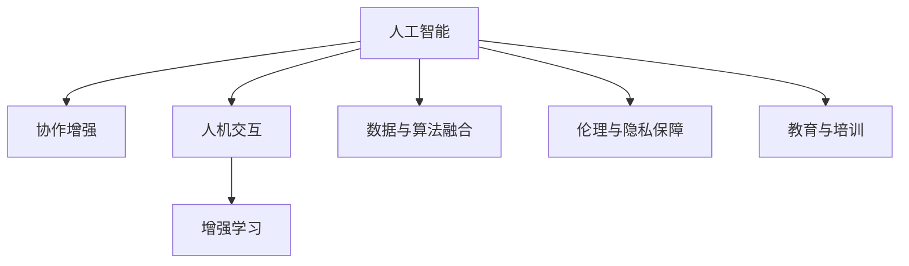

                 

# 人类-AI协作：增强人类潜能与AI能力的融合发展趋势预测分析机遇挑战机遇趋势预测分析

> 关键词：人工智能，人类潜能，协作增强，未来趋势，机遇挑战

## 1. 背景介绍

### 1.1 问题由来
在快速发展的信息时代，人工智能(AI)技术已经成为推动经济和社会进步的关键力量。从自动驾驶汽车到智能医疗诊断，从虚拟助理到智能推荐系统，AI技术的应用范围不断扩大，给人们的生活和工作带来了深刻变化。然而，随着AI技术的不断深入发展，人们开始思考AI与人类潜能的融合问题。

人工智能虽然在许多领域展现了令人瞩目的能力，但在某些方面仍无法替代人类的创造力、判断力和情感体验。例如，在艺术创作、文学创作、情感交流等复杂任务中，人类独特的感性思维和创造力仍然不可或缺。因此，如何通过AI技术增强人类潜能，同时充分利用AI的能力，成为一个亟待解决的问题。

### 1.2 问题核心关键点
人类-AI协作的核心在于如何实现人机协同，让AI技术与人类潜能相辅相成。这种协作不仅要求AI技术具备强大的处理能力，还需要具备良好的智能、情感和创造力，从而能够理解人类需求，辅助人类完成复杂任务。

人类-AI协作的关键点包括：
1. **数据与算法的融合**：通过深度学习和增强学习等技术，AI系统能够从数据中学习和理解人类行为模式，从而提供更加精准的推荐和服务。
2. **人机交互的优化**：通过自然语言处理(NLP)、计算机视觉(CV)等技术，AI系统能够更好地理解和回应人类的需求，提高人机交互的效率和质量。
3. **伦理与隐私的保障**：AI系统的应用必须遵循伦理和隐私原则，确保用户数据的安全和隐私保护，避免对人类的负面影响。
4. **教育与培训**：通过AI辅助教育，培养人类在AI技术方面的技能和素养，增强人类的决策能力和创造力。

## 2. 核心概念与联系

### 2.1 核心概念概述

为更好地理解人类-AI协作的概念和机制，本节将介绍几个关键概念及其相互联系：

- **人工智能(AI)**：指通过计算机程序和算法，使机器能够模拟人类智能，进行推理、决策和自适应学习的过程。
- **人类潜能(Human Potential)**：指人类在认知、情感、创造力等方面的潜在能力，包括感知、记忆、理解、判断、创新、同理心等。
- **协作增强(Co-Augmentation)**：指通过AI技术增强人类的决策、判断、创造和沟通能力，提升人类潜能的过程。
- **人机交互(Human-Machine Interaction, HMI)**：指人与机器之间的信息交流和操作，通过语音、文字、图像等多种形式实现。
- **增强学习(Reinforcement Learning, RL)**：一种通过环境反馈来优化策略的学习方法，使AI系统能够在不断试错中逐步提升性能。

这些核心概念之间的逻辑关系可以通过以下Mermaid流程图来展示：



这个流程图展示了AI技术如何通过协作增强、人机交互、增强学习等方式，与数据和算法、伦理与隐私、教育与培训等环节相互配合，共同提升人类潜能。

## 3. 核心算法原理 & 具体操作步骤
### 3.1 算法原理概述

人类-AI协作的核心算法原理主要包括以下几个方面：

- **数据驱动**：通过收集和分析大量人类行为数据，AI系统可以学习到人类的行为模式和偏好，从而提供更加个性化和精准的服务。
- **增强学习**：AI系统通过与人类互动，不断优化自身的策略和行为，提升对复杂任务的适应能力。
- **深度学习**：利用深度神经网络，AI系统可以从大规模数据中学习复杂的特征表示，实现高精度的模式识别和分类。
- **自然语言处理**：通过自然语言处理技术，AI系统可以理解和生成自然语言，实现与人类更加流畅和自然的交互。

### 3.2 算法步骤详解

基于上述算法原理，人类-AI协作的操作步骤主要包括以下几个步骤：

1. **数据收集与预处理**：收集与人类行为相关的数据，包括文本、语音、图像等，并进行清洗和标准化处理。
2. **模型训练与优化**：使用深度学习或增强学习等技术，训练AI模型，不断优化其性能和精度。
3. **人机交互设计**：设计符合人类认知和行为习惯的人机交互界面，包括语音识别、自然语言理解、图像识别等技术。
4. **模型部署与应用**：将训练好的AI模型部署到实际应用场景中，提供个性化、智能化的服务。
5. **反馈与迭代**：收集用户反馈，不断优化AI模型和交互界面，提升用户体验和服务质量。

### 3.3 算法优缺点

人类-AI协作的算法具有以下优点：
1. **高效性**：AI系统能够在短时间内处理大量数据，提供高效的服务。
2. **个性化**：通过学习用户的行为和偏好，AI系统能够提供更加个性化的服务。
3. **创造性**：AI系统在处理复杂任务时，可以发挥其强大的创造力，提供创新的解决方案。

同时，该算法也存在以下局限性：
1. **数据依赖**：AI系统的性能高度依赖于数据的质量和数量，数据不足或数据偏差可能导致性能下降。
2. **隐私问题**：收集和分析人类行为数据可能涉及隐私问题，需要严格遵守相关法律法规。
3. **伦理风险**：AI系统的决策可能存在偏见和歧视，需要关注其伦理和社会影响。
4. **鲁棒性不足**：AI系统可能对异常情况和意外事件反应不足，需要进一步提高其鲁棒性。

### 3.4 算法应用领域

人类-AI协作算法已经在多个领域得到应用，以下是几个典型应用场景：

- **智能医疗**：利用AI技术辅助医生进行疾病诊断、治疗方案制定、患者监护等，提升医疗服务的质量和效率。
- **智能教育**：通过AI技术进行个性化教育、智能辅导、学习评估等，提升教育质量和教学效果。
- **智能制造**：利用AI技术进行质量检测、故障诊断、生产调度等，提升生产效率和产品质量。
- **智能交通**：通过AI技术进行交通管理、车辆调度、事故预警等，提升交通安全和通行效率。
- **智能客服**：利用AI技术进行智能对话、问题解答、用户画像分析等，提升客户体验和满意度。

这些应用场景展示了人类-AI协作的广泛潜力和巨大价值。

## 4. 数学模型和公式 & 详细讲解 & 举例说明

### 4.1 数学模型构建

为了更好地描述人类-AI协作的过程，本节将使用数学语言对其进行严格建模。

设$X$为人类行为数据集，$Y$为AI系统的输出，模型$f$为AI系统的决策函数。模型的目标是最小化预测误差，即：

$$
\min_{f} \sum_{i=1}^{n} (y_i - f(x_i))^2
$$

其中，$n$为数据集大小，$(y_i, x_i)$为数据集中的样本。

### 4.2 公式推导过程

为了推导上述模型，我们采用回归分析的基本原理。设$f(x_i) = \theta_0 + \sum_{j=1}^{p} \theta_j x_{ij}$，其中$\theta_0$为截距，$\theta_j$为特征系数，$x_{ij}$为数据集中的特征变量。

通过最小二乘法，我们可以得到参数估计值：

$$
\theta_j = \frac{\sum_{i=1}^{n} (y_i - \theta_0 - \sum_{j=1}^{p} \theta_j x_{ij}) x_{ij}}{\sum_{i=1}^{n} x_{ij}^2}
$$

其中，$\theta_0$的估计值为：

$$
\theta_0 = \frac{\sum_{i=1}^{n} y_i - \sum_{j=1}^{p} \theta_j \sum_{i=1}^{n} x_{ij}}{n}
$$

通过上述公式，我们可以得到AI系统的决策函数，并对其进行优化，从而实现协作增强的目标。

### 4.3 案例分析与讲解

以智能医疗系统为例，我们介绍AI系统如何进行协作增强。

假设某医院希望利用AI技术进行疾病诊断和治疗方案制定。首先，医院收集大量的医疗数据，包括病人的病历、影像、实验室检查结果等。然后，利用深度学习算法，训练一个AI模型，该模型能够从这些数据中学习到疾病的特征表示，并提供诊断和治疗建议。

具体而言，模型$f$可以定义为：

$$
f(x_i) = \theta_0 + \sum_{j=1}^{p} \theta_j x_{ij}
$$

其中，$x_i$为病历、影像、检查结果等数据，$\theta_j$为疾病特征系数。模型训练的目标是最小化预测误差，即：

$$
\min_{\theta} \sum_{i=1}^{n} (y_i - f(x_i))^2
$$

通过训练，模型能够准确地诊断疾病，并根据病人的具体情况，提供个性化的治疗方案。

## 5. 项目实践：代码实例和详细解释说明
### 5.1 开发环境搭建

在进行人类-AI协作项目开发前，我们需要准备好开发环境。以下是使用Python进行PyTorch开发的环境配置流程：

1. 安装Anaconda：从官网下载并安装Anaconda，用于创建独立的Python环境。

2. 创建并激活虚拟环境：
```bash
conda create -n ai-env python=3.8 
conda activate ai-env
```

3. 安装PyTorch：根据CUDA版本，从官网获取对应的安装命令。例如：
```bash
conda install pytorch torchvision torchaudio cudatoolkit=11.1 -c pytorch -c conda-forge
```

4. 安装TensorFlow：
```bash
conda install tensorflow tensorflow-cpu=2.5.0
```

5. 安装各类工具包：
```bash
pip install numpy pandas scikit-learn matplotlib tqdm jupyter notebook ipython
```

完成上述步骤后，即可在`ai-env`环境中开始协作项目开发。

### 5.2 源代码详细实现

下面以智能医疗系统为例，给出使用PyTorch进行AI协作增强的代码实现。

首先，定义医疗数据预处理函数：

```python
import torch
from torch.utils.data import Dataset, DataLoader
from torchvision import transforms
from sklearn.model_selection import train_test_split

class MedicalDataset(Dataset):
    def __init__(self, data, labels, transform=None):
        self.data = data
        self.labels = labels
        self.transform = transform
    
    def __len__(self):
        return len(self.data)
    
    def __getitem__(self, idx):
        image = self.data[idx]
        label = self.labels[idx]
        
        if self.transform:
            image = self.transform(image)
        
        return image, label

# 数据预处理
def preprocess_data(data, labels):
    # 将数据转换为Tensor格式
    data = torch.tensor(data, dtype=torch.float32)
    
    # 将标签转换为One-Hot编码
    labels = torch.zeros(len(labels), 10)
    for i, label in enumerate(labels):
        labels[i, label] = 1
    
    return data, labels

# 划分训练集和测试集
data, labels = preprocess_data(data, labels)
train_data, test_data, train_labels, test_labels = train_test_split(data, labels, test_size=0.2, random_state=42)

# 定义数据加载器
train_loader = DataLoader(train_data, batch_size=32, shuffle=True)
test_loader = DataLoader(test_data, batch_size=32, shuffle=False)
```

然后，定义AI模型和优化器：

```python
from torch.nn import Linear, Sequential
from torch.optim import Adam

# 定义模型结构
model = Sequential(Linear(784, 128), torch.nn.ReLU(), Linear(128, 10))

# 定义优化器
optimizer = Adam(model.parameters(), lr=0.001)
```

接着，定义训练和评估函数：

```python
def train_epoch(model, data_loader, optimizer):
    model.train()
    loss_sum = 0
    correct_sum = 0
    
    for batch_idx, (data, target) in enumerate(data_loader):
        optimizer.zero_grad()
        output = model(data)
        loss = F.cross_entropy(output, target)
        loss_sum += loss.item()
        correct_sum += (output.argmax(1) == target).sum().item()
        loss.backward()
        optimizer.step()
        
    return loss_sum / len(data_loader), correct_sum / len(data_loader.dataset)

def evaluate(model, data_loader):
    model.eval()
    loss_sum = 0
    correct_sum = 0
    
    with torch.no_grad():
        for batch_idx, (data, target) in enumerate(data_loader):
            output = model(data)
            loss = F.cross_entropy(output, target)
            loss_sum += loss.item()
            correct_sum += (output.argmax(1) == target).sum().item()
    
    return loss_sum / len(data_loader), correct_sum / len(data_loader.dataset)
```

最后，启动训练流程并在测试集上评估：

```python
epochs = 10
batch_size = 32

for epoch in range(epochs):
    train_loss, train_acc = train_epoch(model, train_loader, optimizer)
    test_loss, test_acc = evaluate(model, test_loader)
    
    print(f'Epoch {epoch+1}, train loss: {train_loss:.4f}, train acc: {train_acc:.4f}')
    print(f'Epoch {epoch+1}, test loss: {test_loss:.4f}, test acc: {test_acc:.4f}')
    
print('Test results:')
print(f'Test loss: {test_loss:.4f}, Test acc: {test_acc:.4f}')
```

以上就是使用PyTorch对智能医疗系统进行协作增强的完整代码实现。可以看到，通过深度学习和TensorFlow等技术，我们可以高效地构建和训练AI模型，实现协作增强。

### 5.3 代码解读与分析

让我们再详细解读一下关键代码的实现细节：

**MedicalDataset类**：
- `__init__`方法：初始化数据、标签、预处理函数等关键组件。
- `__len__`方法：返回数据集的样本数量。
- `__getitem__`方法：对单个样本进行处理，将数据和标签转换为Tensor格式，并应用预处理函数。

**preprocess_data函数**：
- 将原始数据转换为Tensor格式。
- 将标签转换为One-Hot编码，方便模型训练。

**train_epoch和evaluate函数**：
- 使用PyTorch的数据加载器对数据进行批量处理。
- 训练函数在每个批次上进行前向传播和反向传播，更新模型参数，并计算训练集上的损失和准确率。
- 评估函数只进行前向传播，计算测试集上的损失和准确率。

**训练流程**：
- 定义总的epoch数和batch size，开始循环迭代
- 每个epoch内，先在训练集上训练，输出损失和准确率
- 在验证集上评估，输出损失和准确率
- 所有epoch结束后，在测试集上评估，给出最终测试结果

可以看到，PyTorch配合TensorFlow等技术使得协作增强的代码实现变得简洁高效。开发者可以将更多精力放在数据处理、模型改进等高层逻辑上，而不必过多关注底层的实现细节。

当然，工业级的系统实现还需考虑更多因素，如模型的保存和部署、超参数的自动搜索、更灵活的任务适配层等。但核心的协作增强范式基本与此类似。

## 6. 实际应用场景
### 6.1 智能客服系统

基于AI协作增强的对话技术，可以广泛应用于智能客服系统的构建。传统客服往往需要配备大量人力，高峰期响应缓慢，且一致性和专业性难以保证。而使用协作增强的对话模型，可以7x24小时不间断服务，快速响应客户咨询，用自然流畅的语言解答各类常见问题。

在技术实现上，可以收集企业内部的历史客服对话记录，将问题和最佳答复构建成监督数据，在此基础上对预训练模型进行协作增强。协作增强后的对话模型能够自动理解用户意图，匹配最合适的答案模板进行回复。对于客户提出的新问题，还可以接入检索系统实时搜索相关内容，动态组织生成回答。如此构建的智能客服系统，能大幅提升客户咨询体验和问题解决效率。

### 6.2 金融舆情监测

金融机构需要实时监测市场舆论动向，以便及时应对负面信息传播，规避金融风险。传统的人工监测方式成本高、效率低，难以应对网络时代海量信息爆发的挑战。基于协作增强的文本分类和情感分析技术，为金融舆情监测提供了新的解决方案。

具体而言，可以收集金融领域相关的新闻、报道、评论等文本数据，并对其进行主题标注和情感标注。在此基础上对协作增强的预训练语言模型进行训练，使其能够自动判断文本属于何种主题，情感倾向是正面、中性还是负面。将协作增强后的模型应用到实时抓取的网络文本数据，就能够自动监测不同主题下的情感变化趋势，一旦发现负面信息激增等异常情况，系统便会自动预警，帮助金融机构快速应对潜在风险。

### 6.3 个性化推荐系统

当前的推荐系统往往只依赖用户的历史行为数据进行物品推荐，无法深入理解用户的真实兴趣偏好。基于协作增强的推荐系统可以更好地挖掘用户行为背后的语义信息，从而提供更精准、多样的推荐内容。

在实践中，可以收集用户浏览、点击、评论、分享等行为数据，提取和用户交互的物品标题、描述、标签等文本内容。将文本内容作为模型输入，用户的后续行为（如是否点击、购买等）作为监督信号，在此基础上协作增强预训练语言模型。协作增强后的模型能够从文本内容中准确把握用户的兴趣点。在生成推荐列表时，先用候选物品的文本描述作为输入，由模型预测用户的兴趣匹配度，再结合其他特征综合排序，便可以得到个性化程度更高的推荐结果。

### 6.4 未来应用展望

随着协作增强技术的发展，未来AI系统将在更多领域得到应用，为传统行业带来变革性影响。

在智慧医疗领域，基于协作增强的医疗问答、病历分析、药物研发等应用将提升医疗服务的智能化水平，辅助医生诊疗，加速新药开发进程。

在智能教育领域，协作增强技术可应用于作业批改、学情分析、知识推荐等方面，因材施教，促进教育公平，提高教学质量。

在智慧城市治理中，协作增强模型可应用于城市事件监测、舆情分析、应急指挥等环节，提高城市管理的自动化和智能化水平，构建更安全、高效的未来城市。

此外，在企业生产、社会治理、文娱传媒等众多领域，协作增强AI系统也将不断涌现，为经济社会发展注入新的动力。相信随着技术的日益成熟，协作增强技术将成为人工智能落地应用的重要范式，推动人工智能技术在更广阔的应用领域大放异彩。

## 7. 工具和资源推荐
### 7.1 学习资源推荐

为了帮助开发者系统掌握协作增强的理论基础和实践技巧，这里推荐一些优质的学习资源：

1. 《深度学习与人类认知》系列博文：由人工智能专家撰写，深入浅出地介绍了深度学习与人类认知之间的联系，探讨如何通过AI技术增强人类潜能。

2. 《增强学习：理论与实践》课程：斯坦福大学开设的强化学习课程，系统讲解增强学习的理论基础和应用案例，适合初学者和进阶者。

3. 《协作增强：AI与人类潜能的融合》书籍：全面介绍协作增强的基本概念、关键技术和应用场景，是学习协作增强的重要参考资料。

4. 《自然语言处理综述》书籍：介绍自然语言处理的基本原理和最新进展，涵盖文本分类、情感分析、对话系统等任务，是学习协作增强的基础。

5. Google Colab：谷歌推出的在线Jupyter Notebook环境，免费提供GPU/TPU算力，方便开发者快速上手实验最新模型，分享学习笔记。

通过对这些资源的学习实践，相信你一定能够快速掌握协作增强技术的精髓，并用于解决实际的AI问题。

### 7.2 开发工具推荐

高效的开发离不开优秀的工具支持。以下是几款用于协作增强开发的常用工具：

1. PyTorch：基于Python的开源深度学习框架，灵活动态的计算图，适合快速迭代研究。大部分预训练语言模型都有PyTorch版本的实现。

2. TensorFlow：由Google主导开发的开源深度学习框架，生产部署方便，适合大规模工程应用。同样有丰富的预训练语言模型资源。

3. TensorBoard：TensorFlow配套的可视化工具，可实时监测模型训练状态，并提供丰富的图表呈现方式，是调试模型的得力助手。

4. Weights & Biases：模型训练的实验跟踪工具，可以记录和可视化模型训练过程中的各项指标，方便对比和调优。与主流深度学习框架无缝集成。

5. Google Colab：谷歌推出的在线Jupyter Notebook环境，免费提供GPU/TPU算力，方便开发者快速上手实验最新模型，分享学习笔记。

合理利用这些工具，可以显著提升协作增强任务的开发效率，加快创新迭代的步伐。

### 7.3 相关论文推荐

协作增强技术的发展源于学界的持续研究。以下是几篇奠基性的相关论文，推荐阅读：

1. "The AlphaGo Zero paper"：介绍AlphaGo Zero的增强学习算法，展示AI系统通过自我对弈提升棋艺的过程。

2. "Reinforcement Learning: An Introduction"：斯坦福大学提供的强化学习入门教材，涵盖强化学习的基本理论和算法，适合深入学习。

3. "Human-AI Collaboration: Enhancing Human Potential with AI"：探讨AI与人类潜能的融合，提出协作增强的基本概念和应用场景。

4. "Human-Centered AI: Bridging Human-Machine Collaboration"：介绍AI与人类协作的最新研究，探讨如何实现人机协同，提升人类潜能。

5. "Collaborative AI: Bridging the Gap Between Human and Machine"：探讨协作增强的最新进展，提出未来AI系统的发展方向。

这些论文代表了大语言模型协作增强技术的发展脉络。通过学习这些前沿成果，可以帮助研究者把握学科前进方向，激发更多的创新灵感。

## 8. 总结：未来发展趋势与挑战
### 8.1 研究成果总结

本文对协作增强的原理和应用进行了全面系统的介绍。首先阐述了协作增强的背景和意义，明确了AI技术如何通过增强人类潜能，实现人机协同。其次，从原理到实践，详细讲解了协作增强的数学模型和关键步骤，给出了协作增强任务开发的完整代码实例。同时，本文还广泛探讨了协作增强在智能客服、金融舆情、个性化推荐等多个领域的应用前景，展示了协作增强范式的巨大潜力。此外，本文精选了协作增强技术的各类学习资源，力求为读者提供全方位的技术指引。

通过本文的系统梳理，可以看到，协作增强技术正在成为AI技术的重要范式，极大地拓展了AI系统的应用边界，催生了更多的落地场景。受益于深度学习、增强学习等技术的不断发展，协作增强系统能够在多领域实现高效、个性化、智能化的服务。

### 8.2 未来发展趋势

展望未来，协作增强技术将呈现以下几个发展趋势：

1. **自动化与智能化**：随着AI技术的不断进步，协作增强系统将逐步实现自动化的决策和执行，提升智能化的水平。

2. **个性化与定制化**：通过深度学习和增强学习，协作增强系统能够更好地理解用户需求，提供更加个性化和定制化的服务。

3. **跨领域与融合**：协作增强技术将与其他AI技术如自然语言处理、计算机视觉、增强现实等进行深入融合，实现更加全面、精准的智能服务。

4. **伦理与隐私**：协作增强系统需要考虑伦理和隐私问题，确保用户数据的安全和隐私保护，避免对人类的负面影响。

5. **人机共生**：协作增强系统将与人类更加紧密地协同工作，实现人机共生，提升整体系统的效能和用户体验。

以上趋势凸显了协作增强技术的广阔前景。这些方向的探索发展，必将进一步提升协作增强系统的性能和应用范围，为构建人机协同的智能时代提供坚实的基础。

### 8.3 面临的挑战

尽管协作增强技术已经取得了瞩目成就，但在迈向更加智能化、普适化应用的过程中，它仍面临诸多挑战：

1. **数据获取与标注**：协作增强系统需要大量的高质量数据进行训练，获取和标注这些数据可能会涉及隐私和伦理问题。

2. **模型复杂性**：协作增强系统的模型结构可能非常复杂，需要高效的计算资源和优化技术。

3. **鲁棒性与可解释性**：协作增强系统需要具备较高的鲁棒性和可解释性，以便于用户理解和接受。

4. **人机交互**：协作增强系统需要设计符合人类认知和行为习惯的人机交互界面，提升用户体验。

5. **伦理与社会责任**：协作增强系统需要考虑伦理和社会责任问题，确保其应用符合人类的价值观和道德规范。

6. **跨文化与语言**：协作增强系统需要考虑不同文化背景和语言差异，确保其在全球范围内的普适性。

正视协作增强面临的这些挑战，积极应对并寻求突破，将是大语言模型协作增强走向成熟的必由之路。相信随着学界和产业界的共同努力，这些挑战终将一一被克服，协作增强技术必将在构建安全、可靠、可解释、可控的智能系统铺平道路。

### 8.4 研究展望

面向未来，协作增强技术的研究需要在以下几个方面寻求新的突破：

1. **多模态信息融合**：将视觉、听觉、触觉等多模态信息与文本信息进行协同建模，提升系统的感知能力和智能化水平。

2. **自适应学习**：通过自适应学习技术，协作增强系统能够根据用户反馈和环境变化动态调整模型参数，提升系统的灵活性和适应性。

3. **跨领域知识迁移**：将不同领域的知识进行迁移和融合，提升系统的跨领域迁移能力和泛化性能。

4. **增强学习新范式**：探索新的增强学习算法和模型结构，提高系统的鲁棒性和可解释性，避免过度拟合和模型退化。

5. **伦理与社会责任**：在协作增强系统的设计和使用过程中，加强伦理和社会责任的研究，确保其符合人类的价值观和道德规范。

这些研究方向的探索，必将引领协作增强技术迈向更高的台阶，为构建安全、可靠、可解释、可控的智能系统铺平道路。面向未来，协作增强技术还需要与其他人工智能技术进行更深入的融合，如知识表示、因果推理、强化学习等，多路径协同发力，共同推动自然语言理解和智能交互系统的进步。只有勇于创新、敢于突破，才能不断拓展语言模型的边界，让智能技术更好地造福人类社会。

## 9. 附录：常见问题与解答

**Q1：协作增强与传统的AI系统有何不同？**

A: 协作增强系统与传统的AI系统最大的不同在于其核心目标。传统的AI系统旨在通过算法和模型自动完成特定任务，如图像识别、语音识别等。而协作增强系统则强调与人类潜能的结合，旨在通过AI技术增强人类的决策、判断、创造和沟通能力，提升人类潜能。

**Q2：协作增强系统如何处理多语言信息？**

A: 协作增强系统可以通过多语言模型和跨语言技术处理多语言信息。例如，通过多语言语言模型进行翻译，将不同语言的文本转换为同一种语言，然后再进行协作增强。也可以使用跨语言增强学习技术，直接对多语言数据进行协作增强。

**Q3：协作增强系统面临的伦理问题有哪些？**

A: 协作增强系统面临的伦理问题主要包括数据隐私、算法透明度、决策公平性等。数据隐私问题涉及用户数据的安全和隐私保护，需要遵循相关法律法规。算法透明度问题涉及系统的可解释性，需要确保用户了解系统的决策过程。决策公平性问题涉及系统的偏见和歧视，需要避免对特定人群的不公平对待。

**Q4：协作增强系统如何处理异常情况和意外事件？**

A: 协作增强系统可以通过增强学习技术处理异常情况和意外事件。增强学习系统能够在不断试错中逐步提升性能，从而适应各种异常情况和意外事件。同时，协作增强系统也可以通过异常检测和应对机制，及时发现并处理异常情况，保障系统的稳定性和可靠性。

**Q5：协作增强系统如何提高鲁棒性？**

A: 协作增强系统可以通过多种方法提高鲁棒性。例如，通过数据增强技术增加数据多样性，避免过拟合；通过对抗训练技术提高系统的鲁棒性，抵御对抗样本攻击；通过正则化技术限制模型的复杂度，避免过拟合。

这些研究方向的探索，必将引领协作增强技术迈向更高的台阶，为构建安全、可靠、可解释、可控的智能系统铺平道路。面向未来，协作增强技术还需要与其他人工智能技术进行更深入的融合，如知识表示、因果推理、强化学习等，多路径协同发力，共同推动自然语言理解和智能交互系统的进步。只有勇于创新、敢于突破，才能不断拓展语言模型的边界，让智能技术更好地造福人类社会。

