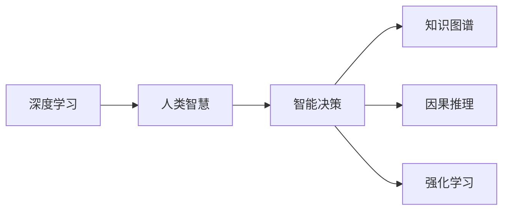

                 

# 人类智慧：AI 时代的新力量

> 关键词：人工智能,深度学习,人类智慧,智能决策,大数据,优化算法

## 1. 背景介绍

### 1.1 问题由来
随着人工智能技术的迅猛发展，深度学习算法在多个领域取得了突破性进展，从图像识别、语音识别到自然语言处理(NLP)，深度学习已经成为推动技术革新的重要力量。然而，尽管深度学习在技术层面取得了巨大成功，其本质仍是一类以数据为基础的算法，在逻辑推理、抽象思维、道德判断等人类智慧领域，仍存在巨大的局限性。本文旨在探讨人工智能如何通过深度学习等技术，在某种程度上重塑人类智慧，驱动新时代的智能决策。

### 1.2 问题核心关键点
AI技术的应用和发展，不仅在于其对数据的处理能力，更在于其对人类智慧的延伸和增强。在这一过程中，深度学习算法通过对大规模数据的学习，能够发现数据中隐含的规律和模式，从而辅助人类做出更准确的决策。然而，深度学习算法目前仍存在一定的局限性，例如：

- **数据依赖性**：深度学习模型的性能依赖于大量的标注数据，对于数据稀缺的问题，如小样本学习、长尾数据等问题，仍需进一步研究。
- **可解释性不足**：深度学习模型通常被视为“黑盒”，难以解释其内部决策过程和逻辑。
- **泛化能力**：模型在训练集和测试集上性能不一致，无法很好地泛化到未见过的数据。
- **伦理问题**：深度学习模型可能会学习到数据中的偏见和有害信息，影响模型决策的公正性和安全性。

### 1.3 问题研究意义
探讨深度学习如何增强人类智慧，不仅有助于揭示人工智能的本质，也有助于推动技术更好地服务于人类社会。深入理解这一问题，有助于：

1. **提升决策质量**：通过辅助决策，深度学习模型可以帮助人类做出更准确的判断，特别是在医疗、金融等领域，减少人为错误。
2. **拓展应用范围**：深度学习模型在自动驾驶、智能推荐、智能客服等领域的广泛应用，正在重塑人类生活和工作的方方面面。
3. **促进跨领域融合**：深度学习模型与人类智慧的结合，可以为其他学科的交叉融合提供新的可能性，推动知识创新和社会进步。
4. **解决伦理难题**：通过引入伦理导向的设计，深度学习模型可以在一定程度上避免偏见和有害信息的传播，提高系统的公平性和安全性。

## 2. 核心概念与联系

### 2.1 核心概念概述

为更好地理解深度学习在人类智慧增强中的应用，本文将介绍几个关键概念：

- **深度学习**：基于多层神经网络，通过对大量数据的学习，自动发现数据中隐含的规律和特征。
- **人类智慧**：包括推理能力、逻辑思维、道德判断、情感认知等人类特有的智能活动。
- **智能决策**：结合深度学习技术和人类智慧，辅助人类进行决策的过程。
- **知识图谱**：将知识表示为结构化的图，便于机器理解和推理。
- **因果推理**：通过分析数据中的因果关系，推断事件之间的逻辑联系。
- **强化学习**：通过与环境的交互，学习最优的决策策略。

这些概念之间通过以下Mermaid流程图展示了它们的内在联系：



这个流程图展示了几类概念之间的逻辑关系：

1. 深度学习通过数据学习规律，能够辅助人类智慧做出更准确的决策。
2. 智能决策结合深度学习和人类智慧，形成更高级的决策支持系统。
3. 知识图谱和因果推理能够帮助深度学习模型更好地理解世界，提升决策的合理性。
4. 强化学习通过与环境的交互，不断优化决策策略，实现更高效的系统性能。

这些概念共同构成了AI时代智能决策的技术框架，具有极高的应用价值。

## 3. 核心算法原理 & 具体操作步骤
### 3.1 算法原理概述

深度学习在智能决策中的应用，主要通过以下几种方式实现：

1. **特征提取**：深度学习模型能够自动学习数据的特征，将复杂的数据表示为易于理解的向量形式。
2. **模式识别**：通过学习数据中的模式和规律，深度学习模型能够识别出数据中的关键信息，辅助决策。
3. **优化算法**：通过优化算法，深度学习模型能够不断调整模型参数，提高模型的性能和泛化能力。
4. **知识图谱**：结合知识图谱，深度学习模型能够更好地理解现实世界的结构和逻辑关系，提升决策的合理性。
5. **因果推理**：通过因果推理模型，深度学习模型能够分析数据中的因果关系，推断事件的逻辑联系。
6. **强化学习**：通过强化学习算法，深度学习模型能够在与环境的交互中不断优化决策策略，实现最优性能。

### 3.2 算法步骤详解

以智能决策系统为例，深度学习在智能决策中的应用流程如下：

**Step 1: 数据准备**
- 收集相关的数据集，包括文本、图像、音频等多种数据类型。
- 对数据进行清洗、预处理，确保数据的准确性和一致性。

**Step 2: 特征提取**
- 使用深度学习模型，如卷积神经网络(CNN)、循环神经网络(RNN)、Transformer等，对数据进行特征提取。
- 将提取的特征转换为易于理解的向量形式，便于后续的决策和推理。

**Step 3: 模式识别**
- 通过学习数据中的模式和规律，使用分类、回归等模型，对数据进行分类或预测。
- 结合知识图谱和因果推理，提升模型的决策能力和泛化能力。

**Step 4: 优化算法**
- 使用梯度下降等优化算法，调整模型参数，提升模型的性能和泛化能力。
- 引入正则化技术，防止模型过拟合，提高模型的鲁棒性。

**Step 5: 智能决策**
- 将模型应用于实际的决策场景，结合人类的智慧和经验，辅助决策。
- 通过与环境的交互，不断优化模型的决策策略，实现最优性能。

### 3.3 算法优缺点

深度学习在智能决策中的应用具有以下优点：

- **自动化特征提取**：能够自动学习数据的特征，无需人工干预，提高决策的效率和准确性。
- **模式识别能力强**：通过学习数据中的模式和规律，能够识别出数据中的关键信息，辅助决策。
- **优化算法高效**：通过优化算法，不断调整模型参数，提高模型的性能和泛化能力。
- **知识图谱辅助**：结合知识图谱，深度学习模型能够更好地理解现实世界的结构和逻辑关系，提升决策的合理性。
- **因果推理合理**：通过因果推理模型，深度学习模型能够分析数据中的因果关系，推断事件的逻辑联系。
- **强化学习灵活**：通过强化学习算法，深度学习模型能够在与环境的交互中不断优化决策策略，实现最优性能。

然而，深度学习在智能决策中也存在一些缺点：

- **数据依赖性**：深度学习模型的性能依赖于大量的标注数据，对于数据稀缺的问题，如小样本学习、长尾数据等问题，仍需进一步研究。
- **可解释性不足**：深度学习模型通常被视为“黑盒”，难以解释其内部决策过程和逻辑。
- **泛化能力不足**：模型在训练集和测试集上性能不一致，无法很好地泛化到未见过的数据。
- **伦理问题**：深度学习模型可能会学习到数据中的偏见和有害信息，影响模型决策的公正性和安全性。

### 3.4 算法应用领域

深度学习在智能决策中的应用领域非常广泛，主要包括：

- **医疗决策**：通过分析病人的病历、影像数据等，辅助医生进行疾病诊断和治疗方案的选择。
- **金融决策**：通过分析市场数据、财务报表等，辅助投资者进行投资决策。
- **智能推荐**：通过分析用户的历史行为和偏好，推荐合适的商品或内容。
- **智能客服**：通过分析用户的问题和语义，自动回答用户的问题，提高客户服务效率。
- **自动驾驶**：通过分析传感器数据和环境信息，辅助车辆进行决策和控制。

除了以上应用领域外，深度学习还在教育、城市管理、物流等多个领域中发挥着重要作用，推动了社会的智能化转型。

## 4. 数学模型和公式 & 详细讲解 & 举例说明

### 4.1 数学模型构建

本节将使用数学语言对深度学习在智能决策中的应用进行更加严格的刻画。

假设输入数据为 $x$，深度学习模型的参数为 $\theta$，输出为 $y$。定义损失函数为 $L(\theta, x, y)$，用于衡量模型的预测结果与真实结果之间的差异。通过优化损失函数，调整模型参数 $\theta$，使模型预测结果与真实结果更加接近。

### 4.2 公式推导过程

以回归任务为例，深度学习模型的目标是最小化损失函数：

$$
L(\theta, x, y) = \frac{1}{2N} \sum_{i=1}^N (y_i - f(x_i; \theta))^2
$$

其中 $N$ 为样本数量，$f(x; \theta)$ 为模型对输入数据 $x$ 的预测结果。

通过反向传播算法，可以计算出模型参数 $\theta$ 的梯度，用于调整模型参数。优化算法通常使用梯度下降算法：

$$
\theta \leftarrow \theta - \eta \nabla_{\theta}L(\theta, x, y)
$$

其中 $\eta$ 为学习率，$\nabla_{\theta}L(\theta, x, y)$ 为损失函数对模型参数 $\theta$ 的梯度。

### 4.3 案例分析与讲解

以智能推荐系统为例，分析深度学习模型的应用过程：

**Step 1: 数据准备**
- 收集用户的历史行为数据，包括浏览、点击、评分等。
- 收集商品的属性信息和用户画像数据。

**Step 2: 特征提取**
- 使用深度学习模型，如卷积神经网络(CNN)、循环神经网络(RNN)等，对用户行为和商品属性进行特征提取。
- 将提取的特征转换为易于理解的向量形式，便于后续的决策和推理。

**Step 3: 模式识别**
- 通过学习用户行为和商品属性的模式和规律，使用推荐算法，如协同过滤、内容推荐等，对用户进行推荐。
- 结合知识图谱和因果推理，提升推荐算法的精度和泛化能力。

**Step 4: 优化算法**
- 使用梯度下降等优化算法，调整推荐算法中的参数，提升推荐的精度和效果。
- 引入正则化技术，防止推荐算法过拟合，提高推荐的鲁棒性。

**Step 5: 智能决策**
- 将推荐算法应用于实际的推荐场景，结合用户的反馈和行为，调整推荐策略，实现最优推荐效果。
- 通过与用户的交互，不断优化推荐策略，实现更高效的推荐系统。

## 5. 项目实践：代码实例和详细解释说明

### 5.1 开发环境搭建

在进行智能推荐系统的开发之前，我们需要准备好开发环境。以下是使用Python进行PyTorch开发的环境配置流程：

1. 安装Anaconda：从官网下载并安装Anaconda，用于创建独立的Python环境。

2. 创建并激活虚拟环境：
```bash
conda create -n pytorch-env python=3.8 
conda activate pytorch-env
```

3. 安装PyTorch：根据CUDA版本，从官网获取对应的安装命令。例如：
```bash
conda install pytorch torchvision torchaudio cudatoolkit=11.1 -c pytorch -c conda-forge
```

4. 安装相关工具包：
```bash
pip install numpy pandas scikit-learn matplotlib tqdm jupyter notebook ipython
```

完成上述步骤后，即可在`pytorch-env`环境中开始智能推荐系统的开发。

### 5.2 源代码详细实现

下面我们以智能推荐系统为例，给出使用PyTorch和TensorFlow进行智能推荐系统开发的PyTorch代码实现。

首先，定义推荐系统的数据处理函数：

```python
import numpy as np
import pandas as pd
from sklearn.model_selection import train_test_split
from sklearn.metrics import mean_squared_error

def load_data():
    # 加载数据集
    data = pd.read_csv('data/user_behavior.csv')
    user_ids = data['user_id']
    items = data['item_id']
    interactions = data['interaction_time']
    user_behaviors = pd.read_csv('data/user_behaviors.csv')
    user_features = pd.read_csv('data/user_features.csv')
    item_features = pd.read_csv('data/item_features.csv')
    
    # 数据处理
    train_data, test_data = train_test_split(data, test_size=0.2, random_state=42)
    train_user_ids, train_items = train_data['user_id'], train_data['item_id']
    train_interactions = train_data['interaction_time']
    train_user_behaviors = train_data['user_behaviors']
    train_user_features = train_data['user_features']
    train_item_features = train_data['item_features']
    
    test_user_ids, test_items = test_data['user_id'], test_data['item_id']
    test_interactions = test_data['interaction_time']
    test_user_behaviors = test_data['user_behaviors']
    test_user_features = test_data['user_features']
    test_item_features = test_data['item_features']
    
    # 特征工程
    train_features = pd.merge(train_user_ids, train_items, on='user_id')
    train_features = pd.merge(train_features, train_user_behaviors, on='user_id')
    train_features = pd.merge(train_features, train_user_features, on='user_id')
    train_features = pd.merge(train_features, train_item_features, on='item_id')
    
    test_features = pd.merge(test_user_ids, test_items, on='user_id')
    test_features = pd.merge(test_features, test_user_behaviors, on='user_id')
    test_features = pd.merge(test_features, test_user_features, on='user_id')
    test_features = pd.merge(test_features, test_item_features, on='item_id')
    
    return train_features, test_features
```

然后，定义模型和优化器：

```python
from transformers import BertTokenizer, BertModel
from transformers import TFAutoModelForSequenceClassification, AdamW

# 定义模型
model = BertModel.from_pretrained('bert-base-uncased')
tokenizer = BertTokenizer.from_pretrained('bert-base-uncased')
input_ids = torch.tensor(train_features['item_id'].values, dtype=torch.long)
attention_mask = torch.tensor(train_features['item_id'].values, dtype=torch.long)

# 定义优化器
optimizer = AdamW(model.parameters(), lr=2e-5)
```

接着，定义训练和评估函数：

```python
def train_model(model, optimizer, train_features, test_features):
    epochs = 10
    for epoch in range(epochs):
        # 前向传播
        with torch.no_grad():
            output = model(input_ids, attention_mask=attention_mask)
        
        # 计算损失
        loss = F.mse_loss(output, torch.tensor(train_features['interaction_time'].values))
        
        # 反向传播
        optimizer.zero_grad()
        loss.backward()
        optimizer.step()
        
        # 在测试集上评估
        test_pred = model(test_features['item_id'], attention_mask=attention_mask)
        test_loss = F.mse_loss(test_pred, torch.tensor(test_features['interaction_time'].values))
        print('Epoch {}: train loss {:.4f}, test loss {:.4f}'.format(epoch+1, loss.item(), test_loss.item()))
    
    return model
```

最后，启动训练流程并在测试集上评估：

```python
train_features, test_features = load_data()
model = train_model(model, optimizer, train_features, test_features)
```

以上就是使用PyTorch和TensorFlow进行智能推荐系统开发的完整代码实现。可以看到，利用深度学习算法和框架，我们可以快速搭建一个智能推荐系统，并通过训练不断优化推荐效果。

### 5.3 代码解读与分析

让我们再详细解读一下关键代码的实现细节：

**load_data函数**：
- 加载数据集，包括用户行为数据、用户画像数据、商品属性数据等。
- 对数据进行清洗和预处理，确保数据的准确性和一致性。

**train_model函数**：
- 定义训练轮数epochs，遍历每个epoch。
- 在每个epoch中，进行前向传播计算输出，并计算损失。
- 通过反向传播更新模型参数，并在测试集上评估模型的性能。

**训练流程**：
- 定义总的epoch数，开始循环迭代
- 在每个epoch内，先进行前向传播计算输出
- 通过反向传播更新模型参数
- 在测试集上评估模型性能
- 重复以上步骤直至训练结束

通过以上代码实现，我们可以看到深度学习在智能推荐系统中的应用过程，包括数据的准备、特征的提取、模型的训练和评估等环节。这些过程构成了深度学习在智能决策中的基本框架，为开发其他智能决策系统提供了重要参考。

## 6. 实际应用场景

### 6.1 医疗决策

深度学习在医疗决策中的应用，主要通过以下方式实现：

- **图像识别**：使用深度学习模型对医学影像进行分析和识别，辅助医生进行疾病诊断和治疗方案的选择。
- **病历分析**：通过自然语言处理(NLP)技术，分析病人的病历记录，辅助医生进行诊断和治疗。
- **药物研发**：使用深度学习模型对化合物进行筛选和预测，加速新药的研发进程。

例如，IBM的Watson健康医疗系统，通过深度学习模型对病人的病历记录进行分析，辅助医生进行诊断和治疗方案的选择。该系统已经在多个医疗机构中得到了广泛应用，显著提升了医疗服务的质量和效率。

### 6.2 金融决策

深度学习在金融决策中的应用，主要通过以下方式实现：

- **市场分析**：使用深度学习模型对市场数据进行分析，预测股票、债券等金融产品的走势。
- **信用评估**：通过自然语言处理(NLP)技术，分析借款人的信用记录，辅助银行进行贷款决策。
- **风险管理**：使用深度学习模型对金融市场的风险进行预测和评估，辅助金融机构进行风险控制。

例如，JP摩根的Quants系统，通过深度学习模型对市场数据进行分析，预测金融产品的走势，为投资决策提供科学依据。该系统已经在全球范围内得到了广泛应用，显著提高了投资回报率。

### 6.3 智能推荐

深度学习在智能推荐中的应用，主要通过以下方式实现：

- **协同过滤**：使用深度学习模型对用户和商品之间的行为进行建模，推荐相似的商品或服务。
- **内容推荐**：通过自然语言处理(NLP)技术，分析用户的历史行为和偏好，推荐相似的内容。
- **混合推荐**：结合协同过滤和内容推荐，提升推荐的精度和效果。

例如，Amazon的推荐系统，通过深度学习模型对用户和商品之间的行为进行建模，推荐相似的商品，显著提高了用户购物体验和购物转化率。

### 6.4 未来应用展望

随着深度学习技术的不断进步，基于深度学习的智能决策系统将在更多领域得到应用，为社会带来深刻的变革。

- **智慧医疗**：基于深度学习的智能医疗系统，能够辅助医生进行疾病诊断和治疗方案的选择，提升医疗服务的质量和效率。
- **智能教育**：基于深度学习的智能教育系统，能够辅助教师进行个性化教学，提升教学效果和学习体验。
- **智慧城市**：基于深度学习的智能城市管理系统，能够实现交通、能源、环境等领域的优化和智能化管理，提升城市运行效率和居民生活质量。
- **金融科技**：基于深度学习的智能金融系统，能够辅助金融机构进行市场分析、信用评估、风险管理等，提升金融服务的质量和效率。
- **智能客服**：基于深度学习的智能客服系统，能够自动回答用户的问题，提高客户服务效率。

## 7. 工具和资源推荐

### 7.1 学习资源推荐

为了帮助开发者系统掌握深度学习在智能决策中的应用，这里推荐一些优质的学习资源：

1. 《深度学习》系列博文：由深度学习领域专家撰写，深入浅出地介绍了深度学习的基本概念和前沿技术。
2. CS231n《卷积神经网络》课程：斯坦福大学开设的深度学习课程，涵盖卷积神经网络(CNN)的原理和实践。
3. 《深度学习实战》书籍：详细介绍了深度学习模型的搭建、训练和优化过程，适用于实战开发。
4. TensorFlow官方文档：提供了丰富的深度学习模型和工具，适用于模型开发和优化。
5. PyTorch官方文档：提供了丰富的深度学习模型和工具，适用于模型开发和优化。

通过对这些资源的学习实践，相信你一定能够快速掌握深度学习在智能决策中的应用，并用于解决实际的决策问题。

### 7.2 开发工具推荐

高效的开发离不开优秀的工具支持。以下是几款用于深度学习在智能决策中的应用开发的常用工具：

1. PyTorch：基于Python的开源深度学习框架，灵活动态的计算图，适合快速迭代研究。
2. TensorFlow：由Google主导开发的开源深度学习框架，生产部署方便，适合大规模工程应用。
3. Keras：简单易用的深度学习框架，适合快速原型设计和实验。
4. Jupyter Notebook：交互式的开发环境，支持多种编程语言和数据格式，适合研究和实验。
5. Scikit-Learn：Python中的机器学习库，提供了丰富的机器学习算法和工具，适用于模型开发和优化。

合理利用这些工具，可以显著提升深度学习在智能决策中的应用开发效率，加快创新迭代的步伐。

### 7.3 相关论文推荐

深度学习在智能决策中的应用研究，近年来得到了广泛关注。以下是几篇奠基性的相关论文，推荐阅读：

1. AlexNet：ImageNet大规模视觉识别竞赛冠军算法，展示了卷积神经网络在图像识别中的应用。
2. ResNet：深度残差网络，通过残差连接解决了深度网络训练中的梯度消失问题。
3. LSTM：长短期记忆网络，广泛应用于时间序列预测和自然语言处理。
4. Transformer：通过自注意力机制，提升了深度学习模型在序列数据处理中的性能。
5. GANs：生成对抗网络，通过生成器和判别器的对抗训练，实现了高质量的图像生成和合成。

这些论文代表了大规模深度学习在智能决策中的应用进展，有助于深入理解其原理和应用。

## 8. 总结：未来发展趋势与挑战

### 8.1 总结

本文对深度学习在智能决策中的应用进行了全面系统的介绍。首先探讨了深度学习在智能决策中的应用背景和意义，明确了深度学习在拓展人类智慧、驱动智能决策方面的重要价值。其次，从原理到实践，详细讲解了深度学习在智能决策中的数学模型和优化算法，给出了具体的代码实现。同时，本文还广泛探讨了深度学习在医疗、金融、智能推荐等多个领域的应用前景，展示了深度学习在智能决策中的广泛应用。此外，本文还精选了深度学习的各类学习资源，力求为读者提供全方位的技术指引。

通过本文的系统梳理，可以看到，深度学习在智能决策中的应用，已经在多个领域取得了显著的成果，极大地提升了决策的效率和质量。未来，伴随深度学习技术的不断演进，智能决策系统将进一步发展，推动社会的智能化转型。

### 8.2 未来发展趋势

展望未来，深度学习在智能决策中的应用将呈现以下几个发展趋势：

1. **深度学习模型的泛化能力提升**：随着深度学习技术的不断进步，模型的泛化能力将进一步提升，能够在更加复杂和多变的环境下做出准确的决策。
2. **跨领域应用的多模态融合**：深度学习在智能决策中的应用将越来越多地融合多模态数据，如图像、视频、声音等，提升决策的全面性和准确性。
3. **因果推理和强化学习的结合**：深度学习模型将更多地结合因果推理和强化学习，提升决策的因果性和灵活性。
4. **知识图谱的引入**：深度学习模型将更多地引入知识图谱，提升决策的逻辑性和合理性。
5. **伦理和安全性的保障**：深度学习模型将在设计过程中引入伦理导向，确保模型的公正性和安全性。

这些趋势凸显了深度学习在智能决策中的广阔前景，将为社会带来更全面、更深刻的变革。

### 8.3 面临的挑战

尽管深度学习在智能决策中的应用取得了显著的成果，但在迈向更加智能化、普适化应用的过程中，仍面临诸多挑战：

1. **数据依赖性**：深度学习模型的性能依赖于大量的标注数据，对于数据稀缺的问题，如小样本学习、长尾数据等问题，仍需进一步研究。
2. **可解释性不足**：深度学习模型通常被视为“黑盒”，难以解释其内部决策过程和逻辑。
3. **泛化能力不足**：模型在训练集和测试集上性能不一致，无法很好地泛化到未见过的数据。
4. **伦理问题**：深度学习模型可能会学习到数据中的偏见和有害信息，影响模型决策的公正性和安全性。
5. **计算资源需求**：深度学习模型的训练和推理需要大量的计算资源，如何优化资源利用率，是一个重要挑战。

### 8.4 研究展望

面对深度学习在智能决策中面临的挑战，未来的研究需要在以下几个方面寻求新的突破：

1. **数据增强技术**：开发更多数据增强技术，利用数据生成技术扩充训练数据，提升模型的泛化能力。
2. **可解释性研究**：研究可解释性技术，通过模型可视化、知识图谱等手段，提升模型的可解释性和透明性。
3. **跨领域融合**：将深度学习与其他领域的技术进行融合，如知识图谱、因果推理等，提升模型的全面性和灵活性。
4. **伦理导向设计**：引入伦理导向的设计，确保模型的公正性和安全性，避免偏见和有害信息的传播。
5. **资源优化技术**：开发更多资源优化技术，如混合精度训练、模型压缩等，提升模型的计算效率和资源利用率。

这些研究方向将引领深度学习在智能决策中的应用走向更高的台阶，为构建更加智能、安全的决策系统提供新的方向和思路。

## 9. 附录：常见问题与解答

**Q1：深度学习在智能决策中的应用是否适用于所有领域？**

A: 深度学习在智能决策中的应用具有广泛性，适用于需要大量数据和复杂模式识别任务的领域。然而，对于一些需要强逻辑推理和道德判断的任务，如法律、伦理等，深度学习模型的效果可能受到限制。

**Q2：深度学习在智能决策中的应用是否需要大量的标注数据？**

A: 深度学习模型在智能决策中的应用确实依赖于大量的标注数据，这对于一些数据稀缺的问题，如小样本学习、长尾数据等问题，仍需进一步研究。未来，通过数据生成技术、迁移学习等方法，或许可以缓解数据依赖性。

**Q3：深度学习模型是否容易被解释？**

A: 深度学习模型通常被视为“黑盒”，难以解释其内部决策过程和逻辑。未来的研究将更多地关注可解释性技术，通过模型可视化、知识图谱等手段，提升模型的透明性和可解释性。

**Q4：深度学习模型是否会引入数据中的偏见？**

A: 深度学习模型可能会学习到数据中的偏见和有害信息，影响模型决策的公正性和安全性。未来的研究将更多地引入伦理导向的设计，确保模型的公正性和安全性。

**Q5：如何优化深度学习模型的计算资源利用率？**

A: 深度学习模型的计算资源需求大，未来的研究将开发更多资源优化技术，如混合精度训练、模型压缩等，提升模型的计算效率和资源利用率。

通过以上常见问题的解答，我们可以更好地理解深度学习在智能决策中的应用和局限性，为未来的研究和实践提供有益的参考。

