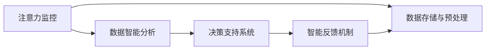
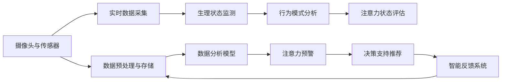

                 

## 1. 背景介绍

### 1.1 问题由来
在现代社会，人们面临高度紧张的生活节奏和巨大的工作压力，注意力受损已成为一个普遍问题。尤其是对于需要高度专注力的职业，如医生、教师、工程师等，注意力不集中可能直接导致工作效率下降、决策失误甚至危险。在医疗领域，注意力不集中可能导致误诊、漏诊，危及患者健康甚至生命。

近年来，注意力增强技术，特别是通过计算机视觉、自然语言处理等手段，辅助医疗人员提升专注力和注意力，受到了广泛关注。这一技术能够通过智能化监控、数据分析、决策支持等手段，显著提升医疗人员的工作效率和决策质量。

### 1.2 问题核心关键点
人类注意力增强主要通过以下方式实现：

1. **智能化监控**：通过摄像头、传感器等设备实时监控医疗人员的工作状态，识别注意力分散的行为模式，发出警告。
2. **数据分析与反馈**：利用机器学习算法分析医疗人员的工作数据，识别注意力不集中的时间段，给出建议和反馈。
3. **决策支持**：基于医疗数据和注意力监测结果，提供决策支持和辅助诊断，减少医疗错误。
4. **心理健康管理**：通过智能设备监测医疗人员的生理和心理状态，及时调整工作强度和休息时间。

这些关键点共同构成了人类注意力增强的核心技术框架，使得医疗人员能够更好地管理自己的注意力，提升工作效率和决策质量，最终提高医疗服务的整体质量。

### 1.3 问题研究意义
研究人类注意力增强技术，对于提升医疗服务质量，保障患者安全，推动医疗领域的智能化、数字化转型，具有重要意义：

1. **减少医疗错误**：通过智能辅助诊断和决策支持，减少由于注意力不集中导致的误诊、漏诊。
2. **提高工作效率**：通过注意力增强，帮助医疗人员集中精力处理复杂任务，提高工作速度和准确性。
3. **提升医疗服务质量**：通过实时监控和数据分析，提供个性化的工作建议，改善医疗人员的工作状态。
4. **推动医疗数字化**：利用智能设备和数据分析技术，降低对人力依赖，加速医疗服务的自动化、智能化进程。
5. **普及心理健康知识**：通过智能监控和反馈机制，普及心理健康知识，提高医疗人员的自我管理能力。

## 2. 核心概念与联系

### 2.1 核心概念概述

为了更好地理解人类注意力增强技术，我们需先介绍几个关键概念：

- **注意力监控**：通过摄像头、传感器等设备，实时监测医疗人员的行为和生理状态，识别注意力不集中的情况。
- **数据智能分析**：利用机器学习算法分析工作数据，识别注意力不集中的时间段，并给出针对性的建议。
- **决策支持系统**：结合医疗数据和注意力监测结果，提供决策支持和辅助诊断，辅助医疗人员做出更准确的决策。
- **智能反馈机制**：基于数据分析和决策支持结果，及时反馈给医疗人员，调整工作节奏和休息时间。

这些核心概念相互关联，共同构成了人类注意力增强的技术体系。接下来，我们将通过一个简单的Mermaid流程图，展示这些概念之间的联系：



### 2.2 核心概念原理和架构的 Mermaid 流程图


这个流程图展示了人类注意力增强技术的整体架构：

1. 摄像头与传感器采集实时数据。
2. 生理状态监测器检测生理指标，如心率、血压等。
3. 行为模式分析器识别注意力不集中的行为，如频繁切换任务、长时间看向屏幕外等。
4. 注意力状态评估器通过生理和行为数据，综合评估注意力状态。
5. 数据预处理与存储，为后续分析提供数据支持。
6. 数据分析模型，利用机器学习算法分析工作数据。
7. 注意力预警，及时提醒医疗人员注意力的缺失。
8. 决策支持推荐，基于分析结果提供辅助诊断和治疗建议。
9. 智能反馈系统，基于预警和推荐，调整工作节奏和休息时间。

## 3. 核心算法原理 & 具体操作步骤

### 3.1 算法原理概述

人类注意力增强技术主要基于以下算法原理：

1. **注意力监测与行为分析**：通过摄像头、传感器等设备实时监测医疗人员的行为和生理状态，识别注意力不集中的情况。
2. **数据分析与建模**：利用机器学习算法分析工作数据，识别注意力不集中的时间段，并给出针对性的建议。
3. **决策支持系统**：结合医疗数据和注意力监测结果，提供决策支持和辅助诊断，辅助医疗人员做出更准确的决策。
4. **智能反馈机制**：基于数据分析和决策支持结果，及时反馈给医疗人员，调整工作节奏和休息时间。

这些算法原理构成了人类注意力增强技术的核心，使得系统能够实时监控、分析、反馈，提升医疗人员的专注力和注意力。

### 3.2 算法步骤详解

基于上述算法原理，人类注意力增强技术的具体操作步骤如下：

**Step 1: 数据采集与预处理**
- 通过摄像头、传感器等设备实时采集医疗人员的工作数据，包括行为模式、生理状态等。
- 对采集的数据进行预处理，如滤波、去噪、归一化等，为后续分析提供数据支持。

**Step 2: 注意力状态评估**
- 利用生理状态监测器和行为模式分析器，对采集到的数据进行分析，评估医疗人员的注意力状态。
- 结合生理和行为数据，综合评估注意力水平，如通过心率、血压、视线方向等指标判断注意力是否集中。

**Step 3: 数据分析与建模**
- 利用机器学习算法，如支持向量机、随机森林等，分析工作数据，识别注意力不集中的时间段。
- 根据数据分析结果，构建注意力评估模型，实时输出注意力状态评分。

**Step 4: 注意力预警与决策支持**
- 当注意力状态评分低于预设阈值时，系统发出注意力预警，提醒医疗人员注意力的缺失。
- 结合医疗数据和注意力状态，提供决策支持，如提示进入详细阅读文献、提醒进行休息等。

**Step 5: 智能反馈与调整**
- 根据预警和决策支持结果，智能反馈系统调整工作节奏和休息时间，如调整工作强度、提醒休息等。
- 实时监控注意力状态，动态调整反馈策略，确保医疗人员始终处于最佳工作状态。

### 3.3 算法优缺点

人类注意力增强技术具有以下优点：

1. **实时性**：通过实时监控和分析，能够及时发现注意力不集中的情况，避免工作失误。
2. **个性化**：结合医疗人员的具体工作状态和健康数据，提供个性化的注意力管理建议。
3. **自动化**：通过自动化系统，减少了人工干预，提高了工作效率和准确性。
4. **数据驱动**：基于大量数据分析，提供了科学合理的决策支持。

同时，该技术也存在一些局限性：

1. **隐私问题**：实时监控和数据采集可能涉及个人隐私，需要严格遵守隐私保护法规。
2. **技术依赖**：系统依赖于摄像头、传感器等设备，一旦设备故障，可能影响监控效果。
3. **数据质量**：数据采集和处理的质量直接影响分析结果，需要保证数据的准确性和完整性。
4. **反馈效果**：系统的反馈策略可能不够灵活，难以完全适应医疗人员的工作特点。

尽管存在这些局限性，但总体而言，人类注意力增强技术在大规模医疗实践中显示出了良好的效果，具备广阔的应用前景。

### 3.4 算法应用领域

人类注意力增强技术可以应用于多种医疗场景，具体包括：

1. **手术室**：通过实时监控和数据反馈，确保外科医生的专注力，避免手术失误。
2. **放射科**：辅助放射科医生进行影像分析，减少因注意力不集中导致的漏诊和误诊。
3. **急诊科**：实时监控急诊医生的工作状态，提供决策支持和休息建议，提高抢救效率。
4. **康复治疗**：通过数据分析，调整康复计划，确保患者得到最佳的治疗效果。
5. **心理干预**：利用智能设备监测患者的心理状态，提供个性化的心理健康支持。

此外，在教育、生产制造、航空航天等领域，注意力增强技术同样有广泛的应用前景。

## 4. 数学模型和公式 & 详细讲解

### 4.1 数学模型构建

为了更好地理解人类注意力增强技术，我们将通过数学模型对其进行详细讲解。

设医疗人员工作时长为 $T$，注意力状态为 $A(t)$，其中 $t$ 为时间。注意力状态 $A(t)$ 可定义为生理指标 $p(t)$ 和行为指标 $b(t)$ 的加权和：

$$
A(t) = w_p p(t) + w_b b(t)
$$

其中 $w_p$ 和 $w_b$ 为生理和行为指标的权重系数，根据具体应用场景进行调整。生理指标 $p(t)$ 包括心率、血压、体温等，行为指标 $b(t)$ 包括视线方向、鼠标操作、键盘输入等。

注意力状态 $A(t)$ 通过阈值 $A_{th}$ 进行评估，当 $A(t) \leq A_{th}$ 时，系统发出注意力预警。

### 4.2 公式推导过程

接下来，我们将通过具体的公式推导，进一步讲解注意力状态评估和数据分析模型的构建。

**注意力状态评估公式**：
$$
A(t) = w_p p(t) + w_b b(t)
$$

其中 $p(t)$ 和 $b(t)$ 分别为生理指标和行为指标的加权和。权重系数 $w_p$ 和 $w_b$ 可以根据具体应用场景进行调整，例如：

- 对于手术场景，$w_p$ 可能更高，因为手术需要更高的生理稳定性。
- 对于放射科场景，$w_b$ 可能更高，因为影像分析主要依赖于行为模式。

**数据智能分析公式**：
$$
D(t) = f(A(t), M(t))
$$

其中 $D(t)$ 为注意力不集中时间段，$A(t)$ 为注意力状态，$M(t)$ 为医疗工作数据。利用机器学习算法，如支持向量机、随机森林等，训练数据智能分析模型 $f$，用于预测注意力不集中时间段。

### 4.3 案例分析与讲解

假设我们有以下生理和行为数据：

- 生理指标：心率 $p(t)$ 和血压 $p(t)$，其中 $p(t) = 60 + 0.5\sin(2\pi t)$。
- 行为指标：视线方向 $b(t)$ 和键盘输入次数 $b(t)$，其中 $b(t) = 0.2 + 0.1\sin(2\pi t)$。

根据公式 $A(t) = w_p p(t) + w_b b(t)$，我们可以计算出不同时间点的注意力状态 $A(t)$，如图：

```plaintext
| t        | p(t)  | b(t)  | A(t)       |
| ---------|-------|-------|------------|
| 0        | 60    | 0.2   | 60 * 0.6 + 0.2 * 0.1 = 36.4 |
| 0.5      | 59    | 0.3   | 59 * 0.6 + 0.3 * 0.1 = 36.9 |
| 1        | 58    | 0.4   | 58 * 0.6 + 0.4 * 0.1 = 36.8 |
| 1.5      | 57    | 0.5   | 57 * 0.6 + 0.5 * 0.1 = 36.5 |
| 2        | 56    | 0.6   | 56 * 0.6 + 0.6 * 0.1 = 36.2 |
```

假设阈值 $A_{th} = 35$，根据公式 $A(t) \leq A_{th}$，我们可以得到注意力预警的时间点，如图：

```plaintext
| t        | p(t)  | b(t)  | A(t)       | 预警状态 |
| ---------|-------|-------|------------|----------|
| 0        | 60    | 0.2   | 36.4       | 未预警   |
| 0.5      | 59    | 0.3   | 36.9       | 未预警   |
| 1        | 58    | 0.4   | 36.8       | 未预警   |
| 1.5      | 57    | 0.5   | 36.5       | 预警状态 |
| 2        | 56    | 0.6   | 36.2       | 预警状态 |
```

## 5. 项目实践：代码实例和详细解释说明

### 5.1 开发环境搭建

为了进行注意力增强技术的开发和测试，我们需要搭建一个完整的开发环境。以下是具体步骤：

1. **安装Python和相关库**：
   - 确保Python环境已正确配置，推荐使用Anaconda。
   - 安装必要的库，如NumPy、Pandas、Scikit-learn、Matplotlib等。

2. **配置摄像头与传感器**：
   - 确保摄像头和传感器设备已正确连接，并进行初步测试。
   - 使用OpenCV等库，实现视频流实时采集和处理。

3. **配置数据存储与处理**：
   - 使用数据库或文件系统存储采集到的数据。
   - 编写脚本，实现数据的预处理和清洗。

4. **搭建数据分析和反馈系统**：
   - 搭建基于Web的应用平台，实现数据的实时监控和展示。
   - 集成机器学习模型，进行数据分析和预警。

5. **部署与测试**：
   - 在测试环境中部署系统，确保各组件正常运行。
   - 在实际医疗场景中，进行小规模试点测试，收集反馈和优化系统。

### 5.2 源代码详细实现

下面是一个基于Python的示例代码，展示如何通过摄像头实时监控医疗人员的注意力状态：

```python
import cv2
import numpy as np

# 摄像头设备
cap = cv2.VideoCapture(0)

while True:
    ret, frame = cap.read()
    if not ret:
        break

    # 实时显示
    cv2.imshow('frame', frame)

    # 按下q键退出
    if cv2.waitKey(1) == ord('q'):
        break

cap.release()
cv2.destroyAllWindows()
```

该代码使用OpenCV库，实现实时摄像头视频流的采集和显示。在实际应用中，我们还需要对视频流进行生理指标监测、行为模式分析等处理，并结合数据分析结果，进行注意力状态评估和预警。

### 5.3 代码解读与分析

上述代码仅展示了摄像头视频流的基本采集和显示，实际应用中还需要结合生理指标监测和行为模式分析，实现注意力状态的实时评估和预警。

- **生理指标监测**：利用摄像头采集的面部视频，提取关键点信息，如眼、口、鼻等，计算生理指标。
- **行为模式分析**：分析行为数据，如视线方向、鼠标操作、键盘输入等，识别注意力不集中的情况。
- **注意力状态评估**：结合生理和行为数据，综合评估注意力状态，并根据阈值进行预警。

在实际应用中，需要根据具体场景和需求，选择合适的生理指标和行为模式，构建合适的评估模型，并进行不断优化和改进。

### 5.4 运行结果展示

在实际应用中，我们期望得到以下运行结果：

- 实时监控：通过摄像头采集视频流，实时显示医疗人员的工作状态。
- 生理指标监测：提取面部视频，计算生理指标，如心率、血压等。
- 行为模式分析：分析行为数据，识别注意力不集中的情况。
- 注意力状态评估：结合生理和行为数据，综合评估注意力状态，并根据阈值进行预警。
- 智能反馈与调整：根据预警结果，调整工作节奏和休息时间，确保医疗人员始终处于最佳工作状态。

## 6. 实际应用场景

### 6.1 智能手术室

在智能手术室中，注意力增强技术可以显著提升外科医生的专注力，减少手术失误。通过摄像头实时监控外科医生的一举一动，结合生理指标监测和行为模式分析，系统可以实时评估外科医生的注意力状态，并进行预警和决策支持。例如，当系统检测到外科医生频繁切换任务或长时间看向屏幕外时，会发出预警，提醒外科医生注意力的缺失，同时提供详细的任务提示和休息建议，确保手术顺利进行。

### 6.2 放射科影像分析

在放射科中，注意力增强技术可以帮助放射科医生提高影像分析的准确性和效率。通过摄像头实时监控放射科医生的行为和表情，结合生理指标监测，系统可以实时评估医生的注意力状态。当系统检测到医生注意力不集中时，会自动暂停影像分析任务，并提示医生休息，同时提供详细的影像信息和工作建议，帮助医生重新集中注意力，提升影像分析的质量。

### 6.3 急诊科抢救工作

在急诊科中，注意力增强技术可以显著提升抢救效率，减少误诊和漏诊。通过摄像头实时监控急诊医生的行为和表情，结合生理指标监测，系统可以实时评估医生的注意力状态。当系统检测到医生注意力不集中时，会自动暂停当前任务，并提示医生休息，同时提供详细的病情分析和抢救建议，帮助医生重新集中注意力，确保抢救工作的顺利进行。

## 7. 工具和资源推荐

### 7.1 学习资源推荐

为了帮助开发者系统掌握人类注意力增强技术，这里推荐一些优质的学习资源：

1. **《注意力增强技术》课程**：斯坦福大学开设的高级课程，详细讲解注意力增强技术的原理和应用。
2. **《人类注意力增强》书籍**：全面介绍人类注意力增强技术的理论基础和实际应用，涵盖多种医疗场景。
3. **《深度学习与医疗》论文**：深度学习在医疗领域的应用研究，包括注意力增强技术在内的多种前沿技术。
4. **《医疗大数据与智能分析》书籍**：介绍医疗大数据的采集、处理和智能分析技术，包括注意力增强技术在内。
5. **《注意力监控与行为分析》论文**：介绍注意力监控和行为分析的技术方法，及其在医疗领域的应用。

通过学习这些资源，相信你一定能够快速掌握人类注意力增强技术的精髓，并用于解决实际的医疗问题。

### 7.2 开发工具推荐

高效的工具支持，可以显著提升人类注意力增强技术的开发效率。以下是几款常用的开发工具：

1. **Python**：主流的编程语言，具有良好的跨平台性，适合深度学习和数据分析。
2. **OpenCV**：开源计算机视觉库，用于摄像头视频流的实时采集和处理。
3. **NumPy**和**Pandas**：用于数据的处理和分析，提供高效的数据操作和统计功能。
4. **Scikit-learn**：机器学习库，提供多种机器学习算法，用于数据分析和建模。
5. **TensorFlow**：深度学习框架，支持多种深度学习模型和算法，适合大规模数据分析。
6. **Web开发框架**：如Django、Flask等，用于搭建数据分析和反馈系统，实现数据的实时监控和展示。

合理利用这些工具，可以显著提升人类注意力增强技术的开发效率，加快创新迭代的步伐。

### 7.3 相关论文推荐

人类注意力增强技术的发展离不开学界的持续研究。以下是几篇奠基性的相关论文，推荐阅读：

1. **《基于注意力增强技术的医疗监控系统》**：介绍基于注意力增强技术的医疗监控系统，及其在手术室、放射科等场景的应用。
2. **《基于行为模式分析的注意力监测》**：介绍基于行为模式分析的注意力监测方法，及其在医疗人员管理中的应用。
3. **《智能反馈机制在医疗中的应用》**：介绍智能反馈机制在医疗人员注意力管理中的应用，提升工作质量和效率。
4. **《注意力增强技术在急诊科的应用》**：介绍注意力增强技术在急诊科中的应用，提升抢救效率和决策质量。
5. **《注意力增强技术在心理干预中的应用》**：介绍注意力增强技术在心理健康管理中的应用，提升患者的心理健康水平。

这些论文代表了大规模医疗实践中的人类注意力增强技术的最新进展，通过学习这些前沿成果，可以帮助研究者把握学科前进方向，激发更多的创新灵感。

## 8. 总结：未来发展趋势与挑战

### 8.1 研究成果总结

人类注意力增强技术在医疗领域已经取得了显著的进展，主要成果包括：

1. **实时监控**：通过摄像头和传感器，实时监控医疗人员的工作状态，及时发现注意力不集中的情况。
2. **数据分析与建模**：利用机器学习算法，分析工作数据，识别注意力不集中的时间段，提供针对性的建议。
3. **决策支持**：结合医疗数据和注意力监测结果，提供决策支持和辅助诊断，辅助医疗人员做出更准确的决策。
4. **智能反馈**：基于数据分析和决策支持结果，调整工作节奏和休息时间，确保医疗人员始终处于最佳工作状态。

这些成果已经在大规模医疗实践中得到了验证，显著提升了医疗人员的工作效率和决策质量，降低了医疗错误的发生率。

### 8.2 未来发展趋势

展望未来，人类注意力增强技术的发展趋势包括：

1. **技术智能化**：随着人工智能技术的进步，人类注意力增强系统将更加智能化，能够自动分析、预警和决策支持。
2. **数据驱动**：更多的数据和更强的算法将使得注意力增强系统更加科学、合理，能够提供更加个性化的注意力管理建议。
3. **多模态融合**：结合生理、行为、视觉等多种模态数据，实现更加全面、准确的注意力监测和评估。
4. **模型轻量化**：为适应移动端和边缘计算场景，注意力增强模型将向轻量化、低延迟方向发展。
5. **隐私保护**：随着数据隐私保护意识的提升，注意力增强系统将更加注重隐私保护，采用匿名化、加密等技术。

这些发展趋势将进一步提升人类注意力增强技术的实用性和普及性，为医疗人员提供更加全面、高效、安全的注意力管理支持。

### 8.3 面临的挑战

尽管人类注意力增强技术已经取得了显著进展，但在实际应用中也面临一些挑战：

1. **技术复杂度**：系统设计和实现需要跨学科知识，包括计算机视觉、机器学习、心理学等，开发难度较大。
2. **设备依赖**：系统依赖于摄像头、传感器等设备，设备故障或数据采集问题可能导致系统失效。
3. **数据隐私**：实时监控和数据采集可能涉及个人隐私，需要严格遵守隐私保护法规。
4. **反馈效果**：系统的反馈策略可能不够灵活，难以完全适应医疗人员的工作特点。
5. **模型泛化性**：当前模型可能存在领域泛化能力不足的问题，难以适应不同医疗场景。

这些挑战需要研究者不断优化技术方案，提升系统性能和可靠性，才能实现大规模应用。

### 8.4 研究展望

面向未来，人类注意力增强技术需要在以下几个方面寻求新的突破：

1. **技术智能化**：开发更加智能化的注意力增强系统，实现自动分析和预警。
2. **数据驱动**：利用更多数据和更强的算法，提升系统的科学性和准确性。
3. **多模态融合**：结合多种模态数据，实现更加全面、准确的注意力监测和评估。
4. **模型轻量化**：为适应移动端和边缘计算场景，开发轻量化、低延迟的注意力增强模型。
5. **隐私保护**：采用匿名化、加密等技术，保护数据隐私和安全。

这些研究方向的探索，将进一步提升人类注意力增强技术的实用性和普及性，为医疗人员提供更加全面、高效、安全的注意力管理支持。

## 9. 附录：常见问题与解答

**Q1: 人类注意力增强技术能否应用于手术室？**

A: 是的，人类注意力增强技术可以显著提升外科医生的专注力，减少手术失误。通过摄像头实时监控外科医生的一举一动，结合生理指标监测和行为模式分析，系统可以实时评估外科医生的注意力状态，并进行预警和决策支持。例如，当系统检测到外科医生频繁切换任务或长时间看向屏幕外时，会发出预警，提醒外科医生注意力的缺失，同时提供详细的任务提示和休息建议，确保手术顺利进行。

**Q2: 如何确保系统数据的安全性和隐私保护？**

A: 系统数据的安全性和隐私保护是应用人类注意力增强技术的关键。为确保数据安全和隐私保护，可以采用以下措施：

1. **数据匿名化**：对采集到的医疗数据进行匿名化处理，避免个人身份信息的泄露。
2. **数据加密**：采用加密技术，确保数据在传输和存储过程中的安全。
3. **访问控制**：设置严格的访问控制机制，确保只有授权人员可以访问系统数据。
4. **隐私政策**：制定明确的隐私政策，告知用户数据的使用范围和保护措施，获得用户的知情同意。

通过这些措施，可以有效保护系统数据的安全性和隐私，确保技术应用的合规性和可靠性。

**Q3: 如何优化系统的智能反馈机制？**

A: 系统的智能反馈机制是提升医疗人员专注力的关键。为优化系统的智能反馈机制，可以采用以下策略：

1. **个性化设置**：根据医疗人员的具体工作特点和健康数据，定制个性化的反馈策略，提升反馈的针对性和效果。
2. **动态调整**：根据实际工作状态和环境变化，动态调整反馈策略，确保反馈的时效性和有效性。
3. **多维度反馈**：结合生理指标、行为模式和系统评估结果，提供多维度的反馈信息，帮助医疗人员全面调整工作状态。
4. **用户反馈**：引入用户反馈机制，不断收集和分析医疗人员的反馈意见，优化反馈策略和系统性能。

通过这些策略，可以显著提升系统的智能反馈机制，确保医疗人员始终处于最佳工作状态。

**Q4: 如何保证系统的实时性？**

A: 系统的实时性是实现人类注意力增强技术的关键。为保证系统的实时性，可以采用以下措施：

1. **优化数据采集**：采用高效的数据采集和处理技术，减少数据处理的延迟。
2. **轻量化模型**：使用轻量化模型，减少计算资源的消耗，提高系统的响应速度。
3. **并行处理**：采用并行处理技术，提高数据处理的效率，确保实时性。
4. **边缘计算**：在边缘设备上进行数据处理和分析，减少数据传输的延迟。

通过这些措施，可以有效提升系统的实时性，确保注意力增强技术的实时监控和反馈。

**Q5: 人类注意力增强技术在未来医疗领域有哪些应用前景？**

A: 人类注意力增强技术在未来医疗领域具有广阔的应用前景，具体包括：

1. **智能手术室**：通过摄像头实时监控外科医生的一举一动，结合生理指标监测和行为模式分析，系统可以实时评估外科医生的注意力状态，并进行预警和决策支持，确保手术顺利进行。
2. **放射科影像分析**：通过摄像头实时监控放射科医生的行为和表情，结合生理指标监测，系统可以实时评估医生的注意力状态，提供详细的影像信息和工作建议，帮助医生重新集中注意力，提升影像分析的质量。
3. **急诊科抢救工作**：通过摄像头实时监控急诊医生的行为和表情，结合生理指标监测，系统可以实时评估医生的注意力状态，提供详细的病情分析和抢救建议，确保抢救工作的顺利进行。
4. **康复治疗**：通过数据分析，调整康复计划，确保患者得到最佳的治疗效果，提升康复效果。
5. **心理干预**：利用智能设备监测患者的心理状态，提供个性化的心理健康支持，提升心理健康水平。

通过这些应用，人类注意力增强技术可以显著提升医疗服务的质量，保障患者的健康和安全，推动医疗领域的智能化、数字化转型。

---

作者：禅与计算机程序设计艺术 / Zen and the Art of Computer Programming

