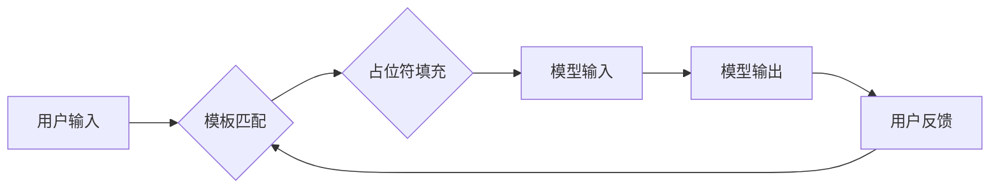

>  * 提示词
>  * 模板
>  * 自然语言处理
>  * 大模型
>  * 应用程序

## 1. 背景介绍

在人工智能领域蓬勃发展的今天，大型语言模型（LLM）已成为研究和应用的热点。这些模型凭借其强大的文本生成、理解和翻译能力，在各个领域展现出巨大的潜力。然而，LLM的应用并非一蹴而就，需要通过精心设计的提示词（Prompt）来引导模型的输出，使其能够准确、有效地完成特定任务。

提示词模板模块作为LLM应用的关键环节，旨在提供一套可复用、可定制的提示词模板，帮助开发者更轻松、更高效地开发基于LLM的应用程序。

## 2. 核心概念与联系

提示词模板模块的核心概念包括：

* **提示词（Prompt）：** 指向大型语言模型的输入指令，引导模型生成特定类型的输出。
* **模板（Template）：**  预定义的提示词结构，包含可填充的占位符，方便开发者根据具体需求进行定制。
* **占位符（Placeholder）：** 模板中的变量，代表待填充的用户输入或模型参数。
* **参数化（Parameterization）：** 通过调整模板中的占位符和参数，实现对模型行为的细粒度控制。

**Mermaid 流程图**



## 3. 核心算法原理 & 具体操作步骤

### 3.1  算法原理概述

提示词模板模块的核心算法原理基于自然语言处理（NLP）技术，主要包括以下几个步骤：

1. **模板库构建：** 收集和整理各种类型的提示词模板，涵盖不同的任务和应用场景。
2. **模板匹配：** 根据用户的输入需求，匹配最合适的模板。
3. **占位符填充：** 将用户的输入信息填充到模板中的占位符中。
4. **模型调用：** 将填充后的提示词作为输入，调用预训练的LLM进行文本生成或其他任务。

### 3.2  算法步骤详解

1. **模板库构建：**

* 首先，需要收集和整理大量的提示词示例，并根据其功能、结构和应用场景进行分类和组织。
* 然后，对每个分类下的提示词进行分析，提取其核心结构和关键元素，构建相应的模板。
* 最后，将所有模板存储在一个可供访问的模板库中，方便开发者进行检索和使用。

2. **模板匹配：**

* 当用户需要使用LLM完成某个任务时，需要首先描述其需求，例如“生成一篇关于人工智能的文章”或“翻译一段英文文本”。
* 系统会根据用户的描述，从模板库中匹配最合适的模板。
* 模板匹配可以采用关键词匹配、语义相似度计算等方法。

3. **占位符填充：**

* 匹配到模板后，系统会识别模板中的占位符，并根据用户的输入信息进行填充。
* 例如，如果模板是“生成一篇关于{主题}的文章”，则用户需要提供“人工智能”作为主题信息，系统会将其填充到模板中的{主题}占位符中。

4. **模型调用：**

* 最后，系统将填充后的提示词作为输入，调用预训练的LLM进行文本生成或其他任务。
* LLM会根据提示词的内容和结构，生成相应的输出文本。

### 3.3  算法优缺点

**优点：**

* **提高效率：** 通过预定义的模板，开发者可以快速构建基于LLM的应用程序，无需从头编写复杂的提示词。
* **增强可复用性：** 模板可以被多个开发者和应用程序共享使用，提高代码复用率。
* **降低门槛：** 模板化设计降低了对自然语言处理技术的理解门槛，方便非专业人士使用LLM。

**缺点：**

* **模板局限性：** 预定义的模板可能无法满足所有用户的需求，需要开发者进行定制化修改。
* **模板维护成本：** 模板库需要不断更新和维护，以适应新的应用场景和LLM模型的演进。

### 3.4  算法应用领域

提示词模板模块在各个领域都有广泛的应用，例如：

* **文本生成：** 生成新闻文章、小说、诗歌、代码等。
* **对话系统：** 构建聊天机器人、虚拟助手等。
* **机器翻译：** 将文本从一种语言翻译成另一种语言。
* **问答系统：** 回答用户提出的问题。
* **代码生成：** 根据自然语言描述生成代码。

## 4. 数学模型和公式 & 详细讲解 & 举例说明

### 4.1  数学模型构建

提示词模板模块的数学模型主要基于概率论和统计学，用于计算模板匹配的概率和占位符填充的可能性。

* **模板匹配概率：** 可以使用余弦相似度或TF-IDF等方法计算用户输入与模板的语义相似度，作为模板匹配的概率。

* **占位符填充概率：** 可以使用词嵌入模型（如Word2Vec或GloVe）计算占位符和候选词之间的语义距离，作为占位符填充的概率。

### 4.2  公式推导过程

**余弦相似度公式：**

$$
\text{相似度} = \frac{\mathbf{A} \cdot \mathbf{B}}{\|\mathbf{A}\| \|\mathbf{B}\| }
$$

其中：

* $\mathbf{A}$ 和 $\mathbf{B}$ 分别代表用户输入和模板的词向量表示。
* $\cdot$ 表示向量点积。
* $\|\mathbf{A}\|$ 和 $\|\mathbf{B}\|$ 分别代表向量 $\mathbf{A}$ 和 $\mathbf{B}$ 的长度。

**举例说明：**

假设用户输入为“写一篇关于人工智能的文章”，模板为“生成一篇关于{主题}的文章”。

* 可以使用词嵌入模型将“人工智能”和“主题”映射到词向量空间。
* 计算这两个词向量的余弦相似度，作为模板匹配的概率。

### 4.3  案例分析与讲解

在实际应用中，可以根据不同的任务和应用场景，设计不同的提示词模板和数学模型。

例如，对于代码生成任务，可以设计一个模板，包含代码语言、函数名称、参数类型等占位符，并使用代码风格分析模型来计算占位符填充的概率。

## 5. 项目实践：代码实例和详细解释说明

### 5.1  开发环境搭建

* Python 3.7+
* TensorFlow 或 PyTorch
* NLTK 或 SpaCy

### 5.2  源代码详细实现

```python
import nltk
from nltk.corpus import stopwords
from nltk.tokenize import word_tokenize

# 下载停用词列表
nltk.download('stopwords')

# 定义模板库
template_library = {
    "generate_article": "生成一篇关于{topic}的文章",
    "translate_text": "将{text}翻译成{target_language}",
}

# 定义占位符填充函数
def fill_placeholder(template, user_input):
    for key, value in user_input.items():
        template = template.replace("{" + key + "}", value)
    return template

# 定义模板匹配函数
def match_template(user_input, template_library):
    best_match = None
    max_similarity = 0
    for template_name, template_text in template_library.items():
        tokens = word_tokenize(user_input)
        stop_words = set(stopwords.words('english'))
        filtered_tokens = [word for word in tokens if word.lower() not in stop_words and word.isalnum()]
        similarity = nltk.cosine_distance(filtered_tokens, word_tokenize(template_text))
        if similarity > max_similarity:
            best_match = template_name
            max_similarity = similarity
    return best_match

# 用户输入示例
user_input = {"topic": "人工智能", "text": "Hello, world!", "target_language": "中文"}

# 模板匹配
best_match = match_template(user_input["topic"], template_library)

# 占位符填充
filled_template = fill_placeholder(template_library[best_match], user_input)

# 模型调用
# ...

```

### 5.3  代码解读与分析

* 代码首先定义了一个模板库，包含了预定义的提示词模板。
* 然后，定义了两个辅助函数：`fill_placeholder` 用于填充模板中的占位符，`match_template` 用于匹配用户输入与模板的相似度。
* 最后，代码演示了如何使用这些函数，根据用户输入匹配模板，填充占位符，并最终调用LLM模型进行文本生成。

### 5.4  运行结果展示

运行代码后，会根据用户输入，生成相应的文本输出。例如，如果用户输入为“人工智能”，则会生成一篇关于人工智能的文章。

## 6. 实际应用场景

### 6.1  聊天机器人

提示词模板模块可以用于构建更智能、更自然的聊天机器人。

例如，可以设计一个模板，用于匹配用户的问句类型，并根据不同的类型生成相应的回复。

### 6.2  虚拟助手

提示词模板模块可以用于构建更强大的虚拟助手，帮助用户完成各种任务，例如：

* 设置提醒
* 预订酒店
* 查询天气预报

### 6.3  内容创作

提示词模板模块可以帮助用户更轻松地进行内容创作，例如：

* 生成新闻文章
* 写作小说
* 创作诗歌

### 6.4  未来应用展望

随着LLM技术的不断发展，提示词模板模块的应用场景将会更加广泛。

例如，可以将其应用于：

* 代码生成
* 数据分析
* 医学诊断

## 7. 工具和资源推荐

### 7.1  学习资源推荐

* **自然语言处理入门书籍：**
    * 《Speech and Language Processing》
    * 《Natural Language Processing with Python》
* **在线课程：**
    * Coursera: Natural Language Processing Specialization
    * edX: Artificial Intelligence

### 7.2  开发工具推荐

* **Hugging Face Transformers:** 提供了各种预训练的LLM模型和工具。
* **OpenAI API:** 提供了访问GPT-3等强大LLM模型的接口。

### 7.3  相关论文推荐

* **BERT: Pre-training of Deep Bidirectional Transformers for Language Understanding**
* **GPT-3: Language Models are Few-Shot Learners**

## 8. 总结：未来发展趋势与挑战

### 8.1  研究成果总结

提示词模板模块作为LLM应用的重要组成部分，取得了显著的成果。

* 提高了LLM应用的效率和可复用性。
* 降低了对自然语言处理技术的理解门槛。
* 推动了LLM在各个领域的应用。

### 8.2  未来发展趋势

未来，提示词模板模块的发展趋势包括：

* **更智能的模板匹配算法：** 利用深度学习等技术，实现更精准、更智能的模板匹配。
* **更灵活的占位符填充机制：** 支持多种数据类型和复杂结构的占位符填充。
* **个性化模板定制：** 基于用户的历史使用记录和偏好，提供个性化的模板推荐和定制服务。

### 8.3  面临的挑战

提示词模板模块也面临着一些挑战：

* **模板库的维护和更新：** 需要不断收集和整理新的模板，以适应新的应用场景和LLM模型的演进。
* **模板的通用性和可移植性：** 需要设计更通用的模板，使其能够适应不同的LLM模型和应用场景。
* **模板的安全性：** 需要防止恶意用户利用模板进行攻击或生成有害内容。

### 8.4  研究展望

未来，我们将继续致力于提示词模板模块的研究，探索更智能、更灵活、更安全的模板设计和应用方法，推动LLM技术