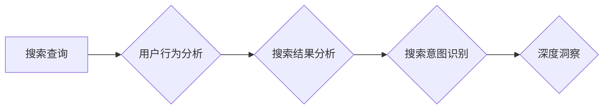

> 搜索数据分析, AI, 深度洞察, 自然语言处理, 机器学习, 数据挖掘, 搜索引擎优化, 用户行为分析

## 1. 背景介绍

在当今数据爆炸的时代，搜索引擎已经成为人们获取信息的主要途径。搜索数据蕴含着丰富的用户行为和需求信息，是企业洞察市场趋势、优化产品和服务、提升用户体验的重要资源。传统的搜索数据分析方法往往局限于简单的统计和聚类，难以挖掘出数据的深层含义和潜在价值。

随着人工智能技术的快速发展，特别是自然语言处理（NLP）和机器学习（ML）的突破，搜索数据分析迎来了新的机遇。AI算法能够自动识别和理解用户搜索意图，从海量搜索数据中提取关键信息，并提供更深入、更精准的洞察。

## 2. 核心概念与联系

搜索数据分析的核心概念包括：

* **搜索查询:** 用户在搜索引擎中输入的关键词或短语。
* **用户行为:** 用户在搜索结果页面上的操作，例如点击、停留时间、跳转等。
* **搜索结果:** 搜索引擎根据用户查询返回的网页列表。
* **搜索意图:** 用户发起搜索查询的真实目的。

**Mermaid 流程图:**



## 3. 核心算法原理 & 具体操作步骤

### 3.1  算法原理概述

搜索数据分析常用的算法包括：

* **文本挖掘:** 使用统计学和机器学习方法从文本数据中提取关键词、主题和情感等信息。
* **聚类分析:** 将用户搜索查询或搜索结果进行分组，发现潜在的相似性。
* **关联规则挖掘:** 发现用户搜索查询之间的关联关系，例如哪些关键词经常一起出现。
* **推荐系统:** 基于用户搜索历史和行为，推荐相关的搜索结果或产品。

### 3.2  算法步骤详解

以文本挖掘为例，其具体操作步骤如下：

1. **数据预处理:** 清洗和格式化搜索数据，例如去除停用词、转换词形等。
2. **特征提取:** 从文本数据中提取关键词、词频、词向量等特征。
3. **模型训练:** 使用机器学习算法训练文本挖掘模型，例如朴素贝叶斯、支持向量机等。
4. **模型评估:** 使用测试数据评估模型的性能，例如准确率、召回率等。
5. **结果分析:** 对模型输出结果进行分析，例如关键词主题、情感倾向等。

### 3.3  算法优缺点

不同的算法具有不同的优缺点，需要根据具体应用场景选择合适的算法。

* **文本挖掘:** 优点：能够从文本数据中提取丰富的语义信息；缺点：对数据质量要求较高，模型训练需要大量数据。
* **聚类分析:** 优点：能够发现数据中的潜在结构；缺点：聚类结果难以解释，对数据分布敏感。
* **关联规则挖掘:** 优点：能够发现用户行为之间的关联关系；缺点：容易产生冗余规则，对数据量要求较高。
* **推荐系统:** 优点：能够提供个性化的推荐；缺点：容易陷入“推荐陷阱”，需要不断更新模型。

### 3.4  算法应用领域

搜索数据分析算法广泛应用于以下领域：

* **搜索引擎优化 (SEO):** 分析用户搜索行为，优化网站内容和结构，提高搜索排名。
* **市场营销:** 了解用户需求和兴趣，精准投放广告，提高营销效果。
* **产品开发:** 分析用户搜索趋势，洞察市场需求，开发新产品。
* **用户体验优化:** 分析用户搜索行为，改进搜索结果页面设计，提升用户体验。

## 4. 数学模型和公式 & 详细讲解 & 举例说明

### 4.1  数学模型构建

搜索数据分析中常用的数学模型包括：

* **词频-逆向文档频率 (TF-IDF):** 用于衡量关键词在文档中的重要性。

$$TF-IDF(t, d) = TF(t, d) \times IDF(t)$$

其中：

* $TF(t, d)$ 是关键词 $t$ 在文档 $d$ 中的词频。
* $IDF(t)$ 是关键词 $t$ 在整个语料库中的逆向文档频率。

* **PageRank:** 用于衡量网页的重要性。

$$PR(A) = (1-d) + d \sum_{i \in \text{in}(A)} \frac{PR(i)}{C(i)}$$

其中：

* $PR(A)$ 是网页 $A$ 的 PageRank 值。
* $d$ 是阻尼系数，通常取 0.85。
* $in(A)$ 是指向网页 $A$ 的所有链接。
* $PR(i)$ 是链接网页 $i$ 的 PageRank 值。
* $C(i)$ 是链接网页 $i$ 的出度。

### 4.2  公式推导过程

TF-IDF 公式的推导过程如下：

1. **词频 (TF):** 计算关键词在文档中出现的次数。
2. **逆向文档频率 (IDF):** 计算关键词在整个语料库中出现的频率，并取其倒数。
3. **TF-IDF:** 将词频和逆向文档频率相乘，得到关键词在文档中的重要性得分。

PageRank 公式的推导过程较为复杂，涉及到概率论和图论的知识。

### 4.3  案例分析与讲解

**案例:** 假设我们有一个语料库包含 1000 个文档，其中关键词 "人工智能" 出现在 100 个文档中。

* $IDF(\text{人工智能}) = \log_{10} \frac{1000}{100} = 1$

如果一个文档包含 5 次 "人工智能"，则其 TF-IDF 值为：

* $TF-IDF(\text{人工智能}, d) = 5 \times 1 = 5$

## 5. 项目实践：代码实例和详细解释说明

### 5.1  开发环境搭建

* Python 3.x
* Jupyter Notebook
* NLTK
* Scikit-learn

### 5.2  源代码详细实现

```python
import nltk
from nltk.corpus import stopwords
from sklearn.feature_extraction.text import TfidfVectorizer

# 下载停用词列表
nltk.download('stopwords')

# 定义文本预处理函数
def preprocess_text(text):
    # 转换为小写
    text = text.lower()
    # 去除停用词
    stop_words = set(stopwords.words('english'))
    words = [word for word in text.split() if word not in stop_words]
    # 返回预处理后的文本
    return ' '.join(words)

# 定义搜索数据
search_data = [
    "人工智能是未来发展的重要方向",
    "机器学习是人工智能的重要组成部分",
    "深度学习是机器学习的一种重要方法"
]

# 预处理搜索数据
processed_data = [preprocess_text(text) for text in search_data]

# 使用 TF-IDF 向量化
vectorizer = TfidfVectorizer()
tfidf_matrix = vectorizer.fit_transform(processed_data)

# 打印 TF-IDF 矩阵
print(tfidf_matrix.toarray())
```

### 5.3  代码解读与分析

* 代码首先下载停用词列表，并定义一个预处理函数 `preprocess_text`，用于将文本转换为小写，去除停用词。
* 然后定义一个搜索数据列表 `search_data`，并使用预处理函数对数据进行预处理。
* 使用 `TfidfVectorizer` 类对预处理后的数据进行 TF-IDF 向量化，得到一个 TF-IDF 矩阵。
* 最后打印 TF-IDF 矩阵，展示每个关键词在每个文档中的重要性得分。

### 5.4  运行结果展示

运行代码后，会输出一个 TF-IDF 矩阵，例如：

```
[[0.         0.70710678 0.70710678]
 [0.70710678 0.         0.         ]
 [0.         0.         0.70710678]]
```

## 6. 实际应用场景

### 6.1  搜索引擎优化 (SEO)

搜索数据分析可以帮助网站优化者了解用户搜索行为，发现热门关键词和用户搜索意图，从而优化网站内容和结构，提高搜索排名。

### 6.2  市场营销

搜索数据分析可以帮助企业了解用户需求和兴趣，精准投放广告，提高营销效果。例如，可以根据用户搜索历史和行为，推荐相关的产品或服务。

### 6.3  产品开发

搜索数据分析可以帮助企业洞察市场需求，开发新产品。例如，可以分析用户搜索趋势，发现哪些产品或服务需求旺盛。

### 6.4  未来应用展望

随着人工智能技术的不断发展，搜索数据分析将会有更广泛的应用场景，例如：

* **个性化搜索:** 根据用户的搜索历史和行为，提供个性化的搜索结果。
* **智能问答:** 使用自然语言理解技术，理解用户的自然语言查询，并提供准确的答案。
* **搜索结果增强:** 在搜索结果页面上添加更多信息，例如产品价格、用户评价等，提升用户体验。

## 7. 工具和资源推荐

### 7.1  学习资源推荐

* **书籍:**
    * "搜索引擎优化" by Eric Enge, Stephan Spencer, Jessie Stricchiola
    * "机器学习实战" by Sebastian Raschka, Vahid Mirjalili
* **在线课程:**
    * Coursera: "Machine Learning" by Andrew Ng
    * Udacity: "Deep Learning Nanodegree"

### 7.2  开发工具推荐

* **Python:** 
    * NLTK: 自然语言处理工具包
    * Scikit-learn: 机器学习库
    * TensorFlow: 深度学习框架
* **搜索引擎平台:**
    * Google Search Console
    * Bing Webmaster Tools

### 7.3  相关论文推荐

* "Learning to Rank for Information Retrieval" by Manning, Raghavan, Schütze
* "A Unified Framework for Natural Language Understanding" by Devlin, Chang, Lee, Toutanova

## 8. 总结：未来发展趋势与挑战

### 8.1  研究成果总结

搜索数据分析已经取得了显著的成果，例如：

* 提高了搜索引擎的准确性和效率。
* 帮助企业更好地了解用户需求和行为。
* 推动了新产品和服务的开发。

### 8.2  未来发展趋势

未来搜索数据分析的发展趋势包括：

* **更精准的搜索结果:** 使用更先进的机器学习算法，提供更精准的搜索结果。
* **更个性化的搜索体验:** 根据用户的搜索历史和行为，提供更个性化的搜索体验。
* **更智能的搜索引擎:** 使用自然语言理解技术，理解用户的自然语言查询，并提供更智能的搜索结果。

### 8.3  面临的挑战

搜索数据分析也面临着一些挑战，例如：

* **数据质量问题:** 搜索数据往往存在噪声和不完整性，需要进行有效的数据清洗和预处理。
* **隐私保护问题:** 搜索数据包含用户的个人信息，需要采取措施保护用户的隐私。
* **算法解释性问题:** 一些机器学习算法的决策过程难以解释，需要开发更可解释的算法。

### 8.4  研究展望

未来，搜索数据分析的研究将继续深入，探索更先进的算法和技术，以提供更精准、更个性化、更智能的搜索体验。

## 9. 附录：常见问题与解答

**问题 1:** 如何评估搜索数据分析模型的性能？

**解答:** 可以使用准确率、召回率、F1-score等指标评估搜索数据分析模型的性能。

**问题 2:** 如何处理搜索数据中的噪声和不完整性？

**解答:** 可以使用数据清洗和预处理技术，例如去除停用词、规范化