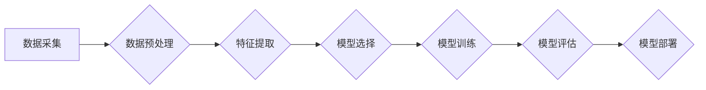

> 时间序列分析,预测,ARIMA,LSTM,机器学习,深度学习,Python

## 1. 背景介绍

时间序列数据是随着时间推移而不断变化的观测数据，它在各个领域都有广泛的应用，例如股票市场预测、天气预报、用户行为分析、工业过程监控等。对时间序列数据的分析可以帮助我们理解数据的内在规律，预测未来的趋势，并做出更明智的决策。

随着数据量的不断增长和计算能力的提升，时间序列分析的研究也取得了长足的进步。传统的统计方法逐渐被机器学习和深度学习等更先进的算法所取代。本文将深入探讨时间序列分析的原理和方法，并通过代码实例讲解，帮助读者理解和应用时间序列分析技术。

## 2. 核心概念与联系

时间序列分析的核心概念包括：

* **时间序列:** 指的是随着时间推移而变化的观测数据，通常以时间戳作为索引。
* **趋势:** 时间序列随时间推移的长期变化趋势，例如增长趋势、下降趋势等。
* **季节性:** 时间序列在特定时间间隔内重复出现的周期性变化，例如每天的流量高峰、每周的销售额波动等。
* **随机波动:** 时间序列中不可预测的随机变化，例如市场波动、意外事件等。

**时间序列分析流程图:**



## 3. 核心算法原理 & 具体操作步骤

### 3.1  算法原理概述

时间序列分析算法主要分为以下几类：

* **经典统计方法:** 包括移动平均法、指数平滑法、ARIMA模型等，这些方法基于时间序列的统计特性进行预测。
* **机器学习方法:** 包括线性回归、支持向量机、决策树等，这些方法利用机器学习算法从数据中学习预测模型。
* **深度学习方法:** 包括LSTM、GRU等，这些方法利用深度神经网络的强大能力进行时间序列预测。

### 3.2  算法步骤详解

以ARIMA模型为例，详细介绍其算法步骤：

1. **数据预处理:** 对时间序列数据进行清洗、缺失值处理、标准化等操作，使其满足模型的输入要求。
2. **模型识别:** 通过分析时间序列的特征，确定ARIMA模型的参数值(p, d, q)。
3. **模型估计:** 使用最大似然估计法或最小二乘法估计模型参数。
4. **模型诊断:** 通过观察残差序列的特性，判断模型的拟合效果。
5. **模型预测:** 利用训练好的模型预测未来时间点的观测值。

### 3.3  算法优缺点

**ARIMA模型的优缺点:**

* **优点:** 
    * 理论基础扎实，易于理解和实现。
    * 对非平稳时间序列进行处理，可以有效地捕捉时间序列的趋势和季节性。
* **缺点:** 
    * 对数据类型要求较高，难以处理复杂的时间序列数据。
    * 模型参数的选择较为困难，需要经验和技巧。

### 3.4  算法应用领域

ARIMA模型广泛应用于以下领域:

* **经济预测:** 预测GDP增长率、物价指数等经济指标。
* **金融预测:** 预测股票价格、汇率等金融市场数据。
* **天气预报:** 预测气温、降雨量等天气要素。
* **工业过程控制:** 预测生产过程中的关键指标，实现过程优化和控制。

## 4. 数学模型和公式 & 详细讲解 & 举例说明

### 4.1  数学模型构建

ARIMA模型的数学模型可以表示为：

$$
\phi(B) (1-B)^d y_t = \theta(B) \epsilon_t
$$

其中:

* $y_t$ 表示时间序列数据在时间t处的观测值。
* $B$ 是后向差分算子，即 $B y_t = y_{t-1}$。
* $\phi(B)$ 和 $\theta(B)$ 分别是AR(p)和MA(q)部分的特征多项式，其中p和q分别为AR和MA模型的阶数。
* $d$ 是差分阶数，用于处理非平稳时间序列。
* $\epsilon_t$ 是白噪声序列，满足均值为0，方差为$\sigma^2$的条件。

### 4.2  公式推导过程

ARIMA模型的推导过程较为复杂，涉及到时间序列的性质、差分算子、特征多项式等概念。

### 4.3  案例分析与讲解

以实际案例分析ARIMA模型的应用，例如预测股票价格。

## 5. 项目实践：代码实例和详细解释说明

### 5.1  开发环境搭建

使用Python语言进行时间序列分析，需要安装以下库:

* pandas: 用于数据处理和分析。
* statsmodels: 用于ARIMA模型的实现。
* matplotlib: 用于数据可视化。

### 5.2  源代码详细实现

```python
import pandas as pd
from statsmodels.tsa.arima.model import ARIMA
from matplotlib import pyplot as plt

# 加载数据
data = pd.read_csv('stock_price.csv', index_col='Date', parse_dates=True)

# 数据可视化
plt.plot(data['Close'])
plt.title('股票价格走势')
plt.xlabel('时间')
plt.ylabel('价格')
plt.show()

# 模型训练
model = ARIMA(data['Close'], order=(5, 1, 0))
model_fit = model.fit()

# 模型预测
forecast = model_fit.predict(start=len(data), end=len(data)+10)

# 结果展示
plt.plot(data['Close'], label='实际价格')
plt.plot(forecast, label='预测价格')
plt.title('股票价格预测')
plt.xlabel('时间')
plt.ylabel('价格')
plt.legend()
plt.show()
```

### 5.3  代码解读与分析

* 首先，加载股票价格数据，并进行可视化展示。
* 然后，使用ARIMA模型进行模型训练，并设置模型参数(p, d, q)。
* 接着，利用训练好的模型进行未来10天的价格预测。
* 最后，将实际价格和预测价格进行对比展示。

### 5.4  运行结果展示

运行代码后，会生成一个图表，展示实际价格和预测价格的走势。

## 6. 实际应用场景

时间序列分析在各个领域都有广泛的应用场景，例如:

* **金融市场预测:** 预测股票价格、汇率、利率等金融市场数据。
* **经济预测:** 预测GDP增长率、物价指数、失业率等经济指标。
* **天气预报:** 预测气温、降雨量、风速等天气要素。
* **工业过程控制:** 预测生产过程中的关键指标，实现过程优化和控制。
* **用户行为分析:** 预测用户购买行为、浏览习惯等，为个性化推荐提供支持。

### 6.4  未来应用展望

随着人工智能技术的不断发展，时间序列分析的应用场景将会更加广泛，例如:

* **智能医疗:** 预测患者的病情变化，辅助医生进行诊断和治疗。
* **智能交通:** 预测交通流量、拥堵情况，优化交通管理。
* **智能家居:** 预测用户的用电、用水等行为，实现智能家居的自动化控制。

## 7. 工具和资源推荐

### 7.1  学习资源推荐

* **书籍:**
    * 《时间序列分析》 - 韦恩·格里菲斯
    * 《预测分析》 - 杰夫·霍尔
* **在线课程:**
    * Coursera: 时间序列分析
    * edX: 预测分析

### 7.2  开发工具推荐

* **Python:** 强大的数据分析和机器学习库，例如pandas、statsmodels、scikit-learn等。
* **R:** 专注于统计分析和可视化，拥有丰富的统计模型和绘图工具。

### 7.3  相关论文推荐

* **ARIMA模型:**
    * Box, G. E. P., & Jenkins, G. M. (1976). Time series analysis: Forecasting and control. Holden-Day.
* **LSTM模型:**
    * Hochreiter, S., & Schmidhuber, J. (1997). Long short-term memory. Neural computation, 9(8), 1735-1780.

## 8. 总结：未来发展趋势与挑战

### 8.1  研究成果总结

时间序列分析研究取得了长足的进步，从传统的统计方法到现代的机器学习和深度学习，不断涌现出新的算法和模型，能够更有效地处理复杂的时间序列数据。

### 8.2  未来发展趋势

* **更强大的深度学习模型:** 探索更深层次的网络结构和训练方法，提高时间序列预测的精度和鲁棒性。
* **结合其他领域知识:** 将时间序列分析与其他领域知识相结合，例如自然语言处理、计算机视觉等，实现更智能的应用。
* **处理非结构化时间序列数据:** 研究处理文本、图像、音频等非结构化时间序列数据的算法和方法。

### 8.3  面临的挑战

* **数据质量问题:** 时间序列数据往往存在缺失值、噪声等问题，需要进行有效的预处理和清洗。
* **模型复杂度:** 深度学习模型的复杂度较高，需要大量的计算资源和训练数据。
* **解释性问题:** 深度学习模型的决策过程难以解释，需要开发更可解释的模型。

### 8.4  研究展望

未来时间序列分析研究将继续朝着更智能、更精准、更可解释的方向发展，为各个领域提供更强大的数据分析和预测能力。

## 9. 附录：常见问题与解答

* **Q1: ARIMA模型的阶数(p, d, q)如何确定?**

* **A1:** ARIMA模型的阶数可以通过模型识别方法确定，例如AIC、BIC等信息准则。

* **Q2: 时间序列数据如何进行预处理?**

* **A2:** 时间序列数据预处理包括缺失值处理、趋势和季节性去除、标准化等操作。

* **Q3: 深度学习模型在时间序列分析中的优势是什么?**

* **A3:** 深度学习模型能够学习更复杂的非线性关系，并具有较强的泛化能力。


作者：禅与计算机程序设计艺术 / Zen and the Art of Computer Programming 
<end_of_turn>