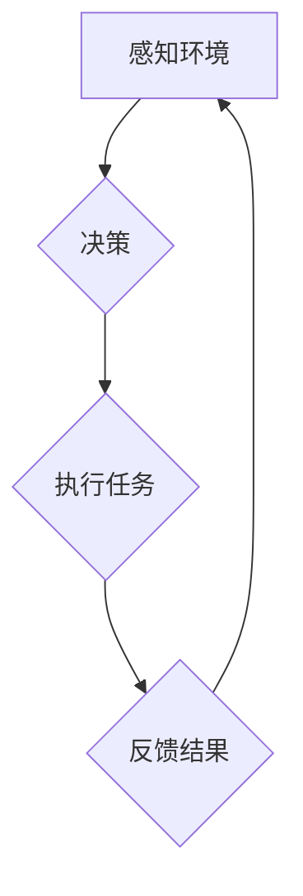

> 智能Agent, 企业流程, 流程自动化, 机器学习, 自然语言处理, 决策优化, 数字转型

## 1. 背景介绍

在当今数字化时代，企业流程的效率和敏捷性至关重要。传统企业流程往往受限于人工操作，效率低下、成本高昂，难以适应快速变化的市场环境。智能Agent作为一种新兴技术，凭借其强大的智能化能力，正在逐渐改变企业流程的运作模式，为企业带来新的机遇和挑战。

智能Agent是一种能够感知环境、自主决策、执行任务的软件实体。它可以模拟人类的智能行为，例如学习、推理、规划和沟通。通过将智能Agent嵌入到企业流程中，可以实现流程的自动化、优化和智能化，从而提高效率、降低成本、提升客户体验。

## 2. 核心概念与联系

**2.1 智能Agent的定义**

智能Agent是一种能够感知环境、自主决策、执行任务的软件实体。它通常具有以下特征：

* **感知能力:** 智能Agent能够从环境中获取信息，例如传感器数据、文本信息、图像信息等。
* **推理能力:** 智能Agent能够对获取的信息进行分析和推理，得出结论和决策。
* **决策能力:** 智能Agent能够根据环境信息和自身目标，做出最佳的决策。
* **执行能力:** 智能Agent能够执行决策，并与环境进行交互。

**2.2 企业流程的定义**

企业流程是指企业内部完成特定任务或目标的一系列步骤和活动。它通常由多个环节组成，每个环节都有特定的职责和流程。

**2.3 智能Agent与企业流程的联系**

智能Agent可以嵌入到企业流程中，扮演不同的角色，例如：

* **流程自动化:** 智能Agent可以自动执行重复性任务，例如数据录入、报表生成、邮件发送等，解放人力资源，提高效率。
* **流程优化:** 智能Agent可以分析流程数据，识别流程中的瓶颈和冗余环节，并提出优化方案，提高流程效率和质量。
* **流程智能化:** 智能Agent可以根据环境变化和用户需求，动态调整流程，实现流程的智能化和个性化。

**2.4 智能Agent在企业流程中的应用场景**

智能Agent在企业流程中的应用场景非常广泛，例如：

* **客户服务:** 智能客服机器人可以自动回答客户常见问题，提供24小时在线服务，提高客户满意度。
* **人力资源:** 智能招聘系统可以自动筛选简历，进行面试安排，提高招聘效率。
* **财务管理:** 智能财务系统可以自动处理账单、生成报表，降低财务成本。
* **供应链管理:** 智能供应链系统可以优化物流配送，提高供应链效率。

**2.5 Mermaid 流程图**



## 3. 核心算法原理 & 具体操作步骤

**3.1 算法原理概述**

智能Agent的决策和执行通常基于以下核心算法：

* **机器学习:** 机器学习算法可以从数据中学习模式和规律，从而提高Agent的决策能力。
* **自然语言处理:** 自然语言处理算法可以使Agent理解和处理人类语言，从而实现与人类的自然交互。
* **决策树:** 决策树是一种树形结构的算法，可以根据条件进行决策，提高Agent的决策效率。
* **强化学习:** 强化学习算法可以使Agent通过试错学习，找到最佳的行动策略，提高Agent的适应能力。

**3.2 算法步骤详解**

智能Agent的决策和执行过程通常包括以下步骤：

1. **感知环境:** Agent通过传感器或其他方式获取环境信息。
2. **信息处理:** Agent对获取的信息进行分析和处理，例如提取关键信息、识别模式等。
3. **决策:** Agent根据环境信息和自身目标，做出最佳的决策。
4. **执行任务:** Agent执行决策，并与环境进行交互。
5. **反馈结果:** Agent接收环境反馈，并根据反馈信息调整决策和执行策略。

**3.3 算法优缺点**

不同的算法具有不同的优缺点，需要根据具体应用场景选择合适的算法。

* **机器学习:** 优点是能够从数据中学习，提高决策能力；缺点是需要大量数据进行训练，训练时间长。
* **自然语言处理:** 优点是能够理解和处理人类语言；缺点是处理复杂语言的难度较大。
* **决策树:** 优点是决策效率高；缺点是难以处理复杂决策问题。
* **强化学习:** 优点是能够通过试错学习，找到最佳策略；缺点是训练过程复杂，需要大量的试错次数。

**3.4 算法应用领域**

智能Agent的算法应用领域非常广泛，例如：

* **机器人控制:** 机器人可以通过机器学习算法学习环境，自主导航和执行任务。
* **金融交易:** 智能交易系统可以通过机器学习算法分析市场数据，进行自动交易。
* **医疗诊断:** 智能诊断系统可以通过机器学习算法分析患者数据，辅助医生进行诊断。

## 4. 数学模型和公式 & 详细讲解 & 举例说明

**4.1 数学模型构建**

智能Agent的决策过程可以建模为一个马尔可夫决策过程 (MDP)。

* **状态空间 (S):** 所有可能的系统状态。
* **动作空间 (A):** 智能Agent可以执行的所有动作。
* **转移概率 (P):** 从一个状态到另一个状态的概率，取决于执行的动作。
* **奖励函数 (R):** 智能Agent在每个状态执行每个动作获得的奖励。
* **折扣因子 (γ):** 未来奖励的权重。

**4.2 公式推导过程**

智能Agent的目标是找到一个策略 (π)，使得在该策略下获得的总奖励最大化。

Bellman方程可以用来计算每个状态的价值函数 (V):

$$V(s) = \max_a \sum_{s'} P(s'|s,a) [R(s,a,s') + \gamma V(s')]$$

其中:

* V(s) 是状态 s 的价值函数。
* a 是智能Agent可以执行的动作。
* s' 是状态 s 执行动作 a 后可能到达的状态。
* R(s,a,s') 是状态 s 执行动作 a 后到达状态 s' 获得的奖励。
* γ 是折扣因子。

**4.3 案例分析与讲解**

例如，一个智能Agent在玩游戏，目标是获得尽可能高的分数。

* 状态空间: 游戏中的所有游戏状态。
* 动作空间: 智能Agent可以执行的所有游戏动作。
* 转移概率: 执行某个动作后到达不同游戏状态的概率。
* 奖励函数: 获得分数的奖励，失去生命值的惩罚。
* 折扣因子: 未来奖励的权重。

智能Agent可以通过Bellman方程计算每个游戏状态的价值函数，并根据价值函数选择最优的动作，从而获得尽可能高的分数。

## 5. 项目实践：代码实例和详细解释说明

**5.1 开发环境搭建**

* Python 3.x
* TensorFlow 或 PyTorch
* Jupyter Notebook

**5.2 源代码详细实现**

```python
import tensorflow as tf

# 定义模型
model = tf.keras.models.Sequential([
    tf.keras.layers.Dense(128, activation='relu', input_shape=(10,)),
    tf.keras.layers.Dense(64, activation='relu'),
    tf.keras.layers.Dense(1)
])

# 编译模型
model.compile(optimizer='adam', loss='mse')

# 训练模型
model.fit(X_train, y_train, epochs=10)

# 评估模型
loss = model.evaluate(X_test, y_test)
print('Loss:', loss)
```

**5.3 代码解读与分析**

* 代码定义了一个简单的深度学习模型，用于预测一个连续值。
* 模型包含三个全连接层，每个层都有激活函数。
* 模型使用Adam优化器和均方误差损失函数进行训练。
* 模型在训练数据上训练10个epochs。
* 模型在测试数据上进行评估，并打印损失值。

**5.4 运行结果展示**

运行结果将显示模型在测试数据上的损失值。

## 6. 实际应用场景

**6.1 智能客服机器人**

智能客服机器人可以利用自然语言处理技术理解客户问题，并提供自动回复，提高客户服务效率。

**6.2 智能招聘系统**

智能招聘系统可以自动筛选简历，根据职位要求匹配合适的候选人，提高招聘效率。

**6.3 智能财务系统**

智能财务系统可以自动处理账单、生成报表，降低财务成本。

**6.4 未来应用展望**

随着人工智能技术的不断发展，智能Agent将在更多领域得到应用，例如：

* **个性化教育:** 智能教育系统可以根据学生的学习情况提供个性化的学习内容和辅导。
* **智慧医疗:** 智能医疗系统可以辅助医生进行诊断、治疗和康复。
* **自动驾驶:** 自动驾驶汽车可以通过智能Agent自主驾驶，提高交通安全和效率。

## 7. 工具和资源推荐

**7.1 学习资源推荐**

* **书籍:**
    * 《人工智能：现代方法》
    * 《深度学习》
* **在线课程:**
    * Coursera: 人工智能
    * edX: 深度学习
* **开源项目:**
    * TensorFlow
    * PyTorch

**7.2 开发工具推荐**

* **Python:** 
* **Jupyter Notebook:** 
* **TensorFlow:** 
* **PyTorch:** 

**7.3 相关论文推荐**

* **Reinforcement Learning: An Introduction**
* **Deep Learning**
* **Natural Language Processing with Deep Learning**

## 8. 总结：未来发展趋势与挑战

**8.1 研究成果总结**

智能Agent技术取得了显著的进展，在多个领域取得了成功应用。

**8.2 未来发展趋势**

* **更强大的计算能力:** 更强大的计算能力将推动智能Agent的算法和模型更加复杂和智能。
* **更丰富的传感器数据:** 更丰富的传感器数据将使智能Agent能够更好地感知环境。
* **更先进的算法:** 更先进的算法将使智能Agent能够解决更复杂的问题。

**8.3 面临的挑战**

* **数据安全和隐私:** 智能Agent的训练和运行需要大量数据，如何保证数据安全和隐私是一个重要挑战。
* **算法可解释性:** 智能Agent的决策过程往往是复杂的，如何提高算法的可解释性是一个重要挑战。
* **伦理问题:** 智能Agent的应用可能会带来一些伦理问题，例如算法偏见、责任归属等，需要认真思考和解决。

**8.4 研究展望**

未来，智能Agent技术将继续发展，并在更多领域发挥重要作用。

## 9. 附录：常见问题与解答

**9.1 智能Agent与机器人有什么区别？**

智能Agent是一个更广义的概念，它可以是软件实体，也可以是机器人。机器人是一种物理实体，它可以感知环境并执行物理动作。

**9.2 如何训练智能Agent？**

智能Agent的训练通常需要大量数据和算法模型。可以使用监督学习、强化学习等算法训练智能Agent。

**9.3 智能Agent的应用场景有哪些？**

智能Agent的应用场景非常广泛，例如：客户服务、招聘、财务管理、自动驾驶等。

作者：禅与计算机程序设计艺术 / Zen and the Art of Computer Programming


<end_of_turn>