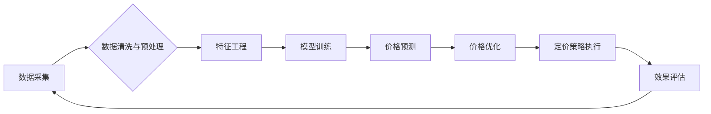

> 智能定价、机器学习、预测模型、价格优化、数据分析、电商平台、市场竞争

## 1. 背景介绍

在当今数据爆炸和竞争激烈的商业环境中，智能定价技术已成为企业优化利润、提升竞争力的关键驱动力。传统定价方法往往依赖经验和主观判断，难以适应市场瞬息万变的动态。而智能定价技术则通过数据分析、机器学习等先进算法，对市场需求、竞争对手、成本结构等因素进行综合分析，从而制定更精准、更有效的定价策略。

随着电商平台的蓬勃发展，智能定价技术在电商领域得到了广泛应用。从亚马逊、阿里巴巴到京东，各大电商平台都纷纷投入巨资研发智能定价系统，以提高商品销售额、提升客户满意度。

## 2. 核心概念与联系

智能定价技术的核心概念包括：

* **数据驱动:** 智能定价技术依赖于海量数据，包括商品信息、市场价格、用户行为、库存水平等。
* **机器学习:** 机器学习算法能够从数据中识别出隐藏的模式和趋势，并根据这些模式预测未来市场需求和价格变化。
* **价格优化:** 智能定价系统通过优化算法，在满足利润目标的前提下，制定最优的定价策略。

**核心概念架构图:**



## 3. 核心算法原理 & 具体操作步骤

### 3.1  算法原理概述

智能定价技术常用的算法包括：

* **线性回归:** 用于预测价格与其他因素之间的线性关系。
* **逻辑回归:** 用于预测价格是否会发生变化。
* **决策树:** 用于根据一系列规则对价格进行分类。
* **支持向量机:** 用于在高维空间中找到最佳的决策边界。
* **神经网络:** 用于学习复杂非线性关系，并进行更精准的预测。

### 3.2  算法步骤详解

**以线性回归为例，智能定价算法的具体操作步骤如下：**

1. **数据收集:** 收集相关数据，包括商品信息、市场价格、用户行为、库存水平等。
2. **数据清洗与预处理:** 对数据进行清洗、转换和标准化，去除噪声和异常值。
3. **特征工程:** 从原始数据中提取特征，例如商品类别、品牌、价格历史、用户评分等。
4. **模型训练:** 使用线性回归算法对训练数据进行拟合，学习价格与其他因素之间的关系。
5. **模型评估:** 使用测试数据评估模型的预测精度，并进行模型调优。
6. **价格预测:** 将模型应用于新的数据，预测未来商品价格。
7. **价格优化:** 根据预测结果，制定最优的定价策略，例如动态调整价格、设置促销活动等。

### 3.3  算法优缺点

**线性回归算法的优缺点:**

* **优点:** 算法简单易懂，计算效率高，易于实现。
* **缺点:** 只能处理线性关系，对非线性关系的预测能力较弱。

### 3.4  算法应用领域

智能定价技术广泛应用于以下领域：

* **电商平台:** 动态调整商品价格，提高销售额和利润。
* **旅游业:** 根据市场需求和竞争对手价格，制定最佳的机票和酒店价格。
* **金融行业:** 动态调整贷款利率和保险费率。
* **能源行业:** 根据供需关系，制定电力和天然气价格。

## 4. 数学模型和公式 & 详细讲解 & 举例说明

### 4.1  数学模型构建

**线性回归模型:**

假设我们想要预测商品价格 `y`，并认为价格与以下因素有关：

* 商品类别 `x1`
* 品牌 `x2`
* 商品质量 `x3`

我们可以构建以下线性回归模型：

$$y = \beta_0 + \beta_1x_1 + \beta_2x_2 + \beta_3x_3 + \epsilon$$

其中：

* `y` 是商品价格
* `x1`, `x2`, `x3` 是商品类别、品牌和质量等特征
* `\beta_0`, `\beta_1`, `\beta_2`, `\beta_3` 是模型参数，需要通过训练数据进行估计
* `\epsilon` 是误差项

### 4.2  公式推导过程

线性回归模型的目标是找到最佳的模型参数，使得模型预测结果与实际价格之间的误差最小。常用的损失函数是均方误差 (MSE):

$$MSE = \frac{1}{n}\sum_{i=1}^{n}(y_i - \hat{y}_i)^2$$

其中：

* `n` 是样本数量
* `y_i` 是第 `i` 个样本的实际价格
* `\hat{y}_i` 是模型预测的第 `i` 个样本的价格

通过最小化 MSE，我们可以找到最佳的模型参数。

### 4.3  案例分析与讲解

假设我们有一个电商平台，想要预测商品价格。我们收集了以下数据：

* 商品类别 (1: 服装, 2: 电子产品)
* 品牌 (1: 知名品牌, 2: 普通品牌)
* 商品质量 (1: 高质量, 2: 中等质量)
* 商品价格

我们可以使用线性回归模型对商品价格进行预测。通过训练模型，我们得到以下参数：

* `\beta_0 = 10`
* `\beta_1 = 5`
* `\beta_2 = 10`
* `\beta_3 = 5`

这意味着，如果商品类别为服装，品牌为知名品牌，质量为高质量，那么其价格预计为 10 + 5 + 10 + 5 = 30。

## 5. 项目实践：代码实例和详细解释说明

### 5.1  开发环境搭建

* Python 3.x
* scikit-learn 库
* pandas 库
* matplotlib 库

### 5.2  源代码详细实现

```python
import pandas as pd
from sklearn.linear_model import LinearRegression
from sklearn.model_selection import train_test_split
import matplotlib.pyplot as plt

# 加载数据
data = pd.read_csv('product_data.csv')

# 提取特征和目标变量
X = data[['category', 'brand', 'quality']]
y = data['price']

# 将数据分为训练集和测试集
X_train, X_test, y_train, y_test = train_test_split(X, y, test_size=0.2, random_state=42)

# 创建线性回归模型
model = LinearRegression()

# 训练模型
model.fit(X_train, y_train)

# 预测测试集价格
y_pred = model.predict(X_test)

# 评估模型性能
from sklearn.metrics import mean_squared_error
mse = mean_squared_error(y_test, y_pred)
print(f'Mean Squared Error: {mse}')

# 可视化预测结果
plt.scatter(y_test, y_pred)
plt.xlabel('Actual Price')
plt.ylabel('Predicted Price')
plt.title('Actual vs Predicted Price')
plt.show()
```

### 5.3  代码解读与分析

* 首先，我们加载数据并提取特征和目标变量。
* 然后，我们将数据分为训练集和测试集，用于训练和评估模型。
* 接下来，我们创建线性回归模型并训练模型。
* 训练完成后，我们使用模型预测测试集价格，并评估模型性能。
* 最后，我们可视化预测结果，观察模型的预测效果。

### 5.4  运行结果展示

运行代码后，会输出模型的 MSE 值，以及实际价格与预测价格之间的散点图。

## 6. 实际应用场景

### 6.1  电商平台

电商平台可以利用智能定价技术，根据商品的销量、库存水平、竞争对手价格等因素，动态调整商品价格，以提高销售额和利润。例如，当商品销量低时，可以适当降低价格以刺激购买；当商品库存充足时，可以适当提高价格以获取更多利润。

### 6.2  旅游业

旅游业可以利用智能定价技术，根据航班的空座率、酒店的入住率、季节性因素等因素，动态调整机票和酒店价格。例如，在旅游旺季，可以提高价格以获取更多利润；在淡季，可以降低价格以吸引更多游客。

### 6.3  金融行业

金融行业可以利用智能定价技术，根据客户的信用评分、贷款期限、市场利率等因素，动态调整贷款利率和保险费率。例如，对于信用评分高的客户，可以提供更低的贷款利率；对于风险较高的客户，可以提高贷款利率或保险费率。

### 6.4  未来应用展望

随着人工智能技术的不断发展，智能定价技术将应用于更多领域，例如：

* **医疗保健:** 根据患者的病情、治疗方案、市场价格等因素，动态调整医疗费用。
* **教育:** 根据学生的学习进度、考试成绩、市场需求等因素，动态调整教育费用。
* **制造业:** 根据原材料价格、生产成本、市场需求等因素，动态调整产品价格。

## 7. 工具和资源推荐

### 7.1  学习资源推荐

* **书籍:**
    * 《机器学习》 by Tom Mitchell
    * 《Python机器学习实战》 by Sebastian Raschka
* **在线课程:**
    * Coursera: Machine Learning
    * edX: Artificial Intelligence

### 7.2  开发工具推荐

* **Python:** 
    * scikit-learn: 机器学习库
    * pandas: 数据分析库
    * matplotlib: 数据可视化库
* **云平台:**
    * AWS: Amazon Web Services
    * Azure: Microsoft Azure
    * GCP: Google Cloud Platform

### 7.3  相关论文推荐

* **《基于深度学习的智能定价模型》**
* **《机器学习在电商平台智能定价中的应用》**
* **《智能定价技术在旅游业中的应用研究》**

## 8. 总结：未来发展趋势与挑战

### 8.1  研究成果总结

智能定价技术已取得了显著的成果，在电商平台、旅游业、金融行业等领域得到了广泛应用。

### 8.2  未来发展趋势

* **更精准的预测:** 利用更先进的机器学习算法，例如深度学习，提高价格预测的精准度。
* **更个性化的定价:** 根据用户的购买历史、浏览记录、偏好等信息，制定更个性化的定价策略。
* **更智能的决策:** 利用人工智能技术，自动分析市场数据，并做出更智能的定价决策。

### 8.3  面临的挑战

* **数据质量:** 智能定价技术依赖于高质量的数据，而现实世界的数据往往存在噪声、缺失值等问题。
* **模型解释性:** 一些机器学习算法的决策过程难以解释，这可能会导致企业难以理解模型的预测结果。
* **伦理问题:** 智能定价技术可能会导致价格歧视等伦理问题，需要谨慎考虑。

### 8.4  研究展望

未来，智能定价技术将继续朝着更精准、更个性化、更智能的方向发展。同时，需要加强对数据质量、模型解释性和伦理问题的研究，确保智能定价技术能够安全、有效地应用于各个领域。

## 9. 附录：常见问题与解答

**Q1: 智能定价技术是否会取代人工定价？**

**A1:** 智能定价技术可以辅助人工定价，提高定价效率和准确性，但不会完全取代人工定价。人工定价仍然需要考虑一些无法用数据量化的因素，例如品牌形象、市场策略等。

**Q2: 如何评估智能定价系统的效果