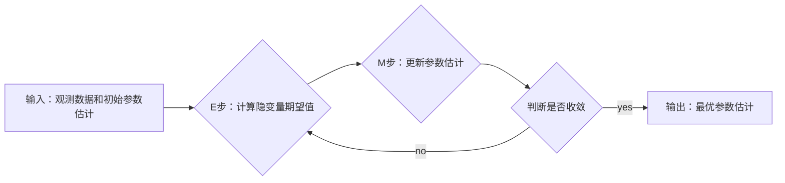

> 期望最大化，EM算法，参数估计，混合高斯模型，聚类分析，代码实例

## 1. 背景介绍

在机器学习领域，参数估计是核心任务之一。许多模型依赖于未知参数的估计，这些参数决定了模型的性能和预测能力。期望最大化（Expectation-Maximization，简称EM算法）是一种迭代算法，用于寻找参数的最大似然估计，特别适用于含有隐变量的模型。

EM算法广泛应用于各种机器学习任务，例如：

* **混合高斯模型（Gaussian Mixture Models，GMM）:** 用于聚类分析，将数据点分配到不同的高斯分布中。
* **隐马尔可夫模型（Hidden Markov Models，HMM）:** 用于序列标注任务，例如语音识别和自然语言处理。
* **因子分析（Factor Analysis）:** 用于降维和特征提取。

## 2. 核心概念与联系

EM算法的核心思想是通过迭代优化两个步骤来最大化似然函数：

* **E步（Expectation Step）：** 计算给定观测数据和当前参数估计下，隐变量的期望值。
* **M步（Maximization Step）：** 根据E步计算出的隐变量期望值，更新参数估计，使得似然函数最大化。

EM算法的流程图如下：



## 3. 核心算法原理 & 具体操作步骤

### 3.1  算法原理概述

EM算法是一种迭代算法，其目标是找到最大似然估计。对于含有隐变量的模型，直接计算似然函数往往非常困难。EM算法通过迭代优化E步和M步来间接地找到最大似然估计。

* **E步：** 计算给定观测数据和当前参数估计下，隐变量的期望值。
* **M步：** 根据E步计算出的隐变量期望值，更新参数估计，使得似然函数最大化。

EM算法的迭代过程不断重复E步和M步，直到似然函数收敛或达到预设的迭代次数。

### 3.2  算法步骤详解

1. **初始化参数：** 选择初始参数估计值。
2. **E步：** 计算给定观测数据和当前参数估计下，隐变量的期望值。
3. **M步：** 根据E步计算出的隐变量期望值，更新参数估计，使得似然函数最大化。
4. **重复步骤2和3：** 直到似然函数收敛或达到预设的迭代次数。

### 3.3  算法优缺点

**优点：**

* 适用于含有隐变量的模型。
* 能够找到局部最优解。

**缺点：**

* 容易陷入局部最优解。
* 收敛速度可能较慢。
* 需要选择合适的初始参数估计值。

### 3.4  算法应用领域

EM算法广泛应用于以下领域：

* **聚类分析:** 混合高斯模型 (GMM) 用于将数据点分配到不同的高斯分布中。
* **语音识别:** 隐马尔可夫模型 (HMM) 用于识别语音信号中的单词。
* **自然语言处理:** 隐马尔可夫模型 (HMM) 用于词性标注和机器翻译。
* **图像处理:** EM算法用于图像分割和目标检测。

## 4. 数学模型和公式 & 详细讲解 & 举例说明

### 4.1  数学模型构建

假设我们有一个数据集 $X = \{x_1, x_2, ..., x_N\}$, 其中每个数据点 $x_i$ 都是一个观测变量。我们假设数据点是由一个隐变量 $Z = \{z_1, z_2, ..., z_N\}$ 决定，其中每个隐变量 $z_i$ 对应一个类别或状态。

我们的目标是找到最优的参数 $\theta$，使得观测数据 $X$ 的似然函数最大化。

### 4.2  公式推导过程

似然函数可以表示为：

$$
P(X|\theta) = \prod_{i=1}^{N} P(x_i|\theta, z_i) P(z_i|\theta)
$$

其中：

* $P(x_i|\theta, z_i)$ 是给定隐变量 $z_i$ 和参数 $\theta$ 下，观测数据 $x_i$ 的概率。
* $P(z_i|\theta)$ 是给定参数 $\theta$ 下，隐变量 $z_i$ 的概率。

由于我们无法直接观测隐变量 $Z$，因此我们需要使用EM算法来间接地估计参数 $\theta$。

EM算法的迭代过程如下：

1. **E步：** 计算给定观测数据 $X$ 和当前参数估计 $\theta^{(t)}$ 下，隐变量 $Z$ 的期望值：

$$
Q(Z|\theta^{(t)}) = E[Z|X, \theta^{(t)}]
$$

2. **M步：** 更新参数估计 $\theta^{(t+1)}$，使得似然函数最大化：

$$
\theta^{(t+1)} = \arg \max_{\theta} Q(Z|\theta)
$$

### 4.3  案例分析与讲解

**混合高斯模型 (GMM) 的 EM 算法应用**

混合高斯模型是一种常用的聚类算法，它假设数据点是由多个高斯分布混合而成。

EM算法可以用于估计混合高斯模型的参数，包括每个高斯分布的均值、协方差和混合权重。

**步骤：**

1. **初始化参数：** 随机初始化每个高斯分布的参数。
2. **E步：** 计算每个数据点属于每个高斯分布的概率。
3. **M步：** 更新每个高斯分布的参数，使得似然函数最大化。
4. **重复步骤2和3：** 直到似然函数收敛。

## 5. 项目实践：代码实例和详细解释说明

### 5.1  开发环境搭建

* Python 3.x
* scikit-learn 库

### 5.2  源代码详细实现

```python
from sklearn.mixture import GaussianMixture

# 生成一些随机数据
X, y_true = make_blobs(n_samples=300, centers=4, cluster_std=0.60, random_state=0)

# 初始化 GMM 模型
gmm = GaussianMixture(n_components=4, random_state=0)

# 训练模型
gmm.fit(X)

# 预测每个数据点的类别
y_pred = gmm.predict(X)

# 可视化结果
plt.scatter(X[:, 0], X[:, 1], c=y_pred, cmap='viridis')
plt.title('Gaussian Mixture Model')
plt.show()
```

### 5.3  代码解读与分析

* `make_blobs()` 函数生成一些随机数据，其中包含四个中心点和不同的数据分布。
* `GaussianMixture()` 函数初始化一个混合高斯模型，指定了四个高斯分布。
* `fit()` 函数训练模型，学习每个高斯分布的参数。
* `predict()` 函数预测每个数据点的类别。
* `plt.scatter()` 函数可视化数据点，根据预测的类别进行颜色区分。

### 5.4  运行结果展示

运行代码后，会生成一个散点图，其中每个数据点根据预测的类别进行颜色区分。

## 6. 实际应用场景

EM算法在许多实际应用场景中发挥着重要作用，例如：

* **客户画像分析:** 将客户数据聚类到不同的客户群体，以便针对不同群体进行个性化营销。
* **推荐系统:** 建立用户兴趣模型，推荐用户可能感兴趣的商品或服务。
* **异常检测:** 识别数据中的异常值，例如欺诈交易或设备故障。

### 6.4  未来应用展望

随着机器学习技术的不断发展，EM算法的应用场景将会更加广泛。例如：

* **深度学习:** EM算法可以用于训练深度神经网络，例如自动编码器和生成对抗网络。
* **强化学习:** EM算法可以用于估计强化学习算法中的价值函数和策略。

## 7. 工具和资源推荐

### 7.1  学习资源推荐

* **书籍:**
    * 《Pattern Recognition and Machine Learning》 by Christopher M. Bishop
    * 《The Elements of Statistical Learning》 by Trevor Hastie, Robert Tibshirani, and Jerome Friedman
* **在线课程:**
    * Coursera: Machine Learning by Andrew Ng
    * edX: Introduction to Machine Learning by Columbia University

### 7.2  开发工具推荐

* **Python:** 广泛用于机器学习开发，拥有丰富的库和工具。
* **scikit-learn:** Python 的机器学习库，包含 EM 算法的实现。
* **TensorFlow/PyTorch:** 深度学习框架，可以用于训练深度神经网络，其中也包含 EM 算法的应用。

### 7.3  相关论文推荐

* **Expectation Maximization Algorithms** by Dempster, Laird, and Rubin (1977)
* **Gaussian Mixture Models** by McLachlan and Krishnan (2008)

## 8. 总结：未来发展趋势与挑战

### 8.1  研究成果总结

EM算法是一种经典的机器学习算法，在许多领域取得了成功应用。它能够有效地处理含有隐变量的模型，并找到局部最优解。

### 8.2  未来发展趋势

* **加速 EM 算法:** 研究更快的 EM 算法，例如变分 EM 算法和交替最小化算法。
* **扩展 EM 算法:** 将 EM 算法应用于更复杂的模型，例如深度神经网络和强化学习。
* **提高 EM 算法的鲁棒性:** 研究更鲁棒的 EM 算法，能够更好地处理噪声数据和缺失数据。

### 8.3  面临的挑战

* **局部最优解:** EM 算法容易陷入局部最优解，难以找到全局最优解。
* **收敛速度:** EM 算法的收敛速度可能较慢，尤其是在高维数据情况下。
* **参数选择:** EM 算法需要选择合适的初始参数估计值和迭代次数。

### 8.4  研究展望

未来，EM 算法的研究将继续朝着更快速、更鲁棒、更有效的方向发展。


## 9. 附录：常见问题与解答

**1. EM 算法为什么容易陷入局部最优解？**

EM 算法的迭代过程依赖于当前参数估计值，如果初始参数估计值不佳，则可能导致算法陷入局部最优解。

**2. 如何提高 EM 算法的收敛速度？**

可以使用一些技巧来提高 EM 算法的收敛速度，例如：

* 选择合适的初始参数估计值。
* 使用变分 EM 算法或交替最小化算法。
* 减少迭代次数。

**3. 如何选择 EM 算法的参数？**

EM 算法的参数包括：

* **隐变量的个数:** 可以通过交叉验证或信息准则来选择。
* **迭代次数:** 可以根据似然函数的收敛情况来选择。
* **初始参数估计值:** 可以随机初始化或使用其他方法进行初始化。


作者：禅与计算机程序设计艺术 / Zen and the Art of Computer Programming 
<end_of_turn>