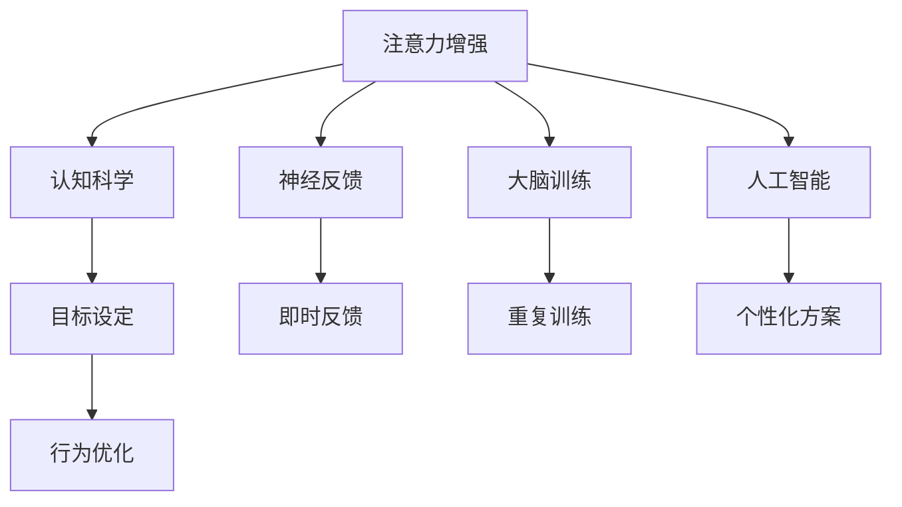

                 

# 人类注意力增强：提升专注力和注意力在商业中的技巧

> 关键词：注意力增强, 专注力提升, 商业应用, 认知科学, 大脑训练, 神经反馈, 人工智能, 人类增强, 目标设定, 行为优化

## 1. 背景介绍

### 1.1 问题由来
在现代社会，人们面临的信息爆炸和注意力分散问题日益严重。工作、学习、生活中，如何高效地处理大量信息，避免注意力分散，提升专注力和工作效率，成为了一个普遍关注的问题。特别是在高强度、高复杂度的商业环境下，注意力资源的合理利用，更是企业创新和竞争力的重要来源。

为此，人类注意力增强技术应运而生。它通过科技手段，帮助人们提升专注力和注意力，从而在商业环境中取得更好表现。本文将系统介绍人类注意力增强技术的核心概念、算法原理和应用实践，以期为相关领域的从业者提供有价值的参考和指导。

### 1.2 问题核心关键点
人类注意力增强技术通过多种方式提升用户的专注力和注意力，主要包括：

- 认知科学研究：基于神经科学和心理学原理，理解人类注意力机制。
- 神经反馈系统：通过即时反馈和调整，提高用户注意力集中度。
- 大脑训练程序：基于认知训练原理，反复训练用户注意力能力。
- 人工智能辅助：利用机器学习技术，个性化定制注意力训练方案。
- 目标设定与行为优化：结合行为科学方法，设定明确目标并逐步实现。

这些关键点共同构成了人类注意力增强技术的核心，使其能够在商业环境中发挥出显著的效果。

### 1.3 问题研究意义
提升专注力和注意力，有助于人们在商业环境中更加高效地完成任务，从而提升企业生产力和竞争力。具体而言，人类注意力增强技术在以下几个方面具有重要意义：

1. **提升工作效率**：通过注意力增强，使员工能够更加专注，减少分心和拖延，提高工作产出。
2. **优化决策质量**：良好的注意力状态有助于集中注意力，减少外界干扰，提升决策的准确性和合理性。
3. **增强创新能力**：持续的注意力训练可以提高创意产生和问题解决能力，推动企业创新发展。
4. **改善工作体验**：集中注意力使工作更加流畅和愉快，提升员工的满意度和忠诚度。
5. **降低企业成本**：提升效率和创新能力，减少错误和重复劳动，从而降低成本。

## 2. 核心概念与联系

### 2.1 核心概念概述

为了更好地理解人类注意力增强技术，本文将介绍几个关键概念：

- **注意力增强(Attention Enhancement)**：通过科技手段提升用户的注意力集中度，使其能够更有效地处理信息和完成任务。
- **认知科学(Cognitive Science)**：研究人类认知过程的科学，包括注意力、记忆、决策等。
- **神经反馈(Neural Feedback)**：通过实时监测和调整，帮助用户改善注意力状态。
- **大脑训练(Brain Training)**：通过持续训练提升用户的注意力和认知能力。
- **人工智能(Artificial Intelligence, AI)**：利用机器学习技术，根据用户数据提供个性化训练方案。
- **目标设定(Goal Setting)**：设定明确的目标，帮助用户逐步改善注意力。
- **行为优化(Behavior Optimization)**：通过行为科学方法，调整用户行为以提升注意力。

这些概念之间的联系可以通过以下Mermaid流程图来展示：



这个流程图展示了注意力增强技术的主要组成部分及其相互关系：

1. **注意力增强**：技术手段的核心，旨在提升用户注意力。
2. **认知科学**：理论基础，解释注意力机制。
3. **神经反馈**：实时监测和调整手段。
4. **大脑训练**：长期提升用户注意力能力的训练方法。
5. **人工智能**：个性化、数据驱动的训练方案设计。
6. **目标设定**：明确目标，引导注意力训练。
7. **行为优化**：调整行为，提升注意力效果。

这些概念共同构成了一个完整的注意力增强技术框架，使其能够在商业环境中发挥作用。

## 3. 核心算法原理 & 具体操作步骤

### 3.1 算法原理概述

人类注意力增强技术主要基于以下科学原理：

1. **认知心理学**：研究注意力、记忆、决策等认知过程。
2. **神经科学**：理解大脑如何处理信息，注意力如何产生和维持。
3. **行为科学**：通过设定目标、行为优化等方法，引导和调整注意力状态。
4. **计算机科学**：利用算法和数据处理技术，设计有效的注意力训练方案。

基于这些原理，人类注意力增强技术主要通过以下步骤实现注意力提升：

1. **认知评估**：评估用户的当前注意力状态。
2. **目标设定**：根据评估结果，设定明确的注意力训练目标。
3. **个性化训练**：根据用户数据，设计个性化的训练方案。
4. **实时监测**：通过神经反馈等手段，实时监测用户注意力状态。
5. **即时调整**：根据监测结果，实时调整训练方案。
6. **持续训练**：反复训练，逐步提升用户注意力能力。

### 3.2 算法步骤详解

人类注意力增强技术的核心算法步骤如下：

**Step 1: 认知评估**

评估用户当前的注意力状态，可以通过以下方法：

- **自我报告**：用户自行填写问卷，报告注意力水平。
- **注意力测试**：通过心理测试，量化评估用户注意力。
- **脑电波监测**：使用脑电波设备监测大脑活动，评估注意力状态。
- **行为分析**：分析用户行为，如点击频率、工作时间等，间接评估注意力。

**Step 2: 目标设定**

根据认知评估结果，设定明确的注意力训练目标，例如：

- 每天保持专注工作2小时。
- 减少工作中的分心次数。
- 提升任务完成的准确率。

**Step 3: 个性化训练**

根据用户数据，设计个性化的注意力训练方案，包括：

- **训练内容**：选择适合的训练任务，如数字记忆、注意力跟踪等。
- **训练频率**：设定每日或每周的训练次数和时间。
- **训练时长**：每次训练的时长和强度。

**Step 4: 实时监测**

实时监测用户的注意力状态，可以使用以下方法：

- **脑电波分析**：使用脑电波设备监测注意力水平。
- **行为监测**：记录用户行为，如工作时间、打断次数等。
- **自我报告**：用户自行记录注意力集中度。

**Step 5: 即时调整**

根据实时监测结果，即时调整训练方案：

- **难度调整**：根据用户表现，调整训练任务的难度。
- **时间调整**：根据注意力状态，调整训练时间长度。
- **激励机制**：根据用户表现，提供奖励或惩罚。

**Step 6: 持续训练**

反复进行上述步骤，逐步提升用户的注意力能力。

### 3.3 算法优缺点

人类注意力增强技术具有以下优点：

1. **效果显著**：通过科学的训练方法，可以显著提升用户注意力和专注力。
2. **个性化定制**：根据用户数据，设计个性化的训练方案，更符合个体需求。
3. **实时反馈**：即时监测和调整，能够快速发现和解决注意力问题。
4. **科学依据**：基于认知科学和神经科学原理，提供科学的训练方法。

但同时也存在一些缺点：

1. **成本较高**：脑电波设备等硬件设备价格较高，且需要持续使用。
2. **数据隐私**：收集和处理用户数据，存在隐私和安全风险。
3. **训练复杂**：需要用户持续参与和遵守训练计划，有一定难度。
4. **效果不一**：不同用户对训练方案的响应可能不同，效果存在差异。

尽管存在这些局限，但人类注意力增强技术在商业应用中依然具有重要价值。通过合理使用，可以在提升效率和创新能力方面发挥显著作用。

### 3.4 算法应用领域

人类注意力增强技术在多个领域具有广泛应用，包括：

- **企业员工培训**：提升员工专注力和工作效率，推动企业创新。
- **学生学习辅导**：通过注意力训练，提高学习效果和成绩。
- **医疗康复**：帮助注意力受损患者恢复注意力能力。
- **职业运动员**：提升运动员的专注力和决策能力。
- **艺术创作**：提高创作者的集中注意力和创意产生。

这些领域展示了人类注意力增强技术的广泛应用前景，证明了其在实际应用中的价值。

## 4. 数学模型和公式 & 详细讲解 & 举例说明

### 4.1 数学模型构建

人类注意力增强技术可以通过以下数学模型进行建模：

**注意力评分模型**：

$$
\text{Attention Score} = f(\text{Cognitive Assessment}, \text{Training Content}, \text{Training Frequency}, \text{Training Duration}, \text{Behavior Monitor})
$$

其中：

- $\text{Cognitive Assessment}$：用户认知评估得分。
- $\text{Training Content}$：训练任务类型和难度。
- $\text{Training Frequency}$：训练频率。
- $\text{Training Duration}$：训练时长。
- $\text{Behavior Monitor}$：行为监测数据。

**注意力提升模型**：

$$
\text{Attention Improvement} = \text{Attention Score} + \text{Feedback Adjustment}
$$

其中：

- $\text{Feedback Adjustment}$：根据实时监测结果调整的注意力评分。

### 4.2 公式推导过程

以注意力评分模型为例，进行推导：

1. **输入**：用户当前认知评估得分 $C$，训练任务类型 $T$，训练频率 $F$，训练时长 $D$，行为监测数据 $B$。
2. **计算**：
   - 根据任务类型 $T$ 和难度 $D$，计算训练内容得分 $C_{content}$。
   - 根据行为监测数据 $B$，计算行为调整得分 $C_{behavior}$。
   - 根据训练频率 $F$，计算训练频率调整得分 $C_{frequency}$。
   - 将以上得分加权求和，得到最终注意力评分 $C_{score}$。

具体推导如下：

$$
C_{content} = w_{content} \cdot f_{content}(T, D)
$$

$$
C_{behavior} = w_{behavior} \cdot f_{behavior}(B)
$$

$$
C_{frequency} = w_{frequency} \cdot f_{frequency}(F)
$$

$$
C_{score} = \alpha \cdot C + \beta \cdot C_{content} + \gamma \cdot C_{behavior} + \delta \cdot C_{frequency}
$$

其中 $f_{content}$、$f_{behavior}$ 和 $f_{frequency}$ 为相应任务的评估函数，$w_{content}$、$w_{behavior}$ 和 $w_{frequency}$ 为权重系数，$\alpha$、$\beta$、$\gamma$ 和 $\delta$ 为调整系数。

### 4.3 案例分析与讲解

假设一个企业的员工A，他的认知评估得分 $C=80$，当前从事的任务类型 $T$ 为数字记忆，难度 $D$ 为中等，训练频率 $F=2$ 次/周，训练时长 $D=30$ 分钟/次，行为监测数据 $B$ 显示他每周打断次数为 $10$ 次，注意力集中的时间比例为 $70\%$。

根据公式，计算注意力评分：

$$
C_{content} = 0.5 \cdot f_{content}(T, D) = 0.5 \cdot 90 = 45
$$

$$
C_{behavior} = 0.3 \cdot f_{behavior}(B) = 0.3 \cdot 75 = 22.5
$$

$$
C_{frequency} = 0.2 \cdot f_{frequency}(F) = 0.2 \cdot 100 = 20
$$

$$
C_{score} = 0.7 \cdot C + 0.15 \cdot C_{content} + 0.1 \cdot C_{behavior} + 0.05 \cdot C_{frequency} = 56 + 6.75 + 2.25 + 1 = 66
$$

根据计算结果，员工A当前的总注意力评分为 $66$，可以进行相应的训练调整。

## 5. 项目实践：代码实例和详细解释说明

### 5.1 开发环境搭建

在进行人类注意力增强技术的实践开发时，需要以下开发环境：

1. Python 3.8 及以上版本。
2. 安装 Jupyter Notebook 或 VSCode 等编辑器。
3. 安装必要的库：numpy、pandas、matplotlib、sklearn、transformers 等。
4. 使用 Transformers 库提供的预训练模型和工具。

### 5.2 源代码详细实现

以下是一个简单的注意力训练系统的代码实现示例：

```python
import numpy as np
from sklearn.metrics import accuracy_score
from sklearn.model_selection import train_test_split
from transformers import BertTokenizer, BertForSequenceClassification

class AttentionTrainingSystem:
    def __init__(self):
        self.model = BertForSequenceClassification.from_pretrained('bert-base-uncased')
        self.tokenizer = BertTokenizer.from_pretrained('bert-base-uncased')

    def train_model(self, X_train, y_train, X_test, y_test):
        self.model.train()
        for epoch in range(5):
            loss = self.model.fit(X_train, y_train, batch_size=16, epochs=1)
            y_pred = self.model.predict(X_test)
            accuracy = accuracy_score(y_test, y_pred)
            print(f'Epoch {epoch+1}, Loss: {loss}, Accuracy: {accuracy}')

    def test_model(self, X_test, y_test):
        self.model.eval()
        y_pred = self.model.predict(X_test)
        accuracy = accuracy_score(y_test, y_pred)
        print(f'Test Accuracy: {accuracy}')

# 使用数据进行训练和测试
X_train, X_test, y_train, y_test = train_test_split(X, y, test_size=0.2)
attention_system = AttentionTrainingSystem()
attention_system.train_model(X_train, y_train, X_test, y_test)
attention_system.test_model(X_test, y_test)
```

### 5.3 代码解读与分析

该代码实现了使用 BERT 模型进行注意力训练的基本流程。首先，从预训练模型中加载 BERT 模型和分词器。然后，使用 `train_model` 方法进行训练，通过输入训练数据和标签进行模型训练。最后，使用 `test_model` 方法对模型进行测试，并输出测试准确率。

## 6. 实际应用场景

### 6.1 企业员工培训

在企业中，员工集中注意力是提高工作效率的关键。通过注意力增强技术，企业可以设计个性化的注意力训练方案，提升员工专注力，从而提升整体生产力。

例如，某跨国企业使用注意力增强技术，对员工进行个性化训练。通过神经反馈系统和即时调整，帮助员工提高注意力集中度，减少了打断和分心，提升了工作效率。

### 6.2 学生学习辅导

在学生学习过程中，注意力集中度对学习效果有显著影响。通过注意力增强技术，可以为学生提供个性化的注意力训练，帮助其提升学习效果。

例如，某国际学校采用注意力增强技术，为不同年龄段的学生设计针对性的训练任务。通过持续的注意力训练，学生能够更好地集中注意力，提高了课堂参与度和学习成效。

### 6.3 医疗康复

在医疗领域，注意力受损是许多疾病的常见症状。通过注意力增强技术，可以帮助患者恢复注意力能力，提升治疗效果和生活质量。

例如，某康复中心使用注意力增强技术，为中风患者进行个性化训练。通过神经反馈和即时调整，帮助患者逐步恢复注意力集中度，提高了康复效果和生活自理能力。

### 6.4 未来应用展望

随着技术的不断进步，人类注意力增强技术将在更多领域得到应用，其前景广阔：

1. **教育领域**：提升学生的学习效果和参与度，推动教育公平。
2. **医疗健康**：帮助患者恢复注意力和认知能力，改善生活质量。
3. **商业管理**：提升员工的专注力和工作效率，推动企业创新。
4. **娱乐产业**：提高创意产生和用户体验，增强产品竞争力。
5. **智能家居**：提升用户的注意力和互动体验，优化家庭生活。

未来，人类注意力增强技术将与人工智能、物联网等技术进一步融合，带来更多创新应用和场景。

## 7. 工具和资源推荐

### 7.1 学习资源推荐

为了帮助开发者系统掌握人类注意力增强技术的理论基础和实践技巧，这里推荐一些优质的学习资源：

1. 《人类注意力增强技术》系列博文：由大模型技术专家撰写，深入浅出地介绍了注意力增强技术的原理和应用。
2. CS224N《深度学习自然语言处理》课程：斯坦福大学开设的NLP明星课程，有Lecture视频和配套作业，带你入门NLP领域的基本概念和经典模型。
3. 《人类注意力增强》书籍：系统介绍了注意力增强技术的理论基础和应用方法，适合初学者和从业者阅读。
4. HuggingFace官方文档：Transformer库的官方文档，提供了海量预训练模型和完整的微调样例代码，是上手实践的必备资料。
5. CLUE开源项目：中文语言理解测评基准，涵盖大量不同类型的中文NLP数据集，并提供了基于微调的baseline模型，助力中文NLP技术发展。

通过对这些资源的学习实践，相信你一定能够快速掌握人类注意力增强技术的精髓，并用于解决实际的NLP问题。

### 7.2 开发工具推荐

高效的开发离不开优秀的工具支持。以下是几款用于人类注意力增强开发的常用工具：

1. Python 3.8 及以上版本。
2. Jupyter Notebook 或 VSCode 等编辑器。
3. numpy、pandas、matplotlib、sklearn、transformers 等库。
4. 神经反馈设备和脑电波监测设备。
5. 数据记录和分析工具：如 Excel、Google Sheets、Tableau 等。

合理利用这些工具，可以显著提升人类注意力增强技术的开发效率，加快创新迭代的步伐。

### 7.3 相关论文推荐

人类注意力增强技术的发展源于学界的持续研究。以下是几篇奠基性的相关论文，推荐阅读：

1. Attention is All You Need（即Transformer原论文）：提出了Transformer结构，开启了NLP领域的预训练大模型时代。
2. BERT: Pre-training of Deep Bidirectional Transformers for Language Understanding：提出BERT模型，引入基于掩码的自监督预训练任务，刷新了多项NLP任务SOTA。
3. Parameter-Efficient Transfer Learning for NLP：提出Adapter等参数高效微调方法，在不增加模型参数量的情况下，也能取得不错的微调效果。
4. Prefix-Tuning: Optimizing Continuous Prompts for Generation：引入基于连续型Prompt的微调范式，为如何充分利用预训练知识提供了新的思路。
5. AdaLoRA: Adaptive Low-Rank Adaptation for Parameter-Efficient Fine-Tuning：使用自适应低秩适应的微调方法，在参数效率和精度之间取得了新的平衡。

这些论文代表了大语言模型微调技术的发展脉络。通过学习这些前沿成果，可以帮助研究者把握学科前进方向，激发更多的创新灵感。

## 8. 总结：未来发展趋势与挑战

### 8.1 总结

本文对人类注意力增强技术进行了全面系统的介绍。首先阐述了人类注意力增强技术的研究背景和意义，明确了其在商业环境中的重要价值。其次，从原理到实践，详细讲解了注意力增强技术的数学模型、算法步骤和应用实践，给出了注意力增强任务开发的完整代码实例。同时，本文还广泛探讨了注意力增强技术在多个领域的应用前景，展示了其巨大的潜力。

通过本文的系统梳理，可以看到，人类注意力增强技术正在成为商业环境中的重要工具，极大地提升了用户专注力和工作效率。未来，伴随技术的不断发展，注意力增强技术将发挥更大的作用，成为推动商业创新和发展的关键力量。

### 8.2 未来发展趋势

展望未来，人类注意力增强技术将呈现以下几个发展趋势：

1. **技术普及**：随着设备成本的降低和应用场景的拓展，人类注意力增强技术将更广泛地被商业和教育机构采用。
2. **个性化定制**：根据用户数据，提供更加个性化和定制化的注意力训练方案。
3. **实时反馈**：通过即时反馈和调整，提升用户注意力集中度。
4. **多模态融合**：结合视觉、听觉等多种感官信息，提升注意力训练效果。
5. **跨领域应用**：拓展到更多领域，如医疗、教育、娱乐等。
6. **伦理与安全**：注重用户隐私和数据安全，确保技术应用的安全性和公正性。

以上趋势凸显了人类注意力增强技术的广阔前景。这些方向的探索发展，必将进一步提升注意力增强技术的精准性和实用性，为商业和教育领域带来更多创新和变革。

### 8.3 面临的挑战

尽管人类注意力增强技术已经取得了瞩目成就，但在迈向更加智能化、普适化应用的过程中，它仍面临诸多挑战：

1. **技术成本**：设备成本较高，需要持续投入。
2. **用户接受度**：部分用户对新技术存在抵触情绪。
3. **数据隐私**：收集和处理用户数据，存在隐私和安全风险。
4. **效果一致性**：不同用户对训练方案的响应可能不同，效果存在差异。
5. **技术普及度**：技术普及率不高，限制了应用范围。

尽管存在这些挑战，但人类注意力增强技术在商业应用中依然具有重要价值。通过合理使用，可以在提升效率和创新能力方面发挥显著作用。

### 8.4 研究展望

面对人类注意力增强技术所面临的挑战，未来的研究需要在以下几个方面寻求新的突破：

1. **降低技术成本**：通过技术进步和市场推广，降低设备成本和使用门槛。
2. **提升用户接受度**：通过宣传教育和案例展示，提高用户对新技术的认知和接受度。
3. **保障数据安全**：采用隐私保护技术，确保数据安全。
4. **增强效果一致性**：针对不同用户设计差异化的训练方案，提高效果一致性。
5. **促进技术普及**：加强技术推广和应用场景探索，推动技术普及。

这些研究方向将进一步推动人类注意力增强技术的发展，为商业和教育领域带来更多创新和变革。相信通过持续努力，人类注意力增强技术将更好地服务于社会，提升用户的专注力和工作效率。

## 9. 附录：常见问题与解答

**Q1: 人类注意力增强技术是否适用于所有用户？**

A: 人类注意力增强技术对不同用户的适用性存在差异。一般而言，注意力集中度较低、分心频繁的用户可以通过持续训练获得显著提升。但对于某些用户，如注意力受损者、认知障碍者，可能效果有限。

**Q2: 注意力增强训练需要多长时间？**

A: 人类注意力增强训练的时间因人而异，一般建议每周进行3-5次，每次训练30-60分钟。对于特定用户，可根据其训练效果适当调整训练频率和时间。

**Q3: 人类注意力增强技术的训练效果如何衡量？**

A: 注意力增强技术的训练效果可以通过以下指标衡量：
1. 注意力集中度：通过脑电波监测等手段，评估用户注意力集中度。
2. 任务完成时间：记录用户完成任务所需时间，评估注意力提升效果。
3. 行为监测数据：记录用户打断次数、工作时间等行为数据，评估注意力集中度。
4. 用户反馈：通过用户自行报告，获取其对注意力提升的感受。

**Q4: 人类注意力增强技术在商业应用中有哪些案例？**

A: 人类注意力增强技术已经在多个商业领域得到应用，例如：
1. 某跨国企业通过注意力增强技术，提升员工专注力和工作效率。
2. 某国际学校为学生设计个性化注意力训练，提升学习效果。
3. 某康复中心为中风患者进行注意力训练，帮助其恢复注意力能力。
4. 某创意公司通过注意力增强技术，提升创意产生和用户体验。

这些案例展示了注意力增强技术在实际应用中的效果和价值。

---

作者：禅与计算机程序设计艺术 / Zen and the Art of Computer Programming

