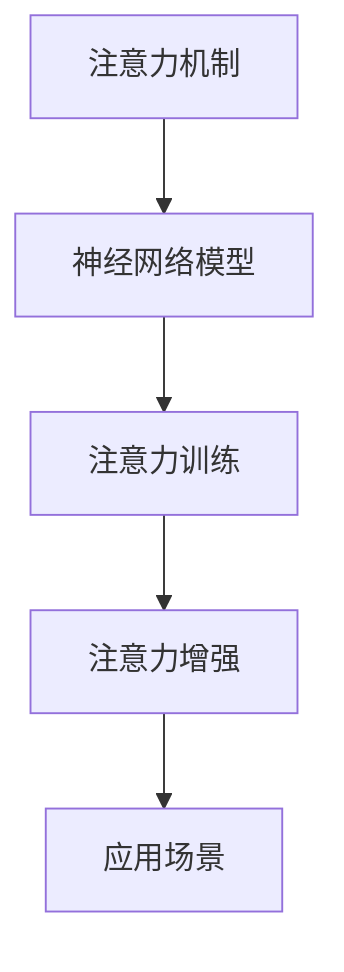

                 

# 人类注意力增强：提升专注力和注意力在商业中的未来趋势预测

## 1. 背景介绍

在当今快节奏、高信息密度的时代，人类注意力成为一种稀缺资源。随着智能设备和互联网的普及，我们的注意力被海量信息分割，难以专注于单一任务，影响工作效率和决策质量。如何在商业环境中有效提升个体和组织的专注力，成为企业家和领导者关注的焦点。本文将深入探讨人类注意力增强的核心概念、算法原理，并展望其未来趋势在商业中的广泛应用。

## 2. 核心概念与联系

### 2.1 核心概念概述

要深入理解人类注意力增强，需了解以下几个关键概念：

- **注意力机制**：在神经网络中，注意力机制用于模型在处理序列数据（如文本、图像）时，选择性地关注序列中的某些部分。
- **神经网络模型**：包括卷积神经网络（CNN）、递归神经网络（RNN）、Transformer等，用于处理和理解复杂数据。
- **注意力训练**：通过特殊设计的训练任务，使神经网络模型学习有效的注意力机制。
- **注意力增强**：通过改进模型结构和训练方法，提升注意力机制的表现，从而增强个体或组织的注意力水平。
- **应用场景**：包括自然语言处理、计算机视觉、推荐系统、智能对话等。

### 2.2 核心概念原理和架构的 Mermaid 流程图



此图展示了注意力机制如何从神经网络模型中抽象出来，通过训练得到强化，最终应用于特定场景的过程。

## 3. 核心算法原理 & 具体操作步骤

### 3.1 算法原理概述

人类注意力增强的核心在于利用深度学习模型学习如何分配注意力资源。具体算法原理包括：

1. **自监督学习**：使用大规模无标签数据训练模型，使其学习基本的注意力分布模式。
2. **强化学习**：通过设计奖励机制，指导模型在特定任务上不断调整注意力权重，优化注意力分配。
3. **迁移学习**：将模型在一种任务上的注意力学习迁移到另一种相关任务上，实现注意力增强。

### 3.2 算法步骤详解

算法步骤主要分为以下几个部分：

1. **模型选择**：选择适合的神经网络模型，如Transformer、RNN等。
2. **数据准备**：收集与任务相关的数据集，并进行预处理。
3. **注意力训练**：
   - 设计注意力训练任务，如自回归语言模型、机器翻译、图像识别等。
   - 使用强化学习框架，如Reinforcement Learning (RL)，优化注意力分配策略。
4. **注意力增强**：
   - 应用注意力训练得到的模型，进行特定任务的微调。
   - 使用迁移学习，将注意力增强的模型应用于新的任务。
5. **评估与优化**：
   - 使用评估指标，如精确率、召回率、F1分数等，评估注意力增强的效果。
   - 根据评估结果，优化模型结构和训练方法。

### 3.3 算法优缺点

**优点**：

- **可适应性强**：可以针对不同任务和数据类型进行适配。
- **提升效率**：通过优化注意力机制，可以显著提升模型处理数据的能力。
- **易部署**：大部分注意力增强技术可以部署在现有系统中，不需要大规模硬件投入。

**缺点**：

- **训练成本高**：需要大规模无标签数据进行预训练，成本较高。
- **数据依赖性**：依赖于任务相关的数据集，数据集质量直接影响模型效果。
- **可解释性差**：部分注意力增强技术，如深度学习模型，难以解释其内部决策过程。

### 3.4 算法应用领域

注意力增强技术已经广泛应用于多个领域，包括：

- **自然语言处理**：如机器翻译、文本分类、情感分析等。
- **计算机视觉**：如图像识别、图像生成、物体检测等。
- **推荐系统**：如用户行为预测、商品推荐等。
- **智能对话**：如聊天机器人、虚拟助手等。
- **智能广告**：如定向投放、个性化广告等。

## 4. 数学模型和公式 & 详细讲解

### 4.1 数学模型构建

注意力增强的核心模型是Transformer，其注意力机制依赖于查询（Q）、键（K）、值（V）三者的交互。在数学上，可以表示为：

$$
Attention(Q, K, V) = \sum_{i=1}^n \frac{\exp(Q_i \cdot K_i / \sqrt{d_k})}{\sum_{j=1}^n \exp(Q_j \cdot K_j / \sqrt{d_k})} V_i
$$

其中，$Q$、$K$、$V$ 分别代表查询向量、键向量和值向量，$d_k$ 是键向量的维度。该公式展示了模型如何通过计算向量间的相似度，分配注意力权重。

### 4.2 公式推导过程

注意力机制的推导过程基于余弦相似度计算：

1. 计算查询向量与键向量的点积：$Q \cdot K$。
2. 对点积结果进行softmax操作，得到注意力权重：$\exp(Q \cdot K / \sqrt{d_k})$。
3. 将注意力权重与值向量相乘，加权求和，得到注意力输出：$\sum \alpha V$。

通过公式推导，可以清晰地理解注意力机制的计算过程和原理。

### 4.3 案例分析与讲解

以机器翻译为例，模型需要在源语言和目标语言之间建立对齐关系。注意力机制通过计算源语言和目标语言中对应位置的向量之间的相似度，指导模型分配注意力资源，从而提升翻译效果。例如，在序列到序列（Seq2Seq）模型中，注意力机制可以帮助模型聚焦于重要的词语，忽略噪声，提高翻译质量。

## 5. 项目实践：代码实例和详细解释说明

### 5.1 开发环境搭建

项目实践需要以下开发环境：

1. Python 3.x：建议选择3.7或以上版本。
2. TensorFlow 2.x：用于构建神经网络模型。
3. PyTorch 1.x：另一种流行的深度学习框架。
4. Jupyter Notebook：用于交互式代码编写和调试。
5. CUDA工具包：可选，用于加速模型训练和推理。

安装环境可以通过以下命令：

```bash
pip install tensorflow==2.5.0
pip install torch==1.7.0
conda install jupyter notebook
```

### 5.2 源代码详细实现

以下是一个使用PyTorch实现注意力增强的代码示例，以机器翻译为例：

```python
import torch
import torch.nn as nn
import torch.optim as optim

# 定义注意力模型
class Attention(nn.Module):
    def __init__(self, d_model, n_heads):
        super(Attention, self).__init__()
        self.d_model = d_model
        self.n_heads = n_heads
        self.head_dim = d_model // n_heads

        self.query = nn.Linear(d_model, d_model)
        self.key = nn.Linear(d_model, d_model)
        self.value = nn.Linear(d_model, d_model)
        self.softmax = nn.Softmax(dim=-1)
        self.fc = nn.Linear(d_model, d_model)

    def forward(self, query, key, value):
        nbatch = query.size(0)
        nsrc = query.size(1)
        ncat = query.size(2)

        query = query.view(nbatch, nsrc, ncat, self.head_dim).transpose(1, 2).contiguous().view(nbatch, ncat * self.n_heads, self.head_dim)
        key = key.view(nbatch, nsrc, ncat, self.head_dim).transpose(1, 2).contiguous().view(nbatch, ncat * self.n_heads, self.head_dim)
        value = value.view(nbatch, nsrc, ncat, self.head_dim).transpose(1, 2).contiguous().view(nbatch, ncat * self.n_heads, self.head_dim)

        attn = self.softmax(query @ key.transpose(1, 2) / torch.sqrt(torch.tensor(self.head_dim)))

        attn = attn.view(nbatch, ncat, self.n_heads, nsrc).transpose(1, 2).contiguous().view(nbatch, ncat, nsrc)
        return (attn @ value) @ self.fc.weight, attn

# 定义编码器模型
class Encoder(nn.Module):
    def __init__(self, d_model, n_layers, n_heads, dff, dropout):
        super(Encoder, self).__init__()
        self.layers = nn.ModuleList([
            nn.TransformerEncoderLayer(d_model, n_heads, dff, dropout).to(device) for _ in range(n_layers)
        ])
        self.encoder_norm = nn.LayerNorm(d_model)

    def forward(self, src, src_mask=None):
        for layer in self.layers:
            src = layer(src, src_mask)
        return src

# 定义解码器模型
class Decoder(nn.Module):
    def __init__(self, d_model, n_layers, n_heads, dff, dropout):
        super(Decoder, self).__init__()
        self.layers = nn.ModuleList([
            nn.TransformerDecoderLayer(d_model, n_heads, dff, dropout).to(device) for _ in range(n_layers)
        ])
        self.decoder_norm = nn.LayerNorm(d_model)

    def forward(self, dec_input, memory, dec_mask=None, enc_mask=None):
        for layer in self.layers:
            dec_output, dec_attn = layer(dec_input, memory, dec_mask, enc_mask)
        return dec_output, dec_attn

# 定义模型结构
class Transformer(nn.Module):
    def __init__(self, d_model, n_layers, n_heads, dff, dropout):
        super(Transformer, self).__init__()
        self.encoder = Encoder(d_model, n_layers, n_heads, dff, dropout).to(device)
        self.decoder = Decoder(d_model, n_layers, n_heads, dff, dropout).to(device)
        self.final_layer = nn.Linear(d_model, 10).to(device)

    def forward(self, src, dec_input, memory, dec_mask=None, enc_mask=None):
        enc_output, _ = self.encoder(src, enc_mask)
        dec_output, _ = self.decoder(dec_input, memory, dec_mask, enc_mask)
        final_output = self.final_layer(dec_output)
        return final_output

# 训练模型
device = torch.device("cuda" if torch.cuda.is_available() else "cpu")
model = Transformer(d_model=256, n_layers=6, n_heads=8, dff=2048, dropout=0.1).to(device)
criterion = nn.CrossEntropyLoss().to(device)
optimizer = optim.Adam(model.parameters(), lr=0.001)

# 训练数据
src = torch.randn(1, 128, d_model).to(device)
memory = torch.randn(1, 128, d_model).to(device)
dec_input = torch.randn(1, 128, d_model).to(device)
target = torch.randint(10, (1, 128)).to(device)

for i in range(1000):
    optimizer.zero_grad()
    output = model(src, dec_input, memory)
    loss = criterion(output, target)
    loss.backward()
    optimizer.step()

    if (i + 1) % 100 == 0:
        print(f"Epoch {i+1} | Loss: {loss.item():.4f}")
```

### 5.3 代码解读与分析

此代码示例展示了使用PyTorch实现Transformer模型的过程，重点在于注意力机制的计算和模型的整体结构。代码中使用了Transformer编码器和解码器，通过前向传播计算注意力输出，并使用交叉熵损失函数进行优化。

## 6. 实际应用场景

### 6.1 智能广告

人类注意力增强技术在智能广告领域具有广阔的应用前景。通过分析用户行为数据，学习用户的兴趣和偏好，并针对性地投放广告，可以大幅提升广告的点击率和转化率。例如，在推荐系统中，通过注意力增强，广告平台能够更精确地识别用户的兴趣点，匹配最相关的广告，从而提升广告效果。

### 6.2 智能推荐

智能推荐系统通过分析用户的行为数据，学习用户的兴趣和偏好，并推荐可能感兴趣的商品或内容。通过注意力增强，推荐系统能够更好地捕捉用户在不同时间、不同情境下的兴趣变化，提供更个性化的推荐。例如，在电商平台上，通过注意力增强，推荐系统能够更精准地识别用户对不同商品的关注点，从而提升用户体验和销售额。

### 6.3 智能客户服务

智能客户服务系统通过自然语言处理技术，理解用户的查询，并提供自动化的响应。通过注意力增强，系统能够更好地理解用户的意图，提供更相关、更个性化的回复。例如，在客服系统中，通过注意力增强，系统能够更准确地识别用户提出的问题，并快速给出解决方案，提升客户满意度。

### 6.4 未来应用展望

未来，人类注意力增强技术将在更多领域得到应用，为人类生产生活带来深远影响：

- **智能家居**：通过注意力增强，智能家居系统能够更准确地理解和响应用户的语音指令，提供更智能、更便捷的用户体验。
- **智能交通**：通过注意力增强，智能交通系统能够更好地理解和预测道路交通情况，优化交通管理，提升道路通行效率。
- **智能健康**：通过注意力增强，智能健康系统能够更精准地理解用户的健康数据，提供个性化的健康建议和治疗方案。

## 7. 工具和资源推荐

### 7.1 学习资源推荐

为了帮助开发者系统掌握人类注意力增强的理论基础和实践技巧，这里推荐一些优质的学习资源：

1. **Deep Learning with PyTorch**：一本系统介绍PyTorch框架的书籍，详细讲解了TensorFlow和PyTorch的使用方法和原理。
2. **Attention is All You Need**：Transformer原论文，介绍了Transformer模型的基本原理和注意力机制。
3. **Reinforcement Learning: An Introduction**：一本介绍强化学习基本概念和算法的书籍，涵盖了强化学习在深度学习中的应用。
4. **Transformers: A Survey**：一篇系统介绍Transformer模型的综述论文，介绍了Transformer的原理、应用和最新研究进展。
5. **Stanford CS224N: Natural Language Processing with Deep Learning**：斯坦福大学开设的NLP课程，涵盖了NLP的基本概念和深度学习技术，并提供了丰富的实践案例。

### 7.2 开发工具推荐

高效的项目实践需要优秀的工具支持。以下是几款用于注意力增强开发的常用工具：

1. **PyTorch**：基于Python的开源深度学习框架，灵活的计算图和丰富的模型库，适用于各种深度学习项目。
2. **TensorFlow**：Google主导开发的深度学习框架，支持大规模分布式训练，适用于高性能计算环境。
3. **Jupyter Notebook**：交互式代码编写和调试工具，支持多种编程语言和数据格式，适用于数据科学和机器学习项目。
4. **Weights & Biases**：模型训练的实验跟踪工具，可以记录和可视化模型训练过程中的各项指标，方便对比和调优。
5. **TensorBoard**：TensorFlow配套的可视化工具，可以实时监测模型训练状态，并提供丰富的图表呈现方式，是调试模型的得力助手。

### 7.3 相关论文推荐

人类注意力增强技术的深入研究依赖于丰富的学术成果。以下是几篇奠基性的相关论文，推荐阅读：

1. **Attention is All You Need**：Transformer原论文，介绍了Transformer模型的基本原理和注意力机制。
2. **Dynamic Attention in Neural Networks**：研究动态注意力机制在神经网络中的应用，提出了一种自适应注意力机制。
3. **Learning to Attend**：提出了一种基于强化学习的注意力学习框架，通过奖励机制指导模型学习注意力权重。
4. **Reinforcement Learning with Continuous Rewards**：介绍了强化学习在连续动作空间中的应用，为注意力增强提供了理论支持。
5. **Gated Attention Networks**：提出了一种基于门控机制的注意力增强方法，用于提高神经网络模型的表达能力。

## 8. 总结：未来发展趋势与挑战

### 8.1 总结

本文对人类注意力增强技术进行了全面系统的介绍。首先阐述了人类注意力增强的核心概念和算法原理，详细讲解了注意力机制的数学模型和实现过程。其次，通过项目实践代码实例，展示了注意力增强技术在实际应用中的具体实现。最后，通过案例分析，探讨了注意力增强技术在商业领域的应用前景和未来发展趋势。

通过本文的系统梳理，可以看到，人类注意力增强技术正在成为NLP领域的重要范式，极大地拓展了神经网络模型的应用边界，催生了更多的落地场景。未来，伴随深度学习技术的不断演进，人类注意力增强技术必将在更多领域得到应用，为人类认知智能的进化带来深远影响。

### 8.2 未来发展趋势

展望未来，人类注意力增强技术将呈现以下几个发展趋势：

1. **多模态融合**：人类注意力增强技术将与其他模态信息（如视觉、听觉、文本）进行更紧密的结合，实现跨模态信息融合，提升模型的综合表现能力。
2. **实时性优化**：通过优化模型结构和计算图，人类注意力增强技术将实现更高实时性的推理和响应，适用于实时交互和决策场景。
3. **自适应学习**：通过引入自适应学习机制，模型能够根据环境变化和用户行为进行动态调整，增强系统的适应性和鲁棒性。
4. **隐私保护**：随着隐私保护意识的提升，人类注意力增强技术将进一步增强数据和模型的隐私保护措施，确保用户信息的安全性。
5. **伦理合规**：在模型设计和应用过程中，将引入更多的伦理和合规要求，确保技术应用的合法性和公平性。

### 8.3 面临的挑战

尽管人类注意力增强技术已经取得了瞩目成就，但在迈向更加智能化、普适化应用的过程中，它仍面临着诸多挑战：

1. **数据隐私问题**：人类注意力增强技术需要大量的数据进行训练，如何在保护隐私的前提下获取数据，成为一大难题。
2. **计算资源需求**：当前大规模深度学习模型的训练和推理需要高性能计算资源，如何降低计算成本，提升资源利用效率，是未来的重要研究方向。
3. **可解释性不足**：人类注意力增强技术的内部决策过程难以解释，在医疗、金融等高风险应用中，算法的可解释性和可审计性尤为重要。
4. **公平性问题**：在实际应用中，模型可能会偏向某些群体，导致不公平的决策结果，如何消除偏见，提升公平性，是技术应用中的重要挑战。

### 8.4 研究展望

面对人类注意力增强技术面临的挑战，未来的研究需要在以下几个方面寻求新的突破：

1. **数据隐私保护**：开发更加高效的数据收集和隐私保护方法，如差分隐私、联邦学习等，确保数据安全的同时，提高模型效果。
2. **计算资源优化**：引入模型压缩、量化加速等技术，降低计算成本，提升计算效率。
3. **可解释性增强**：通过引入符号化知识和逻辑推理，增强模型决策的可解释性和可审计性，提升用户信任度。
4. **公平性算法设计**：设计更加公平的模型训练和优化算法，确保模型决策的公正性和透明度。
5. **跨模态注意力机制**：研究跨模态注意力机制，实现多模态信息的有效整合，提升模型的综合表现能力。

通过上述研究方向的探索，相信人类注意力增强技术必将在未来得到进一步的突破和应用，为人类的生产生活带来更加智能和高效的服务。

