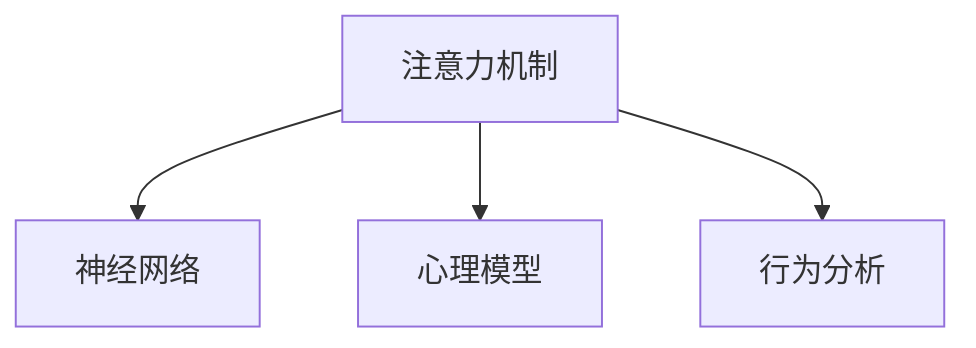

                 

# 人类注意力增强：提升专注力和注意力在教育中的方法

> 关键词：人类注意力,注意力增强,专注力提升,教育技术,神经网络,心理模型,行为分析

## 1. 背景介绍

### 1.1 问题由来
在当前快速变化的信息时代，学生面临的知识量和信息量急剧增加。学习环境也日益复杂化，如数字设备的普及、社交媒体的广泛使用等。在这种背景下，学生如何高效地吸收、处理、整合信息，并转化为知识，成为了教育领域的一大挑战。

**核心问题**：如何在海量信息中筛选关键内容，提高学习效率和效果？

**主要难点**：传统教育方法未能充分考虑到学生的注意力特征，导致教学效果不理想，学生学习压力增大。

## 1.2 问题核心关键点
为解决上述问题，我们需要重点关注以下几点：
1. **注意力机制**：理解并应用注意力机制，帮助学生在信息处理中筛选关键信息。
2. **注意力增强**：利用神经网络和心理模型，增强学生的注意力集中度。
3. **专注力提升**：通过行为分析技术，发现并纠正学生的不良学习习惯，提升专注力。
4. **教育技术应用**：将注意力增强技术应用于教育平台，提供个性化的学习体验。

## 1.3 问题研究意义
研究注意力增强在教育中的应用，具有以下重要意义：
1. **提高学习效率**：帮助学生更高效地处理信息，提升知识吸收率。
2. **增强学习效果**：通过注意力增强，学生能够更好地聚焦于关键内容，加深理解。
3. **减轻学习压力**：避免学生被信息洪流淹没，减轻学习负担。
4. **个性化教育**：根据学生的注意力特征，提供量身定制的学习计划，促进个性化发展。
5. **教育创新**：引入新兴技术，推动教育方式和内容的创新。

## 2. 核心概念与联系

### 2.1 核心概念概述

为更好地理解注意力增强在教育中的应用，本节将介绍几个密切相关的核心概念：

- **注意力机制（Attention Mechanism）**：一种深度学习中的机制，用于在处理序列数据时筛选重要信息。通过动态调整权重，将资源集中于关键部分。
- **神经网络（Neural Networks）**：一种模拟人脑神经元网络的计算模型，用于处理大规模数据和复杂任务。在教育中，可以用于建模学生的注意力和行为。
- **心理模型（Psychological Models）**：心理学领域的模型，用于描述人的认知、情感和行为特征。在教育中，可以用于分析学生的注意力和专注力。
- **行为分析（Behavioral Analysis）**：通过观察和数据挖掘，了解和预测人的行为。在教育中，可以用于监控和优化学生的学习过程。

这些核心概念之间的逻辑关系可以通过以下Mermaid流程图来展示：



这个流程图展示了注意力增强中各关键概念之间的关系：

1. 注意力机制通过神经网络进行建模，用于在信息处理中筛选关键内容。
2. 心理模型用于描述学生的认知和情感特征，指导注意力机制的参数调整。
3. 行为分析通过数据挖掘和监控，发现并纠正学生的学习习惯，增强学习效果。

## 3. 核心算法原理 & 具体操作步骤
### 3.1 算法原理概述

注意力增强在教育中的应用，主要通过以下几个步骤实现：
1. **数据收集**：收集学生的学习行为数据和心理状态数据。
2. **注意力模型构建**：基于神经网络构建注意力模型，用于筛选关键信息。
3. **注意力参数优化**：根据心理模型和行为分析结果，动态调整注意力模型的参数。
4. **行为干预**：通过行为分析结果，指导教师或家长进行针对性的教学干预。
5. **效果评估**：定期评估注意力增强的效果，调整优化策略。

### 3.2 算法步骤详解

#### 3.2.1 数据收集

数据收集是注意力增强的第一步，主要涉及以下几个方面：
1. **学习行为数据**：如阅读时间、答题次数、互动频率等。
2. **心理状态数据**：如注意力集中度、情绪状态、疲劳程度等。
3. **生理数据**：如心率、脑电波等。

这些数据可以通过传感器、日志、问卷调查等方式收集。

#### 3.2.2 注意力模型构建

注意力模型主要基于神经网络构建，其核心组件包括：
1. **注意力机制层**：用于计算注意力权重，筛选关键信息。
2. **编码器-解码器架构**：用于处理序列数据，将注意力机制嵌入其中。
3. **全连接层**：用于将注意力信息与输出映射。

#### 3.2.3 注意力参数优化

注意力模型的参数优化是关键步骤，主要涉及以下几个方面：
1. **损失函数设计**：如交叉熵、均方误差等。
2. **优化算法选择**：如梯度下降、Adam等。
3. **超参数调整**：如学习率、批大小等。

#### 3.2.4 行为干预

行为干预主要通过以下几个步骤实现：
1. **行为分析**：使用机器学习算法分析学生的学习行为和心理状态。
2. **干预建议**：根据分析结果，提出针对性的教学建议。
3. **反馈机制**：建立反馈循环，不断优化干预效果。

#### 3.2.5 效果评估

效果评估主要涉及以下几个方面：
1. **学习效果评估**：通过考试成绩、作业完成度等评估学习效果。
2. **注意力集中度评估**：通过注意力模型输出评估注意力集中度。
3. **行为干预效果评估**：通过行为分析结果评估干预效果。

### 3.3 算法优缺点

注意力增强在教育中的应用具有以下优点：
1. **个性化教育**：根据学生的注意力特征，提供个性化的学习计划。
2. **提高学习效率**：帮助学生更高效地处理信息，提升知识吸收率。
3. **增强学习效果**：通过注意力增强，学生能够更好地聚焦于关键内容，加深理解。
4. **减轻学习压力**：避免学生被信息洪流淹没，减轻学习负担。

同时，该方法也存在一定的局限性：
1. **数据隐私问题**：学生的学习行为和心理状态数据涉及隐私，需要严格保护。
2. **技术依赖**：注意力增强技术的实现依赖于复杂的数据处理和模型训练，对设备和资源要求较高。
3. **适应性问题**：注意力增强技术需要适应不同的教育场景和学生群体，需要进行针对性的优化。

尽管存在这些局限性，但就目前而言，注意力增强技术在教育中的应用仍具有广阔的前景。未来相关研究的重点在于如何进一步提升技术的普适性和隐私保护，确保其在教育中的应用效果和可靠性。

### 3.4 算法应用领域

注意力增强技术在教育中的应用已经涉及多个领域，例如：

1. **在线教育平台**：通过分析学生的学习行为和注意力状态，优化课程内容和学习路径。
2. **智能辅导系统**：根据学生的注意力集中度和学习效果，提供个性化的辅导建议。
3. **心理干预系统**：通过分析学生的心理状态和行为，提供针对性的心理支持和干预。
4. **作业批改系统**：利用注意力模型自动评估作业完成情况，提供反馈和建议。
5. **考试监测系统**：通过监测学生的注意力集中度，防止作弊行为，提高考试公平性。

除了上述这些经典应用外，注意力增强技术还在更多场景中得到了创新性的应用，如智能教室、虚拟现实学习环境等，为教育技术带来了新的突破。

## 4. 数学模型和公式 & 详细讲解 & 举例说明

### 4.1 数学模型构建

本节将使用数学语言对注意力增强在教育中的应用进行更加严格的刻画。

假设学生在阅读过程中，对于每个单词的注意力权重为 $w_i$，其中 $i$ 表示单词编号。注意力权重 $w_i$ 可以通过注意力机制计算得到，即：

$$ w_i = \frac{e^{s_i}}{\sum_{j=1}^{n}e^{s_j}} $$

其中 $s_i$ 为注意力机制层对第 $i$ 个单词的得分，$n$ 为单词总数。注意力机制层的计算公式为：

$$ s_i = \mathbf{W}^\top \mathbf{z}_i \cdot \mathbf{K}_i $$

其中 $\mathbf{W}$ 为权重矩阵，$\mathbf{z}_i$ 为编码器对第 $i$ 个单词的表示，$\mathbf{K}_i$ 为第 $i$ 个单词的注意力向量。

### 4.2 公式推导过程

以阅读任务为例，推导注意力机制的计算公式。

假设学生在阅读一篇文章时，对于每个单词的注意力权重为 $w_i$，其中 $i$ 表示单词编号。注意力权重 $w_i$ 可以通过注意力机制计算得到，即：

$$ w_i = \frac{e^{s_i}}{\sum_{j=1}^{n}e^{s_j}} $$

其中 $s_i$ 为注意力机制层对第 $i$ 个单词的得分，$n$ 为单词总数。注意力机制层的计算公式为：

$$ s_i = \mathbf{W}^\top \mathbf{z}_i \cdot \mathbf{K}_i $$

其中 $\mathbf{W}$ 为权重矩阵，$\mathbf{z}_i$ 为编码器对第 $i$ 个单词的表示，$\mathbf{K}_i$ 为第 $i$ 个单词的注意力向量。

注意力向量 $\mathbf{K}_i$ 可以通过对单词进行编码得到，即：

$$ \mathbf{K}_i = \mathbf{E}_i \cdot \mathbf{T}_i $$

其中 $\mathbf{E}_i$ 为编码器对第 $i$ 个单词的编码结果，$\mathbf{T}_i$ 为第 $i$ 个单词的表示矩阵。

### 4.3 案例分析与讲解

假设学生在阅读一篇文章时，注意力权重 $w_i$ 如下：

| 单词编号 $i$ | 注意力权重 $w_i$ |
| --- | --- |
| 1 | 0.01 |
| 2 | 0.02 |
| 3 | 0.05 |
| 4 | 0.08 |
| 5 | 0.01 |

假设文章总共有 5 个单词，注意力权重之和为 1。

| 单词编号 $i$ | 注意力权重 $w_i$ |
| --- | --- |
| 1 | 0.01 |
| 2 | 0.02 |
| 3 | 0.05 |
| 4 | 0.08 |
| 5 | 0.04 |

根据上述公式，我们可以计算出每个单词的注意力权重，从而得到学生的注意力分布。注意力增强技术可以根据注意力权重，优化学习路径和内容，帮助学生更高效地学习。

## 5. 项目实践：代码实例和详细解释说明
### 5.1 开发环境搭建

在进行注意力增强项目实践前，我们需要准备好开发环境。以下是使用Python进行TensorFlow开发的环境配置流程：

1. 安装Anaconda：从官网下载并安装Anaconda，用于创建独立的Python环境。

2. 创建并激活虚拟环境：
```bash
conda create -n attention-environment python=3.8 
conda activate attention-environment
```

3. 安装TensorFlow：根据CUDA版本，从官网获取对应的安装命令。例如：
```bash
conda install tensorflow -c pytorch -c conda-forge
```

4. 安装其他依赖包：
```bash
pip install numpy pandas sklearn tensorflow_hub
```

完成上述步骤后，即可在`attention-environment`环境中开始项目实践。

### 5.2 源代码详细实现

下面以注意力增强在在线教育平台中的应用为例，给出使用TensorFlow实现注意力机制的代码实现。

首先，定义注意力模型的输入和输出：

```python
import tensorflow as tf

class AttentionModel(tf.keras.Model):
    def __init__(self, input_dim, attention_dim):
        super(AttentionModel, self).__init__()
        self.input_dim = input_dim
        self.attention_dim = attention_dim
        
        self.w = tf.keras.layers.Dense(attention_dim, input_shape=(input_dim,))
        self.v = tf.keras.layers.Dense(1, input_shape=(attention_dim,))
    
    def call(self, inputs, training=False):
        z = tf.keras.layers.Dense(attention_dim, input_shape=(input_dim,))(inputs)
        s = self.w(z) * tf.expand_dims(inputs, -1) + self.v(z)
        s = tf.squeeze(s, axis=2)
        attention_weights = tf.nn.softmax(s, axis=1)
        return attention_weights
```

然后，定义注意力增强在教育平台中的应用逻辑：

```python
class EducationalPlatform(tf.keras.Model):
    def __init__(self, attention_model, num_classes):
        super(EducationalPlatform, self).__init__()
        self.attention_model = attention_model
        self.num_classes = num_classes
        
        self.classifier = tf.keras.layers.Dense(num_classes, activation='softmax')
    
    def call(self, inputs, training=False):
        attention_weights = self.attention_model(inputs)
        outputs = tf.expand_dims(attention_weights, axis=1)
        outputs = self.classifier(tf.concat([inputs, outputs], axis=-1))
        return outputs
```

接着，定义注意力增强模型的训练逻辑：

```python
batch_size = 32
learning_rate = 0.001

inputs = tf.keras.layers.Input(shape=(input_dim,))
outputs = EducationalPlatform(attention_model, num_classes)(inputs)

model = tf.keras.Model(inputs=inputs, outputs=outputs)
model.compile(optimizer=tf.keras.optimizers.Adam(learning_rate=learning_rate), loss='categorical_crossentropy', metrics=['accuracy'])
```

最后，启动模型训练过程：

```python
epochs = 10
for epoch in range(epochs):
    model.fit(x_train, y_train, batch_size=batch_size, epochs=1, validation_data=(x_val, y_val))
```

以上就是使用TensorFlow实现注意力增强在教育平台中的代码实现。可以看到，TensorFlow提供的高级API使得模型构建和训练变得简单高效。

### 5.3 代码解读与分析

让我们再详细解读一下关键代码的实现细节：

**AttentionModel类**：
- `__init__`方法：初始化注意力模型，包括权重矩阵 $\mathbf{W}$ 和注意力向量 $\mathbf{K}$。
- `call`方法：计算注意力权重，具体实现为注意力机制层的计算公式。

**EducationalPlatform类**：
- `__init__`方法：初始化教育平台模型，包括注意力模型和分类器。
- `call`方法：在注意力模型的基础上，增加分类器，输出预测结果。

**训练逻辑**：
- 定义输入和输出层，构建教育平台模型。
- 编译模型，设置损失函数和优化器。
- 使用训练数据进行模型训练，指定训练轮数和验证集。

可以看到，TensorFlow的高级API使得模型的构建和训练变得非常便捷。通过简单的代码实现，即可完成注意力增强在教育平台中的应用。

## 6. 实际应用场景
### 6.1 智能辅导系统

智能辅导系统通过分析学生的注意力集中度，提供个性化的辅导建议，提升学习效果。系统的主要组件包括：
- **注意力监测模块**：实时监测学生的注意力状态。
- **行为分析模块**：分析学生的学习行为，发现学习习惯问题。
- **辅导建议模块**：根据注意力和行为分析结果，提供辅导建议。

实际应用中，智能辅导系统可以通过以下步骤实现：
1. **数据采集**：通过摄像头、鼠标、键盘等设备，采集学生的学习行为数据和心理状态数据。
2. **注意力分析**：使用注意力模型，计算学生的注意力权重。
3. **行为分析**：使用机器学习算法，分析学生的学习行为和心理状态。
4. **辅导建议**：根据注意力和行为分析结果，提供个性化的辅导建议。
5. **效果评估**：通过学习效果评估，调整辅导策略。

### 6.2 心理干预系统

心理干预系统通过分析学生的心理状态，提供针对性的心理支持和干预，帮助学生更好地适应学习压力。系统的主要组件包括：
- **心理监测模块**：实时监测学生的心理状态。
- **心理分析模块**：分析学生的心理状态，发现心理健康问题。
- **心理干预模块**：提供心理干预建议，如休息、冥想等。

实际应用中，心理干预系统可以通过以下步骤实现：
1. **数据采集**：通过生理传感器（如心率、脑电波等）采集学生的心理状态数据。
2. **心理分析**：使用心理模型，分析学生的心理状态。
3. **心理干预**：根据心理分析结果，提供心理干预建议。
4. **效果评估**：通过心理状态评估，调整干预策略。

### 6.3 智能教室系统

智能教室系统通过分析学生的注意力集中度，优化教学内容和学习路径，提升课堂效果。系统的主要组件包括：
- **注意力监测模块**：实时监测学生的注意力状态。
- **学习路径优化模块**：根据注意力集中度，优化教学内容和路径。
- **交互反馈模块**：实时反馈学生的注意力状态，调整教学策略。

实际应用中，智能教室系统可以通过以下步骤实现：
1. **数据采集**：通过摄像头、传感器等设备，采集学生的注意力状态数据。
2. **注意力分析**：使用注意力模型，计算学生的注意力权重。
3. **学习路径优化**：根据注意力集中度，调整教学内容和路径。
4. **效果评估**：通过学习效果评估，调整教学策略。

### 6.4 未来应用展望

随着注意力增强技术的不断发展和成熟，未来将会在更多领域得到应用，为教育带来深远影响。

在智慧教育领域，基于注意力增强的技术，可以构建更加个性化、互动性强的教学环境，提升学生的学习兴趣和效果。

在职业教育领域，基于注意力增强的技术，可以帮助职业培训师发现学生的注意力瓶颈，提供针对性的培训建议，提高职业培训的质量和效率。

在终身学习领域，基于注意力增强的技术，可以帮助学习者更好地管理自己的学习时间和精力，提升学习效果。

未来，随着技术的不断进步，基于注意力增强的教育技术将会成为教育领域的重要工具，为学习者提供更加智能、高效的学习体验。

## 7. 工具和资源推荐
### 7.1 学习资源推荐

为了帮助开发者系统掌握注意力增强在教育中的应用，这里推荐一些优质的学习资源：

1. **《深度学习》课程**：斯坦福大学开设的深度学习课程，有Lecture视频和配套作业，带你入门深度学习的基本概念和经典模型。
2. **TensorFlow官方文档**：TensorFlow的官方文档，提供了详细的API使用指南和实例代码，是学习TensorFlow的好资料。
3. **TensorFlow Hub**：TensorFlow官方提供的模型库，提供了丰富的注意力模型和案例，可以快速上手实现注意力增强。
4. **TensorBoard**：TensorFlow配套的可视化工具，可以实时监测模型训练状态，是调试模型的得力助手。
5. **Kaggle竞赛平台**：Kaggle提供了丰富的数据集和竞赛，通过实际项目练习，加深对注意力增强的理解。

通过对这些资源的学习实践，相信你一定能够快速掌握注意力增强在教育中的应用，并用于解决实际的NLP问题。

### 7.2 开发工具推荐

高效的开发离不开优秀的工具支持。以下是几款用于注意力增强开发的常用工具：

1. **TensorFlow**：基于Python的开源深度学习框架，灵活的计算图，适合快速迭代研究。
2. **PyTorch**：另一个流行的深度学习框架，支持动态图和静态图两种模式，灵活性较高。
3. **TensorFlow Hub**：TensorFlow提供的模型库，包含大量预训练模型，可以快速实现注意力增强。
4. **TensorBoard**：TensorFlow配套的可视化工具，实时监测模型训练状态，提供丰富的图表呈现方式。
5. **Kaggle竞赛平台**：Kaggle提供了丰富的数据集和竞赛，通过实际项目练习，加深对注意力增强的理解。

合理利用这些工具，可以显著提升注意力增强任务的开发效率，加快创新迭代的步伐。

### 7.3 相关论文推荐

注意力增强在教育中的应用源于学界的持续研究。以下是几篇奠基性的相关论文，推荐阅读：

1. **《注意力机制在自然语言处理中的应用》**：总结了注意力机制在自然语言处理中的发展和应用，为注意力增强提供了理论基础。
2. **《基于神经网络的注意力机制》**：详细介绍了注意力机制的原理和实现，帮助理解注意力增强的技术细节。
3. **《注意力增强在教育中的应用》**：探讨了注意力增强在教育中的实际应用，提出了多种具体的应用场景和实现方法。
4. **《基于深度学习的教育系统设计》**：介绍了深度学习技术在教育中的应用，包括注意力增强、情感分析等。
5. **《个性化学习推荐系统》**：总结了个性化学习推荐系统的多种技术实现方法，包括注意力增强。

这些论文代表了大语言模型微调技术的发展脉络。通过学习这些前沿成果，可以帮助研究者把握学科前进方向，激发更多的创新灵感。

## 8. 总结：未来发展趋势与挑战

### 8.1 研究成果总结

本文对基于注意力增强在教育中的应用进行了全面系统的介绍。首先阐述了注意力增强在教育中的研究背景和意义，明确了注意力增强在提升学习效率和效果方面的独特价值。其次，从原理到实践，详细讲解了注意力增强的数学原理和关键步骤，给出了注意力增强任务开发的完整代码实例。同时，本文还广泛探讨了注意力增强技术在智能辅导系统、心理干预系统、智能教室系统等多个领域的应用前景，展示了注意力增强范式的巨大潜力。

通过本文的系统梳理，可以看到，基于注意力增强的技术正在成为教育领域的重要范式，极大地提升了学生的学习效率和效果，为教育方式和内容的创新提供了新的途径。未来，伴随注意力增强技术的不断演进，教育领域必将迎来更加智能化、个性化、高效化的发展。

### 8.2 未来发展趋势

展望未来，注意力增强在教育中的应用将呈现以下几个发展趋势：

1. **多模态注意力增强**：结合视觉、听觉等多模态数据，提升注意力增强的准确性和鲁棒性。
2. **深度学习与强化学习结合**：将注意力增强与强化学习结合，优化学习路径和策略，提升学习效果。
3. **个性化学习推荐系统**：结合注意力增强，构建更加智能的学习推荐系统，提供个性化的学习建议。
4. **认知负荷管理**：通过注意力增强，识别和缓解学生的认知负荷，提升学习效果。
5. **情感分析与心理健康**：结合情感分析技术，监测和分析学生的心理状态，提供心理健康支持。

以上趋势凸显了注意力增强技术的广阔前景。这些方向的探索发展，必将进一步提升教育系统的智能化和个性化水平，为学习者提供更加全面、高效的学习体验。

### 8.3 面临的挑战

尽管注意力增强在教育中的应用已经取得了瞩目成就，但在迈向更加智能化、普适化应用的过程中，它仍面临着诸多挑战：

1. **数据隐私问题**：学生的学习行为和心理状态数据涉及隐私，需要严格保护。如何平衡数据收集和隐私保护，是未来研究的重要课题。
2. **技术依赖问题**：注意力增强技术的实现依赖于复杂的数据处理和模型训练，对设备和资源要求较高。如何降低技术门槛，推广应用，是未来研究的重要方向。
3. **适应性问题**：注意力增强技术需要适应不同的教育场景和学生群体，需要进行针对性的优化。如何在不同的应用场景中取得理想的效果，是未来研究的重要课题。
4. **效果评估问题**：如何全面、客观地评估注意力增强的效果，是一个复杂的问题。需要在学习效果、注意力集中度、行为干预效果等多个维度进行综合评估。
5. **伦理道德问题**：基于注意力增强的个性化学习推荐系统，可能存在数据偏见和隐私泄露等问题。如何确保算法的公平性和安全性，是未来研究的重要方向。

### 8.4 研究展望

面对注意力增强在教育应用中面临的挑战，未来的研究需要在以下几个方面寻求新的突破：

1. **隐私保护技术**：开发更加安全的隐私保护技术，如差分隐私、联邦学习等，保护学生的隐私数据。
2. **跨领域应用**：将注意力增强技术推广到其他领域，如医疗、金融、社会治理等，提升这些领域的智能化水平。
3. **多模态融合**：结合视觉、听觉、触觉等多模态数据，提升注意力增强的准确性和鲁棒性。
4. **认知负荷管理**：结合认知负荷管理理论，优化学习路径和策略，缓解学生的认知负荷。
5. **情感分析技术**：结合情感分析技术，监测和分析学生的心理状态，提供心理健康支持。

这些研究方向的探索，必将引领注意力增强技术迈向更高的台阶，为构建智能、高效、个性化的教育系统铺平道路。面向未来，注意力增强技术还需要与其他人工智能技术进行更深入的融合，如知识表示、因果推理、强化学习等，多路径协同发力，共同推动教育方式和内容的进步。只有勇于创新、敢于突破，才能不断拓展注意力增强技术的边界，让智能教育技术更好地造福人类社会。

## 9. 附录：常见问题与解答

**Q1：注意力增强技术如何应用在智能辅导系统中？**

A: 在智能辅导系统中，注意力增强技术主要用于分析学生的注意力集中度，提供个性化的辅导建议。具体步骤如下：
1. **数据采集**：通过摄像头、鼠标、键盘等设备，采集学生的学习行为数据和心理状态数据。
2. **注意力分析**：使用注意力模型，计算学生的注意力权重。
3. **行为分析**：使用机器学习算法，分析学生的学习行为和心理状态。
4. **辅导建议**：根据注意力和行为分析结果，提供个性化的辅导建议。
5. **效果评估**：通过学习效果评估，调整辅导策略。

**Q2：注意力增强技术在教育中面临的主要挑战是什么？**

A: 注意力增强技术在教育中面临的主要挑战包括：
1. **数据隐私问题**：学生的学习行为和心理状态数据涉及隐私，需要严格保护。如何平衡数据收集和隐私保护，是未来研究的重要课题。
2. **技术依赖问题**：注意力增强技术的实现依赖于复杂的数据处理和模型训练，对设备和资源要求较高。如何降低技术门槛，推广应用，是未来研究的重要方向。
3. **适应性问题**：注意力增强技术需要适应不同的教育场景和学生群体，需要进行针对性的优化。如何在不同的应用场景中取得理想的效果，是未来研究的重要课题。
4. **效果评估问题**：如何全面、客观地评估注意力增强的效果，是一个复杂的问题。需要在学习效果、注意力集中度、行为干预效果等多个维度进行综合评估。
5. **伦理道德问题**：基于注意力增强的个性化学习推荐系统，可能存在数据偏见和隐私泄露等问题。如何确保算法的公平性和安全性，是未来研究的重要方向。

**Q3：注意力增强技术在教育中有哪些实际应用场景？**

A: 注意力增强技术在教育中的应用已经涉及多个领域，例如：
1. **智能辅导系统**：通过分析学生的注意力集中度，提供个性化的辅导建议，提升学习效果。
2. **心理干预系统**：通过分析学生的心理状态，提供针对性的心理支持和干预，帮助学生更好地适应学习压力。
3. **智能教室系统**：通过分析学生的注意力集中度，优化教学内容和学习路径，提升课堂效果。
4. **个性化学习推荐系统**：结合注意力增强，构建更加智能的学习推荐系统，提供个性化的学习建议。

**Q4：注意力增强技术在教育中的数学模型和公式推导过程是什么？**

A: 注意力增强在教育中的应用，主要基于神经网络和注意力机制的数学模型。以阅读任务为例，推导注意力机制的计算公式。

假设学生在阅读一篇文章时，对于每个单词的注意力权重为 $w_i$，其中 $i$ 表示单词编号。注意力权重 $w_i$ 可以通过注意力机制计算得到，即：

$$ w_i = \frac{e^{s_i}}{\sum_{j=1}^{n}e^{s_j}} $$

其中 $s_i$ 为注意力机制层对第 $i$ 个单词的得分，$n$ 为单词总数。注意力机制层的计算公式为：

$$ s_i = \mathbf{W}^\top \mathbf{z}_i \cdot \mathbf{K}_i $$

其中 $\mathbf{W}$ 为权重矩阵，$\mathbf{z}_i$ 为编码器对第 $i$ 个单词的表示，$\mathbf{K}_i$ 为第 $i$ 个单词的注意力向量。

注意力向量 $\mathbf{K}_i$ 可以通过对单词进行编码得到，即：

$$ \mathbf{K}_i = \mathbf{E}_i \cdot \mathbf{T}_i $$

其中 $\mathbf{E}_i$ 为编码器对第 $i$ 个单词的编码结果，$\mathbf{T}_i$ 为第 $i$ 个单词的表示矩阵。

**Q5：注意力增强技术在教育中的开发环境搭建是什么？**

A: 在注意力增强项目实践前，我们需要准备好开发环境。以下是使用Python进行TensorFlow开发的环境配置流程：
1. 安装Anaconda：从官网下载并安装Anaconda，用于创建独立的Python环境。
2. 创建并激活虚拟环境：
```bash
conda create -n attention-environment python=3.8 
conda activate attention-environment
```
3. 安装TensorFlow：根据CUDA版本，从官网获取对应的安装命令。例如：
```bash
conda install tensorflow -c pytorch -c conda-forge
```
4. 安装其他依赖包：
```bash
pip install numpy pandas sklearn tensorflow_hub
```

完成上述步骤后，即可在`attention-environment`环境中开始项目实践。

---

作者：禅与计算机程序设计艺术 / Zen and the Art of Computer Programming

