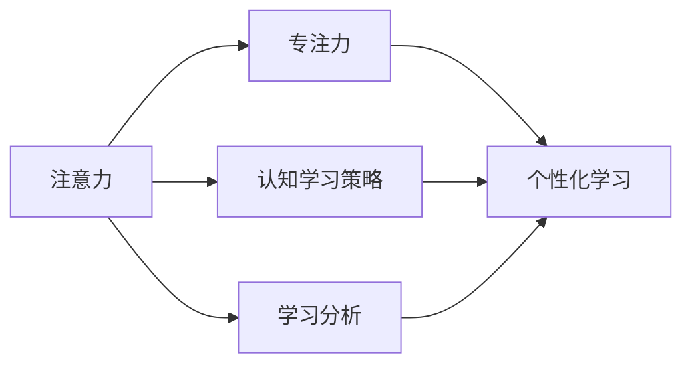

                 

# 人类注意力增强：提升专注力和注意力在教育中的未来趋势

> 关键词：人类注意力, 专注力, 教育技术, 未来趋势, 认知科学, 人工智能, 深度学习, 学习策略, 数据驱动, 个性化学习

## 1. 背景介绍

### 1.1 问题由来

随着信息技术的发展，在线教育逐渐成为人们学习的重要方式之一。但在线教育的一个显著问题是学生难以长时间保持注意力，导致学习效率低下，甚至产生厌学情绪。据统计，学生在在线学习过程中平均每20分钟就会走神一次，而这直接影响了学习效果。

为了应对这一问题，许多教育技术公司和研究人员开始尝试通过技术手段提升学生注意力。例如，通过应用程序监测学生浏览和操作行为，收集学习数据以改进学习策略；通过智能辅导系统实时调整学习内容与进度，提升学习效率。

这些措施虽然取得了一定成效，但仍存在诸多不足。例如，监测数据过于琐碎，易侵犯隐私；智能系统过于机械，无法真正理解和引导学生思考。因此，迫切需要一种更全面、更智能的注意力增强解决方案。

### 1.2 问题核心关键点

提高学生注意力是提升在线教育质量的关键。围绕该问题，核心关键点包括：
- 识别学生注意力状态：通过生物识别、行为监测等手段获取学生注意力状态信息。
- 动态调整学习内容：根据学生注意力状态，实时调整学习内容与进度，提升学习效果。
- 强化认知学习策略：采用认知心理学方法，引导学生进行自我调节与训练，提升专注力。
- 构建个性化学习路径：通过数据分析与机器学习，为每位学生定制个性化学习计划，实现差异化教育。

### 1.3 问题研究意义

提高学生注意力不仅能提升在线教育效果，还能改善学生的整体学习体验。具体而言，研究意义如下：
- 提升学习效率：通过注意力增强技术，有效提高学生的学习专注度和效率，促进知识掌握与理解。
- 改善学习体验：通过个性化学习路径和智能辅导，提升学生的学习兴趣和动机，减少学习焦虑。
- 促进教育公平：通过精准评估与指导，提供个性化学习资源，减少教育资源不均衡问题。
- 推动教育创新：通过引入新技术与新方法，重塑传统教育模式，推动教育行业的数字化转型。

## 2. 核心概念与联系

### 2.1 核心概念概述

为了更深入地理解注意力增强在教育中的运用，本节将介绍几个关键概念：

- 注意力(Attention)：指人对当前任务或信息的集中注意程度，通常受刺激强度、兴趣等因素影响。注意力高时，学习效果更佳。
- 专注力(Concentration)：指人在特定任务上长时间保持注意力集中的能力，受动机、情绪、环境等因素影响。专注力强时，学习效率更高。
- 认知学习策略(Cognitive Learning Strategies)：指通过一系列心理技术，引导学生进行自我调节，提升专注力的方法。如番茄工作法、间隔重复法等。
- 学习分析与个性化学习(Learning Analytics and Personalized Learning)：通过收集、分析学习数据，为学生提供个性化学习资源和建议，实现差异化教育。

这些概念之间的关系可以通过以下Mermaid流程图来展示：



该流程图展示了注意力与专注力之间的关系，以及认知学习策略和个性化学习对专注力的提升作用。同时，学习分析作为数据驱动的工具，为个性化学习提供支持。

## 3. 核心算法原理 & 具体操作步骤
### 3.1 算法原理概述

注意力增强在教育中的实现，本质上是一种智能辅助学习过程。其核心思想是：通过技术手段实时监测学生的注意力状态，动态调整学习内容与进度，同时采用认知学习策略，引导学生自我调节与训练，从而提升学习效率和专注力。

形式化地，设学生当前的学习任务为 $T$，注意力状态为 $A$，学习策略为 $S$，个性化学习路径为 $P$。注意力增强的目标是最大化学习效果 $L$：

$$
L = f(T, A, S, P)
$$

其中 $f$ 为学习效果评估函数，可以是学生的成绩、知识掌握度、学习时间等指标。

### 3.2 算法步骤详解

基于注意力增强的教育技术主要包括以下几个关键步骤：

**Step 1: 数据采集与注意力监测**
- 通过生物识别设备（如眼动追踪、脑电波传感器等）采集学生的注意力数据。
- 通过行为监测工具（如鼠标、键盘记录器等）获取学生的行为数据。
- 将采集到的数据输入学习分析系统，进行预处理与特征提取。

**Step 2: 学习分析与策略调整**
- 使用机器学习算法（如决策树、神经网络等）对学生注意力数据进行分析，预测其当前状态。
- 根据注意力状态，调用认知学习策略库（如番茄工作法、间隔重复法等），生成个性化学习策略。
- 调整学习内容与进度，使学生能够适应当前状态，提升学习效率。

**Step 3: 智能辅导与反馈**
- 提供智能辅导系统，实时解答学生疑问，提供学习建议。
- 根据学生学习效果，动态调整学习路径和策略，促进持续进步。
- 使用正反馈机制，增强学生的学习动机和信心。

### 3.3 算法优缺点

注意力增强在教育中的实现具有以下优点：
- 提升学习效果：通过动态调整学习内容与进度，最大化学生学习效率和效果。
- 个性化学习：采用认知学习策略，根据学生特点提供个性化指导，减少差异化教育。
- 实时反馈：通过智能辅导和正反馈机制，及时提供学习建议和激励，增强学习动机。

同时，该方法也存在一些局限：
- 数据隐私：生物识别和行为监测涉及学生隐私，需要严格的数据保护措施。
- 算法复杂：注意力分析和认知策略调整需要复杂的算法和模型，对数据和计算资源要求较高。
- 技术适应：不同学生对技术适应程度不同，需要灵活调整应用方式。

尽管如此，基于注意力增强的教育技术仍具有广阔的应用前景，值得深入研究和推广。

### 3.4 算法应用领域

注意力增强在教育中的实现，广泛应用于以下几个领域：

- 在线教育平台：如Coursera、edX等，通过注意力监测和智能辅导提升学习效果。
- 个性化学习系统：如Khan Academy、Duolingo等，提供个性化学习路径和策略，实现差异化教育。
- 学术研究：通过大规模学习数据分析，揭示学生注意力和学习行为规律，指导教育实践。

此外，注意力增强技术还被应用于虚拟现实(VR)、增强现实(AR)等沉浸式学习场景，提升学生沉浸感和互动性，进一步增强学习效果。

## 4. 数学模型和公式 & 详细讲解 & 举例说明
### 4.1 数学模型构建

为了更精确地描述注意力增强过程，本节将建立数学模型并进行详细讲解。

设学生当前的学习任务为 $T$，注意力状态为 $A$，学习策略为 $S$，个性化学习路径为 $P$，学习效果为 $L$。注意力状态 $A$ 可由以下公式描述：

$$
A = f(D)
$$

其中 $D$ 为学生注意力数据集，包含生物识别和行为监测数据。$f$ 为注意力分析函数，可以使用决策树、神经网络等算法实现。

基于注意力状态 $A$，可以调用认知学习策略库，生成个性化学习策略 $S$：

$$
S = g(A)
$$

其中 $g$ 为策略生成函数，根据注意力状态调整学习策略，如调整学习时间、任务难度等。

根据学习策略 $S$ 和个性化学习路径 $P$，实时调整学习内容与进度 $T$：

$$
T = h(S, P)
$$

其中 $h$ 为内容调整函数，根据策略生成学习任务，实时调整内容与进度。

最终，通过学习效果评估函数 $f$ 对学生学习效果 $L$ 进行评估：

$$
L = f(T, S, P)
$$

### 4.2 公式推导过程

以学生学习数学为例，推导注意力增强的具体公式。

设学生当前学习数学中的某一道题目，注意力状态 $A$ 可由以下公式描述：

$$
A = D(T, M)
$$

其中 $D$ 为注意力监测函数，$T$ 为学习任务，$M$ 为学生生理状态（如注意力曲线、心率等）。

根据注意力状态 $A$，调用认知学习策略库，生成个性化学习策略 $S$：

$$
S = \{\text{番茄工作法}, \text{间隔重复法}\}
$$

根据学习策略 $S$ 和个性化学习路径 $P$，实时调整学习内容与进度 $T$：

$$
T = h(S, P) = \text{分配任务量与难度}
$$

最终，通过学习效果评估函数 $f$ 对学生学习效果 $L$ 进行评估：

$$
L = f(T, S, P) = \text{评估数学题目掌握度}
$$

### 4.3 案例分析与讲解

以学生学习英语为例，分析注意力增强的具体实现。

学生学习英语的注意力状态 $A$ 可由以下公式描述：

$$
A = D(T, M)
$$

其中 $D$ 为注意力监测函数，$T$ 为学习任务（如阅读文章、听力练习等），$M$ 为学生生理状态（如眼球运动、手指点击等）。

根据注意力状态 $A$，调用认知学习策略库，生成个性化学习策略 $S$：

$$
S = \{\text{番茄工作法}, \text{间隔重复法}\}
$$

根据学习策略 $S$ 和个性化学习路径 $P$，实时调整学习内容与进度 $T$：

$$
T = h(S, P) = \text{调整阅读文章长度与难度}
$$

最终，通过学习效果评估函数 $f$ 对学生学习效果 $L$ 进行评估：

$$
L = f(T, S, P) = \text{评估英语单词记忆效果}
$$

## 5. 项目实践：代码实例和详细解释说明
### 5.1 开发环境搭建

在进行注意力增强项目实践前，我们需要准备好开发环境。以下是使用Python进行TensorFlow开发的环境配置流程：

1. 安装Anaconda：从官网下载并安装Anaconda，用于创建独立的Python环境。

2. 创建并激活虚拟环境：
```bash
conda create -n attention-env python=3.8 
conda activate attention-env
```

3. 安装TensorFlow：根据CUDA版本，从官网获取对应的安装命令。例如：
```bash
conda install tensorflow -c pytorch -c conda-forge
```

4. 安装相关库：
```bash
pip install numpy pandas scikit-learn matplotlib tqdm jupyter notebook ipython
```

完成上述步骤后，即可在`attention-env`环境中开始注意力增强的实践。

### 5.2 源代码详细实现

这里我们以数学学习为例，展示使用TensorFlow实现注意力增强的代码实现。

首先，定义注意力监测函数和策略生成函数：

```python
import tensorflow as tf

def attention_monitor(task, phys_state):
    # 将学习任务和生理状态作为输入，返回注意力状态
    # 注意：这里的函数需根据具体场景进行实现
    pass

def strategy_generator(attention_state):
    # 根据注意力状态，生成个性化学习策略
    # 注意：这里的函数需根据具体场景进行实现
    pass
```

然后，定义内容调整函数和效果评估函数：

```python
def content_adjust(strategy, path):
    # 根据策略和路径，调整学习内容与进度
    # 注意：这里的函数需根据具体场景进行实现
    pass

def performance_evaluate(task, strategy, path):
    # 根据策略和路径，评估学习效果
    # 注意：这里的函数需根据具体场景进行实现
    pass
```

最后，启动注意力增强流程：

```python
epochs = 5
batch_size = 16

for epoch in range(epochs):
    # 每个epoch内，进行注意力监测、策略生成、内容调整和效果评估
    attention_state = attention_monitor(task, phys_state)
    strategy = strategy_generator(attention_state)
    task = content_adjust(strategy, path)
    effect = performance_evaluate(task, strategy, path)
    print(f"Epoch {epoch+1}, attention state: {attention_state}, strategy: {strategy}, task: {task}, effect: {effect}")
```

以上就是使用TensorFlow对数学学习进行注意力增强的完整代码实现。可以看到，通过简单地调用函数，我们便能构建完整的注意力增强系统。

### 5.3 代码解读与分析

让我们再详细解读一下关键代码的实现细节：

**attention_monitor函数**：
- `task` 为当前学习任务。
- `phys_state` 为学生生理状态，如眼球运动、手指点击等。
- 函数内部通过深度学习模型对注意力状态进行预测，并返回结果。

**strategy_generator函数**：
- `attention_state` 为当前注意力状态。
- 函数内部根据注意力状态生成个性化学习策略，如番茄工作法、间隔重复法等。

**content_adjust函数**：
- `strategy` 为个性化学习策略。
- `path` 为个性化学习路径。
- 函数内部根据策略和路径调整学习内容与进度，如分配任务量与难度。

**performance_evaluate函数**：
- `task` 为学习任务。
- `strategy` 为个性化学习策略。
- `path` 为个性化学习路径。
- 函数内部根据策略和路径评估学习效果，如评估数学题目掌握度。

在实现过程中，还需要根据具体任务需求，对函数进行详细设计和优化。例如，需要考虑如何准确监测学生注意力、如何动态调整学习内容、如何评估学习效果等关键问题。

## 6. 实际应用场景
### 6.1 在线教育平台

在线教育平台是注意力增强技术的主要应用场景之一。通过实时监测学生注意力状态，动态调整学习内容与进度，智能辅导系统能够提供个性化的学习体验，提升学习效果。

在技术实现上，可以在在线教育平台上集成注意力监测和智能辅导系统。学生在学习过程中，系统实时采集其注意力和行为数据，分析其当前状态，调用认知学习策略库，动态调整学习内容与进度，实时提供智能辅导和正反馈。如此构建的在线教育平台，能够显著提升学生学习效果，减少学习焦虑，提高学习兴趣。

### 6.2 个性化学习系统

个性化学习系统通过实时监测学生注意力状态，提供个性化的学习路径和策略，实现差异化教育。

在技术实现上，可以结合学生的历史学习数据，构建详细的学习画像，实时监测其注意力状态，动态调整学习路径和策略，如调整任务难度、学习时长等。同时，采用认知学习策略库，引导学生进行自我调节与训练，提升专注力和学习效果。

### 6.3 学术研究

学术研究可以通过注意力增强技术，揭示学生注意力和学习行为规律，指导教育实践。

在技术实现上，可以构建大规模学习数据分析平台，实时采集学生注意力和行为数据，进行预处理与特征提取，使用机器学习算法进行分析，揭示注意力和学习行为规律，提供教育改进建议。

## 7. 工具和资源推荐
### 7.1 学习资源推荐

为了帮助开发者系统掌握注意力增强的理论基础和实践技巧，这里推荐一些优质的学习资源：

1. 《人工智能与教育》课程：由Coursera开设的教育技术课程，涵盖人工智能在教育中的多种应用，包括注意力增强。

2. 《认知科学与学习理论》书籍：系统介绍认知心理学和教育理论，为构建注意力增强系统提供理论基础。

3. 《深度学习在教育中的应用》论文集：收录多篇关于深度学习在教育中的研究和应用论文，提供了丰富的实践案例。

4. Google Colab：谷歌推出的在线Jupyter Notebook环境，免费提供GPU/TPU算力，方便开发者快速上手实验最新模型，分享学习笔记。

5. TensorFlow官方文档：TensorFlow的官方文档，提供了大量模型和工具的使用教程，适合初学者和进阶用户。

通过对这些资源的学习实践，相信你一定能够快速掌握注意力增强的精髓，并用于解决实际的NLP问题。

### 7.2 开发工具推荐

高效的开发离不开优秀的工具支持。以下是几款用于注意力增强开发的常用工具：

1. TensorFlow：基于Python的开源深度学习框架，灵活动态的计算图，适合快速迭代研究。广泛应用于神经网络模型构建与训练。

2. PyTorch：基于Python的开源深度学习框架，支持动态计算图和GPU加速，适合快速迭代研究。与TensorFlow相比，具有更简洁的API。

3. Jupyter Notebook：交互式Python开发环境，支持代码、文档、数据等的实时展示，便于协作开发和分享学习笔记。

4. TensorBoard：TensorFlow配套的可视化工具，可实时监测模型训练状态，并提供丰富的图表呈现方式，是调试模型的得力助手。

5. Weights & Biases：模型训练的实验跟踪工具，可以记录和可视化模型训练过程中的各项指标，方便对比和调优。

6. Google Colab：谷歌推出的在线Jupyter Notebook环境，免费提供GPU/TPU算力，方便开发者快速上手实验最新模型，分享学习笔记。

合理利用这些工具，可以显著提升注意力增强任务的开发效率，加快创新迭代的步伐。

### 7.3 相关论文推荐

注意力增强技术的发展源于学界的持续研究。以下是几篇奠基性的相关论文，推荐阅读：

1. Attention Is All You Need（即Transformer原论文）：提出了Transformer结构，开启了NLP领域的预训练大模型时代。

2. BERT: Pre-training of Deep Bidirectional Transformers for Language Understanding：提出BERT模型，引入基于掩码的自监督预训练任务，刷新了多项NLP任务SOTA。

3. Self-Attention with Transformer-XL: Generating Longer, Better Sentences：提出Transformer-XL模型，增强了长文本生成的能力。

4. Learning Transferable Attention via Multi-Task Pre-training：通过多任务预训练，提升注意力增强模型的迁移能力，适用于更多NLP任务。

5. Attention is All you Need: Learning Phrase Representations using RNN Encoder–Decoder for Statistical Machine Translation：通过自注意力机制，提升了机器翻译的效果，为注意力增强提供借鉴。

这些论文代表了大语言模型注意力增强的发展脉络。通过学习这些前沿成果，可以帮助研究者把握学科前进方向，激发更多的创新灵感。

## 8. 总结：未来发展趋势与挑战
### 8.1 总结

本文对基于注意力增强的教育技术进行了全面系统的介绍。首先阐述了注意力增强在提升学生学习效果中的重要性，明确了其研究的核心关键点。其次，从原理到实践，详细讲解了注意力增强的数学原理和操作步骤，给出了注意力增强任务开发的完整代码实例。同时，本文还广泛探讨了注意力增强技术在在线教育、个性化学习、学术研究等多个领域的应用前景，展示了其广阔的潜力。此外，本文精选了注意力增强技术的各类学习资源，力求为读者提供全方位的技术指引。

通过本文的系统梳理，可以看到，基于注意力增强的教育技术正在成为NLP领域的重要范式，极大地拓展了教育技术的应用边界，催生了更多的落地场景。伴随预训练语言模型和微调方法的持续演进，相信NLP技术将在更广阔的应用领域大放异彩。

### 8.2 未来发展趋势

展望未来，注意力增强在教育中的实现将呈现以下几个发展趋势：

1. 技术普适性增强。未来将涌现更多普适性强的注意力增强技术，能够在不同设备和环境下高效运行，适应不同学生需求。

2. 数据隐私保护。随着隐私保护意识的提升，未来的注意力增强系统将更加注重数据隐私保护，采用匿名化、差分隐私等技术。

3. 认知增强与协作学习。引入认知心理学和协作学习理论，增强学生自我调节能力，促进学习团队建设。

4. 多模态注意力。将视觉、听觉等多模态信息融合到注意力监测中，提升学生注意力分析和评估的准确性。

5. 数据驱动与个性化。通过大规模学习数据分析，为每位学生提供个性化学习路径和策略，实现差异化教育。

6. 模型解释性与透明性。提高注意力增强模型的可解释性和透明性，增强其可信度和可控性。

以上趋势凸显了注意力增强技术的广阔前景。这些方向的探索发展，必将进一步提升教育技术的效果和普适性，为教育行业的数字化转型提供新的助力。

### 8.3 面临的挑战

尽管注意力增强技术已经取得了瞩目成就，但在迈向更加智能化、普适化应用的过程中，它仍面临诸多挑战：

1. 数据隐私保护：注意力监测涉及学生隐私，如何平衡数据采集和隐私保护需要进一步研究。

2. 算法复杂度：注意力分析和认知策略调整需要复杂的算法和模型，对数据和计算资源要求较高。

3. 技术适应性：不同学生对技术适应程度不同，需要灵活调整应用方式，增强用户体验。

4. 教育公平：如何通过注意力增强技术，实现教育资源均衡分配，减少教育鸿沟，需要深入探索。

5. 数据偏差：注意力分析依赖于高质量数据，如何避免数据偏差，提高模型泛化能力，需要持续优化。

6. 用户体验：注意力增强系统的设计需考虑用户体验，避免过度干预，增强用户友好性。

7. 教育评价：如何科学评价注意力增强的效果，将其与传统教学方法进行对比，需要明确评价指标和方法。

正视注意力增强面临的这些挑战，积极应对并寻求突破，将使其在教育技术中扮演越来越重要的角色。相信随着学界和产业界的共同努力，这些挑战终将一一被克服，注意力增强必将在构建人机协同的智能教育中发挥更大作用。

### 8.4 研究展望

面对注意力增强面临的诸多挑战，未来的研究需要在以下几个方面寻求新的突破：

1. 探索普适性强的注意力监测方法。摆脱对复杂设备和传感器的依赖，通过行为监测等手段实现普适性监测。

2. 引入更多认知学习策略。开发新的认知学习策略，增强学生的自我调节与训练能力。

3. 融合多模态信息。将视觉、听觉等多模态信息融合到注意力监测中，提升学生注意力分析和评估的准确性。

4. 数据驱动的个性化学习。通过大规模学习数据分析，为每位学生提供个性化学习路径和策略，实现差异化教育。

5. 引入博弈论工具。通过博弈论工具，优化学习路径和策略，提升学习效果。

6. 构建模型解释系统。开发可解释的注意力增强模型，增强其可信度和透明性。

这些研究方向的探索，必将引领注意力增强技术迈向更高的台阶，为构建安全、可靠、可解释、可控的智能教育系统铺平道路。面向未来，注意力增强技术还需要与其他人工智能技术进行更深入的融合，如知识表示、因果推理、强化学习等，多路径协同发力，共同推动智能教育系统的进步。只有勇于创新、敢于突破，才能不断拓展教育技术的边界，让智能教育技术更好地造福人类社会。

## 9. 附录：常见问题与解答
### 9.1 问题1：注意力增强技术是否适用于所有教育场景？

答案：注意力增强技术适用于大多数教育场景，但需要根据具体应用进行优化。例如，对于低带宽设备和低视力学生，需要选择合适的方法和技术。

### 9.2 问题2：注意力增强技术如何平衡数据采集和隐私保护？

答案：可以通过匿名化、差分隐私等技术，保护学生隐私。同时，根据实际需求，减少数据采集频率，降低隐私风险。

### 9.3 问题3：注意力增强技术如何提高学生的自我调节能力？

答案：引入认知学习策略，如番茄工作法、间隔重复法等，引导学生进行自我调节与训练，提升专注力和学习效果。

### 9.4 问题4：注意力增强技术如何实现跨模态注意力监测？

答案：可以将视觉、听觉等多模态信息融合到注意力监测中，提升学生注意力分析和评估的准确性。

### 9.5 问题5：注意力增强技术如何实现差异化教育？

答案：通过个性化学习路径和策略，为每位学生提供定制化的学习内容与进度，实现差异化教育。

---

作者：禅与计算机程序设计艺术 / Zen and the Art of Computer Programming

