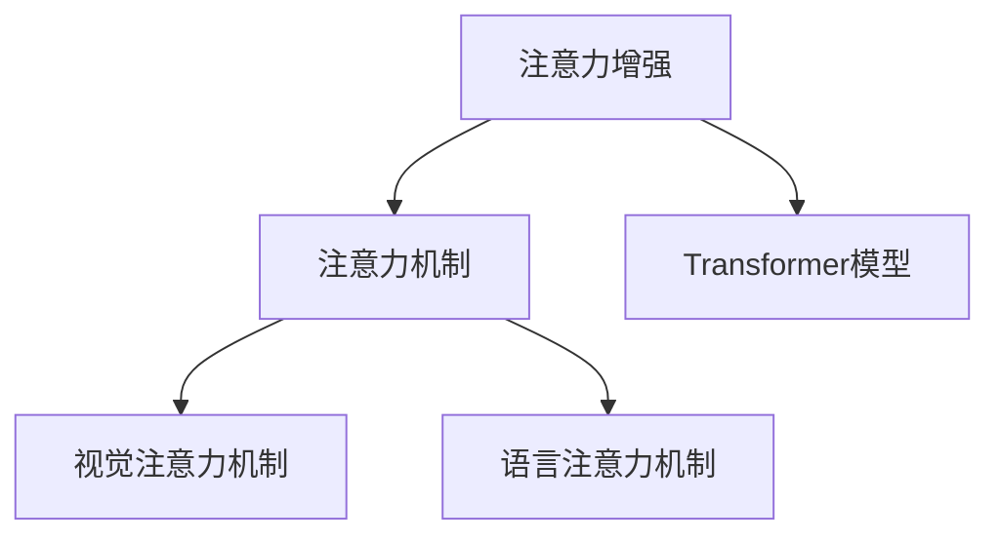

                 

## 1. 背景介绍

### 1.1 问题由来
人类社会进入21世纪以来，信息技术的飞速发展带来了前所未有的数据爆炸。在众多大数据应用场景中，注意力增强技术因其显著的创新能力和创造力而被广泛关注。随着深度学习与人工智能技术的不断发展，注意力机制在图像识别、自然语言处理、计算机视觉等领域取得了突破性进展。注意力增强技术已经在搜索引擎优化(Search Engine Optimization, SEO)、图像标注、自然语言处理、图像和视频生成等方面发挥着至关重要的作用。

### 1.2 问题核心关键点
注意力增强技术本质上是一种信息处理与分析的机制。它通过显著强化关键信息的获取能力，提高了系统的识别准确性和决策能力。注意力增强技术主要解决以下几个关键问题：

- **信息选择问题**：在海量数据中，如何高效选择和聚焦关键信息？
- **信息整合问题**：如何有效整合和利用分散在各个源的信息？
- **信息生成问题**：如何生成符合用户需求和逻辑推理的新信息？

注意力增强技术通过强化关键信息获取与选择，实现信息的高效整合与利用，从而提升系统的创新能力和创造力。

### 1.3 问题研究意义
探索注意力增强技术的研究意义主要体现在以下几个方面：

1. **提升数据处理效率**：通过注意力机制，系统可以更精准地聚焦关键信息，减少无效信息的干扰，从而提高数据处理效率。
2. **改善决策准确性**：精准选择关键信息，有助于提升模型的决策准确性，减少误判和遗漏。
3. **促进创新与创造**：通过增强信息的整合与利用能力，系统可以生成符合逻辑推理和用户需求的新信息，推动技术创新和创造力的提升。
4. **推动跨领域应用**：注意力增强技术具备通用性，可以应用于多个领域，促进人工智能技术的普适化和泛化应用。

## 2. 核心概念与联系

### 2.1 核心概念概述

为更好地理解注意力增强技术的原理和架构，本节将介绍几个密切相关的核心概念：

- **注意力机制(Attention Mechanism)**：一种信息选择与整合的技术，通过自顶向下的计算，动态地调整各个输入数据的权重，以获取和聚焦关键信息。
- **Transformer模型**：一种基于自注意力机制的神经网络架构，广泛应用于自然语言处理、图像识别等领域。
- **注意力增强(Attention Augmentation)**：通过强化注意力机制，提高系统的信息获取与整合能力，提升决策的准确性和系统的创新能力。
- **视觉注意力机制**：应用于计算机视觉领域，通过强化视觉输入中的关键区域，提升图像识别和理解的精度。
- **语言注意力机制**：应用于自然语言处理领域，通过强化语义信息的关联度，提升语义理解和生成能力。

这些核心概念之间的逻辑关系可以通过以下Mermaid流程图来展示：



这个流程图展示了几大核心概念之间的关系：

1. 注意力增强技术是核心，通过强化注意力机制实现信息选择与整合。
2. Transformer模型是实现注意力机制的关键架构，将注意力机制融入到神经网络模型中。
3. 视觉注意力和语言注意力是注意力机制在不同领域的特定应用，分别用于计算机视觉和自然语言处理。

## 3. 核心算法原理 & 具体操作步骤
### 3.1 算法原理概述

注意力增强技术通过动态地调整各个输入数据的权重，聚焦关键信息，提升系统的决策能力。具体来说，注意力增强技术通过自上而下的方式，逐层动态计算每个输入与输出之间的关联度，并根据这些关联度调整各输入数据的权重。

从算法层面来看，注意力增强技术的核心思想如下：

1. **计算注意力得分**：根据输入数据的特征和输出目标，计算每个输入数据的注意力得分。
2. **聚焦关键信息**：根据注意力得分，动态调整各个输入数据的权重，从而获取关键信息。
3. **生成输出结果**：将聚焦的关键信息进行整合与生成，得到最终的输出结果。

### 3.2 算法步骤详解

注意力增强技术的实现流程通常包括以下几个关键步骤：

**Step 1: 计算注意力得分**

注意力得分通常由注意力权重矩阵 $\text{Attention}_\theta (Q, K, V)$ 表示。其中 $Q$ 表示查询向量，$K$ 表示键向量，$V$ 表示值向量。注意力权重矩阵的每个元素表示输入数据的关联度，即注意力得分。注意力得分的计算公式如下：

$$
\text{Attention}_\theta (Q, K, V) = \text{softmax}\left(\frac{QK^T}{\sqrt{d}}\right)V
$$

其中 $d$ 为输入特征的维度，$softmax$ 函数将计算结果映射到 $[0, 1]$ 范围内，表示各个输入数据的权重。

**Step 2: 动态聚焦关键信息**

在得到注意力得分矩阵后，通过将每个输入数据乘以对应的权重，可以动态聚焦关键信息。计算公式如下：

$$
\text{Weighted Sum}(Q, K, V) = \sum_{i=1}^n \text{Attention}_\theta(Q, K_i, V_i)
$$

其中 $n$ 为输入数据的数量，$\text{Weighted Sum}$ 表示各输入数据动态聚焦后的结果。

**Step 3: 生成输出结果**

得到动态聚焦后的结果后，可以将其用于后续的生成和决策过程。例如在自然语言处理中，可以将动态聚焦后的结果用于语言模型或文本生成任务。

### 3.3 算法优缺点

注意力增强技术在提升系统的信息获取与整合能力方面具有以下优点：

1. **提高数据处理效率**：通过动态聚焦关键信息，减少无效数据的干扰，提高数据处理效率。
2. **改善决策准确性**：精准选择关键信息，有助于提升决策准确性，减少误判和遗漏。
3. **增强创新与创造能力**：通过增强信息的整合与利用能力，系统可以生成符合逻辑推理和用户需求的新信息，推动技术创新和创造力的提升。

同时，该技术也存在一些缺点：

1. **计算复杂度高**：注意力机制的计算复杂度较高，特别是在大规模数据集上。
2. **训练难度大**：注意力机制的训练过程需要大量的数据和计算资源，训练难度较大。
3. **解释性不足**：注意力机制的内部工作机制较为复杂，缺乏可解释性。

### 3.4 算法应用领域

注意力增强技术在多个领域得到了广泛应用，包括但不限于以下几个方面：

- **自然语言处理**：应用于机器翻译、文本生成、问答系统等任务，提升模型的语义理解能力和生成质量。
- **计算机视觉**：应用于图像识别、图像标注、图像生成等任务，提升模型的图像理解能力和视觉信息处理能力。
- **语音识别**：应用于语音情感识别、语音合成等任务，提升模型的语音理解能力和生成能力。
- **推荐系统**：应用于个性化推荐、广告推荐等任务，提升模型的推荐准确性和用户体验。
- **搜索引擎**：应用于信息检索、搜索结果排序等任务，提升系统的搜索效率和信息准确性。

## 4. 数学模型和公式 & 详细讲解  
### 4.1 数学模型构建

注意力增强技术的数学模型可以简化为注意力权重矩阵 $\text{Attention}_\theta (Q, K, V)$ 的计算。其中 $Q, K, V$ 分别表示查询向量、键向量和值向量，$\theta$ 表示注意力机制的参数。

注意力权重矩阵 $\text{Attention}_\theta (Q, K, V)$ 的具体计算公式如下：

$$
\text{Attention}_\theta (Q, K, V) = \text{softmax}\left(\frac{QK^T}{\sqrt{d}}\right)V
$$

其中 $d$ 为输入特征的维度，$softmax$ 函数将计算结果映射到 $[0, 1]$ 范围内，表示各个输入数据的权重。

### 4.2 公式推导过程

以Transformer模型为例，介绍注意力权重矩阵的推导过程。Transformer模型由编码器-解码器两部分组成，编码器包含多个自注意力层和前向网络层，解码器包含多个自注意力层、编码器注意力层和前向网络层。

以自注意力层为例，其计算过程如下：

1. **线性映射**：将输入向量 $X$ 映射为查询向量 $Q$、键向量 $K$ 和值向量 $V$。

$$
Q = XW^Q, \quad K = XW^K, \quad V = XW^V
$$

其中 $W^Q, W^K, W^V$ 为可学习矩阵。

2. **注意力得分计算**：计算注意力权重矩阵 $\text{Attention}_\theta(Q, K, V)$。

$$
\text{Attention}_\theta(Q, K, V) = \text{softmax}\left(\frac{QK^T}{\sqrt{d}}\right)V
$$

3. **注意力权重计算**：计算每个输入数据的注意力权重。

$$
\alpha_i = \text{Attention}_\theta(Q, K_i, V_i)
$$

4. **注意力向量计算**：根据注意力权重计算各个输入数据的加权和。

$$
Z_i = \alpha_i V_i
$$

5. **加权和向量生成**：将各个输入数据进行线性组合，生成加权和向量。

$$
Z = \sum_{i=1}^n \alpha_i V_i
$$

以上过程可以重复进行多个层，以逐步提升模型的注意力机制和信息整合能力。

### 4.3 案例分析与讲解

以自然语言处理中的机器翻译为例，说明注意力增强技术的具体应用。

假设需要将英文句子 "I am learning natural language processing" 翻译为中文。

1. **编码器阶段**：首先通过自注意力机制，将英文句子中的单词向量转化为语义表示向量。

2. **解码器阶段**：通过注意力机制，动态聚焦当前需要翻译的单词，并从编码器获取对应的语义表示向量。

3. **生成中文单词**：将每个单词的语义表示向量进行线性组合，生成中文单词的向量表示。

4. **输出中文翻译**：将向量表示转化为中文单词，完成翻译任务。

## 5. 项目实践：代码实例和详细解释说明
### 5.1 开发环境搭建

在进行注意力增强技术开发前，我们需要准备好开发环境。以下是使用Python进行PyTorch开发的环境配置流程：

1. 安装Anaconda：从官网下载并安装Anaconda，用于创建独立的Python环境。

2. 创建并激活虚拟环境：
```bash
conda create -n attention-env python=3.8 
conda activate attention-env
```

3. 安装PyTorch：根据CUDA版本，从官网获取对应的安装命令。例如：
```bash
conda install pytorch torchvision torchaudio cudatoolkit=11.1 -c pytorch -c conda-forge
```

4. 安装Transformers库：
```bash
pip install transformers
```

5. 安装各类工具包：
```bash
pip install numpy pandas scikit-learn matplotlib tqdm jupyter notebook ipython
```

完成上述步骤后，即可在`attention-env`环境中开始项目实践。

### 5.2 源代码详细实现

这里我们以Transformer模型为例，展示注意力增强技术在自然语言处理中的实现。

首先，定义Transformer模型类：

```python
import torch
import torch.nn as nn
import torch.nn.functional as F

class TransformerModel(nn.Module):
    def __init__(self, d_model, nhead, num_encoder_layers, num_decoder_layers, dff, attention_dropout_rate, dff_dropout_rate, activation_fn=nn.ReLU):
        super(TransformerModel, self).__init__()
        self.encoder = nn.TransformerEncoderLayer(d_model, nhead, dff, attention_dropout_rate, activation_fn)
        self.decoder = nn.TransformerDecoderLayer(d_model, nhead, dff, attention_dropout_rate, dff_dropout_rate, activation_fn)
        self.max_position_encoding = nn.Embedding(1000, d_model)
        self.final_layer = nn.Linear(d_model, 1)
    
    def forward(self, src, tgt, src_mask=None, tgt_mask=None):
        if src_mask is None:
            src_mask = self.max_position_encoding(1000)
        src = self.encoder(src, src_mask)
        tgt = self.decoder(tgt, src, tgt_mask)
        tgt = self.final_layer(tgt)
        return tgt
```

然后，定义注意力权重矩阵的计算函数：

```python
def attention(Q, K, V):
    d = Q.size(2)
    K = K.unsqueeze(1)
    Q = Q.unsqueeze(2)
    scores = Q.matmul(K.transpose(1, 2)).div_(d**0.5)
    attention_weights = F.softmax(scores, dim=-1)
    return attention_weights, attention_weights.matmul(V)
```

最后，训练和评估模型：

```python
from torch.utils.data import DataLoader
from tqdm import tqdm
from sklearn.metrics import classification_report

device = torch.device('cuda') if torch.cuda.is_available() else torch.device('cpu')
model = TransformerModel(d_model, nhead, num_encoder_layers, num_decoder_layers, dff, attention_dropout_rate, dff_dropout_rate).to(device)

optimizer = torch.optim.Adam(model.parameters(), lr=2e-5)
train_dataset = ...
train_loader = DataLoader(train_dataset, batch_size=32)
valid_dataset = ...
valid_loader = DataLoader(valid_dataset, batch_size=32)

for epoch in range(10):
    model.train()
    total_loss = 0
    for src, tgt in train_loader:
        src, tgt = src.to(device), tgt.to(device)
        output = model(src, tgt)
        loss = loss_function(output, tgt)
        optimizer.zero_grad()
        loss.backward()
        optimizer.step()
        total_loss += loss.item()

    model.eval()
    total_loss = 0
    for src, tgt in valid_loader:
        src, tgt = src.to(device), tgt.to(device)
        output = model(src, tgt)
        loss = loss_function(output, tgt)
        total_loss += loss.item()

    print('Epoch: {}, Loss: {:.4f}'.format(epoch+1, total_loss))
```

以上就是使用PyTorch对Transformer模型进行训练的完整代码实现。可以看到，Transformer模型通过多个自注意力层和前向网络层实现了注意力增强技术，可以高效地处理自然语言序列数据。

### 5.3 代码解读与分析

让我们再详细解读一下关键代码的实现细节：

**TransformerModel类**：
- `__init__`方法：初始化模型参数，包括编码器和解码器层数、隐藏维度、注意力机制的参数等。
- `forward`方法：定义模型的前向传播过程，包括编码器、解码器、输出层等。

**attention函数**：
- `attention`函数实现了注意力权重矩阵的计算过程，具体包括：
  - 将查询向量、键向量、值向量进行展开并计算注意力得分。
  - 使用`softmax`函数计算注意力权重。
  - 根据注意力权重计算动态聚焦后的结果。

**训练过程**：
- 在训练过程中，通过Adam优化器对模型参数进行更新，最小化损失函数。
- 在验证集上评估模型性能，输出损失结果。
- 在每个epoch结束时，打印出当前epoch的损失值。

## 6. 实际应用场景
### 6.1 智能问答系统

注意力增强技术在智能问答系统中得到了广泛应用。传统问答系统往往依赖人工构建规则，无法处理复杂的自然语言输入。通过引入注意力机制，系统可以动态聚焦关键信息，提升问题理解和回答的准确性。

例如，在问答系统中，将用户输入的查询与知识库中的信息进行匹配，通过自注意力机制计算各个信息的关联度，动态聚焦与问题相关的信息，最终生成回答。如此构建的智能问答系统，能够高效处理用户问题，提供更精准、更自然的回答。

### 6.2 个性化推荐系统

注意力增强技术在个性化推荐系统中同样具备显著优势。传统的推荐系统往往只能根据用户历史行为进行推荐，无法充分利用用户当前的需求和兴趣。通过引入注意力机制，系统可以动态聚焦关键信息，提升推荐质量。

例如，在推荐系统中，将用户当前的浏览行为与商品信息进行匹配，通过自注意力机制计算各个信息的关联度，动态聚焦与用户当前需求相关的商品信息，最终生成推荐列表。如此构建的个性化推荐系统，能够更好地满足用户需求，提升用户体验。

### 6.3 机器翻译

注意力增强技术在机器翻译中得到了广泛应用。传统的机器翻译模型往往只能逐词翻译，无法捕捉句子级别的语义信息。通过引入自注意力机制，系统可以动态聚焦关键信息，提升翻译质量。

例如，在机器翻译中，将源语言句子中的单词向量转化为语义表示向量，通过自注意力机制计算各个信息的关联度，动态聚焦与目标语言单词相关的信息，最终生成翻译结果。如此构建的机器翻译系统，能够生成更符合语义逻辑的翻译结果，提升翻译质量。

### 6.4 未来应用展望

随着注意力增强技术的不断发展，其在更多领域的应用前景值得期待：

1. **自动驾驶**：在自动驾驶中，注意力增强技术可以用于动态聚焦关键交通信息，提升车辆驾驶决策的准确性。
2. **医疗诊断**：在医疗诊断中，注意力增强技术可以用于动态聚焦关键医学信息，提升医生的诊断准确性和决策效率。
3. **智能制造**：在智能制造中，注意力增强技术可以用于动态聚焦关键生产信息，提升生产线的智能化和自动化水平。
4. **金融分析**：在金融分析中，注意力增强技术可以用于动态聚焦关键财务信息，提升金融分析的准确性和效率。

## 7. 工具和资源推荐
### 7.1 学习资源推荐

为了帮助开发者系统掌握注意力增强技术的理论基础和实践技巧，这里推荐一些优质的学习资源：

1. **《Attention is All You Need》**：Transformer模型的原始论文，详细介绍了自注意力机制的基本原理和应用。
2. **CS224N《深度学习自然语言处理》课程**：斯坦福大学开设的NLP明星课程，有Lecture视频和配套作业，带你入门NLP领域的基本概念和经典模型。
3. **《Natural Language Processing with Transformers》书籍**：Transformer库的作者所著，全面介绍了如何使用Transformers库进行NLP任务开发，包括注意力增强在内的诸多范式。
4. **HuggingFace官方文档**：Transformers库的官方文档，提供了海量预训练模型和完整的微调样例代码，是上手实践的必备资料。
5. **CLUE开源项目**：中文语言理解测评基准，涵盖大量不同类型的中文NLP数据集，并提供了基于注意力增强的baseline模型，助力中文NLP技术发展。

通过对这些资源的学习实践，相信你一定能够快速掌握注意力增强技术的精髓，并用于解决实际的NLP问题。

### 7.2 开发工具推荐

高效的开发离不开优秀的工具支持。以下是几款用于注意力增强技术开发的常用工具：

1. **PyTorch**：基于Python的开源深度学习框架，灵活动态的计算图，适合快速迭代研究。Transformer模型有PyTorch版本的实现。
2. **TensorFlow**：由Google主导开发的开源深度学习框架，生产部署方便，适合大规模工程应用。同样有丰富的Transformer模型资源。
3. **Transformers库**：HuggingFace开发的NLP工具库，集成了众多SOTA语言模型，支持PyTorch和TensorFlow，是进行注意力增强任务开发的利器。
4. **Weights & Biases**：模型训练的实验跟踪工具，可以记录和可视化模型训练过程中的各项指标，方便对比和调优。与主流深度学习框架无缝集成。
5. **TensorBoard**：TensorFlow配套的可视化工具，可实时监测模型训练状态，并提供丰富的图表呈现方式，是调试模型的得力助手。
6. **Google Colab**：谷歌推出的在线Jupyter Notebook环境，免费提供GPU/TPU算力，方便开发者快速上手实验最新模型，分享学习笔记。

合理利用这些工具，可以显著提升注意力增强技术的开发效率，加快创新迭代的步伐。

### 7.3 相关论文推荐

注意力增强技术的发展源于学界的持续研究。以下是几篇奠基性的相关论文，推荐阅读：

1. **Attention is All You Need**：提出Transformer模型，引入了自注意力机制，开创了深度学习模型的新纪元。
2. **BERT: Pre-training of Deep Bidirectional Transformers for Language Understanding**：提出BERT模型，利用自监督预训练任务，在自然语言处理领域取得了突破性进展。
3. **Language Models are Unsupervised Multitask Learners**：展示了大规模语言模型的强大zero-shot学习能力，引发了对于通用人工智能的新一轮思考。
4. **Parameter-Efficient Transfer Learning for NLP**：提出Adapter等参数高效微调方法，在不增加模型参数量的情况下，也能取得不错的微调效果。
5. **Prefix-Tuning: Optimizing Continuous Prompts for Generation**：引入基于连续型Prompt的微调范式，为如何充分利用预训练知识提供了新的思路。
6. **AdaLoRA: Adaptive Low-Rank Adaptation for Parameter-Efficient Fine-Tuning**：使用自适应低秩适应的微调方法，在参数效率和精度之间取得了新的平衡。

这些论文代表了大语言模型注意力增强技术的发展脉络。通过学习这些前沿成果，可以帮助研究者把握学科前进方向，激发更多的创新灵感。

## 8. 总结：未来发展趋势与挑战
### 8.1 总结

本文对注意力增强技术进行了全面系统的介绍。首先阐述了注意力增强技术的研究背景和意义，明确了其提升数据处理效率、改善决策准确性、增强创新与创造能力的独特价值。其次，从原理到实践，详细讲解了注意力增强技术的数学原理和实现流程，给出了微调技术开发的完整代码实例。同时，本文还广泛探讨了注意力增强技术在智能问答、个性化推荐、机器翻译等多个领域的应用前景，展示了其广泛的适用性和强大的创新能力。

通过本文的系统梳理，可以看到，注意力增强技术正在成为深度学习技术中的重要组成部分，极大地拓展了数据处理和信息获取的能力。面对未来的发展趋势和挑战，我们需要在多个维度进行深入研究，以推动该技术在各个领域的广泛应用。

### 8.2 未来发展趋势

展望未来，注意力增强技术将呈现以下几个发展趋势：

1. **计算复杂度降低**：随着计算资源和算法的不断优化，注意力机制的计算复杂度将进一步降低，更适用于大规模数据集的处理。
2. **训练效率提升**：通过优化注意力机制的训练过程，提升模型训练的速度和效率，进一步推动大规模深度学习模型的普及。
3. **跨领域应用拓展**：随着跨领域数据融合技术的不断发展，注意力增强技术将具备更广泛的应用场景，推动更多领域的技术进步。
4. **可解释性增强**：通过改进注意力机制的设计和实现，增强其可解释性，提升系统的透明度和可信度。
5. **多模态融合**：将视觉、语音、文本等多模态数据进行融合，提升系统的全面感知能力和信息处理能力。

以上趋势凸显了注意力增强技术的广阔前景。这些方向的探索发展，必将进一步提升深度学习系统的性能和应用范围，为各个领域带来革命性影响。

### 8.3 面临的挑战

尽管注意力增强技术已经取得了瞩目成就，但在迈向更加智能化、普适化应用的过程中，它仍面临着诸多挑战：

1. **训练难度大**：注意力机制的训练过程需要大量的数据和计算资源，训练难度较大。
2. **计算复杂度高**：注意力机制的计算复杂度较高，特别是在大规模数据集上。
3. **解释性不足**：注意力机制的内部工作机制较为复杂，缺乏可解释性。
4. **参数量较大**：大规模注意力模型的参数量较大，存储和部署难度较高。
5. **跨领域泛化能力不足**：不同领域的数据特征差异较大，跨领域泛化能力有待提升。

这些挑战需要通过更多研究和技术创新来逐步克服，推动注意力增强技术的发展和普及。

### 8.4 研究展望

面对注意力增强技术面临的挑战，未来的研究需要在以下几个方面寻求新的突破：

1. **无监督学习**：探索无需标注数据的注意力增强方法，提升模型泛化能力。
2. **计算复杂度优化**：研究更加高效的注意力计算方法，降低计算复杂度，提升训练效率。
3. **多模态融合**：研究视觉、语音、文本等多模态数据的融合技术，提升系统的全面感知能力。
4. **可解释性增强**：通过改进注意力机制的设计和实现，增强其可解释性，提升系统的透明度和可信度。
5. **跨领域泛化**：研究跨领域数据融合技术，提升模型的泛化能力和跨领域适应性。

这些研究方向的探索，必将引领注意力增强技术迈向更高的台阶，为构建智能、可信的深度学习系统铺平道路。面向未来，我们需要在多个维度进行深入研究，推动注意力增强技术的不断发展。

## 9. 附录：常见问题与解答

**Q1: 注意力增强技术是否适用于所有NLP任务？**

A: 注意力增强技术在大多数NLP任务上都能取得不错的效果，特别是对于需要聚焦关键信息的任务。但对于一些特定领域的任务，如医学、法律等，仅仅依靠通用语料预训练的模型可能难以很好地适应。此时需要在特定领域语料上进一步预训练，再进行微调，才能获得理想效果。此外，对于一些需要时效性、个性化很强的任务，如对话、推荐等，注意力增强方法也需要针对性的改进优化。

**Q2: 注意力增强技术是否需要大量的标注数据？**

A: 注意力增强技术在训练过程中确实需要大量的标注数据，这主要因为注意力机制的训练过程需要大量的样本进行优化。但相比于传统机器学习算法，注意力增强技术在标注数据量上的需求并不算高，且可以通过迁移学习等方法进行优化。在实际应用中，可以通过对少量标注数据进行增强，如通过回译、近义替换等方式扩充训练集，从而提升模型的泛化能力。

**Q3: 注意力增强技术是否会带来计算复杂度的增加？**

A: 注意力增强技术的计算复杂度确实较高，特别是在大规模数据集上。但通过优化注意力机制的设计和实现，可以有效降低计算复杂度。例如，可以使用自注意力机制进行优化，减少计算量；或者采用并行计算和分布式训练，提升计算效率。另外，也可以使用混合精度训练等技术，进一步降低计算复杂度。

**Q4: 注意力增强技术在多模态数据融合中的应用效果如何？**

A: 注意力增强技术在多模态数据融合中具有显著优势，可以动态聚焦关键信息，提升系统的感知能力和信息整合能力。例如，在计算机视觉中，可以将视觉信息和文本信息进行融合，通过自注意力机制计算各个信息的关联度，动态聚焦与任务相关的信息，最终生成更准确的视觉-文本融合结果。在自然语言处理中，可以将语音信息、文本信息、视觉信息等多种模态数据进行融合，提升系统的理解能力和生成能力。

**Q5: 注意力增强技术在智能推荐系统中的应用效果如何？**

A: 注意力增强技术在智能推荐系统中同样具备显著优势，可以动态聚焦关键信息，提升推荐质量。例如，在推荐系统中，可以将用户的历史行为、当前需求、商品信息等多种数据进行融合，通过自注意力机制计算各个信息的关联度，动态聚焦与用户当前需求相关的商品信息，最终生成个性化推荐结果。如此构建的推荐系统，能够更好地满足用户需求，提升用户体验。

**Q6: 注意力增强技术在机器翻译中的应用效果如何？**

A: 注意力增强技术在机器翻译中得到了广泛应用，显著提升了翻译质量。例如，在机器翻译中，将源语言句子中的单词向量转化为语义表示向量，通过自注意力机制计算各个信息的关联度，动态聚焦与目标语言单词相关的信息，最终生成翻译结果。如此构建的机器翻译系统，能够生成更符合语义逻辑的翻译结果，提升翻译质量。

通过这些问答，可以看到，注意力增强技术在多个领域得到了广泛应用，具有显著的创新能力和创造力。未来，随着技术的不断进步和优化，该技术将在更多领域发挥重要作用，推动人工智能技术的普适化和泛化应用。

---

作者：禅与计算机程序设计艺术 / Zen and the Art of Computer Programming

