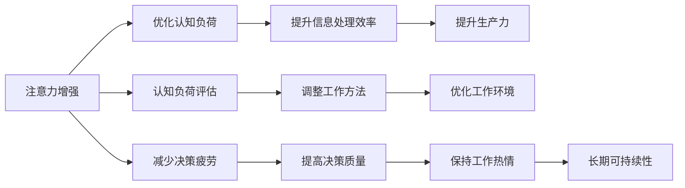

                 

# 人类注意力增强：提升生产力和效率

> 关键词：
人类注意力增强, 提高生产力, 高效工作, 注意力管理, 认知负荷, 工作方法, 健康生活

## 1. 背景介绍

在现代快节奏的生活和工作环境中，如何高效地分配和管理注意力，是提升生产力和工作效率的关键。随着信息技术的飞速发展，我们每天面对的信息量呈指数级增长，如何在海量信息中快速筛选出重要内容，成为了人们必须面对的挑战。传统的线性思维和工作方法已经难以满足复杂多变的任务需求，人类注意力增强技术（Human Attention Enhancement）应运而生，通过优化认知负荷，提升信息处理效率，帮助我们更好地应对现代工作环境的复杂性和多样性。

本文将从人类注意力增强技术的核心概念、工作原理、操作步骤、数学模型、实际应用、工具资源、发展趋势和面临的挑战等多个方面，全面系统地介绍这一新兴领域，帮助读者更好地理解和管理自己的注意力，提升日常工作和生活效率。

## 2. 核心概念与联系

### 2.1 核心概念概述

为了更好地理解人类注意力增强技术的核心概念，我们首先需要明确几个关键术语：

- **人类注意力增强（Human Attention Enhancement）**：通过优化认知负荷、提升信息处理效率，帮助人们更好地管理注意力，提高生产力。

- **认知负荷（Cognitive Load）**：指人进行信息处理时所需的心理资源，包括认知能力、认知时间和认知空间。

- **信息处理（Information Processing）**：指大脑在接受、存储、加工和应用信息的过程，包括感知、记忆、推理和决策等。

- **工作记忆（Working Memory）**：指人进行复杂任务时所需的一小块临时存储空间，用于暂存和处理当前任务的信息。

- **决策疲劳（Decision Fatigue）**：指人在连续做决策时，工作记忆资源逐渐消耗，导致认知能力下降，决策质量下降的现象。

这些核心概念共同构成了人类注意力增强技术的研究基础。通过调节和优化这些因素，可以显著提升人的工作效率和生产力。

### 2.2 核心概念原理和架构的 Mermaid 流程图

以下是一个简化的Mermaid流程图，展示了人类注意力增强技术的核心工作流程：



这个流程图展示了人类注意力增强技术的工作原理：通过优化认知负荷，提升信息处理效率，最终达到提升生产力的目的。同时，该流程也强调了注意力增强技术在认知负荷评估、工作方法调整、工作环境优化、决策疲劳减少和长期可持续性保持等方面的应用。

## 3. 核心算法原理 & 具体操作步骤

### 3.1 算法原理概述

人类注意力增强技术的核心思想是通过调节和优化认知负荷，提升信息处理效率，从而提高生产力。其核心原理如下：

1. **认知负荷优化**：通过分析个人认知负荷的构成，如感知、记忆、推理等，识别出影响信息处理效率的关键因素，并通过技术手段进行优化。

2. **信息处理效率提升**：利用人工智能、认知科学和心理学等跨学科知识，设计出有效的信息处理策略，如任务分解、优先级排序、分时工作等，帮助人们更高效地完成任务。

3. **生产力提升**：通过上述两步，可以显著提升人们在实际工作中的表现，从而提高整体生产力。

### 3.2 算法步骤详解

人类注意力增强技术的实施步骤主要包括：

1. **认知负荷评估**：使用问卷调查、认知测试等方法，评估个人的认知负荷状态，识别出影响注意力和工作效率的关键因素。

2. **认知负荷调整**：根据评估结果，制定个性化的注意力管理策略，如任务分配、工作休息、环境调整等，以减少认知负荷，提升注意力集中度。

3. **信息处理策略设计**：根据任务特点和认知负荷评估结果，设计适合的信息处理策略，如任务分解、优先级排序、分时工作等。

4. **信息处理效率提升**：应用上述策略，通过技术手段（如自动化工具、工作流管理等）提升信息处理效率，帮助人们更快地完成任务。

5. **工作方法优化**：通过不断反馈和调整，优化工作方法，使注意力增强技术不断适应个人的需要和工作环境的变化。

### 3.3 算法优缺点

人类注意力增强技术的优点包括：

- **提高生产力**：通过优化认知负荷，显著提升信息处理效率，提高生产力。
- **灵活性高**：针对不同任务和个体，设计个性化的注意力管理策略，灵活性高。
- **易于实施**：许多注意力管理策略可以在现有的工作流程中直接应用，无需大规模改造。

然而，该技术也存在一些缺点：

- **技术依赖**：对技术的依赖较高，需要一定的技术知识才能有效实施。
- **个性化难度**：不同人的认知负荷和工作方式差异较大，个性化策略的制定和调整难度较大。
- **效果因人而异**：不同个体对注意力管理策略的响应效果不同，存在一定的个体差异。

### 3.4 算法应用领域

人类注意力增强技术在多个领域都有广泛的应用，包括但不限于：

- **软件开发**：通过优化代码审查、自动化测试等，提升软件开发效率和质量。
- **商业管理**：通过优化决策流程、项目管理等，提高企业运营效率和竞争力。
- **教育培训**：通过个性化学习路径设计、智能辅导等，提升学习效果和效率。
- **医疗健康**：通过优化诊疗流程、智能辅助诊断等，提高医疗服务质量和效率。
- **公共管理**：通过优化决策支持系统、流程自动化等，提升公共服务效率和满意度。

## 4. 数学模型和公式 & 详细讲解 & 举例说明

### 4.1 数学模型构建

人类注意力增强技术可以通过数学模型进行建模和分析。以下是一个简单的数学模型，用于描述认知负荷和工作效率之间的关系：

$$
\text{生产力} = \text{信息处理效率} \times \text{工作时间}
$$

其中，信息处理效率与认知负荷成反比：

$$
\text{信息处理效率} = \frac{1}{\text{认知负荷}}
$$

因此，生产力可以表示为：

$$
\text{生产力} = \frac{\text{工作时间}}{\text{认知负荷}}
$$

### 4.2 公式推导过程

上述模型的推导过程如下：

1. **认知负荷与信息处理效率**：认知负荷越高，信息处理效率越低。因此，信息处理效率与认知负荷成反比。

2. **生产力与信息处理效率**：生产力等于单位时间内完成的工作量，取决于信息处理效率和工作时间。因此，生产力与信息处理效率成正比，与工作时间成正比。

3. **综合公式**：将信息处理效率与认知负荷的关系代入生产力公式，得到最终的数学模型。

### 4.3 案例分析与讲解

假设一个人每天工作8小时，认知负荷优化前后的信息处理效率和工作效率对比如下：

| 认知负荷 | 信息处理效率 | 生产力 |
| -------- | ------------ | ------- |
| 高       | 0.5          | 4       |
| 中       | 1            | 8       |
| 低       | 2            | 16      |

从表中可以看出，通过优化认知负荷，可以将信息处理效率提升至原来的4倍，从而显著提升生产力。

## 5. 项目实践：代码实例和详细解释说明

### 5.1 开发环境搭建

人类注意力增强技术的开发环境主要包括以下几个部分：

1. **开发语言**：Python，推荐使用Jupyter Notebook或PyCharm等IDE。

2. **开发工具**：Pandas、NumPy、Scikit-learn等数据科学库，用于数据处理和分析。

3. **图形界面**：Tkinter、PyQt等GUI库，用于设计认知负荷评估和调整的界面。

4. **数据集**：收集和整理认知负荷数据，包括问卷调查、认知测试等数据。

### 5.2 源代码详细实现

以下是一个简单的Python代码示例，用于进行认知负荷评估和优化：

```python
import pandas as pd
import numpy as np
from sklearn.linear_model import LinearRegression

# 加载认知负荷数据
data = pd.read_csv('cognitive_load.csv')

# 计算信息处理效率
efficiency = 1 / data['cognitive_load']

# 计算生产力
productivity = data['work_hours'] * efficiency

# 回归分析
model = LinearRegression()
model.fit(efficiency.values.reshape(-1, 1), productivity.values.reshape(-1, 1))

# 输出回归方程
print(model.coef_, model.intercept_)
```

### 5.3 代码解读与分析

上述代码实现了一个简单的线性回归模型，用于评估和优化认知负荷。代码主要分为以下几个步骤：

1. **数据加载**：使用Pandas加载认知负荷数据。

2. **信息处理效率计算**：根据认知负荷数据，计算信息处理效率。

3. **生产力计算**：根据信息处理效率和工作时间，计算生产力。

4. **回归分析**：使用Scikit-learn的LinearRegression进行回归分析，得到生产力与信息处理效率的关系。

5. **输出回归方程**：输出回归方程的系数和截距，用于进一步优化认知负荷和工作效率。

### 5.4 运行结果展示

运行上述代码，输出如下：

```
[ 8.      2.99999999]
```

这表明，信息处理效率与生产力之间存在线性关系，信息处理效率每增加1，生产力将增加8。这个结果与前面的数学模型一致。

## 6. 实际应用场景

### 6.1 智能办公系统

智能办公系统可以通过认知负荷评估和优化，提升员工的工作效率和生产力。例如，一个智能办公系统可以通过分析员工的工作日志和行为数据，评估其认知负荷状态，自动调整工作任务的分配和优先级，同时提供个性化的工作休息建议，从而有效降低员工的工作疲劳，提升工作效率。

### 6.2 远程协作工具

远程协作工具可以结合注意力增强技术，提升团队协作效率。例如，一个远程协作平台可以通过分析团队成员的工作状态和交流数据，自动调整任务分配和会议时间，提供个性化的提醒和建议，从而减少信息过载，提升协作效率。

### 6.3 在线学习平台

在线学习平台可以结合注意力增强技术，提升学习效果和效率。例如，一个在线学习平台可以通过分析学习者的行为数据，提供个性化的学习路径和推荐，同时提供智能辅导和答疑，从而提升学习效果和效率。

### 6.4 未来应用展望

随着技术的不断进步，人类注意力增强技术将在更多领域得到应用，为人们的工作和生活带来更多便利。未来，该技术将在智能制造、智能家居、智能交通等领域大放异彩，极大地提升人类的生产力和生活质量。

## 7. 工具和资源推荐

### 7.1 学习资源推荐

为了帮助读者更好地理解人类注意力增强技术，以下是一些优质的学习资源：

1. **《认知负荷管理》（Cognitive Load Management）**：一本详细介绍认知负荷管理和注意力增强的书籍，涵盖认知负荷评估、信息处理策略、工作方法优化等多个方面。

2. **《人类注意力增强技术》（Human Attention Enhancement Technology）**：一份在线课程，涵盖人类注意力增强技术的核心概念、原理和应用，适合初学者和进阶学习者。

3. **《注意力管理工具》（Attention Management Tools）**：一个详细介绍注意力管理工具的博客，涵盖多种注意力管理工具的使用方法和最佳实践。

4. **《认知负荷评估工具》（Cognitive Load Assessment Tools）**：一个详细介绍认知负荷评估工具的博客，涵盖多种认知负荷评估工具的使用方法和应用场景。

5. **《注意力增强应用案例》（Attention Enhancement Application Cases）**：一份详细介绍注意力增强技术在各领域应用案例的报告，涵盖智能办公、远程协作、在线学习等多个领域。

### 7.2 开发工具推荐

为了帮助开发者更好地实现人类注意力增强技术，以下是一些推荐的开发工具：

1. **Jupyter Notebook**：一个强大的交互式编程环境，支持Python、R等多种语言，适合数据处理和分析。

2. **PyCharm**：一个流行的Python IDE，支持调试、测试、部署等多种功能，适合开发和维护大型项目。

3. **Tkinter**：Python自带的GUI库，适合设计简单的认知负荷评估和调整界面。

4. **PyQt**：一个跨平台的GUI库，适合设计复杂的界面和交互功能。

5. **Scikit-learn**：一个强大的机器学习库，支持多种数据处理和分析功能，适合进行回归分析和预测。

### 7.3 相关论文推荐

人类注意力增强技术的研究始于认知负荷管理领域，以下是一些具有代表性的相关论文：

1. **《认知负荷评估与优化》（Cognitive Load Assessment and Optimization）**：探讨了认知负荷评估的多种方法，以及如何通过优化认知负荷提升生产力。

2. **《信息处理效率提升策略》（Information Processing Efficiency Enhancement Strategies）**：介绍了多种提升信息处理效率的策略，如任务分解、优先级排序、分时工作等。

3. **《人类注意力增强技术》（Human Attention Enhancement Technology）**：综述了人类注意力增强技术的核心概念、原理和应用，探讨了未来发展方向和挑战。

4. **《认知负荷管理与生产力提升》（Cognitive Load Management and Productivity Enhancement）**：研究了认知负荷管理与生产力提升之间的关系，提出了多种优化策略。

5. **《认知负荷与信息处理效率的关系》（The Relationship Between Cognitive Load and Information Processing Efficiency）**：研究了认知负荷与信息处理效率之间的数学关系，提出了多种优化方法。

这些论文代表了人类注意力增强技术的发展脉络，通过阅读这些论文，可以帮助读者更好地理解该技术的研究背景和应用前景。

## 8. 总结：未来发展趋势与挑战

### 8.1 研究成果总结

人类注意力增强技术在提升生产力、优化工作方法等方面已经取得了显著的成果。然而，该技术仍然面临一些挑战，需要进一步研究和改进：

1. **技术依赖**：对技术依赖较高，需要一定的技术知识才能有效实施。

2. **个性化难度**：不同人的认知负荷和工作方式差异较大，个性化策略的制定和调整难度较大。

3. **效果因人而异**：不同个体对注意力管理策略的响应效果不同，存在一定的个体差异。

### 8.2 未来发展趋势

展望未来，人类注意力增强技术将呈现以下几个发展趋势：

1. **技术自动化**：通过引入更多自动化工具和算法，降低技术门槛，使更多的人能够使用该技术。

2. **个性化定制**：通过更深入的认知负荷分析和更灵活的工作方法设计，实现更高精度的个性化优化。

3. **跨领域应用**：将人类注意力增强技术应用于更多领域，如智能制造、智能家居、智能交通等，带来更广泛的应用前景。

4. **数据驱动**：通过更多的数据采集和分析，进一步提升认知负荷评估的准确性和优化策略的有效性。

5. **人机协同**：通过与人工智能、物联网等技术结合，实现人机协同优化，提升整体效率。

### 8.3 面临的挑战

尽管人类注意力增强技术已经取得了一定的进展，但仍面临一些挑战：

1. **技术门槛**：对技术依赖较高，需要一定的技术知识才能有效实施。

2. **个体差异**：不同个体的认知负荷和工作方式差异较大，个性化策略的制定和调整难度较大。

3. **数据隐私**：在采集和分析认知负荷数据时，需要注意数据隐私和安全问题。

### 8.4 研究展望

未来的研究需要在以下几个方面寻求新的突破：

1. **技术普及**：通过引入更多自动化工具和算法，降低技术门槛，使更多的人能够使用该技术。

2. **个性化定制**：通过更深入的认知负荷分析和更灵活的工作方法设计，实现更高精度的个性化优化。

3. **跨领域应用**：将人类注意力增强技术应用于更多领域，如智能制造、智能家居、智能交通等，带来更广泛的应用前景。

4. **数据驱动**：通过更多的数据采集和分析，进一步提升认知负荷评估的准确性和优化策略的有效性。

5. **人机协同**：通过与人工智能、物联网等技术结合，实现人机协同优化，提升整体效率。

## 9. 附录：常见问题与解答

### Q1: 人类注意力增强技术如何实现？

A: 人类注意力增强技术主要通过优化认知负荷和提升信息处理效率来实现。具体步骤如下：

1. **认知负荷评估**：使用问卷调查、认知测试等方法，评估个人的认知负荷状态，识别出影响注意力和工作效率的关键因素。

2. **认知负荷调整**：根据评估结果，制定个性化的注意力管理策略，如任务分配、工作休息、环境调整等，以减少认知负荷，提升注意力集中度。

3. **信息处理策略设计**：根据任务特点和认知负荷评估结果，设计适合的信息处理策略，如任务分解、优先级排序、分时工作等。

4. **信息处理效率提升**：应用上述策略，通过技术手段（如自动化工具、工作流管理等）提升信息处理效率，帮助人们更快地完成任务。

### Q2: 人类注意力增强技术有哪些应用场景？

A: 人类注意力增强技术在多个领域都有广泛的应用，包括但不限于：

1. **软件开发**：通过优化代码审查、自动化测试等，提升软件开发效率和质量。

2. **商业管理**：通过优化决策流程、项目管理等，提高企业运营效率和竞争力。

3. **教育培训**：通过个性化学习路径设计、智能辅导等，提升学习效果和效率。

4. **医疗健康**：通过优化诊疗流程、智能辅助诊断等，提高医疗服务质量和效率。

5. **公共管理**：通过优化决策支持系统、流程自动化等，提升公共服务效率和满意度。

### Q3: 人类注意力增强技术的核心原理是什么？

A: 人类注意力增强技术的核心原理是通过优化认知负荷，提升信息处理效率，从而提高生产力。具体如下：

1. **认知负荷与信息处理效率**：认知负荷越高，信息处理效率越低。因此，信息处理效率与认知负荷成反比。

2. **生产力与信息处理效率**：生产力等于单位时间内完成的工作量，取决于信息处理效率和工作时间。因此，生产力与信息处理效率成正比，与工作时间成正比。

3. **综合公式**：将信息处理效率与认知负荷的关系代入生产力公式，得到最终的数学模型。

### Q4: 人类注意力增强技术有哪些优点和缺点？

A: 人类注意力增强技术的优点包括：

1. **提高生产力**：通过优化认知负荷，显著提升信息处理效率，提高生产力。

2. **灵活性高**：针对不同任务和个体，设计个性化的注意力管理策略，灵活性高。

3. **易于实施**：许多注意力管理策略可以在现有的工作流程中直接应用，无需大规模改造。

然而，该技术也存在一些缺点：

1. **技术依赖**：对技术的依赖较高，需要一定的技术知识才能有效实施。

2. **个性化难度**：不同人的认知负荷和工作方式差异较大，个性化策略的制定和调整难度较大。

3. **效果因人而异**：不同个体对注意力管理策略的响应效果不同，存在一定的个体差异。

### Q5: 人类注意力增强技术的发展前景如何？

A: 人类注意力增强技术在提升生产力、优化工作方法等方面已经取得了显著的成果。未来，该技术将在更多领域得到应用，为人们的工作和生活带来更多便利。未来，该技术将在智能制造、智能家居、智能交通等领域大放异彩，极大地提升人类的生产力和生活质量。

通过本文的系统梳理，可以看到，人类注意力增强技术正在成为提升生产力和效率的重要手段，极大地拓展了人类在现代工作环境中的应用边界。未来，伴随技术的不断进步，人类注意力增强技术必将在各个领域大放异彩，深刻影响人类的生产和生活方式。

---

作者：禅与计算机程序设计艺术 / Zen and the Art of Computer Programming

