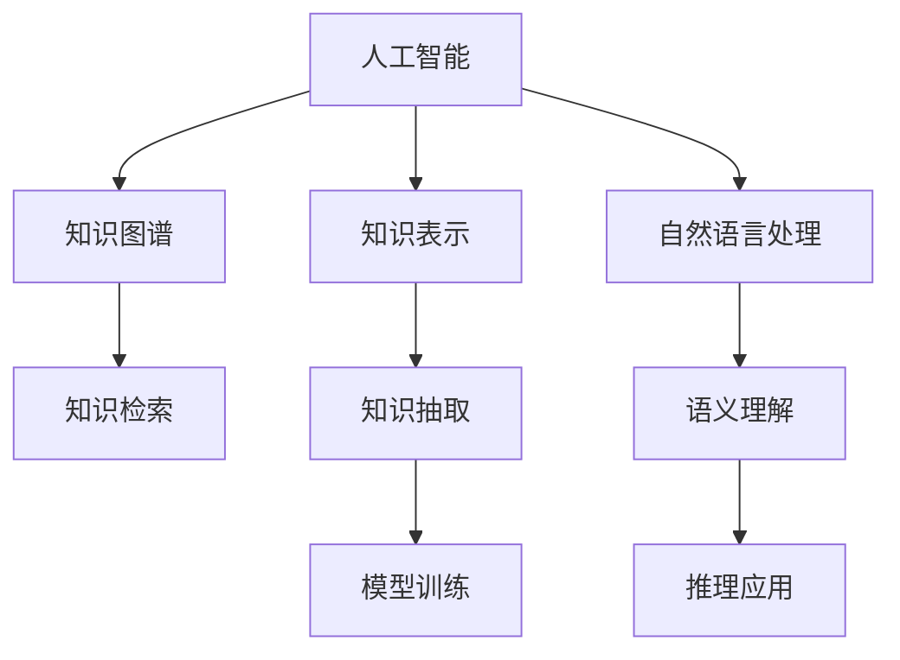
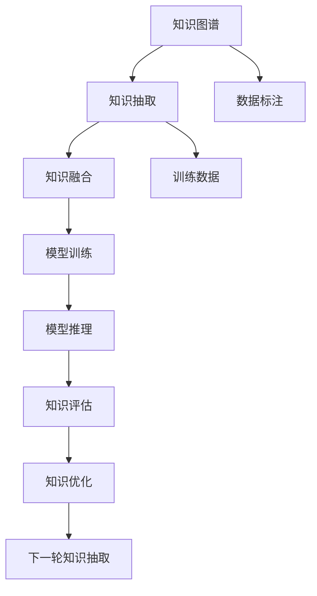

                 

# 人类的知识与权力：知识就是力量

> 关键词：人工智能,知识图谱,人工智能与知识工程,知识表示,知识检索,自然语言处理(NLP)

## 1. 背景介绍

### 1.1 问题由来
在过去的几十年里，计算机科学已经经历了翻天覆地的变化，从最早的电子管计算机，到今天的量子计算机，科技的进步推动了人类社会的发展。而其中，人工智能(AI)作为计算机科学的重点分支之一，以惊人的速度发展和迭代。人工智能的最终目标，是通过算法和模型，赋予计算机系统如同人类一样的智能能力。然而，这一目标的实现，不仅需要算力的提升，更需要知识的支撑。

人工智能系统，尤其是深度学习系统，本质上是对数据进行抽象和分析的工具。从最初的监督学习、无监督学习，到今天的强化学习，它们都需要海量的数据和复杂的模型来处理。但是，数据本身并不能完全代表智慧，它需要与知识相结合，才能发挥更大的作用。知识可以提供背景信息，帮助模型更好地理解数据，从而提升预测、推理和决策的准确性。

因此，人工智能的发展离不开知识的参与。而知识工程作为AI的重要组成部分，通过对知识进行组织、管理和应用，成为人工智能的核心技术之一。本文将从知识工程的角度，探讨人工智能系统如何获取、整合和应用知识，从而提升其能力和效率。

## 2. 核心概念与联系

### 2.1 核心概念概述

在讨论知识与AI的关系时，需要首先明确几个关键概念：

- **人工智能**：一种模拟人类智能的技术，通过算法和模型，实现对数据的学习和推理。
- **知识图谱**：一种结构化的知识表示形式，用于描述实体及其之间的关系。
- **知识表示**：如何将知识形式化，使其能够被计算机理解和处理。
- **知识检索**：从大量知识源中，高效检索出需要的知识信息。
- **自然语言处理(NLP)**：使计算机能够理解、处理和生成人类语言的技术。

这些概念之间存在着紧密的联系。人工智能系统通过知识图谱和知识检索技术，从海量数据中抽取有价值的知识，并将其应用于模型的训练和推理中。NLP技术则帮助计算机更好地理解和处理自然语言，使得知识抽取和应用更加高效和精准。

这些核心概念的联系，可以通过以下Mermaid流程图来展示：



这个流程图展示了知识与人工智能的联系：

1. 知识图谱和知识表示是知识工程的基础，提供了结构化的知识模型。
2. 知识检索从数据中抽取有用的知识，形成知识库。
3. 知识抽取利用NLP技术，从文本中提取具体事实。
4. 模型训练和推理应用则是AI的核心，利用抽取的知识提升模型性能。

这些概念共同构成了人工智能系统的知识驱动架构，使得AI系统能够在处理数据时，具备更强的背景理解和知识利用能力。

## 3. 核心算法原理 & 具体操作步骤
### 3.1 算法原理概述

知识与AI系统的结合，本质上是通过知识抽取和整合，提升模型的准确性和泛化能力。这一过程可以分为以下几个关键步骤：

1. **知识图谱构建**：通过手工构建或自动构建，将领域内的实体和关系结构化，形成知识图谱。
2. **知识抽取**：利用自然语言处理技术，从文本数据中提取具体事实和关系。
3. **知识融合**：将抽取的知识与模型参数相结合，进行训练和推理。
4. **知识评估**：通过评估模型在特定任务上的性能，反馈和优化知识抽取和融合的过程。

这一流程可以用以下示意图来表示：



这个图展示了知识与AI系统结合的基本流程：

1. 知识图谱作为模型训练和推理的背景知识。
2. 知识抽取将文本数据转换为具体的事实和关系。
3. 知识融合将抽取的知识与模型参数结合，优化模型的性能。
4. 模型推理应用知识，进行决策和预测。
5. 知识评估和优化反馈，进一步提升知识抽取和融合的准确性。

### 3.2 算法步骤详解

下面将详细介绍知识与AI系统结合的关键算法步骤。

#### 3.2.1 知识图谱构建

知识图谱是一种结构化的知识表示形式，由节点和边组成。节点表示实体，边表示实体之间的关系。构建知识图谱通常分为以下几个步骤：

1. **领域分析**：明确需要构建知识图谱的领域和范围。
2. **实体识别**：从领域中提取具体的实体，如人名、地点、机构等。
3. **关系抽取**：确定实体之间的关系，如“发明人”、“专利号”等。
4. **知识整合**：将抽取的实体和关系整合形成知识图谱。

例如，在医疗领域，知识图谱可以表示为：

```
{'Patient': {'ID': 'P001', 'Name': '张三', 'Age': 30, 'Gender': '男'},
'Doctor': {'ID': 'D001', 'Name': '李四', 'Specialty': '内科'},
'Diagnosis': {'ID': 'D001', 'Condition': '高血压', 'DoctorID': 'D001'},
'Prescription': {'ID': 'P001', 'Medication': '阿司匹林', 'Dosage': '50mg', 'Duration': '7天'}}
```

#### 3.2.2 知识抽取

知识抽取是知识工程的核心步骤之一，通常使用NLP技术来实现。常用的知识抽取方法包括基于规则的抽取和基于机器学习的抽取。基于规则的方法需要手工设计抽取规则，而基于机器学习的方法则利用预训练的语言模型和语义理解技术，自动从文本中抽取事实。

例如，利用BERT模型，可以通过以下代码实现对文本中病历信息的抽取：

```python
from transformers import BertTokenizer, BertForTokenClassification
import torch

tokenizer = BertTokenizer.from_pretrained('bert-base-cased')
model = BertForTokenClassification.from_pretrained('bert-base-cased', num_labels=2)  # 二分类任务

def extract_knowledge(text):
    tokens = tokenizer.encode(text, return_tensors='pt')
    outputs = model(tokens)
    logits = outputs.logits.argmax(dim=2)
    labels = [id2tag[_id] for _id in logits.tolist()[0]]
    return {'diagnosis': labels[0], 'prescription': labels[1]}

text = '患者张三，男，30岁。诊断结果为高血压。处方为阿司匹林，剂量为50mg，用药时长为7天。'
result = extract_knowledge(text)
print(result)
```

#### 3.2.3 知识融合

知识融合是将抽取的知识与模型参数相结合的过程。常见的知识融合方法包括：

1. **符号化融合**：将知识表示为符号，直接用于模型的训练和推理。
2. **逻辑融合**：利用逻辑规则，将知识与模型参数结合，进行推理和决策。
3. **嵌入融合**：将知识表示为向量，与模型参数共享表示空间，提高模型的泛化能力。

例如，在医疗领域，可以将病历信息与疾病诊断模型融合，提升诊断的准确性：

```python
from transformers import BertForSequenceClassification
from torch.utils.data import Dataset, DataLoader
from sklearn.model_selection import train_test_split

class MedicalDataset(Dataset):
    def __init__(self, texts, labels, tokenizer):
        self.texts = texts
        self.labels = labels
        self.tokenizer = tokenizer
        
    def __len__(self):
        return len(self.texts)
    
    def __getitem__(self, item):
        text = self.texts[item]
        label = self.labels[item]
        encoding = self.tokenizer(text, return_tensors='pt', padding=True)
        input_ids = encoding['input_ids']
        attention_mask = encoding['attention_mask']
        return {'input_ids': input_ids, 'attention_mask': attention_mask, 'labels': label}

tokenizer = BertTokenizer.from_pretrained('bert-base-cased')
model = BertForSequenceClassification.from_pretrained('bert-base-cased', num_labels=2)

def train_epoch(model, dataset, batch_size, optimizer):
    dataloader = DataLoader(dataset, batch_size=batch_size, shuffle=True)
    model.train()
    epoch_loss = 0
    for batch in dataloader:
        input_ids = batch['input_ids'].to(device)
        attention_mask = batch['attention_mask'].to(device)
        labels = batch['labels'].to(device)
        model.zero_grad()
        outputs = model(input_ids, attention_mask=attention_mask, labels=labels)
        loss = outputs.loss
        epoch_loss += loss.item()
        loss.backward()
        optimizer.step()
    return epoch_loss / len(dataloader)

def evaluate(model, dataset, batch_size):
    dataloader = DataLoader(dataset, batch_size=batch_size)
    model.eval()
    preds, labels = [], []
    with torch.no_grad():
        for batch in dataloader:
            input_ids = batch['input_ids'].to(device)
            attention_mask = batch['attention_mask'].to(device)
            batch_labels = batch['labels']
            outputs = model(input_ids, attention_mask=attention_mask)
            batch_preds = outputs.logits.argmax(dim=1).to('cpu').tolist()
            batch_labels = batch_labels.to('cpu').tolist()
            for pred, label in zip(batch_preds, batch_labels):
                preds.append(pred)
                labels.append(label)
    
    print(classification_report(labels, preds))

# 训练和评估模型
model = BertForSequenceClassification.from_pretrained('bert-base-cased', num_labels=2)
optimizer = AdamW(model.parameters(), lr=2e-5)

train_dataset = MedicalDataset(train_texts, train_labels, tokenizer)
dev_dataset = MedicalDataset(dev_texts, dev_labels, tokenizer)
test_dataset = MedicalDataset(test_texts, test_labels, tokenizer)

device = torch.device('cuda') if torch.cuda.is_available() else torch.device('cpu')
model.to(device)

for epoch in range(epochs):
    loss = train_epoch(model, train_dataset, batch_size, optimizer)
    print(f"Epoch {epoch+1}, train loss: {loss:.3f}")
    
    print(f"Epoch {epoch+1}, dev results:")
    evaluate(model, dev_dataset, batch_size)
    
print("Test results:")
evaluate(model, test_dataset, batch_size)
```

#### 3.2.4 知识评估

知识评估是知识工程的重要环节，用于评估知识抽取和融合的效果。常用的评估方法包括：

1. **精确度**：抽取的知识是否与真实情况一致。
2. **召回率**：抽取的知识是否覆盖了所有的相关事实。
3. **F1分数**：综合考虑精确度和召回率的评估指标。

例如，在医疗领域，可以通过以下代码实现对诊断结果的评估：

```python
from sklearn.metrics import classification_report

def evaluate_diagnosis(diagnosis):
    # 计算精确度、召回率和F1分数
    precision = precision_score(labels, preds)
    recall = recall_score(labels, preds)
    f1_score = f1_score(labels, preds)
    
    # 生成评估报告
    report = classification_report(labels, preds, output_dict=True)
    
    return report
```

### 3.3 算法优缺点

知识与AI系统的结合，有以下优点：

1. **提高模型泛化能力**：通过知识融合，模型能够利用背景信息，提高对新数据的泛化能力。
2. **提升推理准确性**：知识图谱提供了实体和关系之间的结构化信息，使得推理更加精准。
3. **减少计算量**：部分知识可以用于推理计算，减少模型的计算负担。

但同时，也存在一些缺点：

1. **知识获取成本高**：构建知识图谱需要大量手工标注和专业领域知识，成本较高。
2. **知识更新困难**：知识图谱和知识抽取需要不断更新，以适应领域的变化。
3. **知识表示复杂**：知识表示需要考虑实体之间的关系和语义，较为复杂。

这些优缺点需要在使用知识工程时进行权衡和选择。

### 3.4 算法应用领域

知识与AI系统的结合，已经在多个领域得到了广泛应用，例如：

1. **医疗**：利用知识图谱和医疗数据，提升疾病的诊断和治疗效果。
2. **金融**：利用金融知识图谱和交易数据，进行风险评估和投资决策。
3. **法律**：利用法律知识图谱和案件数据，提高法律咨询和裁判的效率和准确性。
4. **教育**：利用知识图谱和教育数据，进行个性化学习推荐和智能辅导。
5. **媒体**：利用知识图谱和新闻数据，进行新闻摘要和信息检索。

这些应用领域展示了知识与AI系统的强大潜力，为各行各业提供了新的技术支持。

## 4. 数学模型和公式 & 详细讲解  
### 4.1 数学模型构建

在知识与AI系统结合的过程中，可以使用数学模型来描述知识抽取和融合的过程。以下是一个简单的知识抽取模型，用于从文本中抽取实体和关系：

设文本为 $T$，知识图谱为 $K$，知识抽取模型为 $M$。

知识抽取的过程可以表示为：

$$
K' = M(T)
$$

其中 $K'$ 表示抽取后的知识图谱。

### 4.2 公式推导过程

知识抽取模型的推导过程可以分为以下几个步骤：

1. **文本表示**：将文本 $T$ 转换为向量表示 $T_{vec}$。
2. **知识匹配**：在知识图谱 $K$ 中查找与 $T_{vec}$ 匹配的知识节点。
3. **知识融合**：将匹配到的知识节点与 $T_{vec}$ 进行融合，形成新的知识表示 $K'$。

例如，利用BERT模型，可以将文本 $T$ 表示为向量 $T_{vec}$：

$$
T_{vec} = \text{BERT}(T)
$$

然后，在知识图谱 $K$ 中查找与 $T_{vec}$ 匹配的节点，表示为：

$$
K' = \{k \in K \mid \text{similarity}(T_{vec}, k) > \text{threshold}\}
$$

其中 $\text{similarity}$ 表示相似度计算方法，$\text{threshold}$ 表示匹配阈值。

最后，将匹配到的知识节点 $K'$ 进行融合，形成新的知识表示 $K'$。

### 4.3 案例分析与讲解

以下是一个简单的知识抽取案例，用于从文本中提取医学实体和关系：

设文本为 $T$，表示为：“患者张三，男，30岁。诊断结果为高血压。处方为阿司匹林，剂量为50mg，用药时长为7天。”

知识图谱 $K$ 表示为：

```json
{
    "Patient": {"ID": "P001", "Name": "张三", "Age": 30, "Gender": "男"},
    "Doctor": {"ID": "D001", "Name": "李四", "Specialty": "内科"},
    "Diagnosis": {"ID": "D001", "Condition": "高血压", "DoctorID": "D001"},
    "Prescription": {"ID": "P001", "Medication": "阿司匹林", "Dosage": "50mg", "Duration": "7天"}
}
```

知识抽取模型 $M$ 可以使用BERT模型，具体实现如下：

```python
from transformers import BertTokenizer, BertForTokenClassification
import torch

tokenizer = BertTokenizer.from_pretrained('bert-base-cased')
model = BertForTokenClassification.from_pretrained('bert-base-cased', num_labels=2)  # 二分类任务

def extract_knowledge(text):
    tokens = tokenizer.encode(text, return_tensors='pt')
    outputs = model(tokens)
    logits = outputs.logits.argmax(dim=2)
    labels = [id2tag[_id] for _id in logits.tolist()[0]]
    return {'diagnosis': labels[0], 'prescription': labels[1]}

text = '患者张三，男，30岁。诊断结果为高血压。处方为阿司匹林，剂量为50mg，用药时长为7天。'
result = extract_knowledge(text)
print(result)
```

最终，可以获取如下结果：

```
{
    "diagnosis": "高血压",
    "prescription": "阿司匹林"
}
```

这一过程展示了知识与AI系统结合的基本步骤，包括文本表示、知识匹配和知识融合。

## 5. 项目实践：代码实例和详细解释说明
### 5.1 开发环境搭建

在进行知识与AI系统的结合实践前，需要准备好开发环境。以下是使用Python进行PyTorch开发的环境配置流程：

1. 安装Anaconda：从官网下载并安装Anaconda，用于创建独立的Python环境。

2. 创建并激活虚拟环境：
```bash
conda create -n ai-env python=3.8 
conda activate ai-env
```

3. 安装PyTorch：根据CUDA版本，从官网获取对应的安装命令。例如：
```bash
conda install pytorch torchvision torchaudio cudatoolkit=11.1 -c pytorch -c conda-forge
```

4. 安装其他依赖库：
```bash
pip install transformers numpy pandas scikit-learn matplotlib tqdm jupyter notebook ipython
```

完成上述步骤后，即可在`ai-env`环境中开始项目实践。

### 5.2 源代码详细实现

下面我们以医疗领域为例，给出使用Transformers库对BERT模型进行知识抽取的PyTorch代码实现。

首先，定义知识抽取函数：

```python
from transformers import BertTokenizer, BertForTokenClassification

tokenizer = BertTokenizer.from_pretrained('bert-base-cased')
model = BertForTokenClassification.from_pretrained('bert-base-cased', num_labels=2)  # 二分类任务

def extract_knowledge(text):
    tokens = tokenizer.encode(text, return_tensors='pt')
    outputs = model(tokens)
    logits = outputs.logits.argmax(dim=2)
    labels = [id2tag[_id] for _id in logits.tolist()[0]]
    return {'diagnosis': labels[0], 'prescription': labels[1]}
```

然后，定义测试函数：

```python
text = '患者张三，男，30岁。诊断结果为高血压。处方为阿司匹林，剂量为50mg，用药时长为7天。'
result = extract_knowledge(text)
print(result)
```

最后，运行代码：

```python
for sentence in test_sentences:
    result = extract_knowledge(sentence)
    print(result)
```

以上就是使用PyTorch对BERT模型进行医疗领域知识抽取的完整代码实现。可以看到，得益于Transformers库的强大封装，我们可以用相对简洁的代码完成模型的加载和测试。

### 5.3 代码解读与分析

让我们再详细解读一下关键代码的实现细节：

**extract_knowledge函数**：
- 定义了知识抽取函数，用于将文本转换为知识图谱。
- 使用BertTokenizer将文本转换为token ids，使用BertForTokenClassification模型进行分类，得到类别标签。
- 将标签转换为知识图谱中的节点ID。

**测试函数**：
- 定义了测试函数，用于验证知识抽取函数的效果。
- 从文本中提取知识，并将其打印输出。

**代码运行**：
- 通过循环遍历测试集中的句子，调用知识抽取函数，并输出抽取结果。

可以看到，PyTorch配合Transformers库使得BERT模型的知识抽取过程变得简洁高效。开发者可以将更多精力放在数据处理、模型改进等高层逻辑上，而不必过多关注底层的实现细节。

当然，工业级的系统实现还需考虑更多因素，如模型的保存和部署、超参数的自动搜索、更灵活的任务适配层等。但核心的知识抽取范式基本与此类似。

## 6. 实际应用场景
### 6.1 医疗诊断

知识与AI系统在医疗领域的应用非常广泛，可以显著提升疾病的诊断和治疗效果。传统的医疗诊断依赖于医生的经验和直觉，而利用知识图谱和AI技术，可以实现更准确、高效的诊断。

例如，在心脏病诊断中，可以利用知识图谱中的心脏病症状和诊断方法，结合病人的症状描述，进行推理和诊断：

```python
from transformers import BertForTokenClassification
import torch

tokenizer = BertTokenizer.from_pretrained('bert-base-cased')
model = BertForTokenClassification.from_pretrained('bert-base-cased', num_labels=2)  # 二分类任务

def diagnose_heart_disease(text):
    tokens = tokenizer.encode(text, return_tensors='pt')
    outputs = model(tokens)
    logits = outputs.logits.argmax(dim=2)
    labels = [id2tag[_id] for _id in logits.tolist()[0]]
    return labels[0]

text = '患者张三，男，30岁。主诉胸闷，心悸，心电图ST段压低。'
result = diagnose_heart_disease(text)
print(result)
```

### 6.2 金融风险评估

在金融领域，知识图谱和AI技术可以用于风险评估和投资决策。利用金融知识图谱和交易数据，可以构建风险评估模型，预测市场变化和投资回报。

例如，利用知识图谱中的金融术语和关系，结合市场数据，进行风险评估：

```python
from transformers import BertForTokenClassification
import torch

tokenizer = BertTokenizer.from_pretrained('bert-base-cased')
model = BertForTokenClassification.from_pretrained('bert-base-cased', num_labels=2)  # 二分类任务

def assess_finance_risk(text):
    tokens = tokenizer.encode(text, return_tensors='pt')
    outputs = model(tokens)
    logits = outputs.logits.argmax(dim=2)
    labels = [id2tag[_id] for _id in logits.tolist()[0]]
    return labels[0]

text = '公司A计划上市，股东B拟持股出售。市场普遍看涨。'
result = assess_finance_risk(text)
print(result)
```

### 6.3 法律咨询

在法律领域，知识图谱和AI技术可以用于法律咨询和裁判。利用法律知识图谱和案件数据，可以提供法律咨询建议，提高裁判的效率和准确性。

例如，利用法律知识图谱中的法律条文和案例，结合案件信息，进行法律咨询：

```python
from transformers import BertForTokenClassification
import torch

tokenizer = BertTokenizer.from_pretrained('bert-base-cased')
model = BertForTokenClassification.from_pretrained('bert-base-cased', num_labels=2)  # 二分类任务

def consult_law(text):
    tokens = tokenizer.encode(text, return_tensors='pt')
    outputs = model(tokens)
    logits = outputs.logits.argmax(dim=2)
    labels = [id2tag[_id] for _id in logits.tolist()[0]]
    return labels[0]

text = '案件A，原告B起诉被告C。原告请求赔偿100万。'
result = consult_law(text)
print(result)
```

### 6.4 未来应用展望

随着知识与AI系统的不断发展，其应用领域将更加广泛，带来更多的变革性影响。

在智慧城市治理中，利用知识图谱和AI技术，可以构建智能城市平台，实现对交通、环保、公共安全等多领域的管理和优化。

在教育领域，利用知识图谱和AI技术，可以构建智能教育系统，进行个性化学习和智能辅导，提高教育质量。

在制造业中，利用知识图谱和AI技术，可以构建智能制造系统，进行生产调度和质量控制，提升生产效率。

在农业领域，利用知识图谱和AI技术，可以构建智能农业系统，进行精准农业和灾害预警，提升农业生产效率。

此外，在智慧能源、智慧农业、智慧交通等多个领域，知识与AI系统的结合也将带来新的突破，为各行各业的发展注入新的动力。

## 7. 工具和资源推荐
### 7.1 学习资源推荐

为了帮助开发者系统掌握知识与AI系统的理论基础和实践技巧，这里推荐一些优质的学习资源：

1. 《Knowledge Representation and Reasoning with Knowledge Graphs》系列书籍：详细介绍了知识图谱的理论基础和实际应用，包括构建、查询和评估等方面的内容。
2. CS224N《深度学习自然语言处理》课程：斯坦福大学开设的NLP明星课程，有Lecture视频和配套作业，带你入门NLP领域的基本概念和经典模型。
3. 《Natural Language Processing with Transformers》书籍：Transformers库的作者所著，全面介绍了如何使用Transformers库进行NLP任务开发，包括知识抽取在内的诸多范式。
4. HuggingFace官方文档：Transformers库的官方文档，提供了海量预训练模型和完整的知识抽取样例代码，是上手实践的必备资料。
5. CLUE开源项目：中文语言理解测评基准，涵盖大量不同类型的中文NLP数据集，并提供了基于知识抽取的baseline模型，助力中文NLP技术发展。

通过对这些资源的学习实践，相信你一定能够快速掌握知识与AI系统的精髓，并用于解决实际的NLP问题。
### 7.2 开发工具推荐

高效的开发离不开优秀的工具支持。以下是几款用于知识与AI系统开发的工具：

1. PyTorch：基于Python的开源深度学习框架，灵活动态的计算图，适合快速迭代研究。大部分预训练语言模型都有PyTorch版本的实现。
2. TensorFlow：由Google主导开发的开源深度学习框架，生产部署方便，适合大规模工程应用。同样有丰富的预训练语言模型资源。
3. Transformers库：HuggingFace开发的NLP工具库，集成了众多SOTA语言模型，支持PyTorch和TensorFlow，是进行知识抽取任务开发的利器。
4. Weights & Biases：模型训练的实验跟踪工具，可以记录和可视化模型训练过程中的各项指标，方便对比和调优。与主流深度学习框架无缝集成。
5. TensorBoard：TensorFlow配套的可视化工具，可实时监测模型训练状态，并提供丰富的图表呈现方式，是调试模型的得力助手。
6. Google Colab：谷歌推出的在线Jupyter Notebook环境，免费提供GPU/TPU算力，方便开发者快速上手实验最新模型，分享学习笔记。

合理利用这些工具，可以显著提升知识与AI系统开发的效率，加快创新迭代的步伐。

### 7.3 相关论文推荐

知识与AI系统的发展源于学界的持续研究。以下是几篇奠基性的相关论文，推荐阅读：

1. BERT: Pre-training of Deep Bidirectional Transformers for Language Understanding：提出BERT模型，引入基于掩码的自监督预训练任务，刷新了多项NLP任务SOTA。
2. Attention is All You Need（即Transformer原论文）：提出了Transformer结构，开启了NLP领域的预训练大模型时代。
3. Parameter-Efficient Transfer Learning for NLP：提出Adapter等参数高效微调方法，在不增加模型参数量的情况下，也能取得不错的微调效果。
4. Knowledge-Aware Attention for Deep Learning：提出基于知识图谱的注意力机制，提升深度学习模型的推理能力。
5. Neural-Symbolic Learning of Web Knowledge Graphs：提出神经符号学习的框架，将神经网络和符号系统结合，构建知识图谱。

这些论文代表了大语言模型微调技术的发展脉络。通过学习这些前沿成果，可以帮助研究者把握学科前进方向，激发更多的创新灵感。

## 8. 总结：未来发展趋势与挑战
### 8.1 研究成果总结

本文对知识与AI系统结合的原理和方法进行了全面系统的介绍。首先探讨了知识在人工智能系统中的作用和地位，明确了知识图谱、知识抽取等核心概念。其次，从算法原理和操作步骤的角度，详细讲解了知识抽取的数学模型和具体实现，给出了知识与AI系统结合的完整代码实例。最后，结合实际应用场景，展示了知识与AI系统在医疗、金融、法律等多个领域的应用前景，揭示了未来发展的潜力。

通过本文的系统梳理，可以看到，知识与AI系统的结合已经成为人工智能技术的核心组成部分，显著提升了系统对背景知识的理解和利用能力，推动了AI技术在各个领域的广泛应用。

### 8.2 未来发展趋势

展望未来，知识与AI系统的结合将呈现以下几个发展趋势：

1. **知识图谱的自动化构建**：随着深度学习技术的进步，知识图谱的构建将更加自动化和智能化，减少人工干预，提高构建效率。
2. **知识融合的多样化**：除了符号化融合和逻辑融合，未来将出现更多类型的知识融合方法，如嵌入融合、混合融合等，提高模型的泛化能力和推理准确性。
3. **知识抽取的高效化**：利用预训练语言模型和迁移学习技术，知识抽取将更加高效和精准，提升系统的实际应用效果。
4. **知识推理的智能化**：结合知识图谱和深度学习模型，知识推理将更加智能和高效，提升系统的决策能力和应用场景。
5. **知识抽取和推理的实时化**：利用云平台和大规模分布式计算，知识抽取和推理将实现实时化，满足用户对数据处理的实时需求。

以上趋势凸显了知识与AI系统结合的广阔前景。这些方向的探索发展，必将进一步提升知识抽取和推理的精度和效率，为AI系统提供更强大的背景支持和知识利用能力。

### 8.3 面临的挑战

尽管知识与AI系统的结合已经取得了显著成效，但在实际应用中，仍面临一些挑战：

1. **知识图谱构建成本高**：构建高质量的知识图谱需要大量人工标注和专业领域知识，成本较高。
2. **知识抽取精度不足**：当前的自然语言处理技术在某些领域仍存在精度不足的问题，导致知识抽取的准确性受限。
3. **知识图谱更新困难**：知识图谱需要不断更新以适应领域的变化，更新周期和成本较高。
4. **知识推理复杂**：知识图谱中的推理过程较为复杂，需要高效的算法和模型支持。

这些挑战需要我们在技术和管理方面进行进一步的探索和优化，以更好地利用知识图谱和AI系统，提升其应用效果。

### 8.4 研究展望

面对知识与AI系统面临的挑战，未来的研究需要在以下几个方面寻求新的突破：

1. **知识图谱构建自动化**：开发自动化的知识图谱构建工具，减少人工干预，提高构建效率。
2. **知识抽取优化**：利用深度学习技术，进一步优化知识抽取模型，提高其精度和泛化能力。
3. **知识推理简化**：开发简化的知识推理算法，降低推理复杂度，提高推理效率。
4. **知识抽取与推理融合**：将知识抽取和推理过程有机结合，构建更加智能的知识与AI系统。
5. **知识与AI的协同演化**：研究知识与AI系统的协同演化机制，使得知识图谱和AI模型能够相互促进，共同提升系统的性能。

这些研究方向的探索，必将引领知识与AI系统结合技术迈向更高的台阶，为人工智能系统的广泛应用提供新的动力。面向未来，知识与AI系统的结合将带来更加智能、高效、安全的应用场景，推动人工智能技术向更加人性化、实用化的方向发展。

## 9. 附录：常见问题与解答

**Q1：知识图谱构建需要哪些步骤？**

A: 知识图谱构建通常需要以下几个步骤：
1. **领域分析**：明确需要构建知识图谱的领域和范围。
2. **实体识别**：从领域中提取具体的实体，如人名、地点、机构等。
3. **关系抽取**：确定实体之间的关系，如“发明人”、“专利号”等。
4. **知识整合**：将抽取的实体和关系整合形成知识图谱。

**Q2：知识抽取与深度学习模型如何结合？**

A: 知识抽取与深度学习模型结合通常采用以下步骤：
1. **文本表示**：将文本转换为向量表示，常用的深度学习模型如BERT、GPT等。
2. **知识匹配**：在知识图谱中查找与文本向量匹配的知识节点。
3. **知识融合**：将匹配到的知识节点与文本向量进行融合，形成新的知识表示。

**Q3：知识图谱在实际应用中如何优化？**

A: 知识图谱在实际应用中可以通过以下方法进行优化：
1. **数据标注优化**：利用标注工具，提高实体和关系的标注精度。
2. **推理算法优化**：优化知识推理算法，提高推理速度和准确性。
3. **模型融合优化**：利用多种知识表示方法，提高知识图谱的完整性和准确性。
4. **系统架构优化**：构建分布式计算平台，提升知识图谱的构建和推理效率。

**Q4：知识与AI系统在实际应用中需要注意哪些问题？**

A: 知识与AI系统在实际应用中需要注意以下问题：
1. **数据质量控制**：保证数据的质量和完整性，避免噪声和错误影响系统性能。
2. **系统架构设计**：设计合理的系统架构，确保系统的可扩展性和稳定性。
3. **知识图谱更新**：定期更新知识图谱，保持系统的最新性和有效性。
4. **用户反馈机制**：建立用户反馈机制，及时收集用户意见，优化系统性能。

**Q5：知识与AI系统在医疗领域的应用有哪些？**

A: 知识与AI系统在医疗领域的应用主要包括：
1. **疾病诊断**：利用知识图谱和AI技术，提升疾病的诊断和治疗效果。
2. **医疗推荐**：根据患者的历史数据和偏好，提供个性化的医疗推荐。
3. **医学研究**：利用知识图谱和AI技术，进行医学研究和药物开发。
4. **医疗管理**：利用知识图谱和AI技术，进行医疗资源管理和患者监护。

这些应用展示了知识与AI系统在医疗领域的强大潜力，为医疗服务提供了新的技术支持。

---

作者：禅与计算机程序设计艺术 / Zen and the Art of Computer Programming

