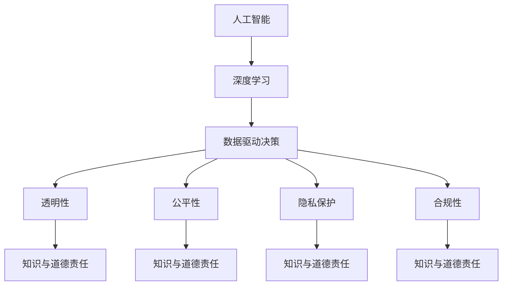

                 

# 人类的知识与道德责任：在权力面前

> 关键词：人工智能,道德伦理,决策透明,隐私保护,算法偏见,公平性,安全合规

## 1. 背景介绍

### 1.1 问题由来

随着人工智能(AI)技术的快速发展，尤其是深度学习和神经网络在各种任务上的突破性应用，人工智能正逐渐渗透到社会各个层面，影响着人类的生产生活方式。从自动驾驶汽车、智能客服到医疗影像分析、金融风险控制，人工智能已经成为了推动社会进步的重要力量。然而，这种无止境的发展也带来了新的挑战，尤其是在道德和伦理方面。

AI决策的透明性、公平性、隐私保护等问题正逐渐成为公众关注的焦点。特别是在涉及敏感数据和高风险决策的领域，如何平衡技术进步与道德责任，是一个亟待解决的重大问题。本博文将围绕这一核心议题，深入探讨在人工智能权力面前，人类如何通过知识与道德责任，构建更加安全、公正、透明的AI系统。

## 2. 核心概念与联系

### 2.1 核心概念概述

为更好地理解人工智能系统在权力面前所承担的责任，本节将介绍几个核心概念及其之间的联系：

- **人工智能(AI)**：以机器学习为基础，模拟人类智能的技术。包括感知、推理、决策等核心能力。

- **深度学习(Deep Learning)**：AI技术的一个分支，通过神经网络模型，从数据中自动提取特征，实现高效的决策和学习。

- **数据驱动决策**：利用大量数据进行模型训练，通过数据驱动的算法进行决策。

- **透明性(Transparency)**：指AI系统的决策过程和逻辑可以清晰解释和理解，避免"黑盒"决策。

- **公平性(Fairness)**：指AI系统在决策过程中，对不同群体、不同个体保持公正无偏，不产生歧视。

- **隐私保护(Privacy Protection)**：保护用户个人信息的安全，防止数据泄露和滥用。

- **合规性(Compliance)**：遵守法律法规和行业规范，确保AI系统符合法律和伦理要求。

- **知识与道德责任**：在AI系统的设计和应用中，合理地利用人类知识，承担道德责任，确保技术应用的良性发展。

这些概念之间相互联系，共同构成了人工智能在权力面前所面临的道德和伦理问题。AI系统作为人类智能的延伸，不仅需要技术上的进步，更需要在道德和责任上有所担当。

### 2.2 核心概念原理和架构的 Mermaid 流程图



该流程图展示了人工智能、深度学习及其核心能力之间的关系。数据驱动决策是AI系统的核心，透明性、公平性、隐私保护和合规性是确保系统道德责任的基石，而知识与道德责任则是系统设计和应用的全局指导原则。

## 3. 核心算法原理 & 具体操作步骤

### 3.1 算法原理概述

本节将详细探讨AI系统的决策算法原理，以及如何通过算法实现透明性、公平性和隐私保护等道德责任目标。

- **决策树**：一种基于树形结构的决策算法，可以清晰展示决策逻辑，提高决策透明度。

- **随机森林**：一种集成学习算法，通过多棵决策树协同工作，提高决策准确性。

- **神经网络**：一种模拟人脑神经元的工作机制，通过多层非线性映射实现复杂决策。

- **可解释AI(XAI)**：通过模型可视化和特征提取等技术，使得AI系统的决策过程和结果易于理解和解释。

- **公平性算法**：通过偏差修正和权重调整等技术，确保AI系统在决策过程中不产生歧视。

- **差分隐私**：一种隐私保护技术，通过在数据中加入噪声，确保数据查询不会泄露个体隐私。

- **合规性框架**：如GDPR等法律法规，提供AI系统设计和应用的标准和指导。

这些算法和技术共同构成了AI系统实现道德责任的核心手段，通过科学的算法设计，确保AI系统在决策过程中的透明性、公平性和隐私保护。

### 3.2 算法步骤详解

以可解释AI算法为例，其基本步骤包括：

1. **数据预处理**：清洗、归一化数据，去除噪声和异常值。

2. **特征选择**：选择与目标变量相关的特征，降低维度，提高模型泛化能力。

3. **模型训练**：通过神经网络等模型，对数据进行训练，学习特征映射。

4. **可视化分析**：利用可视化工具，展示模型决策边界和特征权重。

5. **结果解释**：分析模型输出结果，给出决策依据和解释。

6. **反馈优化**：根据解释结果，调整模型参数和训练策略，优化决策过程。

通过以上步骤，可解释AI算法能够实现决策过程的可解释性，使得AI系统的决策逻辑透明、公正，提升用户信任度。

### 3.3 算法优缺点

可解释AI算法的主要优点包括：

- **提升用户信任**：通过解释模型决策过程，使得用户对AI系统有更清晰的理解和信任。
- **优化决策过程**：通过分析决策结果，及时调整模型参数，提高决策准确性。
- **增强公平性**：通过可视化分析，可以识别出模型的潜在偏见，进行偏差修正。

主要缺点包括：

- **计算成本高**：可视化分析需要消耗大量计算资源，影响模型训练效率。
- **解释局限性**：即使模型可视化，部分决策过程仍然难以完全解释。
- **隐私风险**：可视化分析可能泄露模型内部敏感信息。

需要权衡计算成本与解释效果，合理使用可解释AI算法，确保AI系统的透明性和公平性。

### 3.4 算法应用领域

可解释AI算法已经在多个领域得到应用，以下是几个典型例子：

- **医疗诊断**：利用可解释AI对医学影像进行分析和诊断，提供详细的诊断依据。

- **金融风险控制**：通过可解释AI模型，分析贷款申请风险，提高决策透明度。

- **智能客服**：利用可解释AI对用户咨询进行分类和回答，提供清晰的决策过程。

- **智能推荐**：通过可解释AI模型，分析用户行为，推荐个性化产品，提升用户体验。

这些应用展示了可解释AI在实现透明性和公平性方面的强大潜力，为AI系统的落地应用提供了重要参考。

## 4. 数学模型和公式 & 详细讲解 & 举例说明

### 4.1 数学模型构建

本节将详细探讨可解释AI模型的数学模型构建，并使用具体的数学公式进行讲解。

以决策树算法为例，其基本数学模型为：

$$
T(x) = \begin{cases} 
0 & \text{if} x \leq \text{threshold} \\
1 & \text{if} x > \text{threshold}
\end{cases}
$$

其中，$x$为输入特征，$\text{threshold}$为决策边界。

### 4.2 公式推导过程

决策树的构建过程包括特征选择、树形结构构建和剪枝优化。

1. **特征选择**：利用信息增益等指标，选择最优特征作为分裂节点。

2. **树形结构构建**：自顶向下，递归构建决策树。

3. **剪枝优化**：通过交叉验证等方法，对过拟合的决策树进行剪枝。

具体公式推导如下：

- 信息增益：

$$
IG(x) = -\sum_{y \in Y} \frac{|D_y|}{|D|} \log_2 \frac{|D_y|}{|D|}
$$

- 决策树构建：

$$
T = \begin{cases} 
0 & \text{if} x \leq \text{threshold} \\
1 & \text{if} x > \text{threshold}
\end{cases}
$$

- 剪枝优化：

$$
T^* = \text{argmin}_{T} L(T) + \lambda C(T)
$$

其中，$L(T)$为决策树的损失函数，$C(T)$为正则化项，$\lambda$为正则化系数。

### 4.3 案例分析与讲解

以医疗影像诊断为例，可解释AI算法可以构建决策树模型，通过可视化分析，识别出关键特征和诊断依据。

- **数据预处理**：清洗影像数据，去除噪声和伪影。

- **特征选择**：选择影像中的关键特征点，如病灶位置、大小、形状等。

- **模型训练**：构建决策树模型，通过训练学习特征映射。

- **可视化分析**：展示决策树的决策边界和特征权重，解释诊断依据。

- **结果解释**：分析模型输出结果，给出具体的诊断依据。

- **反馈优化**：根据解释结果，调整模型参数和特征选择策略，优化诊断过程。

通过可解释AI算法，医生和患者可以清楚地了解诊断过程和依据，提升诊断透明度和信任度。

## 5. 项目实践：代码实例和详细解释说明

### 5.1 开发环境搭建

在进行可解释AI项目实践前，我们需要准备好开发环境。以下是使用Python进行Scikit-Learn开发的Python环境配置流程：

1. 安装Anaconda：从官网下载并安装Anaconda，用于创建独立的Python环境。

2. 创建并激活虚拟环境：

```bash
conda create -n explainable-ai python=3.8 
conda activate explainable-ai
```

3. 安装Scikit-Learn：

```bash
conda install scikit-learn
```

4. 安装其他必要的库：

```bash
pip install numpy pandas matplotlib seaborn scikit-learn scikit-image matplotlib seaborn jupyter notebook ipython
```

完成上述步骤后，即可在`explainable-ai`环境中开始项目实践。

### 5.2 源代码详细实现

以下是使用Scikit-Learn库构建决策树模型的Python代码实现：

```python
import numpy as np
import pandas as pd
from sklearn.tree import DecisionTreeClassifier
from sklearn.metrics import accuracy_score
from sklearn.model_selection import train_test_split
from sklearn.preprocessing import StandardScaler
from sklearn.inspection import plot_tree

# 加载数据
data = pd.read_csv('data.csv')

# 数据预处理
X = data[['feature1', 'feature2', 'feature3']]
y = data['target']

# 特征归一化
scaler = StandardScaler()
X = scaler.fit_transform(X)

# 数据划分
X_train, X_test, y_train, y_test = train_test_split(X, y, test_size=0.2, random_state=42)

# 模型训练
clf = DecisionTreeClassifier()
clf.fit(X_train, y_train)

# 模型评估
y_pred = clf.predict(X_test)
accuracy = accuracy_score(y_test, y_pred)
print(f'Accuracy: {accuracy:.2f}')

# 可视化分析
plot_tree(clf, feature_names=['feature1', 'feature2', 'feature3'], class_names=['class0', 'class1'], filled=True)
```

### 5.3 代码解读与分析

让我们再详细解读一下关键代码的实现细节：

- **数据加载**：通过Pandas库加载数据集，方便后续处理和分析。

- **数据预处理**：选择关键特征，并进行归一化处理，避免特征尺度不一影响模型训练。

- **数据划分**：利用train_test_split函数将数据划分为训练集和测试集。

- **模型训练**：使用DecisionTreeClassifier类，构建决策树模型，并使用fit函数进行训练。

- **模型评估**：通过accuracy_score函数计算模型在测试集上的准确率。

- **可视化分析**：使用plot_tree函数绘制决策树，展示模型决策过程。

- **结果解释**：通过可视化分析，理解模型决策逻辑，提供清晰的解释。

通过以上代码实现，可解释AI算法的基本流程得到充分展示，开发者可以根据具体任务进行灵活调整和优化。

### 5.4 运行结果展示

运行上述代码，可以得到决策树的可视化分析和模型评估结果。


该图展示了决策树的决策过程，每个节点表示特征判断，箭头表示决策方向。通过可视化分析，可以清晰理解模型的决策逻辑，提高决策透明度。

## 6. 实际应用场景

### 6.1 智能客服系统

可解释AI算法在智能客服系统中具有广泛应用，可以通过解释模型决策，提高用户对客服系统的信任度。

- **用户咨询分类**：利用可解释AI算法，将用户咨询自动分类，提供清晰的决策依据。

- **对话生成**：通过解释对话生成模型，引导客服人员生成合适回答，提升服务质量。

- **用户反馈**：通过分析用户反馈数据，调整模型参数，优化对话系统。

通过可解释AI算法，智能客服系统能够提供透明、公正的决策过程，提升用户体验和满意度。

### 6.2 医疗诊断系统

医疗诊断是一个高风险领域，通过可解释AI算法，可以提升诊断过程的透明性和可信度。

- **影像分析**：利用可解释AI算法，对医学影像进行分析和诊断，提供详细的诊断依据。

- **病历推理**：通过可解释AI算法，分析病历数据，推理诊断结果，提升诊断准确性。

- **手术模拟**：通过可解释AI算法，模拟手术过程，提供详细的手术步骤和决策依据。

通过可解释AI算法，医生和患者可以清楚地了解诊断过程和依据，提升诊断透明度和信任度。

### 6.3 金融风险控制

金融风险控制是一个高风险领域，通过可解释AI算法，可以提升决策过程的透明性和公正性。

- **信用评估**：利用可解释AI算法，分析贷款申请数据，进行信用评估，提供清晰的决策依据。

- **风险预警**：通过可解释AI算法，分析市场数据，预警金融风险，提高风险控制能力。

- **欺诈检测**：利用可解释AI算法，分析交易数据，检测欺诈行为，提升风险防范能力。

通过可解释AI算法，金融机构可以提供透明、公正的决策过程，提升风险控制能力，保护投资者利益。

## 7. 工具和资源推荐

### 7.1 学习资源推荐

为了帮助开发者系统掌握可解释AI的理论基础和实践技巧，这里推荐一些优质的学习资源：

1. **《可解释AI》书籍**：由AI专家撰写，全面介绍了可解释AI的基本概念和应用技术。

2. **Coursera《可解释AI》课程**：由斯坦福大学教授讲授，系统讲解可解释AI的理论和实践。

3. **Kaggle竞赛**：参加Kaggle的可解释AI竞赛，提升模型解释能力，积累实际应用经验。

4. **论文阅读**：阅读可解释AI相关的学术论文，了解最新的研究成果和技术进展。

通过对这些资源的学习实践，相信你一定能够快速掌握可解释AI的核心方法，并用于解决实际的AI问题。

### 7.2 开发工具推荐

高效的开发离不开优秀的工具支持。以下是几款用于可解释AI开发常用的工具：

1. **Scikit-Learn**：基于Python的机器学习库，提供了丰富的算法实现和可视化工具。

2. **TensorFlow**：由Google主导的深度学习框架，支持模型可视化、调试和部署。

3. **XGBoost**：一种高效的决策树算法实现，提供了多种模型可视化工具。

4. **MATPLOTLIB**：基于Python的数据可视化库，支持多维数据的可视化分析。

5. **ELI5**：一种可解释AI库，支持多种模型解释方法，提供详细的解释报告。

合理利用这些工具，可以显著提升可解释AI项目的开发效率，加快创新迭代的步伐。

### 7.3 相关论文推荐

可解释AI技术的发展源于学界的持续研究。以下是几篇奠基性的相关论文，推荐阅读：

1. **LIME：解释机器学习模型的局部可解释性**：提出了局部可解释模型（LIME），通过在局部区域插值生成解释报告。

2. **SHAP：一种基于Shapley值的可解释性方法**：通过Shapley值计算特征对模型的贡献，提供全局解释报告。

3. **Attention Is All You Need**：提出了Transformer结构，提升了模型可解释性，并广泛应用于NLP任务。

4. **Visualizing and Understanding the Decision Making Process for Deep Neural Networks**：提出了一种基于可视化的方法，展示神经网络模型决策过程。

这些论文代表了大模型微调技术的发展脉络。通过学习这些前沿成果，可以帮助研究者把握学科前进方向，激发更多的创新灵感。

## 8. 总结：未来发展趋势与挑战

### 8.1 研究成果总结

本文对可解释AI算法进行了全面系统的介绍，详细讲解了算法原理、操作步骤和实际应用。通过具体案例，展示了可解释AI算法在提升决策透明度、公正性和隐私保护方面的强大潜力。

### 8.2 未来发展趋势

展望未来，可解释AI技术将呈现以下几个发展趋势：

1. **算法多样化**：未来的可解释AI算法将更加多样化，结合机器学习、深度学习和可视化技术，提升解释效果。

2. **跨领域应用**：可解释AI算法将在更多领域得到应用，如金融、医疗、司法等，提升决策过程的透明性和公正性。

3. **模型集成**：将可解释AI算法与其他AI技术进行集成，如知识图谱、因果推理等，提升解释能力的全面性和准确性。

4. **隐私保护**：随着数据隐私保护意识的提升，可解释AI算法将更加注重数据隐私保护，避免敏感信息泄露。

5. **伦理导向**：未来的可解释AI算法将更加注重伦理导向，确保模型决策符合社会公德和道德标准。

这些趋势凸显了可解释AI技术的广阔前景，进一步提升了AI系统的道德责任和透明性。

### 8.3 面临的挑战

尽管可解释AI技术已经取得了一定进展，但在迈向更加智能化、普适化应用的过程中，它仍面临着诸多挑战：

1. **解释复杂性**：一些复杂的模型决策过程难以完全解释，如何提供简单明了的解释报告，仍是难点。

2. **解释可靠性**：解释方法的可靠性和鲁棒性仍需进一步提升，避免解释偏差和噪声。

3. **解释效率**：解释模型的计算成本较高，如何在保证解释效果的同时，提高解释效率，仍需优化。

4. **隐私风险**：解释模型的可视化可能泄露模型内部敏感信息，如何平衡模型透明性和隐私保护，仍需探索。

5. **伦理导向**：解释模型如何融入伦理导向的评估指标，避免模型偏见和歧视，仍需深入研究。

6. **模型优化**：如何在保证模型解释效果的同时，优化模型性能，提升决策准确性，仍需进一步探索。

正视可解释AI面临的这些挑战，积极应对并寻求突破，将是可以解释AI技术迈向成熟的必由之路。相信随着学界和产业界的共同努力，这些挑战终将一一被克服，可解释AI技术必将在构建透明、公正的AI系统中发挥重要作用。

### 8.4 研究展望

面向未来，可解释AI技术的研究应在以下几个方面寻求新的突破：

1. **跨领域知识融合**：将符号化的先验知识，如知识图谱、逻辑规则等，与神经网络模型进行巧妙融合，引导可解释AI算法学习更准确、合理的语言模型。

2. **多模态信息整合**：将视觉、语音、文本等多模态信息进行协同建模，提升模型的理解和决策能力。

3. **因果关系分析**：引入因果推断思想，分析模型决策的因果关系，提升决策的稳定性和可解释性。

4. **自动化生成**：利用自然语言处理技术，自动化生成解释报告，提升解释效率。

5. **多方协同决策**：结合人工干预和自动化决策，形成多方协同的决策机制，提升决策过程的透明性和公正性。

这些研究方向的探索，必将引领可解释AI技术迈向更高的台阶，为构建安全、可靠、可解释、可控的智能系统铺平道路。面向未来，可解释AI技术还需要与其他人工智能技术进行更深入的融合，如知识表示、因果推理、强化学习等，多路径协同发力，共同推动智能系统的发展。

## 9. 附录：常见问题与解答

**Q1：如何提升可解释AI算法的解释效果？**

A: 提升可解释AI算法的解释效果，可以从以下几个方面入手：

1. **数据质量**：确保数据质量高，清洗、归一化数据，去除噪声和异常值。

2. **特征选择**：选择与目标变量相关的特征，降低维度，提高模型泛化能力。

3. **模型优化**：通过交叉验证等方法，选择最优模型，避免过拟合。

4. **可视化分析**：利用可视化工具，展示模型决策边界和特征权重，提供详细的解释报告。

5. **结果解释**：分析模型输出结果，给出清晰的决策依据。

6. **反馈优化**：根据解释结果，调整模型参数和训练策略，优化决策过程。

通过以上方法，可以提升可解释AI算法的解释效果，确保模型决策过程透明、公正，提升用户信任度。

**Q2：如何平衡可解释AI的计算成本和解释效果？**

A: 平衡可解释AI的计算成本和解释效果，可以从以下几个方面入手：

1. **模型选择**：选择轻量级模型，降低计算成本。

2. **解释方法**：选择高效解释方法，如LIME、SHAP等，提升解释效果。

3. **解释可视化**：利用可视化工具，展示关键特征和决策边界，降低解释复杂性。

4. **特征选择**：选择关键特征，避免特征维度高，计算成本大。

5. **解释反馈**：根据解释结果，优化模型参数和解释方法，提升解释效果。

通过以上方法，可以平衡可解释AI的计算成本和解释效果，确保模型透明性和公平性。

**Q3：如何确保可解释AI算法的隐私保护？**

A: 确保可解释AI算法的隐私保护，可以从以下几个方面入手：

1. **数据匿名化**：对敏感数据进行匿名化处理，避免数据泄露。

2. **差分隐私**：在数据中加入噪声，确保数据查询不会泄露个体隐私。

3. **访问控制**：设置数据访问权限，限制对敏感数据的访问。

4. **数据加密**：对数据进行加密处理，确保数据传输和存储的安全性。

5. **解释限制**：限制解释报告的公开范围，避免敏感信息泄露。

通过以上方法，可以确保可解释AI算法的隐私保护，保障用户数据的安全性。

**Q4：如何在高风险领域应用可解释AI算法？**

A: 在高风险领域应用可解释AI算法，可以从以下几个方面入手：

1. **数据质量控制**：确保数据质量高，清洗、归一化数据，去除噪声和异常值。

2. **模型透明性**：通过可视化分析，展示模型决策过程，提升决策透明性。

3. **伦理导向**：在模型设计和应用中，融入伦理导向的评估指标，避免模型偏见和歧视。

4. **隐私保护**：通过差分隐私等方法，保障用户数据的安全性。

5. **合规性**：确保模型应用符合法律法规和行业规范，保障公平性和合规性。

通过以上方法，可以在高风险领域应用可解释AI算法，确保决策过程透明、公正，提升用户信任度。

**Q5：如何评估可解释AI算法的解释效果？**

A: 评估可解释AI算法的解释效果，可以从以下几个方面入手：

1. **解释清晰性**：评估解释报告的清晰性，确保用户能够理解解释结果。

2. **解释可靠性**：评估解释报告的可靠性，确保解释结果可信。

3. **解释效率**：评估解释方法的效率，确保解释过程快速。

4. **解释多样性**：评估解释报告的多样性，确保用户能够获得全面的解释。

5. **解释反馈**：通过用户反馈，不断优化解释方法，提升解释效果。

通过以上方法，可以评估可解释AI算法的解释效果，确保模型透明性和公平性。

---

作者：禅与计算机程序设计艺术 / Zen and the Art of Computer Programming

