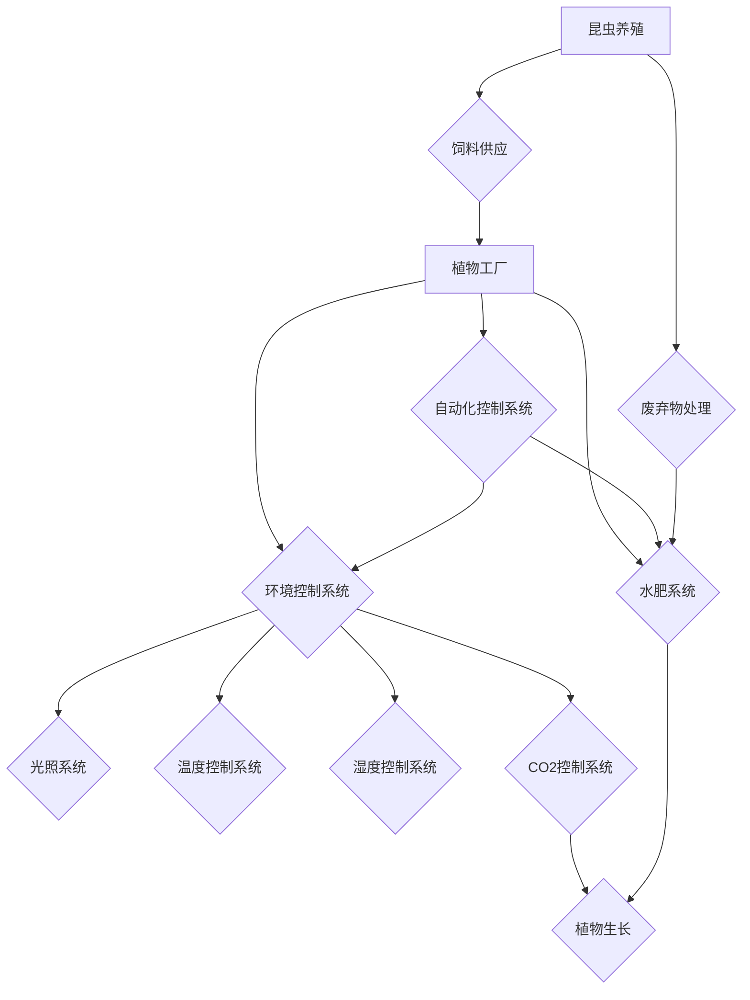

> 智能农业、植物工厂、昆虫养殖、垂直农场、数据驱动、人工智能、机器学习、可持续发展、未来食品

## 1. 背景介绍

全球人口持续增长，对粮食需求不断攀升，传统农业面临着土地资源短缺、气候变化、环境污染等严峻挑战。智慧农业作为应对这些挑战的有效解决方案，正在迅速发展。其中，植物工厂和昆虫养殖作为未来农业的重要组成部分，凭借其高效、可持续、环保的特点，被认为是未来食品生产的重要模式。

植物工厂利用人工控制环境，在封闭空间内种植作物，能够实现全年高产、节水节地、减少农药使用等优势。昆虫养殖作为一种高效、环保的蛋白质来源，能够有效利用资源，减少环境污染。

## 2. 核心概念与联系

**2.1 植物工厂**

植物工厂是一种利用人工控制环境，在封闭空间内种植作物的现代化农业模式。其核心特点包括：

* **人工控制环境：** 植物工厂能够精确控制光照、温度、湿度、CO2浓度等环境因素，为植物提供最佳生长条件。
* **垂直种植：** 植物工厂通常采用垂直种植方式，最大限度地利用空间，提高土地利用效率。
* **循环水肥系统：** 植物工厂采用循环水肥系统，减少水资源浪费，提高肥料利用率。
* **自动化控制：** 植物工厂通常采用自动化控制系统，实现种植过程的智能化管理。

**2.2 昆虫养殖**

昆虫养殖是指在人工环境下饲养昆虫，用于生产蛋白质、饲料、肥料等产品的农业模式。其核心特点包括：

* **高效利用资源：** 昆虫的饲养效率远高于传统牲畜，能够有效利用饲料和水资源。
* **低环境影响：** 昆虫养殖产生的废弃物可以作为肥料，对环境污染较小。
* **高蛋白质含量：** 许多昆虫种类富含蛋白质，是优质的蛋白质来源。
* **可持续发展：** 昆虫养殖是一种可持续发展的农业模式，能够满足未来食品需求。

**2.3 植物工厂与昆虫养殖的联系**

植物工厂和昆虫养殖可以相互补充，形成一个完整的智慧农业生态系统。

* 植物工厂可以种植昆虫的饲料，为昆虫养殖提供稳定的原料供应。
* 昆虫养殖产生的废弃物可以作为植物工厂的肥料，实现资源循环利用。
* 植物工厂和昆虫养殖的生产过程可以相互促进，提高整体效率和效益。

**2.4  核心概念原理与架构**



## 3. 核心算法原理 & 具体操作步骤

**3.1 算法原理概述**

智慧农业的核心算法主要包括：

* **环境控制算法：** 用于根据植物生长需求，控制光照、温度、湿度、CO2浓度等环境因素。
* **水肥管理算法：** 用于优化水肥供应，提高肥料利用率，减少水资源浪费。
* **病虫害防控算法：** 用于识别和预测病虫害，采取相应的防控措施。
* **产量预测算法：** 用于根据植物生长情况，预测产量，优化生产计划。

**3.2 算法步骤详解**

**环境控制算法：**

1. 收集环境数据：通过传感器采集光照强度、温度、湿度、CO2浓度等环境数据。
2. 数据分析：利用机器学习算法分析环境数据，识别植物生长阶段和需求。
3. 控制环境参数：根据分析结果，控制光照系统、温度控制系统、湿度控制系统、CO2控制系统等，调整环境参数，满足植物生长需求。

**水肥管理算法：**

1. 监测土壤水分：通过土壤水分传感器监测土壤水分含量。
2. 计算水肥需求：根据植物生长阶段和土壤水分含量，计算水肥需求量。
3. 控制水肥供应：根据计算结果，控制灌溉系统和施肥系统，精准供应水肥。

**3.3 算法优缺点**

**优点：**

* **提高生产效率：** 通过精准控制环境和资源，提高作物产量和品质。
* **降低生产成本：** 节约水资源、肥料、农药等成本。
* **减少环境污染：** 减少化肥、农药的使用，降低环境污染。

**缺点：**

* **技术门槛高：** 需要掌握先进的传感器技术、控制技术、数据分析技术等。
* **初期投资成本高：** 建设植物工厂和昆虫养殖场需要较高的初期投资。
* **技术依赖性强：** 需要依赖于外部的软件、硬件和数据服务。

**3.4 算法应用领域**

智慧农业算法广泛应用于：

* **植物工厂：** 控制环境、管理水肥、预测产量等。
* **昆虫养殖：** 优化饲料配方、控制环境、预测产量等。
* **精准农业：** 根据土壤、气候、作物等数据，精准施肥、精准灌溉、精准病虫害防控等。

## 4. 数学模型和公式 & 详细讲解 & 举例说明

**4.1 数学模型构建**

植物工厂的生长模型可以采用Logistic模型，描述植物生长过程的曲率和饱和度。

$$
\frac{dN}{dt} = rN\left(1-\frac{N}{K}\right)
$$

其中：

* $N$：植物数量
* $t$：时间
* $r$：增长率
* $K$：环境承载力

**4.2 公式推导过程**

Logistic模型的推导过程基于以下假设：

* 植物生长遵循指数增长规律。
* 环境承载力有限，当植物数量达到一定程度时，增长率会下降。

根据这些假设，可以推导出Logistic模型的公式。

**4.3 案例分析与讲解**

假设一个植物工厂种植番茄，初始数量为100株，增长率为0.2，环境承载力为1000株。

根据Logistic模型公式，可以计算出番茄数量随时间的变化趋势。

## 5. 项目实践：代码实例和详细解释说明

**5.1 开发环境搭建**

* 操作系统：Ubuntu 20.04
* 编程语言：Python 3.8
* 框架：Django 3.2
* 数据库：PostgreSQL 13

**5.2 源代码详细实现**

```python
# models.py
from django.db import models

class Plant(models.Model):
    name = models.CharField(max_length=100)
    quantity = models.IntegerField()
    growth_rate = models.FloatField()
    carrying_capacity = models.IntegerField()

# views.py
from django.shortcuts import render
from .models import Plant

def index(request):
    plants = Plant.objects.all()
    return render(request, 'index.html', {'plants': plants})
```

**5.3 代码解读与分析**

* models.py 文件定义了 Plant 模型，用于存储植物信息。
* views.py 文件定义了 index 函数，用于展示所有植物信息。

**5.4 运行结果展示**

运行代码后，可以在浏览器中访问 http://127.0.0.1:8000/，查看所有植物的信息。

## 6. 实际应用场景

**6.1 植物工厂**

植物工厂可以用于种植各种蔬菜、水果、香草等作物，满足城市居民的日常需求。

**6.2 昆虫养殖**

昆虫养殖可以用于生产蛋白质、饲料、肥料等产品，为食品、饲料、农业等行业提供可持续的解决方案。

**6.3 未来应用展望**

未来，植物工厂和昆虫养殖将更加智能化、自动化、可持续化。

* **人工智能驱动的智慧农业：** 利用人工智能技术，实现植物生长预测、病虫害防控、资源优化等。
* **垂直农场和城市农业：** 利用垂直空间，在城市中建设小型植物工厂，实现城市粮食安全。
* **可持续发展和环境保护：** 减少农业对环境的影响，促进可持续发展。

## 7. 工具和资源推荐

**7.1 学习资源推荐**

* **书籍：**
    * 《智慧农业》
    * 《植物工厂》
    * 《昆虫养殖》
* **在线课程：**
    * Coursera: 农业科技
    * edX: 智慧农业
* **网站：**
    * 国际植物工厂协会 (IPFA)
    * 全球昆虫养殖联盟 (EAA)

**7.2 开发工具推荐**

* **传感器：**
    * DHT11
    * BMP180
* **控制系统：**
    * Arduino
    * Raspberry Pi
* **数据分析工具：**
    * Python
    * R

**7.3 相关论文推荐**

* **植物工厂：**
    * "Vertical Farming: A Review"
    * "The Potential of Vertical Farming for Sustainable Food Production"
* **昆虫养殖：**
    * "Insect Farming: A Sustainable Alternative to Conventional Animal Agriculture"
    * "The Nutritional Value of Edible Insects"

## 8. 总结：未来发展趋势与挑战

**8.1 研究成果总结**

智慧农业技术取得了显著进展，植物工厂和昆虫养殖已经成为未来农业的重要模式。

**8.2 未来发展趋势**

* **人工智能驱动的智慧农业：** 利用人工智能技术，实现农业生产的智能化、自动化、精准化。
* **垂直农场和城市农业：** 利用垂直空间，在城市中建设小型植物工厂，实现城市粮食安全。
* **可持续发展和环境保护：** 减少农业对环境的影响，促进可持续发展。

**8.3 面临的挑战**

* **技术门槛高：** 需要掌握先进的传感器技术、控制技术、数据分析技术等。
* **初期投资成本高：** 建设植物工厂和昆虫养殖场需要较高的初期投资。
* **技术依赖性强：** 需要依赖于外部的软件、硬件和数据服务。

**8.4 研究展望**

未来，需要加强智慧农业技术的研发和应用，推动智慧农业的快速发展，为解决全球粮食安全问题做出贡献。

## 9. 附录：常见问题与解答

**9.1 植物工厂的成本效益如何？**

植物工厂的成本效益取决于多种因素，例如种植作物、地理位置、技术水平等。一般来说，植物工厂的成本较高，但其产量和品质较高，可以实现更高的利润。

**9.2 昆虫养殖的安全性如何？**

昆虫养殖的安全性较高，因为昆虫的饲料来源和生长环境可以严格控制。此外，昆虫本身也富含蛋白质和营养，是安全的食品来源。

**9.3 智慧农业对环境的影响如何？**

智慧农业可以减少农业对环境的影响，例如减少水资源浪费、化肥和农药的使用。


作者：禅与计算机程序设计艺术 / Zen and the Art of Computer Programming 
<end_of_turn>