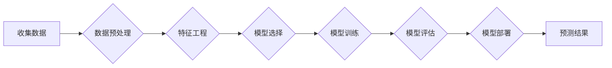

> 机器学习，预测性分析，算法原理，数学模型，项目实践，应用场景，未来趋势

## 1. 背景介绍

在当今数据爆炸的时代，企业和组织面临着海量数据的处理和分析挑战。如何从海量数据中挖掘有价值的信息，并将其转化为可操作的洞察力，成为企业竞争力的关键因素。预测性分析作为一种数据驱动决策的强大工具，正逐渐成为各行各业的必备技术。

预测性分析是指利用历史数据和统计模型，预测未来事件或趋势的分析方法。它通过识别数据中的模式和趋势，并建立数学模型，来预测未来的结果。例如，电商平台可以利用用户购买历史数据，预测未来用户的购买行为；金融机构可以利用市场数据，预测股票价格走势；医疗机构可以利用患者病历数据，预测疾病风险。

机器学习作为人工智能领域的重要分支，为预测性分析提供了强大的技术支撑。机器学习算法能够自动从数据中学习，并建立预测模型，无需人工进行复杂的特征工程和模型设计。

## 2. 核心概念与联系

**2.1 预测性分析的核心概念**

* **历史数据:** 预测性分析的基础是历史数据，它包含了过去发生的事件或现象的记录。
* **统计模型:** 统计模型是预测性分析的核心，它用于描述数据之间的关系，并预测未来的结果。
* **预测结果:** 预测性分析的目标是生成预测结果，即对未来事件或趋势的估计。

**2.2 机器学习与预测性分析的联系**

机器学习算法可以自动学习数据中的模式和趋势，并建立预测模型，从而为预测性分析提供强大的技术支撑。

**2.3 预测性分析的流程**



## 3. 核心算法原理 & 具体操作步骤

**3.1 算法原理概述**

预测性分析中常用的机器学习算法包括：

* **线性回归:** 用于预测连续变量，假设数据之间存在线性关系。
* **逻辑回归:** 用于预测分类变量，假设数据之间存在非线性关系。
* **决策树:** 用于分类和回归，通过一系列规则将数据分类或预测。
* **支持向量机:** 用于分类和回归，通过寻找最佳分割超平面将数据分类或预测。
* **神经网络:** 用于复杂数据分析，模拟人脑神经网络结构，具有强大的学习能力。

**3.2 算法步骤详解**

以线性回归为例，其步骤如下：

1. **收集数据:** 收集包含目标变量和预测变量的历史数据。
2. **数据预处理:** 对数据进行清洗、转换和标准化，以提高模型的精度。
3. **特征工程:** 从原始数据中提取特征，以更好地描述数据之间的关系。
4. **模型选择:** 选择合适的线性回归模型。
5. **模型训练:** 使用训练数据训练模型，学习数据之间的关系。
6. **模型评估:** 使用测试数据评估模型的精度，并进行模型调优。
7. **模型部署:** 将训练好的模型部署到生产环境中，用于预测未来结果。

**3.3 算法优缺点**

不同的机器学习算法具有不同的优缺点，需要根据实际应用场景选择合适的算法。

**3.4 算法应用领域**

机器学习算法在预测性分析领域有着广泛的应用，例如：

* **电商:** 预测用户购买行为、推荐商品、优化库存管理。
* **金融:** 预测股票价格走势、识别欺诈交易、评估信用风险。
* **医疗:** 预测疾病风险、辅助诊断、个性化治疗方案。
* **制造业:** 预测设备故障、优化生产流程、控制质量。

## 4. 数学模型和公式 & 详细讲解 & 举例说明

**4.1 数学模型构建**

线性回归模型的数学模型如下：

$$
y = \beta_0 + \beta_1x_1 + \beta_2x_2 + ... + \beta_nx_n + \epsilon
$$

其中：

* $y$ 是目标变量
* $x_1, x_2, ..., x_n$ 是预测变量
* $\beta_0, \beta_1, \beta_2, ..., \beta_n$ 是模型参数
* $\epsilon$ 是误差项

**4.2 公式推导过程**

线性回归模型的参数可以通过最小二乘法估计。最小二乘法旨在找到使模型预测值与实际值误差平方和最小的参数值。

**4.3 案例分析与讲解**

假设我们想要预测房屋价格，目标变量为房屋价格 ($y$)，预测变量包括房屋面积 ($x_1$)、房屋朝向 ($x_2$)、房屋楼层 ($x_3$) 等。我们可以使用线性回归模型来建立房屋价格预测模型。

通过收集房屋数据并训练线性回归模型，我们可以得到模型参数 $\beta_0, \beta_1, \beta_2, ..., \beta_n$。然后，我们可以使用这些参数预测新房子的价格。

## 5. 项目实践：代码实例和详细解释说明

**5.1 开发环境搭建**

* Python 3.x
* scikit-learn 库
* pandas 库
* matplotlib 库

**5.2 源代码详细实现**

```python
import pandas as pd
from sklearn.linear_model import LinearRegression
from sklearn.model_selection import train_test_split
from sklearn.metrics import mean_squared_error

# 加载数据
data = pd.read_csv('house_data.csv')

# 选择特征和目标变量
X = data[['面积', '朝向', '楼层']]
y = data['价格']

# 将数据分为训练集和测试集
X_train, X_test, y_train, y_test = train_test_split(X, y, test_size=0.2, random_state=42)

# 创建线性回归模型
model = LinearRegression()

# 训练模型
model.fit(X_train, y_train)

# 预测测试集结果
y_pred = model.predict(X_test)

# 评估模型精度
mse = mean_squared_error(y_test, y_pred)
print(f'模型精度: {mse}')

# 打印模型参数
print(f'模型参数: {model.coef_}')
print(f'截距: {model.intercept_}')
```

**5.3 代码解读与分析**

* 首先，我们加载数据并选择特征和目标变量。
* 然后，我们将数据分为训练集和测试集，用于训练和评估模型。
* 接下来，我们创建线性回归模型并训练模型。
* 训练完成后，我们可以使用模型预测测试集结果，并评估模型精度。
* 最后，我们可以打印模型参数，了解模型的学习结果。

**5.4 运行结果展示**

运行代码后，会输出模型精度和模型参数。模型精度越低，表示模型预测效果越好。

## 6. 实际应用场景

**6.1 电商平台**

* 预测用户购买行为，推荐个性化商品。
* 优化库存管理，避免缺货或积压。
* 预估销售额，制定营销策略。

**6.2 金融机构**

* 预测股票价格走势，辅助投资决策。
* 识别欺诈交易，降低风险。
* 评估信用风险，制定贷款策略。

**6.3 医疗机构**

* 预测疾病风险，进行早期干预。
* 辅助诊断，提高诊断准确率。
* 个性化治疗方案，提高治疗效果。

**6.4 未来应用展望**

随着人工智能技术的不断发展，预测性分析将在更多领域得到应用，例如：

* 智能交通：预测交通流量，优化交通管理。
* 智能制造：预测设备故障，提高生产效率。
* 智能农业：预测作物产量，优化农业生产。

## 7. 工具和资源推荐

**7.1 学习资源推荐**

* **书籍:**
    * 《机器学习》 - 周志华
    * 《Python机器学习实战》 - 塞缪尔·阿布拉姆斯
* **在线课程:**
    * Coursera: 机器学习
    * edX: 机器学习
* **博客:**
    * 机器学习 Mastery
    * Analytics Vidhya

**7.2 开发工具推荐**

* **Python:** 
    * scikit-learn
    * TensorFlow
    * PyTorch
* **R:** 
    * caret
    * mlr

**7.3 相关论文推荐**

* 《机器学习》 - 周志华
* 《深度学习》 - Ian Goodfellow

## 8. 总结：未来发展趋势与挑战

**8.1 研究成果总结**

近年来，机器学习在预测性分析领域取得了显著进展，例如：

* 深度学习算法的出现，提高了模型的预测精度。
* 算法的自动化，降低了模型开发的门槛。
* 数据量的增加，为模型训练提供了更多数据。

**8.2 未来发展趋势**

* **模型解释性:** 提高模型的解释性，使预测结果更易理解。
* **数据安全:** 加强数据安全保护，防止数据泄露和滥用。
* **跨领域应用:** 将预测性分析应用到更多领域，解决更多实际问题。

**8.3 面临的挑战**

* **数据质量:** 预测性分析依赖于高质量的数据，数据质量问题会影响模型的精度。
* **模型复杂度:** 复杂的模型难以理解和维护。
* **伦理问题:** 预测性分析可能存在伦理问题，例如歧视和隐私泄露。

**8.4 研究展望**

未来，预测性分析将继续朝着更智能、更安全、更可解释的方向发展。

## 9. 附录：常见问题与解答

* **Q1: 如何选择合适的机器学习算法？**

* **A1:** 选择合适的机器学习算法需要根据实际应用场景和数据特点进行选择。例如，对于连续变量预测，可以使用线性回归或支持向量机；对于分类问题，可以使用决策树或逻辑回归。

* **Q2: 如何评估机器学习模型的精度？**

* **A2:** 机器学习模型的精度可以通过多种指标进行评估，例如准确率、召回率、F1-score、AUC等。

* **Q3: 如何处理缺失数据？**

* **A3:** 处理缺失数据的方法包括删除缺失数据、用平均值或中位数填充缺失数据、使用机器学习算法进行预测填充等。


作者：禅与计算机程序设计艺术 / Zen and the Art of Computer Programming 
<end_of_turn>