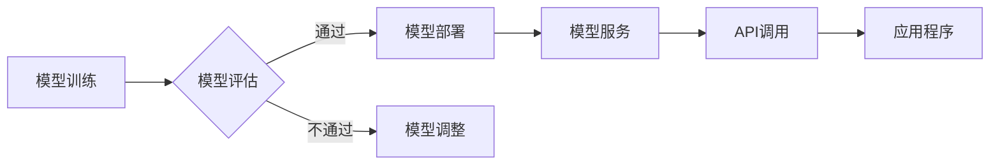

> 模型服务化, API设计, 微服务, RESTful API, gRPC, 模型部署, 容器化, Docker, Kubernetes, 代码实战

## 1. 背景介绍

随着人工智能技术的飞速发展，机器学习模型在各个领域得到广泛应用。然而，将训练好的模型部署到生产环境并提供服务，仍然是一个重要的挑战。模型服务化是指将机器学习模型封装成可复用的服务，以便其他应用程序或系统可以方便地调用和利用模型的预测能力。

传统的机器学习模型部署方式通常是将模型代码直接嵌入到应用程序中，这种方式存在以下问题：

* **代码耦合性高:** 模型代码与应用程序代码紧密耦合，难以维护和扩展。
* **部署复杂:** 每次更新模型都需要重新部署应用程序，效率低下。
* **资源利用率低:** 模型在应用程序中可能处于闲置状态，资源浪费。

模型服务化可以有效解决上述问题，它将模型和服务逻辑分离，使得模型可以独立部署和管理，应用程序可以灵活调用模型服务，实现模型的复用和高效部署。

## 2. 核心概念与联系

模型服务化通常涉及以下核心概念：

* **模型:** 训练好的机器学习模型，例如分类模型、回归模型、推荐模型等。
* **服务:** 将模型封装成可复用的接口，提供预测或其他功能。
* **API (Application Programming Interface):** 应用编程接口，用于应用程序与服务进行交互的规范。
* **微服务:** 将大型应用程序拆分成多个小型、独立的服务，每个服务负责特定的功能。

模型服务化架构通常基于微服务架构，将模型服务作为独立的微服务进行部署和管理。

**Mermaid 流程图:**



## 3. 核心算法原理 & 具体操作步骤

### 3.1  算法原理概述

模型服务化涉及多种算法和技术，例如模型压缩、模型转换、模型推理优化等。

* **模型压缩:** 减少模型大小，降低部署成本和延迟。常见的压缩方法包括量化、剪枝、知识蒸馏等。
* **模型转换:** 将模型转换为不同的格式，以便在不同的平台或环境中运行。常见的转换方法包括 ONNX 转换、TensorFlow Lite 转换等。
* **模型推理优化:** 提高模型推理速度和效率。常见的优化方法包括模型并行、算子融合、硬件加速等。

### 3.2  算法步骤详解

**模型压缩:**

1. 选择合适的压缩方法，例如量化。
2. 对模型权重进行量化，将浮点数转换为整数。
3. 评估压缩后的模型性能，调整压缩参数。

**模型转换:**

1. 使用转换工具将模型转换为目标格式，例如 ONNX。
2. 评估转换后的模型性能，进行必要的调整。

**模型推理优化:**

1. 分析模型推理过程，识别性能瓶颈。
2. 使用优化方法，例如模型并行，提高推理速度。

### 3.3  算法优缺点

**模型压缩:**

* **优点:** 降低模型大小，降低部署成本和延迟。
* **缺点:** 可能导致模型精度下降。

**模型转换:**

* **优点:** 提高模型的移植性和可复用性。
* **缺点:** 可能导致模型性能下降。

**模型推理优化:**

* **优点:** 提高模型推理速度和效率。
* **缺点:** 可能需要额外的硬件支持。

### 3.4  算法应用领域

模型压缩、模型转换和模型推理优化在各个领域都有广泛应用，例如：

* **移动端:** 将大型模型压缩到移动设备上，实现高效的本地推理。
* **边缘计算:** 将模型部署到边缘设备上，降低网络延迟和数据传输成本。
* **云计算:** 提高云端模型推理效率，降低成本。

## 4. 数学模型和公式 & 详细讲解 & 举例说明

### 4.1  数学模型构建

模型服务化涉及多种数学模型，例如：

* **损失函数:** 用于衡量模型预测结果与真实值的差异。常见的损失函数包括均方误差、交叉熵等。
* **优化算法:** 用于更新模型参数，降低损失函数值。常见的优化算法包括梯度下降、Adam 等。

### 4.2  公式推导过程

**均方误差损失函数:**

$$
L = \frac{1}{n} \sum_{i=1}^{n} (y_i - \hat{y}_i)^2
$$

其中：

* $L$ 是损失函数值。
* $n$ 是样本数量。
* $y_i$ 是第 $i$ 个样本的真实值。
* $\hat{y}_i$ 是第 $i$ 个样本的预测值。

**梯度下降算法:**

$$
\theta = \theta - \alpha \nabla L(\theta)
$$

其中：

* $\theta$ 是模型参数。
* $\alpha$ 是学习率。
* $\nabla L(\theta)$ 是损失函数关于参数 $\theta$ 的梯度。

### 4.3  案例分析与讲解

假设我们有一个回归模型，用于预测房价。我们可以使用均方误差损失函数和梯度下降算法进行模型训练。

在训练过程中，模型会不断更新参数，以降低损失函数值。最终，模型将能够预测房价的合理值。

## 5. 项目实践：代码实例和详细解释说明

### 5.1  开发环境搭建

* Python 3.x
* TensorFlow 或 PyTorch
* Docker 和 Kubernetes

### 5.2  源代码详细实现

```python
# 模型训练代码
import tensorflow as tf

# 定义模型结构
model = tf.keras.Sequential([
    tf.keras.layers.Dense(64, activation='relu'),
    tf.keras.layers.Dense(1)
])

# 定义损失函数和优化器
model.compile(loss='mse', optimizer='adam')

# 训练模型
model.fit(X_train, y_train, epochs=10)

# 模型部署代码
from flask import Flask, request, jsonify

app = Flask(__name__)

# 加载模型
model = tf.keras.models.load_model('model.h5')

@app.route('/predict', methods=['POST'])
def predict():
    data = request.get_json()
    prediction = model.predict(data)
    return jsonify({'prediction': prediction.tolist()})

if __name__ == '__main__':
    app.run(debug=True)
```

### 5.3  代码解读与分析

* 模型训练代码使用 TensorFlow 库定义模型结构，并使用均方误差损失函数和 Adam 优化器进行训练。
* 模型部署代码使用 Flask 库构建一个 RESTful API，用于接收预测请求并返回预测结果。

### 5.4  运行结果展示

模型部署后，可以使用 Postman 或其他工具发送 POST 请求到 `/predict` 接口，并传入预测数据。模型将返回预测结果。

## 6. 实际应用场景

模型服务化在各个领域都有广泛应用，例如：

* **金融领域:** 预测股票价格、识别欺诈交易。
* **医疗领域:** 诊断疾病、预测患者风险。
* **电商领域:** 推荐商品、预测用户购买行为。

### 6.4  未来应用展望

随着人工智能技术的不断发展，模型服务化将更加普及和成熟，应用场景也将更加广泛。

## 7. 工具和资源推荐

### 7.1  学习资源推荐

* **书籍:**
    * 《机器学习实战》
    * 《深度学习》
* **在线课程:**
    * Coursera: Machine Learning
    * Udacity: Deep Learning Nanodegree

### 7.2  开发工具推荐

* **模型训练框架:** TensorFlow, PyTorch
* **模型部署框架:** TensorFlow Serving, TorchServe
* **容器化工具:** Docker, Kubernetes

### 7.3  相关论文推荐

* **模型压缩:**
    * 《Quantization-aware Training: A Methodology for Quantized Neural Network Training》
* **模型转换:**
    * 《ONNX: Open Neural Network Exchange》
* **模型推理优化:**
    * 《XLA: A Compiler for Linear Algebra》

## 8. 总结：未来发展趋势与挑战

### 8.1  研究成果总结

模型服务化技术已经取得了显著进展，模型压缩、模型转换和模型推理优化等技术不断成熟。

### 8.2  未来发展趋势

* **模型服务化平台:** 将模型训练、部署、管理等功能整合到一个平台上，提供更便捷的模型服务化体验。
* **联邦学习:** 将模型训练分散到多个设备上，保护数据隐私。
* **自动机器学习:** 自动完成模型训练、部署和优化等流程，降低模型开发门槛。

### 8.3  面临的挑战

* **模型可解释性:** 提高模型预测结果的可解释性，增强用户信任。
* **模型安全性:** 保护模型免受攻击和恶意利用。
* **模型公平性:** 确保模型预测结果公平公正。

### 8.4  研究展望

未来，模型服务化技术将继续发展，并与其他人工智能技术融合，推动人工智能技术的广泛应用。

## 9. 附录：常见问题与解答

* **如何选择合适的模型压缩方法？**

选择合适的模型压缩方法需要根据模型结构、精度要求和部署环境等因素进行综合考虑。

* **如何部署模型到生产环境？**

可以使用容器化技术，例如 Docker 和 Kubernetes，将模型部署到云平台或本地服务器。

* **如何监控模型性能？**

可以使用监控工具，例如 Prometheus 和 Grafana，监控模型的预测准确率、延迟等指标。


作者：禅与计算机程序设计艺术 / Zen and the Art of Computer Programming 
<end_of_turn>