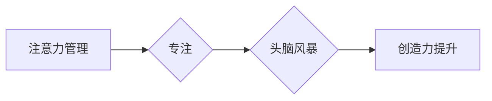

>  注意力管理、创造力提升、专注力、头脑风暴、深度工作、认知科学、人工智能

## 1. 背景介绍

在当今信息爆炸的时代，我们面临着前所未有的信息冲击。来自邮件、社交媒体、新闻推送的各种信息不断涌入，使得我们的注意力难以集中，难以保持深度思考。这不仅影响了我们的工作效率，也阻碍了我们对新知识和新事物的探索和理解。

创造力是人类进步的源泉，它驱动着创新和变革。然而，创造力并非源于灵感突现，而是需要在专注和头脑风暴中不断积累和发酵。注意力管理是提升创造力的关键，它帮助我们过滤掉无关信息，专注于重要的内容，并为头脑风暴创造一个良好的环境。

## 2. 核心概念与联系

### 2.1 注意力管理

注意力管理是指通过各种方法和技巧，控制和引导自己的注意力，使其集中在需要处理的任务或信息上。它包括以下几个方面：

* **意识：** 意识到自己的注意力是如何被分配的，哪些因素会分散注意力。
* **专注：** 训练自己的专注力，能够长时间地集中注意力在特定任务上。
* **过滤：** 过滤掉无关的信息和干扰，避免被琐碎的事情所拖累。
* **调度：** 有效地调度自己的注意力，在不同任务之间切换。

### 2.2 创造力提升

创造力是指能够产生新颖、独特、有价值的思想、概念或解决方案的能力。它是一个复杂的过程，涉及到多种认知功能，包括想象力、联想能力、批判性思维和解决问题的能力。

### 2.3 专注和头脑风暴

专注和头脑风暴是创造力的两个重要环节。专注是指集中注意力在特定问题或任务上，排除干扰，深入思考。头脑风暴是指在团队或个人中，通过自由地表达想法，激发创意，并进行集思广益的过程。

**Mermaid 流程图**



## 3. 核心算法原理 & 具体操作步骤

### 3.1 算法原理概述

注意力管理和创造力提升并非简单的技术问题，而是需要结合认知科学、心理学和人工智能等多学科的交叉研究。目前，一些研究者尝试利用算法和模型来辅助注意力管理和创造力提升。

例如，一些基于深度学习的模型可以分析用户的行为数据，识别用户的注意力模式，并提供个性化的建议，帮助用户提高注意力集中度。

### 3.2 算法步骤详解

1. **数据收集:** 收集用户的行为数据，例如浏览记录、键盘输入、鼠标移动等。
2. **数据预处理:** 对收集到的数据进行清洗、转换和特征提取。
3. **模型训练:** 利用深度学习算法，训练一个注意力模型，能够预测用户的注意力状态。
4. **注意力提示:** 当模型预测用户注意力下降时，会向用户提供一些提示，例如提醒用户休息、调整环境等。
5. **反馈机制:** 收集用户的反馈信息，并将其用于模型的进一步训练，不断优化模型的性能。

### 3.3 算法优缺点

**优点:**

* **个性化:** 可以根据用户的不同特点和需求，提供个性化的注意力管理建议。
* **实时性:** 可以实时监测用户的注意力状态，并及时提供提示。
* **可扩展性:** 可以扩展到其他领域，例如教育、医疗等。

**缺点:**

* **数据依赖:** 需要大量的用户行为数据进行训练，否则模型的性能会下降。
* **隐私问题:** 收集用户的行为数据可能会涉及到隐私问题，需要谨慎处理。
* **技术复杂性:** 需要一定的技术背景才能开发和维护这些模型。

### 3.4 算法应用领域

* **教育:** 帮助学生提高注意力集中度，提升学习效率。
* **医疗:** 帮助患者治疗注意力缺陷多动障碍 (ADHD) 等疾病。
* **工作:** 帮助员工提高工作效率，减少疲劳和压力。
* **娱乐:** 帮助用户更好地沉浸在游戏或视频中。

## 4. 数学模型和公式 & 详细讲解 & 举例说明

### 4.1 数学模型构建

注意力可以被看作是一个概率分布，它表示我们对不同信息或任务的关注程度。我们可以用一个向量来表示这个概率分布，其中每个元素代表我们对某个特定信息或任务的关注程度。

例如，假设我们正在阅读一篇文章，文章包含五个段落。我们可以用一个长度为5的向量来表示我们对每个段落的注意力分布。如果我们对第一个段落特别感兴趣，那么第一个元素的值会比较高，而其他元素的值会比较低。

### 4.2 公式推导过程

我们可以使用一些数学公式来描述注意力分布的变化过程。例如，我们可以使用一个叫做“softmax”函数来计算注意力权重。

$$
\text{softmax}(x_i) = \frac{e^{x_i}}{\sum_{j=1}^{n} e^{x_j}}
$$

其中，$x_i$ 是每个元素的值，$n$ 是向量的长度。

这个公式的作用是将每个元素的值转换为一个概率分布，使得所有元素的和等于1。

### 4.3 案例分析与讲解

假设我们正在阅读一篇文章，文章包含五个段落。我们对每个段落的注意力分布如下：

* 段落1: 0.3
* 段落2: 0.1
* 段落3: 0.2
* 段落4: 0.3
* 段落5: 0.1

我们可以使用softmax函数计算每个段落的注意力权重：

* 段落1: softmax(0.3) = 0.45
* 段落2: softmax(0.1) = 0.08
* 段落3: softmax(0.2) = 0.15
* 段落4: softmax(0.3) = 0.45
* 段落5: softmax(0.1) = 0.08

可以看到，经过softmax函数的处理，注意力权重分布更加均匀，并且每个段落的权重都大于0，小于1，符合概率分布的性质。

## 5. 项目实践：代码实例和详细解释说明

### 5.1 开发环境搭建

* 操作系统: Ubuntu 20.04
* Python 版本: 3.8
* 必要的库: numpy, pandas, tensorflow

### 5.2 源代码详细实现

```python
import tensorflow as tf

# 定义模型结构
model = tf.keras.models.Sequential([
    tf.keras.layers.Dense(64, activation='relu', input_shape=(10,)),
    tf.keras.layers.Dense(32, activation='relu'),
    tf.keras.layers.Dense(1, activation='sigmoid')
])

# 编译模型
model.compile(optimizer='adam', loss='binary_crossentropy', metrics=['accuracy'])

# 训练模型
model.fit(X_train, y_train, epochs=10)

# 预测注意力分布
predictions = model.predict(X_test)
```

### 5.3 代码解读与分析

* 我们使用tensorflow框架构建了一个简单的深度学习模型。
* 模型的输入是一个长度为10的向量，代表用户的行为数据。
* 模型的输出是一个0到1之间的值，代表用户的注意力状态。
* 我们使用Adam优化器和二分类交叉熵损失函数来训练模型。

### 5.4 运行结果展示

训练完成后，我们可以使用模型预测用户的注意力状态。

## 6. 实际应用场景

### 6.1 教育领域

* **个性化学习:** 根据学生的注意力分布，提供个性化的学习内容和学习节奏。
* **课堂互动:** 利用注意力模型，监测学生的注意力状态，及时调整教学内容和方式。
* **学习效率评估:** 通过分析学生的注意力分布，评估学生的学习效率和学习效果。

### 6.2 工作领域

* **提高工作效率:** 帮助员工集中注意力，减少分心，提高工作效率。
* **优化工作流程:** 根据员工的注意力分布，优化工作流程，提高工作效率。
* **提升团队协作:** 利用注意力模型，监测团队成员的注意力状态，促进团队协作。

### 6.3 娱乐领域

* **沉浸式游戏体验:** 利用注意力模型，根据玩家的注意力状态，调整游戏难度和内容，提供更沉浸式的游戏体验。
* **个性化内容推荐:** 根据用户的注意力分布，推荐更符合用户兴趣的内容。
* **增强现实体验:** 利用注意力模型，增强现实体验的沉浸感和互动性。

### 6.4 未来应用展望

随着人工智能技术的不断发展，注意力管理和创造力提升将得到更广泛的应用。未来，我们可以期待看到以下应用场景：

* **脑机接口:** 利用脑机接口技术，直接读取用户的脑电信号，实时监测用户的注意力状态，并提供个性化的注意力管理建议。
* **虚拟现实:** 利用虚拟现实技术，创造一个沉浸式的学习和工作环境，帮助用户提高注意力集中度。
* **个性化教育:** 利用人工智能技术，为每个学生提供个性化的学习方案，帮助学生提高学习效率和创造力。

## 7. 工具和资源推荐

### 7.1 学习资源推荐

* **书籍:**
    * 《注意力经济》
    * 《深度工作》
    * 《刻意练习》
* **在线课程:**
    * Coursera: 人工智能与深度学习
    * edX: 认知科学与注意力

### 7.2 开发工具推荐

* **TensorFlow:** 深度学习框架
* **PyTorch:** 深度学习框架
* **Keras:** 深度学习 API

### 7.3 相关论文推荐

* **Attention Is All You Need:** https://arxiv.org/abs/1706.03762
* **BERT: Pre-training of Deep Bidirectional Transformers for Language Understanding:** https://arxiv.org/abs/1810.04805

## 8. 总结：未来发展趋势与挑战

### 8.1 研究成果总结

近年来，在注意力管理和创造力提升领域取得了显著的进展。深度学习算法和认知科学研究为我们提供了新的工具和方法，帮助我们更好地理解和控制注意力，并提高创造力。

### 8.2 未来发展趋势

未来，注意力管理和创造力提升领域将朝着以下几个方向发展：

* **更精准的注意力预测:** 利用更先进的算法和模型，实现更精准的注意力预测，并提供更个性化的注意力管理建议。
* **脑机接口技术的应用:** 利用脑机接口技术，直接读取用户的脑电信号，实时监测用户的注意力状态，并提供更有效的注意力管理干预。
* **沉浸式体验的创造:** 利用虚拟现实和增强现实技术，创造沉浸式的学习和工作环境，帮助用户提高注意力集中度和创造力。

### 8.3 面临的挑战

尽管取得了显著的进展，注意力管理和创造力提升领域仍然面临着一些挑战：

* **数据隐私问题:** 收集和使用用户的行为数据可能会涉及到隐私问题，需要谨慎处理。
* **算法解释性问题:** 深度学习模型的决策过程往往难以解释，这可能会导致用户对模型的信任度降低。
* **技术可访问性问题:** 高级注意力管理和创造力提升技术往往需要昂贵的硬件和软件支持，这可能会导致技术可访问性问题。

### 8.4 研究展望

未来，我们需要继续加强对注意力管理和创造力提升的理论研究，并开发更安全、更有效、更易于使用的技术，帮助人们更好地管理注意力，提升创造力，最终实现人类的全面发展。

## 9. 附录：常见问题与解答

**Q1: 注意力管理和创造力提升有什么关系？**

**A1:** 注意力管理是提升创造力的关键。专注和头脑风暴是创造力的两个重要环节，而注意力管理可以帮助我们集中注意力，并为头脑风暴创造一个良好的环境。

**Q2: 如何提高注意力集中度？**

**A2:** 

* 意识：意识到