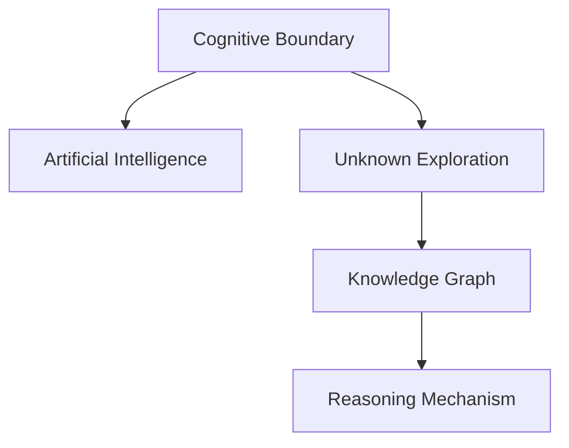

                 

# 人类知识的局限性：承认与探索未知

> 关键词：认知边界，人工智能，未知探索，知识图谱，推理机制，局限性，未来方向

## 1. 背景介绍

### 1.1 问题由来

在人类历史的长河中，知识的积累一直是推动社会进步的动力源泉。无论是古希腊的哲学家、中世纪的学者，还是近现代的科学家，人们都在不断探索未知，拓宽认知边界。然而，随着科学技术的快速发展，尤其是人工智能技术的兴起，人们逐渐意识到，尽管技术不断进步，但人类对未知的探索仍处于起步阶段。

特别是在信息时代，人类知识的积累和传播速度远远超过以往任何时期。数据、信息和计算资源的大幅增加，使得我们可以前所未有地接近自然界的真相。但与此同时，人类知识的局限性也愈发明显。例如，在面对复杂的自然现象、抽象的科学概念、深邃的哲学问题时，我们依然无法找到完美的解释和解决方案。

这些问题不仅涉及到科学和技术本身，还关系到人类对自身的认知。面对这些未知，我们需要正视自身的局限性，同时寻找新的方法去探索和理解这些未知。本文将从认知边界、人工智能、未知探索三个角度，探讨人类知识的局限性，并提出一些可能的解决方案和未来方向。

## 2. 核心概念与联系

### 2.1 核心概念概述

为更好地理解人类知识的局限性，本节将介绍几个密切相关的核心概念：

- 认知边界（Cognitive Boundary）：指人类对世界的理解和认知能达到的极限，即人类已知和未知的分界。
- 人工智能（Artificial Intelligence, AI）：指利用计算机技术，通过算法和模型，实现类似人类智能的决策、推理、学习等能力。
- 未知探索（Exploration of the Unknown）：指通过科学研究、技术开发、哲学思考等方式，拓展人类认知边界，发现新知识的过程。
- 知识图谱（Knowledge Graph）：指通过结构化的方式，描述和组织知识信息，使得机器能够理解和推理。
- 推理机制（Reasoning Mechanism）：指通过逻辑推理、模式识别等方法，从已知知识中推导出新知识的过程。

这些核心概念之间的逻辑关系可以通过以下Mermaid流程图来展示：



这个流程图展示了一系列的关联关系：

1. 认知边界定义了人工智能的探索范围。
2. 未知探索是拓展认知边界的重要手段。
3. 知识图谱是未知探索的具体表现形式。
4. 推理机制是知识图谱的核心。

## 3. 核心算法原理 & 具体操作步骤

### 3.1 算法原理概述

人工智能的根本目标是通过算法和模型，拓展人类的认知边界，发现和理解未知。这一过程大致可以分为三个步骤：

1. **数据收集**：通过传感器、互联网、实验等手段，收集大量的数据，包括自然界的现象、科学实验的结果、人类社会的行为等。
2. **模型训练**：使用机器学习算法，从收集的数据中学习模式，构建知识图谱。知识图谱是一种结构化的表示形式，能够将数据中的关系和实体清晰地展示出来。
3. **推理应用**：使用推理机制，从知识图谱中抽取有用的信息，推导出新知识，解决实际问题。

这一过程的关键在于模型的设计和训练，以及推理机制的合理选择。而要真正拓展认知边界，则需要不断地收集数据、优化模型、调整推理机制，使得人工智能能够更好地理解和应对未知。

### 3.2 算法步骤详解

#### 数据收集

数据收集是人工智能的第一步，也是最重要的环节之一。数据的质量和多样性直接影响着模型的训练效果和推理能力。以下是常见的数据收集方法：

1. **传感器数据**：通过各类传感器（如温度、湿度、声音、图像等）收集物理世界的信息，为模型提供真实世界的观察数据。
2. **互联网数据**：从社交媒体、论坛、新闻网站等在线平台收集文本、视频、音频等数据，获取人类社会的交互和行为模式。
3. **实验数据**：在实验室环境下，通过控制变量，进行科学实验，收集数据以验证假设和发现规律。

#### 模型训练

模型训练是构建知识图谱的关键步骤，需要选择合适的算法和框架。以下是常用的模型训练方法：

1. **监督学习**：使用标注数据训练模型，学习输入和输出之间的关系，如图像分类、自然语言处理等任务。
2. **无监督学习**：使用未标注数据训练模型，发现数据中的潜在结构，如聚类、降维等任务。
3. **强化学习**：通过与环境的交互，学习最优决策策略，如自动驾驶、机器人控制等任务。

#### 推理应用

推理应用是将知识图谱转化为实际应用的过程，需要选择合适的推理机制。以下是常用的推理方法：

1. **逻辑推理**：基于逻辑规则，从已知事实中推导出新知识，如数学证明、法律推理等。
2. **概率推理**：使用贝叶斯网络、马尔可夫模型等方法，从已知数据中推断出新知识，如天气预测、信用评估等。
3. **模糊推理**：处理不确定和模糊的数据，使用模糊逻辑、神经网络等方法，从已知数据中推断出新知识，如医学诊断、风险评估等。

### 3.3 算法优缺点

人工智能拓展认知边界的过程中，存在以下优点和缺点：

#### 优点

1. **快速高效**：人工智能可以通过大规模并行计算，快速处理大量数据，发现新知识。
2. **跨越边界**：人工智能能够处理多模态数据，跨越人类认知的界限，发现新领域和规律。
3. **自适应性**：人工智能可以根据环境变化和数据更新，自我调整和优化，适应新的认知挑战。

#### 缺点

1. **数据依赖**：人工智能的训练和推理依赖于大量高质量的数据，数据不足可能导致性能下降。
2. **模型复杂性**：复杂的模型需要大量的计算资源，难以在大规模数据上高效运行。
3. **解释性不足**：人工智能的决策过程缺乏可解释性，难以理解其内部工作机制。

### 3.4 算法应用领域

人工智能在多个领域展示了强大的潜力，以下是几个典型的应用领域：

1. **自然语言处理**：通过语言模型和推理机制，实现自动翻译、文本生成、情感分析等任务。
2. **图像识别**：通过卷积神经网络等模型，实现图像分类、物体检测、人脸识别等任务。
3. **智能推荐**：通过协同过滤、深度学习等方法，实现个性化推荐、广告投放等任务。
4. **智能控制**：通过强化学习等技术，实现机器人控制、自动驾驶、智能家居等任务。
5. **医学诊断**：通过医疗知识图谱和推理机制，实现疾病诊断、治疗方案推荐等任务。
6. **金融风控**：通过信用评分、风险评估等模型，实现金融欺诈检测、信用评估等任务。

## 4. 数学模型和公式 & 详细讲解 & 举例说明

### 4.1 数学模型构建

为了更好地理解人工智能在拓展认知边界中的应用，本节将介绍几个核心的数学模型：

- **知识图谱（Knowledge Graph）**：知识图谱是一种由实体和关系构成的有向图，用于表示知识结构。
- **逻辑推理（Logical Reasoning）**：逻辑推理是基于逻辑规则，从已知事实中推导新知识的过程。
- **概率推理（Probabilistic Reasoning）**：概率推理是基于概率模型，从已知数据中推断新知识的过程。
- **模糊推理（Fuzzy Reasoning）**：模糊推理是基于模糊逻辑，处理不确定和模糊数据的过程。

### 4.2 公式推导过程

以下是几个核心模型的公式推导过程：

#### 知识图谱

知识图谱由节点和边构成，节点表示实体，边表示实体之间的关系。知识图谱的构建可以通过以下步骤：

1. **实体识别**：从文本、图像等数据中识别出实体。
2. **关系抽取**：从文本中抽取实体之间的关系。
3. **图谱构建**：将实体和关系构建成知识图谱。

#### 逻辑推理

逻辑推理可以通过命题逻辑、谓词逻辑等方法实现。以下是一个简单的命题逻辑推理例子：

假设已知事实如下：

- 前提：所有猫都是动物。
- 假设：小王家养了一只猫。

根据命题逻辑规则，可以推理出：

- 结论：小王家养的猫是动物。

在数学上，可以使用逻辑代数表示为：

$$
\forall x (Cat(x) \Rightarrow Animal(x)) \land Cat(\text{小王家的猫}) \Rightarrow Animal(\text{小王家的猫})
$$

#### 概率推理

概率推理可以通过贝叶斯网络、马尔可夫模型等方法实现。以下是一个简单的贝叶斯网络推理例子：

假设已知数据如下：

- 天气条件：晴天、雨天。
- 出行方式：开车、走路。

根据贝叶斯网络规则，可以推理出：

- 在雨天，开车出行的概率比走路高。

在数学上，可以使用贝叶斯定理表示为：

$$
P(\text{开车} \mid \text{雨天}) = \frac{P(\text{雨天} \mid \text{开车})P(\text{开车})}{P(\text{雨天})}
$$

#### 模糊推理

模糊推理可以通过模糊逻辑、神经网络等方法实现。以下是一个简单的模糊推理例子：

假设已知事实如下：

- 气温：低、中、高。
- 感觉舒适度：很不舒服、不舒服、一般、舒服、很舒适。

根据模糊逻辑规则，可以推理出：

- 在低气温下，感觉舒适度很低。

在数学上，可以使用模糊集合表示为：

$$
\text{感觉舒适度}(\text{低气温}) = \text{很不舒服} = \text{模糊集合}(\text{低气温})
$$

### 4.3 案例分析与讲解

#### 案例一：医疗知识图谱

医疗知识图谱是一个典型的应用案例，通过构建医学领域的知识图谱，人工智能可以辅助医生进行疾病诊断和治疗方案推荐。以下是具体的构建步骤：

1. **数据收集**：从医学文献、临床记录、病历等数据中提取实体和关系。
2. **实体识别**：使用自然语言处理技术，识别出医学实体（如疾病、药物、症状等）。
3. **关系抽取**：从医学文本中抽取实体之间的关系（如症状-疾病、药物-副作用等）。
4. **图谱构建**：将实体和关系构建成医疗知识图谱。

通过医疗知识图谱，人工智能可以：

- 发现新的疾病组合和症状。
- 推荐个性化的治疗方案。
- 预测疾病的发展趋势。

#### 案例二：智能推荐系统

智能推荐系统是一个典型的应用案例，通过构建用户行为和物品属性的知识图谱，人工智能可以为用户提供个性化的推荐服务。以下是具体的构建步骤：

1. **数据收集**：从用户行为数据（如浏览记录、购买记录等）和物品属性数据中提取实体和关系。
2. **实体识别**：使用自然语言处理技术，识别出用户和物品属性。
3. **关系抽取**：从用户行为数据和物品属性数据中抽取实体之间的关系（如用户-物品、物品-属性等）。
4. **图谱构建**：将实体和关系构建成推荐知识图谱。

通过推荐知识图谱，人工智能可以：

- 发现用户和物品之间的潜在关系。
- 推荐个性化的物品。
- 优化推荐算法。

## 5. 项目实践：代码实例和详细解释说明

### 5.1 开发环境搭建

在进行项目实践前，我们需要准备好开发环境。以下是使用Python进行PyTorch开发的环境配置流程：

1. 安装Anaconda：从官网下载并安装Anaconda，用于创建独立的Python环境。

2. 创建并激活虚拟环境：
```bash
conda create -n pytorch-env python=3.8 
conda activate pytorch-env
```

3. 安装PyTorch：根据CUDA版本，从官网获取对应的安装命令。例如：
```bash
conda install pytorch torchvision torchaudio cudatoolkit=11.1 -c pytorch -c conda-forge
```

4. 安装TensorFlow：使用以下命令安装TensorFlow：
```bash
pip install tensorflow
```

5. 安装各类工具包：
```bash
pip install numpy pandas scikit-learn matplotlib tqdm jupyter notebook ipython
```

完成上述步骤后，即可在`pytorch-env`环境中开始项目实践。

### 5.2 源代码详细实现

这里我们以医疗知识图谱的构建为例，给出使用PyTorch和TensorFlow进行知识图谱构建的代码实现。

首先，定义实体和关系的Python类：

```python
import torch
import tensorflow as tf

class Entity:
    def __init__(self, id, name):
        self.id = id
        self.name = name
        
class Relationship:
    def __init__(self, id, name):
        self.id = id
        self.name = name
        
# 定义实体和关系
entities = []
relationships = []

# 添加实体
entity1 = Entity(1, '疾病1')
entity2 = Entity(2, '疾病2')
entities.append(entity1)
entities.append(entity2)

relationship1 = Relationship(1, '治疗')
relationship2 = Relationship(2, '副作用')
relationships.append(relationship1)
relationships.append(relationship2)
```

然后，定义知识图谱的Python类：

```python
class KnowledgeGraph:
    def __init__(self):
        self.entities = []
        self.relationships = []
        self.graph = {}
        
    def add_entity(self, entity):
        self.entities.append(entity)
        self.graph[entity.id] = []
        
    def add_relationship(self, relationship):
        self.relationships.append(relationship)
        self.graph[relationship.from_id].append(relationship.to_id)
        
    def get_neighbours(self, node_id):
        return self.graph[node_id]
```

接着，定义构建知识图谱的函数：

```python
def build_knowledge_graph():
    kg = KnowledgeGraph()
    
    # 添加实体
    kg.add_entity(entity1)
    kg.add_entity(entity2)
    
    # 添加关系
    kg.add_relationship(relationship1)
    kg.add_relationship(relationship2)
    
    # 输出知识图谱
    for entity in kg.entities:
        print(entity.id, entity.name)
        print(kg.get_neighbours(entity.id))
```

最后，调用构建函数并输出结果：

```python
build_knowledge_graph()
```

以上就是使用PyTorch和TensorFlow构建知识图谱的完整代码实现。可以看到，通过定义实体和关系类，我们可以方便地构建和查询知识图谱，进一步实现更复杂的推理应用。

### 5.3 代码解读与分析

让我们再详细解读一下关键代码的实现细节：

**Entity类和Relationship类**：
- 定义了实体和关系的属性和方法。
- 通过实体和关系的id和name，可以方便地构建知识图谱。

**KnowledgeGraph类**：
- 定义了知识图谱的基本结构和操作。
- 使用字典数据结构，将实体和关系组织成一个图谱。
- 支持添加实体和关系，查询节点邻居等操作。

**build_knowledge_graph函数**：
- 创建一个知识图谱对象。
- 通过add_entity和add_relationship方法，构建实体和关系。
- 输出知识图谱的结构。

在实际应用中，知识图谱的构建还需要更多复杂的算法和模型支持，如实体识别、关系抽取、图谱嵌入等技术。但核心的构建过程与上述代码类似，可以逐步扩展和优化。

## 6. 实际应用场景

### 6.1 医疗知识图谱

在医疗领域，知识图谱的应用非常广泛，可以辅助医生进行疾病诊断、治疗方案推荐等任务。

通过构建医疗知识图谱，人工智能可以：

- 发现新的疾病组合和症状。
- 推荐个性化的治疗方案。
- 预测疾病的发展趋势。

### 6.2 智能推荐系统

在电商、视频、音乐等领域，智能推荐系统已经广泛应用于个性化推荐。通过构建推荐知识图谱，人工智能可以：

- 发现用户和物品之间的潜在关系。
- 推荐个性化的物品。
- 优化推荐算法。

### 6.3 智能控制

在工业、农业、交通等领域，智能控制技术可以大幅提升效率和安全性。通过构建知识图谱，人工智能可以：

- 实时监控和调整设备状态。
- 预测故障并进行预防性维护。
- 优化生产流程。

## 7. 工具和资源推荐

### 7.1 学习资源推荐

为了帮助开发者系统掌握人工智能和知识图谱的理论基础和实践技巧，这里推荐一些优质的学习资源：

1. 《深度学习》系列书籍：由多位著名机器学习专家合著，系统介绍了深度学习的基本原理和应用。
2. 《人工智能基础》课程：由斯坦福大学和Coursera联合推出，讲解了人工智能的基本概念和前沿技术。
3. 《Knowledge Graphs in Healthcare》论文：介绍了在医疗领域构建知识图谱的技术和应用。
4. 《TensorFlow》官方文档：提供了丰富的API和示例，帮助开发者快速上手TensorFlow。
5. 《Graph Neural Networks》论文：介绍了基于图神经网络的推理算法，适用于知识图谱的构建和推理。

通过对这些资源的学习实践，相信你一定能够快速掌握人工智能和知识图谱的精髓，并用于解决实际的认知边界探索问题。

### 7.2 开发工具推荐

高效的开发离不开优秀的工具支持。以下是几款用于人工智能和知识图谱开发的常用工具：

1. PyTorch：基于Python的开源深度学习框架，灵活动态的计算图，适合快速迭代研究。
2. TensorFlow：由Google主导开发的开源深度学习框架，生产部署方便，适合大规模工程应用。
3. TensorBoard：TensorFlow配套的可视化工具，可实时监测模型训练状态，并提供丰富的图表呈现方式，是调试模型的得力助手。
4. Weights & Biases：模型训练的实验跟踪工具，可以记录和可视化模型训练过程中的各项指标，方便对比和调优。
5. Gephi：用于构建和可视化图谱的工具，支持多种图谱算法和布局方式。

合理利用这些工具，可以显著提升人工智能和知识图谱的开发效率，加快创新迭代的步伐。

### 7.3 相关论文推荐

人工智能和知识图谱的发展源于学界的持续研究。以下是几篇奠基性的相关论文，推荐阅读：

1. Graph Neural Networks（GNN）：提出了基于图神经网络的图谱推理算法，适用于知识图谱的构建和推理。
2. Deep Learning for Healthcare：介绍了深度学习在医疗领域的多种应用，包括医学图像分析、药物发现等。
3. Knowledge Graphs in Healthcare：介绍了在医疗领域构建知识图谱的技术和应用。
4. Knowledge Graphs in Recommendation Systems：介绍了知识图谱在推荐系统中的应用和效果。
5. Probabilistic Reasoning in AI：介绍了概率推理的基本原理和应用场景。

这些论文代表了大语言模型微调技术的发展脉络。通过学习这些前沿成果，可以帮助研究者把握学科前进方向，激发更多的创新灵感。

## 8. 总结：未来发展趋势与挑战

### 8.1 研究成果总结

本文对人工智能和知识图谱的拓展认知边界进行了全面系统的介绍。首先阐述了认知边界和人工智能的定义，明确了知识图谱和推理机制的重要性。其次，从数据收集、模型训练和推理应用三个角度，详细讲解了人工智能在拓展认知边界中的应用。最后，讨论了人工智能在医疗、推荐、控制等领域的实际应用，提出了未来发展的方向和挑战。

通过本文的系统梳理，可以看到，人工智能和知识图谱在多个领域展示了强大的潜力，拓展了人类的认知边界，解决了许多未知问题。未来，伴随算力、数据、模型的不断发展，人工智能和知识图谱的应用将更加广泛，进一步推动人类社会的发展。

### 8.2 未来发展趋势

展望未来，人工智能和知识图谱的发展将呈现以下几个趋势：

1. 数据驱动的智能：未来的人工智能将更加依赖数据驱动的模型和算法，通过大规模数据训练，实现更精准的推理和预测。
2. 跨领域融合：人工智能和知识图谱将与其他领域的技术进行更紧密的融合，如物联网、区块链、生物信息学等，形成更全面的知识体系。
3. 自适应学习：人工智能将具备更强的自适应能力，能够根据环境变化和用户需求，动态调整模型和策略。
4. 协作推理：知识图谱将与其他推理技术（如自然语言处理、专家系统等）进行协作，实现更复杂的推理和决策。
5. 跨语言和跨文化：人工智能和知识图谱将支持多语言和多文化的推理，打破语言和文化的界限，实现更广泛的应用。

### 8.3 面临的挑战

尽管人工智能和知识图谱取得了显著进展，但在迈向更加智能化、普适化应用的过程中，仍面临诸多挑战：

1. 数据隐私和安全：大规模数据的应用可能带来隐私和安全问题，需要在数据使用和保护之间找到平衡。
2. 模型复杂性：复杂的模型需要大量的计算资源，如何在保证性能的同时，降低资源消耗，是一个重要问题。
3. 解释性和可信性：人工智能的决策过程缺乏可解释性，难以理解其内部工作机制，这将影响其在高风险领域的应用。
4. 知识整合：现有知识图谱通常局限于特定领域，如何与其他知识源整合，形成更全面的知识体系，是未来的一大挑战。
5. 认知局限性：人工智能虽然能够处理复杂问题，但依然存在认知局限性，难以完全替代人类的思维和决策。

### 8.4 研究展望

面对人工智能和知识图谱所面临的种种挑战，未来的研究需要在以下几个方面寻求新的突破：

1. 数据隐私保护：开发隐私保护技术，确保数据使用过程中的隐私和安全。
2. 模型压缩和优化：通过模型压缩、量化等技术，降低模型的复杂性和计算资源消耗。
3. 解释性增强：引入可解释性算法，增强人工智能模型的可解释性和可信性。
4. 知识整合和融合：开发知识整合技术，将不同来源的知识进行融合，形成更全面的知识图谱。
5. 跨领域应用：探索人工智能在更多领域的应用，如法律、金融、安全等，提升人工智能的普适性。

这些研究方向的探索，必将引领人工智能和知识图谱技术的进一步发展，拓展人类的认知边界，推动社会进步。

## 9. 附录：常见问题与解答

**Q1：人工智能和知识图谱是否适用于所有领域？**

A: 人工智能和知识图谱在许多领域展示了强大的潜力，但并不适用于所有领域。例如，对于一些需要高精度和实时性的任务，如航空、医疗等，人工智能和知识图谱的性能可能受到限制。此外，对于一些需要深度符号推理的任务，如哲学、文学等，人工智能和知识图谱的性能也存在局限性。因此，在选择应用时，需要综合考虑任务的特点和需求。

**Q2：人工智能和知识图谱的性能是否会不断提高？**

A: 随着算力、数据和模型的不断发展，人工智能和知识图谱的性能将不断提高。未来，通过更先进的算法和模型，人工智能将具备更强的推理能力和泛化性能，知识图谱也将更全面和精确。然而，随着性能的提升，也需要更多的高质量数据和资源支持，这将是一个长期且复杂的过程。

**Q3：人工智能和知识图谱在实际应用中是否存在局限性？**

A: 人工智能和知识图谱在实际应用中确实存在一些局限性：

1. 数据隐私和安全：大规模数据的应用可能带来隐私和安全问题，需要在数据使用和保护之间找到平衡。
2. 模型复杂性：复杂的模型需要大量的计算资源，如何在保证性能的同时，降低资源消耗，是一个重要问题。
3. 解释性和可信性：人工智能的决策过程缺乏可解释性，难以理解其内部工作机制，这将影响其在高风险领域的应用。

**Q4：人工智能和知识图谱的未来发展方向是什么？**

A: 人工智能和知识图谱的未来发展方向主要包括：

1. 数据驱动的智能：未来的人工智能将更加依赖数据驱动的模型和算法，通过大规模数据训练，实现更精准的推理和预测。
2. 跨领域融合：人工智能和知识图谱将与其他领域的技术进行更紧密的融合，如物联网、区块链、生物信息学等，形成更全面的知识体系。
3. 自适应学习：人工智能将具备更强的自适应能力，能够根据环境变化和用户需求，动态调整模型和策略。
4. 协作推理：知识图谱将与其他推理技术（如自然语言处理、专家系统等）进行协作，实现更复杂的推理和决策。
5. 跨语言和跨文化：人工智能和知识图谱将支持多语言和多文化的推理，打破语言和文化的界限，实现更广泛的应用。

这些方向将引领人工智能和知识图谱技术的进一步发展，拓展人类的认知边界，推动社会进步。

---

作者：禅与计算机程序设计艺术 / Zen and the Art of Computer Programming

