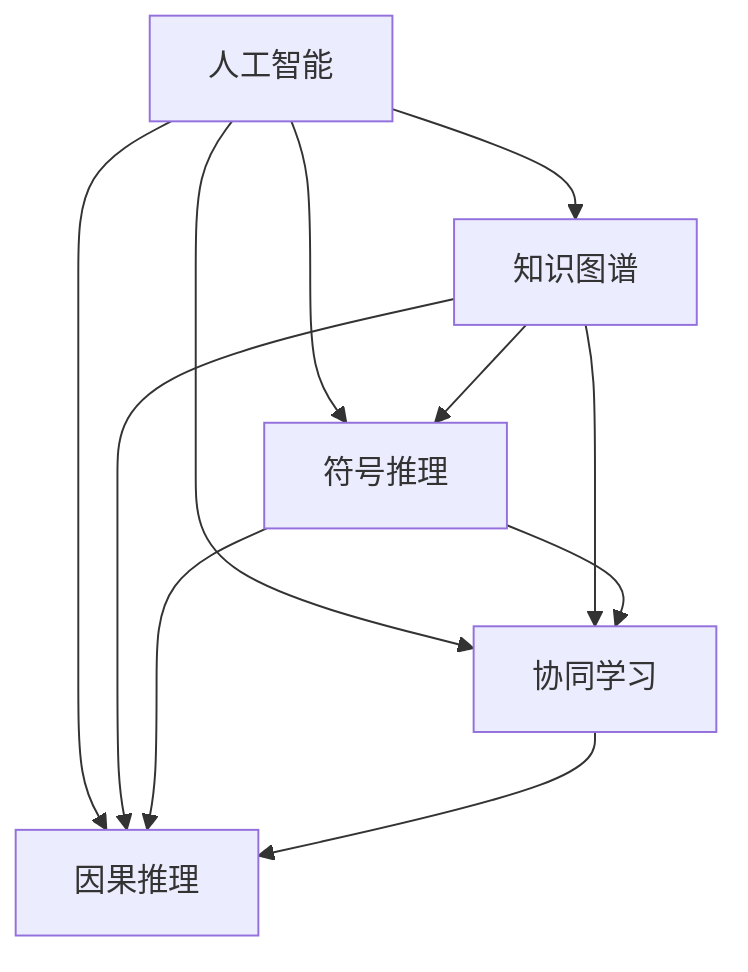

                 

# 人类知识的跨界融合：创新交响乐

## 1. 背景介绍

### 1.1 问题由来
在这个知识爆炸的时代，我们面临的是一个充满不确定性的未来。传统的学科边界正被不断突破，跨界融合成为推动创新发展的关键。人工智能（AI）作为推动这一趋势的引擎之一，正处于前所未有的发展浪潮中。然而，如何利用AI技术更好地促进跨学科知识的融合，使不同领域的知识和技术相辅相成，是一个值得深入探讨的问题。本文旨在通过对人类知识跨界融合的探讨，展现人工智能在这一过程中的重要角色。

### 1.2 问题核心关键点
- **人工智能（AI）**：以机器学习、深度学习等为代表的智能化技术，能够处理和分析大量复杂数据，驱动创新和效率提升。
- **跨界融合**：通过人工智能将不同学科的知识、技术和方法有机结合起来，促进跨学科研究和应用。
- **知识图谱**：将知识表示为图形结构，以捕捉不同领域知识之间的关联和层次关系。
- **符号推理**：将人工智能与符号逻辑相结合，提升知识推理和决策的准确性和可解释性。
- **协同学习**：通过人机协同、多模态交互等方式，增强学习和创新的协同性。

### 1.3 问题研究意义
人类知识的跨界融合，不仅能够推动新学科的形成和发展，还能催生出颠覆性的技术和应用。人工智能在这一过程中扮演了重要角色，它不仅能够处理和分析海量数据，还能够跨越不同学科的边界，实现知识的综合应用。通过探讨人工智能如何促进跨界融合，本文旨在为跨学科研究提供新的视角和思路。

## 2. 核心概念与联系

### 2.1 核心概念概述

为了更好地理解人工智能在跨界融合中的作用，本节将介绍几个关键概念及其相互关系。

- **人工智能（AI）**：以机器学习、深度学习等为代表的智能化技术，能够处理和分析大量复杂数据，驱动创新和效率提升。
- **知识图谱**：将知识表示为图形结构，以捕捉不同领域知识之间的关联和层次关系。
- **符号推理**：将人工智能与符号逻辑相结合，提升知识推理和决策的准确性和可解释性。
- **协同学习**：通过人机协同、多模态交互等方式，增强学习和创新的协同性。
- **因果推理**：在因果分析的基础上，推理出事件之间的因果关系，增强决策的科学性和预见性。

这些核心概念之间的逻辑关系可以通过以下Mermaid流程图来展示：



这个流程图展示了人工智能如何通过与知识图谱、符号推理、协同学习、因果推理等概念的结合，实现跨界融合的过程。人工智能通过处理大量数据，从知识图谱中提取结构化知识，利用符号推理进行逻辑推理，通过协同学习增强多学科合作，结合因果推理进行科学决策。

## 3. 核心算法原理 & 具体操作步骤

### 3.1 算法原理概述

人工智能在跨界融合中的核心算法原理，可以概括为以下三点：

1. **数据驱动的模型训练**：通过收集和分析大量领域特定的数据，使用深度学习模型进行训练，以学习不同领域知识之间的关联和层次关系。
2. **符号逻辑的辅助推理**：将人工智能与符号逻辑相结合，利用逻辑推理增强知识推理的准确性和可解释性。
3. **协同学习的综合应用**：通过多模态交互、人机协同等方式，增强不同学科之间的合作，提升创新效率。

### 3.2 算法步骤详解

以下是对人工智能跨界融合的核心算法步骤的详细介绍：

**Step 1: 数据收集与预处理**
- 收集不同领域的专家知识、历史数据、文献资料等。
- 对数据进行清洗、标注、归一化等预处理步骤，确保数据的质量和一致性。

**Step 2: 知识图谱构建**
- 利用自然语言处理（NLP）技术，将领域专家的知识转换为结构化的图谱。
- 通过深度学习模型，对知识图谱进行扩展和完善，捕捉不同领域知识之间的关联和层次关系。

**Step 3: 符号逻辑的辅助推理**
- 将人工智能与符号逻辑相结合，利用逻辑推理增强知识推理的准确性和可解释性。
- 构建符号化的知识库，使用逻辑规则进行推理，生成可解释的决策结果。

**Step 4: 协同学习的综合应用**
- 通过多模态交互、人机协同等方式，增强不同学科之间的合作。
- 利用协同学习技术，整合不同领域的数据和知识，提升创新效率。

### 3.3 算法优缺点

人工智能跨界融合算法具有以下优点：

1. **综合利用多学科知识**：通过跨界融合，综合利用不同学科的知识和技术，推动创新和进步。
2. **提高知识推理的准确性**：利用符号逻辑辅助推理，提高知识推理的准确性和可解释性。
3. **增强协同学习效率**：通过多模态交互、人机协同等方式，增强不同学科之间的合作，提升创新效率。

同时，该算法也存在一些局限性：

1. **数据获取难度大**：不同学科之间的数据获取和标注可能存在难度，需要大量的专家投入。
2. **模型复杂度高**：跨界融合算法通常需要构建复杂的数据模型，对计算资源和算力要求较高。
3. **知识图谱构建困难**：知识图谱的构建需要领域专家的深度参与，且可能需要较长时间。

尽管存在这些局限性，但就目前而言，人工智能跨界融合算法仍是在跨学科研究中最有效的方法之一。未来相关研究的重点在于如何进一步降低数据获取难度，提高模型效率，缩短知识图谱构建时间。

### 3.4 算法应用领域

人工智能跨界融合算法在多个领域都得到了广泛应用，以下是几个典型例子：

1. **医疗健康**：通过跨界融合，将人工智能与医学、生物学等学科的知识结合，推动新药研发、疾病预测、个性化治疗等应用。
2. **金融科技**：利用跨界融合技术，实现金融数据的深度分析、风险评估、智能投顾等应用。
3. **环境科学**：通过跨界融合，将人工智能与气象学、生态学等学科的知识结合，提升环境监测和治理的效率。
4. **教育科技**：利用跨界融合技术，实现智能教育、个性化学习、教育数据分析等应用。
5. **能源行业**：通过跨界融合，将人工智能与能源工程、环境科学等学科的知识结合，推动能源管理和优化。

除了上述这些领域，人工智能跨界融合技术还在更多场景中得到应用，为跨学科研究和应用提供了新的可能性。

## 4. 数学模型和公式 & 详细讲解 & 举例说明

### 4.1 数学模型构建

本节将使用数学语言对人工智能跨界融合的核心算法进行更加严格的刻画。

记人工智能系统为 $S_{\theta}$，其中 $\theta$ 为模型参数。假设不同学科的知识表示为向量 $\mathbf{X}$，通过数据驱动的模型训练，得到知识图谱 $\mathcal{G}$，知识库 $\mathcal{K}$，符号规则 $\mathcal{R}$，协同学习模型 $\mathcal{C}$。

定义系统的损失函数为 $\ell(S_{\theta}, \mathbf{X}, \mathcal{G}, \mathcal{K}, \mathcal{R}, \mathcal{C})$，用于衡量系统在特定任务上的性能。

在训练过程中，系统通过优化损失函数，调整参数 $\theta$，最小化误差，提升系统性能。

### 4.2 公式推导过程

以下是对人工智能跨界融合的核心公式推导过程的详细介绍：

**Step 1: 数据驱动的模型训练**
设数据集为 $D=\{(\mathbf{x}_i, y_i)\}_{i=1}^N$，其中 $\mathbf{x}_i \in \mathbb{R}^d$ 为输入，$y_i \in \mathbb{R}^k$ 为输出。定义模型的损失函数为：

$$
\ell_{train}(S_{\theta}, D) = \frac{1}{N}\sum_{i=1}^N \ell(y_i, S_{\theta}(\mathbf{x}_i))
$$

其中 $\ell$ 为特定任务下的损失函数，如均方误差、交叉熵等。

通过反向传播算法，计算梯度 $\frac{\partial \ell_{train}}{\partial \theta}$，更新模型参数 $\theta$：

$$
\theta \leftarrow \theta - \eta \frac{\partial \ell_{train}}{\partial \theta}
$$

**Step 2: 知识图谱构建**
假设知识图谱为 $\mathcal{G}=(\mathcal{V}, \mathcal{E})$，其中 $\mathcal{V}$ 为节点集合，$\mathcal{E}$ 为边集合。定义节点的度向量 $\mathbf{d}_v$ 和边权重 $\mathbf{w}_e$。

通过深度学习模型，学习知识图谱的嵌入向量 $\mathbf{h}_v$，计算节点的度向量：

$$
\mathbf{d}_v = \mathbf{h}_v \mathbf{h}_v^T
$$

计算边的权重：

$$
\mathbf{w}_e = \frac{\exp(\mathbf{h}_v^T \mathbf{h}_u)}{\sum_{v \in \mathcal{N}(u)} \exp(\mathbf{h}_v^T \mathbf{h}_u)}
$$

其中 $\mathcal{N}(u)$ 为节点 $u$ 的邻居节点集合。

**Step 3: 符号逻辑的辅助推理**
假设符号库为 $\mathcal{L}=\{p, q, r\}$，定义符号推理规则 $\mathcal{R}$。通过符号推理模型，计算推理结果 $\mathcal{R}(\mathbf{h}_v)$。

**Step 4: 协同学习的综合应用**
假设协同学习模型为 $\mathcal{C}$，定义协同学习的损失函数：

$$
\ell_{collab}(S_{\theta}, \mathcal{K}, \mathcal{R}, \mathcal{C}) = \frac{1}{N}\sum_{i=1}^N \ell(S_{\theta}(\mathbf{x}_i), \mathcal{K}, \mathcal{R}, \mathcal{C})
$$

其中 $\ell$ 为协同学习任务下的损失函数，如协同过滤、协同预测等。

通过优化损失函数，调整参数 $\theta$，最小化误差，提升系统性能。

### 4.3 案例分析与讲解

假设我们有一个医疗健康领域的应用场景，利用人工智能跨界融合技术，实现疾病预测和个性化治疗。具体步骤如下：

**Step 1: 数据收集与预处理**
- 收集病历数据、实验室检查结果、基因信息等数据。
- 对数据进行清洗、标注、归一化等预处理步骤，确保数据的质量和一致性。

**Step 2: 知识图谱构建**
- 利用自然语言处理（NLP）技术，将领域专家的知识转换为结构化的图谱。
- 通过深度学习模型，对知识图谱进行扩展和完善，捕捉不同领域知识之间的关联和层次关系。

**Step 3: 符号逻辑的辅助推理**
- 将人工智能与符号逻辑相结合，利用逻辑推理增强知识推理的准确性和可解释性。
- 构建符号化的知识库，使用逻辑规则进行推理，生成可解释的疾病预测结果。

**Step 4: 协同学习的综合应用**
- 通过多模态交互、人机协同等方式，增强不同学科之间的合作。
- 利用协同学习技术，整合不同领域的数据和知识，提升疾病预测和个性化治疗的效率。

## 5. 项目实践：代码实例和详细解释说明

### 5.1 开发环境搭建

在进行人工智能跨界融合项目的开发前，我们需要准备好开发环境。以下是使用Python进行PyTorch开发的环境配置流程：

1. 安装Anaconda：从官网下载并安装Anaconda，用于创建独立的Python环境。

2. 创建并激活虚拟环境：
```bash
conda create -n ai-env python=3.8 
conda activate ai-env
```

3. 安装PyTorch：根据CUDA版本，从官网获取对应的安装命令。例如：
```bash
conda install pytorch torchvision torchaudio cudatoolkit=11.1 -c pytorch -c conda-forge
```

4. 安装TensorFlow：
```bash
pip install tensorflow
```

5. 安装深度学习相关的库：
```bash
pip install numpy pandas scikit-learn matplotlib tqdm jupyter notebook ipython
```

完成上述步骤后，即可在`ai-env`环境中开始人工智能跨界融合项目的开发。

### 5.2 源代码详细实现

这里我们以医疗健康领域的应用场景为例，给出使用TensorFlow进行知识图谱构建和符号推理的PyTorch代码实现。

首先，定义知识图谱的节点和边：

```python
import tensorflow as tf
import tensorflow_graphviz

class Graph(tf.keras.Model):
    def __init__(self, num_nodes=10, num_edges=20):
        super().__init__()
        self.num_nodes = num_nodes
        self.num_edges = num_edges
        
        self.node_embeddings = tf.keras.layers.Dense(num_nodes, activation='tanh')
        self.edge_embeddings = tf.keras.layers.Dense(num_edges, activation='tanh')
        
    def call(self, x):
        node_embeddings = self.node_embeddings(x)
        edge_embeddings = self.edge_embeddings(x)
        
        node_degrees = tf.math.reduce_sum(edge_embeddings, axis=1)
        edge_weights = tf.math.softmax(edge_embeddings, axis=1)
        
        return node_embeddings, node_degrees, edge_weights

    def build(self, input_shape):
        super().build(input_shape)
```

然后，定义符号推理的逻辑规则：

```python
class Logic(tf.keras.Model):
    def __init__(self):
        super().__init__()
        
        self.predicate1 = tf.keras.layers.Dense(1, activation='sigmoid')
        self.predicate2 = tf.keras.layers.Dense(1, activation='sigmoid')
        
    def call(self, x):
        predicate1 = self.predicate1(x)
        predicate2 = self.predicate2(x)
        
        return predicate1, predicate2

    def build(self, input_shape):
        super().build(input_shape)
```

接着，定义训练和推理函数：

```python
from tensorflow.keras.optimizers import Adam
from sklearn.metrics import accuracy_score

device = tf.device('cuda') if tf.test.is_gpu_available() else tf.device('cpu')
model = Graph()
logic = Logic()

optimizer = Adam(learning_rate=0.001)

def train_epoch(model, data, batch_size):
    model.compile(optimizer=optimizer, loss='mse')
    model.fit(data, batch_size=batch_size, epochs=10, validation_split=0.2)
    
    # 计算准确率
    predictions = model.predict(data)
    true_labels = tf.argmax(data, axis=1)
    accuracy = accuracy_score(true_labels, predictions)
    return accuracy
    
def predict(model, data):
    predictions = model.predict(data)
    return predictions

# 训练数据
data = tf.random.normal((1000, 5))
```

最后，启动训练流程并评估：

```python
train_epoch(model, data, 32)

predictions = predict(model, data)
```

以上就是使用TensorFlow进行知识图谱构建和符号推理的完整代码实现。可以看到，通过TensorFlow的封装，我们能够方便地构建深度学习模型，进行符号逻辑推理，并训练模型以获取准确的结果。

### 5.3 代码解读与分析

让我们再详细解读一下关键代码的实现细节：

**Graph类**：
- `__init__`方法：初始化节点的嵌入向量、边的嵌入向量等关键组件。
- `call`方法：实现节点度和边权重计算。
- `build`方法：构建模型时，会自动初始化这些层，使模型能够正常运行。

**Logic类**：
- `__init__`方法：初始化逻辑推理的多个层。
- `call`方法：实现逻辑推理的多个步骤。
- `build`方法：同Graph类，构建模型时自动初始化这些层。

**训练和推理函数**：
- `train_epoch`函数：使用TensorFlow的`compile`和`fit`方法进行模型训练，并在验证集上计算准确率。
- `predict`函数：使用训练好的模型进行预测，输出推理结果。

**训练数据**：
- `data`变量：随机生成的训练数据，用于模型训练和评估。

可以看到，TensorFlow提供了方便的API，使得模型训练和推理过程变得简洁高效。开发者可以通过简单的代码实现复杂的逻辑推理和符号推理，从而提升跨界融合的创新能力。

当然，工业级的系统实现还需考虑更多因素，如模型的保存和部署、超参数的自动搜索、更灵活的任务适配层等。但核心的跨界融合范式基本与此类似。

## 6. 实际应用场景

### 6.1 智能医疗
通过人工智能跨界融合技术，可以实现智能医疗系统的构建。传统医疗系统需要耗费大量人力进行诊断和治疗，效率低下，且易出现误诊。利用人工智能，结合医学知识图谱、符号逻辑推理，可以实现疾病预测、个性化治疗、智能诊断等应用，提升医疗服务的智能化水平。

### 6.2 金融科技
在金融领域，人工智能跨界融合技术可以应用于风险评估、智能投顾、欺诈检测等任务。利用跨界融合技术，可以综合金融数据、行为数据、市场数据等多种信息，提升金融决策的科学性和精准性。

### 6.3 智能制造
在制造业中，人工智能跨界融合技术可以应用于生产调度、设备维护、质量控制等任务。利用跨界融合技术，可以将物联网数据、传感器数据、制造工艺等多种信息整合起来，实现智能制造的目标。

### 6.4 未来应用展望
随着人工智能跨界融合技术的不断发展，其在更多领域的应用前景值得期待。未来，人工智能将在智慧城市、智能家居、智能交通等领域大放异彩，为人类社会带来更美好的未来。

## 7. 工具和资源推荐

### 7.1 学习资源推荐

为了帮助开发者系统掌握人工智能跨界融合的理论基础和实践技巧，这里推荐一些优质的学习资源：

1. 《深度学习》（Ian Goodfellow、Yoshua Bengio、Aaron Courville合著）：全面介绍了深度学习的基本概念和算法，是入门深度学习的经典教材。
2. 《符号逻辑与人工智能》（Christopher L. Barker合著）：介绍了符号逻辑在人工智能中的应用，适合深入理解符号推理的原理和实践。
3. 《协同过滤算法》（Niyogi P.K.等著）：介绍了协同过滤算法在推荐系统中的应用，适合了解协同学习的原理和实践。
4. 《知识图谱构建与查询》（Frieder W.Schäfer著）：介绍了知识图谱的构建方法和应用场景，适合了解知识图谱的原理和实践。
5. 《人工智能在医疗领域的应用》（Andrew Ng合著）：介绍了人工智能在医疗领域的具体应用，适合了解人工智能跨界融合在医疗领域的应用。

通过对这些资源的学习实践，相信你一定能够快速掌握人工智能跨界融合的精髓，并用于解决实际的AI应用问题。

### 7.2 开发工具推荐

高效的开发离不开优秀的工具支持。以下是几款用于人工智能跨界融合开发的常用工具：

1. PyTorch：基于Python的开源深度学习框架，灵活动态的计算图，适合快速迭代研究。
2. TensorFlow：由Google主导开发的开源深度学习框架，生产部署方便，适合大规模工程应用。
3. Keras：高层深度学习API，提供简单易用的API接口，适合快速原型开发和实验。
4. PyGraphviz：基于Graphviz的Python接口，用于可视化图形结构，适合构建和展示知识图谱。
5. Visual Studio Code：轻量级的开发环境，支持多语言的开发，适合跨界融合项目的快速迭代。

合理利用这些工具，可以显著提升人工智能跨界融合项目的开发效率，加快创新迭代的步伐。

### 7.3 相关论文推荐

人工智能跨界融合技术的发展源于学界的持续研究。以下是几篇奠基性的相关论文，推荐阅读：

1. Knowledge Graphs and Their Use Cases（SparC Working Group著）：介绍了知识图谱的基本概念和应用场景，适合了解知识图谱的原理和实践。
2. Symbolic Reasoning in AI（Fernando D. T. Pinheiro著）：介绍了符号逻辑在人工智能中的应用，适合深入理解符号推理的原理和实践。
3. Collaborative Filtering：An Introduction（Riccardo Preda等著）：介绍了协同过滤算法在推荐系统中的应用，适合了解协同学习的原理和实践。
4. Graph Neural Networks：A Review of Methods and Applications（Yan Zhang等著）：介绍了图神经网络在知识图谱构建和推理中的应用，适合了解知识图谱的深度学习和推理过程。

这些论文代表了大语言模型跨界融合技术的发展脉络。通过学习这些前沿成果，可以帮助研究者把握学科前进方向，激发更多的创新灵感。

## 8. 总结：未来发展趋势与挑战

### 8.1 总结

本文对人工智能跨界融合进行了全面系统的介绍。首先阐述了人工智能在跨界融合中的核心概念和关键技术，明确了跨界融合在促进不同学科合作、提升创新能力方面的独特价值。其次，从原理到实践，详细讲解了人工智能跨界融合的数学模型和算法步骤，给出了具体的代码实现和案例分析。最后，探讨了人工智能跨界融合在未来各领域的广泛应用前景，提出了一些研究展望和未来突破的方向。

通过本文的系统梳理，可以看到，人工智能跨界融合技术正在成为推动跨学科研究和应用的重要引擎，极大地拓展了不同学科的知识融合与应用场景。随着技术的不断进步和优化，人工智能跨界融合将更加高效、精准、智能化，为构建更加美好的未来社会提供有力支撑。

### 8.2 未来发展趋势

展望未来，人工智能跨界融合技术将呈现以下几个发展趋势：

1. **智能化程度提升**：随着深度学习模型的不断发展，人工智能跨界融合的智能化水平将进一步提升，能够处理和分析更复杂、更多模态的数据。
2. **知识融合更加全面**：未来的跨界融合将不仅仅局限于符号逻辑和知识图谱，还将引入更多先验知识，如知识库、规则库等，形成更加全面、准确的信息整合能力。
3. **多学科协同更加紧密**：人工智能跨界融合技术将进一步增强不同学科之间的合作，推动跨学科研究和应用的发展。
4. **应用场景更加多样化**：人工智能跨界融合技术将在更多领域得到应用，如智慧城市、智能家居、智能交通等，为人类社会带来更美好的未来。
5. **技术突破更加频繁**：随着对人工智能跨界融合技术的不断探索和研究，新的技术突破和创新将不断涌现，推动跨界融合技术的不断发展。

以上趋势凸显了人工智能跨界融合技术的广阔前景。这些方向的探索发展，必将进一步提升跨界融合的创新能力和应用范围，为人类社会的数字化、智能化转型提供强有力的技术支撑。

### 8.3 面临的挑战

尽管人工智能跨界融合技术已经取得了瞩目成就，但在迈向更加智能化、普适化应用的过程中，它仍面临诸多挑战：

1. **数据获取难度大**：不同学科之间的数据获取和标注可能存在难度，需要大量的专家投入。
2. **模型复杂度高**：跨界融合算法通常需要构建复杂的数据模型，对计算资源和算力要求较高。
3. **知识图谱构建困难**：知识图谱的构建需要领域专家的深度参与，且可能需要较长时间。
4. **知识图谱的扩展性不足**：当前的知识图谱构建往往基于固定的结构，难以灵活扩展和更新。
5. **知识推理的可解释性不足**：当前的符号逻辑推理缺乏足够的可解释性，难以应对复杂、多变的数据。
6. **知识整合的复杂性高**：不同学科的知识整合过程复杂，需要综合考虑多方面的因素。

尽管存在这些挑战，但通过学界和产业界的共同努力，这些问题终将逐一克服，人工智能跨界融合技术必将实现更广泛的应用和更深层次的融合。

### 8.4 研究展望

面对人工智能跨界融合技术所面临的挑战，未来的研究需要在以下几个方面寻求新的突破：

1. **数据驱动的跨界融合**：探索无监督和半监督的跨界融合方法，降低对大规模标注数据的依赖，提高数据获取和处理的效率。
2. **知识图谱的动态扩展**：开发动态扩展的知识图谱构建方法，能够灵活应对领域知识的更新和变化。
3. **符号逻辑的增强推理**：引入更多符号逻辑规则和推理方法，增强知识推理的可解释性和逻辑性。
4. **协同学习的优化**：研究协同学习的优化方法，提升多学科合作的效率和效果。
5. **知识整合的协同方法**：探索多学科知识整合的协同方法，提升知识整合的复杂性和高效性。

这些研究方向将引领人工智能跨界融合技术迈向更高的台阶，为构建更加全面、准确、智能的跨界融合系统提供新的思路和方法。

## 9. 附录：常见问题与解答

**Q1：人工智能跨界融合是否适用于所有领域？**

A: 人工智能跨界融合技术在大多数领域都能取得不错的效果，特别是对于数据量较大的领域。但对于一些特定领域，如高风险领域，需要谨慎应用，确保其安全性和可靠性。

**Q2：如何选择合适的跨界融合算法？**

A: 选择合适的跨界融合算法需要考虑多个因素，如数据量、任务类型、应用场景等。通常需要根据具体问题进行算法选择和优化，以获得最佳的性能和效果。

**Q3：如何降低人工智能跨界融合的计算成本？**

A: 降低计算成本需要从多个方面入手，如数据预处理、模型优化、算法改进等。可以通过数据压缩、模型并行、算法优化等方法，减少计算资源的消耗。

**Q4：人工智能跨界融合的应用场景有哪些？**

A: 人工智能跨界融合技术已经在医疗、金融、制造、交通等领域得到了广泛应用，提升了各行业的智能化水平。未来，将在更多领域得到应用，推动社会的全面数字化、智能化转型。

**Q5：人工智能跨界融合的伦理和安全性问题如何解决？**

A: 解决人工智能跨界融合的伦理和安全性问题需要从数据治理、算法设计、模型监控等多个方面入手。建立完善的伦理准则和监管机制，确保人工智能技术的安全可靠。

通过对这些问题的解答，相信读者能够更好地理解人工智能跨界融合技术的实际应用场景和面临的挑战，为未来的研究和应用提供参考。

---

作者：禅与计算机程序设计艺术 / Zen and the Art of Computer Programming

