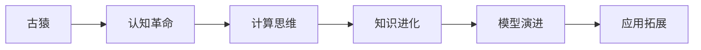

                 

# 人类知识的进化论：从古猿到人工智能

> 关键词：进化论,人工智能,认知革命,深度学习,机器学习,神经网络

## 1. 背景介绍

### 1.1 问题由来
自古以来，人类就一直在不懈探索知识的边界，试图通过观察、实验和推理等方法，逐步揭示自然和社会现象背后的本质规律。从古猿时期对自然界的好奇，到农业革命对知识的累积，再到工业革命对智慧的激扬，人类社会不断在知识的征途中前进。

在当前信息时代，随着科技的迅猛发展，人工智能（Artificial Intelligence, AI）成为了人类智慧的最新形态，正以前所未有的速度改变着世界的面貌。然而，AI技术并非凭空出现，而是人类认知进步的产物。理解AI技术的发展脉络，需要从人类知识的进化角度来考察，探索认知革命的背后动力。

### 1.2 问题核心关键点
人工智能的发展历程，既是人类智慧的结晶，也是认知科学和计算机科学的结合。其主要关键点包括：

- **认知革命**：人类从直觉、经验和传递知识，逐步走向符号化、逻辑化和算法化。
- **计算思维**：从机械计算到符号逻辑，再到数字计算，最终引出深度学习、机器学习等新范式。
- **知识进化**：从经验数据到模型训练，再到多模态数据融合，AI技术在不断汲取知识的同时，也在持续推动知识的扩展与演进。
- **模型演进**：从感知机到BP神经网络，再到深度神经网络，AI模型的结构不断优化，性能不断提升。
- **应用拓展**：从图像识别到自然语言处理，再到多领域融合，AI应用领域不断拓展，深度渗透到各行各业。

本文旨在从人类认知进化论的角度，系统探讨人工智能技术从古猿到现代的演化路径，揭示其内在的驱动力和演进规律。

## 2. 核心概念与联系

### 2.1 核心概念概述

为了更好地理解人工智能技术的发展，我们先来梳理几个核心概念：

- **认知革命**：指人类从直觉、经验和传递知识，逐步走向符号化、逻辑化和算法化的过程。认知革命为人工智能奠定了知识和理论基础。
- **计算思维**：指人类从机械计算到符号逻辑，再到数字计算的转变。计算思维推动了计算机科学的诞生，并引领了人工智能技术的发展。
- **知识进化**：指通过学习、继承和进化，人类不断丰富和完善知识体系的过程。在人工智能中，知识进化表现为数据积累、模型训练和知识图谱构建。
- **模型演进**：指AI模型从简单到复杂，从单一到多模态，从浅层到深层，不断优化和升级的过程。模型演进是AI技术发展的核心动力。
- **应用拓展**：指AI技术从特定领域到多领域，从简单任务到复杂任务，从商业应用到社会治理，逐步扩展和渗透的过程。应用拓展是AI技术进步的最终目标。

这些核心概念之间通过进化论的视角相联系，形成了人工智能技术发展的宏观框架。

### 2.2 核心概念原理和架构的 Mermaid 流程图



## 3. 核心算法原理 & 具体操作步骤

### 3.1 算法原理概述

人工智能技术的核心算法原理主要涉及计算思维、知识进化和模型演进三个方面。下面，我们将逐一展开讨论。

### 3.2 算法步骤详解

#### 3.2.1 计算思维
计算思维是人工智能技术发展的最初动力。人类通过观察、实验和逻辑推理，逐步形成了符号逻辑系统。计算机的诞生，使得人类得以将这种逻辑系统转化为可执行的算法和程序。

1. **布尔逻辑**：计算机早期的计算方式以布尔逻辑为主，通过0和1的组合运算实现基本运算。
2. **图灵机**：图灵机模型作为计算的基本单位，奠定了现代计算机科学的基础。
3. **算法化思考**：从具体问题抽象到一般算法，推动了程序设计的发展，开启了人工智能技术的大门。

#### 3.2.2 知识进化
知识进化是人工智能技术发展的核心过程。通过学习、继承和进化，AI模型逐渐从简单到复杂，从单一到多模态，从浅层到深层，不断优化和升级。

1. **数据积累**：从经验数据到标签化数据，再到多模态数据，数据积累是知识进化的基础。
2. **模型训练**：通过训练算法和优化方法，AI模型从简单模型到复杂模型，从浅层模型到深层模型，不断进化和完善。
3. **知识图谱**：通过知识图谱构建和推理，AI模型实现了对知识的更深层次理解和应用。

#### 3.2.3 模型演进
模型演进是人工智能技术发展的关键路径。从感知机到BP神经网络，再到深度神经网络，AI模型的结构不断优化，性能不断提升。

1. **感知机**：感知机模型基于线性分类器，用于处理简单的图像识别和模式识别任务。
2. **BP神经网络**：反向传播算法（Backpropagation）推动了BP神经网络的发展，使其能够处理非线性问题。
3. **深度神经网络**：深度学习算法（如CNN、RNN、Transformer等）的引入，推动了深度神经网络的发展，使得AI模型能够处理更加复杂和抽象的任务。

### 3.3 算法优缺点

人工智能技术的算法有其独特的优缺点。

**优点**：
1. **高效性**：AI算法能够高效处理大量数据，自动学习知识，解决复杂问题。
2. **适应性**：AI算法具有较强的适应性，能够快速适应环境变化和问题变化。
3. **可扩展性**：AI算法可以通过增加数据和计算资源，不断提升性能和精度。

**缺点**：
1. **黑箱性质**：许多AI算法具有黑箱性质，难以解释其内部工作机制和决策过程。
2. **数据依赖性**：AI算法依赖于高质量的数据，数据不足或偏差可能导致算法失效。
3. **泛化能力有限**：AI算法在特定领域和场景下的泛化能力有限，需要大量标注数据和模型调参。

### 3.4 算法应用领域

人工智能技术的应用领域非常广泛，涵盖各个行业和领域。以下是几个主要的应用领域：

1. **自然语言处理**：AI技术在文本分类、情感分析、机器翻译等自然语言处理任务上取得了巨大成功。
2. **计算机视觉**：AI技术在图像识别、物体检测、人脸识别等计算机视觉任务上表现优异。
3. **机器人学**：AI技术在机器人导航、语音识别、智能客服等机器人应用中广泛应用。
4. **自动驾驶**：AI技术在自动驾驶领域的应用，如环境感知、路径规划等，正在逐步实现。
5. **金融科技**：AI技术在金融风险管理、信用评估、量化交易等领域展现出巨大潜力。
6. **医疗健康**：AI技术在医疗影像分析、个性化医疗、疾病预测等医疗健康领域逐渐普及。
7. **教育科技**：AI技术在智能辅导、个性化推荐、作业批改等教育科技领域得到了广泛应用。

## 4. 数学模型和公式 & 详细讲解 & 举例说明

### 4.1 数学模型构建

人工智能技术的数学模型构建，主要基于数据驱动的统计学和优化理论。以下是一些典型的数学模型：

- **线性回归模型**：用于处理简单的回归问题，如房价预测、股票价格预测等。
- **支持向量机（SVM）模型**：用于处理分类问题，如文本分类、图像分类等。
- **深度神经网络模型**：用于处理复杂的多层次抽象问题，如自然语言处理、计算机视觉等。
- **强化学习模型**：用于处理动态环境下的决策问题，如自动驾驶、游戏AI等。

### 4.2 公式推导过程

以深度神经网络模型为例，其推导过程如下：

1. **前向传播**：
   $$
   y = h_1 \odot W_1 \odot x + b_1
   $$
   其中 $h_1$ 为激活函数，$W_1$ 为权重矩阵，$x$ 为输入向量，$b_1$ 为偏置向量。

2. **损失函数**：
   $$
   J = \frac{1}{N} \sum_{i=1}^N ||y_i - \hat{y}_i||^2
   $$
   其中 $N$ 为样本数，$y_i$ 为真实标签，$\hat{y}_i$ 为模型预测。

3. **反向传播**：
   $$
   \frac{\partial J}{\partial W} = \frac{\partial J}{\partial \hat{y}} \cdot \frac{\partial \hat{y}}{\partial z} \cdot \frac{\partial z}{\partial W}
   $$
   其中 $\frac{\partial J}{\partial \hat{y}}$ 为损失函数对输出层预测值的梯度，$\frac{\partial \hat{y}}{\partial z}$ 为激活函数对中间层的梯度，$\frac{\partial z}{\partial W}$ 为中间层对权重的梯度。

4. **权重更新**：
   $$
   W = W - \alpha \cdot \frac{\partial J}{\partial W}
   $$
   其中 $\alpha$ 为学习率，$\frac{\partial J}{\partial W}$ 为梯度。

### 4.3 案例分析与讲解

以图像识别任务为例，假设输入为28x28的MNIST手写数字图片，输出为0-9的分类标签。

1. **数据准备**：使用TensorFlow库加载MNIST数据集。
2. **模型构建**：搭建一个简单的卷积神经网络（CNN）模型，包含两个卷积层和两个全连接层。
3. **训练模型**：在训练集上训练模型，使用交叉熵损失函数和Adam优化器。
4. **测试模型**：在测试集上测试模型，计算精度和损失值。

## 5. 项目实践：代码实例和详细解释说明

### 5.1 开发环境搭建

进行AI项目实践，需要搭建一个良好的开发环境。以下是一个基本的Python开发环境配置流程：

1. 安装Python：从官网下载安装Python，并配置环境变量。
2. 安装虚拟环境：使用virtualenv或conda创建虚拟环境，隔离不同项目之间的依赖关系。
3. 安装必要的库：使用pip或conda安装必要的Python库，如TensorFlow、Keras、Scikit-learn等。
4. 配置GPU环境：如果需要使用GPU加速，还需要安装CUDA和cuDNN，并配置环境变量。

### 5.2 源代码详细实现

以图像分类任务为例，使用Keras库搭建一个简单的CNN模型。

```python
from keras.models import Sequential
from keras.layers import Conv2D, MaxPooling2D, Flatten, Dense
from keras.datasets import mnist
from keras.utils import to_categorical

# 加载数据集
(x_train, y_train), (x_test, y_test) = mnist.load_data()

# 数据预处理
x_train = x_train.reshape((60000, 28, 28, 1))
x_test = x_test.reshape((10000, 28, 28, 1))
x_train = x_train / 255.0
x_test = x_test / 255.0
y_train = to_categorical(y_train, 10)
y_test = to_categorical(y_test, 10)

# 构建模型
model = Sequential()
model.add(Conv2D(32, kernel_size=(3, 3), activation='relu', input_shape=(28, 28, 1)))
model.add(MaxPooling2D(pool_size=(2, 2)))
model.add(Conv2D(64, kernel_size=(3, 3), activation='relu'))
model.add(MaxPooling2D(pool_size=(2, 2)))
model.add(Flatten())
model.add(Dense(128, activation='relu'))
model.add(Dense(10, activation='softmax'))

# 编译模型
model.compile(loss='categorical_crossentropy', optimizer='adam', metrics=['accuracy'])

# 训练模型
model.fit(x_train, y_train, batch_size=128, epochs=10, validation_data=(x_test, y_test))
```

### 5.3 代码解读与分析

上述代码实现了一个包含两个卷积层和两个全连接层的CNN模型，用于处理MNIST手写数字分类任务。

- **数据预处理**：将输入数据从28x28的二维数组转换为四维数组，并进行归一化处理。
- **模型构建**：包含卷积层、池化层、全连接层等基本组件。
- **模型编译**：设置损失函数、优化器和评估指标。
- **模型训练**：使用训练集数据和验证集数据进行模型训练。

## 6. 实际应用场景

### 6.1 智能客服系统

智能客服系统是AI技术在实际应用中的典型代表之一。通过AI技术，客服系统能够自动理解用户需求，提供24/7的在线支持，大大提高了客户满意度和服务效率。

1. **意图识别**：使用自然语言处理技术，自动识别用户的意图和需求，并进行分类。
2. **对话生成**：基于意图识别结果，生成相应的回复内容，并进行自然语言生成。
3. **上下文理解**：在对话过程中，实时理解上下文信息，保持对话连贯性和一致性。
4. **用户反馈**：通过用户反馈，不断优化模型，提升对话质量。

### 6.2 金融科技

金融科技领域广泛应用AI技术，如信用评估、风险管理、量化交易等。AI技术通过处理海量数据，提供更准确、更快速的金融决策支持。

1. **信用评估**：通过分析用户的金融记录、行为数据等，使用AI模型进行信用评估，提高风险控制能力。
2. **风险管理**：使用AI模型分析市场数据，预测金融风险，提供预警和决策支持。
3. **量化交易**：基于历史数据和市场动态，使用AI模型进行量化交易策略的制定和执行。

### 6.3 医疗健康

AI技术在医疗健康领域的应用也越来越广泛，如医疗影像分析、个性化医疗、疾病预测等。AI技术通过深度学习等技术，提升医疗诊断和治疗的精准性和效率。

1. **医疗影像分析**：使用AI技术分析医疗影像，进行疾病诊断和预测。
2. **个性化医疗**：基于患者的基因、病史等信息，使用AI模型进行个性化治疗方案的制定。
3. **疾病预测**：通过分析患者的健康数据，使用AI模型进行疾病预测和早期预警。

### 6.4 未来应用展望

随着AI技术的不断进步，未来AI应用将更加广泛和深入，以下是一些未来应用的展望：

1. **自动驾驶**：AI技术在自动驾驶领域的应用将更加成熟，提升交通安全性和驾驶效率。
2. **智慧城市**：AI技术在智慧城市治理中的应用将更加广泛，提升城市管理和公共服务的智能化水平。
3. **教育科技**：AI技术在教育领域的应用将更加深入，实现个性化教育和智能辅导。
4. **智能制造**：AI技术在制造业中的应用将更加广泛，实现智能生产和管理。
5. **人机协作**：AI技术将与人类更加紧密地协作，实现更高效的智能生产和服务。

## 7. 工具和资源推荐

### 7.1 学习资源推荐

为了帮助读者深入理解人工智能技术，以下是一些优质的学习资源：

1. **《深度学习》课程**：由吴恩达教授开设，涵盖深度学习的基础理论和应用实践。
2. **《机器学习实战》书籍**：详细介绍了机器学习的各个方面，包括算法、数据预处理、模型评估等。
3. **Google Deep Learning Crash Course**：谷歌推出的深度学习入门课程，涵盖深度学习的核心概念和技术。
4. **Kaggle竞赛平台**：通过参加机器学习竞赛，实践和提升AI模型的性能和应用能力。
5. **TensorFlow官方文档**：提供完整的API文档和样例代码，方便快速上手和深入学习。

### 7.2 开发工具推荐

以下是一些常用的AI开发工具：

1. **TensorFlow**：由谷歌推出的深度学习框架，支持分布式计算和模型优化。
2. **Keras**：基于TensorFlow的高级API，提供简单易用的模型构建和训练接口。
3. **PyTorch**：由Facebook推出的深度学习框架，支持动态计算图和模型优化。
4. **Scikit-learn**：基于Python的机器学习库，提供常用的机器学习算法和工具。
5. **Jupyter Notebook**：支持Python代码块的交互式执行和实时展示，方便模型训练和调试。

### 7.3 相关论文推荐

以下是几篇影响较大的AI相关论文，推荐阅读：

1. **《神经网络与深度学习》书籍**：深度学习领域的经典书籍，详细介绍了神经网络和深度学习的理论基础和应用实践。
2. **《机器学习》书籍**：由Tom Mitchell教授所著，介绍了机器学习的各个方面，包括监督学习、无监督学习和强化学习等。
3. **《深度学习的优化》论文**：探讨深度学习模型的优化算法和加速技术，如梯度下降、动量优化、Adam等。
4. **《深度学习在自然语言处理中的应用》论文**：介绍深度学习在文本分类、机器翻译、情感分析等自然语言处理任务上的应用。
5. **《强化学习基础》论文**：介绍强化学习的理论和算法，如Q-learning、SARSA、Deep Q-Network等。

## 8. 总结：未来发展趋势与挑战

### 8.1 研究成果总结

本文从认知革命、计算思维、知识进化和模型演进四个方面，探讨了人工智能技术的核心概念和应用。通过系统梳理和深入分析，揭示了人工智能技术从古猿到现代的演化路径，展示了其内在的驱动力和演进规律。

### 8.2 未来发展趋势

人工智能技术的未来发展趋势主要包括以下几个方向：

1. **模型规模增大**：随着计算资源和数据量的不断增长，AI模型的规模将持续增大，复杂度将不断提升。
2. **多模态融合**：AI技术将逐渐从单一模态（如图像、文本）向多模态融合（如视觉、听觉、触觉等）发展，实现更全面、更精准的知识理解和应用。
3. **跨领域应用**：AI技术将逐步从特定领域（如医疗、金融）向更多领域（如教育、制造业）扩展，实现跨领域的智能化应用。
4. **人机协作**：AI技术将与人类更加紧密地协作，实现更高效的智能生产和服务。
5. **伦理与安全**：AI技术的伦理和安全问题将越来越受到重视，需要从算法设计、数据使用和模型部署等多个层面进行规范和监管。

### 8.3 面临的挑战

虽然AI技术已经取得了显著成就，但在其发展过程中仍然面临诸多挑战：

1. **数据质量与获取**：高质量的数据获取和处理是AI模型的基础，但数据获取成本高、数据质量参差不齐等问题仍然存在。
2. **模型可解释性**：许多AI模型具有黑箱性质，难以解释其内部工作机制和决策过程，导致模型应用受到限制。
3. **伦理与安全**：AI模型可能学习到有偏见、有害的信息，导致歧视性输出，带来伦理和安全问题。
4. **计算资源**：大规模AI模型的训练和推理需要大量计算资源，硬件瓶颈成为制约其发展的重要因素。
5. **知识迁移**：AI模型在特定领域的应用需要大量标注数据，迁移学习能力不足，难以泛化到其他领域。

### 8.4 研究展望

未来的AI研究需要在以下几个方面进行探索：

1. **无监督与半监督学习**：通过无监督和半监督学习技术，减少对标注数据的依赖，提升AI模型的泛化能力和迁移能力。
2. **可解释性研究**：通过可解释性技术，如注意力机制、模型可视化等，提升AI模型的透明度和可信度。
3. **多领域知识融合**：通过知识图谱、专家系统等技术，实现跨领域知识整合，提升AI模型的综合能力。
4. **公平性与伦理性**：通过公平性算法和伦理设计，避免AI模型带来的偏见和歧视，确保其应用的安全性和合理性。
5. **智能决策**：通过强化学习、决策树等技术，提升AI模型的决策能力，实现更智能的智能决策系统。

## 9. 附录：常见问题与解答

### 9.1 常见问题

**Q1：AI技术的发展历程如何？**

A: AI技术的发展历程经历了以下几个阶段：
1. **符号计算阶段**：从机械计算到符号逻辑，人工智能的研究对象主要是逻辑程序。
2. **专家系统阶段**：基于规则的推理系统，广泛应用于医疗、金融等领域。
3. **机器学习阶段**：使用数据驱动的方法，如回归、分类、聚类等，处理复杂任务。
4. **深度学习阶段**：使用深度神经网络，处理高维度、非线性问题，如图像识别、语音识别等。
5. **增强学习阶段**：通过强化学习，优化决策策略，应用于自动驾驶、游戏AI等。

**Q2：AI技术在实际应用中面临哪些挑战？**

A: AI技术在实际应用中面临以下挑战：
1. **数据质量与获取**：数据不足或质量不高，导致模型性能低下。
2. **模型可解释性**：许多AI模型具有黑箱性质，难以解释其内部工作机制和决策过程。
3. **伦理与安全**：AI模型可能学习到有偏见、有害的信息，导致歧视性输出，带来伦理和安全问题。
4. **计算资源**：大规模AI模型的训练和推理需要大量计算资源，硬件瓶颈成为制约其发展的重要因素。
5. **知识迁移**：AI模型在特定领域的应用需要大量标注数据，迁移学习能力不足，难以泛化到其他领域。

**Q3：如何提升AI模型的可解释性？**

A: 提升AI模型的可解释性，可以从以下几个方面入手：
1. **使用可解释性模型**：如决策树、线性回归等模型，易于解释其决策过程。
2. **模型可视化**：通过可视化技术，展示模型内部结构和工作机制。
3. **使用可解释性技术**：如LIME、SHAP等，提供模型输出的解释。
4. **结合符号逻辑**：将符号逻辑与神经网络结合，增强模型的可解释性。

**Q4：AI技术在医疗健康领域的应用有哪些？**

A: AI技术在医疗健康领域的应用主要有以下几个方面：
1. **医疗影像分析**：使用AI技术分析医疗影像，进行疾病诊断和预测。
2. **个性化医疗**：基于患者的基因、病史等信息，使用AI模型进行个性化治疗方案的制定。
3. **疾病预测**：通过分析患者的健康数据，使用AI模型进行疾病预测和早期预警。

**Q5：AI技术在金融科技领域的应用有哪些？**

A: AI技术在金融科技领域的应用主要有以下几个方面：
1. **信用评估**：通过分析用户的金融记录、行为数据等，使用AI模型进行信用评估，提高风险控制能力。
2. **风险管理**：使用AI模型分析市场数据，预测金融风险，提供预警和决策支持。
3. **量化交易**：基于历史数据和市场动态，使用AI模型进行量化交易策略的制定和执行。

**Q6：AI技术在教育科技领域的应用有哪些？**

A: AI技术在教育科技领域的应用主要有以下几个方面：
1. **智能辅导**：使用AI技术进行智能辅导，提供个性化的学习建议和资源。
2. **个性化推荐**：基于学生的学习数据，使用AI模型进行个性化推荐，提高学习效果。
3. **作业批改**：使用AI技术进行作业批改，提高批改效率和质量。

**Q7：AI技术在智慧城市领域的应用有哪些？**

A: AI技术在智慧城市领域的应用主要有以下几个方面：
1. **城市事件监测**：使用AI技术监测城市事件，及时响应和处理突发情况。
2. **舆情分析**：使用AI技术分析社交媒体数据，预测社会动态和舆情变化。
3. **应急指挥**：使用AI技术进行应急指挥，优化资源配置和调度。

**Q8：AI技术在自动驾驶领域的应用有哪些？**

A: AI技术在自动驾驶领域的应用主要有以下几个方面：
1. **环境感知**：使用AI技术进行环境感知，识别道路、行人、车辆等障碍物。
2. **路径规划**：使用AI技术进行路径规划，制定最优的行驶路径。
3. **决策控制**：使用AI技术进行决策控制，实现自动驾驶。

### 9.2 解答

**A1：AI技术的发展历程如何？**

A: AI技术的发展历程经历了以下几个阶段：
1. **符号计算阶段**：从机械计算到符号逻辑，人工智能的研究对象主要是逻辑程序。
2. **专家系统阶段**：基于规则的推理系统，广泛应用于医疗、金融等领域。
3. **机器学习阶段**：使用数据驱动的方法，如回归、分类、聚类等，处理复杂任务。
4. **深度学习阶段**：使用深度神经网络，处理高维度、非线性问题，如图像识别、语音识别等。
5. **增强学习阶段**：通过强化学习，优化决策策略，应用于自动驾驶、游戏AI等。

**A2：AI技术在实际应用中面临哪些挑战？**

A: AI技术在实际应用中面临以下挑战：
1. **数据质量与获取**：数据不足或质量不高，导致模型性能低下。
2. **模型可解释性**：许多AI模型具有黑箱性质，难以解释其内部工作机制和决策过程。
3. **伦理与安全**：AI模型可能学习到有偏见、有害的信息，导致歧视性输出，带来伦理和安全问题。
4. **计算资源**：大规模AI模型的训练和推理需要大量计算资源，硬件瓶颈成为制约其发展的重要因素。
5. **知识迁移**：AI模型在特定领域的应用需要大量标注数据，迁移学习能力不足，难以泛化到其他领域。

**A3：如何提升AI模型的可解释性？**

A: 提升AI模型的可解释性，可以从以下几个方面入手：
1. **使用可解释性模型**：如决策树、线性回归等模型，易于解释其决策过程。
2. **模型可视化**：通过可视化技术，展示模型内部结构和工作机制。
3. **使用可解释性技术**：如LIME、SHAP等，提供模型输出的解释。
4. **结合符号逻辑**：将符号逻辑与神经网络结合，增强模型的可解释性。

**A4：AI技术在医疗健康领域的应用有哪些？**

A: AI技术在医疗健康领域的应用主要有以下几个方面：
1. **医疗影像分析**：使用AI技术分析医疗影像，进行疾病诊断和预测。
2. **个性化医疗**：基于患者的基因、病史等信息，使用AI模型进行个性化治疗方案的制定。
3. **疾病预测**：通过分析患者的健康数据，使用AI模型进行疾病预测和早期预警。

**A5：AI技术在金融科技领域的应用有哪些？**

A: AI技术在金融科技领域的应用主要有以下几个方面：
1. **信用评估**：通过分析用户的金融记录、行为数据等，使用AI模型进行信用评估，提高风险控制能力。
2. **风险管理**：使用AI模型分析市场数据，预测金融风险，提供预警和决策支持。
3. **量化交易**：基于历史数据和市场动态，使用AI模型进行量化交易策略的制定和执行。

**A6：AI技术在教育科技领域的应用有哪些？**

A: AI技术在教育科技领域的应用主要有以下几个方面：
1. **智能辅导**：使用AI技术进行智能辅导，提供个性化的学习建议和资源。
2. **个性化推荐**：基于学生的学习数据，使用AI模型进行个性化推荐，提高学习效果。
3. **作业批改**：使用AI技术进行作业批改，提高批改效率和质量。

**A7：AI技术在智慧城市领域的应用有哪些？**

A: AI技术在智慧城市领域的应用主要有以下几个方面：
1. **城市事件监测**：使用AI技术监测城市事件，及时响应和处理突发情况。
2. **舆情分析**：使用AI技术分析社交媒体数据，预测社会动态和舆情变化。
3. **应急指挥**：使用AI技术进行应急指挥，优化资源配置和调度。

**A8：AI技术在自动驾驶领域的应用有哪些？**

A: AI技术在自动驾驶领域的应用主要有以下几个方面：
1. **环境感知**：使用AI技术进行环境感知，识别道路、行人、车辆等障碍物。
2. **路径规划**：使用AI技术进行路径规划，制定最优的行驶路径。
3. **决策控制**：使用AI技术进行决策控制，实现自动驾驶。

## 附录：常见问题与解答

**Q9：什么是认知革命？**

A: 认知革命是指人类从直觉、经验和传递知识，逐步走向符号化、逻辑化和算法化的过程。认知革命为人工智能奠定了知识和理论基础。

**Q10：深度学习与传统机器学习的区别是什么？**

A: 深度学习与传统机器学习的区别主要体现在以下几个方面：
1. **模型结构**：深度学习使用多层次的神经网络，传统机器学习使用浅层模型。
2. **数据需求**：深度学习需要大量标注数据进行训练，传统机器学习可以使用少量数据。
3. **特征提取**：深度学习自动提取特征，传统机器学习需要手动提取特征。
4. **计算资源**：深度学习需要大量的计算资源，传统机器学习计算量较小。

**Q11：什么是增强学习？**

A: 增强学习是一种通过试错和奖励机制进行决策优化的学习方式。增强学习模型在每个时间步上采取一个动作，根据环境反馈获得奖励或惩罚，逐步优化策略，以达到最优决策。

**Q12：什么是知识图谱？**

A: 知识图谱是一种将知识表示为图结构的数据表示方式，用于刻画实体之间的关系和属性。知识图谱可以用于语义搜索、知识推理、个性化推荐等应用。

**Q13：什么是模型压缩？**

A: 模型压缩是指通过剪枝、量化、稀疏化等技术，减小模型的参数量和计算量，提升模型的推理速度和资源效率。

**Q14：什么是对抗样本？**

A: 对抗样本是指对模型输入进行修改，使得模型输出发生错误。对抗样本用于测试模型的鲁棒性和泛化能力，识别模型的脆弱点。

**Q15：什么是模型蒸馏？**

A: 模型蒸馏是指通过从教师模型到学生模型的知识传递，提高学生模型的泛化能力和性能。模型蒸馏可以用于迁移学习和模型压缩。

**Q16：什么是多任务学习？**

A: 多任务学习是指在一个模型中同时解决多个相关任务，共享网络参数，提高模型的泛化能力和性能。多任务学习可以用于迁移学习和数据增强。

**Q17：什么是元学习？**

A: 元学习是指学习如何快速适应新任务的学习方法。元学习可以用于零样本学习和少样本学习，提升模型在新任务上的性能。

**Q18：什么是知识整合？**

A: 知识整合是指将符号化的先验知识，如知识图谱、逻辑规则等，与神经网络模型进行巧妙融合，增强模型的知识表示能力和推理能力。

**Q19：什么是可解释性技术？**

A: 可解释性技术是指用于解释机器学习模型输出和决策过程的技术。可解释性技术包括LIME、SHAP、梯度加权等方法，用于提高模型的透明度和可信度。

**Q20：什么是跨领域迁移学习？**

A: 跨领域迁移学习是指将在一个领域学到的知识迁移到另一个领域，用于解决新的任务。跨领域迁移学习可以用于医疗、金融、教育等领域的知识迁移。

**Q21：什么是数据增强？**

A: 数据增强是指通过数据变换和扩充，增加训练数据的多样性，提高模型的泛化能力和鲁棒性。数据增强可以用于图像识别、文本分类等任务。

**Q22：什么是对抗训练？**

A: 对抗训练是指在训练过程中加入对抗样本，提高模型对噪声和攻击的鲁棒性。对抗训练可以用于提升模型的泛化能力和安全性。

**Q23：什么是知识表示学习？**

A: 知识表示学习是指将知识表示为数值向量，通过学习过程自动获取知识结构。知识表示学习可以用于语义搜索、知识推理、个性化推荐等应用。

**Q24：什么是生成对抗网络（GAN）？**

A: 生成对抗网络（GAN）是一种由生成器和判别器组成的对抗性模型，用于生成逼真的样本。GAN可以用于图像生成、语音合成等任务。

**Q25：什么是自监督学习？**

A: 自监督学习是指通过未标注的数据进行训练，自动学习数据的结构特征。自监督学习可以用于数据预处理、特征学习等任务。

**Q26：什么是零样本学习？**

A: 零样本学习是指在没有任何标注样本的情况下，通过任务描述和知识图谱，生成特定任务的输出。零样本学习可以用于问答系统、翻译等任务。

**Q27：什么是迁移学习？**

A: 迁移学习是指将在一个领域学到的知识迁移到另一个领域，用于解决新的任务。迁移学习可以用于医疗、金融、教育等领域的知识迁移。

**Q28：什么是数据隐私保护？**

A: 数据隐私保护是指保护数据隐私和安全，防止数据泄露和滥用。数据隐私保护可以采用数据脱敏、联邦学习等技术。

**Q29：什么是联邦学习？**

A: 联邦学习是指在多个数据拥有者之间共享模型，而不是共享数据。联邦学习可以用于保护用户隐私，提高模型泛化能力。

**Q30：什么是自动化机器学习（AutoML）？**

A: 自动化机器学习（AutoML）是指通过自动化技术，自动搜索和优化机器学习模型的超参数、模型结构等。AutoML可以用于提高模型的效率和性能。

**Q31：什么是模型蒸馏（Distillation）？**

A: 模型蒸馏是指通过从教师模型到学生模型的知识传递，提高学生模型的泛化能力和性能。模型蒸馏可以用于迁移学习和模型压缩。

**Q32：什么是知识图谱（Knowledge Graph）？**

A: 知识图谱是一种将知识表示为图结构的数据表示方式，用于刻画实体之间的关系和属性。知识图谱可以用于语义搜索、知识推理、个性化推荐等应用。

**Q33：什么是自监督学习（Self-supervised Learning）？**

A: 自监督学习是指通过未标注的数据进行训练，自动学习数据的结构特征。自监督学习可以用于数据预处理、特征学习等任务。

**Q34：什么是知识表示学习（Knowledge Representation Learning）？**

A: 知识表示学习是指将知识表示为数值向量，通过学习过程自动获取知识结构。知识表示学习可以用于语义搜索、知识推理、个性化推荐等应用。

**Q35：什么是自适应学习（Adaptive Learning）？**

A: 自适应学习是指根据学习者的特点和需求，自动调整学习内容和策略。自适应学习可以用于个性化教育、智能推荐等应用。

**Q36：什么是人机协同（Human-machine Collaboration）？**

A: 人机协同是指将机器智能与人类智慧结合，实现更高效、更智能的决策和任务处理。人机协同可以应用于智能制造、智慧城市等领域。

**Q37：什么是自学习（Self-learning）？**

A: 自学习是指模型通过不断的自我学习，逐步提升性能和泛化能力。自学习可以应用于多任务学习、元学习等应用。

**Q38：什么是泛化能力（Generalization）？**

A: 泛化能力是指模型在未见过的数据上表现良好的能力。泛化能力是衡量模型性能的重要指标。

**Q39：什么是鲁棒性（Robustness）？**

A: 鲁棒性是指模型对噪声、攻击等干扰的抵抗能力。鲁棒性是衡量模型安全性的重要指标。

**Q40：什么是可解释性（Explainability）？**

A: 可解释性是指模型输出和决策过程的可解释性和可理解性。可解释性是衡量模型透明度的重要指标。

**Q41：什么是迁移学习（Transfer Learning）？**

A: 迁移学习是指将在一个领域学到的知识迁移到另一个领域，用于解决新的任务。迁移学习可以用于医疗、金融、教育等领域的知识迁移。

**Q42：什么是对抗训练（Adversarial Training）？**

A: 对抗训练是指在训练过程中加入对抗样本，提高模型对噪声和攻击的鲁棒性。对抗训练可以用于提升模型的泛化能力和安全性。

**Q43：什么是深度学习（Deep Learning）？**

A: 深度学习是一种基于多层神经网络的机器学习方法，用于处理高维度、非线性问题，如图像识别、语音识别等。

**Q44：什么是强化学习（Reinforcement Learning）？**

A: 强化学习是一种通过试错和奖励机制进行决策优化的学习方式。强化学习模型在每个时间步上采取一个动作，根据环境反馈获得奖励或惩罚，逐步优化策略，以达到最优决策。

**Q45：什么是自适应学习（Adaptive Learning）？**

A: 自适应学习是指根据学习者的特点和需求，自动调整学习内容和策略。自适应学习可以用于个性化教育、智能推荐等应用。

**Q46：什么是自监督学习（Self-supervised Learning）？**

A: 自监督学习是指通过未标注的数据进行训练，自动学习数据的结构特征。自监督学习可以用于数据预处理、特征学习等任务。

**Q47：什么是知识表示学习（Knowledge Representation Learning）？**

A: 知识表示学习是指将知识表示为数值向量，通过学习过程自动获取知识结构。知识表示学习可以用于语义搜索、知识推理、个性化推荐等应用。

**Q48：什么是元学习（Meta-Learning）？**

A: 元学习是指学习如何快速适应新任务的学习方法。元学习可以用于零样本学习和少样本学习，提升模型在新任务上的性能。

**Q49：什么是跨领域迁移学习（Cross-domain Transfer Learning）？**

A: 跨领域迁移学习是指将在一个领域学到的知识迁移到另一个领域，用于解决新的任务。跨领域迁移学习可以用于医疗、金融、教育等领域的知识迁移。

**Q50：什么是数据增强（Data Augmentation）？**

A: 数据增强是指通过数据变换和扩充，增加训练数据的多样性，提高模型的泛化能力和鲁棒性。数据增强可以用于图像识别、文本分类等任务。

**Q51：什么是对抗样本（Adversarial Examples）？**

A: 对抗样本是指对模型输入进行修改，使得模型输出发生错误。对抗样本用于测试模型的鲁棒性和泛化能力，识别模型的脆弱点。

**Q52：什么是知识图谱（Knowledge Graph）？**

A: 知识图谱是一种将知识表示为图结构的数据表示方式，用于刻画实体之间的关系和属性。知识图谱可以用于语义搜索、知识推理、个性化推荐等应用。

**Q53：什么是自监督学习（Self-supervised Learning）？**

A: 自监督学习是指通过未标注的数据进行训练，自动学习数据的结构特征。自监督学习可以用于数据预处理、特征学习等任务。

**Q54：什么是知识表示学习（Knowledge Representation Learning）？**

A: 知识表示学习是指将知识表示为数值向量，通过学习过程自动获取知识结构。知识表示学习可以用于语义搜索、知识推理、个性化推荐等应用。

**Q55：什么是元学习（Meta-Learning）？**

A: 元学习是指学习如何快速适应新任务的学习方法。元学习可以用于零样本学习和少样本学习，提升模型在新任务上的性能。

**Q56：什么是跨领域迁移学习（Cross-domain Transfer Learning）？**

A: 跨领域迁移学习是指将在一个领域学到的知识迁移到另一个领域，用于解决新的任务。跨领域迁移学习可以用于医疗、金融、教育等领域的知识迁移。

**Q57：什么是数据增强（Data Augmentation）？**

A: 数据增强是指通过数据变换和扩充，增加训练数据的多样性，提高模型的泛化能力和鲁棒性。数据增强可以用于图像识别、文本分类等任务。

**Q58：什么是对抗样本（Adversarial Examples）？**

A: 对抗样本是指对模型输入进行修改，使得模型输出发生错误。对抗样本用于测试模型的鲁棒性和泛化能力，识别模型的脆弱点。

**Q59：什么是知识图谱（Knowledge Graph）？**

A: 知识图谱是一种将知识表示为图结构的数据表示方式，用于刻画实体之间的关系和属性。知识图谱可以用于语义搜索、知识推理、个性化推荐等应用。

**Q60：什么是自监督学习（Self-supervised Learning）？**

A: 自监督学习是指通过未标注的数据进行训练，自动学习数据的结构特征。自监督学习可以用于数据预处理、特征学习等任务。

**Q61：什么是知识表示学习（Knowledge Representation Learning）？**

A: 知识表示学习是指将知识表示为数值向量，通过学习过程自动获取知识结构。知识表示学习可以用于语

