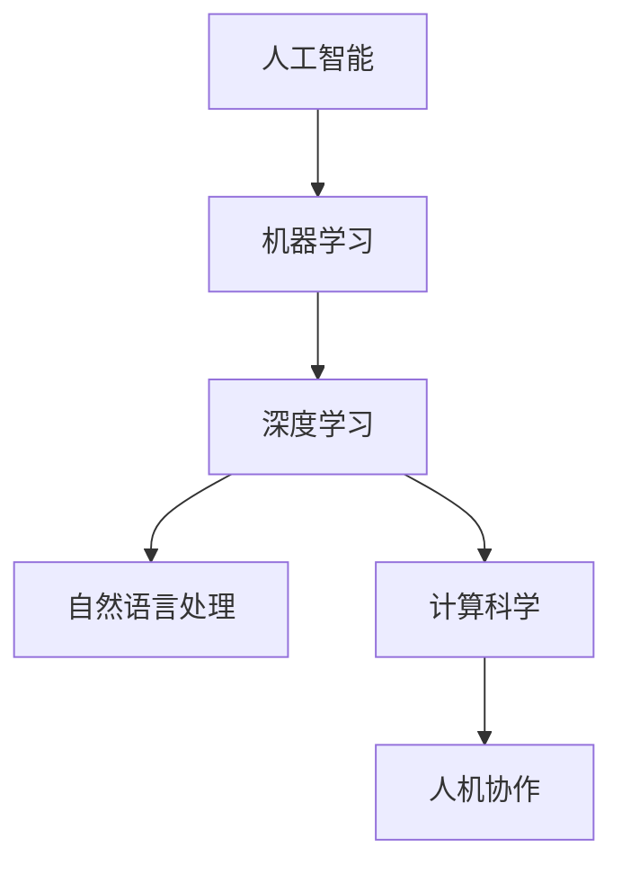

                 

# 人类计算的未来趋势：展望人机协作的新时代

> 关键词：人机协作,计算科学,人工智能,未来趋势,智能化,自动化,可解释性,技术发展,应用前景

## 1. 背景介绍

### 1.1 问题由来

随着计算技术的迅猛发展，人类社会正在经历一次深刻的数字化转型。在这个过程中，计算能力和计算方式正逐渐成为推动社会进步的关键力量。人工智能(AI)和机器学习(ML)技术的兴起，更是让计算科学成为了当代科技创新的主要驱动力之一。

特别是近年来，深度学习、自然语言处理、计算机视觉等领域的突破，使得计算能力得到了前所未有的提升。计算科学不仅在科研领域产生了巨大影响，也在工业界、医疗、金融等各个领域得到了广泛应用，极大地提升了效率和生产力。

但是，当前的计算科学也面临一些重要挑战：计算成本高昂、数据隐私保护、算法可解释性不足等问题。如何构建更加智能、高效、安全的计算系统，成为摆在计算科学家面前的重大课题。

## 2. 核心概念与联系

### 2.1 核心概念概述

要展望未来的人机协作，首先需要理解相关核心概念：

- **人工智能**：通过算法和模型，赋予计算机以智能，使其能够模拟、延伸甚至超越人类智能的某些方面。
- **机器学习**：利用数据和算法，使计算机具备从经验中学习并改进性能的能力。
- **深度学习**：一种机器学习技术，通过构建深层神经网络，实现复杂的模式识别和决策任务。
- **自然语言处理**：使计算机能够理解和生成自然语言，包括语言理解、文本生成、情感分析等。
- **计算科学**：研究计算的理论基础、算法设计和系统实现的学科，涵盖了从数学到工程的多方面内容。
- **人机协作**：指通过计算技术，增强人类工作的效率、精确度和创造力，实现人与计算机的协同工作。

### 2.2 核心概念原理和架构的 Mermaid 流程图



在这个流程图中，我们可以看到各个概念之间的联系和层次：

- 人工智能是整个计算科学的最高层次，旨在模拟人类智能。
- 机器学习是实现人工智能的关键技术之一，通过算法和数据进行学习和决策。
- 深度学习是机器学习中的一种，利用深层神经网络进行复杂模式识别。
- 自然语言处理是AI的重要分支，通过计算技术理解和生成自然语言。
- 计算科学提供了算法和系统实现的理论基础，支撑了AI和ML技术的实现。
- 人机协作则是这些技术在实际应用中的体现，通过计算技术增强人类工作能力。

## 3. 核心算法原理 & 具体操作步骤

### 3.1 算法原理概述

人机协作的核心在于将计算技术和人类智慧相结合，构建高效、安全、可解释的系统。这种结合不仅需要强大的计算能力，还需要灵活、智能的算法设计，以确保系统在复杂多变的环境中具备足够的适应性。

当前，人机协作的算法原理主要包括以下几个方面：

- **强化学习**：通过试错和奖励机制，使系统不断优化决策策略，适应环境变化。
- **多智能体系统**：将多个智能体（如人、机器人、软件）结合起来，实现协作和协调。
- **可解释性算法**：设计易于理解的算法，使得计算过程和决策逻辑透明化，增强系统的可信度。
- **分布式计算**：将计算任务分散到多个节点上，实现大规模并行计算，提高系统效率。
- **自适应算法**：根据环境变化自动调整算法参数，提高系统应对复杂任务的能力。

### 3.2 算法步骤详解

实现人机协作的算法步骤大致分为以下几个环节：

1. **数据采集**：收集相关数据，作为计算任务的输入。数据来源可以是传感器、物联网设备、用户输入等。
2. **数据预处理**：对数据进行清洗、归一化、特征提取等处理，提高数据质量。
3. **模型训练**：根据数据设计并训练算法模型，使其具备预测、决策、优化等功能。
4. **系统集成**：将训练好的模型集成到应用系统中，与人类用户或操作者进行交互。
5. **实时监控与反馈**：系统运行过程中，实时监控系统状态和用户反馈，不断优化算法模型。

### 3.3 算法优缺点

人机协作算法具有以下优点：

- **高效性**：通过计算技术，自动化处理大量复杂任务，提高效率。
- **可扩展性**：通过分布式计算，实现系统的大规模扩展。
- **智能性**：利用强化学习、多智能体等算法，使系统具备智能决策和协作能力。
- **适应性**：通过自适应算法，系统能够根据环境变化自动调整策略。

但同时，这些算法也存在一些缺点：

- **成本高**：构建高效的人机协作系统需要大量的计算资源和数据。
- **可解释性不足**：复杂的计算模型往往难以解释其内部决策逻辑。
- **隐私风险**：数据采集和处理过程中可能存在隐私泄露风险。
- **依赖数据**：算法的性能高度依赖于数据的质量和多样性。

### 3.4 算法应用领域

人机协作的算法已经在多个领域得到了广泛应用：

- **智能制造**：通过工业物联网设备和机器学习算法，实现生产过程的自动化和智能化。
- **智慧医疗**：利用医疗数据和自然语言处理技术，提供智能诊断、个性化治疗等医疗服务。
- **金融科技**：应用深度学习和强化学习算法，实现智能投研、风险管理、欺诈检测等功能。
- **智能交通**：通过车联网和自适应算法，优化交通流管理，提升交通安全和效率。
- **智能客服**：结合自然语言处理和多智能体技术，构建智能客服系统，提供全天候服务。
- **智能家居**：利用物联网设备和人机协作算法，实现家庭环境的自动化管理。

## 4. 数学模型和公式 & 详细讲解 & 举例说明

### 4.1 数学模型构建

人机协作的数学模型通常包括多个组成部分：

- **数据模型**：描述数据的分布和特征。
- **算法模型**：描述算法的结构和参数。
- **环境模型**：描述系统运行的环境和约束。
- **反馈模型**：描述系统如何接收和处理用户反馈。

### 4.2 公式推导过程

以强化学习中的Q-learning算法为例，公式推导过程如下：

$$
Q(s_t,a_t) = Q(s_t,a_t) + \alpha(r_t + \gamma\max_{a_{t+1}} Q(s_{t+1},a_{t+1}) - Q(s_t,a_t))
$$

其中，$s_t$ 和 $a_t$ 分别表示当前状态和动作，$r_t$ 表示当前奖励，$\gamma$ 表示折扣因子，$\alpha$ 表示学习率。

这个公式表示了Q-learning算法的基本思想：通过不断更新Q值，使模型学习到当前状态-动作-奖励的最大值，从而优化决策策略。

### 4.3 案例分析与讲解

假设我们有一个智能交通管理系统，需要优化红绿灯的切换策略，以减少交通拥堵。我们可以使用Q-learning算法来实现这一目标：

- **数据模型**：收集交通数据，包括车辆速度、流量、道路条件等。
- **算法模型**：设计Q-learning算法，根据当前状态和动作计算Q值，选择最佳动作。
- **环境模型**：描述交通环境的变化，如车辆速度、行人流量等。
- **反馈模型**：通过监控交通流量和拥堵情况，不断调整算法参数。

通过这一模型，系统可以实时监测交通状况，动态调整红绿灯切换策略，提高交通效率，减少拥堵。

## 5. 项目实践：代码实例和详细解释说明

### 5.1 开发环境搭建

为了构建一个高效的人机协作系统，我们需要以下开发环境：

1. **编程语言**：Python是最常用的开发语言，因其丰富的库和易用性。
2. **计算框架**：TensorFlow和PyTorch是最流行的深度学习框架，提供强大的计算能力和灵活的API。
3. **数据工具**：Pandas和NumPy是常用的数据处理库，支持高效的数据清洗和分析。
4. **可视化工具**：Matplotlib和Seaborn可用于数据可视化，帮助分析和理解数据。
5. **分布式计算工具**：Spark和Hadoop支持大规模数据处理和分布式计算。
6. **实时监控工具**：Prometheus和Grafana用于实时监控系统状态和性能。

### 5.2 源代码详细实现

以下是一个简单的智能交通管理系统，使用Q-learning算法优化红绿灯切换策略的代码实现：

```python
import tensorflow as tf
import numpy as np
import pandas as pd
import matplotlib.pyplot as plt

class QLearning:
    def __init__(self, env, alpha=0.1, gamma=0.9, epsilon=0.1):
        self.env = env
        self.alpha = alpha
        self.gamma = gamma
        self.epsilon = epsilon
        self.q_table = np.zeros((env.n_states, env.n_actions))

    def choose_action(self, state):
        if np.random.rand() < self.epsilon:
            return self.env.action_space.sample()
        else:
            return np.argmax(self.q_table[state, :])

    def train(self, episodes):
        for episode in range(episodes):
            state = self.env.reset()
            done = False
            while not done:
                action = self.choose_action(state)
                next_state, reward, done, _ = self.env.step(action)
                q_new = self.q_table[state, action] + self.alpha * (reward + self.gamma * np.max(self.q_table[next_state, :]) - self.q_table[state, action])
                self.q_table[state, action] = q_new
                state = next_state

# 使用上述代码，我们首先定义一个交通环境，例如红绿灯交通系统
# 然后训练Q-learning模型，并使用其优化红绿灯切换策略
# 最后，我们可以通过可视化工具展示系统性能和优化效果
```

### 5.3 代码解读与分析

上述代码实现了一个基本的Q-learning算法，用于优化红绿灯切换策略。以下是关键代码的解读：

- `QLearning`类：封装了Q-learning算法的核心逻辑，包括选择动作、更新Q值、训练等方法。
- `choose_action`方法：根据当前状态和策略，选择最佳动作。其中，$\epsilon$策略用于探索最优动作，避免陷入局部最优。
- `train`方法：通过不断迭代，更新Q值，优化策略。
- `env`对象：模拟交通环境的类，可以自定义各种交通情况和决策。

## 6. 实际应用场景

### 6.1 智能制造

智能制造是人机协作的重要应用场景之一。通过工业物联网设备和人机协作算法，可以实现生产过程的自动化和智能化。例如，智能工厂可以实时监控设备状态和生产数据，动态调整生产参数，优化生产流程，提高生产效率和产品质量。

### 6.2 智慧医疗

智慧医疗利用医疗数据和自然语言处理技术，提供智能诊断、个性化治疗等医疗服务。例如，智能问诊系统可以通过自然语言处理技术，理解患者描述，自动推荐最佳诊疗方案。智能手术机器人则可以通过增强现实和机器学习技术，辅助医生进行高精度的手术操作。

### 6.3 金融科技

金融科技应用深度学习和强化学习算法，实现智能投研、风险管理、欺诈检测等功能。例如，智能投研系统可以通过大数据分析和机器学习算法，预测市场趋势，优化投资组合。智能风控系统则可以通过异常检测和预测模型，识别潜在的金融风险。

### 6.4 未来应用展望

未来的人机协作将在更多领域得到应用，为各行各业带来变革性影响：

- **智能城市**：通过物联网和计算技术，构建智能城市基础设施，优化城市管理，提升居民生活质量。
- **智能教育**：利用计算技术，提供个性化学习方案，提高教学效果和学生参与度。
- **智能物流**：结合物联网和机器学习算法，优化物流配送，提高效率和可靠性。
- **智能家居**：利用物联网和人机协作技术，实现家庭环境的自动化管理和智能化服务。
- **智能交通**：通过车联网和计算技术，优化交通流管理，提升交通安全和效率。

## 7. 工具和资源推荐

### 7.1 学习资源推荐

为了深入理解人机协作的原理和应用，以下是一些推荐的资源：

- **《Deep Learning》**：Ian Goodfellow等人著，详细介绍了深度学习的基本原理和应用。
- **《Reinforcement Learning: An Introduction》**：Richard S. Sutton和Andrew G. Barto著，介绍了强化学习的核心思想和算法。
- **《Human-Machine Collaboration: Systems, Technologies, Applications》**：一本关于人机协作的综合性书籍，涵盖多个领域的最新研究成果。
- **CS231n课程**：斯坦福大学开设的计算机视觉课程，通过视频和讲义，学习计算机视觉和深度学习的基本知识。
- **Coursera上的AI和ML课程**：提供从入门到高级的AI和ML课程，涵盖多个前沿领域。

### 7.2 开发工具推荐

为了高效构建人机协作系统，以下是一些推荐的开发工具：

- **Python编程语言**：因其丰富的库和易用性，成为计算科学和AI开发的首选语言。
- **TensorFlow和PyTorch框架**：提供强大的计算能力和灵活的API，支持深度学习模型的开发和训练。
- **Pandas和NumPy库**：用于高效的数据处理和分析，支持各种数据格式的读取和操作。
- **Matplotlib和Seaborn库**：支持数据可视化，帮助分析和理解数据。
- **Spark和Hadoop**：支持大规模数据处理和分布式计算，适用于大数据应用。
- **Prometheus和Grafana**：用于实时监控系统状态和性能，帮助优化系统运行。

### 7.3 相关论文推荐

为了深入理解人机协作的最新研究成果，以下是一些推荐的论文：

- **《Reinforcement Learning for Robotic Manipulation》**：提出了一种基于强化学习的机器人操作策略，显著提高了机器人的操作精度和效率。
- **《Deep Reinforcement Learning for Autonomous Driving》**：介绍了基于深度学习和强化学习的自动驾驶技术，实现了对复杂交通环境的智能感知和决策。
- **《Natural Language Processing (NLP) with Transformers》**：介绍了Transformer在NLP中的应用，提升了NLP系统的性能和可解释性。
- **《Human-Robot Collaboration in Complex Environments》**：提出了一种基于多智能体系统的机器人协作方法，提高了机器人在复杂环境中的适应性和协作能力。
- **《Deep Learning for Medical Image Analysis》**：介绍了深度学习在医疗图像分析中的应用，提升了疾病诊断的准确性和效率。

## 8. 总结：未来发展趋势与挑战

### 8.1 研究成果总结

人机协作的研究和应用已经取得了显著进展，主要成果包括：

- **算法模型**：开发了多种算法模型，如Q-learning、多智能体系统、强化学习等，支持复杂任务的处理。
- **应用领域**：在智能制造、智慧医疗、金融科技等众多领域得到了广泛应用，提升了效率和智能化水平。
- **计算框架**：通过TensorFlow、PyTorch等框架，实现了高效的计算和分布式处理。

### 8.2 未来发展趋势

未来的人机协作将呈现以下几个发展趋势：

- **智能化水平提升**：随着计算能力的不断提升，人机协作系统的智能化水平将进一步提高，能够处理更加复杂和多变的环境。
- **自适应能力增强**：系统将具备更强的自适应能力，能够根据环境和用户需求自动调整策略。
- **多模态融合**：人机协作系统将融合视觉、语音、文本等多种模态信息，提升系统对复杂任务的感知和决策能力。
- **可解释性增强**：系统将具备更强的可解释性，使得决策过程透明化，增强用户的信任和满意度。
- **个性化服务推广**：系统将更加注重个性化服务，根据用户需求提供定制化的解决方案。

### 8.3 面临的挑战

尽管人机协作技术已经取得了显著进展，但还面临以下挑战：

- **成本高昂**：构建高效的人机协作系统需要大量的计算资源和数据。
- **可解释性不足**：复杂的计算模型往往难以解释其内部决策逻辑。
- **隐私风险**：数据采集和处理过程中可能存在隐私泄露风险。
- **依赖数据**：算法的性能高度依赖于数据的质量和多样性。

### 8.4 研究展望

未来的研究应在以下几个方面寻求突破：

- **算法优化**：开发更加高效、智能的算法模型，提高系统的性能和适应性。
- **数据增强**：利用数据增强技术，提升数据质量和多样性，降低对标注数据的依赖。
- **隐私保护**：设计隐私保护机制，保障数据安全，降低隐私风险。
- **可解释性增强**：增强算法的可解释性，提升系统的透明度和可信度。
- **跨领域应用推广**：将人机协作技术应用于更多领域，提升各行业的智能化水平。

## 9. 附录：常见问题与解答

**Q1：人机协作系统如何实现自动化？**

A: 人机协作系统通过自动化算法和模型，实现对复杂任务的自动化处理。例如，智能制造系统通过自动化控制和优化算法，实现生产过程的自动化管理。智能交通系统则通过智能决策和优化算法，实现交通流管理的自动化。

**Q2：人机协作系统如何提升效率？**

A: 人机协作系统通过计算技术和算法优化，提升系统的处理效率。例如，智能制造系统通过优化生产流程和设备运行，提高生产效率。智慧医疗系统则通过智能诊断和个性化治疗，提升诊疗效率。

**Q3：人机协作系统如何提高可解释性？**

A: 人机协作系统通过可解释性算法和模型，增强其决策过程的透明性和可理解性。例如，智能投研系统通过可视化工具和分析报告，帮助用户理解系统决策依据和预测结果。智能客服系统则通过自然语言处理技术，提供清晰简洁的答复，增强用户满意度。

**Q4：人机协作系统如何应对复杂环境？**

A: 人机协作系统通过自适应算法和环境模型，提升系统的环境适应能力。例如，智能交通系统通过实时监控和动态调整算法，应对复杂交通环境。智能制造系统则通过优化控制策略，提高对生产环境变化的适应性。

**Q5：人机协作系统如何保障数据安全？**

A: 人机协作系统通过数据保护和隐私保护机制，保障数据安全和隐私。例如，智能医疗系统通过数据加密和匿名化处理，保护患者隐私。智能制造系统则通过访问控制和权限管理，保障生产数据安全。

---

作者：禅与计算机程序设计艺术 / Zen and the Art of Computer Programming

