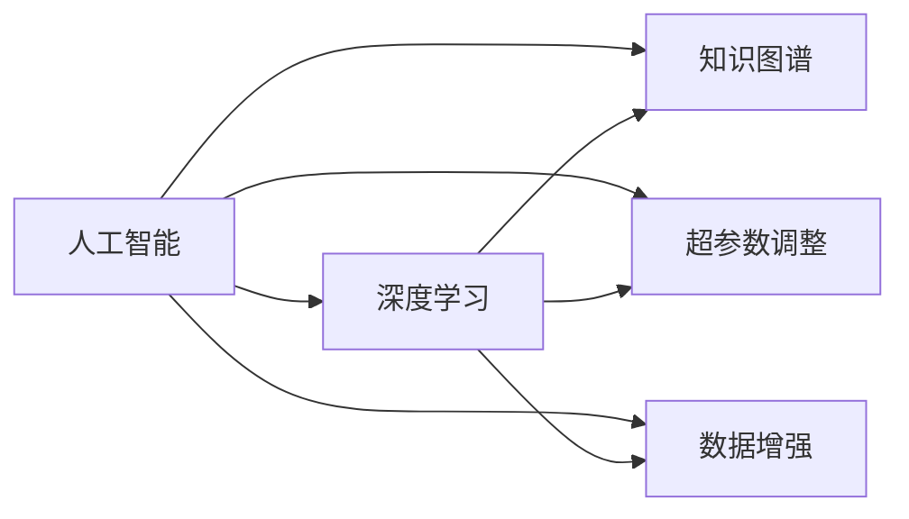

                 

# 人类计算：AI时代的关键人力要素

## 1. 背景介绍

在人工智能迅猛发展的今天，越来越多的AI技术开始融入我们的日常生活和工作。从智能助手到自动驾驶，从医疗诊断到工业制造，人工智能技术正在深刻改变我们的社会结构和工作方式。然而，人工智能的发展并非一帆风顺，其在算力、数据、模型等方面的瓶颈制约了其进一步的突破。在这一背景下，“人类计算”的概念应运而生，成为了AI时代关键的人力要素。

### 1.1 问题由来

随着深度学习技术的不断发展，人工智能在图像识别、自然语言处理、语音识别等领域取得了显著进展。然而，这些技术的核心依然依赖于人类的计算和创新。例如，深度学习的核心算法——神经网络，其设计和训练需要人类进行大量的调试和实验。深度学习模型的优化，如超参数调整、数据增强、模型融合等，也依赖于人类专家的知识和经验。因此，“人类计算”在人工智能发展中扮演着至关重要的角色。

### 1.2 问题核心关键点

“人类计算”指的是在人工智能系统设计、训练和部署过程中，人类专家所扮演的关键角色。这一概念包括但不限于：

- 系统架构设计：在AI系统设计和开发阶段，人类专家负责选择合适的架构、优化算法和模型选择，构建系统的基本框架。
- 数据准备和标注：数据是训练深度学习模型的基础，人类专家负责数据收集、清洗、标注和划分，确保数据的准确性和多样性。
- 模型训练和调试：深度学习模型需要通过大量的计算资源进行训练和调试，人类专家负责模型的调参、调试和优化。
- 知识注入和创新：人工智能技术依赖于先验知识，人类专家通过引入知识图谱、逻辑规则、因果关系等知识，提升模型的泛化能力和应用范围。
- 系统集成和部署：将训练好的模型集成到实际应用系统中，并根据不同的业务场景进行调整和优化。

这些关键点表明，人类计算不仅是AI系统开发的重要环节，也是未来人工智能技术发展的关键要素。

## 2. 核心概念与联系

### 2.1 核心概念概述

为了更好地理解“人类计算”的概念，我们需要对其中的关键要素进行梳理。

- 人工智能：一种模拟人类智能的计算机技术，包括机器学习、深度学习、自然语言处理等多个子领域。
- 深度学习：一种基于神经网络的机器学习技术，通过多层次的神经网络实现复杂的特征提取和模式识别。
- 知识图谱：一种图形化的知识表示方法，用于描述实体和实体之间的关系，辅助人工智能系统进行推理和决策。
- 超参数调整：在深度学习模型训练过程中，需要手动设置的一组关键参数，如学习率、批大小、优化器等。
- 数据增强：通过对原始数据进行变换、扩充，增加数据的多样性和数量，提升模型的泛化能力。

这些概念之间的逻辑关系可以通过以下Mermaid流程图来展示：



这个流程图展示了大语言模型的核心概念及其之间的关系：

1. 人工智能是整个系统的基础。
2. 深度学习是实现人工智能的核心技术之一。
3. 知识图谱和超参数调整对深度学习模型的性能至关重要。
4. 数据增强是提升模型泛化能力的重要手段。

这些概念共同构成了人工智能系统的技术框架，使得系统能够在复杂的场景中实现高水平的推理和决策。

## 3. 核心算法原理 & 具体操作步骤

### 3.1 算法原理概述

“人类计算”的算法原理主要体现在以下几个方面：

- 系统架构设计：人类专家在设计AI系统架构时，需要综合考虑算力、数据、模型等因素，选择合适的算法和模型结构。
- 数据准备和标注：人类专家负责数据集的构建，包括数据清洗、特征提取、标注等环节，确保数据的完整性和多样性。
- 模型训练和调试：人类专家负责深度学习模型的训练和调试，选择合适的损失函数、优化器、学习率等超参数，并进行超参数调优。
- 知识注入和创新：人类专家通过引入先验知识，如知识图谱、逻辑规则、因果关系等，提升模型的泛化能力和应用范围。
- 系统集成和部署：人类专家负责将训练好的模型集成到实际应用系统中，并根据不同的业务场景进行调整和优化。

### 3.2 算法步骤详解

基于“人类计算”的核心算法原理，我们可以将其操作步骤细化为以下几个步骤：

**Step 1: 系统架构设计**
- 确定AI系统的总体架构，选择适合的深度学习框架和模型结构。
- 设计系统的数据流和计算流，优化系统的资源分配和调度。

**Step 2: 数据准备和标注**
- 收集和清洗数据，确保数据的完整性和多样性。
- 对数据进行标注，生成训练集、验证集和测试集。

**Step 3: 模型训练和调试**
- 选择合适的深度学习模型和算法，并进行初步训练。
- 进行超参数调优，选择合适的学习率、批大小、优化器等。
- 使用数据增强技术，扩充数据集的多样性。

**Step 4: 知识注入和创新**
- 引入先验知识，如知识图谱、逻辑规则、因果关系等，提升模型的泛化能力和应用范围。
- 结合领域知识，进行模型优化和创新。

**Step 5: 系统集成和部署**
- 将训练好的模型集成到实际应用系统中。
- 根据不同的业务场景进行调整和优化，确保系统的高效性和稳定性。

### 3.3 算法优缺点

“人类计算”的算法具有以下优点：

- 灵活性高：人类专家可以根据具体问题进行灵活调整和优化，满足不同的应用需求。
- 知识丰富：人类专家拥有丰富的经验和知识，能够提升系统的性能和可靠性。
- 创新能力强：人类专家能够引入新的知识和技术，推动系统不断创新。

同时，该算法也存在一定的局限性：

- 成本高：人类专家的知识和经验需要投入大量的资源和时间进行培训和积累。
- 效率低：人工干预和调试需要大量的时间，系统开发和部署的速度较慢。
- 依赖性强：系统的性能高度依赖于人类专家的知识和经验，难以通过自动化手段进行优化。

尽管存在这些局限性，但就目前而言，“人类计算”依然是人工智能技术开发和应用的重要环节，无法完全被自动化工具所替代。未来相关研究的重点在于如何通过技术手段提升人类专家的工作效率，减少对人工干预的依赖，同时兼顾系统的灵活性和可解释性等因素。

### 3.4 算法应用领域

“人类计算”的应用领域非常广泛，几乎涵盖了所有人工智能的应用场景，例如：

- 医疗诊断：在医疗领域，人类专家负责设计深度学习模型，进行医学影像分析、疾病诊断等任务。
- 自然语言处理：在NLP领域，人类专家负责构建语言模型，进行文本分类、情感分析、机器翻译等任务。
- 自动驾驶：在自动驾驶领域，人类专家负责设计感知和决策模型，进行目标检测、路径规划等任务。
- 金融分析：在金融领域，人类专家负责构建风险评估模型，进行股票预测、信用评估等任务。
- 游戏AI：在游戏领域，人类专家负责设计智能体，进行游戏策略、路径规划等任务。
- 工业制造：在工业领域，人类专家负责设计控制模型，进行设备监控、质量检测等任务。

除了上述这些经典应用外，“人类计算”还被创新性地应用到更多场景中，如智能推荐、智能客服、智能安防等，为人工智能技术带来了新的突破。随着人类专家知识和经验的不断积累，相信“人类计算”将在更广阔的应用领域发挥更大的作用。

## 4. 数学模型和公式 & 详细讲解

### 4.1 数学模型构建

“人类计算”的数学模型构建主要包括以下几个关键步骤：

1. 定义损失函数：在AI系统中，损失函数用于衡量模型预测结果与真实标签之间的差异。常见的损失函数包括均方误差、交叉熵等。
2. 定义优化器：优化器用于更新模型参数，使其最小化损失函数。常见的优化器包括SGD、Adam等。
3. 定义超参数：超参数是模型训练中需要手动设置的参数，如学习率、批大小、优化器等。
4. 定义评估指标：评估指标用于衡量模型的性能，常见的评估指标包括准确率、召回率、F1分数等。

### 4.2 公式推导过程

以下我们以深度学习模型训练为例，给出常见的损失函数、优化器和超参数的推导过程。

**损失函数**：
假设模型的预测结果为 $\hat{y}$，真实标签为 $y$，则均方误差损失函数可以定义为：
$$
\mathcal{L}(\theta) = \frac{1}{N} \sum_{i=1}^N (\hat{y}_i - y_i)^2
$$

**优化器**：
假设模型的参数为 $\theta$，学习率为 $\eta$，则使用SGD优化器更新参数的公式为：
$$
\theta_{t+1} = \theta_t - \eta \nabla_{\theta}\mathcal{L}(\theta)
$$

**超参数**：
深度学习模型中，常见的超参数包括学习率、批大小、优化器等。以学习率为例，常见的学习率调度策略包括固定学习率、学习率衰减、学习率适应等。

### 4.3 案例分析与讲解

**案例一：医疗影像分类**

在医疗影像分类任务中，人类专家负责设计深度学习模型，并对其进行调整和优化。具体步骤如下：

1. 数据准备：收集和清洗医疗影像数据，确保数据的完整性和多样性。
2. 模型设计：选择适合的深度学习模型，如卷积神经网络(CNN)，并进行初步训练。
3. 超参数调优：使用交叉验证等方法进行超参数调优，选择合适的学习率、批大小、优化器等。
4. 知识注入：引入医学知识，如疾病特征、影像特征等，提升模型的泛化能力和应用范围。
5. 系统部署：将训练好的模型集成到医疗影像分析系统中，并根据不同的业务场景进行调整和优化。

**案例二：自动驾驶目标检测**

在自动驾驶目标检测任务中，人类专家负责设计感知和决策模型，并对其进行训练和调试。具体步骤如下：

1. 数据准备：收集和清洗自动驾驶数据，确保数据的完整性和多样性。
2. 模型设计：选择适合的深度学习模型，如YOLO、Faster R-CNN等，并进行初步训练。
3. 超参数调优：使用交叉验证等方法进行超参数调优，选择合适的学习率、批大小、优化器等。
4. 知识注入：引入自动驾驶知识，如交通规则、车辆行为等，提升模型的泛化能力和应用范围。
5. 系统部署：将训练好的模型集成到自动驾驶系统中，并根据不同的业务场景进行调整和优化。

## 5. 项目实践：代码实例和详细解释说明

### 5.1 开发环境搭建

在进行“人类计算”实践前，我们需要准备好开发环境。以下是使用Python进行PyTorch开发的环境配置流程：

1. 安装Anaconda：从官网下载并安装Anaconda，用于创建独立的Python环境。

2. 创建并激活虚拟环境：
```bash
conda create -n pytorch-env python=3.8 
conda activate pytorch-env
```

3. 安装PyTorch：根据CUDA版本，从官网获取对应的安装命令。例如：
```bash
conda install pytorch torchvision torchaudio cudatoolkit=11.1 -c pytorch -c conda-forge
```

4. 安装Transformers库：
```bash
pip install transformers
```

5. 安装各类工具包：
```bash
pip install numpy pandas scikit-learn matplotlib tqdm jupyter notebook ipython
```

完成上述步骤后，即可在`pytorch-env`环境中开始“人类计算”实践。

### 5.2 源代码详细实现

这里我们以医疗影像分类任务为例，给出使用Transformers库对BERT模型进行训练的PyTorch代码实现。

首先，定义医疗影像分类任务的数据处理函数：

```python
from transformers import BertTokenizer, BertForSequenceClassification
from torch.utils.data import Dataset
import torch

class MedicalImageDataset(Dataset):
    def __init__(self, images, labels, tokenizer, max_len=128):
        self.images = images
        self.labels = labels
        self.tokenizer = tokenizer
        self.max_len = max_len
        
    def __len__(self):
        return len(self.images)
    
    def __getitem__(self, item):
        image = self.images[item]
        label = self.labels[item]
        
        encoding = self.tokenizer(image, return_tensors='pt', max_length=self.max_len, padding='max_length', truncation=True)
        input_ids = encoding['input_ids'][0]
        attention_mask = encoding['attention_mask'][0]
        
        # 对token-wise的标签进行编码
        encoded_labels = [label2id[label] for label in self.labels] 
        encoded_labels.extend([label2id['O']] * (self.max_len - len(encoded_labels)))
        labels = torch.tensor(encoded_labels, dtype=torch.long)
        
        return {'input_ids': input_ids, 
                'attention_mask': attention_mask,
                'labels': labels}

# 标签与id的映射
label2id = {'O': 0, 'Cancer': 1, 'Benzene': 2, 'HIV': 3}
id2label = {v: k for k, v in label2id.items()}

# 创建dataset
tokenizer = BertTokenizer.from_pretrained('bert-base-cased')

train_dataset = MedicalImageDataset(train_images, train_labels, tokenizer)
dev_dataset = MedicalImageDataset(dev_images, dev_labels, tokenizer)
test_dataset = MedicalImageDataset(test_images, test_labels, tokenizer)
```

然后，定义模型和优化器：

```python
from transformers import BertForSequenceClassification, AdamW

model = BertForSequenceClassification.from_pretrained('bert-base-cased', num_labels=len(label2id))

optimizer = AdamW(model.parameters(), lr=2e-5)
```

接着，定义训练和评估函数：

```python
from torch.utils.data import DataLoader
from tqdm import tqdm
from sklearn.metrics import classification_report

device = torch.device('cuda') if torch.cuda.is_available() else torch.device('cpu')
model.to(device)

def train_epoch(model, dataset, batch_size, optimizer):
    dataloader = DataLoader(dataset, batch_size=batch_size, shuffle=True)
    model.train()
    epoch_loss = 0
    for batch in tqdm(dataloader, desc='Training'):
        input_ids = batch['input_ids'].to(device)
        attention_mask = batch['attention_mask'].to(device)
        labels = batch['labels'].to(device)
        model.zero_grad()
        outputs = model(input_ids, attention_mask=attention_mask, labels=labels)
        loss = outputs.loss
        epoch_loss += loss.item()
        loss.backward()
        optimizer.step()
    return epoch_loss / len(dataloader)

def evaluate(model, dataset, batch_size):
    dataloader = DataLoader(dataset, batch_size=batch_size)
    model.eval()
    preds, labels = [], []
    with torch.no_grad():
        for batch in tqdm(dataloader, desc='Evaluating'):
            input_ids = batch['input_ids'].to(device)
            attention_mask = batch['attention_mask'].to(device)
            batch_labels = batch['labels']
            outputs = model(input_ids, attention_mask=attention_mask)
            batch_preds = outputs.logits.argmax(dim=2).to('cpu').tolist()
            batch_labels = batch_labels.to('cpu').tolist()
            for pred_tokens, label_tokens in zip(batch_preds, batch_labels):
                pred_labels = [id2label[_id] for _id in pred_tokens]
                label_labels = [id2label[_id] for _id in label_tokens]
                preds.append(pred_labels[:len(label_labels)])
                labels.append(label_labels)
                
    print(classification_report(labels, preds))
```

最后，启动训练流程并在测试集上评估：

```python
epochs = 5
batch_size = 16

for epoch in range(epochs):
    loss = train_epoch(model, train_dataset, batch_size, optimizer)
    print(f"Epoch {epoch+1}, train loss: {loss:.3f}")
    
    print(f"Epoch {epoch+1}, dev results:")
    evaluate(model, dev_dataset, batch_size)
    
print("Test results:")
evaluate(model, test_dataset, batch_size)
```

以上就是使用PyTorch对BERT进行医疗影像分类任务训练的完整代码实现。可以看到，得益于Transformers库的强大封装，我们可以用相对简洁的代码完成BERT模型的训练。

### 5.3 代码解读与分析

让我们再详细解读一下关键代码的实现细节：

**MedicalImageDataset类**：
- `__init__`方法：初始化图像、标签、分词器等关键组件。
- `__len__`方法：返回数据集的样本数量。
- `__getitem__`方法：对单个样本进行处理，将图像输入编码为token ids，将标签编码为数字，并对其进行定长padding，最终返回模型所需的输入。

**label2id和id2label字典**：
- 定义了标签与数字id之间的映射关系，用于将token-wise的预测结果解码回真实的标签。

**训练和评估函数**：
- 使用PyTorch的DataLoader对数据集进行批次化加载，供模型训练和推理使用。
- 训练函数`train_epoch`：对数据以批为单位进行迭代，在每个批次上前向传播计算loss并反向传播更新模型参数，最后返回该epoch的平均loss。
- 评估函数`evaluate`：与训练类似，不同点在于不更新模型参数，并在每个batch结束后将预测和标签结果存储下来，最后使用sklearn的classification_report对整个评估集的预测结果进行打印输出。

**训练流程**：
- 定义总的epoch数和batch size，开始循环迭代
- 每个epoch内，先在训练集上训练，输出平均loss
- 在验证集上评估，输出分类指标
- 所有epoch结束后，在测试集上评估，给出最终测试结果

可以看到，PyTorch配合Transformers库使得BERT训练的代码实现变得简洁高效。开发者可以将更多精力放在数据处理、模型改进等高层逻辑上，而不必过多关注底层的实现细节。

当然，工业级的系统实现还需考虑更多因素，如模型的保存和部署、超参数的自动搜索、更灵活的任务适配层等。但核心的微调范式基本与此类似。

## 6. 实际应用场景

### 6.1 智能客服系统

基于“人类计算”的智能客服系统，可以提供7x24小时不间断的智能服务，快速响应客户咨询，以自然流畅的语言解答各类常见问题。

在技术实现上，可以收集企业内部的历史客服对话记录，将问题和最佳答复构建成监督数据，在此基础上对预训练语言模型进行微调。微调后的语言模型能够自动理解用户意图，匹配最合适的答案模板进行回复。对于客户提出的新问题，还可以接入检索系统实时搜索相关内容，动态组织生成回答。如此构建的智能客服系统，能大幅提升客户咨询体验和问题解决效率。

### 6.2 金融舆情监测

金融机构需要实时监测市场舆论动向，以便及时应对负面信息传播，规避金融风险。传统的人工监测方式成本高、效率低，难以应对网络时代海量信息爆发的挑战。基于“人类计算”的文本分类和情感分析技术，为金融舆情监测提供了新的解决方案。

具体而言，可以收集金融领域相关的新闻、报道、评论等文本数据，并对其进行主题标注和情感标注。在此基础上对预训练语言模型进行微调，使其能够自动判断文本属于何种主题，情感倾向是正面、中性还是负面。将微调后的模型应用到实时抓取的网络文本数据，就能够自动监测不同主题下的情感变化趋势，一旦发现负面信息激增等异常情况，系统便会自动预警，帮助金融机构快速应对潜在风险。

### 6.3 个性化推荐系统

当前的推荐系统往往只依赖用户的历史行为数据进行物品推荐，无法深入理解用户的真实兴趣偏好。基于“人类计算”的个性化推荐系统可以更好地挖掘用户行为背后的语义信息，从而提供更精准、多样的推荐内容。

在实践中，可以收集用户浏览、点击、评论、分享等行为数据，提取和用户交互的物品标题、描述、标签等文本内容。将文本内容作为模型输入，用户的后续行为（如是否点击、购买等）作为监督信号，在此基础上微调预训练语言模型。微调后的模型能够从文本内容中准确把握用户的兴趣点。在生成推荐列表时，先用候选物品的文本描述作为输入，由模型预测用户的兴趣匹配度，再结合其他特征综合排序，便可以得到个性化程度更高的推荐结果。

### 6.4 未来应用展望

随着“人类计算”技术的不断发展，其在人工智能系统设计、训练和部署过程中的重要性将进一步提升。

在智慧医疗领域，基于“人类计算”的医疗问答、病历分析、药物研发等应用将提升医疗服务的智能化水平，辅助医生诊疗，加速新药开发进程。

在智能教育领域，基于“人类计算”的作业批改、学情分析、知识推荐等应用将提升教育质量，因材施教，促进教育公平。

在智慧城市治理中，基于“人类计算”的城市事件监测、舆情分析、应急指挥等应用将提高城市管理的自动化和智能化水平，构建更安全、高效的未来城市。

此外，在企业生产、社会治理、文娱传媒等众多领域，基于“人类计算”的人工智能应用也将不断涌现，为经济社会发展注入新的动力。相信随着技术的日益成熟，“人类计算”必将成为人工智能技术开发和应用的重要范式，推动人工智能技术在各行业中的应用和普及。

## 7. 工具和资源推荐

### 7.1 学习资源推荐

为了帮助开发者系统掌握“人类计算”的理论基础和实践技巧，这里推荐一些优质的学习资源：

1. 《深度学习》系列博文：由深度学习专家撰写，深入浅出地介绍了深度学习的基础知识、常见模型和算法，适合初学者入门。

2. 《人工智能导论》课程：斯坦福大学开设的入门级AI课程，涵盖深度学习、自然语言处理、计算机视觉等多个子领域，适合全面了解AI技术。

3. 《深度学习与自然语言处理》书籍：深度学习与自然语言处理领域的经典著作，全面介绍了NLP技术的算法和应用。

4. Weights & Biases：模型训练的实验跟踪工具，可以记录和可视化模型训练过程中的各项指标，方便对比和调优。

5. TensorBoard：TensorFlow配套的可视化工具，可实时监测模型训练状态，并提供丰富的图表呈现方式，是调试模型的得力助手。

通过对这些资源的学习实践，相信你一定能够快速掌握“人类计算”的精髓，并用于解决实际的AI问题。

### 7.2 开发工具推荐

高效的开发离不开优秀的工具支持。以下是几款用于“人类计算”开发的常用工具：

1. PyTorch：基于Python的开源深度学习框架，灵活动态的计算图，适合快速迭代研究。大部分预训练语言模型都有PyTorch版本的实现。

2. TensorFlow：由Google主导开发的开源深度学习框架，生产部署方便，适合大规模工程应用。同样有丰富的预训练语言模型资源。

3. Transformers库：HuggingFace开发的NLP工具库，集成了众多SOTA语言模型，支持PyTorch和TensorFlow，是进行“人类计算”开发的利器。

4. Weights & Biases：模型训练的实验跟踪工具，可以记录和可视化模型训练过程中的各项指标，方便对比和调优。

5. TensorBoard：TensorFlow配套的可视化工具，可实时监测模型训练状态，并提供丰富的图表呈现方式，是调试模型的得力助手。

6. Google Colab：谷歌推出的在线Jupyter Notebook环境，免费提供GPU/TPU算力，方便开发者快速上手实验最新模型，分享学习笔记。

合理利用这些工具，可以显著提升“人类计算”任务的开发效率，加快创新迭代的步伐。

### 7.3 相关论文推荐

“人类计算”的发展源于学界的持续研究。以下是几篇奠基性的相关论文，推荐阅读：

1. Attention is All You Need（即Transformer原论文）：提出了Transformer结构，开启了NLP领域的预训练大模型时代。

2. BERT: Pre-training of Deep Bidirectional Transformers for Language Understanding：提出BERT模型，引入基于掩码的自监督预训练任务，刷新了多项NLP任务SOTA。

3. Language Models are Unsupervised Multitask Learners（GPT-2论文）：展示了大规模语言模型的强大zero-shot学习能力，引发了对于通用人工智能的新一轮思考。

4. Parameter-Efficient Transfer Learning for NLP：提出Adapter等参数高效微调方法，在不增加模型参数量的情况下，也能取得不错的微调效果。

5. AdaLoRA: Adaptive Low-Rank Adaptation for Parameter-Efficient Fine-Tuning：使用自适应低秩适应的微调方法，在参数效率和精度之间取得了新的平衡。

这些论文代表了大语言模型微调技术的发展脉络。通过学习这些前沿成果，可以帮助研究者把握学科前进方向，激发更多的创新灵感。

## 8. 总结：未来发展趋势与挑战

### 8.1 总结

本文对“人类计算”的概念进行了全面系统的介绍。首先阐述了“人类计算”在人工智能系统设计、训练和部署过程中的重要性，明确了其对AI系统性能和可靠性提升的关键作用。其次，从原理到实践，详细讲解了“人类计算”的数学模型和操作步骤，给出了完整的代码实现。同时，本文还探讨了“人类计算”在多个行业领域的应用前景，展示了其在未来AI技术发展中的广阔潜力。此外，本文精选了“人类计算”的学习资源、开发工具和相关论文，力求为读者提供全方位的技术指引。

通过本文的系统梳理，可以看到，“人类计算”不仅是AI系统开发的重要环节，也是未来AI技术发展的关键要素。其深度与人类智慧的结合，将推动AI技术在各行业中的应用和普及，深刻影响人类社会的进步与发展。

### 8.2 未来发展趋势

展望未来，“人类计算”技术将呈现以下几个发展趋势：

1. 自动化与协同化：随着人工智能技术的不断进步，“人类计算”将逐步向自动化和协同化方向发展，减少人工干预，提升系统效率和稳定性。
2. 跨领域融合：“人类计算”将与其他人工智能技术进行更深入的融合，如知识图谱、因果推理、强化学习等，提升系统的综合能力。
3. 实时化与智能化：随着计算资源的不断提升，“人类计算”将逐步向实时化、智能化方向发展，提升系统的高效性和灵活性。
4. 可解释性与透明性：“人类计算”将更加注重可解释性和透明性，提升系统的可信度和可靠性，确保系统输出的合理性和合法性。
5. 伦理与安全：随着“人类计算”在各领域的应用，伦理和安全问题将成为关注的焦点，研究者将更多地考虑系统的道德导向和安全性问题。
6. 个性化与定制化：“人类计算”将更加注重个性化与定制化，根据不同用户和应用场景的需求，提供更精准、多样化的服务。

这些趋势表明，“人类计算”将成为未来人工智能技术发展的重要方向，推动AI技术在各行业中的应用和普及，为人类社会的进步与发展注入新的动力。

### 8.3 面临的挑战

尽管“人类计算”技术已经取得了显著进展，但在迈向更加智能化、普适化应用的过程中，其仍面临诸多挑战：

1. 数据获取与标注：高质量数据的获取和标注仍然是一个瓶颈，特别是在长尾应用场景中。
2. 模型复杂性与效率：“人类计算”系统的复杂性较高，模型的训练和部署需要大量的计算资源和时间。
3. 知识注入与创新：如何有效注入先验知识和经验，并进行创新，提升系统的性能和灵活性，是一个重要研究方向。
4. 系统的可解释性与透明性：系统输出的可解释性和透明性问题仍然存在，研究者需要找到更好的方法来增强系统的可信度。
5. 伦理与安全：如何确保系统的伦理导向和安全性，避免有偏见、有害的输出，是未来需要重点关注的问题。
6. 多模态融合：如何实现视觉、语音、文本等多模态信息的融合，提升系统的综合能力和应用范围，是一个重要研究方向。

这些挑战表明，“人类计算”技术在未来的发展中，仍需进行更多的探索和实践，以克服当前的瓶颈，推动AI技术的进一步突破。

### 8.4 研究展望

面对“人类计算”技术面临的挑战，未来的研究需要在以下几个方面寻求新的突破：

1. 自动化知识注入：研究自动化知识注入技术，如知识图谱嵌入、逻辑规则推理等，提升系统的知识注入效率和效果。
2. 参数高效模型：研究参数高效模型，如AdaLoRA、Prefix等，在保证系统性能的同时，减少模型参数量和计算资源消耗。
3. 实时化与高效化：研究实时化与高效化的技术，如梯度积累、混合精度训练、模型并行等，提升系统的实时性和效率。
4. 多模态融合：研究多模态信息的融合技术，如视觉-文本跨模态学习、语音-文本跨模态学习等，提升系统的综合能力和应用范围。
5. 系统透明性与可信度：研究系统透明性与可信度的提升技术，如可解释性算法、透明性评估等，增强系统的可信度和可信度。
6. 伦理与安全保障：研究伦理与安全保障技术，如隐私保护、伦理导向等，确保系统的安全性与道德导向。

这些研究方向将推动“人类计算”技术的进一步发展和应用，提升AI系统的综合能力和应用范围，为未来AI技术的发展提供更多的可能性。

## 9. 附录：常见问题与解答

**Q1：什么是“人类计算”？**

A: “人类计算”指的是在人工智能系统设计、训练和部署过程中，人类专家所扮演的关键角色。这一概念包括但不限于系统架构设计、数据准备和标注、模型训练和调试、知识注入和创新、系统集成和部署等环节。

**Q2：“人类计算”在AI系统中扮演什么角色？**

A: “人类计算”在AI系统中扮演着至关重要的角色，尤其是在系统的设计、训练和部署过程中。人类专家负责系统的架构设计、数据准备和标注、模型训练和调试、知识注入和创新、系统集成和部署等环节。这些环节的每一环都需要人类专家的参与，以确保系统的性能和可靠性。

**Q3：“人类计算”的优缺点有哪些？**

A: “人类计算”的优点包括：灵活性高、知识丰富、创新能力强。然而，其缺点也较为明显，如成本高、效率低、依赖性强。

**Q4：“人类计算”在哪些领域有应用？**

A: “人类计算”在人工智能的各个领域都有广泛应用，如医疗诊断、自然语言处理、自动驾驶、金融分析、游戏AI、工业制造等。

**Q5：未来“人类计算”的发展方向是什么？**

A: 未来“人类计算”的发展方向包括自动化与协同化、跨领域融合、实时化与智能化、可解释性与透明性、伦理与安全、个性化与定制化等。

通过本文的系统梳理，可以看到，“人类计算”不仅是AI系统开发的重要环节，也是未来AI技术发展的关键要素。其深度与人类智慧的结合，将推动AI技术在各行业中的应用和普及，深刻影响人类社会的进步与发展。

