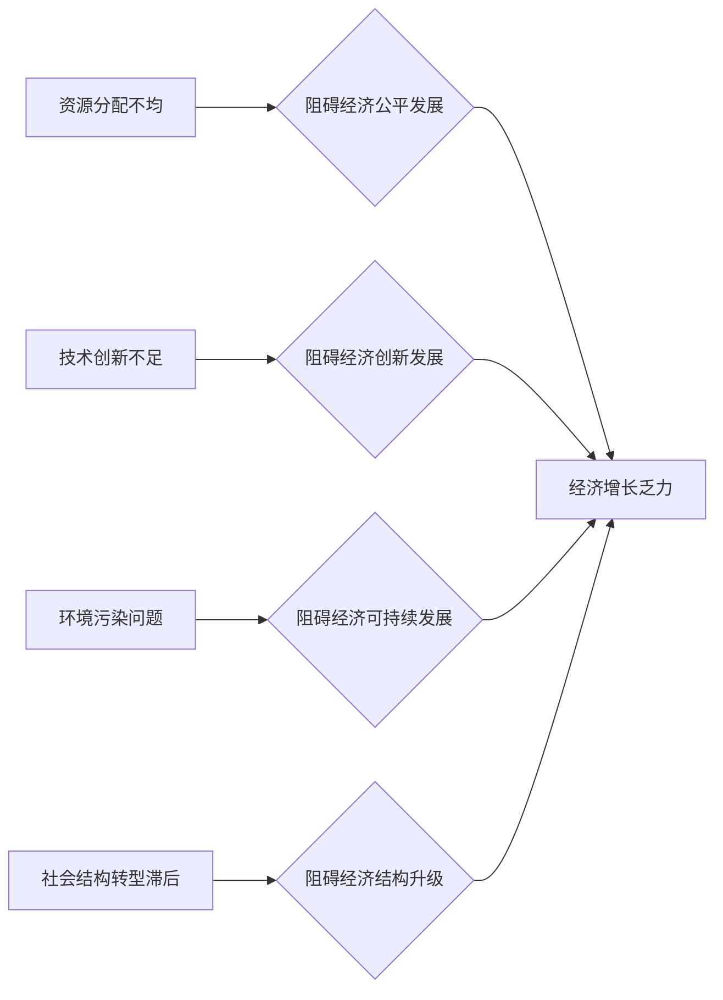

> 深层次矛盾、经济增长、技术创新、社会结构、资源分配、可持续发展、全球化

## 1. 背景介绍

经济增长是社会发展的重要指标，也是各国政府追求的目标。然而，随着经济全球化和科技进步的不断发展，经济增长模式也面临着新的挑战。传统的经济增长模式，往往依赖于资源消耗和人口增长，这种模式已经难以持续发展，并且会带来一系列的社会和环境问题。

近年来，一些学者和专家开始关注经济增长的深层次矛盾，认为这些矛盾是制约经济持续发展的根本原因。这些矛盾包括：

* **资源分配不均：** 财富和资源的分配不公，导致社会贫富差距扩大，阻碍了经济的公平发展。
* **技术创新不足：** 创新能力不足，导致经济增长乏力，难以应对全球化竞争的挑战。
* **环境污染问题：** 经济增长过程中产生的环境污染问题日益严重，威胁着人类的生存环境。
* **社会结构转型滞后：** 社会结构转型滞后，导致劳动力结构失衡，阻碍了经济结构的升级。

## 2. 核心概念与联系

**2.1 深层次矛盾**

深层次矛盾是指在经济发展过程中，由于生产方式、社会结构、资源分配等方面的制约，而产生的根本性矛盾。这些矛盾往往是隐性的，难以被直接观察和解决，但它们会对经济增长产生深远的影响。

**2.2 经济增长**

经济增长是指一个国家或地区的国民生产总值（GDP）在一定时期内以一定比例增加的现象。经济增长是社会发展的重要指标，也是各国政府追求的目标。

**2.3 联系**

深层次矛盾是制约经济增长的根本原因。这些矛盾会阻碍经济的公平发展、创新发展和可持续发展，最终导致经济增长乏力。

**2.4 Mermaid 流程图**



## 3. 核心算法原理 & 具体操作步骤

**3.1 算法原理概述**

为了解决深层次矛盾对经济增长的影响，需要采用一些有效的算法和模型。例如，我们可以利用大数据分析技术，对经济数据进行分析，找出深层次矛盾的根源。我们可以利用机器学习算法，预测经济增长的趋势，并提出相应的政策建议。

**3.2 算法步骤详解**

1. **数据收集:** 收集相关经济数据，包括资源分配、技术创新、环境污染、社会结构等方面的指标。
2. **数据清洗:** 对收集到的数据进行清洗和处理，去除无效数据和噪声数据。
3. **特征提取:** 从原始数据中提取特征，例如资源分配不均的程度、技术创新的水平、环境污染的程度等。
4. **模型构建:** 利用机器学习算法，构建预测经济增长的模型。
5. **模型评估:** 对模型进行评估，验证模型的准确性和有效性。
6. **政策建议:** 根据模型的预测结果，提出相应的政策建议，以解决深层次矛盾，促进经济增长。

**3.3 算法优缺点**

* **优点:** 能够有效地分析经济数据，找出深层次矛盾的根源，并预测经济增长的趋势。
* **缺点:** 需要大量的经济数据作为训练样本，并且模型的准确性还存在一定的局限性。

**3.4 算法应用领域**

* **经济预测:** 预测经济增长的趋势，为政府制定经济政策提供参考。
* **资源管理:** 分析资源分配情况，优化资源配置，促进资源的合理利用。
* **环境保护:** 分析环境污染问题，制定环境保护政策，促进经济的可持续发展。
* **社会发展:** 分析社会结构变化，制定社会发展政策，促进社会公平正义。

## 4. 数学模型和公式 & 详细讲解 & 举例说明

**4.1 数学模型构建**

我们可以构建一个数学模型，来描述深层次矛盾对经济增长的影响。

假设：

* $Y$ 表示经济增长率
* $R$ 表示资源分配的公平程度
* $I$ 表示技术创新的水平
* $E$ 表示环境污染程度
* $S$ 表示社会结构的转型程度

则我们可以构建一个线性模型：

$$Y = aR + bI + cE + dS + e$$

其中，$a$, $b$, $c$, $d$, $e$ 为模型参数。

**4.2 公式推导过程**

我们可以通过回归分析等方法，估计模型参数的值。

**4.3 案例分析与讲解**

我们可以通过对某个国家的经济数据进行分析，来验证这个模型的有效性。例如，我们可以分析一个资源丰富的国家，其经济增长率是否与资源分配的公平程度相关。

## 5. 项目实践：代码实例和详细解释说明

**5.1 开发环境搭建**

我们可以使用 Python 语言和相关库，例如 pandas, scikit-learn 等，来实现这个项目。

**5.2 源代码详细实现**

```python
import pandas as pd
from sklearn.linear_model import LinearRegression

# 加载数据
data = pd.read_csv('economic_data.csv')

# 选择特征变量和目标变量
X = data[['resource_allocation', 'innovation_level', 'pollution_level', 'social_structure']]
y = data['economic_growth']

# 创建线性回归模型
model = LinearRegression()

# 训练模型
model.fit(X, y)

# 预测经济增长率
predictions = model.predict(X)

# 打印模型参数
print(model.coef_)
print(model.intercept_)
```

**5.3 代码解读与分析**

这段代码首先加载了经济数据，然后选择特征变量和目标变量。接着，创建了一个线性回归模型，并使用训练数据训练模型。最后，使用训练好的模型预测经济增长率，并打印模型参数。

**5.4 运行结果展示**

运行结果会显示出模型参数的值，以及预测的经济增长率。

## 6. 实际应用场景

**6.1 政府决策支持**

政府可以利用这个模型，分析深层次矛盾对经济增长的影响，制定相应的政策措施。例如，政府可以根据模型的预测结果，调整资源分配政策，促进技术创新，加强环境保护，推动社会结构转型。

**6.2 企业战略规划**

企业可以利用这个模型，分析深层次矛盾对自身业务的影响，制定相应的战略规划。例如，企业可以根据模型的预测结果，调整生产模式，优化资源配置，加强技术研发，提升产品质量。

**6.3 研究机构分析**

研究机构可以利用这个模型，进行深层次矛盾对经济增长的影响的研究，为政府和企业提供决策参考。

**6.4 未来应用展望**

随着人工智能技术的不断发展，这个模型可以更加完善，更加准确地预测经济增长趋势，为政府、企业和研究机构提供更加精准的决策支持。

## 7. 工具和资源推荐

**7.1 学习资源推荐**

* **书籍:**
    * 《经济学原理》
    * 《数据科学》
    * 《机器学习》
* **在线课程:**
    * Coursera
    * edX
    * Udacity

**7.2 开发工具推荐**

* **Python:**
    * pandas
    * scikit-learn
    * matplotlib
* **R:**
    * tidyverse
    * caret

**7.3 相关论文推荐**

* **深层次矛盾与经济增长关系研究**
* **人工智能技术在经济预测中的应用**
* **大数据分析在经济发展中的作用**

## 8. 总结：未来发展趋势与挑战

**8.1 研究成果总结**

通过对深层次矛盾对经济增长的影响进行研究，我们发现：

* 深层次矛盾是制约经济增长的根本原因。
* 利用人工智能技术，可以有效地分析深层次矛盾，预测经济增长趋势。
* 政府、企业和研究机构可以利用这些研究成果，制定相应的政策措施和战略规划，促进经济的可持续发展。

**8.2 未来发展趋势**

* 人工智能技术将更加成熟，能够更加准确地预测经济增长趋势。
* 数据分析技术将更加完善，能够更加深入地分析深层次矛盾。
* 政府、企业和研究机构将更加重视深层次矛盾对经济增长的影响，并采取相应的措施。

**8.3 面临的挑战**

* 数据质量问题：经济数据往往存在噪声和缺失值，这会影响模型的准确性。
* 模型复杂度问题：深层次矛盾的本质非常复杂，难以用简单的模型完全描述。
* 政策实施问题：即使制定了好的政策措施，也需要有效的实施机制才能发挥作用。

**8.4 研究展望**

未来，我们将继续深入研究深层次矛盾对经济增长的影响，探索更加有效的解决方法，为促进经济的可持续发展贡献力量。

## 9. 附录：常见问题与解答

**9.1 Q: 深层次矛盾有哪些？**

**A:** 深层次矛盾包括资源分配不均、技术创新不足、环境污染问题、社会结构转型滞后等。

**9.2 Q: 如何解决深层次矛盾？**

**A:** 解决深层次矛盾需要多方面努力，包括政府政策、企业行为、社会参与等。例如，政府可以制定更加公平的资源分配政策，鼓励技术创新，加强环境保护，推动社会结构转型。企业可以优化资源配置，加强技术研发，提升产品质量，承担社会责任。社会成员可以积极参与社会建设，促进社会公平正义。

**9.3 Q: 人工智能技术在解决深层次矛盾方面有什么作用？**

**A:** 人工智能技术可以帮助我们更加深入地分析深层次矛盾，预测经济增长趋势，为政府、企业和研究机构提供决策支持。

作者：禅与计算机程序设计艺术 / Zen and the Art of Computer Programming


<end_of_turn>