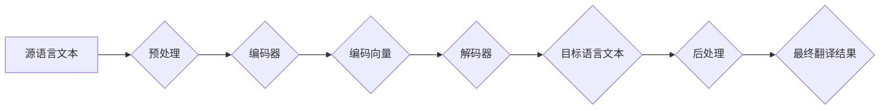

> 深度学习，机器翻译，神经网络，序列到序列模型，Transformer，BERT

## 1. 背景介绍

机器翻译（Machine Translation，MT）是人工智能领域的重要研究方向之一，旨在利用计算机技术自动将一种语言文本翻译成另一种语言文本。传统的机器翻译方法主要依赖于统计方法和规则引擎，但其翻译质量往往有限，难以捕捉语言的语义和文化背景。

深度学习的兴起为机器翻译带来了革命性的变革。深度学习模型能够自动学习语言的复杂模式和规律，从而实现更高质量的机器翻译。近年来，基于深度学习的机器翻译系统取得了显著的进展，在多个语言对上实现了与人类翻译相当甚至超越的翻译质量。

## 2. 核心概念与联系

### 2.1 机器翻译流程

机器翻译流程通常包括以下几个步骤：

1. **源语言文本预处理:** 对源语言文本进行清洗、分词、词形还原等处理，使其更适合深度学习模型的输入。
2. **编码:** 将源语言文本编码成一个固定长度的向量表示，捕捉文本的语义信息。
3. **解码:** 根据编码后的向量表示，生成目标语言文本。
4. **目标语言文本后处理:** 对目标语言文本进行语法检查、标点符号修正等处理，使其更符合语法规范。

### 2.2 深度学习模型架构

深度学习模型通常采用序列到序列（Sequence-to-Sequence，Seq2Seq）模型架构，该架构由两个主要部分组成：

* **编码器:** 负责将源语言文本编码成一个固定长度的向量表示。
* **解码器:** 负责根据编码后的向量表示生成目标语言文本。

**Mermaid 流程图:**



## 3. 核心算法原理 & 具体操作步骤

### 3.1 算法原理概述

Seq2Seq模型的核心思想是将源语言文本和目标语言文本都看作是序列数据，并利用循环神经网络（RNN）或其变体来处理序列数据。

RNN能够捕获序列数据中的时间依赖关系，从而更好地理解文本的语义。常见的RNN变体包括长短期记忆网络（LSTM）和门控循环单元（GRU），它们能够更好地处理长序列数据。

### 3.2 算法步骤详解

1. **编码器:** 编码器将源语言文本逐个词语地输入到RNN中，并生成一个固定长度的隐藏状态向量，该向量包含了源语言文本的语义信息。
2. **解码器:** 解码器接收编码器生成的隐藏状态向量作为输入，并根据该向量逐个词语地生成目标语言文本。解码器通常也使用RNN，并采用注意力机制来关注源语言文本中的相关部分，从而提高翻译质量。

### 3.3 算法优缺点

**优点:**

* 能够捕捉语言的复杂模式和规律。
* 翻译质量显著提高。
* 可以处理不同语言对的翻译任务。

**缺点:**

* 训练数据量大，需要大量标注数据。
* 计算资源消耗大，训练时间长。
* 难以处理长序列数据。

### 3.4 算法应用领域

* **机器翻译:** 将一种语言文本翻译成另一种语言文本。
* **文本摘要:** 将长文本压缩成短文本。
* **对话系统:** 建立人机对话系统。
* **语音识别:** 将语音信号转换为文本。

## 4. 数学模型和公式 & 详细讲解 & 举例说明

### 4.1 数学模型构建

Seq2Seq模型的数学模型可以概括为以下公式：

* **编码器输出:**  $h_t = f(x_t, h_{t-1})$
* **解码器输出:** $y_t = g(h_t, y_{t-1})$

其中：

* $x_t$ 是源语言文本的第 $t$ 个词语。
* $h_t$ 是编码器在第 $t$ 个时间步生成的隐藏状态向量。
* $y_t$ 是目标语言文本的第 $t$ 个词语。
* $f$ 和 $g$ 分别是编码器和解码器的激活函数。

### 4.2 公式推导过程

编码器和解码器的具体实现方式有很多种，常见的RNN变体包括LSTM和GRU。

LSTM和GRU的公式推导过程比较复杂，这里不再赘述。

### 4.3 案例分析与讲解

假设我们有一个简单的源语言文本 "Hello"，目标语言是 "你好"。

编码器将 "Hello" 逐个词语地输入到RNN中，并生成一个隐藏状态向量 $h$。

解码器接收 $h$ 作为输入，并根据 $h$ 生成目标语言文本 "你好"。

## 5. 项目实践：代码实例和详细解释说明

### 5.1 开发环境搭建

* Python 3.6+
* TensorFlow 或 PyTorch
* CUDA 和 cuDNN (可选，用于GPU加速)

### 5.2 源代码详细实现

```python
import tensorflow as tf

# 定义编码器模型
encoder_model = tf.keras.Sequential([
    tf.keras.layers.Embedding(input_dim=vocab_size, output_dim=embedding_dim),
    tf.keras.layers.LSTM(units=lstm_units),
])

# 定义解码器模型
decoder_model = tf.keras.Sequential([
    tf.keras.layers.Embedding(input_dim=vocab_size, output_dim=embedding_dim),
    tf.keras.layers.LSTM(units=lstm_units),
    tf.keras.layers.Dense(units=vocab_size, activation='softmax')
])

# 定义Seq2Seq模型
model = tf.keras.Model(inputs=encoder_model.input, outputs=decoder_model(encoder_model.output))

# 编译模型
model.compile(optimizer='adam', loss='sparse_categorical_crossentropy', metrics=['accuracy'])

# 训练模型
model.fit(train_data, train_labels, epochs=epochs)

# 预测
predictions = model.predict(test_data)
```

### 5.3 代码解读与分析

* 编码器模型使用嵌入层将词语转换为向量表示，然后使用LSTM层处理序列数据。
* 解码器模型也使用嵌入层和LSTM层，并使用softmax激活函数生成目标语言文本的概率分布。
* Seq2Seq模型将编码器和解码器连接起来，形成一个端到端的模型。
* 模型使用Adam优化器、稀疏类别交叉熵损失函数和准确率作为评估指标。

### 5.4 运行结果展示

训练完成后，可以使用模型对测试数据进行预测，并评估模型的性能。

## 6. 实际应用场景

### 6.1 翻译软件

* Google Translate
* DeepL
* Microsoft Translator

### 6.2 网站和应用程序本地化

* 将网站和应用程序翻译成不同的语言，以满足全球用户的需求。

### 6.3 文档翻译

* 将技术文档、法律文件等专业文档翻译成不同的语言。

### 6.4 语音翻译

* 将语音信号翻译成文本，例如在会议、旅游等场景中使用。

### 6.4 未来应用展望

* 更准确、更流畅的机器翻译。
* 支持更多语言对的翻译。
* 能够理解和翻译更复杂的语义和文化背景。
* 与其他人工智能技术结合，例如语音识别、图像识别等，实现更智能的应用。

## 7. 工具和资源推荐

### 7.1 学习资源推荐

* **书籍:**
    * 《深度学习》 by Ian Goodfellow, Yoshua Bengio, and Aaron Courville
    * 《自然语言处理》 by Dan Jurafsky and James H. Martin
* **在线课程:**
    * Coursera: Deep Learning Specialization
    * Udacity: Machine Learning Engineer Nanodegree
* **博客和网站:**
    * TensorFlow Blog
    * PyTorch Blog
    * Towards Data Science

### 7.2 开发工具推荐

* **TensorFlow:** 开源深度学习框架。
* **PyTorch:** 开源深度学习框架。
* **Hugging Face Transformers:** 提供预训练的Transformer模型。

### 7.3 相关论文推荐

* **Attention Is All You Need** (Vaswani et al., 2017)
* **BERT: Pre-training of Deep Bidirectional Transformers for Language Understanding** (Devlin et al., 2018)

## 8. 总结：未来发展趋势与挑战

### 8.1 研究成果总结

深度学习在机器翻译领域取得了显著的进展，翻译质量显著提高，并应用于多个领域。

### 8.2 未来发展趋势

* 更准确、更流畅的机器翻译。
* 支持更多语言对的翻译。
* 能够理解和翻译更复杂的语义和文化背景。
* 与其他人工智能技术结合，实现更智能的应用。

### 8.3 面临的挑战

* 训练数据量大，需要大量标注数据。
* 计算资源消耗大，训练时间长。
* 难以处理长序列数据。
* 难以捕捉语言的文化背景和幽默感。

### 8.4 研究展望

未来研究方向包括：

* 开发更有效的训练方法，减少训练数据和计算资源的消耗。
* 研究更强大的模型架构，能够处理更长序列数据和更复杂的语义。
* 开发能够理解和翻译文化背景和幽默感的机器翻译系统。


## 9. 附录：常见问题与解答

### 9.1 什么是机器翻译？

机器翻译是指利用计算机技术自动将一种语言文本翻译成另一种语言文本的过程。

### 9.2 深度学习如何应用于机器翻译？

深度学习模型能够自动学习语言的复杂模式和规律，从而实现更高质量的机器翻译。常见的深度学习模型包括Seq2Seq模型、Transformer模型等。

### 9.3 机器翻译的未来发展趋势是什么？

未来机器翻译将更加准确、流畅，支持更多语言对，并能够理解和翻译更复杂的语义和文化背景。

作者：禅与计算机程序设计艺术 / Zen and the Art of Computer Programming 


<end_of_turn>