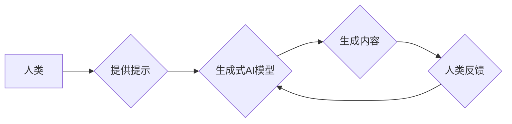

> 生成式AI、人机协同、文本生成、图像生成、代码生成、协作模式、AI助手、创意工具

## 1. 背景介绍

近年来，生成式人工智能（Generative AI）技术取得了飞速发展，其强大的文本、图像、音频、视频等多模态生成能力，正在深刻地改变着人们的生活和工作方式。从ChatGPT的文本创作能力到DALL-E 2的图像生成能力，生成式AI已经展现出其巨大的潜力，并逐渐渗透到各个领域，例如教育、娱乐、设计、科研等。

然而，生成式AI技术的发展也面临着一些挑战。首先，现有的生成式AI模型往往需要大量的训练数据和计算资源，这使得其应用成本较高。其次，生成式AI模型的输出结果往往缺乏灵活性，难以满足用户个性化的需求。最后，生成式AI模型的解释性和可控性不足，这使得其应用在一些关键领域受到限制。

为了更好地发挥生成式AI的潜力，并解决其面临的挑战，人机协同成为一个重要的研究方向。通过将人类的智慧和创造力与生成式AI的强大能力相结合，我们可以构建更加高效、灵活、可控的人机协作系统，从而推动生成式AI技术的发展和应用。

## 2. 核心概念与联系

**2.1 人机协同**

人机协同是指人类和机器在共同完成任务的过程中相互合作、相互补充，发挥各自优势的模式。在生成式AI领域，人机协同是指人类与生成式AI模型共同参与生成内容的过程。

**2.2 生成式AI**

生成式AI是指能够根据输入数据生成新数据的机器学习模型。常见的生成式AI模型包括：

* **文本生成模型:** 例如GPT-3、BERT、LaMDA等，能够生成文本、文章、代码等。
* **图像生成模型:** 例如DALL-E 2、Stable Diffusion、Midjourney等，能够生成图像、绘画、照片等。
* **音频生成模型:** 例如Jukebox、WaveNet等，能够生成音乐、语音、音效等。

**2.3 协作模式**

在人机协同中，不同的协作模式可以根据任务需求和人类参与程度进行选择。常见的协作模式包括：

* **提示引导模式:** 人类提供文本提示，引导生成式AI模型生成特定内容。
* **迭代修正模式:** 人类与生成式AI模型进行多次迭代，逐步完善生成内容。
* **共同创作模式:** 人类和生成式AI模型共同参与内容的创作过程，发挥各自的优势。

**2.4 Mermaid 流程图**



## 3. 核心算法原理 & 具体操作步骤

### 3.1 算法原理概述

生成式AI模型的核心算法原理是基于深度学习，特别是变分自编码器（VAE）和生成对抗网络（GAN）等架构。

* **变分自编码器（VAE）:** VAE通过编码器将输入数据压缩成低维表示，然后通过解码器将低维表示恢复成原始数据。在训练过程中，VAE的目标是将编码器和解码器训练到能够有效地重建输入数据。

* **生成对抗网络（GAN）:** GAN由两个网络组成：生成器和判别器。生成器试图生成逼真的数据，而判别器试图区分真实数据和生成数据。两者在对抗博弈中相互竞争，最终生成器能够生成与真实数据相似的样本。

### 3.2 算法步骤详解

**3.2.1 VAE 算法步骤:**

1. **数据预处理:** 将输入数据进行标准化或归一化处理。
2. **编码器训练:** 将输入数据输入编码器，学习将数据压缩成低维表示。
3. **解码器训练:** 将低维表示输入解码器，学习将数据恢复成原始数据。
4. **损失函数优化:** 使用重建损失函数和正则化项，优化编码器和解码器的参数。

**3.2.2 GAN 算法步骤:**

1. **生成器初始化:** 初始化生成器网络的参数。
2. **判别器训练:** 使用真实数据和生成数据训练判别器，学习区分两者。
3. **生成器训练:** 使用判别器的反馈信息训练生成器，使其生成更逼真的数据。
4. **损失函数优化:** 使用判别器和生成器的损失函数，优化网络参数。

### 3.3 算法优缺点

**3.3.1 VAE 优点:**

* 生成结果具有较好的质量和多样性。
* 训练过程相对稳定，更容易收敛。

**3.3.1 VAE 缺点:**

* 生成结果可能存在模糊或失真现象。
* 训练过程需要较多的计算资源。

**3.3.2 GAN 优点:**

* 生成结果具有更高的逼真度和细节。
* 可以生成更复杂的和多样化的样本。

**3.3.2 GAN 缺点:**

* 训练过程不稳定，容易出现模式崩溃现象。
* 需要大量的训练数据和计算资源。

### 3.4 算法应用领域

* **文本生成:** 自动写作、机器翻译、对话系统等。
* **图像生成:** 图像合成、图像修复、图像风格迁移等。
* **音频生成:** 音乐创作、语音合成、音效制作等。
* **视频生成:** 视频合成、视频特效、视频剪辑等。

## 4. 数学模型和公式 & 详细讲解 & 举例说明

### 4.1 数学模型构建

**4.1.1 VAE 数学模型:**

VAE 的核心是编码器和解码器两个神经网络。

* **编码器:** 将输入数据 $x$ 映射到低维表示 $z$:

$$z = E(x)$$

* **解码器:** 将低维表示 $z$ 映射回原始数据 $\hat{x}$:

$$\hat{x} = D(z)$$

**4.1.2 GAN 数学模型:**

GAN 由两个网络组成：生成器 $G$ 和判别器 $D$.

* **生成器:** 将随机噪声 $z$ 映射到生成数据 $\hat{x}$:

$$\hat{x} = G(z)$$

* **判别器:** 将数据 $x$ 分别分类为真实数据或生成数据:

$$p(real|x) = D(x)$$

### 4.2 公式推导过程

**4.2.1 VAE 损失函数:**

VAE 的损失函数由两个部分组成:

* **重建损失:** 衡量生成数据 $\hat{x}$ 与真实数据 $x$ 之间的差异。

$$L_{recon} = ||x - \hat{x}||^2$$

* **正则化项:** 限制编码器输出 $z$ 的分布，防止过拟合。

$$L_{reg} = KL(P(z) || Q(z))$$

总损失函数为:

$$L_{VAE} = L_{recon} + \lambda L_{reg}$$

**4.2.2 GAN 损失函数:**

GAN 的损失函数由两个部分组成:

* **判别器损失:** 衡量判别器对真实数据和生成数据的分类准确率。

$$L_D = -E_{x \sim p_{data}(x)}[log(D(x))] - E_{z \sim p_z(z)}[log(1 - D(G(z)))]$$

* **生成器损失:** 衡量生成器生成的数据是否能够欺骗判别器。

$$L_G = -E_{z \sim p_z(z)}[log(D(G(z)))]$$

总损失函数为:

$$L_{GAN} = L_D + L_G$$

### 4.3 案例分析与讲解

**4.3.1 VAE 案例:**

VAE 可以用于图像压缩和恢复。通过训练一个 VAE 模型，可以将图像压缩成低维表示，并通过解码器恢复出原始图像。

**4.3.2 GAN 案例:**

GAN 可以用于生成逼真的图像、视频和音频。例如，DALL-E 2 可以根据文本描述生成图像，而 Jukebox 可以生成逼真的音乐。

## 5. 项目实践：代码实例和详细解释说明

### 5.1 开发环境搭建

* **操作系统:** Linux/macOS/Windows
* **编程语言:** Python
* **深度学习框架:** TensorFlow/PyTorch
* **其他工具:** Git、Jupyter Notebook

### 5.2 源代码详细实现

以下是一个使用 TensorFlow 实现 VAE 图像压缩的简单代码示例:

```python
import tensorflow as tf

# 定义编码器网络
def encoder(x):
  # ...

# 定义解码器网络
def decoder(z):
  # ...

# 定义损失函数
def loss_function(x, x_hat):
  # ...

# 创建模型实例
vae = tf.keras.Model(inputs=x, outputs=x_hat)

# 训练模型
vae.compile(optimizer='adam', loss=loss_function)
vae.fit(x_train, x_train, epochs=10)

# 使用模型压缩图像
compressed_image = vae.predict(image)
```

### 5.3 代码解读与分析

* **编码器网络:** 将输入图像压缩成低维表示。
* **解码器网络:** 将低维表示恢复成原始图像。
* **损失函数:** 衡量生成图像与真实图像之间的差异。
* **模型训练:** 使用训练数据训练 VAE 模型。
* **图像压缩:** 使用训练好的模型压缩图像。

### 5.4 运行结果展示

训练完成后，可以将压缩后的图像与原始图像进行比较，观察压缩效果。

## 6. 实际应用场景

### 6.1 文本生成

* **自动写作:** 生成新闻报道、产品描述、广告文案等。
* **机器翻译:** 将文本从一种语言翻译成另一种语言。
* **对话系统:** 创建能够与人类进行自然对话的聊天机器人。

### 6.2 图像生成

* **图像合成:** 生成逼真的合成图像，例如人物肖像、场景合成等。
* **图像修复:** 修复损坏或模糊的图像。
* **图像风格迁移:** 将图像转换为不同的艺术风格。

### 6.3 音频生成

* **音乐创作:** 生成原创音乐作品。
* **语音合成:** 将文本转换为语音。
* **音效制作:** 生成各种音效，例如爆炸声、枪声等。

### 6.4 未来应用展望

* **个性化内容生成:** 根据用户的喜好和需求生成个性化的内容。
* **虚拟现实和增强现实:** 生成逼真的虚拟环境和增强现实体验。
* **科学研究:** 辅助科学家进行数据分析、模型构建和实验设计。

## 7. 工具和资源推荐

### 7.1 学习资源推荐

* **书籍:**
    * 《Deep Learning》 by Ian Goodfellow, Yoshua Bengio, and Aaron Courville
    * 《Generative Deep Learning》 by David Foster
* **在线课程:**
    * Coursera: Deep Learning Specialization
    * Udacity: Deep Learning Nanodegree
* **博客和论坛:**
    * Towards Data Science
    * Reddit: r/MachineLearning

### 7.2 开发工具推荐

* **深度学习框架:** TensorFlow, PyTorch, Keras
* **编程语言:** Python
* **数据处理工具:** Pandas, NumPy
* **可视化工具:** Matplotlib, Seaborn

### 7.3 相关论文推荐

* **Generative Adversarial Networks** by Ian Goodfellow et al. (2014)
* **Auto-Encoding Variational Bayes** by Diederik P. Kingma and Max Welling (2013)
* **Attention Is All You Need** by Ashish Vaswani et al. (2017)

## 8. 总结：未来发展趋势与挑战

### 8.1 研究成果总结

近年来，生成式AI技术取得了显著进展，在