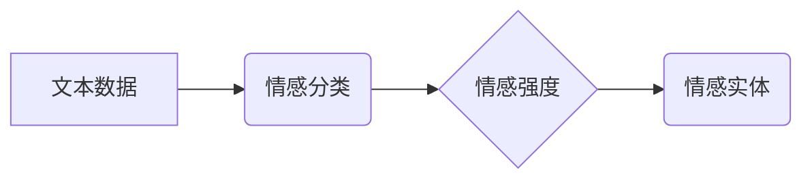

> 用户情感分析，自然语言处理，机器学习，深度学习，文本分类，情感识别，市场营销，客户服务

## 1. 背景介绍

在当今数据爆炸的时代，用户生成的内容（UGC）如评论、帖子、社交媒体对话等，为企业提供了宝贵的洞察用户情感和态度的窗口。用户情感分析（Sentiment Analysis），也称为情感识别，正是利用自然语言处理（NLP）和机器学习（ML）技术，从文本数据中识别和理解用户的情感倾向，例如正面、负面或中立。

用户情感分析在各个领域都具有广泛的应用前景，例如：

* **市场营销：** 了解消费者对产品、服务和品牌的评价，改进营销策略，提高客户满意度。
* **客户服务：** 自动识别客户反馈中的问题和情绪，提供更及时和有效的客户服务。
* **品牌管理：** 监控品牌形象和声誉，及时应对负面舆论。
* **社会科学研究：** 分析公众对社会事件和政治议题的看法，了解社会情绪和趋势。

## 2. 核心概念与联系

用户情感分析的核心概念包括：

* **文本数据：** 用户生成的内容，例如评论、帖子、社交媒体对话等。
* **情感分类：** 将文本数据的情绪倾向归类为正面、负面或中立。
* **情感强度：** 衡量用户情感的强度，例如非常正面、比较正面、中立、比较负面、非常负面。
* **情感实体：** 识别文本中表达情感的关键词或短语。

**核心概念架构：**



## 3. 核心算法原理 & 具体操作步骤

### 3.1  算法原理概述

用户情感分析算法主要分为以下几种类型：

* **基于规则的算法：** 基于预定义的规则和词典，识别情感词语并计算情感得分。
* **基于机器学习的算法：** 利用训练数据，训练机器学习模型，例如支持向量机（SVM）、朴素贝叶斯（Naive Bayes）、随机森林（Random Forest）等，对文本数据进行情感分类。
* **基于深度学习的算法：** 利用深度神经网络，例如循环神经网络（RNN）、长短期记忆网络（LSTM）、Transformer等，对文本数据进行情感分析。

### 3.2  算法步骤详解

以基于机器学习的算法为例，其具体操作步骤如下：

1. **数据收集和预处理：** 收集用户生成的内容，并进行预处理，例如去除停用词、标点符号、HTML标签等。
2. **特征提取：** 从预处理后的文本数据中提取特征，例如词频、词向量、情感词典得分等。
3. **模型训练：** 利用训练数据，训练机器学习模型，例如SVM、Naive Bayes、Random Forest等。
4. **模型评估：** 使用测试数据评估模型的性能，例如准确率、召回率、F1-score等。
5. **模型部署：** 将训练好的模型部署到生产环境中，用于对新文本数据进行情感分析。

### 3.3  算法优缺点

**基于规则的算法：**

* **优点：** 简单易实现，可解释性强。
* **缺点：** 难以处理复杂的情感表达，容易受到语言变化的影响。

**基于机器学习的算法：**

* **优点：** 能够学习复杂的模式，适应语言变化。
* **缺点：** 需要大量的训练数据，模型解释性较弱。

**基于深度学习的算法：**

* **优点：** 表现出更强的学习能力，能够处理更复杂的文本数据。
* **缺点：** 训练成本高，模型复杂度高，可解释性较弱。

### 3.4  算法应用领域

用户情感分析算法广泛应用于以下领域：

* **市场营销：** 产品评价分析、广告效果评估、品牌监控。
* **客户服务：** 问题识别、情绪分析、客户满意度调查。
* **社会科学研究：** 公众舆情分析、社会情绪监测、政治倾向分析。

## 4. 数学模型和公式 & 详细讲解 & 举例说明

### 4.1  数学模型构建

用户情感分析的数学模型通常基于概率论和统计学，例如朴素贝叶斯模型、支持向量机等。

**朴素贝叶斯模型：**

朴素贝叶斯模型是一种基于贝叶斯定理的分类算法，假设特征之间相互独立。其核心公式如下：

$$P(C|X) = \frac{P(X|C)P(C)}{P(X)}$$

其中：

* $P(C|X)$：给定特征 $X$ 的条件下，类别 $C$ 的概率。
* $P(X|C)$：给定类别 $C$ 的条件下，特征 $X$ 的概率。
* $P(C)$：类别 $C$ 的先验概率。
* $P(X)$：特征 $X$ 的先验概率。

### 4.2  公式推导过程

朴素贝叶斯模型的推导过程基于贝叶斯定理和特征独立性假设。

**贝叶斯定理：**

$$P(A|B) = \frac{P(B|A)P(A)}{P(B)}$$

**特征独立性假设：**

$$P(X|C) = \prod_{i=1}^{n} P(x_i|C)$$

其中：

* $x_i$：特征 $X$ 的第 $i$ 个元素。

### 4.3  案例分析与讲解

假设我们有一个情感分类任务，需要判断文本数据是正面、负面还是中立。

* **训练数据：** 我们收集了大量文本数据，并对其进行了情感标注。
* **特征提取：** 我们提取了文本数据中的词频特征。
* **模型训练：** 我们使用朴素贝叶斯模型训练分类器。
* **预测：** 我们输入一个新的文本数据，模型根据训练数据和特征提取结果，预测其情感倾向。

## 5. 项目实践：代码实例和详细解释说明

### 5.1  开发环境搭建

* **操作系统：** Windows、macOS、Linux
* **编程语言：** Python
* **库依赖：** NLTK、Scikit-learn、TensorFlow/PyTorch

### 5.2  源代码详细实现

```python
import nltk
from nltk.corpus import stopwords
from sklearn.feature_extraction.text import TfidfVectorizer
from sklearn.model_selection import train_test_split
from sklearn.naive_bayes import MultinomialNB
from sklearn.metrics import accuracy_score

# 数据加载
data = [
    ("This movie is amazing!", "positive"),
    ("I hate this product.", "negative"),
    ("The food was okay.", "neutral"),
    # ...
]

# 数据预处理
stop_words = set(stopwords.words('english'))
def preprocess_text(text):
    text = text.lower()
    text = [word for word in text.split() if word not in stop_words]
    return " ".join(text)

processed_data = [(preprocess_text(text), label) for text, label in data]

# 特征提取
vectorizer = TfidfVectorizer()
X = vectorizer.fit_transform([text for text, label in processed_data])
y = [label for text, label in processed_data]

# 模型训练
X_train, X_test, y_train, y_test = train_test_split(X, y, test_size=0.2)
model = MultinomialNB()
model.fit(X_train, y_train)

# 模型评估
y_pred = model.predict(X_test)
accuracy = accuracy_score(y_test, y_pred)
print(f"Accuracy: {accuracy}")

# 预测新文本
new_text = "This is a great day!"
processed_new_text = preprocess_text(new_text)
new_text_vector = vectorizer.transform([processed_new_text])
predicted_sentiment = model.predict(new_text_vector)[0]
print(f"Predicted sentiment: {predicted_sentiment}")
```

### 5.3  代码解读与分析

* **数据加载和预处理：** 代码首先加载训练数据，并对文本数据进行预处理，例如转换为小写、去除停用词等。
* **特征提取：** 代码使用TF-IDF向量化技术提取文本特征。
* **模型训练：** 代码使用朴素贝叶斯模型训练分类器。
* **模型评估：** 代码使用测试数据评估模型的准确率。
* **预测新文本：** 代码使用训练好的模型预测新文本的情感倾向。

### 5.4  运行结果展示

运行代码后，会输出模型的准确率和对新文本的预测结果。

## 6. 实际应用场景

### 6.1  市场营销

* **产品评价分析：** 分析用户对产品评论的情感倾向，了解产品优缺点，改进产品设计和营销策略。
* **广告效果评估：** 评估广告文案和创意对用户情感的影响，优化广告投放策略。
* **品牌监控：** 监控用户对品牌的评价和讨论，及时应对负面舆论，维护品牌形象。

### 6.2  客户服务

* **问题识别：** 自动识别客户反馈中的问题和需求，提高客户服务效率。
* **情绪分析：** 分析客户反馈中的情绪倾向，提供更个性化的客户服务。
* **客户满意度调查：** 通过分析客户反馈，了解客户对服务的满意度，改进服务质量。

### 6.3  社会科学研究

* **舆情分析：** 分析公众对社会事件和政治议题的看法，了解社会情绪和趋势。
* **社会情绪监测：** 监测社会情绪的变化，预警社会风险。
* **政治倾向分析：** 分析用户对政治人物和政党的评价，了解公众政治倾向。

### 6.4  未来应用展望

随着人工智能技术的不断发展，用户情感分析将在更多领域得到应用，例如：

* **医疗保健：** 分析患者的病历和症状，预测疾病风险，提供个性化医疗服务。
* **教育：** 分析学生的学习情况和情绪状态，提供个性化学习建议。
* **金融：** 分析客户的投资行为和风险偏好，提供个性化理财服务。

## 7. 工具和资源推荐

### 7.1  学习资源推荐

* **书籍：**
    * Natural Language Processing with Python by Steven Bird, Ewan Klein, and Edward Loper
    * Speech and Language Processing by Daniel Jurafsky and James H. Martin
* **在线课程：**
    * Stanford CS224N: Natural Language Processing with Deep Learning
    * Coursera: Natural Language Processing Specialization

### 7.2  开发工具推荐

* **Python：** 广泛用于自然语言处理和机器学习开发。
* **NLTK：** Python 的自然语言处理库。
* **Scikit-learn：** Python 的机器学习库。
* **TensorFlow/PyTorch：** 深度学习框架。

### 7.3  相关论文推荐

* **Sentiment Analysis and Opinion Mining** by Pang and Lee (2008)
* **Deep Learning for Sentiment Analysis** by Socher et al. (2013)
* **BERT: Pre-training of Deep Bidirectional Transformers for Language Understanding** by Devlin et al. (2018)

## 8. 总结：未来发展趋势与挑战

### 8.1  研究成果总结

用户情感分析领域取得了显著进展，从基于规则的算法到基于深度学习的算法，模型性能不断提升。

### 8.2  未来发展趋势

* **多模态情感分析：** 将文本、图像、音频等多模态数据融合，进行更全面的情感分析。
* **跨语言情感分析：** 突破语言障碍，实现跨语言的情感分析。
* **微表情识别：** 分析