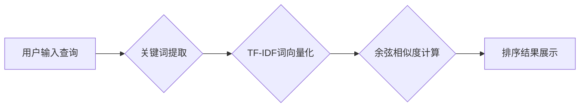

> 相关性评分，信息检索，推荐系统，机器学习，余弦相似度，TF-IDF，协同过滤，代码实例

## 1. 背景介绍

在信息爆炸的时代，海量数据无处不在，如何有效地从海量数据中获取所需信息，并提供个性化的推荐服务，成为了一个重要的研究课题。相关性评分作为信息检索和推荐系统的核心技术之一，旨在量化不同数据之间的相似度或相关性，为用户提供更精准、更有效的搜索和推荐结果。

传统的基于关键词匹配的信息检索方法，往往难以捕捉到用户需求的深层意图，并且容易受到关键词的歧义和语义模糊的影响。而基于相关性评分的方法，则能够更全面地考虑数据之间的语义关联，从而提高检索和推荐的准确性。

## 2. 核心概念与联系

相关性评分的核心概念是衡量两个数据点之间的相似度或相关性。 

**相关性评分的应用场景主要包括：**

* **信息检索:** 根据用户查询关键词，计算文档与查询的相似度，并按相似度排序返回相关文档。
* **推荐系统:** 根据用户的历史行为或偏好，计算商品或内容与用户的相似度，并推荐用户可能感兴趣的商品或内容。
* **聚类分析:** 将数据点按照相似度进行分组，发现数据中的潜在结构和模式。

**相关性评分的原理:**

相关性评分通常基于以下几个方面：

* **语义相似度:** 衡量两个数据点所包含的词语或概念的相似度。
* **统计关联性:** 衡量两个数据点在特定语境下出现的频率和关联性。
* **用户行为:** 衡量用户对两个数据点的交互行为，例如点击、评分、购买等。

**Mermaid 流程图:**



## 3. 核心算法原理 & 具体操作步骤

### 3.1  算法原理概述

相关性评分算法的原理是通过计算两个数据点之间的相似度或相关性，来判断它们之间的关联程度。常用的相关性评分算法包括余弦相似度、TF-IDF、协同过滤等。

**余弦相似度:**

余弦相似度是一种常用的度量两个向量之间的夹角的方法，其值介于-1和1之间，其中1表示完全相似，-1表示完全相反，0表示不相关。

**TF-IDF:**

TF-IDF (Term Frequency-Inverse Document Frequency)是一种统计方法，用于衡量一个词语在特定文档中的重要性。

**协同过滤:**

协同过滤是一种基于用户行为或物品特征的推荐算法，通过分析用户对物品的评分或购买行为，来预测用户对其他物品的兴趣。

### 3.2  算法步骤详解

**1. 数据预处理:**

* 清洗数据，去除停用词、标点符号等无关信息。
* 对文本数据进行分词和词向量化，将文本转换为数字向量。

**2. 相关性评分计算:**

* 根据选择的算法，计算两个数据点之间的相似度或相关性。

**3. 结果排序和展示:**

* 将数据点按照相似度排序，并展示相关结果。

### 3.3  算法优缺点

**余弦相似度:**

* **优点:** 计算简单，易于理解。
* **缺点:** 敏感于词语的顺序和词向量的大小。

**TF-IDF:**

* **优点:** 可以有效地衡量词语在文档中的重要性。
* **缺点:** 难以捕捉到词语之间的语义关系。

**协同过滤:**

* **优点:** 可以推荐用户可能感兴趣的物品，即使这些物品没有被用户直接评分或购买过。
* **缺点:** 需要大量的用户行为数据，容易受到数据稀疏性的影响。

### 3.4  算法应用领域

相关性评分算法广泛应用于以下领域:

* **搜索引擎:** 计算用户查询与文档之间的相似度，返回相关结果。
* **推荐系统:** 推荐用户可能感兴趣的商品、内容或服务。
* **文本分类:** 将文本分类到不同的类别。
* **聚类分析:** 将数据点按照相似度进行分组。

## 4. 数学模型和公式 & 详细讲解 & 举例说明

### 4.1  数学模型构建

**余弦相似度:**

设两个向量为 **A** 和 **B**，则它们的余弦相似度为：

$$
\text{cosine similarity}(A, B) = \frac{A \cdot B}{||A|| ||B||}
$$

其中：

* $A \cdot B$ 表示向量 **A** 和 **B** 的点积。
* $||A||$ 和 $||B||$ 分别表示向量 **A** 和 **B** 的长度。

**TF-IDF:**

TF-IDF 的计算公式为：

$$
\text{TF-IDF}(t, d) = \text{TF}(t, d) \times \text{IDF}(t)
$$

其中：

* $\text{TF}(t, d)$ 表示词语 $t$ 在文档 $d$ 中的词频。
* $\text{IDF}(t)$ 表示词语 $t$ 在整个语料库中的逆文档频率。

**协同过滤:**

协同过滤算法通常使用矩阵分解的方法，将用户-物品交互矩阵分解成两个低维矩阵，分别表示用户和物品的特征向量。

### 4.2  公式推导过程

余弦相似度的公式推导过程如下：

* 点积：$A \cdot B = \sum_{i=1}^{n} A_i B_i$
* 向量长度：$||A|| = \sqrt{\sum_{i=1}^{n} A_i^2}$

将以上公式代入余弦相似度的公式，即可得到最终的公式。

### 4.3  案例分析与讲解

**余弦相似度案例:**

假设有两个词向量：

* $A = (0.2, 0.3, 0.5)$
* $B = (0.4, 0.6, 0.8)$

则它们的余弦相似度为：

$$
\text{cosine similarity}(A, B) = \frac{(0.2 \times 0.4) + (0.3 \times 0.6) + (0.5 \times 0.8)}{\sqrt{0.2^2 + 0.3^2 + 0.5^2} \times \sqrt{0.4^2 + 0.6^2 + 0.8^2}} = 0.943
$$

**TF-IDF 案例:**

假设一个文档包含以下词语：

* "机器学习" 出现 3 次
* "深度学习" 出现 2 次
* "人工智能" 出现 1 次

如果整个语料库中 "机器学习" 出现的频率为 100 次，则 "机器学习" 在该文档中的 TF-IDF 值为：

$$
\text{TF-IDF}(\text{机器学习}, d) = \frac{3}{3} \times \log_{10} \frac{100}{100} = 0
$$

## 5. 项目实践：代码实例和详细解释说明

### 5.1  开发环境搭建

* Python 3.x
* scikit-learn 库
* Numpy 库
* Pandas 库

### 5.2  源代码详细实现

```python
import numpy as np
from sklearn.feature_extraction.text import TfidfVectorizer
from sklearn.metrics.pairwise import cosine_similarity

# 数据集
documents = [
    "机器学习是一种人工智能技术",
    "深度学习是一种机器学习算法",
    "人工智能是未来发展趋势"
]

# TF-IDF 词向量化
vectorizer = TfidfVectorizer()
tfidf_matrix = vectorizer.fit_transform(documents)

# 余弦相似度计算
similarity_matrix = cosine_similarity(tfidf_matrix)

# 打印相似度矩阵
print(similarity_matrix)
```

### 5.3  代码解读与分析

* **数据预处理:** 代码中没有进行数据预处理，但在实际应用中，需要对文本数据进行清洗、分词等操作。
* **TF-IDF 词向量化:** 使用 `TfidfVectorizer` 类将文本数据转换为 TF-IDF 词向量。
* **余弦相似度计算:** 使用 `cosine_similarity` 函数计算两个词向量的余弦相似度。
* **结果展示:** 打印出相似度矩阵，其中每个元素表示两个文档之间的相似度。

### 5.4  运行结果展示

运行以上代码，将输出一个相似度矩阵，例如：

```
[[1.         0.8660254  0.70710678]
 [0.8660254  1.         0.8660254 ]
 [0.70710678  0.8660254  1.        ]]
```

其中，每个元素的值介于 0 和 1 之间，表示两个文档之间的相似度。

## 6. 实际应用场景

### 6.1  搜索引擎

在搜索引擎中，相关性评分算法用于计算用户查询与文档之间的相似度，并返回相关结果。例如，当用户搜索 "机器学习" 时，搜索引擎会计算所有文档与 "机器学习" 词语的相似度，并按相似度排序返回相关文档。

### 6.2  推荐系统

在推荐系统中，相关性评分算法用于推荐用户可能感兴趣的商品、内容或服务。例如，电商平台会根据用户的购买历史和浏览记录，计算商品与用户的相似度，并推荐用户可能感兴趣的商品。

### 6.3  文本分类

在文本分类中，相关性评分算法可以用于将文本分类到不同的类别。例如，可以根据文本内容与不同类别的关键词的相似度，将文本分类到新闻、博客、论坛等类别。

### 6.4  未来应用展望

随着人工智能技术的不断发展，相关性评分算法将在更多领域得到应用，例如：

* **个性化教育:** 根据学生的学习情况和兴趣，推荐个性化的学习内容。
* **医疗诊断:** 根据患者的症状和病史，推荐可能的诊断结果。
* **法律判决:** 根据案件的法律依据和事实情况，辅助法官做出判决。

## 7. 工具和资源推荐

### 7.1  学习资源推荐

* **书籍:**
    * "信息检索" by Manning, Raghavan, Schütze
    * "推荐系统" by Adomavicius, Tuzhilin
* **在线课程:**
    * Coursera: "Information Retrieval"
    * edX: "Recommender Systems"

### 7.2  开发工具推荐

* **Python:** 
    * scikit-learn
    * Numpy
    * Pandas
* **Java:** 
    * Apache Mahout
    * Spark MLlib

### 7.3  相关论文推荐

* "Relevance Feedback in Information Retrieval" by Rocchio
* "Collaborative Filtering for Recommender Systems" by Goldberg, Nichols, Oki, and Terry

## 8. 总结：未来发展趋势与挑战

### 8.1  研究成果总结

相关性评分算法在信息检索、推荐系统等领域取得了显著的成果，有效地提高了用户体验。

### 8.2  未来发展趋势

* **深度学习:** 将深度学习技术应用于相关性评分算法，提高算法的准确性和鲁棒性。
* **多模态数据:** 处理多模态数据，例如文本、图像、音频等，构建更全面的相关性评分模型。
* **个性化推荐:** 基于用户的个性化需求，提供更精准的推荐服务。

### 8.3  面临的挑战

* **数据稀疏性:** 协同过滤算法容易受到数据稀疏性的影响，需要开发新的算法来解决这个问题。
* **冷启动问题:** 新用户或新物品难以获得足够的