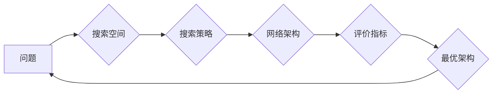

> 神经架构搜索，NAS，深度学习，自动机器学习，自动模型设计，强化学习，进化算法

## 1. 背景介绍

深度学习近年来取得了令人瞩目的成就，在图像识别、自然语言处理、语音识别等领域取得了突破性的进展。然而，深度学习模型的性能通常依赖于精心设计的网络架构，而手工设计网络架构是一个耗时费力且需要专业知识的过程。随着深度学习模型的复杂性不断增加，手工设计网络架构变得越来越困难。

为了解决这个问题，神经架构搜索（NAS）应运而生。NAS是一种利用机器学习算法自动搜索最优神经网络架构的技术。它通过自动化流程，探索和评估大量的网络架构，最终找到在特定任务上表现最佳的架构。

## 2. 核心概念与联系

NAS的核心概念是将网络架构设计视为一个优化问题，并利用机器学习算法进行搜索。

**2.1 核心概念**

* **神经网络架构:** 指的是神经网络的结构，包括层数、层类型、节点数量、连接方式等。
* **搜索空间:** 指的是所有可能的网络架构的集合。
* **搜索策略:** 指的是用于探索搜索空间的算法，例如强化学习、进化算法等。
* **评价指标:** 指的是用于评估网络架构性能的指标，例如准确率、损失函数值等。

**2.2 架构关系图**



## 3. 核心算法原理 & 具体操作步骤

### 3.1 算法原理概述

NAS算法的核心是利用机器学习算法自动搜索最优网络架构。常见的NAS算法包括强化学习、进化算法、梯度下降等。

* **强化学习:** 将网络架构搜索视为一个马尔可夫决策过程，训练一个代理智能体，通过与环境交互，学习最优的网络架构。
* **进化算法:** 将网络架构编码为染色体，通过选择、交叉、变异等操作，模拟自然进化过程，最终找到最优的网络架构。
* **梯度下降:** 将网络架构参数化，利用梯度下降算法优化网络架构参数，找到最优的网络架构。

### 3.2 算法步骤详解

以强化学习为例，NAS算法的具体操作步骤如下：

1. **定义搜索空间:** 确定所有可能的网络架构的集合。
2. **构建代理智能体:** 使用强化学习算法训练一个代理智能体，该智能体可以根据当前状态选择网络架构。
3. **训练代理智能体:** 将代理智能体与环境交互，环境会根据选择的网络架构评估其性能，并反馈奖励给代理智能体。
4. **搜索最优架构:** 代理智能体通过不断学习和探索，最终找到在特定任务上表现最佳的网络架构。

### 3.3 算法优缺点

**优点:**

* 自动化网络架构设计，节省人工成本和时间。
* 可以探索更广泛的搜索空间，找到更优的网络架构。
* 适应性强，可以针对不同的任务和数据集进行搜索。

**缺点:**

* 计算资源消耗大，训练时间长。
* 搜索空间巨大，难以保证找到全局最优解。
* 需要大量的训练数据和计算资源。

### 3.4 算法应用领域

NAS算法在图像识别、自然语言处理、语音识别、机器翻译等领域都有广泛的应用。

## 4. 数学模型和公式 & 详细讲解 & 举例说明

### 4.1 数学模型构建

NAS算法通常使用强化学习模型，例如深度Q网络（DQN）或策略梯度算法（PG）。

**4.1.1 深度Q网络（DQN）**

DQN模型使用一个深度神经网络来估计状态-动作对的价值函数，即在给定状态下采取特定动作的期望回报。

**4.1.2 策略梯度算法（PG）**

PG算法直接学习策略函数，即在给定状态下选择动作的概率分布。

### 4.2 公式推导过程

**4.2.1 DQN模型的价值函数估计公式:**

$$
Q(s, a) = \omega^T \phi(s, a)
$$

其中：

* $Q(s, a)$ 是状态 $s$ 下采取动作 $a$ 的价值函数。
* $\omega$ 是神经网络的参数。
* $\phi(s, a)$ 是状态 $s$ 和动作 $a$ 的特征向量。

**4.2.2 PG算法的策略梯度公式:**

$$
\nabla_{\theta} J(\theta) = \mathbb{E}_{\tau \sim \pi_{\theta}} \left[ \nabla_{\theta} \log \pi_{\theta}(a_t | s_t) \cdot A_t \right]
$$

其中：

* $J(\theta)$ 是策略函数 $\pi_{\theta}$ 的目标函数。
* $\theta$ 是策略函数的参数。
* $\tau$ 是一个轨迹，由状态序列 $s_t$ 和动作序列 $a_t$ 组成。
* $A_t$ 是状态 $s_t$ 下采取动作 $a_t$ 的优势函数。

### 4.3 案例分析与讲解

**4.3.1 DQN在NAS中的应用**

在NAS中，DQN可以用来搜索网络架构。状态 $s$ 包含网络架构的当前配置，动作 $a$ 包含对网络架构进行修改的操作，例如添加一层、改变层类型等。价值函数 $Q(s, a)$ 表示在当前网络架构下采取特定操作的期望回报。

**4.3.2 PG在NAS中的应用**

在NAS中，PG可以用来直接学习网络架构搜索策略。策略函数 $\pi_{\theta}$ 输出网络架构的概率分布，其中 $\theta$ 是策略函数的参数。目标函数 $J(\theta)$ 可以定义为网络架构在特定任务上的性能。

## 5. 项目实践：代码实例和详细解释说明

### 5.1 开发环境搭建

* Python 3.6+
* TensorFlow/PyTorch
* CUDA/cuDNN

### 5.2 源代码详细实现

```python
# 使用强化学习算法进行NAS
import tensorflow as tf

# 定义搜索空间
search_space = {
    'layers': [
        {'type': 'conv2d', 'filters': 32, 'kernel_size': 3},
        {'type': 'relu'},
        {'type': 'max_pool2d', 'pool_size': 2},
    ],
}

# 定义代理智能体
class Agent(tf.keras.Model):
    def __init__(self):
        super(Agent, self).__init__()
        # ...

    def call(self, state):
        # ...

# 训练代理智能体
agent = Agent()
optimizer = tf.keras.optimizers.Adam()
for epoch in range(num_epochs):
    # ...

# 搜索最优架构
best_architecture = None
best_performance = 0
for architecture in search_space:
    # ...
    performance = evaluate_architecture(architecture)
    if performance > best_performance:
        best_architecture = architecture
        best_performance = performance

print(f'Best architecture: {best_architecture}')
print(f'Best performance: {best_performance}')
```

### 5.3 代码解读与分析

* 代码首先定义了搜索空间，即所有可能的网络架构的集合。
* 然后定义了一个代理智能体，该智能体可以根据当前状态选择网络架构。
* 接着训练代理智能体，使其能够学习最优的网络架构。
* 最后，使用训练好的代理智能体搜索最优架构，并输出最佳架构和其性能。

### 5.4 运行结果展示

运行结果将显示出最佳网络架构及其在特定任务上的性能。

## 6. 实际应用场景

NAS技术在图像识别、自然语言处理、语音识别、机器翻译等领域都有广泛的应用。

### 6.1 图像识别

NAS可以自动搜索最优的卷积神经网络架构，提高图像识别精度。

### 6.2 自然语言处理

NAS可以自动搜索最优的循环神经网络架构，提高自然语言处理任务的性能，例如文本分类、机器翻译等。

### 6.3 语音识别

NAS可以自动搜索最优的循环神经网络或卷积神经网络架构，提高语音识别精度。

### 6.4 未来应用展望

NAS技术未来将应用于更多领域，例如药物发现、材料科学、金融预测等。

## 7. 工具和资源推荐

### 7.1 学习资源推荐

* **论文:**
    * Zoph, B., & Le, Q. V. (2016). Neural architecture search with reinforcement learning. arXiv preprint arXiv:1611.01578.
    * Real, E., et al. (2019). Searching for efficient architectures. arXiv preprint arXiv:1905.09923.
* **博客:**
    * https://blog.paperspace.com/neural-architecture-search/
    * https://towardsdatascience.com/neural-architecture-search-nas-a-comprehensive-guide-a7999999999a

### 7.2 开发工具推荐

* **AutoML-Zero:** https://github.com/google-research/automl-zero
* **NASNet:** https://github.com/tensorflow/models/tree/master/research/nasnet
* **EfficientNet:** https://github.com/tensorflow/tpu/tree/master/models/official/efficientnet

### 7.3 相关论文推荐

* **EfficientNet: Rethinking Model Scaling for Convolutional Neural Networks**
* **DARTS: Differentiable Architecture Search**
* **ProxylessNAS: Direct Neural Architecture Search on Target Task and Hardware**

## 8. 总结：未来发展趋势与挑战

### 8.1 研究成果总结

NAS技术取得了显著的进展，在自动搜索网络架构方面取得了突破。

### 8.2 未来发展趋势

* **更有效的搜索算法:** 探索更有效的搜索算法，例如基于进化算法、强化学习算法的改进，以及混合搜索策略。
* **更广泛的应用场景:** 将NAS技术应用于更多领域，例如药物发现、材料科学、金融预测等。
* **硬件加速:** 利用硬件加速技术，例如GPU、TPU，加速NAS算法的训练和搜索过程。

### 8.3 面临的挑战

* **计算资源消耗大:** NAS算法训练和搜索过程需要大量的计算资源，这限制了其应用范围。
* **搜索空间巨大:** 网络架构搜索空间巨大，难以保证找到全局最优解。
* **可解释性差:** NAS算法的决策过程难以解释，这限制了其在一些领域中的应用。

### 8.4 研究展望

未来，NAS技术将继续发展，朝着更有效、更广泛、更可解释的方向发展。


## 9. 附录：常见问题与解答

**9.1  NAS与手工设计网络架构相比，有什么优势？**

NAS可以自动搜索最优网络架构，节省人工成本和时间，并可以探索更广泛的搜索空间，找到更优的网络架构。

**9.2  NAS算法的训练和搜索过程需要多少计算资源？**

NAS算法的训练和搜索过程需要大量的计算资源，具体取决于搜索空间的大小、算法的复杂度以及硬件配置。

**9.3  NAS算法的决策过程是否可解释？**

目前，NAS算法的决策过程难以解释，这限制了其在一些领域中的应用。


作者：禅与计算机程序设计艺术 / Zen and the Art of Computer Programming 
<end_of_turn>