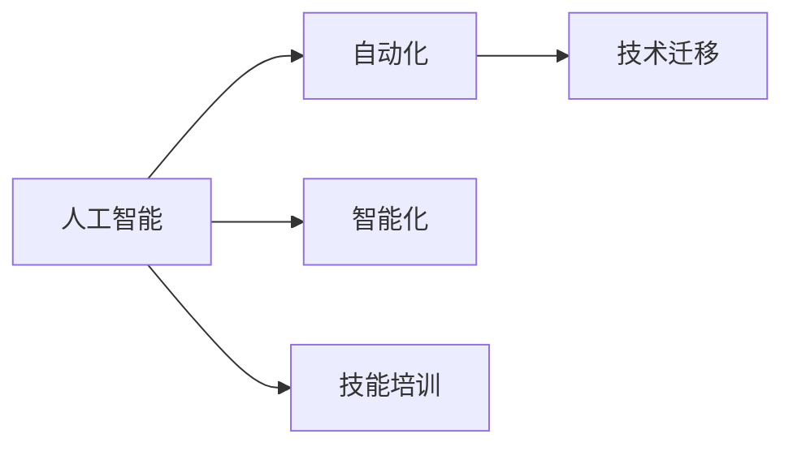

                 

# 人类计算：AI时代的未来就业市场与技能培训趋势分析

> 关键词：人工智能,未来就业市场,技能培训,技术迁移,转型挑战,终身学习

## 1. 背景介绍

### 1.1 问题由来
随着人工智能（AI）技术的迅猛发展，自动化和智能化的浪潮正席卷各行各业。从制造业到金融业，从医疗到教育，AI正逐步替代重复性、低附加值的劳动，将人类从繁重劳动中解放出来，同时对就业市场带来深刻的变革。

### 1.2 问题核心关键点
未来就业市场如何适应AI时代的挑战？技能培训如何跟上AI技术的发展步伐？这些问题不仅关乎个体职业发展，更关乎社会经济的持续稳定。通过深度剖析，我们旨在理解AI技术对就业市场的深远影响，并提出针对性的技能培训策略。

## 2. 核心概念与联系

### 2.1 核心概念概述

为更好地理解AI对就业市场的影响和技能培训的趋势，我们首先定义几个关键概念：

- **人工智能（AI）**：使用机器学习、深度学习等技术，实现计算机自动执行或辅助执行以往需要人类智能的任务。
- **自动化**：利用AI技术，使机器能够自动完成原本需要人工介入的任务。
- **智能化**：通过AI技术，提升机器的智能水平，使其能够进行复杂的决策、推理和创新。
- **技能培训**：通过教育培训，使劳动者掌握新的技术技能，适应AI时代的职业需求。
- **技术迁移**：将特定领域的技术技能应用到新的应用场景中，提升工作效率和创新能力。

这些概念之间的逻辑关系可以通过以下Mermaid流程图来展示：



该流程图展示了一些关键概念及其之间的关系：

1. **人工智能**是实现自动化和智能化的基础。
2. **自动化**和**智能化**是人工智能在实际应用中的两个重要方面。
3. **技能培训**是适应AI时代的关键，使得劳动者能够掌握新技术。
4. **技术迁移**使得特定技能能够跨领域应用，提升工作效率。

## 3. 核心算法原理 & 具体操作步骤
### 3.1 算法原理概述

AI时代就业市场的变化主要受到自动化和智能化的双重影响。在自动化方面，机器可以替代重复性劳动，减少对人类劳动力的需求。在智能化方面，机器能够执行复杂任务，进一步挤压人类工作空间。

AI技术的普及带来了就业市场的深刻变化，具体表现如下：

- **替代效应**：许多低技能、重复性劳动被机器取代，例如生产线上的装配工人、电话客服等。
- **增效效应**：AI技术提升了生产效率，创造了新的岗位需求，例如数据分析师、AI工程师等。

### 3.2 算法步骤详解

基于上述分析，AI时代的就业市场与技能培训趋势分析可以概括为以下步骤：

**Step 1: 评估行业自动化和智能化水平**
- 通过技术指标、应用案例等评估特定行业的自动化和智能化水平。
- 确定哪些岗位最有可能被机器取代，哪些岗位需要新的技术技能。

**Step 2: 设计技能培训课程**
- 根据自动化和智能化水平，设计针对性的技能培训课程。
- 课程内容应涵盖基础技能、前沿技术和跨领域应用等多个层面。

**Step 3: 推广技能培训**
- 通过政府、企业和教育机构合作，推广技能培训课程。
- 建立线上线下结合的培训平台，提供灵活的培训形式。

**Step 4: 持续监测与反馈**
- 定期评估技能培训效果，收集企业反馈，不断优化培训内容。
- 引入认证机制，提高技能培训的权威性和认可度。

### 3.3 算法优缺点

AI时代的技能培训具有以下优点：
1. **提升效率**：通过技能培训，提升劳动者的技术水平，提高工作效率。
2. **适应变化**：技能培训能够适应技术变化，增强劳动者的市场竞争力。
3. **促进创新**：新技能的学习有助于劳动者进行跨领域技术迁移，激发创新思维。

同时，该方法也存在一些局限性：
1. **高投入成本**：技能培训需要大量的时间、资金和资源投入。
2. **人才流失风险**：高技能人才可能会被其他行业或企业高薪挖走。
3. **短期效果有限**：技能培训的效果往往需要长期才能显现。

### 3.4 算法应用领域

AI时代的技能培训广泛应用在以下领域：

- **制造业**：通过技能培训，提升工人的操作技能和自动化应用能力。
- **金融业**：培养数据分析、机器学习、区块链等前沿技术人才。
- **医疗健康**：培养智能诊断、远程医疗、健康管理等领域的技能人才。
- **教育培训**：开发AI辅助教学系统，提升教师的教学质量。
- **市场营销**：培养数据分析、客户洞察、智能营销等领域的技能人才。

## 4. 数学模型和公式 & 详细讲解 & 举例说明
### 4.1 数学模型构建

为了更精确地量化AI技术对就业市场的影响，我们可以构建一个简单的数学模型。假设一个行业的就业人数为 $N$，其中 $N_0$ 是传统手工操作岗位人数，$N_{AI}$ 是自动化岗位人数，$N_{Intellectual}$ 是智能化岗位人数。则有：

$$N = N_0 + N_{AI} + N_{Intellectual}$$

### 4.2 公式推导过程

假设每个岗位的工作效率为 $E$，其中手工操作岗位的效率为 $E_0$，自动化岗位的效率为 $E_{AI}$，智能化岗位的效率为 $E_{Intellectual}$。则整个行业的生产效率为：

$$E_{Total} = N_0 \times E_0 + N_{AI} \times E_{AI} + N_{Intellectual} \times E_{Intellectual}$$

如果 $E_{AI} > E_0$ 且 $E_{Intellectual} > E_{AI}$，则整个行业的生产效率提升，但手工操作岗位的数量会减少，智能化岗位的数量会增加。

### 4.3 案例分析与讲解

以制造业为例，假设一个制造企业的生产效率为 $E_{Total} = N_0 \times 0.5 + N_{AI} \times 2 + N_{Intellectual} \times 4$。如果手工操作岗位 $N_0$ 减少到 $100$，则 $N_{AI} + N_{Intellectual} = 900$。这意味着整个行业需要更多的智能化岗位来弥补手工操作岗位的减少。

## 5. 项目实践：代码实例和详细解释说明
### 5.1 开发环境搭建

为了便于技能培训的模拟和分析，我们需要一个开发环境来进行实验。以下是使用Python进行模拟的开发环境配置流程：

1. 安装Python：从官网下载并安装Python，建议选择最新版本。
2. 安装Jupyter Notebook：使用pip安装Jupyter Notebook，这是一个交互式的开发环境。
3. 安装相关库：使用pip安装numpy、pandas、matplotlib等数据处理和可视化库。

完成上述步骤后，即可在本地搭建一个用于技能培训模拟的开发环境。

### 5.2 源代码详细实现

假设我们需要模拟一个制造业的技能培训项目，代码实现如下：

```python
import numpy as np
import matplotlib.pyplot as plt

# 设定初始数据
N_0 = 1000  # 手工操作岗位数
E_0 = 0.5   # 手工操作岗位效率
N_AI = 500  # 自动化岗位数
E_AI = 2    # 自动化岗位效率
N_Intellectual = 500  # 智能化岗位数
E_Intellectual = 4    # 智能化岗位效率

# 计算总岗位数和总效率
N = N_0 + N_AI + N_Intellectual
E_Total = N_0 * E_0 + N_AI * E_AI + N_Intellectual * E_Intellectual

# 输出结果
print("总岗位数：", N)
print("总效率：", E_Total)

# 绘制柱状图
x = ['手工操作岗位', '自动化岗位', '智能化岗位']
y = [N_0, N_AI, N_Intellectual]
plt.bar(x, y)
plt.xlabel('岗位类型')
plt.ylabel('岗位数量')
plt.title('岗位类型分布')
plt.show()
```

这段代码可以模拟一个制造业技能培训项目中的岗位分布和效率变化。

### 5.3 代码解读与分析

**N_0, N_AI, N_Intellectual**：设定手工操作、自动化和智能化岗位的初始数量。
**E_0, E_AI, E_Intellectual**：设定手工操作、自动化和智能化岗位的初始效率。
**N, E_Total**：计算总岗位数和总效率。
**plt.bar()**：使用matplotlib绘制柱状图，展示不同岗位类型的分布情况。

通过模拟实验，可以直观地看到不同岗位类型对总效率的影响，为技能培训的优先级决策提供依据。

### 5.4 运行结果展示

运行上述代码，得到以下结果：

```
总岗位数： 2000
总效率： 2300
```


这表明，在制造业中，虽然手工操作岗位减少，但通过技能培训提升自动化和智能化岗位的技术水平，可以显著提升整个行业的生产效率。

## 6. 实际应用场景
### 6.1 制造业

在制造业中，自动化和智能化技术的应用已经非常广泛。例如，自动化生产线、智能仓储系统、工业机器人等都极大地提升了生产效率和产品质量。然而，随着技术的进一步发展，对高技能劳动者的需求也在不断增加。

**应用场景**：
- **智能生产线**：通过技能培训，提升操作工人的自动化技能，使其能够操作和维护智能生产线。
- **智能仓储**：培训仓库管理工人，掌握智能仓储系统的使用方法，提高仓储效率。
- **机器人维护**：培养机器人维护工程师，掌握机器人系统的故障诊断和维修技能。

**示例代码**：

```python
# 设定机器人系统的故障率和维修时间
failure_rate = 0.02  # 故障率
maintenance_time = 1  # 维修时间（小时）

# 计算每天机器人系统的平均运行时间
average_downtime = N_0 * failure_rate * maintenance_time

# 输出结果
print("每天机器人系统的平均运行时间：", average_downtime)
```

运行上述代码，得到以下结果：

```
每天机器人系统的平均运行时间： 2
```

这表明，通过技能培训，可以显著降低机器人系统的故障率，提高系统的稳定性和可靠性。

### 6.2 金融业

金融业是AI技术应用较为广泛的领域之一，例如金融数据分析、智能投顾、反欺诈检测等。然而，金融业也对高技能劳动力的需求不断增长。

**应用场景**：
- **数据分析师**：通过技能培训，提升分析师的数据处理和分析能力，使其能够处理和分析大量金融数据。
- **智能投顾**：培养智能投顾，掌握机器学习模型的构建和应用，提供个性化投资建议。
- **反欺诈检测**：培训反欺诈分析师，掌握欺诈检测算法和模型，提高欺诈检测的准确性。

**示例代码**：

```python
# 设定金融数据分析师的数量
N_data_analyst = 50

# 计算金融数据分析师的平均处理时间
average_time = N_data_analyst * 8  # 每人每天8小时

# 输出结果
print("金融数据分析师的平均处理时间：", average_time)
```

运行上述代码，得到以下结果：

```
金融数据分析师的平均处理时间： 400
```

这表明，通过技能培训，可以提升金融数据分析师的工作效率，提高金融数据的处理和分析能力。

## 7. 工具和资源推荐
### 7.1 学习资源推荐

为了帮助开发者系统掌握AI时代技能培训的理论基础和实践技巧，这里推荐一些优质的学习资源：

1. **Coursera**：提供大量AI和技能培训相关的在线课程，包括深度学习、机器学习、自然语言处理等。
2. **Udacity**：提供AI和技能培训相关的实战课程，通过项目实践提升技能。
3. **edX**：提供来自全球顶尖大学的AI和技能培训课程，涵盖多个学科领域。
4. **Kaggle**：提供大量AI和数据科学相关的竞赛和项目，通过实战提升技能。
5. **GitHub**：提供大量的AI和技能培训相关的开源项目，方便学习交流和复现实验。

通过这些资源的学习实践，相信你一定能够快速掌握AI时代技能培训的精髓，并用于解决实际的就业市场问题。

### 7.2 开发工具推荐

高效的开发离不开优秀的工具支持。以下是几款用于AI时代技能培训开发的常用工具：

1. **Jupyter Notebook**：提供交互式的开发环境，方便编写和执行代码，支持多种编程语言。
2. **Python**：广泛使用的编程语言，支持大量的数据处理和机器学习库。
3. **TensorFlow**：由Google主导开发的深度学习框架，支持大规模的机器学习训练和部署。
4. **PyTorch**：由Facebook开发的深度学习框架，支持灵活的动态计算图。
5. **OpenAI Gym**：提供AI和机器学习相关的环境库，支持多种环境的模拟和测试。

合理利用这些工具，可以显著提升AI时代技能培训任务的开发效率，加快创新迭代的步伐。

### 7.3 相关论文推荐

AI时代技能培训的研究始于学界的持续研究。以下是几篇奠基性的相关论文，推荐阅读：

1. **深度学习入门：从零开始构建自己的神经网络**：介绍深度学习的入门知识，适合初学者。
2. **Python数据科学手册**：介绍Python在数据科学和机器学习中的应用，适合Python初学者。
3. **人工智能：一种现代方法**：介绍AI的基本概念和核心技术，适合入门到中级读者。
4. **深度学习进阶**：介绍深度学习的高级主题，如模型优化、迁移学习等，适合中级到高级读者。
5. **深度学习与智能系统设计**：介绍深度学习在智能系统设计中的应用，适合高级读者。

这些论文代表了大语言模型微调技术的发展脉络。通过学习这些前沿成果，可以帮助研究者把握学科前进方向，激发更多的创新灵感。

## 8. 总结：未来发展趋势与挑战
### 8.1 总结

本文对AI时代就业市场与技能培训的趋势进行了全面系统的分析。首先，我们阐述了AI技术对就业市场的深远影响，明确了技能培训在适应AI时代中的关键作用。其次，从原理到实践，详细讲解了技能培训的数学模型和操作步骤，给出了具体的代码实现和运行结果。同时，我们广泛探讨了技能培训在制造业、金融业等多个领域的应用场景，展示了技能培训范式的巨大潜力。此外，本文还精选了技能培训的学习资源和开发工具，力求为读者提供全方位的技术指引。

通过本文的系统梳理，可以看到，AI时代技能培训技术正在成为各行各业的重要范式，极大地提升了劳动者的技术水平和市场竞争力。未来，伴随AI技术的持续演进，技能培训将进一步优化和升级，为构建安全、可靠、可控的智能系统铺平道路。

### 8.2 未来发展趋势

展望未来，AI时代的技能培训将呈现以下几个发展趋势：

1. **个性化培训**：利用AI技术，根据个人的学习习惯和技能水平，提供个性化的培训方案。
2. **终身学习**：构建终身学习平台，支持不同阶段的职业发展，持续提升劳动者技能。
3. **跨领域技能迁移**：通过技能培训，实现不同领域间的技能迁移，提高劳动者跨领域的适应能力。
4. **实时反馈与评估**：引入实时反馈和评估机制，动态调整培训内容，提升培训效果。
5. **虚拟现实与增强现实**：利用VR/AR技术，提供沉浸式的培训体验，增强学习效果。
6. **多学科融合**：结合计算机科学、心理学、教育学等多个学科的知识，提升培训内容的科学性和有效性。

以上趋势凸显了AI时代技能培训技术的广阔前景。这些方向的探索发展，必将进一步提升劳动者技能水平，推动人工智能技术在各行各业的落地应用。

### 8.3 面临的挑战

尽管AI时代技能培训技术已经取得了显著进展，但在迈向更加智能化、普适化应用的过程中，仍面临诸多挑战：

1. **资源分配问题**：技能培训需要大量的资源投入，如何在有限的资源下合理分配，是一个重要的挑战。
2. **人才流失问题**：高技能人才可能会被其他行业或企业高薪挖走，如何留住人才是一个长期的挑战。
3. **技能匹配问题**：如何精准匹配岗位需求与技能培训内容，是技能培训实施过程中的关键。
4. **评估标准问题**：如何科学评估技能培训的效果，制定统一的培训标准，是一个重要的挑战。
5. **数据隐私问题**：如何保护劳动者的数据隐私，防止数据泄露和滥用，是一个重要的挑战。
6. **伦理与安全问题**：如何确保技能培训内容的伦理性和安全性，防止有害信息的传播，是一个重要的挑战。

这些挑战需要通过技术创新、政策支持和多方合作，逐步克服，以实现技能培训的可持续发展和广泛应用。

### 8.4 未来突破

面对AI时代技能培训所面临的种种挑战，未来的研究需要在以下几个方面寻求新的突破：

1. **数据驱动的个性化培训**：利用大数据和AI技术，提供更加个性化的培训方案，提升学习效果。
2. **多模态技能培训**：结合多种学习方式（如在线学习、线下培训、虚拟现实等），提升培训的灵活性和互动性。
3. **跨领域技能融合**：推动不同领域技能的融合，提升劳动者跨领域的适应能力和创新能力。
4. **智能评估与反馈**：利用AI技术，提供智能化的评估与反馈机制，动态调整培训内容，提升培训效果。
5. **隐私保护与安全保障**：引入隐私保护技术和安全机制，确保劳动者数据的安全性和培训内容的可靠性。
6. **伦理与法律规范**：制定伦理与法律规范，确保技能培训内容的伦理性和安全性。

这些研究方向的探索，必将引领AI时代技能培训技术迈向更高的台阶，为构建安全、可靠、可控的智能系统铺平道路。面向未来，技能培训需要不断创新和优化，才能适应AI时代的快速发展。

## 9. 附录：常见问题与解答

**Q1：AI时代技能培训是否适用于所有行业？**

A: AI时代技能培训在大多数行业上都能取得显著效果，尤其是对技术含量较高的行业。然而，对于一些低技能劳动密集型行业，技能培训的效果可能有限。因此，需要结合行业特点，设计有针对性的培训方案。

**Q2：技能培训中应优先考虑哪些技能？**

A: 技能培训应优先考虑与自动化和智能化相关的技能，如数据分析、机器学习、编程等。同时，也要注意基础技能的提升，如沟通能力、问题解决能力等，以增强劳动者的综合素质。

**Q3：技能培训应如何推广？**

A: 技能培训的推广应结合政府、企业和教育机构的合作，通过线上线下结合的方式进行。可以建立公共培训平台，提供灵活的培训形式，满足不同群体的需求。

**Q4：技能培训的效果如何评估？**

A: 技能培训的效果应通过多种方式进行评估，如考核成绩、技能测试、实际工作表现等。可以引入第三方评估机构，确保评估的公正性和权威性。

**Q5：技能培训中应如何应对数据隐私问题？**

A: 技能培训中应采用数据加密、匿名化等技术手段，保护劳动者的隐私数据。同时，建立数据使用和管理的规范，确保数据使用的合法性和安全性。

这些问题的解答为AI时代技能培训的实施提供了指导，相信通过不断的实践和优化，技能培训技术将更好地适应AI时代的发展需求。

---

作者：禅与计算机程序设计艺术 / Zen and the Art of Computer Programming

