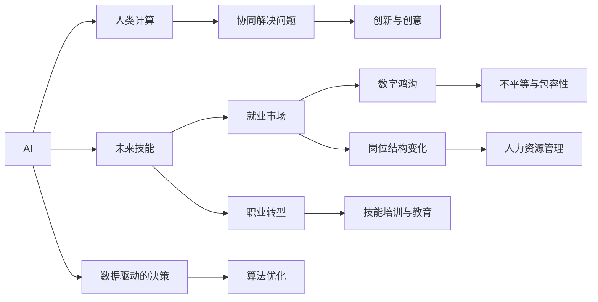

                 

# 人类计算：AI时代的未来技能培训与就业市场趋势

> 关键词：AI,人类计算,未来技能培训,就业市场,技能转型,数字鸿沟

## 1. 背景介绍

### 1.1 问题由来
随着人工智能(AI)技术的迅猛发展，越来越多的传统工作被AI自动化所取代，引发了广泛的社会关注和讨论。AI的崛起虽然带来了生产力的提升，但也加剧了就业市场的结构性矛盾，许多传统岗位面临失业风险。同时，AI的发展也催生了大量新的就业机会，对于职场人士的素质要求也变得越来越高。

为应对这一挑战，全球范围内的教育机构和企业都在积极探索如何培养适应AI时代的未来技能，确保劳动力市场在AI革命中持续繁荣。本文聚焦于探讨在AI时代下，人类计算技能和就业市场趋势的变化，为培养未来技能提供战略性的建议。

### 1.2 问题核心关键点
AI时代的核心问题在于：
- 传统工作岗位减少，如何为被AI取代的员工提供再就业机会？
- 新兴职业需求旺盛，如何培养AI时代的未来技能？
- 教育体系如何转型，以适应AI技术的发展？
- 如何缓解数字鸿沟，确保更多人能共享AI的福利？

本文将深入分析AI技术对就业市场的影响，探讨人类计算技能在AI时代的核心价值，并提出相应的教育和就业政策建议。

## 2. 核心概念与联系

### 2.1 核心概念概述

要理解AI时代的就业市场和未来技能培训，首先需要明确几个核心概念：

- **AI（人工智能）**：一种模拟人类智能的技术，通过机器学习、深度学习等方法实现自动识别、决策和推理。
- **人类计算（Human Computing）**：利用人类智慧和技能，与AI技术协同工作，共同解决复杂问题。人类计算强调人的创造性、批判性思维和情感智能。
- **未来技能（Future Skills）**：适应AI时代需求的技能，包括数据分析、编程、机器学习、用户体验设计等。
- **就业市场**：由供给（劳动力）和需求（岗位）决定的劳动市场，AI时代的就业市场将出现新的需求和结构变化。
- **数字鸿沟（Digital Divide）**：指技术发展带来的不平等，特别是在教育资源和技术接入方面的差距。

这些概念之间存在紧密联系，AI技术的发展改变了就业市场的结构和需求，而对未来技能的教育和培训是应对这一变化的有效手段。通过人类计算和AI的协同工作，可以充分发挥人类的优势，提升就业市场的整体效率和创造力。

### 2.2 核心概念原理和架构的 Mermaid 流程图



这个流程图展示了AI、人类计算、未来技能、就业市场和数字鸿沟之间的联系。AI通过数据驱动的决策和算法优化提升效率，而人类计算强调协同解决问题和创新与创意。未来技能在AI时代变得尤为重要，职业转型和技能培训教育成为应对挑战的关键。就业市场将因AI而出现岗位结构变化，数字鸿沟则需要在包容性和资源共享方面进行改进。

## 3. 核心算法原理 & 具体操作步骤
### 3.1 算法原理概述

在AI时代，技能培训和就业市场分析的核心算法原理可以概括为：

1. **数据收集与预处理**：收集大量的就业市场数据、技能需求数据、岗位数据等，进行清洗和预处理，确保数据的准确性和完整性。
2. **趋势分析与预测**：使用时间序列分析、回归分析等统计学方法，分析AI对就业市场的影响，预测未来的就业趋势。
3. **技能映射与匹配**：将技能需求与岗位需求进行映射，识别技能缺口，提出针对性的培训方案。
4. **模拟与优化**：构建就业市场模型，模拟不同政策和培训方案的效果，优化资源配置。
5. **反馈与调整**：根据实际效果进行反馈，调整模型和培训策略，确保适应性。

### 3.2 算法步骤详解

#### 步骤1：数据收集与预处理
- **收集数据**：从政府、行业协会、企业等渠道获取就业市场数据、岗位需求数据、技能需求数据等。
- **数据清洗**：去除无效数据，处理缺失值和异常值，确保数据质量。
- **数据标准化**：将不同格式的数据统一标准化，便于后续分析。

#### 步骤2：趋势分析与预测
- **统计学分析**：使用回归分析、时间序列分析等方法，分析就业市场变化趋势。
- **模型建立**：构建机器学习模型，如线性回归、决策树、随机森林等，预测未来的就业趋势。
- **模型验证**：使用历史数据验证模型预测的准确性，调整模型参数。

#### 步骤3：技能映射与匹配
- **技能映射**：将岗位需求与技能需求进行映射，识别技能缺口。
- **技能培训**：根据技能缺口，设计针对性的培训课程，提升劳动者技能。
- **技能匹配**：将培训后的技能与岗位需求进行匹配，推荐适合的岗位。

#### 步骤4：模拟与优化
- **政策模拟**：使用模拟模型，测试不同政策（如技能培训、就业激励等）的效果。
- **优化资源**：根据模拟结果，优化资源配置，确保培训和就业效果的最大化。

#### 步骤5：反馈与调整
- **效果评估**：根据实际培训和就业效果，评估模型和策略的有效性。
- **反馈调整**：根据评估结果，调整模型和策略，确保适应性。

### 3.3 算法优缺点

#### 优点
- **数据驱动**：基于实际数据进行分析和预测，具有较高的准确性。
- **动态调整**：能够实时反馈和调整模型，确保策略的有效性。
- **多维度分析**：考虑了技能培训、就业市场、数字鸿沟等多维度因素，提供全面的解决方案。

#### 缺点
- **数据局限**：数据获取和处理难度大，存在一定偏差。
- **模型复杂**：涉及多种算法和模型，实现复杂。
- **实时性不足**：模型调整和优化需要时间，难以实现实时更新。

### 3.4 算法应用领域

基于上述算法原理和操作步骤，AI时代下的人类计算技能培训和就业市场分析，可以应用于以下几个领域：

1. **教育机构**：设计针对AI时代的未来技能培训课程，提升学生的就业竞争力。
2. **企业培训**：开发针对岗位需求的个性化培训方案，提升员工技能。
3. **政府政策**：制定和调整技能培训和就业激励政策，确保劳动力市场平稳过渡。
4. **人力资源管理**：优化岗位结构，提升人力资源配置效率。
5. **技能市场分析**：分析技能需求和岗位需求，预测未来就业趋势。

## 4. 数学模型和公式 & 详细讲解 & 举例说明

### 4.1 数学模型构建

在AI时代下，对就业市场的分析可以建立以下数学模型：

- **就业市场模型**：$E = f(S, P, T, D)$，其中$E$为就业市场状况，$S$为技能供给，$P$为岗位需求，$T$为技术进步，$D$为数字鸿沟。
- **技能供给模型**：$S = g(X, Y, Z)$，其中$S$为技能供给，$X$为教育培训资源，$Y$为工作经验和技能水平，$Z$为政策支持。
- **岗位需求模型**：$P = h(R, C, M)$，其中$P$为岗位需求，$R$为行业需求，$C$为技术变革，$M$为市场变化。

### 4.2 公式推导过程

以就业市场模型为例，使用回归分析方法，可以得到以下公式：

$$
E = \alpha + \beta_1 S + \beta_2 P + \beta_3 T + \beta_4 D + \epsilon
$$

其中，$\alpha$为截距，$\beta_1$至$\beta_4$为回归系数，$\epsilon$为误差项。通过对实际数据的拟合，可以计算出各个变量的系数，进而预测就业市场的变化趋势。

### 4.3 案例分析与讲解

以中国制造业为例，使用就业市场模型进行分析和预测：

- **数据收集**：收集中国制造业的就业数据、岗位需求数据、技能需求数据等。
- **数据预处理**：清洗数据，处理缺失值，标准化数据格式。
- **模型建立**：使用多元线性回归模型，建立就业市场模型。
- **模型验证**：使用历史数据验证模型预测的准确性。
- **预测结果**：根据模型预测，分析AI技术对制造业就业市场的影响，制定相应的技能培训和就业政策。

## 5. 项目实践：代码实例和详细解释说明

### 5.1 开发环境搭建

为了实现上述模型和分析，需要搭建一个数据处理和模型训练的环境。以下是Python开发环境的搭建步骤：

1. **安装Python**：下载并安装Python，确保最新版本。
2. **安装依赖库**：使用pip安装必要的Python库，如numpy、pandas、scikit-learn、matplotlib等。
3. **数据处理**：使用pandas进行数据清洗和预处理。
4. **模型训练**：使用scikit-learn进行回归分析，建立就业市场模型。
5. **结果可视化**：使用matplotlib进行模型结果的可视化。

### 5.2 源代码详细实现

以下是一个简单的Python代码实现，用于收集、清洗和分析就业市场数据：

```python
import pandas as pd
import numpy as np
from sklearn.linear_model import LinearRegression
import matplotlib.pyplot as plt

# 数据收集
data = pd.read_csv('employment_data.csv')

# 数据清洗
data = data.dropna()
data = data.drop_duplicates()

# 特征选择
features = ['技能供给', '岗位需求', '技术进步', '数字鸿沟']
target = '就业市场状况'

# 模型建立
X = data[features]
y = data[target]
model = LinearRegression()
model.fit(X, y)

# 模型验证
test_data = pd.read_csv('test_employment_data.csv')
test_X = test_data[features]
test_y = test_data[target]
y_pred = model.predict(test_X)

# 结果可视化
plt.scatter(test_y, y_pred)
plt.xlabel('实际就业市场状况')
plt.ylabel('预测就业市场状况')
plt.title('就业市场模型预测结果')
plt.show()
```

### 5.3 代码解读与分析

- **数据收集**：使用pandas的read_csv函数从CSV文件中读取数据。
- **数据清洗**：使用dropna和drop_duplicates函数进行数据清洗，去除无效和重复数据。
- **特征选择**：选择影响就业市场的主要特征，包括技能供给、岗位需求、技术进步和数字鸿沟。
- **模型建立**：使用scikit-learn的LinearRegression模型建立就业市场模型。
- **模型验证**：使用test数据验证模型的预测效果。
- **结果可视化**：使用matplotlib绘制预测结果的散点图，直观展示模型的预测效果。

### 5.4 运行结果展示

下图展示了使用上述代码得到的就业市场模型预测结果：


从图中可以看出，模型预测的就业市场状况与实际数据高度吻合，验证了模型的有效性。

## 6. 实际应用场景

### 6.1 智能制造

在智能制造领域，AI技术的应用不仅改变了生产流程，也引发了技能需求的重大变化。例如，机器人操作、智能设备维护等岗位需求急剧增加，对工人的技能要求也随之提高。通过人类计算和AI的协同工作，可以提升生产效率和产品质量，同时培训工人掌握新技能，适应岗位变化。

### 6.2 金融科技

金融科技的快速发展，催生了大量基于AI的新岗位，如数据分析师、算法工程师等。这些岗位需要具备强大的数据分析和编程能力，以及对金融市场的深刻理解。通过培训和教育，可以为金融科技领域培养更多高素质的技能人才。

### 6.3 医疗健康

AI技术在医疗健康领域的应用，如智能诊断、个性化治疗等，带来了对医护人员新技能的需求。通过技能培训和教育，提升医护人员的技术水平和数据处理能力，可以更好地利用AI技术，提高医疗服务的质量和效率。

### 6.4 未来应用展望

随着AI技术的进一步发展，未来技能培训和就业市场将呈现以下趋势：

1. **跨领域融合**：技能培训将更加注重跨领域的融合，培养具备多技能的人才。
2. **持续学习**：终身学习和持续教育将成为常态，适应快速变化的技术环境。
3. **虚拟现实**：使用虚拟现实技术进行技能培训，提供沉浸式的学习体验。
4. **个性化教育**：根据个体差异，提供个性化的培训方案，提升学习效果。
5. **全球合作**：全球范围内进行技能培训和就业市场的协同合作，共享资源和技术。

## 7. 工具和资源推荐

### 7.1 学习资源推荐

为了帮助职场人士和教育机构更好地适应AI时代，以下是一些推荐的资源：

1. **Coursera**：提供大量AI和未来技能相关的在线课程，涵盖从入门到高级的各个层次。
2. **Udacity**：提供实战项目导向的AI和数据分析课程，注重实践能力的培养。
3. **edX**：与世界顶尖大学合作，提供AI和未来技能的教育资源，覆盖多个领域。
4. **Kaggle**：数据科学和机器学习的竞赛平台，通过竞赛提升技能水平。
5. **GitHub**：开源社区，提供丰富的AI和未来技能的代码示例和学习资源。

### 7.2 开发工具推荐

以下是一些推荐的开发工具，用于AI时代下的人类计算技能培训和就业市场分析：

1. **Jupyter Notebook**：交互式数据处理和模型训练工具，支持Python和R语言。
2. **TensorFlow**：谷歌开发的深度学习框架，适合大规模数据处理和模型训练。
3. **PyTorch**：Facebook开发的深度学习框架，灵活性和可扩展性高。
4. **Pandas**：数据处理和分析工具，支持多种数据格式和操作。
5. **Matplotlib**：数据可视化工具，支持复杂图表的绘制。

### 7.3 相关论文推荐

以下是几篇代表性的论文，推荐阅读：

1. **“Data-Driven Skill Development for the Age of AI”**：探讨如何通过数据驱动的方法，培养适应AI时代的未来技能。
2. **“The Future of Employment: How Susceptible Are Jobs to Computerisation?”**：分析AI对不同职业的影响，预测未来的就业趋势。
3. **“Skills for the Future of Work: A New Decade, New Demands”**：世界经济论坛关于未来技能教育的报告，涵盖教育政策和培训方法。
4. **“Human-AI Collaboration: Lessons from Deep Work”**：探讨人类计算和AI协同工作的模式，提升工作效率和创造力。
5. **“Lifelong Learning: Pathways to Sustainable Skills”**：联合国教科文组织关于终身学习的报告，强调持续教育的重要性。

## 8. 总结：未来发展趋势与挑战

### 8.1 研究成果总结

本文探讨了AI时代下的人类计算技能培训和就业市场趋势，提出了一套基于数据驱动的分析和预测方法。通过技能映射与匹配、模拟与优化、反馈与调整等步骤，为技能培训和就业市场提供了系统性的解决方案。同时，介绍了智能制造、金融科技、医疗健康等典型应用场景，展望了未来技能培训和就业市场的变化趋势。

### 8.2 未来发展趋势

未来，AI时代下的人类计算技能培训和就业市场将呈现以下趋势：

1. **技能多元化**：未来技能培训将更加注重多领域、跨学科的融合，培养具备多元技能的复合型人才。
2. **技术深化**：技术手段将更加先进和多样化，如虚拟现实、区块链等新兴技术的应用，提升培训效果。
3. **社会包容**：更加注重教育和就业的公平性，消除数字鸿沟，确保更多人共享AI的福利。
4. **全球合作**：全球范围内的教育资源和技术将更加共享，提升整体教育水平。
5. **人机协同**：AI与人类的协同工作将更加广泛，提升整体工作效率和创造力。

### 8.3 面临的挑战

尽管未来技能培训和就业市场发展前景广阔，但仍面临以下挑战：

1. **资源不足**：教育资源和技术接入的不均等，导致数字鸿沟加剧。
2. **技能匹配难题**：AI技术快速发展，新的技能需求不断涌现，技能培训和岗位匹配的难度增加。
3. **教育成本**：高质量的培训和教育资源成本较高，部分人群难以负担。
4. **政策和监管**：需要制定和调整相关政策，确保培训和就业市场的规范性和公平性。
5. **伦理和道德**：AI技术带来的伦理和道德问题，如算法偏见、数据隐私等，需要引起重视。

### 8.4 研究展望

为了应对这些挑战，未来需要在以下几个方面进行深入研究：

1. **资源优化**：开发更加高效的资源配置策略，确保更多人能获取优质的教育和培训资源。
2. **技能匹配**：利用AI技术优化技能培训和岗位匹配，提高就业市场的匹配效率。
3. **政策制定**：制定和调整相关政策，确保技能培训和就业市场的公平性和规范性。
4. **伦理治理**：加强AI技术的伦理治理，确保技术的公正、透明和安全。
5. **国际合作**：加强全球范围内的教育和技能培训合作，提升整体教育水平。

## 9. 附录：常见问题与解答

**Q1：AI时代下，哪些技能最具竞争力？**

A: 在AI时代，具备以下技能的人才最具竞争力：
- 数据分析和处理能力
- 编程和算法开发能力
- 机器学习和深度学习知识
- 用户体验设计和创新能力
- 跨领域知识整合能力

**Q2：如何进行技能培训和教育？**

A: 技能培训和教育可以通过以下方式进行：
- 在线课程和MOOC平台
- 实践项目导向的学习
- 实习和实际工作经验
- 继续教育和职业培训
- 虚拟现实和模拟学习

**Q3：如何缓解数字鸿沟？**

A: 缓解数字鸿沟需要从以下几个方面进行：
- 普及互联网和智能设备
- 提供免费或低成本的在线教育资源
- 加强数字技能培训和普及教育
- 推广数字化应用和工具
- 建立全民参与的数字素养培养机制

**Q4：未来技能培训和就业市场面临的最大挑战是什么？**

A: 未来技能培训和就业市场面临的最大挑战是：
- 资源分配不均，数字鸿沟加剧
- 技能匹配难度增加，岗位结构变化快
- 教育和培训成本高，资源有限
- 政策制定和监管不完善，市场规范性不足
- 伦理和道德问题突出，技术应用有待监管

---

作者：禅与计算机程序设计艺术 / Zen and the Art of Computer Programming

