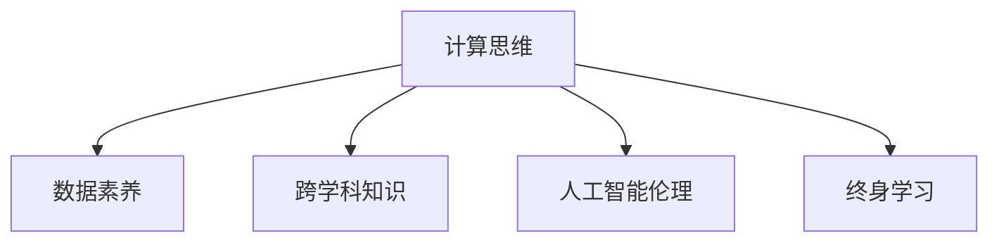

                 

# 人类计算：AI时代的未来技能要求和培训

## 1. 背景介绍

### 1.1 问题由来
人工智能(AI)技术的快速发展正在深刻改变着各行各业，推动了社会向智能化、自动化方向演进。然而，AI的崛起也带来了诸多挑战，特别是在人才技能结构、教育和培训体系方面。人工智能的广泛应用需要大量具备跨学科知识、创新能力、数据素养和伦理道德的复合型人才。如何培养这样的人才，以适应AI时代的未来需求，成为了当前教育和培训领域亟需解决的问题。

### 1.2 问题核心关键点
人类计算，作为AI时代的新兴概念，涉及计算机科学、数据科学、认知科学等多个交叉领域，旨在培养新一代计算思维和人工智能技能。其核心关键点包括：

- **计算思维**：一种解决问题的逻辑框架，强调如何通过算法、数据和编程实现问题求解。
- **数据素养**：能够理解数据、处理数据、分析数据，从而提取有价值的信息和知识。
- **跨学科知识**：具备不同学科的基础知识和研究方法，能够跨领域应用和创新。
- **人工智能伦理**：理解人工智能技术对社会、经济、伦理等方面的影响，具备伦理责任和道德判断。
- **终身学习**：不断更新知识结构，适应快速变化的技术环境。

### 1.3 问题研究意义
人类计算的培养不仅有助于加速AI技术的发展，还能够推动社会和经济的多元化发展，促进知识创新和共享。通过系统的教育和培训，能够培养更多具备AI时代核心技能的人才，推动AI技术在各个行业的广泛应用，提升整体社会的技术水平和创新能力。

## 2. 核心概念与联系

### 2.1 核心概念概述

为更好地理解AI时代对人才的要求，本节将介绍几个密切相关的核心概念：

- **计算思维**：一种基于算法、数据、编程等元素，通过系统化思考和解决问题的思维方式。
- **数据素养**：涉及数据收集、清洗、处理、分析和可视化等技能，能够从中提取有用的信息和洞察。
- **跨学科知识**：涵盖计算机科学、统计学、认知科学、心理学等领域的知识和理论，能够跨领域应用和创新。
- **人工智能伦理**：涉及AI技术的社会、伦理、法律影响，能够在技术应用中考虑伦理道德。
- **终身学习**：强调持续学习和适应变化，不断更新知识和技能，保持与时俱进。

这些核心概念之间的逻辑关系可以通过以下Mermaid流程图来展示：



这个流程图展示的核心概念之间的联系：

1. 计算思维是数据素养的基础，能够指导数据处理和分析的流程。
2. 跨学科知识是计算思维和数据素养的重要补充，提供多角度的视角和理论支持。
3. 人工智能伦理和终身学习是计算思维、数据素养和跨学科知识的重要保障，确保技术应用的道德性和持续性。

## 3. 核心算法原理 & 具体操作步骤
### 3.1 算法原理概述

人类计算的核心算法原理涉及计算机科学、数据科学和认知科学的多个方面。其核心思想是通过算法、数据和编程等工具，培养计算思维和解决问题的能力。以下是几种关键算法的概述：

1. **算法**：如排序、查找、图论等，培养逻辑推理和问题求解能力。
2. **数据处理**：如数据清洗、特征工程、模型训练等，培养数据素养。
3. **编程**：如Python、R、JavaScript等编程语言，培养实际操作和创新能力。
4. **人工智能技术**：如机器学习、深度学习、自然语言处理等，培养技术应用和创新能力。

### 3.2 算法步骤详解

人类计算的教育和培训步骤一般包括以下几个关键环节：

1. **计算思维教育**：通过编程基础、算法设计、问题求解等课程，培养学生的计算思维能力。
2. **数据素养培养**：通过数据处理、数据分析、数据可视化等课程，提升学生的数据素养。
3. **跨学科知识应用**：通过多学科融合的课程，如计算机科学与心理学、认知科学与神经科学等，培养学生的跨学科应用能力。
4. **人工智能伦理教育**：通过AI伦理、法律与社会影响等课程，培养学生的伦理意识和责任感。
5. **终身学习培养**：通过持续教育和在线学习平台，提供灵活的学习资源和工具，帮助学生保持学习和适应变化。

### 3.3 算法优缺点

人类计算的教育和培训方法具有以下优点：

1. **综合性强**：覆盖计算机科学、数据科学、认知科学等多个领域，能够全面提升学生的综合素质。
2. **实践性强**：强调编程和实际操作，培养学生的动手能力和创新能力。
3. **灵活多样**：通过线上线下结合、混合教学等多样化方式，适应不同学生的学习需求。

同时，该方法也存在一定的局限性：

1. **资源要求高**：需要丰富的师资力量、先进的教学设备和多样化的教材资源。
2. **教学难度大**：涉及多学科知识和技能，教师需要具备较高的综合素质和教学经验。
3. **评估复杂**：难以通过单一的考试和测试全面评估学生的综合能力。

尽管存在这些局限性，但就目前而言，人类计算的教育和培训方法仍是大规模培养AI时代复合型人才的重要途径。未来相关研究的重点在于如何进一步优化教学资源、改进评估体系，同时兼顾课程的深度和广度，以培养更多具备核心技能的人才。

### 3.4 算法应用领域

人类计算的教育和培训方法已经在诸多领域得到了广泛应用，包括但不限于：

1. **计算机科学与工程**：培养具备计算思维和编程能力的专业人才，推动软件工程和系统设计。
2. **数据科学与分析**：提升数据处理和分析能力，培养具备数据素养的数据科学家和分析师。
3. **人工智能与机器学习**：结合计算思维和数据素养，培养具备AI技术应用和创新能力的人才。
4. **认知科学与心理学**：通过跨学科知识的应用，培养具备综合认知能力和心理学知识的复合型人才。
5. **社会与伦理**：提升人工智能伦理意识，培养具备伦理责任和社会责任感的未来领导者。

## 4. 数学模型和公式 & 详细讲解 & 举例说明

### 4.1 数学模型构建

人类计算的数学模型构建涉及多个领域的理论基础，包括计算机科学、数据科学、认知科学等。以下是几个典型的数学模型构建案例：

1. **排序算法**：如快速排序、归并排序等，基于比较和交换操作，构建数据结构的排序模型。
2. **数据清洗模型**：如缺失值处理、异常值检测等，基于统计和机器学习的方法，构建数据预处理的模型。
3. **机器学习模型**：如线性回归、决策树、神经网络等，基于数学和统计学的理论，构建模型的训练和预测模型。

### 4.2 公式推导过程

以线性回归模型为例，其公式推导过程如下：

假设有一个数据集 $(x_i,y_i)$，其中 $x$ 为自变量，$y$ 为因变量，$n$ 为样本数，目标是找到一条直线 $y = \theta_0 + \theta_1x$，使得所有样本的预测值与真实值的误差最小。

设误差函数为 $J(\theta) = \frac{1}{2n} \sum_{i=1}^n (y_i - (\theta_0 + \theta_1x_i))^2$，通过梯度下降等优化算法最小化误差函数，求解最优参数 $\theta_0$ 和 $\theta_1$。

推导过程如下：

$$
\frac{\partial J(\theta)}{\partial \theta_0} = -\frac{1}{n} \sum_{i=1}^n (y_i - (\theta_0 + \theta_1x_i))
$$

$$
\frac{\partial J(\theta)}{\partial \theta_1} = -\frac{1}{n} \sum_{i=1}^n (y_i - (\theta_0 + \theta_1x_i))x_i
$$

求解上述两个偏导数等于0的方程，得到：

$$
\theta_0 = \bar{y} - \theta_1\bar{x}
$$

$$
\theta_1 = \frac{n\sum_{i=1}^n x_iy_i - \sum_{i=1}^n x_i\bar{y}}{n\sum_{i=1}^n x_i^2 - (\sum_{i=1}^n x_i)^2}
$$

其中，$\bar{x} = \frac{1}{n} \sum_{i=1}^n x_i$，$\bar{y} = \frac{1}{n} \sum_{i=1}^n y_i$。

### 4.3 案例分析与讲解

以线性回归模型的应用为例，分析其在实际场景中的应用和优化：

假设有一个房价预测问题，已知房屋的面积和价格数据。使用线性回归模型预测新的房屋价格，需要如下步骤：

1. **数据预处理**：对房屋面积数据进行归一化处理，去掉异常值。
2. **模型构建**：使用线性回归模型，拟合数据集。
3. **参数优化**：使用梯度下降等优化算法，最小化误差函数，得到最优参数。
4. **模型评估**：使用交叉验证等方法，评估模型预测的准确性。
5. **模型应用**：使用模型对新的房屋面积数据进行预测，得到相应的房价。

## 5. 项目实践：代码实例和详细解释说明

### 5.1 开发环境搭建

在进行人类计算项目实践前，需要先搭建好开发环境。以下是使用Python进行项目开发的流程：

1. 安装Anaconda：从官网下载并安装Anaconda，用于创建独立的Python环境。

2. 创建并激活虚拟环境：
```bash
conda create -n human-computing python=3.8 
conda activate human-computing
```

3. 安装必要的工具包：
```bash
pip install numpy pandas matplotlib scikit-learn tensorflow
```

4. 安装在线学习平台：
```bash
pip install jupyter notebook
```

完成上述步骤后，即可在`human-computing`环境中开始项目开发。

### 5.2 源代码详细实现

以下是一个简单的Python代码实现线性回归模型的例子：

```python
import numpy as np
from sklearn.linear_model import LinearRegression
from sklearn.model_selection import train_test_split
import matplotlib.pyplot as plt

# 生成数据集
np.random.seed(0)
X = np.random.randn(100, 1)
y = 0.5 * X + np.random.randn(100, 1) + 1

# 分割训练集和测试集
X_train, X_test, y_train, y_test = train_test_split(X, y, test_size=0.2)

# 训练模型
model = LinearRegression()
model.fit(X_train, y_train)

# 预测
y_pred = model.predict(X_test)

# 评估模型
print("R-squared:", model.score(X_test, y_test))

# 可视化结果
plt.scatter(X_test, y_test)
plt.plot(X_test, y_pred, color='red')
plt.show()
```

### 5.3 代码解读与分析

让我们再详细解读一下关键代码的实现细节：

**线性回归模型**：
- 使用Scikit-learn库中的LinearRegression类构建线性回归模型。
- 通过train_test_split函数将数据集划分为训练集和测试集。
- 使用fit方法训练模型，通过.score方法评估模型性能。
- 使用matplotlib库绘制模型预测结果与真实值的散点图。

**代码实现步骤**：
1. **数据生成**：使用numpy库生成随机数据集。
2. **模型训练**：使用train_test_split函数将数据集划分为训练集和测试集。
3. **模型拟合**：使用fit方法训练线性回归模型。
4. **模型评估**：使用.score方法计算模型在测试集上的R-squared值。
5. **可视化结果**：使用matplotlib库可视化模型预测结果与真实值的关系。

**代码分析**：
- 数据生成部分：使用numpy库生成100个样本的随机数据，其中X为输入特征，y为输出标签。
- 模型训练部分：使用train_test_split函数将数据集划分为80%的训练集和20%的测试集。
- 模型拟合部分：使用LinearRegression类拟合训练集，得到线性回归模型。
- 模型评估部分：使用.score方法计算模型在测试集上的R-squared值，评估模型性能。
- 可视化结果部分：使用matplotlib库绘制模型预测结果与真实值的散点图，直观展示模型效果。

通过以上步骤，我们完成了线性回归模型的Python实现，并对其进行了分析和评估。这个例子展示了如何使用Python和Scikit-learn库进行简单的数据处理和模型构建。

## 6. 实际应用场景

### 6.1 智能制造

人工智能在智能制造领域的应用，需要具备跨学科知识和计算思维能力的复合型人才。智能制造涉及到工业机器人、物联网、大数据等多个领域，需要具备计算思维能力的数据科学家，能够处理大规模工业数据，优化生产流程，提升生产效率。

具体实现时，可以结合人工智能技术，如机器学习、深度学习等，进行设备预测性维护、质量检测、故障诊断等任务。通过将人类计算和人工智能技术相结合，智能制造将实现更高效、更灵活的生产模式。

### 6.2 智慧医疗

智慧医疗的发展需要具备跨学科知识和计算思维能力的人才，能够将人工智能技术应用于医疗数据处理、疾病预测、个性化治疗等领域。通过人类计算教育和培训，培养具备数据素养和AI技术应用能力的人才，推动智慧医疗的发展。

在实际应用中，可以使用自然语言处理(NLP)技术，进行医疗记录的自动化处理、诊断文本的情感分析、患者咨询的智能问答等任务。通过结合计算思维和AI技术，提升医疗服务的智能化水平，提高诊断和治疗的准确性。

### 6.3 教育科技

教育科技的发展需要具备跨学科知识和计算思维能力的复合型人才，能够将人工智能技术应用于教育资源共享、个性化学习、智能评估等领域。通过人类计算教育和培训，培养具备数据素养和AI技术应用能力的人才，推动教育科技的发展。

在实际应用中，可以使用人工智能技术，进行学习行为分析、智能推荐、作业批改等任务。通过结合计算思维和AI技术，提升教育服务的智能化水平，提高教学质量和效率。

### 6.4 未来应用展望

随着AI技术的不断发展和应用，人类计算将在更多领域得到广泛应用，带来新的技术突破和发展机遇：

1. **智能城市**：结合人工智能技术，实现城市交通管理、环境保护、公共安全等领域的智能化。通过人类计算教育和培训，培养具备跨学科知识和计算思维能力的人才，推动智能城市的发展。
2. **金融科技**：结合人工智能技术，进行风险评估、交易预测、反欺诈检测等任务。通过人类计算教育和培训，培养具备数据素养和AI技术应用能力的人才，推动金融科技的发展。
3. **智能客服**：结合人工智能技术，实现自动化客户服务、智能推荐、个性化营销等任务。通过人类计算教育和培训，培养具备数据素养和AI技术应用能力的人才，推动智能客服的发展。

## 7. 工具和资源推荐

### 7.1 学习资源推荐

为了帮助开发者和学生系统掌握人类计算的核心理论和实践技能，这里推荐一些优质的学习资源：

1. **《计算机程序设计艺术》系列书籍**：由大编程大师 Donald E. Knuth 所写，深入浅出地介绍了算法设计、数据结构、编程技巧等内容，是程序员的经典教材。
2. **《数据科学入门与实战》课程**：由Kaggle和Coursera联合推出，涵盖数据处理、统计分析、机器学习等多个方面，适合初学者入门。
3. **《人工智能伦理与法律》课程**：由斯坦福大学和Coursera联合推出，涵盖人工智能伦理、法律与社会影响等内容，是未来领导者的必修课程。
4. **GitHub 开源项目**：GitHub 上大量开源项目提供了丰富的实践案例和代码资源，适合动手学习和项目实践。
5. **在线学习平台**：如Coursera、edX、Udacity等，提供大量高质量的在线课程，覆盖各个领域和技能。

通过对这些资源的学习实践，相信你一定能够快速掌握人类计算的精髓，并用于解决实际的AI问题。

### 7.2 开发工具推荐

高效的开发离不开优秀的工具支持。以下是几款用于人类计算开发的常用工具：

1. **Python**：基于动态类型的脚本语言，广泛应用于数据分析、科学计算、人工智能等领域。具备丰富的科学计算和数据处理库，如NumPy、Pandas、Scikit-learn等。
2. **Jupyter Notebook**：开源的交互式编程环境，支持Python、R、JavaScript等多种编程语言，提供灵活的代码块和可视化的展示方式。
3. **TensorFlow**：由Google开发的深度学习框架，支持分布式训练、GPU加速等特性，适合大规模AI项目的开发。
4. **Scikit-learn**：基于Python的机器学习库，提供丰富的机器学习算法和工具，适合快速实现和原型开发。
5. **GitHub**：开源代码托管平台，提供丰富的代码仓库和协作工具，适合团队开发和知识共享。

合理利用这些工具，可以显著提升人类计算项目的开发效率，加快创新迭代的步伐。

### 7.3 相关论文推荐

人类计算的研究源于学界的持续研究。以下是几篇奠基性的相关论文，推荐阅读：

1. **《计算机程序设计艺术》系列书籍**：由Donald E. Knuth 所写，深入浅出地介绍了算法设计、数据结构、编程技巧等内容，是程序员的经典教材。
2. **《数据科学入门与实战》课程**：由Kaggle和Coursera联合推出，涵盖数据处理、统计分析、机器学习等多个方面，适合初学者入门。
3. **《人工智能伦理与法律》课程**：由斯坦福大学和Coursera联合推出，涵盖人工智能伦理、法律与社会影响等内容，是未来领导者的必修课程。
4. **《人工智能与机器学习》课程**：由Coursera和Udacity联合推出，涵盖机器学习、深度学习、自然语言处理等多个方面，适合进阶学习。
5. **《人工智能的未来》论文**：探讨人工智能技术对社会、经济、伦理等方面的影响，提出未来发展的趋势和挑战。

这些论文代表了大计算模型的发展脉络。通过学习这些前沿成果，可以帮助研究者把握学科前进方向，激发更多的创新灵感。

## 8. 总结：未来发展趋势与挑战

### 8.1 研究成果总结

本文对人类计算的核心理论和实践技能进行了全面系统的介绍。首先阐述了AI时代对人才的要求和培养的意义，明确了人类计算在培养计算思维、数据素养、跨学科知识、人工智能伦理和终身学习能力方面的重要作用。其次，从原理到实践，详细讲解了人类计算的数学模型、算法步骤、优缺点和应用领域，提供了完整的代码实现和案例分析。最后，本文广泛探讨了人类计算在智能制造、智慧医疗、教育科技等多个领域的应用前景，展示了人类计算的广阔前景。

通过本文的系统梳理，可以看到，人类计算在培养具备AI时代核心技能的人才方面具有重要价值，对于推动AI技术在各个行业的广泛应用具有重要意义。未来，伴随人类计算教育和培训方法的不断演进，AI技术将进一步深化各个领域的智能化水平，推动社会经济的多元化发展。

### 8.2 未来发展趋势

展望未来，人类计算教育和培训将呈现以下几个发展趋势：

1. **跨学科融合**：人类计算将进一步加强跨学科知识的应用和融合，提升人才培养的综合素质。
2. **数据素养培养**：数据素养将成为未来人才必备的核心技能，学校和机构将更加重视数据科学和统计分析的课程设置。
3. **AI伦理教育**：AI伦理将成为未来教育的重要内容，培养具备伦理责任和社会责任感的未来领导者。
4. **持续学习与终身教育**：通过在线教育和混合学习等形式，提供灵活的学习资源和工具，帮助学生保持学习和适应变化。
5. **国际合作与交流**：通过国际合作与交流，共享知识资源和最佳实践，推动全球范围内的人才培养和AI技术的普及。

这些趋势凸显了人类计算教育和培训的广阔前景。这些方向的探索发展，必将进一步提升AI时代的人才培养质量，推动AI技术的全球应用和普及。

### 8.3 面临的挑战

尽管人类计算的教育和培训方法已经取得了显著成果，但在迈向更加智能化、普适化应用的过程中，仍面临诸多挑战：

1. **师资力量不足**：高质量的教师资源相对匮乏，难以满足大规模人才培养的需求。
2. **教学资源缺乏**：高质量的教学资源、教材和实验设备相对有限，难以满足教学需求。
3. **评估体系复杂**：难以通过单一的考试和测试全面评估学生的综合能力，需要更加多元化的评估体系。
4. **技术发展迅猛**：AI技术的快速发展使得教育内容和课程设置需要不断更新和调整，难以跟上技术发展的步伐。
5. **国际差异显著**：不同国家和地区的教育体系和课程设置存在显著差异，难以实现全球范围内的统一标准和规范。

尽管存在这些挑战，但通过不断优化教学资源、改进评估体系、加强师资培训和国际合作，人类计算教育和培训将不断提升人才培养质量，推动AI技术在全球范围内的广泛应用。

### 8.4 研究展望

面对人类计算教育和培训所面临的挑战，未来的研究需要在以下几个方面寻求新的突破：

1. **全球合作**：加强国际合作与交流，共享知识资源和最佳实践，推动全球范围内的人才培养和AI技术的普及。
2. **数据素养培训**：加强数据素养培训，提升学生的数据处理和分析能力，培养具备数据素养的未来人才。
3. **AI伦理教育**：将AI伦理纳入课程体系，培养具备伦理责任和社会责任感的未来领导者。
4. **持续学习与终身教育**：通过在线教育和混合学习等形式，提供灵活的学习资源和工具，帮助学生保持学习和适应变化。
5. **技术突破**：不断优化教学资源和评估体系，引入最新的技术突破，提升人类计算教育的质量和效率。

这些研究方向将引领人类计算教育和培训走向更加成熟和全面，为AI技术的普及和应用提供强有力的人才支撑。面向未来，人类计算教育和培训将不断提升人才素质和技能，推动AI技术在全球范围内的广泛应用，推动社会经济的多元化发展。

## 9. 附录：常见问题与解答

**Q1：人类计算是否适用于所有领域的教育和培训？**

A: 人类计算适用于几乎所有领域的教育和培训，特别是在涉及跨学科知识和计算思维能力的领域。例如，计算机科学、数据科学、人工智能、物联网、生物信息学等。但在某些领域，如纯文科类专业，可能不需要过高的计算思维和数据素养。

**Q2：如何选择合适的学习资源？**

A: 选择合适的学习资源需要考虑多个因素，包括自己的学习目标、专业背景、兴趣方向等。可以参考以下建议：

1. 根据专业需求选择课程和教材：选择与专业方向相关的课程和教材，确保学习的针对性和实用性。
2. 参考学界和业界的评价：通过学术论文、业内评价、课程评价等，了解资源的权威性和有效性。
3. 关注实际应用案例：选择有实际应用案例的资源，如开源项目、实际案例分析等，帮助理解和应用所学知识。
4. 利用在线学习平台：如Coursera、edX、Udacity等，提供丰富的课程选择和灵活的学习方式，适合个性化学习。

**Q3：如何评估人类计算项目的进展和成果？**

A: 评估人类计算项目的进展和成果需要考虑多个因素，包括技术指标、应用效果、创新能力等。以下是一些常见的评估方法：

1. 技术指标：如模型的准确率、召回率、F1值等，评估模型的性能和效果。
2. 应用效果：如系统性能、用户体验、业务指标等，评估项目在实际应用中的效果和价值。
3. 创新能力：如技术突破、应用创新、市场竞争等，评估项目的创新能力和市场潜力。
4. 持续改进：通过定期评估和反馈，持续改进项目，提升技术水平和应用效果。

**Q4：人类计算和人工智能的区别是什么？**

A: 人类计算和人工智能的区别主要在于其核心目标和方法：

1. 目标不同：人工智能的目标是通过算法和模型构建智能系统，实现自动化和智能化；人类计算的目标是通过计算思维和跨学科知识，培养具备综合素质的人才。
2. 方法不同：人工智能主要依赖算法和模型，通过机器学习和深度学习等技术，进行任务求解和决策；人类计算主要依赖计算思维和跨学科知识，通过编程和实验，进行问题求解和创新。
3. 应用场景不同：人工智能主要应用于各种自动化和智能化任务，如自动驾驶、智能客服、智能制造等；人类计算主要应用于教育和培训，培养具备综合素质的人才。

通过区分人类计算和人工智能，可以帮助我们更好地理解和应用这些技术，推动社会的全面进步和发展。

**Q5：未来人类计算的发展方向是什么？**

A: 未来人类计算的发展方向将更加多元化和综合化，涵盖以下几个方面：

1. **跨学科融合**：加强跨学科知识的融合，提升人才培养的综合素质。
2. **数据素养培养**：加强数据素养培训，提升学生的数据处理和分析能力。
3. **AI伦理教育**：将AI伦理纳入课程体系，培养具备伦理责任和社会责任感的未来领导者。
4. **持续学习与终身教育**：通过在线教育和混合学习等形式，提供灵活的学习资源和工具，帮助学生保持学习和适应变化。
5. **技术突破**：不断优化教学资源和评估体系，引入最新的技术突破，提升人类计算教育的质量和效率。

这些研究方向将引领人类计算教育和培训走向更加成熟和全面，为AI技术的普及和应用提供强有力的人才支撑。面向未来，人类计算教育和培训将不断提升人才素质和技能，推动AI技术在全球范围内的广泛应用，推动社会经济的多元化发展。

---

作者：禅与计算机程序设计艺术 / Zen and the Art of Computer Programming

