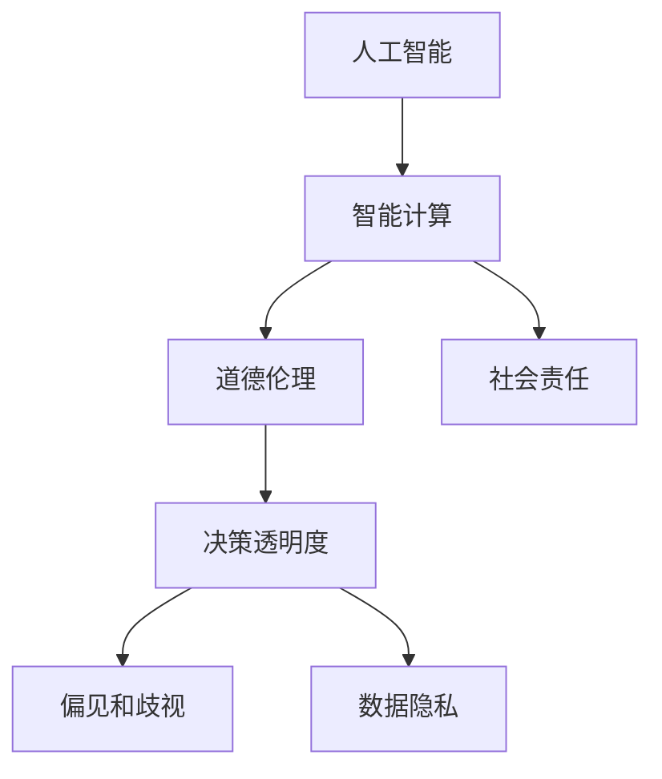

                 

# 人类计算：AI时代的道德和社会责任

## 1. 背景介绍

随着人工智能技术的迅猛发展，人类计算已经从传统的机械计算逐步转向基于AI的智能计算。智能计算的核心在于利用机器学习和大数据技术，对海量数据进行高效处理和分析，从而辅助人类决策。然而，智能计算带来的不仅是效率的提升，更是深刻的伦理、道德和社会责任问题。本文章将围绕智能计算在AI时代面临的道德和社会责任进行系统性的探讨。

## 2. 核心概念与联系

### 2.1 核心概念概述

为更好地理解AI时代的道德和社会责任，本节将介绍几个关键概念：

- 人工智能(AI)：利用机器学习、深度学习等技术模拟人类智能，实现数据处理、模式识别、决策支持等功能。
- 智能计算：基于AI技术对大数据进行高效处理和分析，辅助人类决策的过程。
- 道德伦理：智能计算应用中，涉及到的一系列道德和伦理问题，如隐私保护、算法透明性、偏见和歧视等。
- 社会责任：智能计算在社会治理、公共服务、经济活动等方面的责任和义务。
- 决策透明度：智能系统在决策过程中，如何保证其透明性和可解释性，避免"黑箱"决策。
- 偏见和歧视：AI系统在训练和应用过程中，可能无意中引入或放大现实世界中的偏见和歧视问题。
- 数据隐私：智能计算过程中涉及的大量个人数据，如何保障其隐私性和安全性。

这些核心概念之间通过一些基本原则和法律法规等联系起来，形成了一个复杂的伦理和道德体系。以下是一个简化的Mermaid流程图：



## 3. 核心算法原理 & 具体操作步骤

### 3.1 算法原理概述

智能计算的核心在于利用机器学习算法对大量数据进行训练和推理，辅助人类进行决策。其中，监督学习、无监督学习和强化学习是常用的三种算法范式。监督学习使用有标签数据进行训练，用于分类、回归等任务；无监督学习通过未标签数据进行训练，用于聚类、降维等任务；强化学习通过试错进行训练，用于决策优化等任务。

智能计算的道德和社会责任问题主要体现在算法设计、数据处理、模型应用和监管等多个环节。

### 3.2 算法步骤详解

智能计算的道德和社会责任问题涉及到算法设计、数据处理、模型应用和监管等多个环节。以下是详细步骤：

**Step 1: 算法设计**
- 设计公平透明的算法，避免偏见和歧视。如使用数据增强、正则化技术等手段，防止模型在训练过程中学习到有害信息。
- 设计可解释性高的模型，保证决策过程透明。如采用决策树、规则集等可解释性强的算法。
- 设计隐私保护机制，保护用户隐私。如差分隐私、联邦学习等隐私保护技术。

**Step 2: 数据处理**
- 处理数据中的隐私问题。如去标识化、加密处理等隐私保护技术。
- 处理数据中的偏见和歧视问题。如数据清洗、样本重采样等技术。
- 确保数据的质量和代表性。如数据集的分层抽样、数据标注等。

**Step 3: 模型应用**
- 确保模型在不同场景下的鲁棒性和泛化能力。如对抗训练、泛化测试等技术。
- 确保模型的安全性。如检测模型中的漏洞，防止恶意攻击。
- 确保模型的可解释性和透明性。如可解释性模型、决策可视化等技术。

**Step 4: 监管**
- 建立监管机制，确保算法使用的合规性。如法律法规、伦理准则等。
- 建立评估体系，评估算法的道德和社会责任。如影响评估、伦理审查等。
- 建立反馈机制，及时处理算法应用的负面影响。如用户投诉、伦理投诉等。

### 3.3 算法优缺点

智能计算的道德和社会责任问题涉及到算法设计、数据处理、模型应用和监管等多个环节。以下是步骤的优缺点：

**优点**：
- 数据处理能力强大，能够在短时间内处理大量复杂数据。
- 辅助决策过程准确，能提供数据驱动的决策支持。
- 数据共享和合作性高，能够实现跨领域、跨地域的协同计算。

**缺点**：
- 算法复杂度较高，难以解释和理解。
- 数据隐私和安全问题难以彻底解决。
- 偏见和歧视问题难以完全避免，可能影响决策的公平性。

### 3.4 算法应用领域

智能计算在多个领域都有广泛的应用，以下是几个典型场景：

**医疗健康**：利用AI技术辅助疾病诊断、个性化治疗、药物研发等。

**金融服务**：利用AI技术进行信用评估、风险管理、欺诈检测等。

**教育培训**：利用AI技术进行智能推荐、自动化评估、个性化教学等。

**智能交通**：利用AI技术进行交通监控、预测、路径规划等。

**公共安全**：利用AI技术进行视频监控、犯罪分析、应急响应等。

## 4. 数学模型和公式 & 详细讲解 & 举例说明

### 4.1 数学模型构建

智能计算的道德和社会责任问题可以通过数学模型进行建模和分析。以下是几个典型的数学模型：

- **线性回归模型**：用于处理连续变量和离散变量的预测和分类任务。
- **决策树模型**：用于处理多分类问题，具有可解释性和直观性。
- **支持向量机模型**：用于处理分类问题，具有较好的泛化能力和鲁棒性。

### 4.2 公式推导过程

以线性回归模型为例，其公式推导过程如下：

设训练数据集为 $D=\{(x_i, y_i)\}_{i=1}^N$，其中 $x_i$ 为输入特征向量，$y_i$ 为输出标签。线性回归模型的目标是最小化误差函数：

$$
L(w, b) = \frac{1}{2N} \sum_{i=1}^N (y_i - \hat{y}_i)^2
$$

其中，$\hat{y}_i = wx_i + b$，$w$ 和 $b$ 为模型参数。求解最小化问题，可以得到：

$$
w = (\frac{1}{2N} \sum_{i=1}^N x_ix_i^T)^{-1} \sum_{i=1}^N x_iy_i
$$

### 4.3 案例分析与讲解

以医疗健康领域为例，分析智能计算的道德和社会责任问题。

**医疗数据隐私**：智能计算涉及大量个人健康数据，如何保障这些数据的隐私性和安全性是一个重要问题。差分隐私技术可以通过向噪声扰动加入一定程度的随机性，保护用户隐私。

**医疗决策透明**：智能系统在辅助医生进行诊断和治疗决策时，如何保证其透明性和可解释性是一个关键问题。决策树和可解释性模型可以用于辅助医生理解智能系统的决策依据。

**医疗偏见和歧视**：智能系统在训练过程中，可能会学习到现实世界中的偏见和歧视问题。样本重采样和正则化技术可以用于处理这一问题，确保决策的公平性。

## 5. 项目实践：代码实例和详细解释说明

### 5.1 开发环境搭建

智能计算的应用开发需要特定的工具和环境。以下是搭建开发环境的步骤：

1. 安装Python和必要的依赖包。如TensorFlow、PyTorch、scikit-learn等。

2. 安装相关的AI平台和框架，如AWS、Google Cloud、Azure等。

3. 安装数据处理工具，如Pandas、NumPy等。

4. 安装数据可视化工具，如Matplotlib、Seaborn等。

5. 安装监控和报警工具，如Prometheus、Grafana等。

### 5.2 源代码详细实现

以医疗数据隐私保护为例，介绍代码实现。

```python
import pandas as pd
import numpy as np
from sklearn.model_selection import train_test_split
from sklearn.linear_model import LogisticRegression

# 加载数据集
data = pd.read_csv('medical_data.csv')

# 数据预处理
X = data.drop('label', axis=1)
y = data['label']

# 数据增强
X = pd.get_dummies(X, prefix_sep='_')
X_train, X_test, y_train, y_test = train_test_split(X, y, test_size=0.2, random_state=42)

# 训练模型
model = LogisticRegression()
model.fit(X_train, y_train)

# 差分隐私
def laplace_mechanism(sensitivity, epsilon):
    scale = sensitivity / epsilon
    return np.random.laplace(0, scale, size=sensitivity.shape)

# 应用差分隐私
data_encoded = np.random.laplace(data.values, sensitivity=1, epsilon=1)
data_encoded = pd.DataFrame(data_encoded)

# 保存数据
data_encoded.to_csv('encrypted_data.csv', index=False)
```

### 5.3 代码解读与分析

上述代码实现了对医疗数据的隐私保护，具体步骤如下：

1. 加载数据集，并进行数据预处理。

2. 将数据增强为虚拟变量，并进行训练集和测试集的划分。

3. 训练Logistic回归模型。

4. 应用差分隐私技术，将数据进行扰动处理。

5. 保存处理后的数据，防止数据泄露。

## 6. 实际应用场景

智能计算的道德和社会责任问题涉及到多个领域。以下是几个典型应用场景：

### 6.1 医疗健康

**医疗数据隐私**：智能计算在医疗健康领域的应用，涉及大量的患者健康数据，如何保护这些数据的隐私性和安全性是一个重要问题。差分隐私技术可以通过向噪声扰动加入一定程度的随机性，保护用户隐私。

**医疗决策透明**：智能系统在辅助医生进行诊断和治疗决策时，如何保证其透明性和可解释性是一个关键问题。决策树和可解释性模型可以用于辅助医生理解智能系统的决策依据。

**医疗偏见和歧视**：智能系统在训练过程中，可能会学习到现实世界中的偏见和歧视问题。样本重采样和正则化技术可以用于处理这一问题，确保决策的公平性。

### 6.2 金融服务

**信用评估**：智能计算在金融服务领域的应用，可以用于信用评估和风险管理。机器学习算法可以对客户信用评分进行预测，辅助金融机构进行贷款审批。

**欺诈检测**：智能计算可以用于欺诈检测，通过对客户行为数据的分析，识别出潜在的欺诈行为。

**数据隐私**：金融服务领域涉及大量敏感信息，如何保护客户隐私是一个重要问题。差分隐私技术可以用于保护客户数据的安全性。

### 6.3 教育培训

**个性化推荐**：智能计算在教育培训领域的应用，可以用于个性化推荐。机器学习算法可以对学生的学习行为进行分析和预测，提供个性化的学习内容和建议。

**自动化评估**：智能计算可以用于自动化评估，通过对学生的作业和考试进行自动评分，减轻教师负担。

**数据隐私**：教育培训领域涉及大量学生数据，如何保护这些数据的隐私性和安全性是一个关键问题。差分隐私技术可以用于保护学生数据的安全性。

## 7. 工具和资源推荐

### 7.1 学习资源推荐

以下是一些推荐的资源，帮助理解智能计算的道德和社会责任问题：

1. **《人工智能伦理与道德》**：系统介绍人工智能的伦理和道德问题，涵盖隐私保护、决策透明性、偏见和歧视等多个方面。

2. **《机器学习道德和社会责任》**：深入探讨机器学习在应用过程中面临的伦理和社会责任问题，提供解决方案和指导。

3. **Kaggle竞赛**：参与Kaggle数据科学竞赛，实践和理解智能计算在实际应用中的道德和社会责任问题。

4. **Coursera课程**：Coursera提供了一系列关于人工智能伦理和道德的课程，涵盖隐私保护、数据安全、偏见和歧视等多个方面。

5. **arXiv论文**：arXiv上有很多关于智能计算的伦理和道德问题的论文，可以帮助深入理解这一问题。

### 7.2 开发工具推荐

以下是一些推荐的开发工具，用于智能计算的开发：

1. **TensorFlow**：Google开发的开源深度学习框架，支持多种模型训练和推理。

2. **PyTorch**：Facebook开发的开源深度学习框架，灵活易用，支持动态计算图。

3. **Keras**：高层次的深度学习框架，易于上手，支持多种模型训练和推理。

4. **Jupyter Notebook**：Python的交互式开发环境，支持代码编写和数据可视化。

5. **AWS SageMaker**：亚马逊提供的AI开发平台，支持大规模分布式训练和推理。

### 7.3 相关论文推荐

以下是一些推荐的论文，深入探讨智能计算的伦理和社会责任问题：

1. **《人工智能伦理问题的挑战》**：系统介绍人工智能伦理问题，涵盖隐私保护、偏见和歧视、决策透明性等多个方面。

2. **《机器学习算法的公平性研究》**：深入探讨机器学习算法的公平性问题，提供解决方法和指导。

3. **《差分隐私：理论、算法与应用》**：介绍差分隐私技术，保障数据隐私和安全。

4. **《基于人工智能的决策透明性》**：深入探讨人工智能系统在决策过程中透明性和可解释性的问题。

5. **《智能计算中的偏见和歧视问题》**：深入探讨智能计算中的偏见和歧视问题，提供解决方法和指导。

## 8. 总结：未来发展趋势与挑战

### 8.1 研究成果总结

智能计算在AI时代面临的道德和社会责任问题已经引起广泛关注。当前的研究成果主要集中在以下方面：

1. 隐私保护：差分隐私、联邦学习等技术已经广泛应用于数据保护。

2. 决策透明性：决策树、可解释性模型等方法已经用于辅助决策透明性。

3. 偏见和歧视：样本重采样、正则化技术等方法用于处理偏见和歧视问题。

4. 数据共享和合作：跨领域、跨地域的数据共享和合作已经得到广泛应用。

### 8.2 未来发展趋势

未来的发展趋势主要包括以下几个方面：

1. 隐私保护技术将不断完善。差分隐私、联邦学习等技术将进一步普及和改进，保护用户隐私。

2. 决策透明性将得到更多关注。更多的可解释性模型和透明性方法将应用于实际场景中，提高系统的可信度。

3. 偏见和歧视问题将得到更深入研究。更多的公平性方法和样本重采样技术将用于处理偏见和歧视问题，确保决策的公平性。

4. 数据共享和合作将更加普遍。更多的跨领域、跨地域数据共享和合作将推动智能计算的发展。

### 8.3 面临的挑战

智能计算面临的挑战主要包括以下几个方面：

1. 数据隐私和安全问题难以彻底解决。如何在保护隐私的同时，保证数据的质量和代表性，是一个重要问题。

2. 偏见和歧视问题难以完全避免。如何在模型训练和应用过程中，避免引入和放大偏见和歧视，是一个关键问题。

3. 算法复杂度较高，难以解释和理解。如何在保证算法准确性的同时，提高算法的可解释性和透明性，是一个重要问题。

4. 数据共享和合作过程中，可能存在隐私泄露和数据滥用风险。如何保障数据共享和合作的安全性，是一个关键问题。

### 8.4 研究展望

未来的研究展望主要包括以下几个方面：

1. 隐私保护技术将更加注重跨领域、跨地域的隐私保护，确保数据隐私的安全性。

2. 决策透明性将得到更多关注，更多的可解释性模型和透明性方法将应用于实际场景中，提高系统的可信度。

3. 偏见和歧视问题将得到更深入研究，更多的公平性方法和样本重采样技术将用于处理偏见和歧视问题，确保决策的公平性。

4. 数据共享和合作将更加普遍，更多的跨领域、跨地域数据共享和合作将推动智能计算的发展。

## 9. 附录：常见问题与解答

**Q1: 智能计算的道德和社会责任问题有哪些？**

A: 智能计算的道德和社会责任问题主要包括以下几个方面：

1. 隐私保护：如何保护用户隐私，避免数据泄露和滥用。

2. 决策透明性：如何保证系统的透明性和可解释性，避免"黑箱"决策。

3. 偏见和歧视：如何避免引入和放大偏见和歧视，确保决策的公平性。

4. 数据隐私和安全问题难以彻底解决：如何在保护隐私的同时，保证数据的质量和代表性。

5. 算法复杂度较高，难以解释和理解：如何在保证算法准确性的同时，提高算法的可解释性和透明性。

6. 数据共享和合作过程中，可能存在隐私泄露和数据滥用风险：如何保障数据共享和合作的安全性。

**Q2: 如何保护数据隐私？**

A: 数据隐私保护主要包括以下几个方面：

1. 差分隐私：通过向噪声扰动加入一定程度的随机性，保护用户隐私。

2. 联邦学习：通过分布式计算，保护数据隐私。

3. 加密技术：通过数据加密，保护数据隐私。

**Q3: 如何避免偏见和歧视？**

A: 避免偏见和歧视主要包括以下几个方面：

1. 样本重采样：通过重新采样，处理数据中的偏见和歧视问题。

2. 正则化技术：通过正则化，处理模型中的偏见和歧视问题。

3. 多样性数据集：通过多样性数据集，避免数据中的偏见和歧视问题。

**Q4: 如何保证决策透明性？**

A: 保证决策透明性主要包括以下几个方面：

1. 可解释性模型：通过可解释性模型，提高系统的透明性。

2. 决策可视化：通过决策可视化，展示系统的决策过程。

3. 规则集：通过规则集，提高系统的透明性。

**Q5: 如何保证数据共享和合作的安全性？**

A: 保证数据共享和合作的安全性主要包括以下几个方面：

1. 差分隐私：通过差分隐私，保护共享数据的隐私性。

2. 联邦学习：通过联邦学习，保护共享数据的隐私性。

3. 数据脱敏：通过数据脱敏，保护共享数据的隐私性。

---

作者：禅与计算机程序设计艺术 / Zen and the Art of Computer Programming

