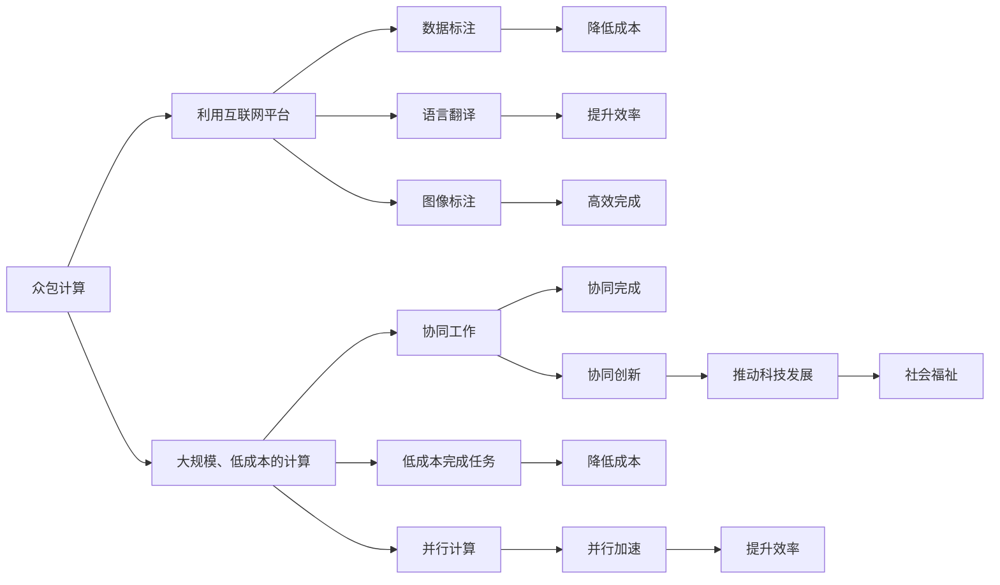

                 

# 人类计算：一个不断发展的领域

## 1. 背景介绍

### 1.1 问题由来

随着人工智能(AI)技术的飞速发展，计算能力已经成为制约AI技术突破的重要瓶颈。虽然当前算力水平已显著提升，但面对愈加复杂、规模庞大的数据与模型，现有的计算资源仍显得捉襟见肘。

然而，计算资源并不是人类计算的唯一限制因素。事实上，人类的智慧和创造力是另一种宝贵的计算资源，它可以被用来辅助或替代一部分计算任务，从而在一定程度上缓解算力资源的不足。

因此，研究如何更高效地利用人类的智慧和计算能力，将计算任务合理分配给人和机器，是当前计算领域的重要课题。这不仅能够提高计算效率，降低计算成本，还能推动计算科学的发展，拓宽计算应用的范围。

### 1.2 问题核心关键点

为了实现这一目标，当前研究主要集中在以下几个关键点上：

1. **众包计算**：利用互联网平台，将计算任务分配给全球的志愿者，通过他们的协同工作来解决问题。例如，基于众包平台Gengo和Amazon Mechanical Turk，可以进行语言翻译、数据标注等任务。

2. **人类-机器协作**：通过将人类智慧融入计算流程，提升AI系统对复杂问题的理解和处理能力。例如，AlphaFold 2在蛋白质折叠问题上的突破，便是通过与人类生物学专家的合作，结合神经网络和物理学模型共同完成的。

3. **计算推理**：利用人类逻辑推理和直觉判断，辅助机器进行决策和优化。例如，在AlphaGo中，人类棋手的直觉判断和经验被用来指导机器的决策。

4. **计算并行化**：通过并行计算将复杂的计算任务拆分为多个子任务，同时分配给多个人类或机器并行计算。例如，Netflix 利用全球用户的协同计算来破解电影推荐算法中的协同过滤难题。

5. **计算外包**：将部分计算任务外包给商业云服务提供商，通过他们的强大算力资源来加速计算。例如，AWS、Google Cloud、Microsoft Azure等云平台提供了丰富的计算服务，能够支持各种大规模计算任务。

### 1.3 问题研究意义

研究如何更高效地利用人类计算资源，具有重要的理论和实际意义：

1. **降低计算成本**：通过利用廉价的人类计算资源，可以显著降低计算任务所需的成本。这使得更多的科研机构和企业能够承担高成本的计算任务，推动科学和技术的发展。

2. **提升计算效率**：人类智慧和判断能力可以辅助机器完成复杂的计算任务，提升计算效率和准确性。这在处理需要大量创造力和直觉判断的问题时尤为明显。

3. **推动计算科学发展**：研究人类计算的本质和规律，能够丰富计算科学的理论体系，推动计算科学的发展。

4. **拓宽计算应用范围**：利用人类智慧和计算资源，可以拓展计算的应用领域，解决更多实际问题。例如，在药物设计、气候模拟、社会行为分析等领域，人类计算可以发挥重要作用。

5. **促进社会福祉**：将人类计算融入计算流程，可以提升社会福祉，如通过大规模数据标注提升医疗诊断的准确性，或者通过众包平台促进就业。

## 2. 核心概念与联系

### 2.1 核心概念概述

为了更好地理解人类计算的原理和应用，本节将介绍几个关键概念：

- **众包计算**：利用互联网平台，将计算任务分配给大量志愿者的协同工作方式。通过这种方式，可以大规模、低成本地完成各种计算任务。

- **人类-机器协作**：将人类的智慧和判断能力融入机器计算流程，提升AI系统对复杂问题的理解。

- **计算推理**：利用人类逻辑推理和直觉判断，辅助机器进行决策和优化。

- **计算并行化**：通过并行计算，将复杂的计算任务分解为多个子任务，同时分配给多个计算资源并行计算。

- **计算外包**：将计算任务外包给商业云服务提供商，利用其强大的算力资源来加速计算。

这些概念之间存在紧密联系，共同构成了人类计算的完整框架。通过合理利用这些计算资源，能够更好地解决各类计算问题。

### 2.2 核心概念原理和架构的 Mermaid 流程图



该流程图展示了众包计算、人类-机器协作、计算推理、计算并行化和计算外包之间的关系和作用。

## 3. 核心算法原理 & 具体操作步骤

### 3.1 算法原理概述

基于人类计算的核心算法原理可以概括为：

1. **任务分解**：将复杂的计算任务分解为多个子任务，并分配给不同的人或机器并行计算。

2. **协同工作**：通过互联网平台，将多个计算资源进行协同工作，共同完成计算任务。

3. **逻辑推理**：利用人类逻辑推理和直觉判断，辅助机器进行决策和优化。

4. **优化调度**：通过优化算法，合理分配计算资源，最大化计算效率。

5. **反馈机制**：通过反馈机制，不断优化计算任务和资源分配策略，提升计算效果。

### 3.2 算法步骤详解

1. **任务分解**：
   - **确定计算任务**：明确计算任务的目标和要求，将其分解为多个子任务。
   - **划分任务维度**：将任务按维度进行划分，如按空间、时间、参数等维度。
   - **任务分配**：将任务分配给多个计算资源，如人类工作者、机器或云服务。

2. **协同工作**：
   - **任务协调**：通过互联网平台，协调多个计算资源的工作，确保任务进度和质量。
   - **数据共享**：共享计算过程中的数据和中间结果，加速计算进度。
   - **结果合并**：将各个计算资源的结果进行合并，得到最终计算结果。

3. **逻辑推理**：
   - **任务评估**：对计算任务进行评估，识别关键节点和难点。
   - **专家辅助**：邀请专家进行逻辑推理和判断，辅助机器完成复杂计算任务。
   - **模型优化**：根据专家反馈，优化计算模型和策略。

4. **优化调度**：
   - **资源评估**：评估可用计算资源的性能和成本。
   - **算法优化**：选择和优化计算调度算法，提高计算效率。
   - **任务动态调整**：根据计算进度和资源变化，动态调整任务分配策略。

5. **反馈机制**：
   - **结果反馈**：收集计算结果，进行分析和评估。
   - **错误纠正**：发现计算错误，进行纠正和优化。
   - **策略调整**：根据反馈结果，调整计算策略和任务分配。

### 3.3 算法优缺点

基于人类计算的核心算法具有以下优点：

- **成本低廉**：利用大量廉价的人类工作者，可以大幅度降低计算成本。
- **灵活性强**：任务可以灵活地分解和分配，适应不同的计算场景。
- **计算效率高**：通过协同工作和人机协作，可以显著提升计算效率。

但同时也存在一些缺点：

- **数据质量不可控**：众包平台上的数据质量和标注可能存在波动。
- **协同复杂度高**：协调大量计算资源需要复杂的管理和调度。
- **专家依赖强**：依赖专家进行逻辑推理和判断，可能导致计算过程复杂。

### 3.4 算法应用领域

基于人类计算的核心算法在以下几个领域具有广泛应用：

- **数据标注**：利用众包平台进行大规模数据标注，提高数据质量和标注效率。
- **语言翻译**：利用众包平台进行多语言翻译，降低翻译成本，提升翻译质量。
- **图像识别**：利用众包平台进行大规模图像标注，提高图像识别模型的准确性。
- **复杂计算**：利用人类-机器协作和计算推理，解决复杂计算问题，如蛋白质折叠、气候模拟等。
- **科学计算**：利用协同计算和云服务，加速科学计算任务，推动科研进展。

## 4. 数学模型和公式 & 详细讲解 & 举例说明

### 4.1 数学模型构建

为了更好地理解人类计算的数学模型，本节将介绍几个关键的数学模型：

- **分布式计算模型**：通过将计算任务分解为多个子任务，并分配给多个计算资源并行计算的模型。
- **协同工作模型**：通过互联网平台，协调多个计算资源协同工作，共同完成任务的模型。
- **逻辑推理模型**：利用人类逻辑推理和直觉判断，辅助机器进行决策和优化的模型。
- **优化调度模型**：通过优化算法，合理分配计算资源，最大化计算效率的模型。
- **反馈机制模型**：通过收集计算结果，进行分析和反馈，不断优化计算过程的模型。

### 4.2 公式推导过程

以分布式计算模型为例，推导其计算公式：

设计算任务 $T$ 需要 $n$ 个子任务，分配给 $m$ 个计算资源 $R_1, R_2, ..., R_m$ 进行并行计算。每个子任务 $T_i$ 需要 $t_i$ 的时间完成，计算资源 $R_j$ 的计算速率 $v_j$ 为常数。

计算时间 $T_{total}$ 的计算公式为：

$$
T_{total} = \sum_{i=1}^n \sum_{j=1}^m \frac{t_i}{v_j}
$$

其中，第一个求和表示计算所有子任务所需时间，第二个求和表示每个子任务分配给每个计算资源所需时间。

### 4.3 案例分析与讲解

以数据标注任务为例，解释基于人类计算的计算过程：

1. **任务分解**：将大规模数据标注任务分解为多个子任务，如单个样本的标注、多个样本的标注等。

2. **任务分配**：将每个子任务分配给多个标注工人进行协同工作。

3. **协同工作**：标注工人通过互联网平台协同工作，共享标注结果和进度。

4. **逻辑推理**：专家进行逻辑推理和判断，确保标注结果的准确性。

5. **优化调度**：优化任务分配策略，确保每个标注工人的工作负载均衡。

6. **反馈机制**：收集标注结果，进行分析和反馈，不断优化标注过程。

## 5. 项目实践：代码实例和详细解释说明

### 5.1 开发环境搭建

在进行人类计算实践前，我们需要准备好开发环境。以下是使用Python进行网络爬虫开发的环境配置流程：

1. 安装Anaconda：从官网下载并安装Anaconda，用于创建独立的Python环境。

2. 创建并激活虚拟环境：
```bash
conda create -n http-crawler python=3.8 
conda activate http-crawler
```

3. 安装必要库：
```bash
pip install requests beautifulsoup4
```

4. 安装爬虫框架：
```bash
pip install scrapy
```

5. 安装管理工具：
```bash
pip install scrapy-splash
```

完成上述步骤后，即可在`http-crawler`环境中开始网络爬虫开发。

### 5.2 源代码详细实现

以下是一个使用Scrapy框架进行网页爬取和数据标注的Python代码实现。

```python
import scrapy
from scrapy.http import Request
from scrapy.spider import Spider
from bs4 import BeautifulSoup

class MySpider(scrapy.Spider):
    name = 'my_spider'
    start_urls = ['http://example.com']

    def parse(self, response):
        soup = BeautifulSoup(response.text, 'html.parser')
        # 提取数据
        data = soup.find('div', {'class': 'content'}).text
        yield {'data': data}

class DataAnnotator:
    def __init__(self, annotators):
        self.annotators = annotators

    def annotate(self, data):
        for annotator in self.annotators:
            data = annotator.annotate(data)
        return data

class AnnotationService:
    def annotate(self, data):
        # 调用外部服务进行数据标注
        pass

class MyPipeline:
    def process_item(self, item, spider):
        annotated_data = AnnotationService.annotate(item['data'])
        return annotated_data
```

首先，定义一个Scrapy爬虫，用于爬取网页数据：

```python
class MySpider(scrapy.Spider):
    name = 'my_spider'
    start_urls = ['http://example.com']

    def parse(self, response):
        soup = BeautifulSoup(response.text, 'html.parser')
        # 提取数据
        data = soup.find('div', {'class': 'content'}).text
        yield {'data': data}
```

然后，定义一个数据标注器，用于对爬取到的数据进行标注：

```python
class DataAnnotator:
    def __init__(self, annotators):
        self.annotators = annotators

    def annotate(self, data):
        for annotator in self.annotators:
            data = annotator.annotate(data)
        return data
```

接着，定义一个数据标注服务，用于调用外部服务进行数据标注：

```python
class AnnotationService:
    def annotate(self, data):
        # 调用外部服务进行数据标注
        pass
```

最后，定义一个管道，用于处理爬虫抓取的数据并进行标注：

```python
class MyPipeline:
    def process_item(self, item, spider):
        annotated_data = AnnotationService.annotate(item['data'])
        return annotated_data
```

整个爬虫系统通过Scrapy框架进行搭建，使用Python爬虫库进行网页爬取，并调用外部服务进行数据标注。

### 5.3 代码解读与分析

让我们再详细解读一下关键代码的实现细节：

**MySpider类**：
- **name**属性：指定爬虫名称。
- **start_urls**属性：指定起始URL。
- **parse**方法：解析网页，提取数据并返回。

**DataAnnotator类**：
- **__init__方法**：初始化数据标注器，存储所有标注器对象。
- **annotate方法**：遍历所有标注器对象，对数据进行标注。

**AnnotationService类**：
- **annotate方法**：调用外部服务进行数据标注。

**MyPipeline类**：
- **process_item方法**：处理爬虫抓取的数据，调用数据标注服务进行标注。

整个系统通过Scrapy框架进行搭建，使用Python爬虫库进行网页爬取，并调用外部服务进行数据标注。开发者可以将更多精力放在爬虫逻辑和标注策略的优化上，而不必过多关注底层的实现细节。

## 6. 实际应用场景

### 6.1 网络爬虫

网络爬虫是利用人类计算的典型应用场景之一。通过利用廉价的人类工作者，可以快速高效地爬取互联网上的大量数据。这种基于人类计算的爬虫系统，可以大大降低开发成本和维护难度，加速数据的收集和处理。

### 6.2 数据标注

数据标注是机器学习任务中不可或缺的一部分。利用人类计算进行数据标注，可以大幅提升标注质量和效率。例如，在自然语言处理任务中，利用众包平台进行大规模文本数据标注，可以加速模型训练和优化。

### 6.3 协同开发

协同开发是软件开发中的常见需求。利用人类计算，可以将复杂的软件任务分解为多个子任务，通过协同工作的方式高效完成。例如，大型软件开发项目中，可以利用众包平台进行代码编写、测试、文档编写等任务的分工协作。

### 6.4 数据分析

数据分析是数据科学中的重要环节。利用人类计算，可以对大规模数据集进行快速分析，并提取有价值的信息。例如，在大数据分析中，可以利用众包平台进行数据清洗、特征提取、数据可视化等任务。

### 6.5 科学计算

科学计算是科研工作中的重要工具。利用人类计算，可以进行大规模的科学计算，推动科研进展。例如，在气候模拟、蛋白质折叠等复杂计算任务中，可以通过人类-机器协作和计算推理，加速计算过程。

## 7. 工具和资源推荐

### 7.1 学习资源推荐

为了帮助开发者系统掌握人类计算的理论基础和实践技巧，这里推荐一些优质的学习资源：

1. **《人类计算：原理与实践》**：介绍人类计算的基本原理和应用，包括众包计算、人类-机器协作、计算推理等。
2. **Coursera的《人类计算》课程**：斯坦福大学的Coursera课程，涵盖人类计算的基本概念和应用，适合入门学习。
3. **《人机协作的智慧》**：介绍人机协作的基本原理和实践，包括协同工作、任务分解、优化调度等。
4. **Kaggle数据科学竞赛**：通过参加数据科学竞赛，可以锻炼数据分析和建模能力，了解人类计算在实际问题中的应用。
5. **Scrapy官方文档**：Scrapy框架的官方文档，提供了丰富的使用案例和最佳实践，是学习网络爬虫开发的必备资料。

### 7.2 开发工具推荐

高效的开发离不开优秀的工具支持。以下是几款用于人类计算开发的常用工具：

1. **Scrapy**：Python网络爬虫框架，支持异步爬取和分布式爬取，适合大规模数据采集任务。
2. **BeautifulSoup**：Python解析HTML和XML标签的库，便于提取网页内容。
3. **Splash**：浏览器代理工具，支持动态页面渲染，适合处理复杂的网页解析任务。
4. **Google Colab**：谷歌提供的免费Jupyter Notebook环境，支持GPU和TPU计算，适合高效实验。
5. **Scrapy-splash**：Scrapy和Splash的结合，支持动态页面渲染和分布式爬取。

### 7.3 相关论文推荐

人类计算的研究源于学界的持续探索。以下是几篇奠基性的相关论文，推荐阅读：

1. **《分布式计算：原理与实践》**：介绍分布式计算的基本原理和应用，包括任务分解、协同工作、优化调度等。
2. **《协同工作：原则与实践》**：介绍协同工作的基本原理和应用，包括任务协同、数据共享、反馈机制等。
3. **《人机协作：理论与实践》**：介绍人机协作的基本原理和应用，包括计算推理、逻辑推理、决策优化等。
4. **《人工智能与人类计算：未来展望》**：探讨人工智能与人类计算的结合，探索未来发展的方向和潜力。

## 8. 总结：未来发展趋势与挑战

### 8.1 总结

本文对基于人类计算的核心算法进行了全面系统的介绍。首先阐述了人类计算的研究背景和意义，明确了人类计算在降低计算成本、提升计算效率、推动科学发展等方面的重要价值。其次，从原理到实践，详细讲解了人类计算的数学模型和核心算法，给出了网络爬虫开发的完整代码实例。同时，本文还广泛探讨了人类计算在网络爬虫、数据标注、协同开发、数据分析和科学计算等多个领域的应用前景，展示了人类计算的巨大潜力。此外，本文精选了人类计算技术的各类学习资源，力求为读者提供全方位的技术指引。

通过本文的系统梳理，可以看到，基于人类计算的分布式计算、协同工作、计算推理和优化调度等技术，正在成为现代计算的重要手段，极大地提升了计算效率和应用范围。未来，伴随人类计算技术的不断进步，人类智慧和计算资源必将进一步融合，推动计算科学的发展，拓展计算应用的边界。

### 8.2 未来发展趋势

展望未来，人类计算技术将呈现以下几个发展趋势：

1. **计算资源智能化**：通过智能算法优化任务分配和资源调度，进一步提升计算效率和质量。
2. **人机协同深化**：利用人类智慧和计算资源，进行更复杂的任务协同，推动人机协作的深度发展。
3. **计算流程自动化**：通过自动化工具和平台，简化计算流程，降低人工干预和操作难度。
4. **计算环境优化**：通过优化计算平台和基础设施，提升计算环境的稳定性和可靠性。
5. **计算应用泛化**：拓展人类计算的应用领域，如金融分析、医疗诊断、智能制造等。

### 8.3 面临的挑战

尽管人类计算技术已经取得了显著成就，但在迈向更加智能化、普适化应用的过程中，它仍面临着诸多挑战：

1. **数据质量波动**：众包平台上的数据质量和标注可能存在波动，影响计算结果的准确性。
2. **协同复杂度高**：协调大量计算资源需要复杂的管理和调度，可能影响计算效率。
3. **专家依赖强**：依赖专家进行逻辑推理和判断，可能导致计算过程复杂。
4. **计算平台局限**：现有计算平台和工具可能难以满足复杂的计算需求，需要不断优化和扩展。
5. **隐私和安全风险**：利用人类计算可能涉及敏感数据的传输和处理，存在隐私和安全风险。

### 8.4 研究展望

面对人类计算面临的这些挑战，未来的研究需要在以下几个方面寻求新的突破：

1. **数据质量控制**：通过智能算法和数据标注策略，提高数据标注的准确性和一致性。
2. **协同系统优化**：开发更高效协同系统，降低计算资源调度和管理的复杂度。
3. **计算流程自动化**：利用自动化工具和平台，简化计算流程，降低人工干预和操作难度。
4. **计算环境优化**：通过优化计算平台和基础设施，提升计算环境的稳定性和可靠性。
5. **隐私和安全保障**：通过加密、匿名化等技术，保护敏感数据的隐私和安全。

这些研究方向的探索，必将引领人类计算技术迈向更高的台阶，为构建安全、可靠、高效、智能的计算系统铺平道路。

## 9. 附录：常见问题与解答

**Q1：人类计算与人工智能有什么区别？**

A: 人工智能强调利用机器进行自动化学习和决策，而人类计算则强调利用人类智慧和计算资源辅助或替代部分计算任务。人类计算与人工智能并非对立，而是相辅相成，通过合理分配计算资源，提升计算效率和效果。

**Q2：如何提高数据标注的质量和效率？**

A: 提高数据标注的质量和效率，可以从以下几个方面入手：
1. **多轮标注**：通过多轮标注和交叉验证，提高标注的一致性和准确性。
2. **标注规范**：制定详细的标注规范，确保标注的一致性和标准化。
3. **标注工具**：使用自动化标注工具，如UIPA等，提升标注效率。
4. **标注审核**：引入专家审核机制，对标注结果进行二次校验。
5. **标注反馈**：建立标注反馈机制，不断优化标注策略和标注结果。

**Q3：如何处理网络爬虫的异常情况？**

A: 处理网络爬虫的异常情况，可以从以下几个方面入手：
1. **异常检测**：通过异常检测算法，识别和处理爬取过程中的异常情况。
2. **请求延迟**：在请求间隔中加入随机延迟，避免频繁请求导致的IP封禁。
3. **代理池**：使用代理池技术，隐藏真实IP地址，防止反爬机制的检测。
4. **重试机制**：对于失败的请求，进行多次重试，保证数据的完整性和可靠性。
5. **数据清洗**：对爬取的数据进行清洗和过滤，去除无用和异常数据。

**Q4：如何提高协同工作的效率和质量？**

A: 提高协同工作的效率和质量，可以从以下几个方面入手：
1. **任务分解**：将复杂任务分解为多个子任务，并分配给多个计算资源并行计算。
2. **协同平台**：使用协同工作平台，如Huawei Compute等，提升协同效率。
3. **任务调度**：使用优化算法进行任务调度，确保计算资源的高效利用。
4. **数据共享**：共享计算过程中的数据和中间结果，加速计算进度。
5. **反馈机制**：建立反馈机制，不断优化计算任务和资源分配策略。

**Q5：如何提高计算推理的准确性和鲁棒性？**

A: 提高计算推理的准确性和鲁棒性，可以从以下几个方面入手：
1. **专家辅助**：邀请专家进行逻辑推理和判断，提高推理的准确性。
2. **模型优化**：优化计算模型和策略，提升推理的鲁棒性。
3. **数据质量控制**：提高输入数据的准确性和一致性，确保推理结果的可靠性。
4. **误差纠正**：及时发现和纠正推理过程中的错误，提高推理效果。
5. **经验积累**：积累大量的推理经验，提升推理模型的智能水平。

**Q6：如何保护数据隐私和安全？**

A: 保护数据隐私和安全，可以从以下几个方面入手：
1. **数据加密**：对敏感数据进行加密处理，防止数据泄露。
2. **匿名化**：对数据进行匿名化处理，保护用户隐私。
3. **访问控制**：设置严格的访问控制机制，确保数据的安全访问。
4. **安全协议**：使用安全协议和加密技术，防止数据在传输过程中的泄露。
5. **审计机制**：建立数据审计机制，及时发现和纠正数据安全问题。

这些常见问题与解答，展示了人类计算在实际应用中的挑战和解决方案，希望能够帮助读者更好地理解和使用人类计算技术。

---

作者：禅与计算机程序设计艺术 / Zen and the Art of Computer Programming

